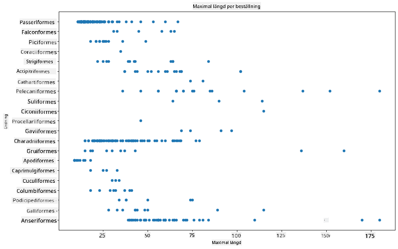
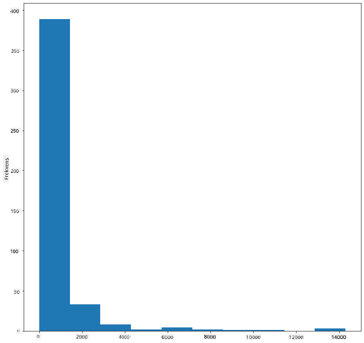
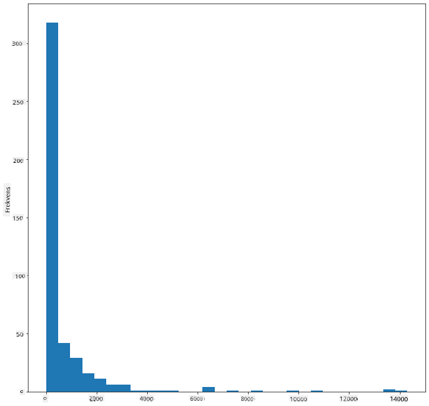
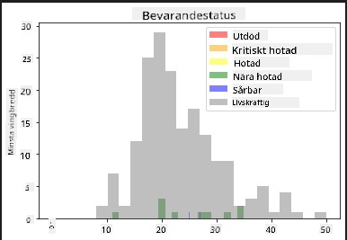
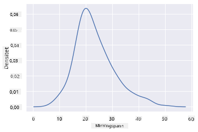
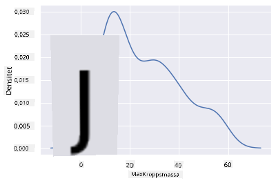
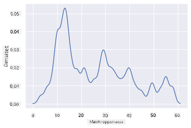
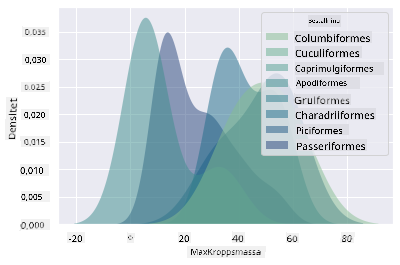
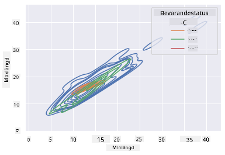

<!--
CO_OP_TRANSLATOR_METADATA:
{
  "original_hash": "87faccac113d772551486a67a607153e",
  "translation_date": "2025-08-26T22:48:46+00:00",
  "source_file": "3-Data-Visualization/10-visualization-distributions/README.md",
  "language_code": "sv"
}
-->
# Visualisera distributioner

| ](../../sketchnotes/10-Visualizing-Distributions.png)|
|:---:|
| Visualisera distributioner - _Sketchnote av [@nitya](https://twitter.com/nitya)_ |

I den föregående lektionen lärde du dig några intressanta fakta om en dataset om fåglar i Minnesota. Du hittade felaktiga data genom att visualisera avvikare och tittade på skillnaderna mellan fågelkategorier baserat på deras maximala längd.

## [Quiz före föreläsningen](https://purple-hill-04aebfb03.1.azurestaticapps.net/quiz/18)
## Utforska datasetet om fåglar

Ett annat sätt att gräva i data är att titta på dess distribution, eller hur data är organiserad längs en axel. Kanske vill du till exempel lära dig om den generella distributionen, för detta dataset, av den maximala vingbredden eller den maximala kroppsmassan för fåglarna i Minnesota.

Låt oss upptäcka några fakta om distributionerna av data i detta dataset. I filen _notebook.ipynb_ i roten av denna lektionsmapp, importera Pandas, Matplotlib och dina data:

```python
import pandas as pd
import matplotlib.pyplot as plt
birds = pd.read_csv('../../data/birds.csv')
birds.head()
```

|      | Namn                         | VetenskapligtNamn      | Kategori              | Ordning      | Familj   | Släkte      | Bevarandestatus    | MinLängd  | MaxLängd  | MinKroppsmassa | MaxKroppsmassa | MinVingbredd | MaxVingbredd |
| ---: | :--------------------------- | :--------------------- | :-------------------- | :----------- | :------- | :---------- | :----------------- | --------: | --------: | -------------: | -------------: | -----------: | -----------: |
|    0 | Svartbukig visslande anka    | Dendrocygna autumnalis | Änder/Gäss/Vattenfåglar | Anseriformes | Anatidae | Dendrocygna | LC                 |        47 |        56 |           652  |          1020  |          76  |          94  |
|    1 | Rostfärgad visslande anka    | Dendrocygna bicolor    | Änder/Gäss/Vattenfåglar | Anseriformes | Anatidae | Dendrocygna | LC                 |        45 |        53 |           712  |          1050  |          85  |          93  |
|    2 | Snögås                      | Anser caerulescens     | Änder/Gäss/Vattenfåglar | Anseriformes | Anatidae | Anser       | LC                 |        64 |        79 |          2050  |          4050  |         135  |         165  |
|    3 | Ross' gås                   | Anser rossii           | Änder/Gäss/Vattenfåglar | Anseriformes | Anatidae | Anser       | LC                 |      57.3 |        64 |          1066  |          1567  |         113  |         116  |
|    4 | Större vitkindad gås         | Anser albifrons        | Änder/Gäss/Vattenfåglar | Anseriformes | Anatidae | Anser       | LC                 |        64 |        81 |          1930  |          3310  |         130  |         165  |

Generellt kan du snabbt titta på hur data är fördelad genom att använda ett spridningsdiagram, som vi gjorde i den föregående lektionen:

```python
birds.plot(kind='scatter',x='MaxLength',y='Order',figsize=(12,8))

plt.title('Max Length per Order')
plt.ylabel('Order')
plt.xlabel('Max Length')

plt.show()
```


Detta ger en översikt över den generella fördelningen av kroppslängd per fågelordning, men det är inte det optimala sättet att visa verkliga fördelningar. Den uppgiften hanteras vanligtvis genom att skapa ett histogram.
## Arbeta med histogram

Matplotlib erbjuder mycket bra sätt att visualisera datafördelning med hjälp av histogram. Denna typ av diagram liknar ett stapeldiagram där fördelningen kan ses via en uppgång och nedgång av staplarna. För att bygga ett histogram behöver du numeriska data. För att bygga ett histogram kan du plotta ett diagram och definiera typen som 'hist' för histogram. Detta diagram visar fördelningen av MaxKroppsmassa för hela datasetets numeriska data. Genom att dela upp den array av data som ges i mindre fack kan det visa fördelningen av datavärdena:

```python
birds['MaxBodyMass'].plot(kind = 'hist', bins = 10, figsize = (12,12))
plt.show()
```


Som du kan se, faller de flesta av de 400+ fåglarna i detta dataset inom intervallet under 2000 för deras Max Kroppsmassa. Få mer insikt i data genom att ändra `bins`-parametern till ett högre nummer, något som 30:

```python
birds['MaxBodyMass'].plot(kind = 'hist', bins = 30, figsize = (12,12))
plt.show()
```


Detta diagram visar fördelningen på ett lite mer detaljerat sätt. Ett diagram som är mindre snedvridet åt vänster kan skapas genom att säkerställa att du endast väljer data inom ett givet intervall:

Filtrera dina data för att få endast de fåglar vars kroppsmassa är under 60, och visa 40 `bins`:

```python
filteredBirds = birds[(birds['MaxBodyMass'] > 1) & (birds['MaxBodyMass'] < 60)]      
filteredBirds['MaxBodyMass'].plot(kind = 'hist',bins = 40,figsize = (12,12))
plt.show()     
```


✅ Prova några andra filter och datapunkter. För att se den fullständiga fördelningen av data, ta bort `['MaxBodyMass']`-filtret för att visa märkta fördelningar.

Histogrammet erbjuder också några trevliga färg- och märkningsförbättringar att prova:

Skapa ett 2D-histogram för att jämföra relationen mellan två fördelningar. Låt oss jämföra `MaxBodyMass` vs. `MaxLength`. Matplotlib erbjuder ett inbyggt sätt att visa konvergens med hjälp av ljusare färger:

```python
x = filteredBirds['MaxBodyMass']
y = filteredBirds['MaxLength']

fig, ax = plt.subplots(tight_layout=True)
hist = ax.hist2d(x, y)
```
Det verkar finnas en förväntad korrelation mellan dessa två element längs en förväntad axel, med en särskilt stark konvergenspunkt:


Histogram fungerar bra som standard för numeriska data. Vad händer om du behöver se fördelningar enligt textdata? 
## Utforska datasetet för fördelningar med hjälp av textdata 

Detta dataset innehåller också bra information om fågelkategorin och dess släkte, art och familj samt dess bevarandestatus. Låt oss gräva i denna bevarandestatusinformation. Vad är fördelningen av fåglar enligt deras bevarandestatus?

> ✅ I datasetet används flera akronymer för att beskriva bevarandestatus. Dessa akronymer kommer från [IUCN Red List Categories](https://www.iucnredlist.org/), en organisation som katalogiserar arters status.
> 
> - CR: Kritiskt hotad
> - EN: Hotad
> - EX: Utdöd
> - LC: Minst bekymrad
> - NT: Nära hotad
> - VU: Sårbar

Dessa är textbaserade värden, så du måste göra en transformering för att skapa ett histogram. Använd dataframe `filteredBirds` för att visa dess bevarandestatus tillsammans med dess MinVingbredd. Vad ser du?

```python
x1 = filteredBirds.loc[filteredBirds.ConservationStatus=='EX', 'MinWingspan']
x2 = filteredBirds.loc[filteredBirds.ConservationStatus=='CR', 'MinWingspan']
x3 = filteredBirds.loc[filteredBirds.ConservationStatus=='EN', 'MinWingspan']
x4 = filteredBirds.loc[filteredBirds.ConservationStatus=='NT', 'MinWingspan']
x5 = filteredBirds.loc[filteredBirds.ConservationStatus=='VU', 'MinWingspan']
x6 = filteredBirds.loc[filteredBirds.ConservationStatus=='LC', 'MinWingspan']

kwargs = dict(alpha=0.5, bins=20)

plt.hist(x1, **kwargs, color='red', label='Extinct')
plt.hist(x2, **kwargs, color='orange', label='Critically Endangered')
plt.hist(x3, **kwargs, color='yellow', label='Endangered')
plt.hist(x4, **kwargs, color='green', label='Near Threatened')
plt.hist(x5, **kwargs, color='blue', label='Vulnerable')
plt.hist(x6, **kwargs, color='gray', label='Least Concern')

plt.gca().set(title='Conservation Status', ylabel='Min Wingspan')
plt.legend();
```



Det verkar inte finnas någon bra korrelation mellan minsta vingbredd och bevarandestatus. Testa andra element i datasetet med denna metod. Du kan också prova olika filter. Hittar du någon korrelation?

## Täthetsdiagram

Du kanske har märkt att de histogram vi har tittat på hittills är "stegade" och inte flödar smidigt i en båge. För att visa ett smidigare täthetsdiagram kan du prova ett täthetsdiagram.

För att arbeta med täthetsdiagram, bekanta dig med ett nytt plotbibliotek, [Seaborn](https://seaborn.pydata.org/generated/seaborn.kdeplot.html). 

Ladda Seaborn och prova ett grundläggande täthetsdiagram:

```python
import seaborn as sns
import matplotlib.pyplot as plt
sns.kdeplot(filteredBirds['MinWingspan'])
plt.show()
```


Du kan se hur diagrammet ekar det tidigare för MinVingbredd-data; det är bara lite smidigare. Enligt Seaborns dokumentation, "Jämfört med ett histogram kan KDE producera ett diagram som är mindre rörigt och mer tolkningsbart, särskilt när man ritar flera fördelningar. Men det har potential att introducera förvrängningar om den underliggande fördelningen är begränsad eller inte smidig. Liksom ett histogram beror kvaliteten på representationen också på valet av bra utjämningsparametrar." [källa](https://seaborn.pydata.org/generated/seaborn.kdeplot.html) Med andra ord, avvikare kommer som alltid att få dina diagram att bete sig dåligt.

Om du ville återbesöka den taggiga MaxKroppsmassa-linjen i det andra diagrammet du byggde, kunde du jämna ut den mycket väl genom att återskapa den med denna metod:

```python
sns.kdeplot(filteredBirds['MaxBodyMass'])
plt.show()
```


Om du ville ha en smidig, men inte för smidig linje, redigera `bw_adjust`-parametern: 

```python
sns.kdeplot(filteredBirds['MaxBodyMass'], bw_adjust=.2)
plt.show()
```


✅ Läs om de parametrar som finns tillgängliga för denna typ av diagram och experimentera!

Denna typ av diagram erbjuder vackert förklarande visualiseringar. Med några få kodrader kan du till exempel visa tätheten av maximal kroppsmassa per fågelordning:

```python
sns.kdeplot(
   data=filteredBirds, x="MaxBodyMass", hue="Order",
   fill=True, common_norm=False, palette="crest",
   alpha=.5, linewidth=0,
)
```



Du kan också kartlägga tätheten av flera variabler i ett diagram. Testa MaxLängd och MinLängd för en fågel jämfört med deras bevarandestatus:

```python
sns.kdeplot(data=filteredBirds, x="MinLength", y="MaxLength", hue="ConservationStatus")
```



Kanske är det värt att undersöka om klustret av "Sårbara" fåglar enligt deras längder är meningsfullt eller inte.

## 🚀 Utmaning

Histogram är en mer sofistikerad typ av diagram än grundläggande spridningsdiagram, stapeldiagram eller linjediagram. Gör en sökning på internet för att hitta bra exempel på användningen av histogram. Hur används de, vad demonstrerar de, och inom vilka områden eller forskningsfält tenderar de att användas?

## [Quiz efter föreläsningen](https://purple-hill-04aebfb03.1.azurestaticapps.net/quiz/19)

## Granskning & Självstudie

I denna lektion använde du Matplotlib och började arbeta med Seaborn för att visa mer sofistikerade diagram. Gör lite forskning om `kdeplot` i Seaborn, en "kontinuerlig sannolikhetstäthetskurva i en eller flera dimensioner". Läs igenom [dokumentationen](https://seaborn.pydata.org/generated/seaborn.kdeplot.html) för att förstå hur det fungerar.

## Uppgift

[Använd dina färdigheter](assignment.md)

---

**Ansvarsfriskrivning**:  
Detta dokument har översatts med hjälp av AI-översättningstjänsten [Co-op Translator](https://github.com/Azure/co-op-translator). Även om vi strävar efter noggrannhet, bör det noteras att automatiserade översättningar kan innehålla fel eller felaktigheter. Det ursprungliga dokumentet på dess originalspråk bör betraktas som den auktoritativa källan. För kritisk information rekommenderas professionell mänsklig översättning. Vi ansvarar inte för eventuella missförstånd eller feltolkningar som uppstår vid användning av denna översättning.