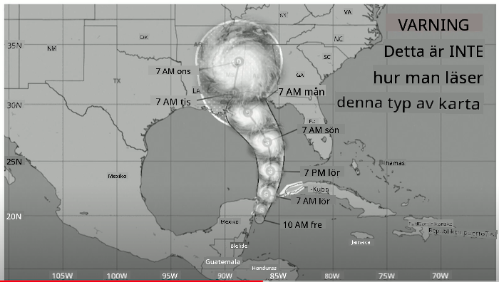
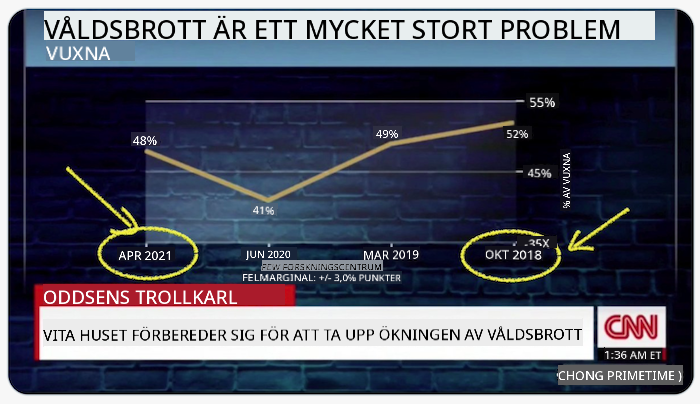
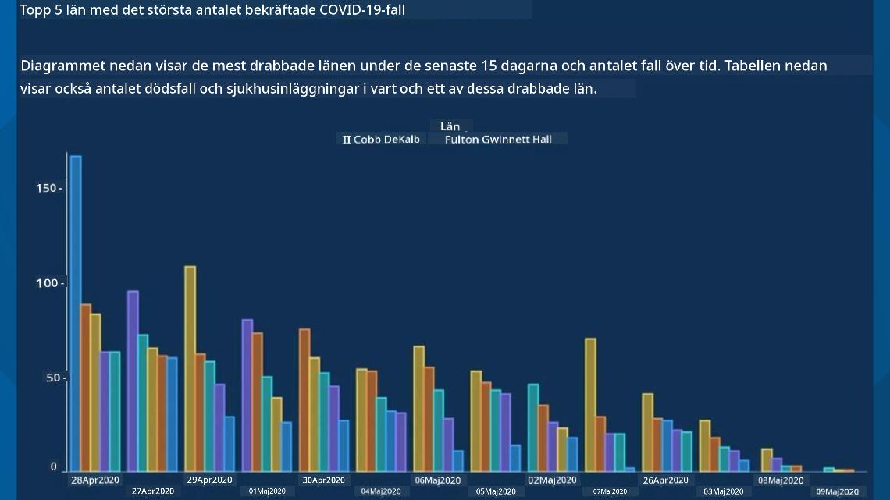
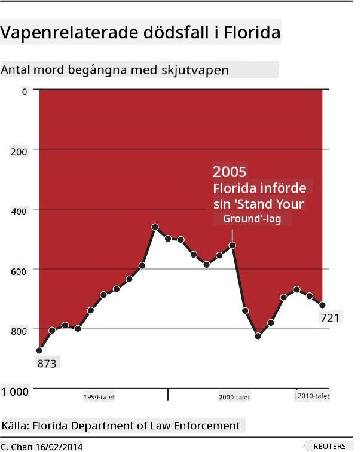
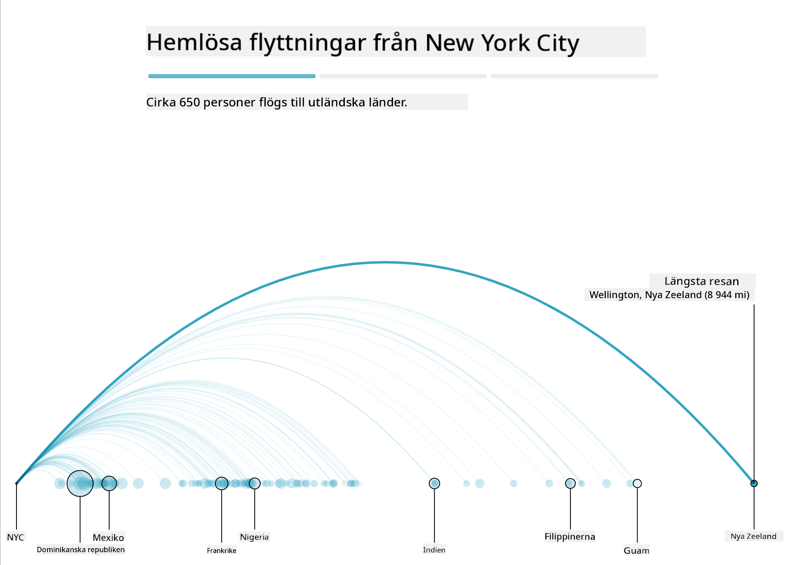

<!--
CO_OP_TRANSLATOR_METADATA:
{
  "original_hash": "4ec4747a9f4f7d194248ea29903ae165",
  "translation_date": "2025-08-26T22:42:52+00:00",
  "source_file": "3-Data-Visualization/13-meaningful-visualizations/README.md",
  "language_code": "sv"
}
-->
# Skapa Meningsfulla Visualiseringar

| ](../../sketchnotes/13-MeaningfulViz.png)|
|:---:|
| Meningsfulla Visualiseringar - _Sketchnote av [@nitya](https://twitter.com/nitya)_ |

> "Om du torterar data tillräckligt länge, kommer den att erkänna vad som helst" -- [Ronald Coase](https://en.wikiquote.org/wiki/Ronald_Coase)

En av de grundläggande färdigheterna för en dataanalytiker är förmågan att skapa en meningsfull datavisualisering som hjälper till att besvara de frågor du kan ha. Innan du visualiserar dina data måste du säkerställa att de har rensats och förberetts, precis som du gjorde i tidigare lektioner. Därefter kan du börja bestämma hur du bäst presenterar datan.

I denna lektion kommer du att gå igenom:

1. Hur man väljer rätt diagramtyp
2. Hur man undviker vilseledande diagram
3. Hur man arbetar med färg
4. Hur man stylar diagram för läsbarhet
5. Hur man bygger animerade eller 3D-diagramlösningar
6. Hur man skapar en kreativ visualisering

## [Förtest](https://purple-hill-04aebfb03.1.azurestaticapps.net/quiz/24)

## Välj rätt diagramtyp

I tidigare lektioner experimenterade du med att skapa olika typer av intressanta datavisualiseringar med hjälp av Matplotlib och Seaborn. Generellt sett kan du välja [rätt typ av diagram](https://chartio.com/learn/charts/how-to-select-a-data-vizualization/) för den fråga du ställer med hjälp av denna tabell:

| Du behöver:                | Du bör använda:                 |
| -------------------------- | ------------------------------- |
| Visa datatrender över tid  | Linje                           |
| Jämföra kategorier         | Stapel, Cirkeldiagram           |
| Jämföra totaler            | Cirkeldiagram, Staplat Stapeldiagram |
| Visa relationer            | Punktdiagram, Linje, Facet, Dubbel Linje |
| Visa fördelningar          | Punktdiagram, Histogram, Boxdiagram |
| Visa proportioner          | Cirkeldiagram, Donut, Waffle    |

> ✅ Beroende på hur dina data ser ut kan du behöva konvertera dem från text till numeriska värden för att ett visst diagram ska fungera.

## Undvik vilseledning

Även om en dataanalytiker är noggrann med att välja rätt diagram för rätt data, finns det många sätt att presentera data på ett sätt som bevisar en poäng, ofta på bekostnad av att undergräva själva datan. Det finns många exempel på vilseledande diagram och infografik!

[](https://www.youtube.com/watch?v=oX74Nge8Wkw "How charts lie")

> 🎥 Klicka på bilden ovan för en konferensföreläsning om vilseledande diagram

Detta diagram vänder X-axeln för att visa motsatsen till sanningen, baserat på datum:



[Detta diagram](https://media.firstcoastnews.com/assets/WTLV/images/170ae16f-4643-438f-b689-50d66ca6a8d8/170ae16f-4643-438f-b689-50d66ca6a8d8_1140x641.jpg) är ännu mer vilseledande, eftersom ögat dras till höger och får det att se ut som att COVID-fallen har minskat över tid i olika län. Om du tittar noga på datumen ser du dock att de har omarrangerats för att ge en falsk nedåtgående trend.



Detta ökända exempel använder färg OCH en inverterad Y-axel för att vilseleda: istället för att dra slutsatsen att vapenvåld ökade efter införandet av vapenvänlig lagstiftning, luras ögat att tro att motsatsen är sann:



Detta märkliga diagram visar hur proportioner kan manipuleras, till komisk effekt:


Att jämföra det som inte är jämförbart är ytterligare ett skumt knep. Det finns en [fantastisk webbplats](https://tylervigen.com/spurious-correlations) som handlar om 'spuriösa korrelationer' och visar 'fakta' som korrelerar saker som skilsmässofrekvensen i Maine och konsumtionen av margarin. En Reddit-grupp samlar också [fula användningar](https://www.reddit.com/r/dataisugly/top/?t=all) av data.

Det är viktigt att förstå hur lätt ögat kan luras av vilseledande diagram. Även om dataanalytikerns avsikt är god, kan valet av en dålig diagramtyp, som ett cirkeldiagram med för många kategorier, vara vilseledande.

## Färg

Du såg i diagrammet om 'vapenvåld i Florida' ovan hur färg kan ge en extra betydelse till diagram, särskilt sådana som inte är designade med bibliotek som Matplotlib och Seaborn, vilka har olika granskade färgbibliotek och paletter. Om du skapar ett diagram manuellt, studera lite [färgteori](https://colormatters.com/color-and-design/basic-color-theory).

> ✅ Var medveten om att tillgänglighet är en viktig aspekt av visualisering när du designar diagram. Vissa av dina användare kan vara färgblinda - visas ditt diagram tydligt för användare med synnedsättningar?

Var försiktig när du väljer färger för ditt diagram, eftersom färg kan förmedla en betydelse du inte avser. De 'rosa damerna' i diagrammet om 'längd' ovan ger en tydligt 'feminin' tillskriven betydelse som bidrar till diagrammets absurditet.

Även om [färgers betydelse](https://colormatters.com/color-symbolism/the-meanings-of-colors) kan variera i olika delar av världen och tenderar att ändras beroende på nyans, inkluderar generella färgbetydelser:

| Färg   | Betydelse           |
| ------ | ------------------- |
| röd    | makt               |
| blå    | tillit, lojalitet  |
| gul    | glädje, försiktighet |
| grön   | ekologi, tur, avund |
| lila   | glädje             |
| orange | energi             |

Om du får i uppdrag att skapa ett diagram med anpassade färger, se till att dina diagram är både tillgängliga och att färgen du väljer överensstämmer med den betydelse du försöker förmedla.

## Styla dina diagram för läsbarhet

Diagram är inte meningsfulla om de inte är läsbara! Ta dig tid att överväga att justera bredden och höjden på ditt diagram så att det passar dina data. Om en variabel (som alla 50 delstater) behöver visas, visa dem vertikalt på Y-axeln om möjligt för att undvika ett horisontellt rullande diagram.

Märk dina axlar, tillhandahåll en legend om det behövs, och erbjud verktygstips för bättre förståelse av data.

Om dina data är textbaserade och långa på X-axeln kan du vinkla texten för bättre läsbarhet. [Matplotlib](https://matplotlib.org/stable/tutorials/toolkits/mplot3d.html) erbjuder 3D-plotting om dina data stödjer det. Sofistikerade datavisualiseringar kan skapas med `mpl_toolkits.mplot3d`.


## Animation och 3D-diagram

Några av de bästa datavisualiseringarna idag är animerade. Shirley Wu har fantastiska exempel gjorda med D3, som '[film flowers](http://bl.ocks.org/sxywu/raw/d612c6c653fb8b4d7ff3d422be164a5d/)', där varje blomma är en visualisering av en film. Ett annat exempel för Guardian är 'bussed out', en interaktiv upplevelse som kombinerar visualiseringar med Greensock och D3 samt ett berättande artikelformat för att visa hur NYC hanterar sitt hemlöshetsproblem genom att bussa människor ut ur staden.



> "Bussed Out: How America Moves its Homeless" från [the Guardian](https://www.theguardian.com/us-news/ng-interactive/2017/dec/20/bussed-out-america-moves-homeless-people-country-study). Visualiseringar av Nadieh Bremer & Shirley Wu

Även om denna lektion inte går på djupet för att lära ut dessa kraftfulla visualiseringsbibliotek, kan du prova D3 i en Vue.js-app med ett bibliotek för att visa en visualisering av boken "Dangerous Liaisons" som ett animerat socialt nätverk.

> "Les Liaisons Dangereuses" är en brevroman, eller en roman presenterad som en serie brev. Skriven 1782 av Choderlos de Laclos, berättar den historien om de hänsynslösa, moraliskt bankrutta sociala manövrarna hos två duellerande protagonister i det franska aristokratiet under slutet av 1700-talet, Vicomte de Valmont och Marquise de Merteuil. Båda möter sitt öde i slutet men inte utan att orsaka stor social skada. Romanen utvecklas som en serie brev skrivna till olika personer i deras kretsar, med planer på hämnd eller bara för att skapa problem. Skapa en visualisering av dessa brev för att upptäcka de stora nyckelpersonerna i berättelsen, visuellt.

Du kommer att slutföra en webbapp som visar en animerad vy av detta sociala nätverk. Den använder ett bibliotek som skapats för att skapa en [visualisering av ett nätverk](https://github.com/emiliorizzo/vue-d3-network) med Vue.js och D3. När appen körs kan du dra runt noderna på skärmen för att omorganisera datan.


## Projekt: Bygg ett diagram för att visa ett nätverk med D3.js

> Denna lektionsmapp innehåller en `solution`-mapp där du kan hitta det färdiga projektet som referens.

1. Följ instruktionerna i README.md-filen i rotmappen för startmappen. Se till att du har NPM och Node.js installerat på din dator innan du installerar projektets beroenden.

2. Öppna mappen `starter/src`. Du hittar en `assets`-mapp där det finns en .json-fil med alla brev från romanen, numrerade, med en 'to' och 'from'-notering.

3. Slutför koden i `components/Nodes.vue` för att möjliggöra visualiseringen. Leta efter metoden som heter `createLinks()` och lägg till följande nästlade loop.

Loopa genom .json-objektet för att fånga 'to' och 'from'-data för breven och bygg upp `links`-objektet så att visualiseringsbiblioteket kan använda det:

```javascript
//loop through letters
      let f = 0;
      let t = 0;
      for (var i = 0; i < letters.length; i++) {
          for (var j = 0; j < characters.length; j++) {
              
            if (characters[j] == letters[i].from) {
              f = j;
            }
            if (characters[j] == letters[i].to) {
              t = j;
            }
        }
        this.links.push({ sid: f, tid: t });
      }
  ```

Kör din app från terminalen (npm run serve) och njut av visualiseringen!

## 🚀 Utmaning

Utforska internet för att hitta vilseledande visualiseringar. Hur lurar författaren användaren, och är det avsiktligt? Försök att korrigera visualiseringarna för att visa hur de borde se ut.

## [Eftertest](https://purple-hill-04aebfb03.1.azurestaticapps.net/quiz/25)

## Granskning & Självstudier

Här är några artiklar att läsa om vilseledande datavisualiseringar:

https://gizmodo.com/how-to-lie-with-data-visualization-1563576606

http://ixd.prattsi.org/2017/12/visual-lies-usability-in-deceptive-data-visualizations/

Ta en titt på dessa intressanta visualiseringar för historiska tillgångar och artefakter:

https://handbook.pubpub.org/

Läs denna artikel om hur animation kan förbättra dina visualiseringar:

https://medium.com/@EvanSinar/use-animation-to-supercharge-data-visualization-cd905a882ad4

## Uppgift

[Skapa din egen anpassade visualisering](assignment.md)

---

**Ansvarsfriskrivning**:  
Detta dokument har översatts med hjälp av AI-översättningstjänsten [Co-op Translator](https://github.com/Azure/co-op-translator). Även om vi strävar efter noggrannhet, vänligen notera att automatiska översättningar kan innehålla fel eller felaktigheter. Det ursprungliga dokumentet på dess originalspråk bör betraktas som den auktoritativa källan. För kritisk information rekommenderas professionell mänsklig översättning. Vi ansvarar inte för eventuella missförstånd eller feltolkningar som uppstår vid användning av denna översättning.