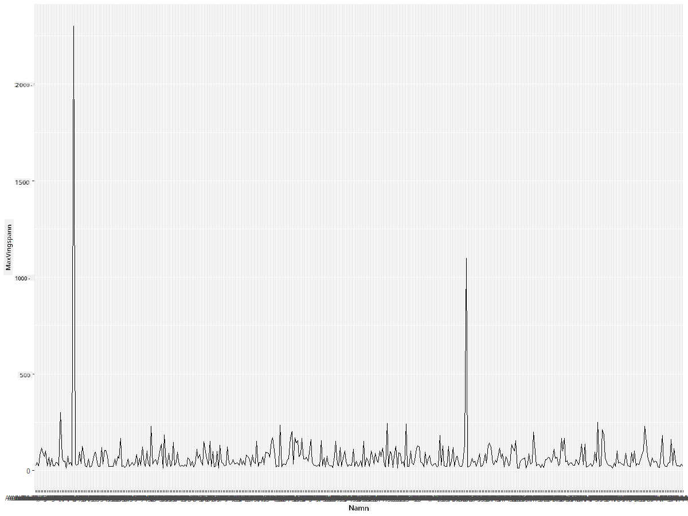
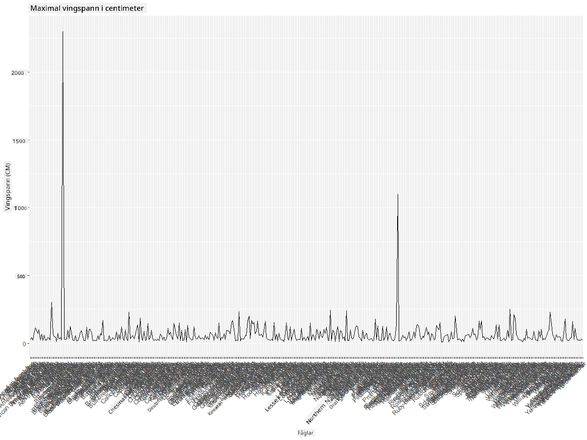
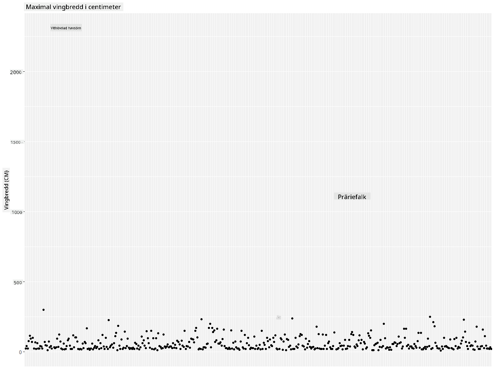
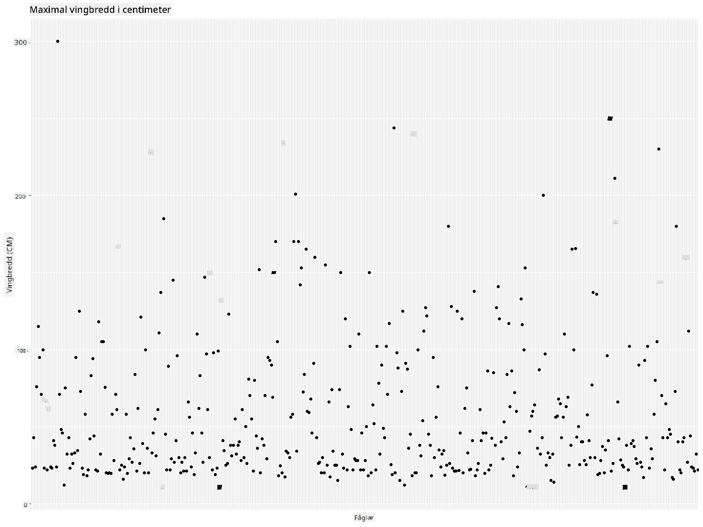
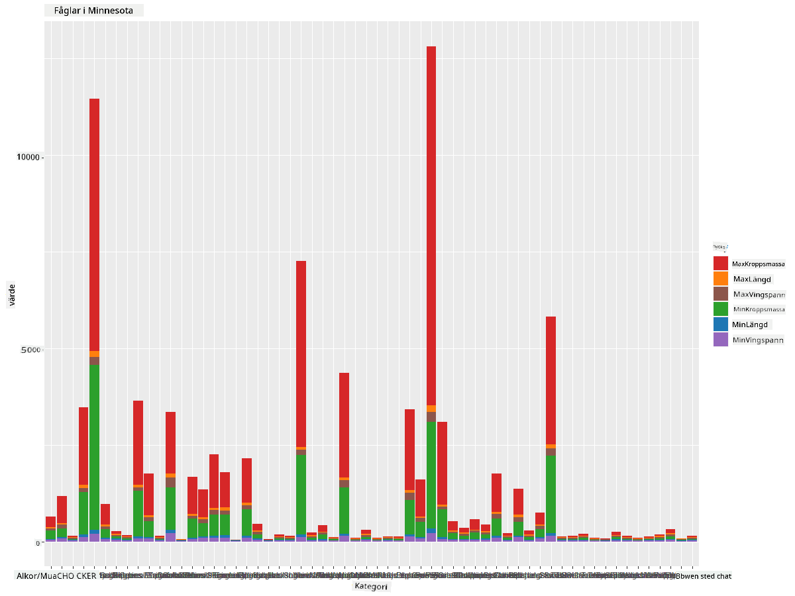
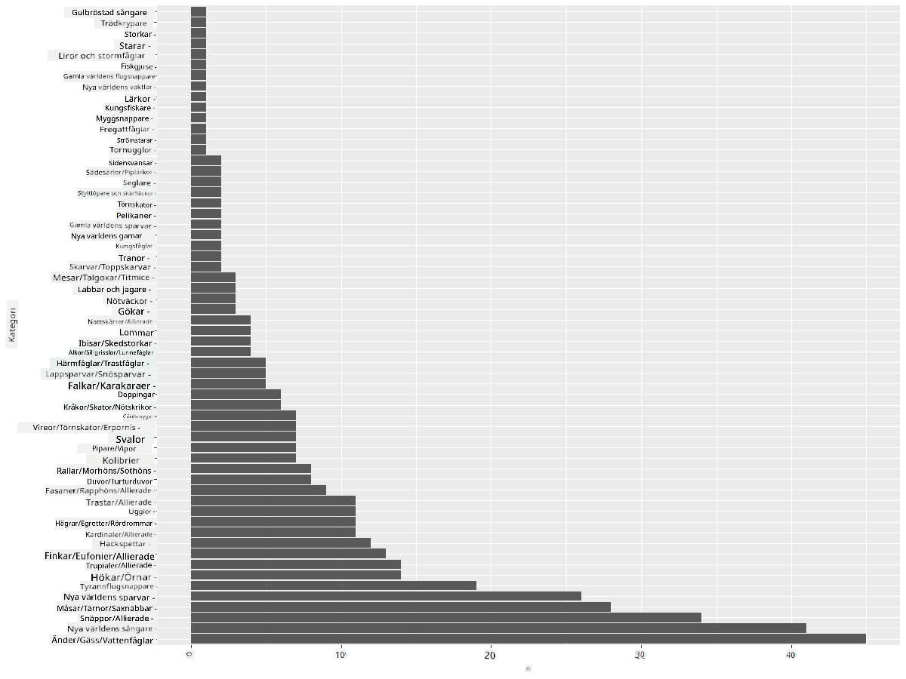
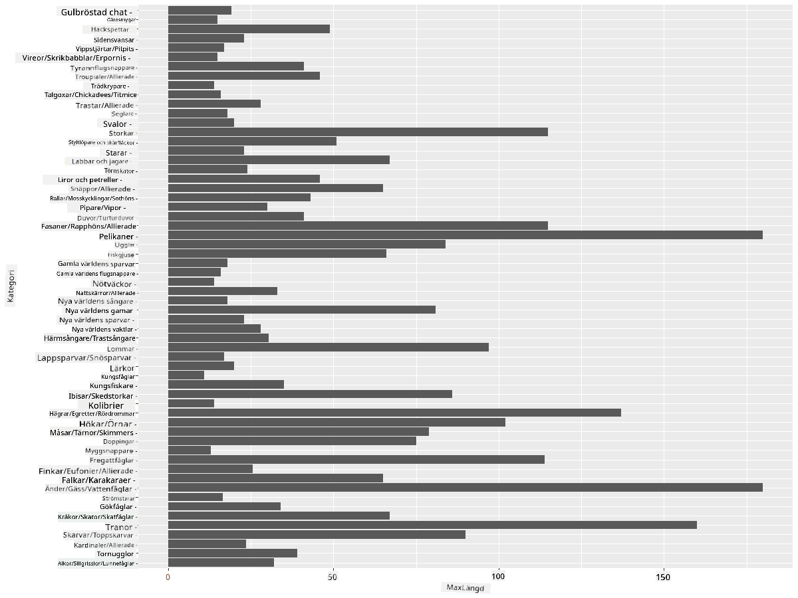
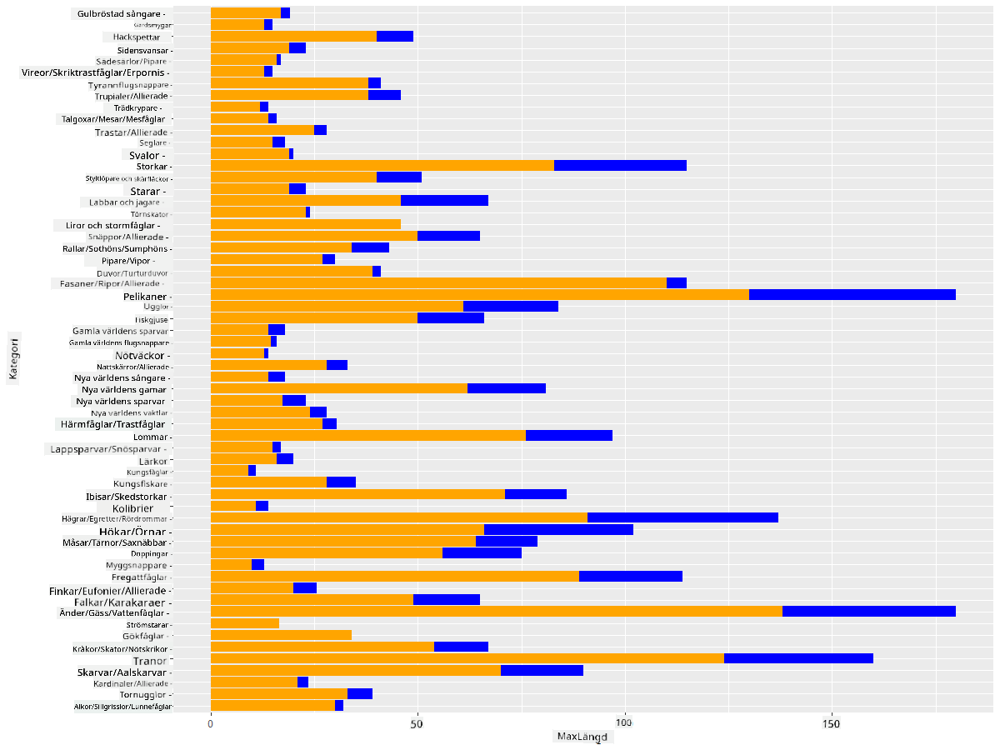

<!--
CO_OP_TRANSLATOR_METADATA:
{
  "original_hash": "22acf28f518a4769ea14fa42f4734b9f",
  "translation_date": "2025-08-26T23:05:28+00:00",
  "source_file": "3-Data-Visualization/R/09-visualization-quantities/README.md",
  "language_code": "sv"
}
-->
# Visualisera kvantiteter
| ](https://github.com/microsoft/Data-Science-For-Beginners/blob/main/sketchnotes/09-Visualizing-Quantities.png)|
|:---:|
| Visualisera kvantiteter - _Sketchnote av [@nitya](https://twitter.com/nitya)_ |

I denna lektion kommer du att utforska hur du kan använda några av de många tillgängliga R-paketen för att lära dig att skapa intressanta visualiseringar kring konceptet kvantitet. Med hjälp av en rensad dataset om fåglar i Minnesota kan du lära dig många intressanta fakta om det lokala djurlivet.  
## [Quiz före föreläsningen](https://purple-hill-04aebfb03.1.azurestaticapps.net/quiz/16)

## Observera vingbredd med ggplot2
Ett utmärkt bibliotek för att skapa både enkla och avancerade diagram och grafer av olika slag är [ggplot2](https://cran.r-project.org/web/packages/ggplot2/index.html). Generellt sett inkluderar processen för att plotta data med dessa bibliotek att identifiera de delar av din dataframe som du vill rikta in dig på, utföra nödvändiga transformationer på datan, tilldela dess x- och y-axelvärden, bestämma vilken typ av diagram som ska visas och sedan visa diagrammet.

`ggplot2` är ett system för att deklarativt skapa grafik, baserat på The Grammar of Graphics. [Grammar of Graphics](https://en.wikipedia.org/wiki/Ggplot2) är ett generellt schema för datavisualisering som bryter ner grafer i semantiska komponenter som skalor och lager. Med andra ord gör enkelheten att skapa grafer och diagram för univariat eller multivariat data med lite kod `ggplot2` till det mest populära paketet för visualiseringar i R. Användaren berättar för `ggplot2` hur variabler ska mappas till estetik, vilka grafiska primitiva som ska användas, och `ggplot2` tar hand om resten.

> ✅ Diagram = Data + Estetik + Geometri  
> - Data hänvisar till datasetet  
> - Estetik indikerar variablerna som ska studeras (x- och y-variabler)  
> - Geometri hänvisar till typen av diagram (linjediagram, stapeldiagram, etc.)  

Välj den bästa geometrin (typen av diagram) baserat på din data och berättelsen du vill förmedla genom diagrammet.  

> - För att analysera trender: linje, kolumn  
> - För att jämföra värden: stapel, kolumn, cirkel, spridningsdiagram  
> - För att visa hur delar relaterar till helheten: cirkeldiagram  
> - För att visa datadistribution: spridningsdiagram, stapel  
> - För att visa relationer mellan värden: linje, spridningsdiagram, bubbeldiagram  

✅ Du kan också kolla in detta beskrivande [fusklapp](https://nyu-cdsc.github.io/learningr/assets/data-visualization-2.1.pdf) för ggplot2.

## Skapa ett linjediagram över fåglars vingbreddsvärden

Öppna R-konsolen och importera datasetet.  
> Obs: Datasetet finns i roten av detta repo i `/data`-mappen.

Låt oss importera datasetet och observera de första raderna (topp 5 rader) av datan.

```r
birds <- read.csv("../../data/birds.csv",fileEncoding="UTF-8-BOM")
head(birds)
```  
De första raderna av datan innehåller en blandning av text och siffror:

|      | Namn                          | VetenskapligtNamn      | Kategori              | Ordning      | Familj   | Släkte      | Bevarandestatus     | MinLängd | MaxLängd | MinKroppsmassa | MaxKroppsmassa | MinVingbredd | MaxVingbredd |
| ---: | :---------------------------- | :--------------------- | :-------------------- | :----------- | :------- | :---------- | :----------------- | --------: | --------: | ----------: | ----------: | ----------: | ----------: |
|    0 | Svartbukig visslande anka     | Dendrocygna autumnalis | Ankor/Gäss/Vattenfåglar | Anseriformes | Anatidae | Dendrocygna | LC                 |        47 |        56 |         652 |        1020 |          76 |          94 |
|    1 | Färgad visslande anka         | Dendrocygna bicolor    | Ankor/Gäss/Vattenfåglar | Anseriformes | Anatidae | Dendrocygna | LC                 |        45 |        53 |         712 |        1050 |          85 |          93 |
|    2 | Snögås                        | Anser caerulescens     | Ankor/Gäss/Vattenfåglar | Anseriformes | Anatidae | Anser       | LC                 |        64 |        79 |        2050 |        4050 |         135 |         165 |
|    3 | Ross' gås                     | Anser rossii           | Ankor/Gäss/Vattenfåglar | Anseriformes | Anatidae | Anser       | LC                 |      57.3 |        64 |        1066 |        1567 |         113 |         116 |
|    4 | Större vitkindad gås          | Anser albifrons        | Ankor/Gäss/Vattenfåglar | Anseriformes | Anatidae | Anser       | LC                 |        64 |        81 |        1930 |        3310 |         130 |         165 |

Låt oss börja med att plotta några av de numeriska data med ett grundläggande linjediagram. Anta att du vill ha en översikt över den maximala vingbredden för dessa intressanta fåglar.

```r
install.packages("ggplot2")
library("ggplot2")
ggplot(data=birds, aes(x=Name, y=MaxWingspan,group=1)) +
  geom_line() 
```  
Här installerar du `ggplot2`-paketet och importerar det sedan till arbetsytan med kommandot `library("ggplot2")`. För att plotta ett diagram i ggplot används funktionen `ggplot()` och du specificerar datasetet, x- och y-variabler som attribut. I detta fall använder vi funktionen `geom_line()` eftersom vi vill plotta ett linjediagram.



Vad märker du direkt? Det verkar finnas åtminstone en avvikelse - det är en ganska imponerande vingbredd! En vingbredd på över 2000 centimeter motsvarar mer än 20 meter - finns det Pterodactyler som strövar omkring i Minnesota? Låt oss undersöka.

Även om du kan göra en snabb sortering i Excel för att hitta dessa avvikelser, som förmodligen är skrivfel, fortsätt visualiseringsprocessen genom att arbeta från diagrammet.

Lägg till etiketter på x-axeln för att visa vilka fåglar det handlar om:

```r
ggplot(data=birds, aes(x=Name, y=MaxWingspan,group=1)) +
  geom_line() +
  theme(axis.text.x = element_text(angle = 45, hjust=1))+
  xlab("Birds") +
  ylab("Wingspan (CM)") +
  ggtitle("Max Wingspan in Centimeters")
```  
Vi specificerar vinkeln i `theme` och anger x- och y-axelns etiketter i `xlab()` och `ylab()` respektive. `ggtitle()` ger diagrammet/plotten ett namn.



Även med rotationen av etiketterna inställd på 45 grader är det för många för att läsa. Låt oss prova en annan strategi: märk endast avvikelserna och placera etiketterna inom diagrammet. Du kan använda ett spridningsdiagram för att skapa mer utrymme för märkningen:

```r
ggplot(data=birds, aes(x=Name, y=MaxWingspan,group=1)) +
  geom_point() +
  geom_text(aes(label=ifelse(MaxWingspan>500,as.character(Name),'')),hjust=0,vjust=0) + 
  theme(axis.title.x=element_blank(), axis.text.x=element_blank(), axis.ticks.x=element_blank())
  ylab("Wingspan (CM)") +
  ggtitle("Max Wingspan in Centimeters") + 
```  
Vad händer här? Du använde funktionen `geom_point()` för att plotta spridningspunkter. Med detta lade du till etiketter för fåglar som hade `MaxWingspan > 500` och dolde också etiketterna på x-axeln för att avlasta diagrammet.

Vad upptäcker du?



## Filtrera din data

Både den vithövdade örnen och präriefalken, som förmodligen är mycket stora fåglar, verkar vara felmärkta, med en extra nolla tillagd till deras maximala vingbredd. Det är osannolikt att du möter en vithövdad örn med en vingbredd på 25 meter, men om så är fallet, låt oss veta! Låt oss skapa en ny dataframe utan dessa två avvikelser:

```r
birds_filtered <- subset(birds, MaxWingspan < 500)

ggplot(data=birds_filtered, aes(x=Name, y=MaxWingspan,group=1)) +
  geom_point() +
  ylab("Wingspan (CM)") +
  xlab("Birds") +
  ggtitle("Max Wingspan in Centimeters") + 
  geom_text(aes(label=ifelse(MaxWingspan>500,as.character(Name),'')),hjust=0,vjust=0) +
  theme(axis.text.x=element_blank(), axis.ticks.x=element_blank())
```  
Vi skapade en ny dataframe `birds_filtered` och plottade sedan ett spridningsdiagram. Genom att filtrera bort avvikelser är din data nu mer sammanhängande och begriplig.



Nu när vi har ett renare dataset åtminstone när det gäller vingbredd, låt oss upptäcka mer om dessa fåglar.

Medan linje- och spridningsdiagram kan visa information om datavärden och deras distributioner, vill vi tänka på värdena som är inneboende i detta dataset. Du kan skapa visualiseringar för att besvara följande frågor om kvantitet:

> Hur många kategorier av fåglar finns det, och vad är deras antal?  
> Hur många fåglar är utdöda, hotade, sällsynta eller vanliga?  
> Hur många finns det av de olika släkten och ordningar enligt Linnés terminologi?  

## Utforska stapeldiagram

Stapeldiagram är praktiska när du behöver visa grupperingar av data. Låt oss utforska kategorierna av fåglar som finns i detta dataset för att se vilken som är den vanligaste baserat på antal.  
Låt oss skapa ett stapeldiagram på filtrerad data.

```r
install.packages("dplyr")
install.packages("tidyverse")

library(lubridate)
library(scales)
library(dplyr)
library(ggplot2)
library(tidyverse)

birds_filtered %>% group_by(Category) %>%
  summarise(n=n(),
  MinLength = mean(MinLength),
  MaxLength = mean(MaxLength),
  MinBodyMass = mean(MinBodyMass),
  MaxBodyMass = mean(MaxBodyMass),
  MinWingspan=mean(MinWingspan),
  MaxWingspan=mean(MaxWingspan)) %>% 
  gather("key", "value", - c(Category, n)) %>%
  ggplot(aes(x = Category, y = value, group = key, fill = key)) +
  geom_bar(stat = "identity") +
  scale_fill_manual(values = c("#D62728", "#FF7F0E", "#8C564B","#2CA02C", "#1F77B4", "#9467BD")) +                   
  xlab("Category")+ggtitle("Birds of Minnesota")

```  
I följande kodsnutt installerar vi paketen [dplyr](https://www.rdocumentation.org/packages/dplyr/versions/0.7.8) och [lubridate](https://www.rdocumentation.org/packages/lubridate/versions/1.8.0) för att hjälpa till att manipulera och gruppera data för att plotta ett staplat stapeldiagram. Först grupperar du datan efter fåglarnas `Category` och summerar sedan kolumnerna `MinLength`, `MaxLength`, `MinBodyMass`, `MaxBodyMass`, `MinWingspan`, `MaxWingspan`. Sedan plotter du stapeldiagrammet med `ggplot2`-paketet och specificerar färgerna för de olika kategorierna och etiketterna.



Detta stapeldiagram är dock oläsligt eftersom det finns för mycket icke-grupperad data. Du behöver välja endast den data du vill plotta, så låt oss titta på fåglarnas längd baserat på deras kategori.

Filtrera din data för att endast inkludera fåglarnas kategori.

Eftersom det finns många kategorier kan du visa detta diagram vertikalt och justera dess höjd för att rymma all data:

```r
birds_count<-dplyr::count(birds_filtered, Category, sort = TRUE)
birds_count$Category <- factor(birds_count$Category, levels = birds_count$Category)
ggplot(birds_count,aes(Category,n))+geom_bar(stat="identity")+coord_flip()
```  
Du räknar först unika värden i kolumnen `Category` och sorterar dem sedan i en ny dataframe `birds_count`. Denna sorterade data faktoreras sedan på samma nivå så att den plottas på ett sorterat sätt. Med `ggplot2` plotter du sedan datan i ett stapeldiagram. `coord_flip()` plotter horisontella staplar.



Detta stapeldiagram ger en bra översikt över antalet fåglar i varje kategori. Vid en snabb blick ser du att det största antalet fåglar i denna region tillhör kategorin Ankor/Gäss/Vattenfåglar. Minnesota är "landet med 10 000 sjöar", så detta är inte förvånande!

✅ Prova några andra räkningar på detta dataset. Är det något som förvånar dig?

## Jämföra data

Du kan prova olika jämförelser av grupperad data genom att skapa nya axlar. Prova en jämförelse av fåglarnas MaxLängd baserat på deras kategori:

```r
birds_grouped <- birds_filtered %>%
  group_by(Category) %>%
  summarise(
  MaxLength = max(MaxLength, na.rm = T),
  MinLength = max(MinLength, na.rm = T)
           ) %>%
  arrange(Category)
  
ggplot(birds_grouped,aes(Category,MaxLength))+geom_bar(stat="identity")+coord_flip()
```  
Vi grupperar `birds_filtered`-datan efter `Category` och plotter sedan ett stapeldiagram.



Inget är förvånande här: kolibrier har den minsta MaxLängden jämfört med pelikaner eller gäss. Det är bra när data är logisk!

Du kan skapa mer intressanta visualiseringar av stapeldiagram genom att överlagra data. Låt oss överlagra Minsta och Maximala Längd på en given fågelkategori:

```r
ggplot(data=birds_grouped, aes(x=Category)) +
  geom_bar(aes(y=MaxLength), stat="identity", position ="identity",  fill='blue') +
  geom_bar(aes(y=MinLength), stat="identity", position="identity", fill='orange')+
  coord_flip()
```  


## 🚀 Utmaning

Detta fågeldataset erbjuder en mängd information om olika typer av fåglar inom ett specifikt ekosystem. Sök runt på internet och se om du kan hitta andra dataset om fåglar. Öva på att skapa diagram och grafer kring dessa fåglar för att upptäcka fakta du inte kände till.  
## [Quiz efter föreläsningen](https://purple-hill-04aebfb03.1.azurestaticapps.net/quiz/17)

## Granskning & Självstudier

Denna första lektion har gett dig viss information om hur du kan använda `ggplot2` för att visualisera kvantiteter. Gör lite forskning kring andra sätt att arbeta med dataset för visualisering. Undersök och leta efter dataset som du kan visualisera med andra paket som [Lattice](https://stat.ethz.ch/R-manual/R-devel/library/lattice/html/Lattice.html) och [Plotly](https://github.com/plotly/plotly.R#readme).

## Uppgift  
[Linjer, Spridningar och Staplar](assignment.md)  

---

**Ansvarsfriskrivning**:  
Detta dokument har översatts med hjälp av AI-översättningstjänsten [Co-op Translator](https://github.com/Azure/co-op-translator). Även om vi strävar efter noggrannhet, bör det noteras att automatiserade översättningar kan innehålla fel eller brister. Det ursprungliga dokumentet på dess originalspråk bör betraktas som den auktoritativa källan. För kritisk information rekommenderas professionell mänsklig översättning. Vi ansvarar inte för eventuella missförstånd eller feltolkningar som uppstår vid användning av denna översättning.