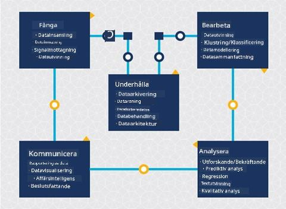
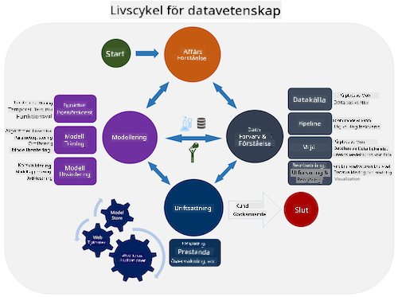
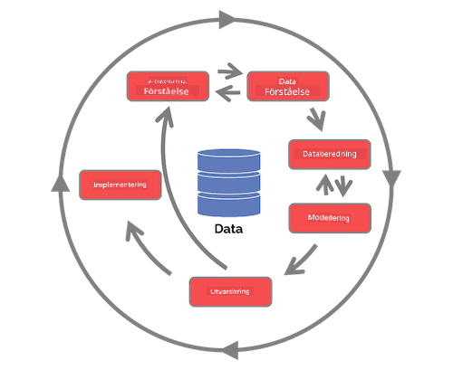

<!--
CO_OP_TRANSLATOR_METADATA:
{
  "original_hash": "c368f8f2506fe56bca0f7be05c4eb71d",
  "translation_date": "2025-08-26T22:24:20+00:00",
  "source_file": "4-Data-Science-Lifecycle/14-Introduction/README.md",
  "language_code": "sv"
}
-->
# Introduktion till livscykeln för datavetenskap

| ](../../sketchnotes/14-DataScience-Lifecycle.png)|
|:---:|
| Introduktion till livscykeln för datavetenskap - _Sketchnote av [@nitya](https://twitter.com/nitya)_ |

## [Quiz före föreläsning](https://red-water-0103e7a0f.azurestaticapps.net/quiz/26)

Vid det här laget har du förmodligen insett att datavetenskap är en process. Denna process kan delas upp i fem steg:

- Insamling
- Bearbetning
- Analys
- Kommunikation
- Underhåll

Den här lektionen fokuserar på tre delar av livscykeln: insamling, bearbetning och underhåll.

  
> Foto av [Berkeley School of Information](https://ischoolonline.berkeley.edu/data-science/what-is-data-science/)

## Insamling

Det första steget i livscykeln är mycket viktigt eftersom de följande stegen är beroende av det. Det är praktiskt taget två steg kombinerade i ett: att samla in data och definiera syftet och problemen som behöver adresseras.  
Att definiera projektets mål kräver en djupare förståelse för problemet eller frågan. Först måste vi identifiera och engagera de som behöver få sitt problem löst. Dessa kan vara intressenter i ett företag eller sponsorer av projektet, som kan hjälpa till att identifiera vem eller vad som kommer att dra nytta av projektet samt vad och varför de behöver det. Ett väl definierat mål bör vara mätbart och kvantifierbart för att definiera ett acceptabelt resultat.

Frågor som en datavetare kan ställa:
- Har detta problem hanterats tidigare? Vad upptäcktes?
- Är syftet och målet förstått av alla inblandade?
- Finns det oklarheter och hur kan de minskas?
- Vilka är begränsningarna?
- Hur kommer slutresultatet potentiellt att se ut?
- Hur mycket resurser (tid, personal, beräkningskapacitet) finns tillgängliga?

Nästa steg är att identifiera, samla in och slutligen utforska den data som behövs för att uppnå de definierade målen. Vid detta insamlingssteg måste datavetare också utvärdera mängden och kvaliteten på datan. Detta kräver viss datautforskning för att bekräfta att det som har samlats in kommer att stödja att nå det önskade resultatet.

Frågor som en datavetare kan ställa om datan:
- Vilken data har jag redan tillgång till?
- Vem äger denna data?
- Vilka är integritetsfrågorna?
- Har jag tillräckligt för att lösa detta problem?
- Är datan av acceptabel kvalitet för detta problem?
- Om jag upptäcker ytterligare information genom denna data, bör vi överväga att ändra eller omdefiniera målen?

## Bearbetning

Bearbetningssteget i livscykeln fokuserar på att upptäcka mönster i datan samt modellering. Vissa tekniker som används i bearbetningssteget kräver statistiska metoder för att identifiera mönster. Detta skulle vanligtvis vara en tidskrävande uppgift för en människa att utföra med ett stort dataset och kommer att förlita sig på datorer för att göra det tunga arbetet och påskynda processen. Detta steg är också där datavetenskap och maskininlärning möts. Som du lärde dig i den första lektionen är maskininlärning processen att bygga modeller för att förstå datan. Modeller är en representation av relationen mellan variabler i datan som hjälper till att förutsäga resultat.

Vanliga tekniker som används i detta steg täcks i läroplanen för ML för nybörjare. Följ länkarna för att lära dig mer om dem:

- [Klassificering](https://github.com/microsoft/ML-For-Beginners/tree/main/4-Classification): Organisera data i kategorier för mer effektiv användning.
- [Klustring](https://github.com/microsoft/ML-For-Beginners/tree/main/5-Clustering): Gruppera data i liknande grupper.
- [Regression](https://github.com/microsoft/ML-For-Beginners/tree/main/2-Regression): Bestäm relationerna mellan variabler för att förutsäga eller prognostisera värden.

## Underhåll

I diagrammet över livscykeln kanske du har märkt att underhåll ligger mellan insamling och bearbetning. Underhåll är en pågående process för att hantera, lagra och säkra datan under hela projektets gång och bör beaktas under hela projektets varaktighet.

### Lagra data

Överväganden kring hur och var datan lagras kan påverka kostnaden för dess lagring samt prestandan för hur snabbt datan kan nås. Beslut som dessa fattas sannolikt inte av en datavetare ensam, men de kan behöva göra val om hur de ska arbeta med datan baserat på hur den är lagrad.

Här är några aspekter av moderna datalagringssystem som kan påverka dessa val:

**På plats vs utanför plats vs offentlig eller privat moln**

På plats avser att hantera datan på egen utrustning, som att äga en server med hårddiskar som lagrar datan, medan utanför plats förlitar sig på utrustning som du inte äger, såsom ett datacenter. Det offentliga molnet är ett populärt val för att lagra data som inte kräver kunskap om hur eller var exakt datan lagras, där "offentligt" avser en enhetlig underliggande infrastruktur som delas av alla som använder molnet. Vissa organisationer har strikta säkerhetspolicyer som kräver att de har fullständig åtkomst till utrustningen där datan är värd och kommer att förlita sig på ett privat moln som tillhandahåller sina egna molntjänster. Du kommer att lära dig mer om data i molnet i [senare lektioner](https://github.com/microsoft/Data-Science-For-Beginners/tree/main/5-Data-Science-In-Cloud).

**Kall vs varm data**

När du tränar dina modeller kan du behöva mer träningsdata. Om du är nöjd med din modell kommer mer data att anlända för att modellen ska kunna tjäna sitt syfte. I vilket fall som helst kommer kostnaden för att lagra och komma åt data att öka när du samlar på dig mer av den. Att separera sällan använd data, känd som kall data, från ofta åtkomlig varm data kan vara ett billigare alternativ för datalagring genom hårdvaru- eller mjukvarutjänster. Om kall data behöver nås kan det ta lite längre tid att hämta jämfört med varm data.

### Hantera data

När du arbetar med data kan du upptäcka att vissa delar av datan behöver rengöras med hjälp av några av de tekniker som täcks i lektionen om [datapreparation](https://github.com/microsoft/Data-Science-For-Beginners/tree/main/2-Working-With-Data/08-data-preparation) för att bygga korrekta modeller. När ny data anländer kommer den att behöva samma tillämpningar för att upprätthålla konsistens i kvalitet. Vissa projekt kommer att involvera användning av ett automatiserat verktyg för rengöring, aggregering och komprimering innan datan flyttas till sin slutliga plats. Azure Data Factory är ett exempel på ett sådant verktyg.

### Säkerställa datan

Ett av huvudmålen med att säkra data är att säkerställa att de som arbetar med den har kontroll över vad som samlas in och i vilket sammanhang det används. Att hålla data säker innebär att begränsa åtkomsten till endast de som behöver den, följa lokala lagar och regler samt upprätthålla etiska standarder, som täcks i [etiklektionen](https://github.com/microsoft/Data-Science-For-Beginners/tree/main/1-Introduction/02-ethics).

Här är några saker som ett team kan göra med säkerhet i åtanke:
- Bekräfta att all data är krypterad
- Ge kunder information om hur deras data används
- Ta bort dataåtkomst från personer som har lämnat projektet
- Låta endast vissa projektmedlemmar ändra datan

## 🚀 Utmaning

Det finns många versioner av livscykeln för datavetenskap, där varje steg kan ha olika namn och antal steg men innehåller samma processer som nämns i denna lektion.

Utforska [Team Data Science Process livscykel](https://docs.microsoft.com/en-us/azure/architecture/data-science-process/lifecycle) och [Cross-industry standard process for data mining](https://www.datascience-pm.com/crisp-dm-2/). Nämn tre likheter och skillnader mellan de två.

|Team Data Science Process (TDSP)|Cross-industry standard process for data mining (CRISP-DM)|
|--|--|
| |  |
| Bild av [Microsoft](https://docs.microsoft.comazure/architecture/data-science-process/lifecycle) | Bild av [Data Science Process Alliance](https://www.datascience-pm.com/crisp-dm-2/) |

## [Quiz efter föreläsning](https://red-water-0103e7a0f.azurestaticapps.net/quiz/27)

## Granskning & Självstudier

Att tillämpa livscykeln för datavetenskap involverar flera roller och uppgifter, där vissa kan fokusera på specifika delar av varje steg. Team Data Science Process tillhandahåller några resurser som förklarar typerna av roller och uppgifter som någon kan ha i ett projekt.

* [Team Data Science Process roller och uppgifter](https://docs.microsoft.com/en-us/azure/architecture/data-science-process/roles-tasks)  
* [Utföra datavetenskapliga uppgifter: utforskning, modellering och implementering](https://docs.microsoft.com/en-us/azure/architecture/data-science-process/execute-data-science-tasks)

## Uppgift

[Utvärdera ett dataset](assignment.md)

---

**Ansvarsfriskrivning**:  
Detta dokument har översatts med hjälp av AI-översättningstjänsten [Co-op Translator](https://github.com/Azure/co-op-translator). Även om vi strävar efter noggrannhet, bör det noteras att automatiska översättningar kan innehålla fel eller inexaktheter. Det ursprungliga dokumentet på dess originalspråk bör betraktas som den auktoritativa källan. För kritisk information rekommenderas professionell mänsklig översättning. Vi ansvarar inte för eventuella missförstånd eller feltolkningar som uppstår vid användning av denna översättning.