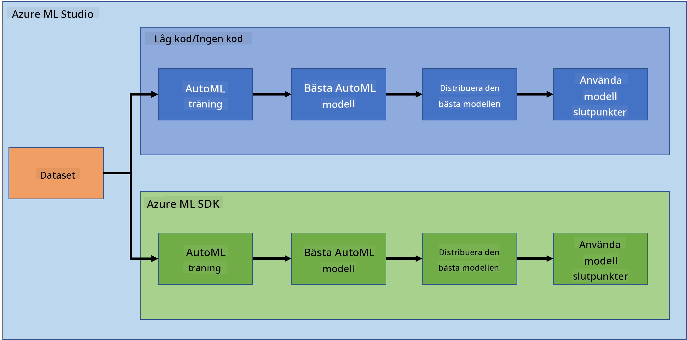
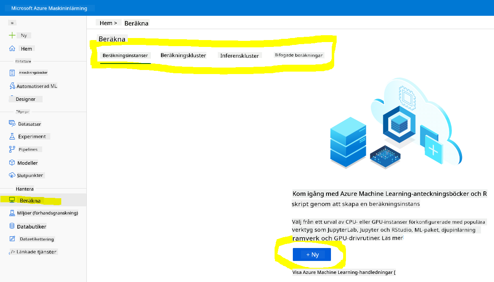
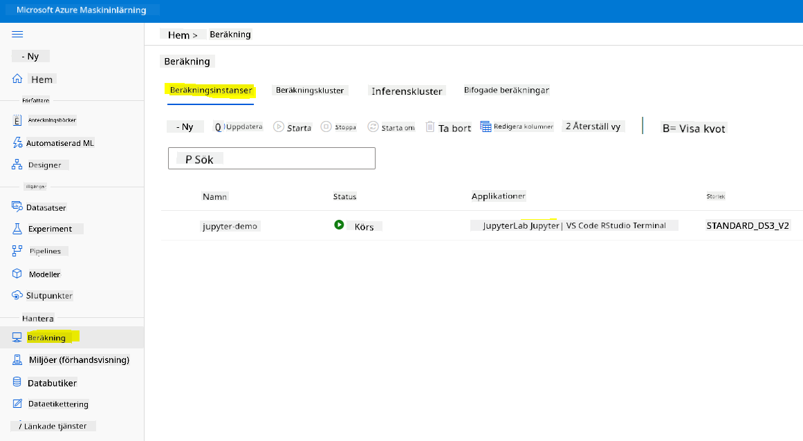
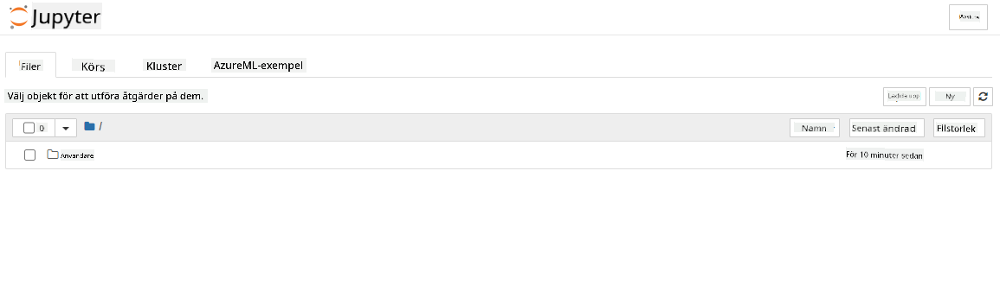

<!--
CO_OP_TRANSLATOR_METADATA:
{
  "original_hash": "73dead89dc2ddda4d6ec0232814a191e",
  "translation_date": "2025-08-26T22:13:55+00:00",
  "source_file": "5-Data-Science-In-Cloud/19-Azure/README.md",
  "language_code": "sv"
}
-->
# Data Science i molnet: "Azure ML SDK"-metoden

| ](../../sketchnotes/19-DataScience-Cloud.png)|
|:---:|
| Data Science i molnet: Azure ML SDK - _Sketchnote av [@nitya](https://twitter.com/nitya)_ |

Innehållsförteckning:

- [Data Science i molnet: "Azure ML SDK"-metoden](../../../../5-Data-Science-In-Cloud/19-Azure)
  - [Quiz före föreläsningen](../../../../5-Data-Science-In-Cloud/19-Azure)
  - [1. Introduktion](../../../../5-Data-Science-In-Cloud/19-Azure)
    - [1.1 Vad är Azure ML SDK?](../../../../5-Data-Science-In-Cloud/19-Azure)
    - [1.2 Introduktion till projektet och datasetet för hjärtsviktsprediktion](../../../../5-Data-Science-In-Cloud/19-Azure)
  - [2. Träna en modell med Azure ML SDK](../../../../5-Data-Science-In-Cloud/19-Azure)
    - [2.1 Skapa ett Azure ML-arbetsyta](../../../../5-Data-Science-In-Cloud/19-Azure)
    - [2.2 Skapa en beräkningsinstans](../../../../5-Data-Science-In-Cloud/19-Azure)
    - [2.3 Ladda datasetet](../../../../5-Data-Science-In-Cloud/19-Azure)
    - [2.4 Skapa Notebooks](../../../../5-Data-Science-In-Cloud/19-Azure)
    - [2.5 Träna en modell](../../../../5-Data-Science-In-Cloud/19-Azure)
      - [2.5.1 Konfigurera arbetsyta, experiment, beräkningskluster och dataset](../../../../5-Data-Science-In-Cloud/19-Azure)
      - [2.5.2 AutoML-konfiguration och träning](../../../../5-Data-Science-In-Cloud/19-Azure)
  - [3. Modellutplacering och endpoint-konsumtion med Azure ML SDK](../../../../5-Data-Science-In-Cloud/19-Azure)
    - [3.1 Spara den bästa modellen](../../../../5-Data-Science-In-Cloud/19-Azure)
    - [3.2 Modellutplacering](../../../../5-Data-Science-In-Cloud/19-Azure)
    - [3.3 Endpoint-konsumtion](../../../../5-Data-Science-In-Cloud/19-Azure)
  - [🚀 Utmaning](../../../../5-Data-Science-In-Cloud/19-Azure)
  - [Quiz efter föreläsningen](../../../../5-Data-Science-In-Cloud/19-Azure)
  - [Granskning och självstudier](../../../../5-Data-Science-In-Cloud/19-Azure)
  - [Uppgift](../../../../5-Data-Science-In-Cloud/19-Azure)

## [Quiz före föreläsningen](https://purple-hill-04aebfb03.1.azurestaticapps.net/quiz/36)

## 1. Introduktion

### 1.1 Vad är Azure ML SDK?

Dataforskare och AI-utvecklare använder Azure Machine Learning SDK för att bygga och köra maskininlärningsarbetsflöden med Azure Machine Learning-tjänsten. Du kan interagera med tjänsten i vilken Python-miljö som helst, inklusive Jupyter Notebooks, Visual Studio Code eller din favorit-Python-IDE.

Nyckelområden i SDK inkluderar:

- Utforska, förbereda och hantera livscykeln för dina dataset som används i maskininlärningsexperiment.
- Hantera molnresurser för övervakning, loggning och organisering av dina maskininlärningsexperiment.
- Träna modeller antingen lokalt eller med hjälp av molnresurser, inklusive GPU-accelererad modellträning.
- Använd automatiserad maskininlärning, som accepterar konfigurationsparametrar och träningsdata. Den itererar automatiskt genom algoritmer och hyperparameterinställningar för att hitta den bästa modellen för att köra prediktioner.
- Distribuera webbtjänster för att omvandla dina tränade modeller till RESTful-tjänster som kan användas i vilken applikation som helst.

[Läs mer om Azure Machine Learning SDK](https://docs.microsoft.com/python/api/overview/azure/ml?WT.mc_id=academic-77958-bethanycheum&ocid=AID3041109)

I [föregående lektion](../18-Low-Code/README.md) såg vi hur man tränar, distribuerar och använder en modell på ett Low code/No code-sätt. Vi använde datasetet för hjärtsvikt för att generera en modell för hjärtsviktsprediktion. I denna lektion ska vi göra exakt samma sak men med hjälp av Azure Machine Learning SDK.



### 1.2 Introduktion till projektet och datasetet för hjärtsviktsprediktion

Se [här](../18-Low-Code/README.md) för introduktionen till projektet och datasetet för hjärtsviktsprediktion.

## 2. Träna en modell med Azure ML SDK
### 2.1 Skapa ett Azure ML-arbetsyta

För enkelhetens skull kommer vi att arbeta i en Jupyter Notebook. Detta innebär att du redan har en arbetsyta och en beräkningsinstans. Om du redan har en arbetsyta kan du direkt hoppa till avsnittet 2.3 Skapa Notebook.

Om inte, följ instruktionerna i avsnittet **2.1 Skapa ett Azure ML-arbetsyta** i [föregående lektion](../18-Low-Code/README.md) för att skapa en arbetsyta.

### 2.2 Skapa en beräkningsinstans

I [Azure ML-arbetsytan](https://ml.azure.com/) som vi skapade tidigare, gå till menyn Compute och du kommer att se de olika beräkningsresurserna som är tillgängliga.



Låt oss skapa en beräkningsinstans för att tillhandahålla en Jupyter Notebook. 
1. Klicka på knappen + New. 
2. Ge ett namn till din beräkningsinstans.
3. Välj dina alternativ: CPU eller GPU, VM-storlek och antal kärnor.
4. Klicka på knappen Create.

Grattis, du har precis skapat en beräkningsinstans! Vi kommer att använda denna beräkningsinstans för att skapa en Notebook i avsnittet [Skapa Notebooks](../../../../5-Data-Science-In-Cloud/19-Azure).

### 2.3 Ladda datasetet
Se avsnittet **2.3 Ladda datasetet** i [föregående lektion](../18-Low-Code/README.md) om du inte har laddat upp datasetet ännu.

### 2.4 Skapa Notebooks

> **_NOTERA:_** För nästa steg kan du antingen skapa en ny Notebook från grunden, eller så kan du ladda upp den [Notebook vi skapade](notebook.ipynb) i din Azure ML Studio. För att ladda upp den, klicka helt enkelt på menyn "Notebook" och ladda upp Notebook-filen.

Notebooks är en mycket viktig del av data science-processen. De kan användas för att utföra Exploratory Data Analysis (EDA), anropa ett beräkningskluster för att träna en modell, eller anropa ett inferenskluster för att distribuera en endpoint. 

För att skapa en Notebook behöver vi en beräkningsnod som tillhandahåller Jupyter Notebook-instansen. Gå tillbaka till [Azure ML-arbetsytan](https://ml.azure.com/) och klicka på Compute instances. I listan över beräkningsinstanser bör du se [den beräkningsinstans vi skapade tidigare](../../../../5-Data-Science-In-Cloud/19-Azure). 

1. I avsnittet Applications, klicka på alternativet Jupyter. 
2. Kryssa i rutan "Yes, I understand" och klicka på knappen Continue.

3. Detta bör öppna en ny webbläsarflik med din Jupyter Notebook-instans enligt följande. Klicka på knappen "New" för att skapa en Notebook.



Nu när vi har en Notebook kan vi börja träna modellen med Azure ML SDK.

### 2.5 Träna en modell

Först och främst, om du någonsin är osäker, se [Azure ML SDK-dokumentationen](https://docs.microsoft.com/python/api/overview/azure/ml?WT.mc_id=academic-77958-bethanycheum&ocid=AID3041109). Den innehåller all nödvändig information för att förstå de moduler vi ska gå igenom i denna lektion.

#### 2.5.1 Konfigurera arbetsyta, experiment, beräkningskluster och dataset

Du behöver ladda `workspace` från konfigurationsfilen med följande kod:

```python
from azureml.core import Workspace
ws = Workspace.from_config()
```

Detta returnerar ett objekt av typen `Workspace` som representerar arbetsytan. Därefter behöver du skapa ett `experiment` med följande kod:

```python
from azureml.core import Experiment
experiment_name = 'aml-experiment'
experiment = Experiment(ws, experiment_name)
```
För att hämta eller skapa ett experiment från en arbetsyta begär du experimentet med experimentets namn. Experimentnamnet måste vara 3-36 tecken långt, börja med en bokstav eller en siffra och kan endast innehålla bokstäver, siffror, understreck och bindestreck. Om experimentet inte hittas i arbetsytan skapas ett nytt experiment.

Nu behöver du skapa ett beräkningskluster för träningen med följande kod. Observera att detta steg kan ta några minuter. 

```python
from azureml.core.compute import AmlCompute

aml_name = "heart-f-cluster"
try:
    aml_compute = AmlCompute(ws, aml_name)
    print('Found existing AML compute context.')
except:
    print('Creating new AML compute context.')
    aml_config = AmlCompute.provisioning_configuration(vm_size = "Standard_D2_v2", min_nodes=1, max_nodes=3)
    aml_compute = AmlCompute.create(ws, name = aml_name, provisioning_configuration = aml_config)
    aml_compute.wait_for_completion(show_output = True)

cts = ws.compute_targets
compute_target = cts[aml_name]
```

Du kan hämta datasetet från arbetsytan med datasetets namn på följande sätt:

```python
dataset = ws.datasets['heart-failure-records']
df = dataset.to_pandas_dataframe()
df.describe()
```
#### 2.5.2 AutoML-konfiguration och träning

För att ställa in AutoML-konfigurationen, använd klassen [AutoMLConfig](https://docs.microsoft.com/python/api/azureml-train-automl-client/azureml.train.automl.automlconfig(class)?WT.mc_id=academic-77958-bethanycheum&ocid=AID3041109).

Som beskrivs i dokumentationen finns det många parametrar att experimentera med. För detta projekt kommer vi att använda följande parametrar:

- `experiment_timeout_minutes`: Den maximala tiden (i minuter) som experimentet får köras innan det automatiskt stoppas och resultaten görs tillgängliga.
- `max_concurrent_iterations`: Det maximala antalet samtidiga träningsiterationer som tillåts för experimentet.
- `primary_metric`: Den primära metrik som används för att avgöra experimentets status.
- `compute_target`: Azure Machine Learning-beräkningsmålet för att köra det automatiserade maskininlärningsexperimentet.
- `task`: Typen av uppgift som ska köras. Värden kan vara 'classification', 'regression' eller 'forecasting' beroende på typen av automatiserat ML-problem som ska lösas.
- `training_data`: Träningsdata som ska användas i experimentet. Det bör innehålla både träningsfunktioner och en etikettkolumn (valfritt en kolumn för provvikter).
- `label_column_name`: Namnet på etikettkolumnen.
- `path`: Den fullständiga sökvägen till Azure Machine Learning-projektmappen.
- `enable_early_stopping`: Om tidig avbrytning ska aktiveras om poängen inte förbättras på kort sikt.
- `featurization`: Indikator för om featurization-steget ska göras automatiskt eller inte, eller om anpassad featurization ska användas.
- `debug_log`: Loggfilen för att skriva felsökningsinformation till.

```python
from azureml.train.automl import AutoMLConfig

project_folder = './aml-project'

automl_settings = {
    "experiment_timeout_minutes": 20,
    "max_concurrent_iterations": 3,
    "primary_metric" : 'AUC_weighted'
}

automl_config = AutoMLConfig(compute_target=compute_target,
                             task = "classification",
                             training_data=dataset,
                             label_column_name="DEATH_EVENT",
                             path = project_folder,  
                             enable_early_stopping= True,
                             featurization= 'auto',
                             debug_log = "automl_errors.log",
                             **automl_settings
                            )
```
Nu när du har din konfiguration inställd kan du träna modellen med följande kod. Detta steg kan ta upp till en timme beroende på klusterstorleken.

```python
remote_run = experiment.submit(automl_config)
```
Du kan köra RunDetails-widgeten för att visa de olika experimenten.
```python
from azureml.widgets import RunDetails
RunDetails(remote_run).show()
```
## 3. Modellutplacering och endpoint-konsumtion med Azure ML SDK

### 3.1 Spara den bästa modellen

`remote_run` är ett objekt av typen [AutoMLRun](https://docs.microsoft.com/python/api/azureml-train-automl-client/azureml.train.automl.run.automlrun?WT.mc_id=academic-77958-bethanycheum&ocid=AID3041109). Detta objekt innehåller metoden `get_output()` som returnerar den bästa körningen och den motsvarande tränade modellen.

```python
best_run, fitted_model = remote_run.get_output()
```
Du kan se parametrarna som användes för den bästa modellen genom att bara skriva ut `fitted_model` och se egenskaperna för den bästa modellen genom att använda metoden [get_properties()](https://docs.microsoft.com/python/api/azureml-core/azureml.core.run(class)?view=azure-ml-py#azureml_core_Run_get_properties?WT.mc_id=academic-77958-bethanycheum&ocid=AID3041109).

```python
best_run.get_properties()
```

Registrera nu modellen med metoden [register_model](https://docs.microsoft.com/python/api/azureml-train-automl-client/azureml.train.automl.run.automlrun?view=azure-ml-py#register-model-model-name-none--description-none--tags-none--iteration-none--metric-none-?WT.mc_id=academic-77958-bethanycheum&ocid=AID3041109).
```python
model_name = best_run.properties['model_name']
script_file_name = 'inference/score.py'
best_run.download_file('outputs/scoring_file_v_1_0_0.py', 'inference/score.py')
description = "aml heart failure project sdk"
model = best_run.register_model(model_name = model_name,
                                model_path = './outputs/',
                                description = description,
                                tags = None)
```
### 3.2 Modellutplacering

När den bästa modellen är sparad kan vi distribuera den med klassen [InferenceConfig](https://docs.microsoft.com/python/api/azureml-core/azureml.core.model.inferenceconfig?view=azure-ml-py?ocid=AID3041109). InferenceConfig representerar konfigurationsinställningarna för en anpassad miljö som används för distribution. Klassen [AciWebservice](https://docs.microsoft.com/python/api/azureml-core/azureml.core.webservice.aciwebservice?view=azure-ml-py) representerar en maskininlärningsmodell som distribueras som en webbtjänstendpoint på Azure Container Instances. En distribuerad tjänst skapas från en modell, ett skript och associerade filer. Den resulterande webbtjänsten är en lastbalanserad HTTP-endpoint med ett REST-API. Du kan skicka data till detta API och ta emot prediktionen som returneras av modellen.

Modellen distribueras med metoden [deploy](https://docs.microsoft.com/python/api/azureml-core/azureml.core.model(class)?view=azure-ml-py#deploy-workspace--name--models--inference-config-none--deployment-config-none--deployment-target-none--overwrite-false--show-output-false-?WT.mc_id=academic-77958-bethanycheum&ocid=AID3041109).

```python
from azureml.core.model import InferenceConfig, Model
from azureml.core.webservice import AciWebservice

inference_config = InferenceConfig(entry_script=script_file_name, environment=best_run.get_environment())

aciconfig = AciWebservice.deploy_configuration(cpu_cores = 1,
                                               memory_gb = 1,
                                               tags = {'type': "automl-heart-failure-prediction"},
                                               description = 'Sample service for AutoML Heart Failure Prediction')

aci_service_name = 'automl-hf-sdk'
aci_service = Model.deploy(ws, aci_service_name, [model], inference_config, aciconfig)
aci_service.wait_for_deployment(True)
print(aci_service.state)
```
Detta steg bör ta några minuter.

### 3.3 Endpoint-konsumtion

Du konsumerar din endpoint genom att skapa ett exempel på indata:

```python
data = {
    "data":
    [
        {
            'age': "60",
            'anaemia': "false",
            'creatinine_phosphokinase': "500",
            'diabetes': "false",
            'ejection_fraction': "38",
            'high_blood_pressure': "false",
            'platelets': "260000",
            'serum_creatinine': "1.40",
            'serum_sodium': "137",
            'sex': "false",
            'smoking': "false",
            'time': "130",
        },
    ],
}

test_sample = str.encode(json.dumps(data))
```
Och sedan kan du skicka detta indata till din modell för prediktion:
```python
response = aci_service.run(input_data=test_sample)
response
```
Detta bör ge `'{"result": [false]}'`. Detta betyder att patientinformationen vi skickade till slutpunkten genererade prediktionen `false`, vilket innebär att denna person sannolikt inte kommer att få en hjärtattack.

Grattis! Du har precis använt modellen som är distribuerad och tränad på Azure ML med Azure ML SDK!


> **_NOTE:_** När du är klar med projektet, glöm inte att ta bort alla resurser.

## 🚀 Utmaning

Det finns många andra saker du kan göra med SDK:n, men tyvärr kan vi inte gå igenom allt i denna lektion. Men goda nyheter, att lära sig att snabbt navigera genom SDK-dokumentationen kan ta dig långt på egen hand. Ta en titt på dokumentationen för Azure ML SDK och hitta klassen `Pipeline` som låter dig skapa pipelines. En Pipeline är en samling steg som kan köras som ett arbetsflöde.

**TIPS:** Gå till [SDK-dokumentationen](https://docs.microsoft.com/python/api/overview/azure/ml/?view=azure-ml-py?WT.mc_id=academic-77958-bethanycheum&ocid=AID3041109) och skriv in nyckelord i sökfältet, som "Pipeline". Du bör hitta klassen `azureml.pipeline.core.Pipeline` i sökresultaten.

## [Quiz efter föreläsningen](https://purple-hill-04aebfb03.1.azurestaticapps.net/quiz/37)

## Granskning & Självstudier

I denna lektion lärde du dig hur man tränar, distribuerar och använder en modell för att förutsäga risken för hjärtsvikt med Azure ML SDK i molnet. Kolla in denna [dokumentation](https://docs.microsoft.com/python/api/overview/azure/ml/?view=azure-ml-py?WT.mc_id=academic-77958-bethanycheum&ocid=AID3041109) för mer information om Azure ML SDK. Försök att skapa din egen modell med Azure ML SDK. 

## Uppgift

[Datavetenskapsprojekt med Azure ML SDK](assignment.md)

---

**Ansvarsfriskrivning**:  
Detta dokument har översatts med hjälp av AI-översättningstjänsten [Co-op Translator](https://github.com/Azure/co-op-translator). Även om vi strävar efter noggrannhet, bör det noteras att automatiserade översättningar kan innehålla fel eller felaktigheter. Det ursprungliga dokumentet på dess originalspråk bör betraktas som den auktoritativa källan. För kritisk information rekommenderas professionell mänsklig översättning. Vi ansvarar inte för eventuella missförstånd eller feltolkningar som uppstår vid användning av denna översättning.