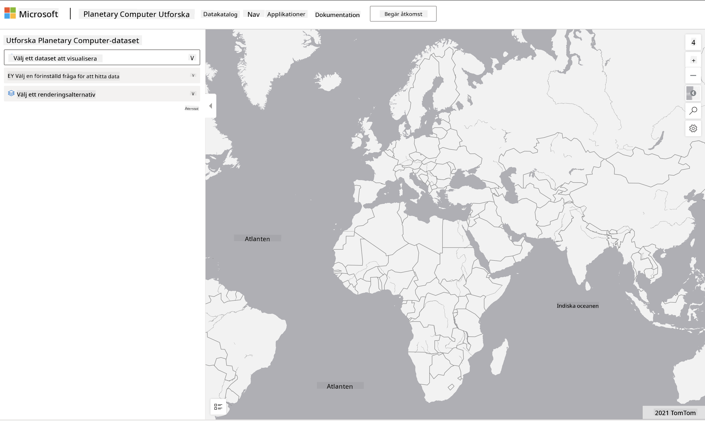

<!--
CO_OP_TRANSLATOR_METADATA:
{
  "original_hash": "d1e05715f9d97de6c4f1fb0c5a4702c0",
  "translation_date": "2025-08-26T21:55:58+00:00",
  "source_file": "6-Data-Science-In-Wild/20-Real-World-Examples/assignment.md",
  "language_code": "sv"
}
-->
# Utforska en dataset från Planetary Computer

## Instruktioner

I den här lektionen pratade vi om olika tillämpningsområden för data science - med djupdykningar i exempel relaterade till forskning, hållbarhet och digital humaniora. I den här uppgiften kommer du att utforska ett av dessa exempel mer ingående och tillämpa dina kunskaper om datavisualiseringar och analys för att dra insikter om hållbarhetsdata.

Projektet [Planetary Computer](https://planetarycomputer.microsoft.com/) har dataset och API:er som kan nås med ett konto - ansök om ett för att prova bonussteget i uppgiften. Webbplatsen erbjuder också en [Explorer](https://planetarycomputer.microsoft.com/explore)-funktion som du kan använda utan att skapa ett konto.

`Steg:`
Explorer-gränssnittet (visat i skärmbilden nedan) låter dig välja en dataset (från de tillgängliga alternativen), en förinställd fråga (för att filtrera data) och ett renderingsalternativ (för att skapa en relevant visualisering). I den här uppgiften är din uppgift att:

 1. Läs [Explorer-dokumentationen](https://planetarycomputer.microsoft.com/docs/overview/explorer/) - förstå alternativen.
 2. Utforska datasetens [Katalog](https://planetarycomputer.microsoft.com/catalog) - lär dig syftet med varje dataset.
 3. Använd Explorer - välj en dataset som intresserar dig, välj en relevant fråga och ett renderingsalternativ.

`Din uppgift:`
Studera nu visualiseringen som renderas i webbläsaren och svara på följande:
 * Vilka _funktioner_ har datasetet?
 * Vilka _insikter_ eller resultat ger visualiseringen?
 * Vilka är _implikationerna_ av dessa insikter för projektets hållbarhetsmål?
 * Vilka är _begränsningarna_ med visualiseringen (dvs. vilken insikt fick du inte)?
 * Om du kunde få rådata, vilka _alternativa visualiseringar_ skulle du skapa, och varför?

`Bonuspoäng:`
Ansök om ett konto - och logga in när du blivit godkänd.
 * Använd alternativet _Launch Hub_ för att öppna rådata i en Notebook.
 * Utforska data interaktivt och implementera de alternativa visualiseringar du tänkte på.
 * Analysera nu dina anpassade visualiseringar - kunde du dra de insikter du saknade tidigare?

## Bedömningskriterier

Föredömligt | Tillräckligt | Behöver förbättras
--- | --- | -- |
Alla fem kärnfrågor besvarades. Studenten identifierade tydligt hur nuvarande och alternativa visualiseringar kunde ge insikter om hållbarhetsmål eller resultat. | Studenten besvarade minst de tre första frågorna i detalj, vilket visar att de hade praktisk erfarenhet av Explorer. | Studenten misslyckades med att besvara flera frågor eller gav otillräckliga detaljer - vilket indikerar att inget meningsfullt försök gjordes för projektet |

---

**Ansvarsfriskrivning**:  
Detta dokument har översatts med hjälp av AI-översättningstjänsten [Co-op Translator](https://github.com/Azure/co-op-translator). Även om vi strävar efter noggrannhet, bör du vara medveten om att automatiska översättningar kan innehålla fel eller felaktigheter. Det ursprungliga dokumentet på dess ursprungliga språk bör betraktas som den auktoritativa källan. För kritisk information rekommenderas professionell mänsklig översättning. Vi ansvarar inte för eventuella missförstånd eller feltolkningar som uppstår vid användning av denna översättning.