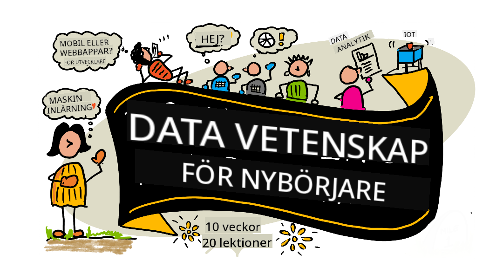

<!--
CO_OP_TRANSLATOR_METADATA:
{
  "original_hash": "a746eb3b41f67cde5a0b648b8910a656",
  "translation_date": "2025-08-28T13:31:29+00:00",
  "source_file": "README.md",
  "language_code": "sv"
}
-->
# Data Science för Nybörjare - En Läroplan

Azure Cloud Advocates på Microsoft är glada att erbjuda en 10-veckors, 20-lektions läroplan om Data Science. Varje lektion innehåller förberedande och avslutande quiz, skriftliga instruktioner för att genomföra lektionen, en lösning och en uppgift. Vår projektbaserade pedagogik låter dig lära dig genom att skapa, vilket är en beprövad metod för att få nya färdigheter att fastna.

**Stort tack till våra författare:** [Jasmine Greenaway](https://www.twitter.com/paladique), [Dmitry Soshnikov](http://soshnikov.com), [Nitya Narasimhan](https://twitter.com/nitya), [Jalen McGee](https://twitter.com/JalenMcG), [Jen Looper](https://twitter.com/jenlooper), [Maud Levy](https://twitter.com/maudstweets), [Tiffany Souterre](https://twitter.com/TiffanySouterre), [Christopher Harrison](https://www.twitter.com/geektrainer).

**🙏 Speciellt tack 🙏 till våra [Microsoft Student Ambassador](https://studentambassadors.microsoft.com/) författare, granskare och innehållsbidragare,** särskilt Aaryan Arora, [Aditya Garg](https://github.com/AdityaGarg00), [Alondra Sanchez](https://www.linkedin.com/in/alondra-sanchez-molina/), [Ankita Singh](https://www.linkedin.com/in/ankitasingh007), [Anupam Mishra](https://www.linkedin.com/in/anupam--mishra/), [Arpita Das](https://www.linkedin.com/in/arpitadas01/), ChhailBihari Dubey, [Dibri Nsofor](https://www.linkedin.com/in/dibrinsofor), [Dishita Bhasin](https://www.linkedin.com/in/dishita-bhasin-7065281bb), [Majd Safi](https://www.linkedin.com/in/majd-s/), [Max Blum](https://www.linkedin.com/in/max-blum-6036a1186/), [Miguel Correa](https://www.linkedin.com/in/miguelmque/), [Mohamma Iftekher (Iftu) Ebne Jalal](https://twitter.com/iftu119), [Nawrin Tabassum](https://www.linkedin.com/in/nawrin-tabassum), [Raymond Wangsa Putra](https://www.linkedin.com/in/raymond-wp/), [Rohit Yadav](https://www.linkedin.com/in/rty2423), Samridhi Sharma, [Sanya Sinha](https://www.linkedin.com/mwlite/in/sanya-sinha-13aab1200),
[Sheena Narula](https://www.linkedin.com/in/sheena-narua-n/), [Tauqeer Ahmad](https://www.linkedin.com/in/tauqeerahmad5201/), Yogendrasingh Pawar, [Vidushi Gupta](https://www.linkedin.com/in/vidushi-gupta07/), [Jasleen Sondhi](https://www.linkedin.com/in/jasleen-sondhi/)

||
|:---:|
| Data Science för Nybörjare - _Sketchnote av [@nitya](https://twitter.com/nitya)_ |

## Meddelande - Ny Läroplan om Generativ AI har precis släppts!

Vi har precis släppt en 12-lektions läroplan om generativ AI. Lär dig saker som:

- promptning och promptteknik
- text- och bildappsgenerering
- sökappar

Som vanligt finns det lektioner, uppgifter att slutföra, kunskapskontroller och utmaningar.

Kolla in det:

> https://aka.ms/genai-beginners

# Är du student?

Kom igång med följande resurser:

- [Student Hub-sida](https://docs.microsoft.com/en-gb/learn/student-hub?WT.mc_id=academic-77958-bethanycheum) På denna sida hittar du resurser för nybörjare, studentpaket och till och med sätt att få en gratis certifikatvoucher. Detta är en sida du vill bokmärka och kolla regelbundet eftersom vi byter ut innehåll minst en gång i månaden.
- [Microsoft Learn Student Ambassadors](https://studentambassadors.microsoft.com?WT.mc_id=academic-77958-bethanycheum) Gå med i en global gemenskap av studentambassadörer, detta kan vara din väg in i Microsoft.

# Kom igång

> **Lärare**: vi har [inkluderat några förslag](for-teachers.md) på hur man använder denna läroplan. Vi skulle uppskatta din feedback [i vårt diskussionsforum](https://github.com/microsoft/Data-Science-For-Beginners/discussions)!

> **[Studenter](https://aka.ms/student-page)**: för att använda denna läroplan på egen hand, fork hela repot och slutför övningarna själv, börja med ett quiz före lektionen. Läs sedan lektionen och slutför resten av aktiviteterna. Försök att skapa projekten genom att förstå lektionerna snarare än att kopiera lösningskoden; dock finns den koden tillgänglig i /solutions-mapparna i varje projektorienterad lektion. Ett annat förslag är att bilda en studiegrupp med vänner och gå igenom innehållet tillsammans. För vidare studier rekommenderar vi [Microsoft Learn](https://docs.microsoft.com/en-us/users/jenlooper-2911/collections/qprpajyoy3x0g7?WT.mc_id=academic-77958-bethanycheum).

## Möt Teamet

**Gif av** [Mohit Jaisal](https://www.linkedin.com/in/mohitjaisal)

> 🎥 Klicka på bilden ovan för en video om projektet och personerna som skapade det!

## Pedagogik

Vi har valt två pedagogiska principer när vi byggde denna läroplan: att säkerställa att den är projektbaserad och att den innehåller frekventa quiz. Vid slutet av denna serie kommer studenter att ha lärt sig grundläggande principer inom data science, inklusive etiska koncept, databeredning, olika sätt att arbeta med data, datavisualisering, dataanalys, verkliga användningsfall av data science och mer.

Dessutom sätter ett låginsatsquiz före en klass studentens intention mot att lära sig ett ämne, medan ett andra quiz efter klassen säkerställer ytterligare retention. Denna läroplan är designad för att vara flexibel och rolig och kan tas i sin helhet eller delvis. Projekten börjar små och blir alltmer komplexa vid slutet av den 10-veckors cykeln.

> Hitta vår [Uppförandekod](CODE_OF_CONDUCT.md), [Bidragsriktlinjer](CONTRIBUTING.md), [Översättningsriktlinjer](TRANSLATIONS.md). Vi välkomnar din konstruktiva feedback!

## Varje lektion innehåller:

- Valfri sketchnote
- Valfri kompletterande video
- Förberedande quiz
- Skriftlig lektion
- För projektbaserade lektioner, steg-för-steg-guider om hur man bygger projektet
- Kunskapskontroller
- En utmaning
- Kompletterande läsning
- Uppgift
- Quiz efter lektionen

> **En notering om quiz**: Alla quiz finns i Quiz-App-mappen, totalt 40 quiz med tre frågor vardera. De är länkade från lektionerna, men quiz-appen kan köras lokalt eller distribueras till Azure; följ instruktionerna i `quiz-app`-mappen. De lokaliseras gradvis.

## Lektioner

| ](./sketchnotes/00-Roadmap.png)|
|:---:|
| Data Science för Nybörjare: Vägkarta - _Sketchnote av [@nitya](https://twitter.com/nitya)_ |

| Lektionsnummer | Ämne | Lektionsgruppering | Lärandemål | Länkad lektion | Författare |
| :-----------: | :----------------------------------------: | :--------------------------------------------------: | :-----------------------------------------------------------------------------------------------------------------------------------------------------------------------: | :---------------------------------------------------------------------: | :----: |
| 01 | Definiera Data Science | [Introduktion](1-Introduction/README.md) | Lär dig de grundläggande koncepten bakom data science och hur det är relaterat till artificiell intelligens, maskininlärning och big data. | [lektion](1-Introduction/01-defining-data-science/README.md) [video](https://youtu.be/beZ7Mb_oz9I) | [Dmitry](http://soshnikov.com) |
| 02 | Data Science Etik | [Introduktion](1-Introduction/README.md) | Koncept, utmaningar och ramverk för dataetik. | [lektion](1-Introduction/02-ethics/README.md) | [Nitya](https://twitter.com/nitya) |
| 03 | Definiera Data | [Introduktion](1-Introduction/README.md) | Hur data klassificeras och dess vanliga källor. | [lektion](1-Introduction/03-defining-data/README.md) | [Jasmine](https://www.twitter.com/paladique) |
| 04 | Introduktion till Statistik & Sannolikhet | [Introduktion](1-Introduction/README.md) | De matematiska teknikerna för sannolikhet och statistik för att förstå data. | [lektion](1-Introduction/04-stats-and-probability/README.md) [video](https://youtu.be/Z5Zy85g4Yjw) | [Dmitry](http://soshnikov.com) |
| 05 | Arbeta med Relationell Data | [Arbeta med Data](2-Working-With-Data/README.md) | Introduktion till relationell data och grunderna i att utforska och analysera relationell data med Structured Query Language, även känt som SQL (uttalas “see-quell”). | [lektion](2-Working-With-Data/05-relational-databases/README.md) | [Christopher](https://www.twitter.com/geektrainer) | | |
| 06 | Arbeta med NoSQL Data | [Arbeta med Data](2-Working-With-Data/README.md) | Introduktion till icke-relationell data, dess olika typer och grunderna i att utforska och analysera dokumentdatabaser. | [lektion](2-Working-With-Data/06-non-relational/README.md) | [Jasmine](https://twitter.com/paladique)|
| 07 | Arbeta med Python | [Arbeta med Data](2-Working-With-Data/README.md) | Grunderna i att använda Python för datautforskning med bibliotek som Pandas. Grundläggande förståelse för Python-programmering rekommenderas. | [lektion](2-Working-With-Data/07-python/README.md) [video](https://youtu.be/dZjWOGbsN4Y) | [Dmitry](http://soshnikov.com) |
| 08 | Datapreparering | [Arbeta med data](2-Working-With-Data/README.md) | Ämnen om datatekniker för att rengöra och transformera data för att hantera utmaningar med saknad, felaktig eller ofullständig data. | [lektion](2-Working-With-Data/08-data-preparation/README.md) | [Jasmine](https://www.twitter.com/paladique) |
| 09 | Visualisera mängder | [Datavisualisering](3-Data-Visualization/README.md) | Lär dig använda Matplotlib för att visualisera fågeldata 🦆 | [lektion](3-Data-Visualization/09-visualization-quantities/README.md) | [Jen](https://twitter.com/jenlooper) |
| 10 | Visualisera datadistributioner | [Datavisualisering](3-Data-Visualization/README.md) | Visualisera observationer och trender inom ett intervall. | [lektion](3-Data-Visualization/10-visualization-distributions/README.md) | [Jen](https://twitter.com/jenlooper) |
| 11 | Visualisera proportioner | [Datavisualisering](3-Data-Visualization/README.md) | Visualisera diskreta och grupperade procentandelar. | [lektion](3-Data-Visualization/11-visualization-proportions/README.md) | [Jen](https://twitter.com/jenlooper) |
| 12 | Visualisera relationer | [Datavisualisering](3-Data-Visualization/README.md) | Visualisera kopplingar och korrelationer mellan dataset och deras variabler. | [lektion](3-Data-Visualization/12-visualization-relationships/README.md) | [Jen](https://twitter.com/jenlooper) |
| 13 | Meningsfulla visualiseringar | [Datavisualisering](3-Data-Visualization/README.md) | Tekniker och vägledning för att göra dina visualiseringar värdefulla för effektiv problemlösning och insikter. | [lektion](3-Data-Visualization/13-meaningful-visualizations/README.md) | [Jen](https://twitter.com/jenlooper) |
| 14 | Introduktion till datavetenskapens livscykel | [Livscykel](4-Data-Science-Lifecycle/README.md) | Introduktion till datavetenskapens livscykel och dess första steg: att samla in och extrahera data. | [lektion](4-Data-Science-Lifecycle/14-Introduction/README.md) | [Jasmine](https://twitter.com/paladique) |
| 15 | Analysera | [Livscykel](4-Data-Science-Lifecycle/README.md) | Denna fas i datavetenskapens livscykel fokuserar på tekniker för att analysera data. | [lektion](4-Data-Science-Lifecycle/15-analyzing/README.md) | [Jasmine](https://twitter.com/paladique) | | |
| 16 | Kommunikation | [Livscykel](4-Data-Science-Lifecycle/README.md) | Denna fas i datavetenskapens livscykel fokuserar på att presentera insikter från data på ett sätt som gör det enklare för beslutsfattare att förstå. | [lektion](4-Data-Science-Lifecycle/16-communication/README.md) | [Jalen](https://twitter.com/JalenMcG) | | |
| 17 | Datavetenskap i molnet | [Molndata](5-Data-Science-In-Cloud/README.md) | Denna serie lektioner introducerar datavetenskap i molnet och dess fördelar. | [lektion](5-Data-Science-In-Cloud/17-Introduction/README.md) | [Tiffany](https://twitter.com/TiffanySouterre) och [Maud](https://twitter.com/maudstweets) |
| 18 | Datavetenskap i molnet | [Molndata](5-Data-Science-In-Cloud/README.md) | Träna modeller med hjälp av Low Code-verktyg. | [lektion](5-Data-Science-In-Cloud/18-Low-Code/README.md) | [Tiffany](https://twitter.com/TiffanySouterre) och [Maud](https://twitter.com/maudstweets) |
| 19 | Datavetenskap i molnet | [Molndata](5-Data-Science-In-Cloud/README.md) | Distribuera modeller med Azure Machine Learning Studio. | [lektion](5-Data-Science-In-Cloud/19-Azure/README.md)| [Tiffany](https://twitter.com/TiffanySouterre) och [Maud](https://twitter.com/maudstweets) |
| 20 | Datavetenskap i det vilda | [I det vilda](6-Data-Science-In-Wild/README.md) | Datavetenskapsdrivna projekt i verkliga världen. | [lektion](6-Data-Science-In-Wild/20-Real-World-Examples/README.md) | [Nitya](https://twitter.com/nitya) |

## GitHub Codespaces

Följ dessa steg för att öppna detta exempel i en Codespace:
1. Klicka på rullgardinsmenyn "Code" och välj alternativet "Open with Codespaces".
2. Välj + Ny codespace längst ner i panelen.
För mer information, kolla in [GitHub-dokumentationen](https://docs.github.com/en/codespaces/developing-in-codespaces/creating-a-codespace-for-a-repository#creating-a-codespace).

## VSCode Remote - Containers
Följ dessa steg för att öppna detta repo i en container med din lokala dator och VSCode med hjälp av tillägget VS Code Remote - Containers:

1. Om det är första gången du använder en utvecklingscontainer, se till att ditt system uppfyller förkraven (t.ex. att Docker är installerat) i [dokumentationen för att komma igång](https://code.visualstudio.com/docs/devcontainers/containers#_getting-started).

För att använda detta repo kan du antingen öppna det i en isolerad Docker-volym:

**Obs**: Under huven kommer detta att använda kommandot Remote-Containers: **Clone Repository in Container Volume...** för att klona källkoden i en Docker-volym istället för det lokala filsystemet. [Volymer](https://docs.docker.com/storage/volumes/) är den föredragna mekanismen för att bevara containerdata.

Eller öppna en lokalt klonad eller nedladdad version av repot:

- Klona detta repo till ditt lokala filsystem.
- Tryck på F1 och välj kommandot **Remote-Containers: Open Folder in Container...**.
- Välj den klonade kopian av denna mapp, vänta tills containern startar och testa saker.

## Offlineåtkomst

Du kan köra denna dokumentation offline med hjälp av [Docsify](https://docsify.js.org/#/). Forka detta repo, [installera Docsify](https://docsify.js.org/#/quickstart) på din lokala dator, och skriv sedan `docsify serve` i rotmappen av detta repo. Webbplatsen kommer att köras på port 3000 på din localhost: `localhost:3000`.

> Obs, notebooks kommer inte att renderas via Docsify, så när du behöver köra en notebook, gör det separat i VS Code med en Python-kärna.

## Hjälp önskas!

Om du vill översätta hela eller delar av kursplanen, följ vår [Översättningsguide](TRANSLATIONS.md).

## Andra kursplaner

Vårt team producerar andra kursplaner! Kolla in:

- [Generativ AI för nybörjare](https://aka.ms/genai-beginners)
- [Generativ AI för nybörjare .NET](https://github.com/microsoft/Generative-AI-for-beginners-dotnet)
- [Generativ AI med JavaScript](https://github.com/microsoft/generative-ai-with-javascript)
- [Generativ AI med Java](https://aka.ms/genaijava)
- [AI för nybörjare](https://aka.ms/ai-beginners)
- [Datavetenskap för nybörjare](https://aka.ms/datascience-beginners)
- [ML för nybörjare](https://aka.ms/ml-beginners)
- [Cybersäkerhet för nybörjare](https://github.com/microsoft/Security-101) 
- [Webbutveckling för nybörjare](https://aka.ms/webdev-beginners)
- [IoT för nybörjare](https://aka.ms/iot-beginners)
- [XR-utveckling för nybörjare](https://github.com/microsoft/xr-development-for-beginners)
- [Bemästra GitHub Copilot för parprogrammering](https://github.com/microsoft/Mastering-GitHub-Copilot-for-Paired-Programming)
- [Bemästra GitHub Copilot för C#/.NET-utvecklare](https://github.com/microsoft/mastering-github-copilot-for-dotnet-csharp-developers)
- [Välj ditt eget Copilot-äventyr](https://github.com/microsoft/CopilotAdventures)

---

**Ansvarsfriskrivning**:  
Detta dokument har översatts med hjälp av AI-översättningstjänsten [Co-op Translator](https://github.com/Azure/co-op-translator). Även om vi strävar efter noggrannhet, bör du vara medveten om att automatiska översättningar kan innehålla fel eller felaktigheter. Det ursprungliga dokumentet på dess originalspråk bör betraktas som den auktoritativa källan. För kritisk information rekommenderas professionell mänsklig översättning. Vi ansvarar inte för eventuella missförstånd eller feltolkningar som uppstår vid användning av denna översättning.