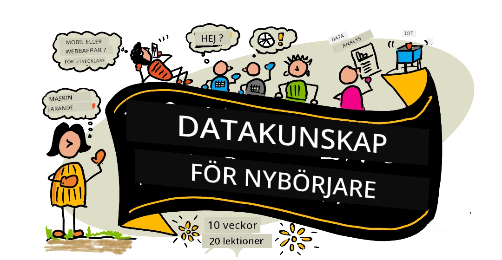
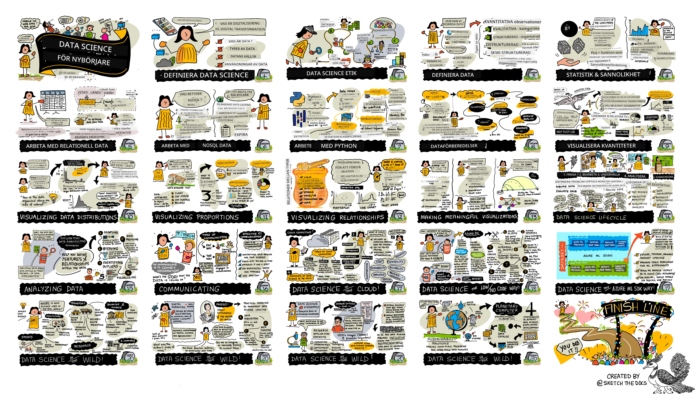

# Data Science för nybörjare - En kursplan

[](https://github.com/codespaces/new?hide_repo_select=true&ref=main&repo=344191198)

[](https://github.com/microsoft/Data-Science-For-Beginners/blob/master/LICENSE)
[](https://GitHub.com/microsoft/Data-Science-For-Beginners/graphs/contributors/)
[](https://GitHub.com/microsoft/Data-Science-For-Beginners/issues/)
[](https://GitHub.com/microsoft/Data-Science-For-Beginners/pulls/)
[](http://makeapullrequest.com)

[](https://GitHub.com/microsoft/Data-Science-For-Beginners/watchers/)
[](https://GitHub.com/microsoft/Data-Science-For-Beginners/network/)
[](https://GitHub.com/microsoft/Data-Science-For-Beginners/stargazers/)


[](https://discord.gg/nTYy5BXMWG)

[](https://aka.ms/foundry/forum)

Azure Cloud Advocates på Microsoft är glada att erbjuda en 10-veckors, 20-lektioners kursplan helt om Data Science. Varje lektion inkluderar för- och efter-quiz, skriftliga instruktioner för att slutföra lektionen, en lösning och en uppgift. Vår projektbaserade pedagogik gör att du lär dig medan du bygger, vilket är ett beprövat sätt för nya färdigheter att "fästa".

**Stort tack till våra författare:** [Jasmine Greenaway](https://www.twitter.com/paladique), [Dmitry Soshnikov](http://soshnikov.com), [Nitya Narasimhan](https://twitter.com/nitya), [Jalen McGee](https://twitter.com/JalenMcG), [Jen Looper](https://twitter.com/jenlooper), [Maud Levy](https://twitter.com/maudstweets), [Tiffany Souterre](https://twitter.com/TiffanySouterre), [Christopher Harrison](https://www.twitter.com/geektrainer).

**🙏 Speciellt tack 🙏 till våra [Microsoft Student Ambassador](https://studentambassadors.microsoft.com/) författare, granskare och innehållsbidragsgivare,** särskilt Aaryan Arora, [Aditya Garg](https://github.com/AdityaGarg00), [Alondra Sanchez](https://www.linkedin.com/in/alondra-sanchez-molina/), [Ankita Singh](https://www.linkedin.com/in/ankitasingh007), [Anupam Mishra](https://www.linkedin.com/in/anupam--mishra/), [Arpita Das](https://www.linkedin.com/in/arpitadas01/), ChhailBihari Dubey, [Dibri Nsofor](https://www.linkedin.com/in/dibrinsofor), [Dishita Bhasin](https://www.linkedin.com/in/dishita-bhasin-7065281bb), [Majd Safi](https://www.linkedin.com/in/majd-s/), [Max Blum](https://www.linkedin.com/in/max-blum-6036a1186/), [Miguel Correa](https://www.linkedin.com/in/miguelmque/), [Mohamma Iftekher (Iftu) Ebne Jalal](https://twitter.com/iftu119), [Nawrin Tabassum](https://www.linkedin.com/in/nawrin-tabassum), [Raymond Wangsa Putra](https://www.linkedin.com/in/raymond-wp/), [Rohit Yadav](https://www.linkedin.com/in/rty2423), Samridhi Sharma, [Sanya Sinha](https://www.linkedin.com/mwlite/in/sanya-sinha-13aab1200),
[Sheena Narula](https://www.linkedin.com/in/sheena-narua-n/), [Tauqeer Ahmad](https://www.linkedin.com/in/tauqeerahmad5201/), Yogendrasingh Pawar , [Vidushi Gupta](https://www.linkedin.com/in/vidushi-gupta07/), [Jasleen Sondhi](https://www.linkedin.com/in/jasleen-sondhi/)

||
|:---:|
| Data Science För Nybörjare - _Sketchnote av [@nitya](https://twitter.com/nitya)_ |

### 🌐 Fler språkstöd

#### Stöds via GitHub Action (Automatiserat & Alltid Uppdaterat)

<!-- CO-OP TRANSLATOR LANGUAGES TABLE START -->
[Arabiska](../ar/README.md) | [Bengali](../bn/README.md) | [Bulgariska](../bg/README.md) | [Burmese (Myanmar)](../my/README.md) | [Kinesiska (Förenklad)](../zh-CN/README.md) | [Kinesiska (Traditionell, Hong Kong)](../zh-HK/README.md) | [Kinesiska (Traditionell, Macau)](../zh-MO/README.md) | [Kinesiska (Traditionell, Taiwan)](../zh-TW/README.md) | [Kroatiska](../hr/README.md) | [Tjeckiska](../cs/README.md) | [Danska](../da/README.md) | [Holländska](../nl/README.md) | [Estniska](../et/README.md) | [Finska](../fi/README.md) | [Franska](../fr/README.md) | [Tyska](../de/README.md) | [Grekiska](../el/README.md) | [Hebreiska](../he/README.md) | [Hindi](../hi/README.md) | [Ungerska](../hu/README.md) | [Indonesiska](../id/README.md) | [Italienska](../it/README.md) | [Japanska](../ja/README.md) | [Kannada](../kn/README.md) | [Khmer](../km/README.md) | [Koreanska](../ko/README.md) | [Litauiska](../lt/README.md) | [Malay](../ms/README.md) | [Malayalam](../ml/README.md) | [Marathi](../mr/README.md) | [Nepali](../ne/README.md) | [Nigeriansk Pidgin](../pcm/README.md) | [Norska](../no/README.md) | [Persiska (Farsi)](../fa/README.md) | [Polska](../pl/README.md) | [Portugisiska (Brasilien)](../pt-BR/README.md) | [Portugisiska (Portugal)](../pt-PT/README.md) | [Punjabi (Gurmukhi)](../pa/README.md) | [Rumänska](../ro/README.md) | [Ryska](../ru/README.md) | [Serbiska (Kyrilliska)](../sr/README.md) | [Slovakiska](../sk/README.md) | [Slovenska](../sl/README.md) | [Spanska](../es/README.md) | [Swahili](../sw/README.md) | [Svenska](./README.md) | [Tagalog (Filipino)](../tl/README.md) | [Tamil](../ta/README.md) | [Telugu](../te/README.md) | [Thailändska](../th/README.md) | [Turkiska](../tr/README.md) | [Ukrainska](../uk/README.md) | [Urdu](../ur/README.md) | [Vietnamesiska](../vi/README.md)

> **Föredrar du att klona lokalt?**
>
> Detta förråd innehåller över 50 språköversättningar som avsevärt ökar nedladdningsstorleken. För att klona utan översättningar, använd sparse checkout:
>
> **Bash / macOS / Linux:**
> ```bash
> git clone --filter=blob:none --sparse https://github.com/microsoft/Data-Science-For-Beginners.git
> cd Data-Science-For-Beginners
> git sparse-checkout set --no-cone '/*' '!translations' '!translated_images'
> ```
>
> **CMD (Windows):**
> ```cmd
> git clone --filter=blob:none --sparse https://github.com/microsoft/Data-Science-For-Beginners.git
> cd Data-Science-For-Beginners
> git sparse-checkout set --no-cone "/*" "!translations" "!translated_images"
> ```
>
> Detta ger dig allt du behöver för att slutföra kursen med en mycket snabbare nedladdning.
<!-- CO-OP TRANSLATOR LANGUAGES TABLE END -->

**Om du vill ha fler översättningsspråk stöds de som listas [här](https://github.com/Azure/co-op-translator/blob/main/getting_started/supported-languages.md)**

#### Gå med i vår gemenskap
[](https://discord.gg/nTYy5BXMWG)

Vi har en pågående Discord-serie "Learn with AI", lär dig mer och gå med oss på [Learn with AI Series](https://aka.ms/learnwithai/discord) från 18 - 30 september, 2025. Du får tips och tricks för att använda GitHub Copilot för Data Science.


# Är du student?

Kom igång med följande resurser:

- [Student Hub-sida](https://docs.microsoft.com/en-gb/learn/student-hub?WT.mc_id=academic-77958-bethanycheum) På denna sida hittar du nybörjarresurser, studentpaket och till och med sätt att få ett gratis certifikatvouch. Detta är en sida du vill bokmärka och kolla regelbundet eftersom vi byter ut innehållet minst en gång i månaden.
- [Microsoft Learn Student Ambassadors](https://studentambassadors.microsoft.com?WT.mc_id=academic-77958-bethanycheum) Gå med i ett globalt community av studentambassadörer, detta kan vara din väg in i Microsoft.

# Komma igång

## 📚 Dokumentation

- **[Installationsguide](INSTALLATION.md)** - Steg-för-steg instruktioner för nybörjare
- **[Användarguide](USAGE.md)** - Exempel och vanliga arbetsflöden
- **[Felsökning](TROUBLESHOOTING.md)** - Lösningar på vanliga problem
- **[Bidragsguide](CONTRIBUTING.md)** - Hur man bidrar till detta projekt
- **[För lärare](for-teachers.md)** - Vägledning för undervisning och klassrumsresurser

## 👨‍🎓 För studenter
> **Fullständiga nybörjare**: Ny inom data science? Börja med våra [nybörjarvänliga exempel](examples/README.md)! Dessa enkla, välkommenterade exempel hjälper dig att förstå grunderna innan du går vidare till hela kursplanen.
> **[Studenter](https://aka.ms/student-page)**: för att använda denna kursplan själv, forka hela repot och gör övningarna på egen hand, börja med ett förföreläsnings-quiz. Läs sedan föreläsningen och slutför resten av aktiviteterna. Försök att skapa projekten genom att förstå lektionerna snarare än att kopiera lösningskoden; den koden finns dock tillgänglig i /solutions-mapparna i varje projektorienterad lektion. Ett annat förslag är att bilda en studiegrupp med vänner och gå igenom innehållet tillsammans. För vidare studier rekommenderar vi [Microsoft Learn](https://docs.microsoft.com/en-us/users/jenlooper-2911/collections/qprpajyoy3x0g7?WT.mc_id=academic-77958-bethanycheum).

**Snabbstart:**
1. Kolla [Installationsguiden](INSTALLATION.md) för att sätta upp din miljö
2. Gå igenom [Användarguiden](USAGE.md) för att lära dig arbeta med kursplanen
3. Börja med Lektion 1 och fortsätt i ordning
4. Gå med i vår [Discord-gemenskap](https://aka.ms/ds4beginners/discord) för stöd

## 👩‍🏫 För lärare
> **Lärare**: vi har [inkluderat några förslag](for-teachers.md) på hur du kan använda detta läroplan. Vi vill gärna ha din feedback [i vårt diskussionsforum](https://github.com/microsoft/Data-Science-For-Beginners/discussions)!

## Möt teamet

[](https://youtu.be/8mzavjQSMM4 "Promo video")

**Gif av** [Mohit Jaisal](https://www.linkedin.com/in/mohitjaisal)

> 🎥 Klicka på bilden ovan för en video om projektet och människorna som skapade det!

## Pedagogik

Vi har valt två pedagogiska principer när vi byggde denna läroplan: att säkerställa att den är projektbaserad och att den innehåller frekventa quiz. I slutet av denna serie kommer eleverna ha lärt sig grundläggande principer för datavetenskap, inklusive etiska koncept, datarensning, olika sätt att arbeta med data, datavisualisering, dataanalys, verkliga användningsfall av datavetenskap och mer.

Dessutom sätter ett lågintensivt quiz före lektionen elevens intention mot att lära sig ett ämne, medan ett andra quiz efter lektionen säkerställer ytterligare retention. Denna läroplan är utformad för att vara flexibel och rolig och kan genomföras i sin helhet eller delvis. Projekten börjar små och blir successivt mer komplexa under den 10 veckors cykeln.

> Hitta våra [uppförandekoder](CODE_OF_CONDUCT.md), [bidragsregler](CONTRIBUTING.md), [översättningsriktlinjer](TRANSLATIONS.md). Vi välkomnar din konstruktiva feedback!

## Varje lektion inkluderar:

- Frivillig sketchnote
- Frivillig kompletterande video
- Uppvärmningsquiz före lektionen
- Skriftlig lektion
- För projektbaserade lektioner, steg-för-steg guider för hur man bygger projektet
- Kunskapskontroller
- En utmaning
- Kompletterande läsning
- Uppgift
- [Quiz efter lektionen](https://ff-quizzes.netlify.app/en/)

> **En anmärkning om quiz**: Alla quiz finns i Quiz-App mappen, totalt 40 quiz med tre frågor vardera. De länkas från lektionerna, men quiz-appen kan köras lokalt eller distribueras till Azure; följ instruktionerna i `quiz-app` mappen. De håller på att lokaliseras successivt.

## 🎓 Börjarvänliga exempel

**Ny till datavetenskap?** Vi har skapat en speciell [exempelmapp](examples/README.md) med enkel, välkommenterad kod för att hjälpa dig komma igång:

- 🌟 **Hello World** - Ditt första datavetenskapsprogram
- 📂 **Ladda data** - Lär dig läsa och utforska dataset
- 📊 **Enkel analys** - Beräkna statistik och hitta mönster
- 📈 **Grundläggande visualisering** - Skapa diagram och grafer
- 🔬 **Reellt projekt** - Komplett arbetsflöde från start till mål

Varje exempel innehåller detaljerade kommentarer som förklarar varje steg, perfekt för absoluta nybörjare!

👉 **[Börja med exemplen](examples/README.md)** 👈

## Lektioner


||
|:---:|
| Datavetenskap för nybörjare: färdplan - _Sketchnote av [@nitya](https://twitter.com/nitya)_ |


| Lektion nummer | Ämne | Lektiongruppering | Lärandemål | Länkad lektion | Författare |
| :-----------: | :----------------------------------------: | :--------------------------------------------------: | :-----------------------------------------------------------------------------------------------------------------------------------------------------------------------: | :---------------------------------------------------------------------: | :----: |
| 01 | Definiera datavetenskap | [Introduktion](1-Introduction/README.md) | Lär dig grundläggande koncept bakom datavetenskap och hur det relaterar till artificiell intelligens, maskininlärning och big data. | [lektion](1-Introduction/01-defining-data-science/README.md) [video](https://youtu.be/beZ7Mb_oz9I) | [Dmitry](http://soshnikov.com) |
| 02 | Datavetenskapsetik | [Introduktion](1-Introduction/README.md) | Koncept, utmaningar och ramverk inom dataetik. | [lektion](1-Introduction/02-ethics/README.md) | [Nitya](https://twitter.com/nitya) |
| 03 | Definiera data | [Introduktion](1-Introduction/README.md) | Hur data klassificeras och dess vanliga källor. | [lektion](1-Introduction/03-defining-data/README.md) | [Jasmine](https://www.twitter.com/paladique) |
| 04 | Introduktion till statistik och sannolikhet | [Introduktion](1-Introduction/README.md) | Matematiska tekniker inom sannolikhet och statistik för att förstå data. | [lektion](1-Introduction/04-stats-and-probability/README.md) [video](https://youtu.be/Z5Zy85g4Yjw) | [Dmitry](http://soshnikov.com) |
| 05 | Arbeta med relationsdata | [Arbeta med data](2-Working-With-Data/README.md) | Introduktion till relationsdata och grunderna för att utforska och analysera relationsdata med Structured Query Language, även känt som SQL (uttalas “see-quell”). | [lektion](2-Working-With-Data/05-relational-databases/README.md) | [Christopher](https://www.twitter.com/geektrainer) | | |
| 06 | Arbeta med NoSQL-data | [Arbeta med data](2-Working-With-Data/README.md) | Introduktion till icke-relationsdata, dess olika typer och grunderna i att utforska och analysera dokumentdatabaser. | [lektion](2-Working-With-Data/06-non-relational/README.md) | [Jasmine](https://twitter.com/paladique)|
| 07 | Arbeta med Python | [Arbeta med data](2-Working-With-Data/README.md) | Grunder för att använda Python för datautforskning med bibliotek som Pandas. En grundläggande förståelse av Python-programmering rekommenderas. | [lektion](2-Working-With-Data/07-python/README.md) [video](https://youtu.be/dZjWOGbsN4Y) | [Dmitry](http://soshnikov.com) |
| 08 | Datapreparation | [Arbeta med data](2-Working-With-Data/README.md) | Ämnen om datatekniker för att rengöra och transformera data för att hantera utmaningar med saknad, inexakt eller ofullständig data. | [lektion](2-Working-With-Data/08-data-preparation/README.md) | [Jasmine](https://www.twitter.com/paladique) |
| 09 | Visualisera kvantiteter | [Datavisualisering](3-Data-Visualization/README.md) | Lär dig använda Matplotlib för att visualisera fågeldatan 🦆 | [lektion](3-Data-Visualization/09-visualization-quantities/README.md) | [Jen](https://twitter.com/jenlooper) |
| 10 | Visualisera fördelningar av data | [Datavisualisering](3-Data-Visualization/README.md) | Visualisering av observationer och trender inom ett intervall. | [lektion](3-Data-Visualization/10-visualization-distributions/README.md) | [Jen](https://twitter.com/jenlooper) |
| 11 | Visualisera proportioner | [Datavisualisering](3-Data-Visualization/README.md) | Visualisera diskreta och grupperade procentandelar. | [lektion](3-Data-Visualization/11-visualization-proportions/README.md) | [Jen](https://twitter.com/jenlooper) |
| 12 | Visualisera relationer | [Datavisualisering](3-Data-Visualization/README.md) | Visualisera kopplingar och korrelationer mellan dataset och deras variabler. | [lektion](3-Data-Visualization/12-visualization-relationships/README.md) | [Jen](https://twitter.com/jenlooper) |
| 13 | Meningsfulla visualiseringar | [Datavisualisering](3-Data-Visualization/README.md) | Tekniker och vägledning för att göra dina visualiseringar värdefulla för effektiv problemlösning och insikter. | [lektion](3-Data-Visualization/13-meaningful-visualizations/README.md) | [Jen](https://twitter.com/jenlooper) |
| 14 | Introduktion till datavetenskapslivscykeln | [Livscykel](4-Data-Science-Lifecycle/README.md) | Introduktion till datavetenskapslivscykeln och dess första steg med att förvärva och extrahera data. | [lektion](4-Data-Science-Lifecycle/14-Introduction/README.md) | [Jasmine](https://twitter.com/paladique) |
| 15 | Analysering | [Livscykel](4-Data-Science-Lifecycle/README.md) | Den här fasen i datavetenskapslivscykeln fokuserar på tekniker för dataanalys. | [lektion](4-Data-Science-Lifecycle/15-analyzing/README.md) | [Jasmine](https://twitter.com/paladique) | | |
| 16 | Kommunikation | [Livscykel](4-Data-Science-Lifecycle/README.md) | Den här fasen i datavetenskapslivscykeln fokuserar på att presentera insikter från data på ett sätt som gör det enklare för beslutsfattare att förstå. | [lektion](4-Data-Science-Lifecycle/16-communication/README.md) | [Jalen](https://twitter.com/JalenMcG) | | |
| 17 | Datavetenskap i molnet | [Molndata](5-Data-Science-In-Cloud/README.md) | Denna serie lektioner introducerar datavetenskap i molnet och dess fördelar. | [lektion](5-Data-Science-In-Cloud/17-Introduction/README.md) | [Tiffany](https://twitter.com/TiffanySouterre) och [Maud](https://twitter.com/maudstweets) |
| 18 | Datavetenskap i molnet | [Molndata](5-Data-Science-In-Cloud/README.md) | Träning av modeller med Low Code-verktyg. |[lektion](5-Data-Science-In-Cloud/18-Low-Code/README.md) | [Tiffany](https://twitter.com/TiffanySouterre) och [Maud](https://twitter.com/maudstweets) |
| 19 | Datavetenskap i molnet | [Molndata](5-Data-Science-In-Cloud/README.md) | Distribuera modeller med Azure Machine Learning Studio. | [lektion](5-Data-Science-In-Cloud/19-Azure/README.md)| [Tiffany](https://twitter.com/TiffanySouterre) och [Maud](https://twitter.com/maudstweets) |
| 20 | Datavetenskap ute i verkligheten | [I verkligheten](6-Data-Science-In-Wild/README.md) | Datavetenskapsdrivna projekt i verkliga världen. | [lektion](6-Data-Science-In-Wild/20-Real-World-Examples/README.md) | [Nitya](https://twitter.com/nitya) |

## GitHub Codespaces

Följ dessa steg för att öppna detta exempel i en Codespace:
1. Klicka på menyn Code och välj alternativet Open with Codespaces.
2. Välj + New codespace längst ned i fönstret.
För mer information, se [GitHub-dokumentationen](https://docs.github.com/en/codespaces/developing-in-codespaces/creating-a-codespace-for-a-repository#creating-a-codespace).

## VSCode Remote - Containers
Följ dessa steg för att öppna detta repo i en container med din lokala dator och VSCode med hjälp av VS Code Remote - Containers tillägget:

1. Om det är första gången du använder en utvecklingscontainer, kontrollera att din dator uppfyller förkraven (t.ex. att Docker är installerat) i [kom igång-dokumentationen](https://code.visualstudio.com/docs/devcontainers/containers#_getting-started).

För att använda detta repository kan du antingen öppna repositoryt i en isolerad Docker-volym:

**Observera**: Under huven används kommandot Remote-Containers: **Clone Repository in Container Volume...** för att klona källkoden i en Docker-volym istället för lokal filsystem. [Volymer](https://docs.docker.com/storage/volumes/) är den föredragna mekanismen för att spara containerdata.

Eller öppna en lokalt klonad eller nedladdad version av repositoryt:

- Klona detta repository till din lokala filsystem.
- Tryck på F1 och välj kommandot **Remote-Containers: Open Folder in Container...**.
- Välj den klonade kopian av denna mapp, vänta på att containern startar, och testa.

## Offline-åtkomst

Du kan köra denna dokumentation offline med hjälp av [Docsify](https://docsify.js.org/#/). Forka detta repo, [installera Docsify](https://docsify.js.org/#/quickstart) på din lokala dator, skriv sedan `docsify serve` i rotmappen för detta repo. Webbplatsen serveras på port 3000 på din localhost: `localhost:3000`.

> Observera, notebooks återges inte via Docsify, så när du behöver köra en notebook, gör det separat i VS Code med en Python-kärna.

## Andra läroplaner

Vårt team producerar andra läroplaner! Kolla in:

<!-- CO-OP TRANSLATOR OTHER COURSES START -->
### LangChain
[](https://aka.ms/langchain4j-for-beginners)
[](https://aka.ms/langchainjs-for-beginners?WT.mc_id=m365-94501-dwahlin)
[](https://github.com/microsoft/langchain-for-beginners?WT.mc_id=m365-94501-dwahlin)
---

### Azure / Edge / MCP / Agenter
[](https://github.com/microsoft/AZD-for-beginners?WT.mc_id=academic-105485-koreyst)
[](https://github.com/microsoft/edgeai-for-beginners?WT.mc_id=academic-105485-koreyst)
[](https://github.com/microsoft/mcp-for-beginners?WT.mc_id=academic-105485-koreyst)
[](https://github.com/microsoft/ai-agents-for-beginners?WT.mc_id=academic-105485-koreyst)

---
 
### Generativ AI-serie
[](https://github.com/microsoft/generative-ai-for-beginners?WT.mc_id=academic-105485-koreyst)
[-9333EA?style=for-the-badge&labelColor=E5E7EB&color=9333EA)](https://github.com/microsoft/Generative-AI-for-beginners-dotnet?WT.mc_id=academic-105485-koreyst)
[-C084FC?style=for-the-badge&labelColor=E5E7EB&color=C084FC)](https://github.com/microsoft/generative-ai-for-beginners-java?WT.mc_id=academic-105485-koreyst)
[-E879F9?style=for-the-badge&labelColor=E5E7EB&color=E879F9)](https://github.com/microsoft/generative-ai-with-javascript?WT.mc_id=academic-105485-koreyst)

---
 
### Kärninlärning
[](https://aka.ms/ml-beginners?WT.mc_id=academic-105485-koreyst)
[](https://aka.ms/datascience-beginners?WT.mc_id=academic-105485-koreyst)
[](https://aka.ms/ai-beginners?WT.mc_id=academic-105485-koreyst)
[](https://github.com/microsoft/Security-101?WT.mc_id=academic-96948-sayoung)
[](https://aka.ms/webdev-beginners?WT.mc_id=academic-105485-koreyst)
[](https://aka.ms/iot-beginners?WT.mc_id=academic-105485-koreyst)
[](https://github.com/microsoft/xr-development-for-beginners?WT.mc_id=academic-105485-koreyst)

---
 
### Copilot-serie
[](https://aka.ms/GitHubCopilotAI?WT.mc_id=academic-105485-koreyst)
[](https://github.com/microsoft/mastering-github-copilot-for-dotnet-csharp-developers?WT.mc_id=academic-105485-koreyst)
[](https://github.com/microsoft/CopilotAdventures?WT.mc_id=academic-105485-koreyst)
<!-- CO-OP TRANSLATOR OTHER COURSES END -->

## Få hjälp

**Stöter du på problem?** Kolla vår [Felsökningsguide](TROUBLESHOOTING.md) för lösningar på vanliga problem.

Om du fastnar eller har frågor om att bygga AI-appar. Gå med i diskussioner om MCP med andra lärande och erfarna utvecklare. Det är en stödjande community där frågor är välkomna och kunskap delas fritt.

[](https://discord.gg/nTYy5BXMWG)

Om du har produktfeedback eller stöter på fel under utvecklingen, besök:

[](https://aka.ms/foundry/forum)

---

<!-- CO-OP TRANSLATOR DISCLAIMER START -->
**Ansvarsfriskrivning**:
Detta dokument har översatts med hjälp av AI-översättningstjänsten [Co-op Translator](https://github.com/Azure/co-op-translator). Även om vi strävar efter noggrannhet, bör du vara medveten om att automatiska översättningar kan innehålla fel eller brister. Det ursprungliga dokumentet på dess modersmål bör betraktas som den auktoritativa källan. För viktig information rekommenderas professionell mänsklig översättning. Vi ansvarar inte för några missförstånd eller feltolkningar som uppstår från användningen av denna översättning.
<!-- CO-OP TRANSLATOR DISCLAIMER END -->