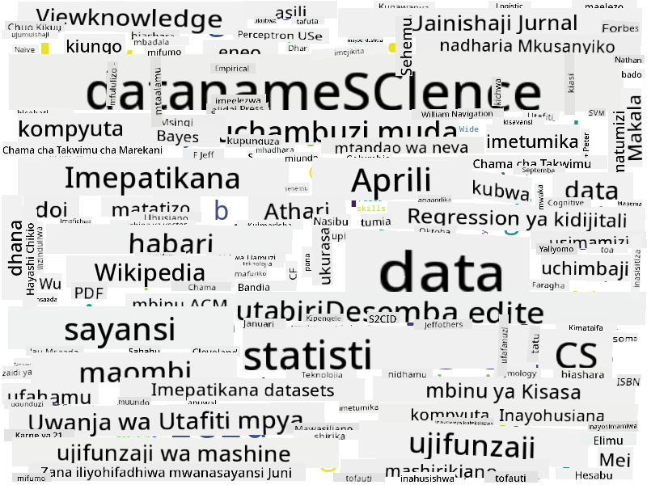

<!--
CO_OP_TRANSLATOR_METADATA:
{
  "original_hash": "2583a9894af7123b2fcae3376b14c035",
  "translation_date": "2025-08-26T15:18:27+00:00",
  "source_file": "1-Introduction/01-defining-data-science/README.md",
  "language_code": "sw"
}
-->
## Aina za Data

Kama tulivyotaja tayari, data ipo kila mahali. Tunahitaji tu kuikusanya kwa njia sahihi! Ni muhimu kutofautisha kati ya **data iliyopangiliwa** na **data isiyopangiliwa**. Data iliyopangiliwa mara nyingi huwakilishwa kwa mfumo uliopangiliwa vizuri, mara nyingi kama jedwali au idadi ya majedwali, wakati data isiyopangiliwa ni mkusanyiko wa faili tu. Wakati mwingine tunaweza pia kuzungumzia **data nusu-pangiliwa**, ambayo ina aina fulani ya muundo unaoweza kutofautiana sana.

| Iliyopangiliwa                                                              | Nusu-pangiliwa                                                                                 | Isiyopangiliwa                          |
| ---------------------------------------------------------------------------- | ---------------------------------------------------------------------------------------------- | --------------------------------------- |
| Orodha ya watu na namba zao za simu                                         | Kurasa za Wikipedia zenye viungo                                                                | Maandishi ya Encyclopedia Britannica    |
| Joto katika vyumba vyote vya jengo kila dakika kwa miaka 20 iliyopita       | Mkusanyiko wa makala za kisayansi katika muundo wa JSON zenye waandishi, tarehe ya kuchapishwa, na muhtasari | Hifadhi ya faili yenye nyaraka za kampuni |
| Data ya umri na jinsia ya watu wote wanaoingia jengo                        | Kurasa za mtandao                                                                               | Video ghafi kutoka kamera ya ufuatiliaji |

## Wapi pa Kupata Data

Kuna vyanzo vingi vya data, na itakuwa vigumu kuorodhesha vyote! Hata hivyo, hebu tutaje baadhi ya maeneo ya kawaida ambapo unaweza kupata data:

* **Iliyopangiliwa**
  - **Internet of Things** (IoT), ikijumuisha data kutoka kwa sensa mbalimbali, kama sensa za joto au shinikizo, hutoa data nyingi muhimu. Kwa mfano, ikiwa jengo la ofisi lina sensa za IoT, tunaweza kudhibiti kiotomatiki joto na taa ili kupunguza gharama.
  - **Utafiti** tunaowauliza watumiaji kukamilisha baada ya ununuzi, au baada ya kutembelea tovuti.
  - **Uchambuzi wa tabia** unaweza, kwa mfano, kutusaidia kuelewa jinsi mtumiaji anavyotumia tovuti, na sababu ya kawaida ya kuondoka kwenye tovuti.
* **Isiyopangiliwa**
  - **Maandishi** yanaweza kuwa chanzo tajiri cha maarifa, kama alama ya jumla ya **hisia**, au uchimbaji wa maneno muhimu na maana ya kisemantiki.
  - **Picha** au **Video**. Video kutoka kamera ya ufuatiliaji inaweza kutumika kukadiria msongamano wa magari barabarani, na kuwajulisha watu kuhusu foleni zinazoweza kutokea.
  - **Kumbukumbu za seva ya mtandao** zinaweza kutumika kuelewa ni kurasa zipi za tovuti yetu zinatembelewa mara nyingi zaidi, na kwa muda gani.
* Nusu-pangiliwa
  - **Grafu za Mitandao ya Kijamii** zinaweza kuwa vyanzo bora vya data kuhusu tabia za watumiaji na ufanisi wao wa kusambaza taarifa.
  - Tunapokuwa na mkusanyiko wa picha kutoka sherehe, tunaweza kujaribu kuchambua data ya **Dinamiki ya Kundi** kwa kujenga grafu ya watu wanaopiga picha pamoja.

Kwa kujua vyanzo mbalimbali vya data, unaweza kujaribu kufikiria hali tofauti ambapo mbinu za sayansi ya data zinaweza kutumika kuelewa hali vizuri zaidi, na kuboresha michakato ya biashara.

## Unachoweza Kufanya na Data

Katika Sayansi ya Data, tunazingatia hatua zifuatazo za safari ya data:

Bila shaka, kulingana na data halisi, baadhi ya hatua zinaweza kukosekana (mfano, tunapokuwa tayari na data kwenye hifadhidata, au tunapokuwa hatuhitaji mafunzo ya modeli), au baadhi ya hatua zinaweza kurudiwa mara kadhaa (kama usindikaji wa data).

## Dijitalizaji na Mabadiliko ya Kidijitali

Katika muongo uliopita, biashara nyingi zimeanza kuelewa umuhimu wa data katika kufanya maamuzi ya kibiashara. Ili kutumia kanuni za sayansi ya data katika kuendesha biashara, mtu kwanza anahitaji kukusanya data fulani, yaani kutafsiri michakato ya biashara katika mfumo wa kidijitali. Hii inajulikana kama **dijitalizaji**. Kutumia mbinu za sayansi ya data kwa data hii ili kuongoza maamuzi kunaweza kusababisha ongezeko kubwa la tija (au hata mabadiliko ya biashara), yanayoitwa **mabadiliko ya kidijitali**.

Hebu tuzingatie mfano. Tuseme tuna kozi ya sayansi ya data (kama hii) tunayoitoa mtandaoni kwa wanafunzi, na tunataka kutumia sayansi ya data kuiboresha. Tunawezaje kufanya hivyo?

Tunaweza kuanza kwa kujiuliza "Nini kinaweza kudijitalizwa?" Njia rahisi zaidi itakuwa kupima muda unaochukua kila mwanafunzi kukamilisha kila moduli, na kupima maarifa yaliyopatikana kwa kutoa mtihani wa chaguo nyingi mwishoni mwa kila moduli. Kwa kuhesabu wastani wa muda wa kukamilisha kwa wanafunzi wote, tunaweza kugundua ni moduli zipi zinazosababisha ugumu zaidi kwa wanafunzi, na kufanya kazi ya kuzirahisisha.
Unaweza kusema kwamba mbinu hii si bora, kwa sababu moduli zinaweza kuwa na urefu tofauti. Inawezekana ni haki zaidi kugawa muda kulingana na urefu wa moduli (kwa idadi ya herufi), na kulinganisha thamani hizo badala yake.
Tunapoanza kuchambua matokeo ya mitihani ya kuchagua jibu sahihi, tunaweza kujaribu kubaini ni dhana zipi wanafunzi wanapata ugumu wa kuelewa, na kutumia taarifa hiyo kuboresha maudhui. Ili kufanya hivyo, tunahitaji kubuni mitihani kwa njia ambayo kila swali linaendana na dhana fulani au kipande cha maarifa.

Ikiwa tunataka kufanya uchambuzi wa kina zaidi, tunaweza kuchora muda unaotumika kwa kila moduli dhidi ya kundi la umri wa wanafunzi. Tunaweza kugundua kwamba kwa baadhi ya makundi ya umri, inachukua muda mrefu kupita kiasi kukamilisha moduli, au kwamba wanafunzi wanajiondoa kabla ya kuikamilisha. Hii inaweza kutusaidia kutoa mapendekezo ya umri kwa moduli, na kupunguza kutoridhika kwa watu kutokana na matarajio yasiyo sahihi.

## 🚀 Changamoto

Katika changamoto hii, tutajaribu kutafuta dhana zinazohusiana na uwanja wa Sayansi ya Takwimu kwa kuangalia maandishi. Tutachukua makala ya Wikipedia kuhusu Sayansi ya Takwimu, kupakua na kuchakata maandishi, kisha kujenga wingu la maneno kama hili:

Tembelea [`notebook.ipynb`](../../../../../../../../../1-Introduction/01-defining-data-science/notebook.ipynb ':ignore') kusoma kupitia msimbo. Unaweza pia kuendesha msimbo, na kuona jinsi unavyofanya mabadiliko ya data kwa muda halisi.

> Ikiwa hujui jinsi ya kuendesha msimbo katika Jupyter Notebook, angalia [makala hii](https://soshnikov.com/education/how-to-execute-notebooks-from-github/).

## [Jaribio la baada ya somo](https://purple-hill-04aebfb03.1.azurestaticapps.net/quiz/1)

## Majukumu

* **Kazi ya 1**: Badilisha msimbo hapo juu ili kutafuta dhana zinazohusiana na nyanja za **Big Data** na **Machine Learning**
* **Kazi ya 2**: [Fikiria Kuhusu Matukio ya Sayansi ya Takwimu](assignment.md)

## Credits

Somo hili limeandikwa kwa ♥️ na [Dmitry Soshnikov](http://soshnikov.com)

---

**Kanusho**:  
Hati hii imetafsiriwa kwa kutumia huduma ya tafsiri ya AI [Co-op Translator](https://github.com/Azure/co-op-translator). Ingawa tunajitahidi kwa usahihi, tafadhali fahamu kuwa tafsiri za kiotomatiki zinaweza kuwa na makosa au kutokuwa sahihi. Hati ya asili katika lugha yake ya awali inapaswa kuzingatiwa kama chanzo cha mamlaka. Kwa taarifa muhimu, inashauriwa kutumia huduma ya tafsiri ya kitaalamu ya binadamu. Hatutawajibika kwa maelewano mabaya au tafsiri zisizo sahihi zinazotokana na matumizi ya tafsiri hii.