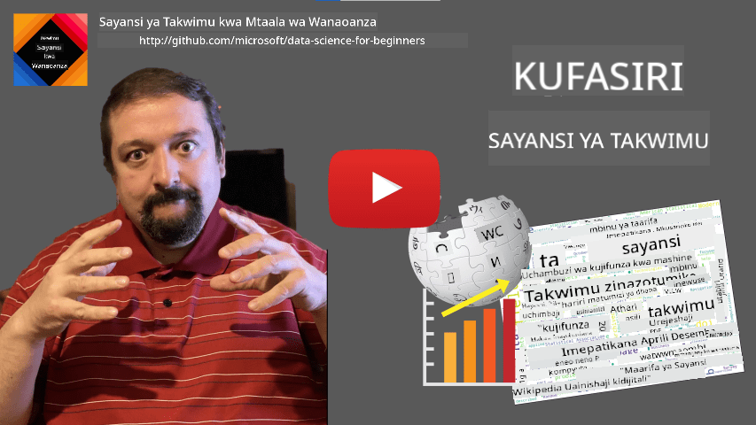

<!--
CO_OP_TRANSLATOR_METADATA:
{
  "original_hash": "43212cc1ac137b7bb1dcfb37ca06b0f4",
  "translation_date": "2025-10-25T19:02:59+00:00",
  "source_file": "1-Introduction/01-defining-data-science/README.md",
  "language_code": "sw"
}
-->
# Kufafanua Sayansi ya Takwimu

|  ](../../sketchnotes/01-Definitions.png) |
| :----------------------------------------------------------------------------------------------------: |
|              Kufafanua Sayansi ya Takwimu - _Sketchnote na [@nitya](https://twitter.com/nitya)_               |

---

## [Jaribio la kabla ya somo](https://ff-quizzes.netlify.app/en/ds/quiz/0)

## Takwimu ni nini?
Katika maisha yetu ya kila siku, tunazungukwa na takwimu kila wakati. Maandishi unayosoma sasa ni takwimu. Orodha ya namba za simu za marafiki wako kwenye simu yako ni takwimu, pamoja na muda wa sasa unaoonyeshwa kwenye saa yako. Kama binadamu, tunafanya kazi na takwimu kwa asili kwa kuhesabu pesa tulizo nazo au kwa kuandika barua kwa marafiki zetu.

Hata hivyo, takwimu zimekuwa muhimu zaidi na kuundwa kwa kompyuta. Kazi kuu ya kompyuta ni kufanya mahesabu, lakini zinahitaji takwimu ili kufanya kazi. Kwa hivyo, tunahitaji kuelewa jinsi kompyuta zinavyohifadhi na kuchakata takwimu.

Kwa kuibuka kwa mtandao, jukumu la kompyuta kama vifaa vya kushughulikia takwimu limeongezeka. Ukifikiria, sasa tunatumia kompyuta zaidi na zaidi kwa uchakataji wa takwimu na mawasiliano, badala ya mahesabu halisi. Tunapoandika barua pepe kwa rafiki au kutafuta taarifa fulani kwenye mtandao - kimsingi tunatengeneza, kuhifadhi, kusambaza, na kuendesha takwimu.
> Je, unaweza kukumbuka mara ya mwisho ulipotumia kompyuta kufanya mahesabu halisi?

## Sayansi ya Takwimu ni nini?

Kulingana na [Wikipedia](https://en.wikipedia.org/wiki/Data_science), **Sayansi ya Takwimu** inafafanuliwa kama *sehemu ya kisayansi inayotumia mbinu za kisayansi kutoa maarifa na ufahamu kutoka kwa takwimu zilizopangwa na zisizo na mpangilio, na kutumia maarifa na ufahamu wa vitendo kutoka kwa takwimu katika nyanja mbalimbali za matumizi*.

Ufafanuzi huu unaangazia vipengele muhimu vya sayansi ya takwimu:

* Lengo kuu la sayansi ya takwimu ni **kutoa maarifa** kutoka kwa takwimu, kwa maneno mengine - **kuelewa** takwimu, kutafuta uhusiano uliofichika na kujenga **mfano**.
* Sayansi ya takwimu hutumia **mbinu za kisayansi**, kama vile uwezekano na takwimu. Kwa kweli, wakati neno *sayansi ya takwimu* lilipoanzishwa, baadhi ya watu walidai kuwa sayansi ya takwimu ilikuwa tu jina jipya la kifahari la takwimu. Siku hizi imekuwa dhahiri kwamba uwanja huu ni mpana zaidi.
* Maarifa yaliyopatikana yanapaswa kutumika kuzalisha **ufahamu wa vitendo**, yaani, maarifa ya vitendo ambayo unaweza kutumia katika hali halisi za biashara.
* Tunapaswa kuwa na uwezo wa kufanya kazi na takwimu **zilizopangwa** na **zisizo na mpangilio**. Tutarejea kujadili aina tofauti za takwimu baadaye katika kozi.
* **Nyanja ya matumizi** ni dhana muhimu, na wanasayansi wa takwimu mara nyingi wanahitaji angalau kiwango fulani cha utaalamu katika nyanja ya tatizo, kwa mfano: fedha, tiba, masoko, n.k.

> Kipengele kingine muhimu cha Sayansi ya Takwimu ni kwamba inachunguza jinsi takwimu zinavyoweza kukusanywa, kuhifadhiwa na kuendeshwa kwa kutumia kompyuta. Wakati takwimu zinatupa misingi ya hisabati, sayansi ya takwimu hutumia dhana za hisabati kutoa ufahamu halisi kutoka kwa takwimu.

Njia moja (inayohusishwa na [Jim Gray](https://en.wikipedia.org/wiki/Jim_Gray_(computer_scientist))) ya kuangalia sayansi ya takwimu ni kuiona kama dhana tofauti ya sayansi:
* **Empirika**, ambapo tunategemea zaidi uchunguzi na matokeo ya majaribio
* **Nadharia**, ambapo dhana mpya zinatokana na maarifa ya kisayansi yaliyopo
* **Kompyuta**, ambapo tunagundua kanuni mpya kulingana na majaribio ya kompyuta
* **Inayotokana na Takwimu**, inayotegemea kugundua uhusiano na mifumo katika takwimu  

## Nyanja Nyingine Zinazohusiana

Kwa kuwa takwimu zipo kila mahali, sayansi ya takwimu yenyewe pia ni uwanja mpana, unaogusa taaluma nyingi nyingine.

<dl>
<dt>Hifadhidata</dt>
<dd>
Jambo muhimu ni <b>jinsi ya kuhifadhi</b> takwimu, yaani jinsi ya kuipanga kwa njia inayoruhusu uchakataji wa haraka. Kuna aina tofauti za hifadhidata zinazohifadhi takwimu zilizopangwa na zisizo na mpangilio, ambazo <a href="../../2-Working-With-Data/README.md">tutazichunguza katika kozi yetu</a>.
</dd>
<dt>Takwimu Kubwa</dt>
<dd>
Mara nyingi tunahitaji kuhifadhi na kuchakata kiasi kikubwa cha takwimu zenye muundo rahisi. Kuna mbinu maalum na zana za kuhifadhi takwimu hizo kwa njia ya kusambazwa kwenye klasta ya kompyuta, na kuzichakata kwa ufanisi.
</dd>
<dt>Ujifunzaji wa Mashine</dt>
<dd>
Njia moja ya kuelewa takwimu ni <b>kujenga mfano</b> ambao utaweza kutabiri matokeo yanayotarajiwa. Kuunda mifano kutoka kwa takwimu kunaitwa <b>ujifunzaji wa mashine</b>. Unaweza kutaka kuangalia <a href="https://aka.ms/ml-beginners">Mtaala wa Ujifunzaji wa Mashine kwa Wanaoanza</a> ili kujifunza zaidi kuhusu hili.
</dd>
<dt>Akili Bandia</dt>
<dd>
Eneo la ujifunzaji wa mashine linalojulikana kama akili bandia (AI) pia linategemea takwimu, na linahusisha kujenga mifano ya hali ya juu inayofanana na michakato ya kufikiri ya binadamu. Mbinu za AI mara nyingi hutuwezesha kubadilisha takwimu zisizo na mpangilio (mfano lugha asilia) kuwa ufahamu ulio na muundo.
</dd>
<dt>Uwasilishaji wa Takwimu</dt>
<dd>
Kiasi kikubwa cha takwimu ni vigumu kueleweka kwa binadamu, lakini mara tunapounda uwasilishaji wa maana kwa kutumia takwimu hizo, tunaweza kuelewa zaidi takwimu hizo, na kutoa hitimisho fulani. Kwa hivyo, ni muhimu kujua njia nyingi za kuwasilisha taarifa - jambo ambalo tutalifundisha katika <a href="../../3-Data-Visualization/README.md">Sehemu ya 3</a> ya kozi yetu. Nyanja zinazohusiana pia ni pamoja na <b>Infographics</b>, na <b>Uingiliano wa Binadamu na Kompyuta</b> kwa ujumla.
</dd>
</dl>

## Aina za Takwimu

Kama tulivyokwisha taja, takwimu zipo kila mahali. Tunahitaji tu kuzichukua kwa njia sahihi! Ni muhimu kutofautisha kati ya takwimu **zilizopangwa** na **zisizo na mpangilio**. Takwimu zilizopangwa kwa kawaida huwakilishwa kwa muundo mzuri, mara nyingi kama jedwali au idadi ya majedwali, wakati takwimu zisizo na mpangilio ni mkusanyiko wa faili. Wakati mwingine tunaweza pia kuzungumzia takwimu **zisizo na mpangilio wa nusu**, ambazo zina aina fulani ya muundo unaoweza kutofautiana sana.

| Zilizopangwa                                                                   | Zisizo na mpangilio wa nusu                                                                                | Zisizo na mpangilio                            |
| ---------------------------------------------------------------------------- | ---------------------------------------------------------------------------------------------- | --------------------------------------- |
| Orodha ya watu na namba zao za simu                                      | Kurasa za Wikipedia zenye viungo                                                                     | Maandishi ya Encyclopedia Britannica        |
| Joto katika vyumba vyote vya jengo kila dakika kwa miaka 20 iliyopita | Mkusanyiko wa makala za kisayansi katika muundo wa JSON na waandishi, tarehe ya kuchapishwa, na muhtasari | Hifadhi ya faili yenye nyaraka za kampuni     |
| Takwimu za umri na jinsia ya watu wote wanaoingia jengoni                  | Kurasa za mtandao                                                                                 | Video ghafi kutoka kamera ya ulinzi |

## Wapi pa Kupata Takwimu

Kuna vyanzo vingi vinavyowezekana vya takwimu, na itakuwa vigumu kuorodhesha vyote! Hata hivyo, hebu tutaje baadhi ya maeneo ya kawaida ambapo unaweza kupata takwimu:

* **Zilizopangwa**
  - **Mtandao wa Vitu** (IoT), ikiwa ni pamoja na takwimu kutoka kwa sensa tofauti, kama vile sensa za joto au shinikizo, hutoa takwimu nyingi za manufaa. Kwa mfano, ikiwa jengo la ofisi limewekwa sensa za IoT, tunaweza kudhibiti kiotomatiki joto na taa ili kupunguza gharama.
  - **Utafiti** tunaowauliza watumiaji kukamilisha baada ya ununuzi, au baada ya kutembelea tovuti.
  - **Uchambuzi wa tabia** unaweza, kwa mfano, kutusaidia kuelewa jinsi mtumiaji anavyotumia tovuti, na sababu ya kawaida ya kuondoka kwenye tovuti.
* **Zisizo na mpangilio**
  - **Maandishi** yanaweza kuwa chanzo kikubwa cha ufahamu, kama vile alama ya jumla ya **hisia**, au kutoa maneno muhimu na maana ya kisemantiki.
  - **Picha** au **Video**. Video kutoka kamera ya ulinzi inaweza kutumika kukadiria trafiki barabarani, na kuwajulisha watu kuhusu msongamano wa magari.
  - **Kumbukumbu za seva za mtandao** zinaweza kutumika kuelewa ni kurasa zipi za tovuti yetu zinatembelewa mara nyingi zaidi, na kwa muda gani.
* Zisizo na mpangilio wa nusu
  - **Mitandao ya Kijamii** inaweza kuwa vyanzo vikubwa vya takwimu kuhusu tabia za watumiaji na ufanisi wa kueneza taarifa.
  - Tunapokuwa na mkusanyiko wa picha kutoka sherehe, tunaweza kujaribu kutoa takwimu za **Dinamiki ya Kundi** kwa kujenga grafu ya watu wanaopiga picha pamoja.

Kwa kujua vyanzo tofauti vya takwimu vinavyowezekana, unaweza kujaribu kufikiria kuhusu hali tofauti ambapo mbinu za sayansi ya takwimu zinaweza kutumika kujua hali vizuri zaidi, na kuboresha michakato ya biashara.

## Unachoweza Kufanya na Takwimu

Katika Sayansi ya Takwimu, tunazingatia hatua zifuatazo za safari ya takwimu:

<dl>
<dt>1) Upatikanaji wa Takwimu</dt>
<dd>
Hatua ya kwanza ni kukusanya takwimu. Ingawa katika hali nyingi inaweza kuwa mchakato rahisi, kama vile takwimu zinazoingia kwenye hifadhidata kutoka kwa programu ya mtandao, wakati mwingine tunahitaji kutumia mbinu maalum. Kwa mfano, takwimu kutoka sensa za IoT zinaweza kuwa nyingi, na ni mazoea mazuri kutumia vituo vya kuhifadhi kama IoT Hub kukusanya takwimu zote kabla ya uchakataji zaidi.
</dd>
<dt>2) Uhifadhi wa Takwimu</dt>
<dd>
Kuhifadhi takwimu kunaweza kuwa changamoto, hasa ikiwa tunazungumzia takwimu kubwa. Wakati wa kuamua jinsi ya kuhifadhi takwimu, inafaa kutarajia jinsi unavyotaka kuuliza takwimu hizo baadaye. Kuna njia kadhaa za kuhifadhi takwimu:
<ul>
<li>Hifadhidata ya uhusiano huhifadhi mkusanyiko wa majedwali, na hutumia lugha maalum inayoitwa SQL kuyauliza. Kwa kawaida, majedwali hupangwa katika vikundi tofauti vinavyoitwa schemas. Katika hali nyingi tunahitaji kubadilisha takwimu kutoka muundo wa awali ili kuendana na schema.</li>
<li><a href="https://en.wikipedia.org/wiki/NoSQL">Hifadhidata ya NoSQL</a>, kama vile <a href="https://azure.microsoft.com/services/cosmos-db/?WT.mc_id=academic-77958-bethanycheum">CosmosDB</a>, haifungi takwimu kwenye schemas, na inaruhusu kuhifadhi takwimu ngumu zaidi, kwa mfano, nyaraka za JSON za kihierarkia au grafu. Hata hivyo, hifadhidata za NoSQL hazina uwezo wa kuuliza takwimu kwa kina kama SQL, na haziwezi kuweka uadilifu wa marejeleo, yaani, sheria za jinsi takwimu zinavyopangwa kwenye majedwali na zinavyohusiana.</li>
<li><a href="https://en.wikipedia.org/wiki/Data_lake">Uhifadhi wa Ziwa la Takwimu</a> hutumika kwa makusanyo makubwa ya takwimu katika muundo ghafi, usio na mpangilio. Maziwa ya takwimu mara nyingi hutumika na takwimu kubwa, ambapo takwimu zote haziwezi kutoshea kwenye mashine moja, na lazima zihifadhiwe na kuchakatwa na klasta ya seva. <a href="https://en.wikipedia.org/wiki/Apache_Parquet">Parquet</a> ni muundo wa takwimu ambao mara nyingi hutumika pamoja na takwimu kubwa.</li> 
</ul>
</dd>
<dt>3) Uchakataji wa Takwimu</dt>
<dd>
Hii ndiyo sehemu ya kusisimua zaidi ya safari ya takwimu, ambayo inahusisha kubadilisha takwimu kutoka muundo wake wa awali kuwa muundo unaoweza kutumika kwa uwasilishaji/mafunzo ya mfano. Tunaposhughulika na takwimu zisizo na mpangilio kama vile maandishi au picha, tunaweza kuhitaji kutumia mbinu za AI kutoa <b>sifa</b> kutoka kwa takwimu, hivyo kuibadilisha kuwa muundo uliopangwa.
</dd>
<dt>4) Uwasilishaji / Ufahamu wa Binadamu</dt>
<dd>
Mara nyingi, ili kuelewa takwimu, tunahitaji kuziwasilisha. Kwa kuwa na mbinu nyingi tofauti za uwasilishaji katika zana zetu, tunaweza kupata mtazamo sahihi wa kutoa ufahamu. Mara nyingi, mwanasayansi wa takwimu anahitaji "kucheza na takwimu", kuziwasilisha mara nyingi na kutafuta uhusiano fulani. Pia, tunaweza kutumia mbinu za takwimu kujaribu dhana au kuthibitisha uhusiano kati ya vipande tofauti vya takwimu.   
</dd>
<dt>5) Mafunzo ya mfano wa utabiri</dt>
<dd>
Kwa sababu lengo kuu la sayansi ya takwimu ni kuwa na uwezo wa kufanya maamuzi kulingana na takwimu, tunaweza kutaka kutumia mbinu za <a href="http://github.com/microsoft/ml-for-beginners">Ujifunzaji wa Mashine</a> kujenga mfano wa utabiri. Tunaweza kisha kutumia hii kufanya utabiri kwa kutumia seti mpya za takwimu zenye muundo sawa.
</dd>
</dl>

Bila shaka, kulingana na takwimu halisi, baadhi ya hatua zinaweza kukosekana (mfano, wakati tayari tuna takwimu kwenye hifadhidata, au wakati hatuhitaji mafunzo ya mfano), au baadhi ya hatua zinaweza kurudiwa mara kadhaa (kama vile uchakataji wa takwimu).

## Kidigitali na Mabadiliko ya Kidigitali

Katika muongo uliopita, biashara nyingi zimeanza kuelewa umuhimu wa takwimu wakati wa kufanya maamuzi ya kibiashara. Ili kutumia kanuni za sayansi ya takwimu katika kuendesha biashara, mtu anahitaji kwanza kukusanya takwimu fulani, yaani kutafsiri michakato ya biashara kuwa muundo wa kidigitali. Hii inajulikana kama **kidigitali**. Kutumia mbinu za sayansi ya takwimu kwa takwimu hizi kuongoza maamuzi kunaweza kusababisha ongezeko kubwa la tija (au hata mabadiliko ya biashara), yanayoitwa **mabadiliko ya kidigitali**.

Hebu tuchukue mfano. Tuseme tuna kozi ya sayansi ya takwimu (kama hii) ambayo tunatoa mtandaoni kwa wanafunzi, na tunataka kutumia sayansi ya takwimu kuiboresha. Tunawezaje kufanya hivyo?

Tunaweza kuanza kwa kujiuliza "Ni nini kinaweza kubadilishwa kuwa kidigitali?" Njia rahisi itakuwa kupima muda unaochukua kila mwanafunzi kukamilisha kila moduli, na kupima maarifa yaliyopatikana kwa kutoa jaribio la chaguo nyingi mwishoni mwa kila moduli. Kwa kuhesabu wastani wa muda wa kukamilisha kwa wanafunzi wote, tunaweza kugundua ni moduli zipi zinazosababisha ugumu zaidi kwa wanafunzi, na kufanya kazi ya kuziboresha.
> Unaweza kusema kwamba mbinu hii si bora, kwa sababu moduli zinaweza kuwa na urefu tofauti. Inawezekana ni haki zaidi kugawanya muda kwa urefu wa moduli (kwa idadi ya herufi), na kulinganisha thamani hizo badala yake.

Tunapoanza kuchambua matokeo ya mitihani ya kuchagua jibu sahihi, tunaweza kujaribu kubaini ni dhana zipi ambazo wanafunzi wanapata ugumu wa kuzielewa, na kutumia taarifa hiyo kuboresha maudhui. Ili kufanya hivyo, tunahitaji kubuni mitihani kwa namna ambayo kila swali linahusiana na dhana fulani au kipande cha maarifa.

Ikiwa tunataka kufanya uchambuzi wa kina zaidi, tunaweza kuchora muda unaotumika kwa kila moduli dhidi ya kundi la umri wa wanafunzi. Tunaweza kugundua kwamba kwa baadhi ya makundi ya umri inachukua muda mrefu kupita kiasi kukamilisha moduli, au kwamba wanafunzi wanajiondoa kabla ya kuikamilisha. Hii inaweza kutusaidia kutoa mapendekezo ya umri kwa moduli, na kupunguza kutoridhika kwa watu kutokana na matarajio yasiyo sahihi.

## 🚀 Changamoto

Katika changamoto hii, tutajaribu kutafuta dhana zinazohusiana na uwanja wa Sayansi ya Takwimu kwa kuangalia maandishi. Tutachukua makala ya Wikipedia kuhusu Sayansi ya Takwimu, kupakua na kuchakata maandishi, kisha kujenga wingu la maneno kama hili:

Tembelea [`notebook.ipynb`](../../../../1-Introduction/01-defining-data-science/notebook.ipynb ':ignore') kusoma kupitia msimbo. Unaweza pia kuendesha msimbo huo, na kuona jinsi unavyofanya mabadiliko yote ya data kwa wakati halisi.

> Ikiwa hujui jinsi ya kuendesha msimbo katika Jupyter Notebook, angalia [makala hii](https://soshnikov.com/education/how-to-execute-notebooks-from-github/).

## [Jaribio la baada ya somo](https://ff-quizzes.netlify.app/en/ds/quiz/1)

## Majukumu

* **Kazi ya 1**: Badilisha msimbo hapo juu ili kutafuta dhana zinazohusiana na nyanja za **Big Data** na **Machine Learning**
* **Kazi ya 2**: [Fikiria Kuhusu Matukio ya Sayansi ya Takwimu](assignment.md)

## Shukrani

Somo hili limeandikwa kwa ♥️ na [Dmitry Soshnikov](http://soshnikov.com)

---

**Kanusho**:  
Hati hii imetafsiriwa kwa kutumia huduma ya tafsiri ya AI [Co-op Translator](https://github.com/Azure/co-op-translator). Ingawa tunajitahidi kwa usahihi, tafadhali fahamu kuwa tafsiri za kiotomatiki zinaweza kuwa na makosa au kutokuwa sahihi. Hati ya asili katika lugha yake ya awali inapaswa kuzingatiwa kama chanzo cha mamlaka. Kwa taarifa muhimu, tafsiri ya kitaalamu ya binadamu inapendekezwa. Hatutawajibika kwa kutoelewana au tafsiri zisizo sahihi zinazotokana na matumizi ya tafsiri hii.