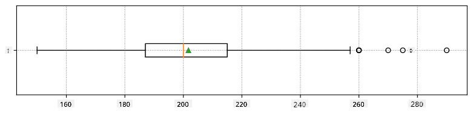

<!--
CO_OP_TRANSLATOR_METADATA:
{
  "original_hash": "b706a07cfa87ba091cbb91e0aa775600",
  "translation_date": "2025-08-26T15:32:14+00:00",
  "source_file": "1-Introduction/04-stats-and-probability/README.md",
  "language_code": "sw"
}
-->
# Utangulizi Mfupi wa Takwimu na Uwezekano

| ](../../sketchnotes/04-Statistics-Probability.png)|
|:---:|
| Takwimu na Uwezekano - _Sketchnote na [@nitya](https://twitter.com/nitya)_ |

Nadharia ya Takwimu na Uwezekano ni maeneo mawili yanayohusiana sana ya Hisabati ambayo ni muhimu sana kwa Sayansi ya Takwimu. Inawezekana kufanya kazi na data bila ujuzi wa kina wa hisabati, lakini ni bora kujua angalau dhana za msingi. Hapa tutatoa utangulizi mfupi ambao utakusaidia kuanza.

[](https://youtu.be/Z5Zy85g4Yjw)

## [Jaribio la Kabla ya Somo](https://purple-hill-04aebfb03.1.azurestaticapps.net/quiz/6)

## Uwezekano na Vigeu Nasibu

**Uwezekano** ni namba kati ya 0 na 1 inayowakilisha jinsi tukio fulani lilivyo na uwezekano wa kutokea. Uwezekano hufafanuliwa kama idadi ya matokeo chanya (yanayopelekea tukio hilo), ikigawanywa na jumla ya matokeo yote, kwa sharti kwamba matokeo yote yana uwezekano sawa. Kwa mfano, tunapopiga kete, uwezekano wa kupata namba shufwa ni 3/6 = 0.5.

Tunapozungumzia matukio, tunatumia **vigeu nasibu**. Kwa mfano, kigeu nasibu kinachowakilisha namba inayopatikana tunapopiga kete kitakuwa na thamani kati ya 1 hadi 6. Seti ya namba kutoka 1 hadi 6 inaitwa **nafasi ya sampuli**. Tunaweza kuzungumzia uwezekano wa kigeu nasibu kuchukua thamani fulani, kwa mfano P(X=3)=1/6.

Kigeu nasibu katika mfano uliopita kinaitwa **kigeu cha kima**, kwa sababu kina nafasi ya sampuli inayohesabika, yaani kuna thamani tofauti zinazoweza kuorodheshwa. Kuna matukio ambapo nafasi ya sampuli ni safu ya namba halisi, au seti nzima ya namba halisi. Vigeu kama hivyo vinaitwa **vigeu endelevu**. Mfano mzuri ni muda wa basi kufika.

## Usambazaji wa Uwezekano

Kwa vigeu nasibu vya kima, ni rahisi kuelezea uwezekano wa kila tukio kwa kutumia kazi P(X). Kwa kila thamani *s* kutoka nafasi ya sampuli *S*, kazi hii itatoa namba kati ya 0 na 1, ambapo jumla ya thamani zote za P(X=s) kwa matukio yote itakuwa 1.

Usambazaji wa kima unaojulikana zaidi ni **usambazaji wa sare**, ambapo kuna nafasi ya sampuli ya vipengele N, na uwezekano sawa wa 1/N kwa kila kimoja.

Ni vigumu zaidi kuelezea usambazaji wa uwezekano wa kigeu endelevu, chenye thamani zinazotoka kwenye safu fulani [a,b], au seti nzima ya namba halisi ℝ. Fikiria mfano wa muda wa basi kufika. Kwa kweli, kwa kila muda halisi wa kufika *t*, uwezekano wa basi kufika hasa wakati huo ni 0!

> Sasa unajua kwamba matukio yenye uwezekano wa 0 hutokea, na mara nyingi sana! Angalau kila wakati basi linapofika!

Tunaweza tu kuzungumzia uwezekano wa kigeu kuangukia kwenye safu fulani ya thamani, kwa mfano P(t<sub>1</sub>≤X<t<sub>2</sub>). Katika kesi hii, usambazaji wa uwezekano unaelezewa na **kazi ya msongamano wa uwezekano** p(x), ambapo


  
Mfano endelevu wa usambazaji wa sare unaitwa **sare endelevu**, ambao hufafanuliwa kwenye safu yenye kikomo. Uwezekano kwamba thamani X itaangukia kwenye safu ya urefu l ni sawia na l, na huongezeka hadi 1.

Usambazaji mwingine muhimu ni **usambazaji wa kawaida**, ambao tutazungumzia kwa undani zaidi hapa chini.

## Wastani, Tofauti na Mkengeuko wa Kawaida

Tuseme tunachukua mfululizo wa sampuli n za kigeu nasibu X: x<sub>1</sub>, x<sub>2</sub>, ..., x<sub>n</sub>. Tunaweza kufafanua thamani ya **wastani** (au **wastani wa hesabu**) wa mfululizo kwa njia ya jadi kama (x<sub>1</sub>+x<sub>2</sub>+x<sub>n</sub>)/n. Tunapoongeza ukubwa wa sampuli (yaani kuchukua kikomo n→∞), tutapata wastani (pia huitwa **matarajio**) wa usambazaji. Tutawakilisha matarajio kwa **E**(x).

> Inaweza kuonyeshwa kwamba kwa usambazaji wowote wa kima wenye thamani {x<sub>1</sub>, x<sub>2</sub>, ..., x<sub>N</sub>} na uwezekano unaolingana p<sub>1</sub>, p<sub>2</sub>, ..., p<sub>N</sub>, matarajio yatakuwa E(X)=x<sub>1</sub>p<sub>1</sub>+x<sub>2</sub>p<sub>2</sub>+...+x<sub>N</sub>p<sub>N</sub>.

Ili kutambua jinsi thamani zilivyo mbali, tunaweza kuhesabu tofauti σ<sup>2</sup> = ∑(x<sub>i</sub> - μ)<sup>2</sup>/n, ambapo μ ni wastani wa mfululizo. Thamani σ inaitwa **mkengeuko wa kawaida**, na σ<sup>2</sup> inaitwa **tofauti**.

## Modi, Median na Robo

Wakati mwingine, wastani hauwakilishi vyema thamani "ya kawaida" ya data. Kwa mfano, wakati kuna thamani chache za kupindukia ambazo ziko nje kabisa ya safu, zinaweza kuathiri wastani. Kiashiria kingine kizuri ni **median**, thamani ambayo nusu ya data iko chini yake, na nusu nyingine - juu yake.

Ili kutusaidia kuelewa usambazaji wa data, ni muhimu kuzungumzia **robo**:

* Robo ya kwanza, au Q1, ni thamani ambayo 25% ya data iko chini yake
* Robo ya tatu, au Q3, ni thamani ambayo 75% ya data iko chini yake

Kigrafu tunaweza kuwakilisha uhusiano kati ya median na robo kwenye mchoro unaoitwa **box plot**:


Hapa pia tunahesabu **nafasi ya kati ya robo** IQR=Q3-Q1, na kinachoitwa **vipimo vya kupindukia** - thamani ambazo ziko nje ya mipaka [Q1-1.5*IQR,Q3+1.5*IQR].

Kwa usambazaji wa kima unao na idadi ndogo ya thamani zinazowezekana, thamani "ya kawaida" nzuri ni ile inayojitokeza mara nyingi zaidi, ambayo inaitwa **modi**. Hii mara nyingi hutumika kwa data ya kategoria, kama vile rangi. Fikiria hali ambapo tuna vikundi viwili vya watu - baadhi wanapendelea sana nyekundu, na wengine wanapendelea bluu. Tukiwakilisha rangi kwa namba, wastani wa rangi inayopendwa ungekuwa mahali fulani kwenye wigo wa machungwa-kijani, ambayo haionyeshi upendeleo halisi wa kundi lolote. Hata hivyo, modi itakuwa mojawapo ya rangi hizo, au rangi zote mbili, ikiwa idadi ya watu wanaopigia kura ni sawa (katika kesi hii tunaita sampuli **multimodal**).

## Data ya Ulimwengu Halisi

Tunapochambua data kutoka maisha halisi, mara nyingi si vigeu nasibu kwa maana kwamba hatufanyi majaribio yenye matokeo yasiyojulikana. Kwa mfano, fikiria timu ya wachezaji wa baseball, na data zao za mwili, kama vile urefu, uzito na umri. Namba hizo si nasibu hasa, lakini bado tunaweza kutumia dhana zile zile za kihisabati. Kwa mfano, mfululizo wa uzito wa watu unaweza kuchukuliwa kuwa mfululizo wa thamani zilizochukuliwa kutoka kwa kigeu nasibu fulani. Hapa chini ni mfululizo wa uzito wa wachezaji halisi wa baseball kutoka [Major League Baseball](http://mlb.mlb.com/index.jsp), uliotolewa kutoka [hifadhidata hii](http://wiki.stat.ucla.edu/socr/index.php/SOCR_Data_MLB_HeightsWeights) (kwa urahisi wako, ni thamani 20 za kwanza tu zimeonyeshwa):

```
[180.0, 215.0, 210.0, 210.0, 188.0, 176.0, 209.0, 200.0, 231.0, 180.0, 188.0, 180.0, 185.0, 160.0, 180.0, 185.0, 197.0, 189.0, 185.0, 219.0]
```

> **Note**: Ili kuona mfano wa kufanya kazi na hifadhidata hii, angalia [notebook inayofuatana](notebook.ipynb). Pia kuna changamoto kadhaa katika somo hili, na unaweza kuzimaliza kwa kuongeza msimbo kwenye notebook hiyo. Ikiwa huna uhakika wa jinsi ya kufanya kazi na data, usijali - tutarudi kwenye kufanya kazi na data kwa kutumia Python baadaye. Ikiwa hujui jinsi ya kuendesha msimbo kwenye Jupyter Notebook, angalia [makala hii](https://soshnikov.com/education/how-to-execute-notebooks-from-github/).

Hapa kuna mchoro wa box plot unaoonyesha wastani, median na robo za data yetu:



Kwa kuwa data yetu ina taarifa kuhusu **nafasi** tofauti za wachezaji, tunaweza pia kufanya box plot kwa nafasi - hii itaturuhusu kupata wazo la jinsi thamani za vigezo zinavyotofautiana kati ya nafasi. Wakati huu tutazingatia urefu:


Mchoro huu unaonyesha kwamba, kwa wastani, urefu wa wachezaji wa nafasi ya kwanza ni mkubwa kuliko wa wachezaji wa nafasi ya pili. Baadaye katika somo hili tutajifunza jinsi tunavyoweza kujaribu dhana hii kwa njia rasmi zaidi, na jinsi ya kuonyesha kwamba data yetu ni muhimu kitaakwimu kuonyesha hilo.

> Tunapofanya kazi na data ya ulimwengu halisi, tunadhani kwamba pointi zote za data ni sampuli zilizochukuliwa kutoka kwa usambazaji fulani wa uwezekano. Dhana hii inaturuhusu kutumia mbinu za kujifunza kwa mashine na kujenga mifano ya utabiri inayofanya kazi.

Ili kuona usambazaji wa data yetu, tunaweza kuchora grafu inayoitwa **histogramu**. Mhimili wa X utakuwa na idadi ya vipindi tofauti vya uzito (vinavyoitwa **bins**), na mhimili wa wima utaonyesha idadi ya mara ambazo sampuli ya kigeu nasibu ilikuwa ndani ya kipindi fulani.


Kutoka kwenye histogramu hii unaweza kuona kwamba thamani zote zimejikita karibu na wastani fulani wa uzito, na kadri tunavyoenda mbali na uzito huo - ndivyo uzito wa thamani hiyo unavyopungua. Yaani, ni nadra sana kwamba uzito wa mchezaji wa baseball utakuwa tofauti sana na wastani wa uzito. Tofauti ya uzito inaonyesha kiwango ambacho uzito unaweza kutofautiana na wastani.

> Tukichukua uzito wa watu wengine, si kutoka kwenye ligi ya baseball, usambazaji unaweza kuwa tofauti. Hata hivyo, umbo la usambazaji litakuwa sawa, lakini wastani na tofauti vitabadilika. Kwa hivyo, tukifundisha mfano wetu kwa wachezaji wa baseball, kuna uwezekano mkubwa wa kutoa matokeo yasiyo sahihi unapowekwa kwa wanafunzi wa chuo kikuu, kwa sababu usambazaji wa msingi ni tofauti.

## Usambazaji wa Kawaida

Usambazaji wa uzito ambao tumeona hapo juu ni wa kawaida sana, na vipimo vingi kutoka ulimwengu halisi hufuata aina hiyo ya usambazaji, lakini kwa wastani na tofauti tofauti. Usambazaji huu unaitwa **usambazaji wa kawaida**, na una jukumu muhimu sana katika takwimu.

Kutumia usambazaji wa kawaida ni njia sahihi ya kuzalisha uzito wa nasibu wa wachezaji wa baseball wa baadaye. Mara tu tunapojua wastani wa uzito `mean` na mkengeuko wa kawaida `std`, tunaweza kuzalisha sampuli 1000 za uzito kwa njia ifuatayo:
```python
samples = np.random.normal(mean,std,1000)
``` 

Tukichora histogramu ya sampuli zilizozalishwa tutaona picha inayofanana sana na ile iliyoonyeshwa hapo juu. Na tukiongeza idadi ya sampuli na idadi ya bins, tunaweza kuzalisha picha ya usambazaji wa kawaida ambayo inakaribia kuwa bora:


*Usambazaji wa Kawaida na wastani=0 na std.dev=1*

## Vipindi vya Uhakika

Tunapozungumzia uzito wa wachezaji wa baseball, tunadhani kwamba kuna **kigeu nasibu W** kinachowakilisha usambazaji bora wa uwezekano wa uzito wa wachezaji wote wa baseball (inayojulikana kama **idadi ya watu**). Mfululizo wetu wa uzito unawakilisha sehemu ndogo ya wachezaji wote wa baseball tunayoita **sampuli**. Swali la kuvutia ni, je, tunaweza kujua vigezo vya usambazaji wa W, yaani wastani na tofauti ya idadi ya watu?

Jibu rahisi litakuwa kuhesabu wastani na tofauti ya sampuli yetu. Hata hivyo, inaweza kutokea kwamba sampuli yetu ya nasibu haiwakilishi kwa usahihi idadi kamili ya watu. Kwa hivyo inafaa kuzungumzia **kipindi cha uhakika**.
> **Kipindi cha kujiamini** ni makadirio ya wastani halisi wa idadi ya watu kulingana na sampuli yetu, ambayo ni sahihi kwa uwezekano fulani (au **kiwango cha kujiamini**).
Tukifikiria sampuli X<sub>1</sub>, ..., X<sub>n</sub> kutoka kwenye usambazaji wetu, kila tunapochora sampuli kutoka kwenye usambazaji huo, tutapata thamani tofauti ya wastani μ. Hivyo basi, μ inaweza kuchukuliwa kama kigezo cha nasibu. **Kipindi cha kujiamini** chenye kujiamini p ni jozi ya thamani (L<sub>p</sub>,R<sub>p</sub>), ambapo **P**(L<sub>p</sub>≤μ≤R<sub>p</sub>) = p, yaani uwezekano wa thamani ya wastani kupatikana ndani ya kipindi hicho ni sawa na p.

Inazidi maelezo yetu mafupi kujadili kwa undani jinsi vipindi hivyo vya kujiamini vinavyohesabiwa. Maelezo zaidi yanaweza kupatikana [kwenye Wikipedia](https://en.wikipedia.org/wiki/Confidence_interval). Kwa ufupi, tunafafanua usambazaji wa wastani wa sampuli iliyohesabiwa kulingana na wastani wa kweli wa idadi ya watu, unaoitwa **usambazaji wa mwanafunzi**.

> **Jambo la kuvutia**: Usambazaji wa mwanafunzi umepewa jina kutokana na mwanahisabati William Sealy Gosset, ambaye alichapisha karatasi yake kwa jina la utani "Student". Alifanya kazi katika kiwanda cha bia cha Guinness, na, kulingana na moja ya simulizi, mwajiri wake hakutaka umma ujue kwamba walikuwa wakitumia majaribio ya takwimu kuamua ubora wa malighafi.

Ikiwa tunataka kukadiria wastani μ wa idadi yetu ya watu kwa kujiamini p, tunahitaji kuchukua *(1-p)/2-th percentile* ya Usambazaji wa Mwanafunzi A, ambayo inaweza kuchukuliwa kutoka kwenye jedwali, au kuhesabiwa kwa kutumia baadhi ya kazi zilizojengwa ndani ya programu za takwimu (mfano Python, R, n.k.). Kisha kipindi cha μ kitakuwa X±A*D/√n, ambapo X ni wastani uliopatikana wa sampuli, D ni mkengeuko wa kawaida.

> **Note**: Pia tunapuuza mjadala wa dhana muhimu ya [digrii za uhuru](https://en.wikipedia.org/wiki/Degrees_of_freedom_(statistics)), ambayo ni muhimu kuhusiana na Usambazaji wa Mwanafunzi. Unaweza kurejelea vitabu kamili zaidi vya takwimu ili kuelewa dhana hii kwa kina.

Mfano wa kuhesabu kipindi cha kujiamini kwa uzito na urefu umetolewa katika [notebook inayofuatana](notebook.ipynb).

| p | Wastani wa Uzito |
|-----|----------------|
| 0.85 | 201.73±0.94 |
| 0.90 | 201.73±1.08 |
| 0.95 | 201.73±1.28 |

Angalia kwamba kadri uwezekano wa kujiamini unavyoongezeka, ndivyo kipindi cha kujiamini kinavyopanuka.

## Upimaji wa Dhana

Katika seti yetu ya data ya wachezaji wa baseball, kuna majukumu tofauti ya wachezaji, ambayo yanaweza kufupishwa kama ifuatavyo (angalia [notebook inayofuatana](notebook.ipynb) ili kuona jinsi jedwali hili linavyoweza kuhesabiwa):

| Jukumu | Urefu | Uzito | Idadi |
|--------|-------|-------|-------|
| Catcher | 72.723684 | 204.328947 | 76 |
| Designated_Hitter | 74.222222 | 220.888889 | 18 |
| First_Baseman | 74.000000 | 213.109091 | 55 |
| Outfielder | 73.010309 | 199.113402 | 194 |
| Relief_Pitcher | 74.374603 | 203.517460 | 315 |
| Second_Baseman | 71.362069 | 184.344828 | 58 |
| Shortstop | 71.903846 | 182.923077 | 52 |
| Starting_Pitcher | 74.719457 | 205.163636 | 221 |
| Third_Baseman | 73.044444 | 200.955556 | 45 |

Tunaweza kuona kwamba wastani wa urefu wa wachezaji wa nafasi ya kwanza ni mkubwa kuliko wa wachezaji wa nafasi ya pili. Hivyo, tunaweza kushawishika kusema kwamba **wachezaji wa nafasi ya kwanza ni warefu zaidi kuliko wa nafasi ya pili**.

> Kauli hii inaitwa **dhana**, kwa sababu hatujui kama ukweli huu ni wa kweli au la.

Hata hivyo, si rahisi kila wakati kufanya hitimisho hili. Kutoka kwenye mjadala hapo juu tunajua kwamba kila wastani una kipindi cha kujiamini kinachohusiana, na hivyo tofauti hii inaweza kuwa kosa la takwimu tu. Tunahitaji njia rasmi zaidi ya kupima dhana yetu.

Hebu tuhesabu vipindi vya kujiamini kando kwa urefu wa wachezaji wa nafasi ya kwanza na ya pili:

| Kujiamini | Wachezaji wa Nafasi ya Kwanza | Wachezaji wa Nafasi ya Pili |
|-----------|-------------------------------|-----------------------------|
| 0.85 | 73.62..74.38 | 71.04..71.69 |
| 0.90 | 73.56..74.44 | 70.99..71.73 |
| 0.95 | 73.47..74.53 | 70.92..71.81 |

Tunaweza kuona kwamba kwa kiwango chochote cha kujiamini, vipindi havivuki. Hii inathibitisha dhana yetu kwamba wachezaji wa nafasi ya kwanza ni warefu zaidi kuliko wa nafasi ya pili.

Kwa njia rasmi zaidi, tatizo tunalotatua ni kuona kama **usambazaji mbili za uwezekano ni sawa**, au angalau zina vigezo sawa. Kulingana na usambazaji, tunahitaji kutumia majaribio tofauti kwa hilo. Ikiwa tunajua kwamba usambazaji wetu ni wa kawaida, tunaweza kutumia **[Jaribio la t la Mwanafunzi](https://en.wikipedia.org/wiki/Student%27s_t-test)**.

Katika Jaribio la t la Mwanafunzi, tunahesabu kinachoitwa **t-thamani**, ambayo inaonyesha tofauti kati ya wastani, ikizingatia utofauti. Imeonyeshwa kwamba t-thamani inafuata **usambazaji wa mwanafunzi**, ambao huturuhusu kupata thamani ya kizingiti kwa kiwango fulani cha kujiamini **p** (hii inaweza kuhesabiwa, au kutafutwa kwenye jedwali za namba). Kisha tunalinganisha t-thamani na kizingiti hiki ili kuidhinisha au kukataa dhana.

Katika Python, tunaweza kutumia kifurushi cha **SciPy**, ambacho kinajumuisha kazi ya `ttest_ind` (pamoja na kazi nyingine nyingi za takwimu muhimu!). Inatuhesabia t-thamani, na pia hufanya utafutaji wa nyuma wa thamani ya kujiamini p, ili tuweze kuangalia tu kujiamini ili kufanya hitimisho.

Kwa mfano, kulinganisha kwetu kati ya urefu wa wachezaji wa nafasi ya kwanza na ya pili kunatupa matokeo yafuatayo: 
```python
from scipy.stats import ttest_ind

tval, pval = ttest_ind(df.loc[df['Role']=='First_Baseman',['Height']], df.loc[df['Role']=='Designated_Hitter',['Height']],equal_var=False)
print(f"T-value = {tval[0]:.2f}\nP-value: {pval[0]}")
```
```
T-value = 7.65
P-value: 9.137321189738925e-12
```
Katika kesi yetu, thamani ya p ni ndogo sana, ikimaanisha kwamba kuna ushahidi mkubwa unaounga mkono kwamba wachezaji wa nafasi ya kwanza ni warefu zaidi.

Kuna pia aina nyingine tofauti za dhana ambazo tunaweza kutaka kupima, kwa mfano:
* Kuthibitisha kwamba sampuli fulani inafuata usambazaji fulani. Katika kesi yetu tumedhani kwamba urefu unasambazwa kawaida, lakini hilo linahitaji uthibitisho rasmi wa takwimu.
* Kuthibitisha kwamba thamani ya wastani wa sampuli inalingana na thamani fulani iliyowekwa awali.
* Kulinganisha wastani wa sampuli kadhaa (mfano, tofauti ya viwango vya furaha kati ya makundi tofauti ya umri).

## Sheria ya Nambari Kubwa na Nadharia ya Kikomo cha Kati

Moja ya sababu kwa nini usambazaji wa kawaida ni muhimu ni kinachoitwa **nadharia ya kikomo cha kati**. Tuseme tuna sampuli kubwa ya thamani huru N X<sub>1</sub>, ..., X<sub>N</sub>, zilizochukuliwa kutoka kwenye usambazaji wowote wenye wastani μ na utofauti σ<sup>2</sup>. Kisha, kwa N kubwa vya kutosha (kwa maneno mengine, wakati N→∞), wastani Σ<sub>i</sub>X<sub>i</sub> utasambazwa kawaida, wenye wastani μ na utofauti σ<sup>2</sup>/N.

> Njia nyingine ya kufasiri nadharia ya kikomo cha kati ni kusema kwamba bila kujali usambazaji, unapohesabu wastani wa jumla ya thamani za kigezo cha nasibu unapata usambazaji wa kawaida.

Kutoka kwenye nadharia ya kikomo cha kati pia inafuata kwamba, wakati N→∞, uwezekano wa wastani wa sampuli kuwa sawa na μ unakuwa 1. Hii inajulikana kama **sheria ya nambari kubwa**.

## Uhusiano wa Pamoja na Uwiano

Moja ya mambo ambayo Sayansi ya Takwimu hufanya ni kutafuta uhusiano kati ya data. Tunasema kwamba mfuatano miwili **ina uhusiano wa pamoja** wakati inaonyesha tabia sawa kwa wakati mmoja, yaani, huongezeka/huanguka kwa pamoja, au mfuatano mmoja huongezeka wakati mwingine unapungua na kinyume chake. Kwa maneno mengine, kunaonekana kuwa na uhusiano fulani kati ya mfuatano miwili.

> Uhusiano wa pamoja hauonyeshi lazima uhusiano wa kisababishi kati ya mfuatano miwili; wakati mwingine vigezo vyote viwili vinaweza kutegemea sababu ya nje, au inaweza kuwa kwa bahati tu kwamba mfuatano miwili una uhusiano wa pamoja. Hata hivyo, uhusiano wa pamoja wa kihisabati wenye nguvu ni kiashiria kizuri kwamba vigezo viwili vimeunganishwa kwa namna fulani.

Kihisabati, dhana kuu inayoonyesha uhusiano kati ya vigezo viwili vya nasibu ni **uhusiano wa pamoja**, ambao unahesabiwa kama hivi: Cov(X,Y) = **E**\[(X-**E**(X))(Y-**E**(Y))\]. Tunahesabu mkengeuko wa vigezo vyote viwili kutoka kwa wastani wao, kisha tunazidisha mkengeuko huo. Ikiwa vigezo vyote viwili vinatofautiana kwa pamoja, kuzidisha kutakuwa na thamani chanya kila wakati, ambayo itaongeza hadi uhusiano wa pamoja chanya. Ikiwa vigezo vyote viwili vinatofautiana bila mpangilio (yaani, kimoja kinashuka chini ya wastani wakati kingine kinapanda juu ya wastani), tutapata namba hasi kila wakati, ambazo zitaongeza hadi uhusiano wa pamoja hasi. Ikiwa mkengeuko hauna uhusiano, zitaongeza hadi takriban sifuri.

Thamani halisi ya uhusiano wa pamoja haituambii mengi kuhusu ukubwa wa uhusiano, kwa sababu inategemea ukubwa wa thamani halisi. Ili kuunormalisha, tunaweza kugawanya uhusiano wa pamoja kwa mkengeuko wa kawaida wa vigezo vyote viwili, ili kupata **uwiano**. Jambo zuri ni kwamba uwiano huwa katika safu ya [-1,1], ambapo 1 inaonyesha uwiano chanya wenye nguvu kati ya thamani, -1 - uwiano hasi wenye nguvu, na 0 - hakuna uwiano kabisa (vigezo ni huru).

**Mfano**: Tunaweza kuhesabu uwiano kati ya uzito na urefu wa wachezaji wa baseball kutoka kwenye seti ya data iliyotajwa hapo juu:
```python
print(np.corrcoef(weights,heights))
```
Matokeo yake, tunapata **matrix ya uwiano** kama hii:
```
array([[1.        , 0.52959196],
       [0.52959196, 1.        ]])
```

> Matrix ya uwiano C inaweza kuhesabiwa kwa idadi yoyote ya mfuatano wa pembejeo S<sub>1</sub>, ..., S<sub>n</sub>. Thamani ya C<sub>ij</sub> ni uwiano kati ya S<sub>i</sub> na S<sub>j</sub>, na vipengele vya diagonal daima ni 1 (ambayo pia ni uwiano wa kibinafsi wa S<sub>i</sub>).

Katika kesi yetu, thamani 0.53 inaonyesha kwamba kuna uwiano fulani kati ya uzito na urefu wa mtu. Tunaweza pia kutengeneza mchoro wa kutawanyika wa thamani moja dhidi ya nyingine ili kuona uhusiano kwa macho:


> Mifano zaidi ya uwiano wa pamoja na uwiano inaweza kupatikana katika [notebook inayofuatana](notebook.ipynb).

## Hitimisho

Katika sehemu hii, tumejifunza:

* mali za msingi za takwimu za data, kama vile wastani, utofauti, hali na robo
* usambazaji tofauti wa vigezo vya nasibu, ikiwa ni pamoja na usambazaji wa kawaida
* jinsi ya kupata uwiano kati ya mali tofauti
* jinsi ya kutumia mbinu za kihisabati na takwimu ili kuthibitisha dhana fulani
* jinsi ya kuhesabu vipindi vya kujiamini kwa kigezo cha nasibu kutokana na sampuli ya data

Ingawa hii si orodha kamili ya mada zilizopo ndani ya uwezekano na takwimu, inapaswa kuwa ya kutosha kukupa mwanzo mzuri katika kozi hii.

## 🚀 Changamoto

Tumia msimbo wa sampuli katika notebook kupima dhana nyingine kwamba: 
1. Wachezaji wa nafasi ya kwanza ni wazee kuliko wa nafasi ya pili
2. Wachezaji wa nafasi ya kwanza ni warefu kuliko wa nafasi ya tatu
3. Wachezaji wa nafasi ya shortstop ni warefu kuliko wa nafasi ya pili

## [Jaribio la baada ya somo](https://purple-hill-04aebfb03.1.azurestaticapps.net/quiz/7)

## Mapitio na Kujisomea

Uwezekano na takwimu ni mada pana sana inayostahili kozi yake yenyewe. Ikiwa una nia ya kwenda zaidi katika nadharia, unaweza kuendelea kusoma baadhi ya vitabu vifuatavyo:

1. [Carlos Fernandez-Granda](https://cims.nyu.edu/~cfgranda/) kutoka Chuo Kikuu cha New York ana maelezo mazuri ya mihadhara [Probability and Statistics for Data Science](https://cims.nyu.edu/~cfgranda/pages/stuff/probability_stats_for_DS.pdf) (inapatikana mtandaoni)
1. [Peter na Andrew Bruce. Practical Statistics for Data Scientists.](https://www.oreilly.com/library/view/practical-statistics-for/9781491952955/) [[msimbo wa sampuli katika R](https://github.com/andrewgbruce/statistics-for-data-scientists)]. 
1. [James D. Miller. Statistics for Data Science](https://www.packtpub.com/product/statistics-for-data-science/9781788290678) [[msimbo wa sampuli katika R](https://github.com/PacktPublishing/Statistics-for-Data-Science)]

## Kazi

[Utafiti Mdogo wa Kisukari](assignment.md)

## Shukrani

Somo hili limeandikwa kwa ♥️ na [Dmitry Soshnikov](http://soshnikov.com)

---

**Kanusho**:  
Hati hii imetafsiriwa kwa kutumia huduma ya tafsiri ya AI [Co-op Translator](https://github.com/Azure/co-op-translator). Ingawa tunajitahidi kwa usahihi, tafadhali fahamu kuwa tafsiri za kiotomatiki zinaweza kuwa na makosa au kutokuwa sahihi. Hati ya asili katika lugha yake ya awali inapaswa kuzingatiwa kama chanzo cha mamlaka. Kwa taarifa muhimu, inashauriwa kutumia tafsiri ya kitaalamu ya binadamu. Hatutawajibika kwa maelewano mabaya au tafsiri zisizo sahihi zinazotokana na matumizi ya tafsiri hii.