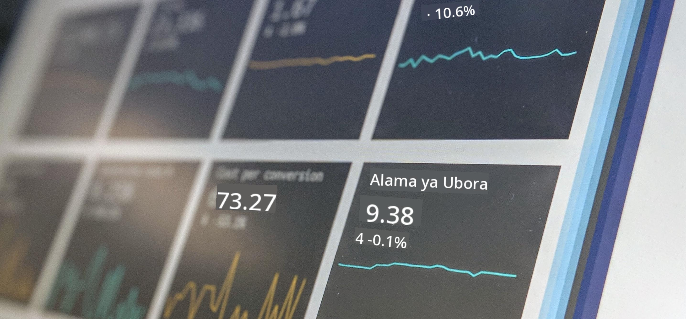

<!--
CO_OP_TRANSLATOR_METADATA:
{
  "original_hash": "696a8474a01054281704cbfb09148949",
  "translation_date": "2025-08-26T14:59:30+00:00",
  "source_file": "1-Introduction/README.md",
  "language_code": "sw"
}
-->
# Utangulizi wa Sayansi ya Takwimu

> Picha na <a href="https://unsplash.com/@dawson2406?utm_source=unsplash&utm_medium=referral&utm_content=creditCopyText">Stephen Dawson</a> kwenye <a href="https://unsplash.com/s/photos/data?utm_source=unsplash&utm_medium=referral&utm_content=creditCopyText">Unsplash</a>
  
Katika masomo haya, utagundua jinsi Sayansi ya Takwimu inavyofafanuliwa na kujifunza kuhusu masuala ya kimaadili ambayo lazima yazingatiwe na mwanasayansi wa takwimu. Pia utajifunza jinsi takwimu zinavyofafanuliwa na kupata maarifa kidogo kuhusu takwimu na uwezekano, maeneo ya msingi ya kitaaluma ya Sayansi ya Takwimu.

### Mada

1. [Kufafanua Sayansi ya Takwimu](01-defining-data-science/README.md)
2. [Maadili ya Sayansi ya Takwimu](02-ethics/README.md)
3. [Kufafanua Takwimu](03-defining-data/README.md)
4. [Utangulizi wa Takwimu na Uwezekano](04-stats-and-probability/README.md)

### Shukrani

Masomo haya yaliandikwa kwa ❤️ na [Nitya Narasimhan](https://twitter.com/nitya) na [Dmitry Soshnikov](https://twitter.com/shwars).

---

**Kanusho**:  
Hati hii imetafsiriwa kwa kutumia huduma ya tafsiri ya AI [Co-op Translator](https://github.com/Azure/co-op-translator). Ingawa tunajitahidi kuhakikisha usahihi, tafsiri za kiotomatiki zinaweza kuwa na makosa au kutokuwa sahihi. Hati ya asili katika lugha yake ya awali inapaswa kuchukuliwa kama chanzo cha mamlaka. Kwa taarifa muhimu, tafsiri ya kitaalamu ya binadamu inapendekezwa. Hatutawajibika kwa kutoelewana au tafsiri zisizo sahihi zinazotokana na matumizi ya tafsiri hii.