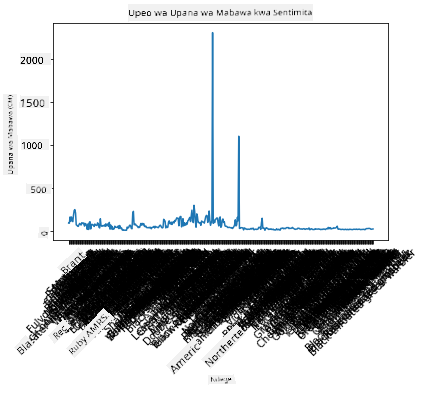
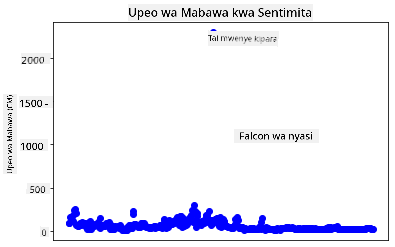
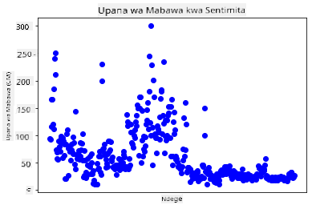
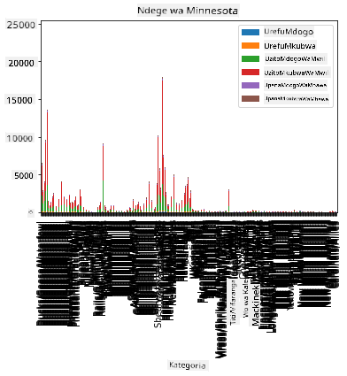
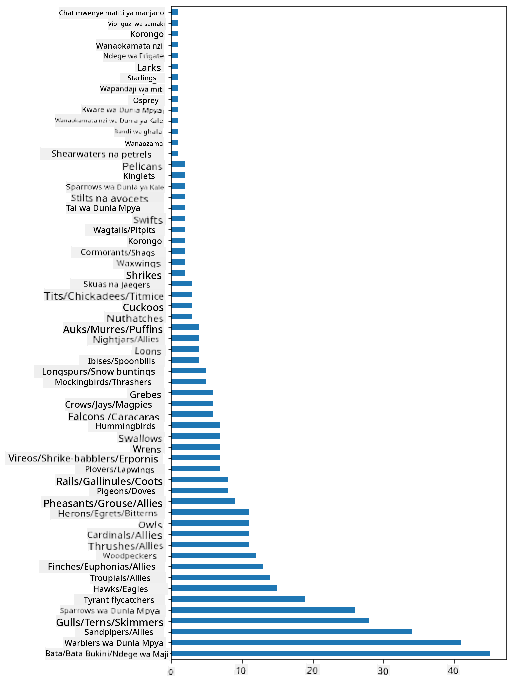
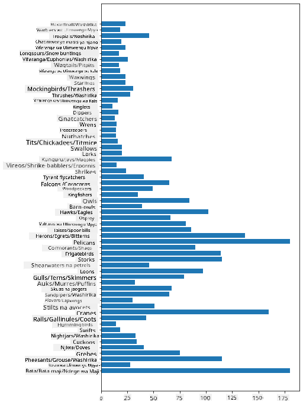
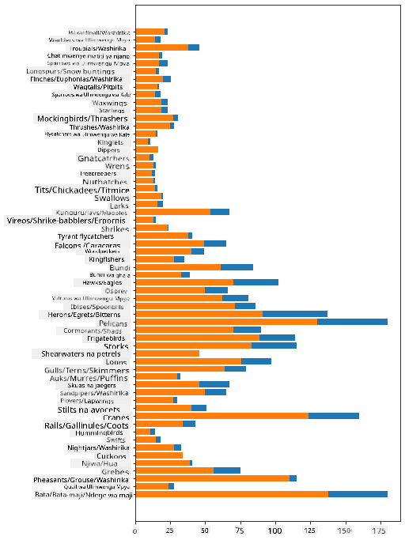

<!--
CO_OP_TRANSLATOR_METADATA:
{
  "original_hash": "43c402d9d90ae6da55d004519ada5033",
  "translation_date": "2025-08-26T17:22:09+00:00",
  "source_file": "3-Data-Visualization/09-visualization-quantities/README.md",
  "language_code": "sw"
}
-->
# Kuonyesha Kiasi

| ](../../sketchnotes/09-Visualizing-Quantities.png)|
|:---:|
| Kuonyesha Kiasi - _Sketchnote na [@nitya](https://twitter.com/nitya)_ |

Katika somo hili, utachunguza jinsi ya kutumia moja ya maktaba nyingi za Python kujifunza jinsi ya kuunda vielelezo vya kuvutia vinavyohusiana na dhana ya kiasi. Kwa kutumia seti ya data iliyosafishwa kuhusu ndege wa Minnesota, unaweza kujifunza mambo mengi ya kuvutia kuhusu wanyama wa porini wa eneo hilo.  
## [Jaribio la kabla ya somo](https://purple-hill-04aebfb03.1.azurestaticapps.net/quiz/16)

## Kuchunguza upana wa mabawa kwa kutumia Matplotlib

Maktaba bora ya kuunda michoro na chati rahisi na za kisasa za aina mbalimbali ni [Matplotlib](https://matplotlib.org/stable/index.html). Kwa ujumla, mchakato wa kuchora data kwa kutumia maktaba hizi unahusisha kutambua sehemu za dataframe yako unayotaka kulenga, kufanya mabadiliko yoyote muhimu kwenye data hiyo, kupeana thamani za mhimili wa x na y, kuamua aina ya mchoro wa kuonyesha, na kisha kuonyesha mchoro huo. Matplotlib inatoa aina nyingi za vielelezo, lakini kwa somo hili, hebu tuzingatie zile zinazofaa zaidi kwa kuonyesha kiasi: chati za mstari, scatterplots, na bar plots.

> ✅ Tumia chati bora inayofaa muundo wa data yako na hadithi unayotaka kusimulia.  
> - Kuchambua mwenendo kwa muda: mstari  
> - Kulinganisha thamani: bar, column, pie, scatterplot  
> - Kuonyesha jinsi sehemu zinavyohusiana na jumla: pie  
> - Kuonyesha usambazaji wa data: scatterplot, bar  
> - Kuonyesha mwenendo: mstari, column  
> - Kuonyesha uhusiano kati ya thamani: mstari, scatterplot, bubble  

Ikiwa una seti ya data na unahitaji kugundua kiasi cha kipengele fulani kilichopo, moja ya kazi za kwanza utakuwa nayo ni kuchunguza thamani zake.  

✅ Kuna 'cheat sheets' nzuri sana zinazopatikana kwa Matplotlib [hapa](https://matplotlib.org/cheatsheets/cheatsheets.pdf).

## Unda mchoro wa mstari kuhusu thamani za upana wa mabawa ya ndege

Fungua faili `notebook.ipynb` kwenye mzizi wa folda ya somo hili na ongeza seli.

> Kumbuka: data imehifadhiwa kwenye mzizi wa repo hii katika folda ya `/data`.

```python
import pandas as pd
import matplotlib.pyplot as plt
birds = pd.read_csv('../../data/birds.csv')
birds.head()
```  
Data hii ni mchanganyiko wa maandishi na namba:

|      | Jina                          | Jina la Kisayansi      | Jamii                 | Oda          | Familia  | Jinsia      | Hali ya Uhifadhi   | UrefuMdogo | UrefuMkuu | UzitoMdogo  | UzitoMkuu  | UpanaMdogo  | UpanaMkuu  |
| ---: | :---------------------------- | :--------------------- | :-------------------- | :----------- | :------- | :---------- | :----------------- | --------: | --------: | ----------: | ----------: | ----------: | ----------: |
|    0 | Bata mwenye tumbo jeusi       | Dendrocygna autumnalis | Bata/Maji/Ndege wa Maji | Anseriformes | Anatidae | Dendrocygna | LC                 |        47 |        56 |         652 |        1020 |          76 |          94 |
|    1 | Bata mwenye tumbo kahawia     | Dendrocygna bicolor    | Bata/Maji/Ndege wa Maji | Anseriformes | Anatidae | Dendrocygna | LC                 |        45 |        53 |         712 |        1050 |          85 |          93 |
|    2 | Bata wa theluji               | Anser caerulescens     | Bata/Maji/Ndege wa Maji | Anseriformes | Anatidae | Anser       | LC                 |        64 |        79 |        2050 |        4050 |         135 |         165 |
|    3 | Bata wa Ross                  | Anser rossii           | Bata/Maji/Ndege wa Maji | Anseriformes | Anatidae | Anser       | LC                 |      57.3 |        64 |        1066 |        1567 |         113 |         116 |
|    4 | Bata mkubwa mwenye paji jeupe | Anser albifrons        | Bata/Maji/Ndege wa Maji | Anseriformes | Anatidae | Anser       | LC                 |        64 |        81 |        1930 |        3310 |         130 |         165 |

Hebu tuanze kwa kuchora baadhi ya data ya namba kwa kutumia mchoro wa mstari wa msingi. Tuseme unataka kuona upana wa mabawa wa juu zaidi kwa ndege hawa wa kuvutia.

```python
wingspan = birds['MaxWingspan'] 
wingspan.plot()
```  


Unaona nini mara moja? Inaonekana kuna angalau kipengele kimoja cha kipekee - huo ni upana mkubwa wa mabawa! Upana wa mabawa wa sentimita 2300 ni sawa na mita 23 - kuna Pterodactyls wanaozunguka Minnesota? Hebu tuchunguze.

Ingawa unaweza kufanya upangaji wa haraka kwenye Excel ili kupata vipengele vya kipekee, ambavyo pengine ni makosa ya uchapaji, endelea na mchakato wa vielelezo kwa kufanya kazi kutoka ndani ya mchoro.

Ongeza lebo kwenye mhimili wa x kuonyesha aina za ndege zinazohusika:

```
plt.title('Max Wingspan in Centimeters')
plt.ylabel('Wingspan (CM)')
plt.xlabel('Birds')
plt.xticks(rotation=45)
x = birds['Name'] 
y = birds['MaxWingspan']

plt.plot(x, y)

plt.show()
```  


Hata ukiweka mzunguko wa lebo kuwa digrii 45, bado kuna nyingi sana kusoma. Hebu tujaribu mkakati tofauti: lebo tu vipengele vya kipekee na weka lebo ndani ya mchoro. Unaweza kutumia mchoro wa scatter ili kutoa nafasi zaidi kwa kuweka lebo:

```python
plt.title('Max Wingspan in Centimeters')
plt.ylabel('Wingspan (CM)')
plt.tick_params(axis='both',which='both',labelbottom=False,bottom=False)

for i in range(len(birds)):
    x = birds['Name'][i]
    y = birds['MaxWingspan'][i]
    plt.plot(x, y, 'bo')
    if birds['MaxWingspan'][i] > 500:
        plt.text(x, y * (1 - 0.05), birds['Name'][i], fontsize=12)
    
plt.show()
```  
Nini kinaendelea hapa? Ulitumia `tick_params` kuficha lebo za chini na kisha ukaunda kitanzi juu ya seti yako ya data ya ndege. Ukichora mchoro kwa kutumia nukta ndogo za bluu kwa `bo`, ulitafuta ndege yeyote mwenye upana wa mabawa wa juu zaidi ya 500 na ukaonyesha lebo yao karibu na nukta ikiwa ni hivyo. Uliondoa lebo kidogo kwenye mhimili wa y (`y * (1 - 0.05)`) na ukatumia jina la ndege kama lebo.

Uligundua nini?

  
## Chuja data yako

Bald Eagle na Prairie Falcon, ingawa pengine ni ndege wakubwa sana, wanaonekana kuwa na makosa ya uchapaji, na `0` ya ziada imeongezwa kwenye upana wao wa mabawa wa juu. Haiwezekani kwamba utakutana na Bald Eagle mwenye upana wa mabawa wa mita 25, lakini ikiwa ni hivyo, tafadhali tujulishe! Hebu tuunde dataframe mpya bila vipengele hivyo viwili vya kipekee:

```python
plt.title('Max Wingspan in Centimeters')
plt.ylabel('Wingspan (CM)')
plt.xlabel('Birds')
plt.tick_params(axis='both',which='both',labelbottom=False,bottom=False)
for i in range(len(birds)):
    x = birds['Name'][i]
    y = birds['MaxWingspan'][i]
    if birds['Name'][i] not in ['Bald eagle', 'Prairie falcon']:
        plt.plot(x, y, 'bo')
plt.show()
```  

Kwa kuchuja vipengele vya kipekee, data yako sasa ni thabiti zaidi na rahisi kueleweka.

  

Sasa kwa kuwa tuna seti ya data safi angalau kwa suala la upana wa mabawa, hebu tujifunze zaidi kuhusu ndege hawa.

Ingawa michoro ya mstari na scatter inaweza kuonyesha taarifa kuhusu thamani za data na usambazaji wake, tunataka kufikiria kuhusu thamani zilizopo katika seti hii ya data. Unaweza kuunda vielelezo kujibu maswali yafuatayo kuhusu kiasi:

> Kuna makundi mangapi ya ndege, na idadi yao ni ngapi?  
> Ni ndege wangapi waliotoweka, walio hatarini, nadra, au wa kawaida?  
> Kuna idadi gani ya jinsia na oda mbalimbali kulingana na istilahi ya Linnaeus?  
## Chunguza chati za bar

Chati za bar ni za vitendo unapohitaji kuonyesha makundi ya data. Hebu tuchunguze makundi ya ndege yaliyopo katika seti hii ya data ili kuona ni yapi yanayojitokeza zaidi kwa idadi.

Katika faili ya notebook, unda chati ya bar ya msingi.

✅ Kumbuka, unaweza kuchuja ndege wawili wa kipekee tuliowatambua katika sehemu iliyopita, kuhariri kosa la uchapaji katika upana wao wa mabawa, au kuwaacha kwa mazoezi haya ambayo hayategemei thamani za upana wa mabawa.

Ikiwa unataka kuunda chati ya bar, unaweza kuchagua data unayotaka kuzingatia. Chati za bar zinaweza kuundwa kutoka kwa data ghafi:

```python
birds.plot(x='Category',
        kind='bar',
        stacked=True,
        title='Birds of Minnesota')

```  


Hata hivyo, chati hii ya bar haiwezi kusomeka kwa sababu kuna data nyingi zisizopangwa. Unahitaji kuchagua tu data unayotaka kuchora, kwa hivyo hebu tuangalie urefu wa ndege kulingana na kundi lao.

Chuja data yako ili kujumuisha tu kundi la ndege.

✅ Kumbuka kwamba unatumia Pandas kusimamia data, na kisha unaruhusu Matplotlib kufanya uchoraji.

Kwa kuwa kuna makundi mengi, unaweza kuonyesha chati hii wima na kurekebisha urefu wake ili kuzingatia data yote:

```python
category_count = birds.value_counts(birds['Category'].values, sort=True)
plt.rcParams['figure.figsize'] = [6, 12]
category_count.plot.barh()
```  


Chati hii ya bar inaonyesha mtazamo mzuri wa idadi ya ndege katika kila kundi. Kwa haraka, unaona kwamba idadi kubwa ya ndege katika eneo hili ni wa kundi la Bata/Maji/Ndege wa Maji. Minnesota ni 'nchi ya maziwa 10,000' kwa hivyo hili halishangazi!

✅ Jaribu kuhesabu mengine kwenye seti hii ya data. Kuna chochote kinachokushangaza?

## Kulinganisha data

Unaweza kujaribu kulinganisha tofauti za data zilizopangwa kwa kuunda axes mpya. Jaribu kulinganisha MaxLength ya ndege, kulingana na kundi lake:

```python
maxlength = birds['MaxLength']
plt.barh(y=birds['Category'], width=maxlength)
plt.rcParams['figure.figsize'] = [6, 12]
plt.show()
```  


Hakuna cha kushangaza hapa: hummingbirds wana MaxLength ndogo zaidi ikilinganishwa na Pelicans au Geese. Ni vizuri data inapofanya mantiki!

Unaweza kuunda vielelezo vya kuvutia zaidi vya chati za bar kwa kuweka data juu ya nyingine. Hebu tuweke Minimum na Maximum Length kwenye kundi fulani la ndege:

```python
minLength = birds['MinLength']
maxLength = birds['MaxLength']
category = birds['Category']

plt.barh(category, maxLength)
plt.barh(category, minLength)

plt.show()
```  
Katika mchoro huu, unaweza kuona safu kwa kila kundi la ndege ya Minimum Length na Maximum Length. Unaweza kusema kwa usalama kwamba, kulingana na data hii, ndege mkubwa zaidi ana safu kubwa zaidi ya urefu. Inavutia!



## 🚀 Changamoto

Seti hii ya data ya ndege inatoa utajiri wa taarifa kuhusu aina tofauti za ndege ndani ya mfumo fulani wa ikolojia. Tafuta mtandaoni na uone ikiwa unaweza kupata seti nyingine za data zinazohusiana na ndege. Fanya mazoezi ya kujenga chati na grafu kuhusu ndege hawa ili kugundua ukweli ambao hukujua.

## [Jaribio la baada ya somo](https://purple-hill-04aebfb03.1.azurestaticapps.net/quiz/17)

## Mapitio na Kujisomea

Somo hili la kwanza limekupa taarifa fulani kuhusu jinsi ya kutumia Matplotlib kuonyesha kiasi. Fanya utafiti kuhusu njia nyingine za kufanya kazi na seti za data kwa ajili ya vielelezo. [Plotly](https://github.com/plotly/plotly.py) ni moja ambayo hatutashughulikia katika masomo haya, kwa hivyo angalia kile inachoweza kutoa.

## Kazi

[Lines, Scatters, and Bars](assignment.md)

---

**Kanusho**:  
Hati hii imetafsiriwa kwa kutumia huduma ya tafsiri ya AI [Co-op Translator](https://github.com/Azure/co-op-translator). Ingawa tunajitahidi kuhakikisha usahihi, tafsiri za kiotomatiki zinaweza kuwa na makosa au kutokuwa sahihi. Hati ya asili katika lugha yake ya awali inapaswa kuchukuliwa kama chanzo cha mamlaka. Kwa taarifa muhimu, tafsiri ya kitaalamu ya binadamu inapendekezwa. Hatutawajibika kwa kutoelewana au tafsiri zisizo sahihi zinazotokana na matumizi ya tafsiri hii.