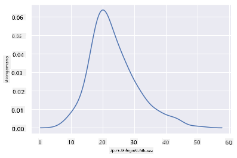

<!--
CO_OP_TRANSLATOR_METADATA:
{
  "original_hash": "87faccac113d772551486a67a607153e",
  "translation_date": "2025-08-26T16:48:59+00:00",
  "source_file": "3-Data-Visualization/10-visualization-distributions/README.md",
  "language_code": "sw"
}
-->
# Kuonyesha Usambazaji wa Takwimu

| ](../../sketchnotes/10-Visualizing-Distributions.png)|
|:---:|
| Kuonyesha Usambazaji wa Takwimu - _Sketchnote na [@nitya](https://twitter.com/nitya)_ |

Katika somo lililopita, ulijifunza mambo ya kuvutia kuhusu seti ya data ya ndege wa Minnesota. Ulipata data yenye makosa kwa kuonyesha vipimo vya nje na ukaangalia tofauti kati ya makundi ya ndege kulingana na urefu wao wa juu zaidi.

## [Jaribio la kabla ya somo](https://purple-hill-04aebfb03.1.azurestaticapps.net/quiz/18)
## Chunguza seti ya data ya ndege

Njia nyingine ya kuchunguza data ni kwa kuangalia usambazaji wake, yaani jinsi data imepangwa kwenye mhimili. Kwa mfano, labda ungependa kujifunza kuhusu usambazaji wa jumla wa urefu wa mabawa au uzito wa juu wa mwili wa ndege wa Minnesota katika seti hii ya data.

Hebu tugundue baadhi ya ukweli kuhusu usambazaji wa data katika seti hii ya data. Katika faili la _notebook.ipynb_ lililoko kwenye mzizi wa folda ya somo hili, leta Pandas, Matplotlib, na data yako:

```python
import pandas as pd
import matplotlib.pyplot as plt
birds = pd.read_csv('../../data/birds.csv')
birds.head()
```

|      | Jina                          | Jina la Kisayansi      | Jamii                | Oda          | Familia  | Jinsia      | Hali ya Uhifadhi   | UrefuMdogo | UrefuMkuu | UzitoMdogo  | UzitoMkuu   | MabawaMdogo | MabawaMkuu  |
| ---: | :---------------------------- | :--------------------- | :------------------- | :----------- | :------- | :---------- | :----------------- | --------: | --------: | ----------: | ----------: | ----------: | ----------: |
|    0 | Bata wa Black-bellied         | Dendrocygna autumnalis | Mabata/Maji          | Anseriformes | Anatidae | Dendrocygna | LC                 |        47 |        56 |         652 |        1020 |          76 |          94 |
|    1 | Bata wa Fulvous               | Dendrocygna bicolor    | Mabata/Maji          | Anseriformes | Anatidae | Dendrocygna | LC                 |        45 |        53 |         712 |        1050 |          85 |          93 |
|    2 | Goose wa Snow                 | Anser caerulescens     | Mabata/Maji          | Anseriformes | Anatidae | Anser       | LC                 |        64 |        79 |        2050 |        4050 |         135 |         165 |
|    3 | Goose wa Ross                 | Anser rossii           | Mabata/Maji          | Anseriformes | Anatidae | Anser       | LC                 |      57.3 |        64 |        1066 |        1567 |         113 |         116 |
|    4 | Goose wa Greater white-fronted| Anser albifrons        | Mabata/Maji          | Anseriformes | Anatidae | Anser       | LC                 |        64 |        81 |        1930 |        3310 |         130 |         165 |

Kwa ujumla, unaweza kuangalia haraka jinsi data inavyosambazwa kwa kutumia mchoro wa alama kama tulivyofanya katika somo lililopita:

```python
birds.plot(kind='scatter',x='MaxLength',y='Order',figsize=(12,8))

plt.title('Max Length per Order')
plt.ylabel('Order')
plt.xlabel('Max Length')

plt.show()
```


Hii inatoa muhtasari wa usambazaji wa jumla wa urefu wa mwili kwa kila Oda ya ndege, lakini si njia bora ya kuonyesha usambazaji wa kweli. Kazi hii kwa kawaida hufanywa kwa kuunda Histogramu.

## Kufanya kazi na histogramu

Matplotlib inatoa njia nzuri sana za kuonyesha usambazaji wa data kwa kutumia Histogramu. Aina hii ya mchoro ni kama mchoro wa nguzo ambapo usambazaji unaweza kuonekana kupitia kupanda na kushuka kwa nguzo. Ili kujenga histogramu, unahitaji data ya namba. Ili kujenga Histogramu, unaweza kuchora mchoro kwa kufafanua aina kama 'hist' kwa Histogramu. Mchoro huu unaonyesha usambazaji wa MaxBodyMass kwa safu nzima ya data ya namba katika seti hii ya data. Kwa kugawanya safu ya data iliyotolewa katika vikundi vidogo, inaweza kuonyesha usambazaji wa thamani za data:

```python
birds['MaxBodyMass'].plot(kind = 'hist', bins = 10, figsize = (12,12))
plt.show()
```


Kama unavyoona, ndege wengi zaidi ya 400 katika seti hii ya data wanaangukia katika safu ya chini ya 2000 kwa Max Body Mass yao. Pata ufahamu zaidi wa data kwa kubadilisha kipengele cha `bins` kuwa namba kubwa zaidi, kama 30:

```python
birds['MaxBodyMass'].plot(kind = 'hist', bins = 30, figsize = (12,12))
plt.show()
```


Mchoro huu unaonyesha usambazaji kwa undani zaidi. Mchoro usioegemea sana upande wa kushoto unaweza kuundwa kwa kuhakikisha kuwa unachagua tu data ndani ya safu fulani:

Chuja data yako ili kupata ndege wale tu ambao uzito wa mwili wao ni chini ya 60, na onyesha `bins` 40:

```python
filteredBirds = birds[(birds['MaxBodyMass'] > 1) & (birds['MaxBodyMass'] < 60)]      
filteredBirds['MaxBodyMass'].plot(kind = 'hist',bins = 40,figsize = (12,12))
plt.show()     
```


✅ Jaribu vichujio vingine na vipengele vya data. Ili kuona usambazaji kamili wa data, ondoa kichujio cha `['MaxBodyMass']` ili kuonyesha usambazaji ulio na lebo.

Histogramu inatoa rangi nzuri na maboresho ya kuweka lebo pia:

Unda histogramu ya 2D ili kulinganisha uhusiano kati ya usambazaji mbili. Hebu linganisha `MaxBodyMass` dhidi ya `MaxLength`. Matplotlib inatoa njia iliyojengwa ndani ya kuonyesha mwelekeo kwa kutumia rangi angavu zaidi:

```python
x = filteredBirds['MaxBodyMass']
y = filteredBirds['MaxLength']

fig, ax = plt.subplots(tight_layout=True)
hist = ax.hist2d(x, y)
```
Inaonekana kuna uhusiano wa kawaida kati ya vipengele hivi viwili kando ya mhimili unaotarajiwa, na sehemu moja yenye nguvu ya mwelekeo:


Histogramu hufanya kazi vizuri kwa chaguo-msingi kwa data ya namba. Je, unahitaji kuona usambazaji kulingana na data ya maandishi?

## Chunguza seti ya data kwa usambazaji kwa kutumia data ya maandishi 

Seti hii ya data pia inajumuisha taarifa nzuri kuhusu jamii ya ndege na jinsia, spishi, na familia yake pamoja na hali yake ya uhifadhi. Hebu tuchunguze taarifa hii ya uhifadhi. Je, usambazaji wa ndege kulingana na hali yao ya uhifadhi ukoje?

> ✅ Katika seti ya data, vifupisho kadhaa vinatumika kuelezea hali ya uhifadhi. Vifupisho hivi vinatoka kwa [IUCN Red List Categories](https://www.iucnredlist.org/), shirika linaloorodhesha hali ya spishi.
> 
> - CR: Hatari Sana
> - EN: Hatari
> - EX: Imetoweka
> - LC: Wasiwasi Mdogo
> - NT: Karibu na Hatari
> - VU: Hatarini

Hizi ni thamani za maandishi kwa hivyo utahitaji kufanya mabadiliko ili kuunda histogramu. Ukichukua dataframe ya filteredBirds, onyesha hali yake ya uhifadhi pamoja na MabawaMdogo. Unaona nini?

```python
x1 = filteredBirds.loc[filteredBirds.ConservationStatus=='EX', 'MinWingspan']
x2 = filteredBirds.loc[filteredBirds.ConservationStatus=='CR', 'MinWingspan']
x3 = filteredBirds.loc[filteredBirds.ConservationStatus=='EN', 'MinWingspan']
x4 = filteredBirds.loc[filteredBirds.ConservationStatus=='NT', 'MinWingspan']
x5 = filteredBirds.loc[filteredBirds.ConservationStatus=='VU', 'MinWingspan']
x6 = filteredBirds.loc[filteredBirds.ConservationStatus=='LC', 'MinWingspan']

kwargs = dict(alpha=0.5, bins=20)

plt.hist(x1, **kwargs, color='red', label='Extinct')
plt.hist(x2, **kwargs, color='orange', label='Critically Endangered')
plt.hist(x3, **kwargs, color='yellow', label='Endangered')
plt.hist(x4, **kwargs, color='green', label='Near Threatened')
plt.hist(x5, **kwargs, color='blue', label='Vulnerable')
plt.hist(x6, **kwargs, color='gray', label='Least Concern')

plt.gca().set(title='Conservation Status', ylabel='Min Wingspan')
plt.legend();
```


Haionekani kuwa na uhusiano mzuri kati ya mabawa madogo na hali ya uhifadhi. Jaribu vipengele vingine vya seti ya data kwa kutumia njia hii. Unaweza pia kujaribu vichujio tofauti. Je, unapata uhusiano wowote?

## Mchoro wa Msongamano

Huenda umeona kuwa histogramu tulizozitazama hadi sasa ni za 'vipande' na hazipiti kwa urahisi katika mduara. Ili kuonyesha mchoro wa msongamano ulio laini zaidi, unaweza kujaribu mchoro wa msongamano.

Ili kufanya kazi na michoro ya msongamano, jifunze kuhusu maktaba mpya ya kuchora, [Seaborn](https://seaborn.pydata.org/generated/seaborn.kdeplot.html). 

Ukileta Seaborn, jaribu mchoro wa msingi wa msongamano:

```python
import seaborn as sns
import matplotlib.pyplot as plt
sns.kdeplot(filteredBirds['MinWingspan'])
plt.show()
```


Unaweza kuona jinsi mchoro unavyofanana na ule wa awali wa data ya MabawaMdogo; ni laini zaidi tu. Kulingana na nyaraka za Seaborn, "Ikilinganishwa na histogramu, KDE inaweza kutoa mchoro ambao si wa msongamano na unaoeleweka zaidi, hasa unapochora usambazaji mwingi. Lakini ina uwezo wa kuleta upotoshaji ikiwa usambazaji wa msingi umefungwa au si laini. Kama histogramu, ubora wa uwakilishi pia hutegemea uteuzi wa vigezo vya kusawazisha vizuri." [chanzo](https://seaborn.pydata.org/generated/seaborn.kdeplot.html) Kwa maneno mengine, vipimo vya nje kama kawaida vitafanya michoro yako iwe na tabia mbaya.

Ikiwa ungependa kurejelea mstari wa MaxBodyMass ulio na vipande katika mchoro wa pili ulioujenga, ungeweza kuusawazisha vizuri kwa kuunda upya kwa kutumia njia hii:

```python
sns.kdeplot(filteredBirds['MaxBodyMass'])
plt.show()
```


Ikiwa ungependa mstari ulio laini, lakini si laini sana, hariri kipengele cha `bw_adjust`: 

```python
sns.kdeplot(filteredBirds['MaxBodyMass'], bw_adjust=.2)
plt.show()
```


✅ Soma kuhusu vigezo vinavyopatikana kwa aina hii ya mchoro na ujaribu!

Aina hii ya mchoro inatoa maelezo mazuri ya kuelezea. Kwa mistari michache ya msimbo, kwa mfano, unaweza kuonyesha msongamano wa Max Body Mass kwa kila Oda ya ndege:

```python
sns.kdeplot(
   data=filteredBirds, x="MaxBodyMass", hue="Order",
   fill=True, common_norm=False, palette="crest",
   alpha=.5, linewidth=0,
)
```


Unaweza pia kuonyesha msongamano wa vipengele kadhaa katika mchoro mmoja. Linganisha MaxLength na MinLength ya ndege kulingana na hali yao ya uhifadhi:

```python
sns.kdeplot(data=filteredBirds, x="MinLength", y="MaxLength", hue="ConservationStatus")
```


Labda inafaa kufanya utafiti ikiwa mkusanyiko wa ndege 'Hatarini' kulingana na urefu wao una maana au la.

## 🚀 Changamoto

Histogramu ni aina ya mchoro wa hali ya juu zaidi kuliko michoro ya alama, michoro ya nguzo, au michoro ya mistari ya msingi. Tafuta mifano mizuri ya matumizi ya histogramu kwenye mtandao. Zinatumika vipi, zinaonyesha nini, na zinatumiwa katika nyanja au maeneo gani ya uchunguzi?

## [Jaribio la baada ya somo](https://purple-hill-04aebfb03.1.azurestaticapps.net/quiz/19)

## Mapitio na Kujisomea

Katika somo hili, ulitumia Matplotlib na kuanza kufanya kazi na Seaborn kuonyesha michoro ya hali ya juu zaidi. Fanya utafiti kuhusu `kdeplot` katika Seaborn, "mchoro wa msongamano wa uwezekano unaoendelea katika mwelekeo mmoja au zaidi". Soma [nyaraka](https://seaborn.pydata.org/generated/seaborn.kdeplot.html) ili kuelewa jinsi inavyofanya kazi.

## Kazi

[Tumia ujuzi wako](assignment.md)

---

**Kanusho**:  
Hati hii imetafsiriwa kwa kutumia huduma ya kutafsiri ya AI [Co-op Translator](https://github.com/Azure/co-op-translator). Ingawa tunajitahidi kuhakikisha usahihi, tafadhali fahamu kuwa tafsiri za kiotomatiki zinaweza kuwa na makosa au kutokuwa sahihi. Hati ya asili katika lugha yake ya awali inapaswa kuzingatiwa kama chanzo cha mamlaka. Kwa taarifa muhimu, tafsiri ya kitaalamu ya binadamu inapendekezwa. Hatutawajibika kwa kutoelewana au tafsiri zisizo sahihi zinazotokana na matumizi ya tafsiri hii.