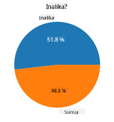
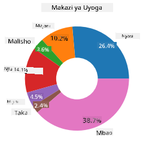
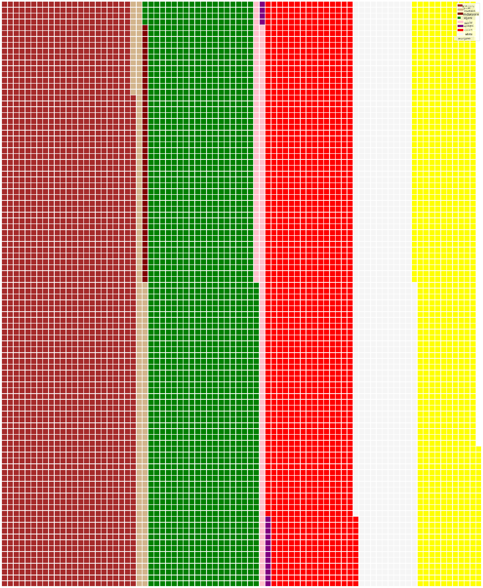

<!--
CO_OP_TRANSLATOR_METADATA:
{
  "original_hash": "af6a12015c6e250e500b570a9fa42593",
  "translation_date": "2025-08-26T17:27:25+00:00",
  "source_file": "3-Data-Visualization/11-visualization-proportions/README.md",
  "language_code": "sw"
}
-->
# Kuonyesha Uwiano

| ](../../sketchnotes/11-Visualizing-Proportions.png)|
|:---:|
|Kuonyesha Uwiano - _Sketchnote na [@nitya](https://twitter.com/nitya)_ |

Katika somo hili, utatumia seti ya data inayohusiana na maumbile kuonyesha uwiano, kama vile aina ngapi tofauti za uyoga zinapatikana katika seti ya data kuhusu uyoga. Hebu tuchunguze uyoga huu wa kuvutia kwa kutumia seti ya data kutoka Audubon inayoorodhesha maelezo kuhusu spishi 23 za uyoga wenye mapezi katika familia za Agaricus na Lepiota. Utajaribu mbinu za kuvutia za uwasilishaji kama:

- Chati za pai 🥧  
- Chati za donati 🍩  
- Chati za waffle 🧇  

> 💡 Mradi wa kuvutia sana unaoitwa [Charticulator](https://charticulator.com) kutoka Microsoft Research unatoa kiolesura cha bure cha kuburuta na kudondosha kwa ajili ya uwasilishaji wa data. Katika mojawapo ya mafunzo yao, wanatumia pia seti hii ya data ya uyoga! Kwa hivyo unaweza kuchunguza data na kujifunza maktaba hiyo kwa wakati mmoja: [Mafunzo ya Charticulator](https://charticulator.com/tutorials/tutorial4.html).

## [Jaribio la kabla ya somo](https://purple-hill-04aebfb03.1.azurestaticapps.net/quiz/20)

## Fahamu uyoga wako 🍄

Uyoga ni wa kuvutia sana. Hebu tuingize seti ya data ili kuwasoma:

```python
import pandas as pd
import matplotlib.pyplot as plt
mushrooms = pd.read_csv('../../data/mushrooms.csv')
mushrooms.head()
```  
Jedwali linachapishwa likiwa na data nzuri kwa ajili ya uchambuzi:

| darasa    | umbo-la-kofia | uso-wa-kofia | rangi-ya-kofia | michubuko | harufu  | kiambatisho-cha-mapezi | nafasi-ya-mapezi | ukubwa-wa-mapezi | rangi-ya-mapezi | umbo-la-shina | mzizi-wa-shina | uso-wa-shina-juu-ya-pete | uso-wa-shina-chini-ya-pete | rangi-ya-shina-juu-ya-pete | rangi-ya-shina-chini-ya-pete | aina-ya-ukingo | rangi-ya-ukingo | idadi-ya-pete | aina-ya-pete | rangi-ya-spore | idadi | makazi |
| --------- | ------------- | ------------ | -------------- | --------- | ------- | ---------------------- | ---------------- | ---------------- | --------------- | ------------- | ------------- | ------------------------ | ------------------------ | -------------------------- | -------------------------- | ------------- | -------------- | ------------- | ----------- | ------------- | ----- | ------ |
| Sumu      | Mbonyeo       | Laini        | Kahawia        | Michubuko | Chungu  | Huru                  | Karibu           | Nyembamba        | Nyeusi          | Inapanuka     | Sawa          | Laini                   | Laini                   | Nyeupe                  | Nyeupe                  | Sehemu         | Nyeupe         | Moja          | Inaning'inia | Nyeusi         | Zimezagaa | Mjini  |
| Chakula   | Mbonyeo       | Laini        | Njano          | Michubuko | Mlozi   | Huru                  | Karibu           | Pana             | Nyeusi          | Inapanuka     | Fimbo         | Laini                   | Laini                   | Nyeupe                  | Nyeupe                  | Sehemu         | Nyeupe         | Moja          | Inaning'inia | Kahawia        | Nyingi   | Nyasi  |
| Chakula   | Kengele       | Laini        | Nyeupe         | Michubuko | Anisi   | Huru                  | Karibu           | Pana             | Kahawia         | Inapanuka     | Fimbo         | Laini                   | Laini                   | Nyeupe                  | Nyeupe                  | Sehemu         | Nyeupe         | Moja          | Inaning'inia | Kahawia        | Nyingi   | Mabustani |
| Sumu      | Mbonyeo       | Nyeruzi      | Nyeupe         | Michubuko | Chungu  | Huru                  | Karibu           | Nyembamba        | Kahawia         | Inapanuka     | Sawa          | Laini                   | Laini                   | Nyeupe                  | Nyeupe                  | Sehemu         | Nyeupe         | Moja          | Inaning'inia | Nyeusi         | Zimezagaa | Mjini  |

Mara moja, unagundua kuwa data yote ni ya maandishi. Utahitaji kubadilisha data hii ili kuweza kuitumia kwenye chati. Kwa kweli, data nyingi inawakilishwa kama kitu:

```python
print(mushrooms.select_dtypes(["object"]).columns)
```  

Matokeo ni:

```output
Index(['class', 'cap-shape', 'cap-surface', 'cap-color', 'bruises', 'odor',
       'gill-attachment', 'gill-spacing', 'gill-size', 'gill-color',
       'stalk-shape', 'stalk-root', 'stalk-surface-above-ring',
       'stalk-surface-below-ring', 'stalk-color-above-ring',
       'stalk-color-below-ring', 'veil-type', 'veil-color', 'ring-number',
       'ring-type', 'spore-print-color', 'population', 'habitat'],
      dtype='object')
```  
Chukua data hii na ubadilishe safu ya 'darasa' kuwa kategoria:

```python
cols = mushrooms.select_dtypes(["object"]).columns
mushrooms[cols] = mushrooms[cols].astype('category')
```  

```python
edibleclass=mushrooms.groupby(['class']).count()
edibleclass
```  

Sasa, ukichapisha data ya uyoga, utaona kuwa imepangwa katika makundi kulingana na darasa la sumu/chakula:

|           | umbo-la-kofia | uso-wa-kofia | rangi-ya-kofia | michubuko | harufu | kiambatisho-cha-mapezi | nafasi-ya-mapezi | ukubwa-wa-mapezi | rangi-ya-mapezi | umbo-la-shina | ... | uso-wa-shina-chini-ya-pete | rangi-ya-shina-juu-ya-pete | rangi-ya-shina-chini-ya-pete | aina-ya-ukingo | rangi-ya-ukingo | idadi-ya-pete | aina-ya-pete | rangi-ya-spore | idadi | makazi |
| --------- | ------------- | ------------ | -------------- | --------- | ------ | ---------------------- | ---------------- | ---------------- | --------------- | ------------- | --- | ------------------------ | -------------------------- | -------------------------- | ------------- | -------------- | ------------- | ----------- | ------------- | ----- | ------ |
| darasa    |               |              |                |           |        |                        |                  |                  |                 |               |     |                          |                          |                          |               |                |               |             |               |       |        |
| Chakula   | 4208          | 4208         | 4208           | 4208      | 4208   | 4208                   | 4208             | 4208             | 4208            | 4208          | ... | 4208                     | 4208                     | 4208                     | 4208          | 4208           | 4208          | 4208        | 4208          | 4208  | 4208   |
| Sumu      | 3916          | 3916         | 3916           | 3916      | 3916   | 3916                   | 3916             | 3916             | 3916            | 3916          | ... | 3916                     | 3916                     | 3916                     | 3916          | 3916           | 3916          | 3916        | 3916          | 3916  | 3916   |

Ukifuata mpangilio uliowasilishwa kwenye jedwali hili kuunda lebo za kategoria za darasa lako, unaweza kuunda chati ya pai:

## Pai!

```python
labels=['Edible','Poisonous']
plt.pie(edibleclass['population'],labels=labels,autopct='%.1f %%')
plt.title('Edible?')
plt.show()
```  
Voila, chati ya pai inayoonyesha uwiano wa data hii kulingana na madarasa haya mawili ya uyoga. Ni muhimu sana kupata mpangilio wa lebo sahihi, hasa hapa, kwa hivyo hakikisha unathibitisha mpangilio ambao safu ya lebo imejengwa!



## Donati!

Chati ya donati ni chati ya pai yenye shimo katikati, na ni ya kuvutia zaidi kwa macho. Hebu tuangalie data yetu kwa njia hii.

Angalia makazi mbalimbali ambapo uyoga hukua:

```python
habitat=mushrooms.groupby(['habitat']).count()
habitat
```  
Hapa, unagawanya data yako kulingana na makazi. Kuna makazi 7 yaliyotajwa, kwa hivyo tumia hayo kama lebo za chati yako ya donati:

```python
labels=['Grasses','Leaves','Meadows','Paths','Urban','Waste','Wood']

plt.pie(habitat['class'], labels=labels,
        autopct='%1.1f%%', pctdistance=0.85)
  
center_circle = plt.Circle((0, 0), 0.40, fc='white')
fig = plt.gcf()

fig.gca().add_artist(center_circle)
  
plt.title('Mushroom Habitats')
  
plt.show()
```  



Msimbo huu unachora chati na mduara wa katikati, kisha unaongeza mduara huo katikati ya chati. Badilisha upana wa mduara wa katikati kwa kubadilisha `0.40` kuwa thamani nyingine.

Chati za donati zinaweza kubadilishwa kwa njia kadhaa ili kuboresha lebo. Lebo hasa zinaweza kuangaziwa ili kusomeka vizuri. Jifunze zaidi katika [nyaraka](https://matplotlib.org/stable/gallery/pie_and_polar_charts/pie_and_donut_labels.html?highlight=donut).

Sasa kwa kuwa unajua jinsi ya kugawanya data yako na kisha kuionyesha kama pai au donati, unaweza kuchunguza aina nyingine za chati. Jaribu chati ya waffle, ambayo ni njia tofauti ya kuchunguza wingi.

## Waffle!

Chati ya aina ya 'waffle' ni njia tofauti ya kuonyesha wingi kama safu ya mraba ya 2D. Jaribu kuonyesha wingi wa rangi za kofia za uyoga katika seti hii ya data. Ili kufanya hivyo, unahitaji kusakinisha maktaba ya msaidizi inayoitwa [PyWaffle](https://pypi.org/project/pywaffle/) na kutumia Matplotlib:

```python
pip install pywaffle
```  

Chagua sehemu ya data yako ili kugawanya:

```python
capcolor=mushrooms.groupby(['cap-color']).count()
capcolor
```  

Unda chati ya waffle kwa kuunda lebo na kisha kugawanya data yako:

```python
import pandas as pd
import matplotlib.pyplot as plt
from pywaffle import Waffle
  
data ={'color': ['brown', 'buff', 'cinnamon', 'green', 'pink', 'purple', 'red', 'white', 'yellow'],
    'amount': capcolor['class']
     }
  
df = pd.DataFrame(data)
  
fig = plt.figure(
    FigureClass = Waffle,
    rows = 100,
    values = df.amount,
    labels = list(df.color),
    figsize = (30,30),
    colors=["brown", "tan", "maroon", "green", "pink", "purple", "red", "whitesmoke", "yellow"],
)
```  

Kwa kutumia chati ya waffle, unaweza kuona wazi uwiano wa rangi za kofia za uyoga katika seti hii ya data. Cha kufurahisha, kuna uyoga wengi wenye kofia za kijani!



✅ PyWaffle inasaidia ikoni ndani ya chati zinazotumia ikoni yoyote inayopatikana katika [Font Awesome](https://fontawesome.com/). Fanya majaribio kuunda chati ya waffle ya kuvutia zaidi kwa kutumia ikoni badala ya miraba.

Katika somo hili, umejifunza njia tatu za kuonyesha uwiano. Kwanza, unahitaji kugawanya data yako katika kategoria na kisha kuamua njia bora ya kuonyesha data - pai, donati, au waffle. Zote ni za kuvutia na zinamfurahisha mtumiaji kwa muhtasari wa papo hapo wa seti ya data.

## 🚀 Changamoto

Jaribu kuunda upya chati hizi za kuvutia katika [Charticulator](https://charticulator.com).

## [Jaribio la baada ya somo](https://purple-hill-04aebfb03.1.azurestaticapps.net/quiz/21)

## Mapitio na Kujisomea

Wakati mwingine si rahisi kujua ni lini utumie pai, donati, au chati ya waffle. Hapa kuna makala za kusoma kuhusu mada hii:

https://www.beautiful.ai/blog/battle-of-the-charts-pie-chart-vs-donut-chart  

https://medium.com/@hypsypops/pie-chart-vs-donut-chart-showdown-in-the-ring-5d24fd86a9ce  

https://www.mit.edu/~mbarker/formula1/f1help/11-ch-c6.htm  

https://medium.datadriveninvestor.com/data-visualization-done-the-right-way-with-tableau-waffle-chart-fdf2a19be402  

Fanya utafiti zaidi ili kupata taarifa zaidi kuhusu uamuzi huu mgumu.

## Kazi

[Jaribu katika Excel](assignment.md)  

---

**Kanusho**:  
Hati hii imetafsiriwa kwa kutumia huduma ya tafsiri ya AI [Co-op Translator](https://github.com/Azure/co-op-translator). Ingawa tunajitahidi kuhakikisha usahihi, tafsiri za kiotomatiki zinaweza kuwa na makosa au kutokuwa sahihi. Hati ya asili katika lugha yake ya awali inapaswa kuzingatiwa kama chanzo cha mamlaka. Kwa taarifa muhimu, tafsiri ya kitaalamu ya binadamu inapendekezwa. Hatutawajibika kwa kutoelewana au tafsiri zisizo sahihi zinazotokana na matumizi ya tafsiri hii.