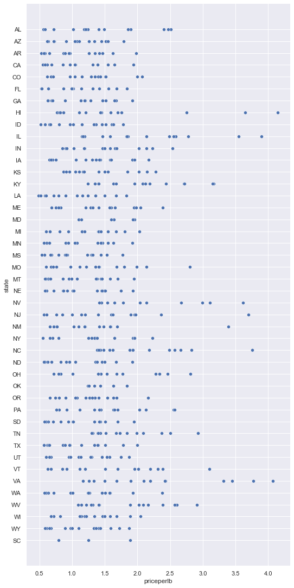
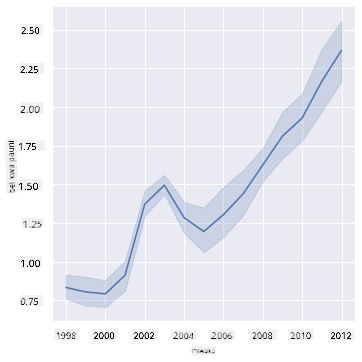
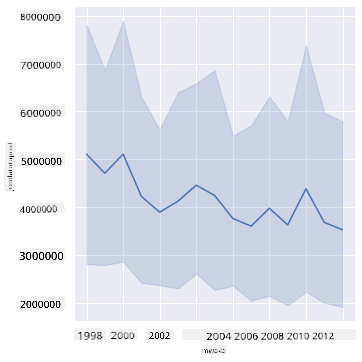
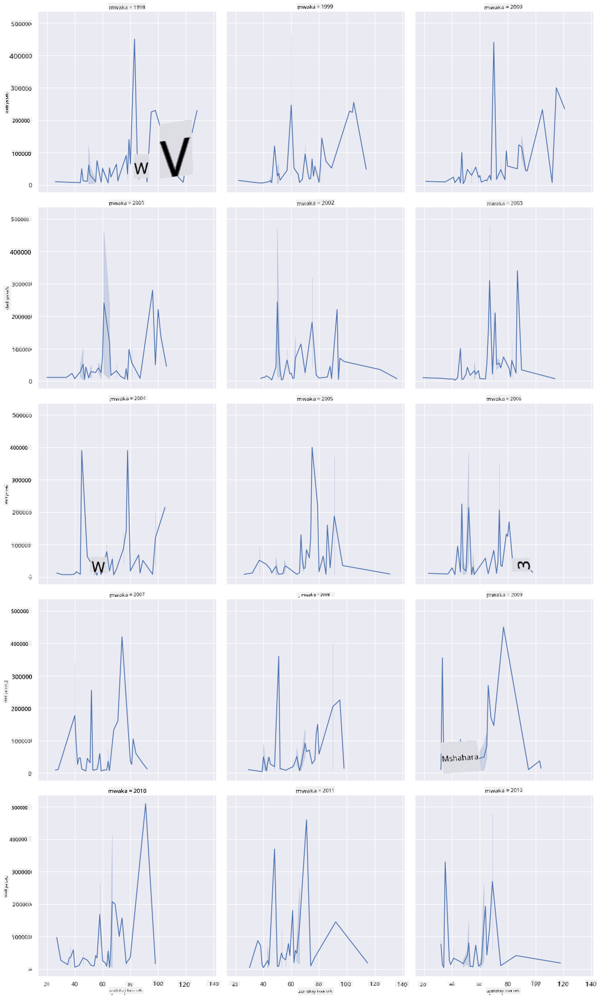
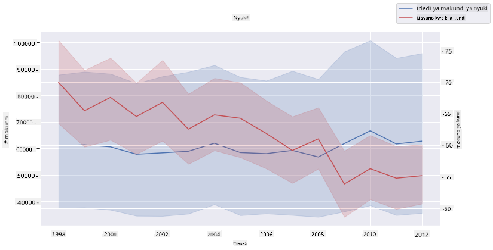

<!--
CO_OP_TRANSLATOR_METADATA:
{
  "original_hash": "cad419b574d5c35eaa417e9abfdcb0c8",
  "translation_date": "2025-08-26T16:53:18+00:00",
  "source_file": "3-Data-Visualization/12-visualization-relationships/README.md",
  "language_code": "sw"
}
-->
# Kuonyesha Mahusiano: Yote Kuhusu Asali 🍯

| ](../../sketchnotes/12-Visualizing-Relationships.png)|
|:---:|
|Kuonyesha Mahusiano - _Sketchnote na [@nitya](https://twitter.com/nitya)_ |

Tukiendelea na mtazamo wa asili katika utafiti wetu, hebu tujifunze njia za kuvutia za kuonyesha mahusiano kati ya aina mbalimbali za asali, kulingana na seti ya data iliyotolewa na [Idara ya Kilimo ya Marekani](https://www.nass.usda.gov/About_NASS/index.php).

Seti hii ya data yenye takriban vipengele 600 inaonyesha uzalishaji wa asali katika majimbo mengi ya Marekani. Kwa mfano, unaweza kuangalia idadi ya makoloni, mavuno kwa kila koloni, uzalishaji wa jumla, akiba, bei kwa pauni, na thamani ya asali iliyozalishwa katika jimbo fulani kuanzia mwaka 1998-2012, na safu moja kwa kila mwaka kwa kila jimbo.

Itakuwa ya kuvutia kuonyesha mahusiano kati ya uzalishaji wa jimbo fulani kwa mwaka na, kwa mfano, bei ya asali katika jimbo hilo. Vinginevyo, unaweza kuonyesha mahusiano kati ya mavuno ya asali kwa kila koloni katika majimbo mbalimbali. Kipindi hiki cha miaka kinajumuisha tukio la kusikitisha la 'CCD' au 'Colony Collapse Disorder' lililoonekana kwa mara ya kwanza mwaka 2006 (http://npic.orst.edu/envir/ccd.html), kwa hivyo ni seti ya data yenye umuhimu wa kusoma. 🐝

## [Jaribio la awali la somo](https://purple-hill-04aebfb03.1.azurestaticapps.net/quiz/22)

Katika somo hili, unaweza kutumia Seaborn, ambayo umewahi kuitumia hapo awali, kama maktaba nzuri ya kuonyesha mahusiano kati ya vigezo. Jambo la kuvutia hasa ni matumizi ya kipengele cha Seaborn `relplot` ambacho huruhusu grafu za alama na grafu za mstari kuonyesha haraka '[mahusiano ya takwimu](https://seaborn.pydata.org/tutorial/relational.html?highlight=relationships)', ambayo humwezesha mtaalamu wa data kuelewa vyema jinsi vigezo vinavyohusiana.

## Grafu za Alama

Tumia grafu ya alama kuonyesha jinsi bei ya asali imebadilika mwaka hadi mwaka, kwa kila jimbo. Seaborn, kwa kutumia `relplot`, huweka data ya majimbo na kuonyesha alama za data kwa data ya kategoria na ya nambari.

Hebu tuanze kwa kuingiza data na Seaborn:

```python
import pandas as pd
import matplotlib.pyplot as plt
import seaborn as sns
honey = pd.read_csv('../../data/honey.csv')
honey.head()
```
Unagundua kuwa data ya asali ina safu kadhaa za kuvutia, ikiwa ni pamoja na mwaka na bei kwa pauni. Hebu tuchunguze data hii, iliyopangwa kwa majimbo ya Marekani:

| state | numcol | yieldpercol | totalprod | stocks   | priceperlb | prodvalue | year |
| ----- | ------ | ----------- | --------- | -------- | ---------- | --------- | ---- |
| AL    | 16000  | 71          | 1136000   | 159000   | 0.72       | 818000    | 1998 |
| AZ    | 55000  | 60          | 3300000   | 1485000  | 0.64       | 2112000   | 1998 |
| AR    | 53000  | 65          | 3445000   | 1688000  | 0.59       | 2033000   | 1998 |
| CA    | 450000 | 83          | 37350000  | 12326000 | 0.62       | 23157000  | 1998 |
| CO    | 27000  | 72          | 1944000   | 1594000  | 0.7        | 1361000   | 1998 |

Unda grafu ya msingi ya alama kuonyesha mahusiano kati ya bei kwa pauni ya asali na jimbo la asili. Fanya mhimili wa `y` uwe mrefu vya kutosha kuonyesha majimbo yote:

```python
sns.relplot(x="priceperlb", y="state", data=honey, height=15, aspect=.5);
```


Sasa, onyesha data hiyo hiyo kwa mpangilio wa rangi ya asali ili kuonyesha jinsi bei inavyobadilika mwaka hadi mwaka. Unaweza kufanya hivi kwa kuongeza kipengele cha 'hue' kuonyesha mabadiliko, mwaka hadi mwaka:

> ✅ Jifunze zaidi kuhusu [paleti za rangi unazoweza kutumia katika Seaborn](https://seaborn.pydata.org/tutorial/color_palettes.html) - jaribu mpangilio mzuri wa rangi za upinde wa mvua!

```python
sns.relplot(x="priceperlb", y="state", hue="year", palette="YlOrBr", data=honey, height=15, aspect=.5);
```


Kwa mabadiliko haya ya mpangilio wa rangi, unaweza kuona wazi kuwa kuna mwelekeo wa ongezeko la bei kwa pauni ya asali mwaka hadi mwaka. Kwa kweli, ukichukua sampuli ya data ili kuthibitisha (chagua jimbo fulani, Arizona kwa mfano) unaweza kuona mwelekeo wa ongezeko la bei mwaka hadi mwaka, isipokuwa kwa baadhi ya miaka:

| state | numcol | yieldpercol | totalprod | stocks  | priceperlb | prodvalue | year |
| ----- | ------ | ----------- | --------- | ------- | ---------- | --------- | ---- |
| AZ    | 55000  | 60          | 3300000   | 1485000 | 0.64       | 2112000   | 1998 |
| AZ    | 52000  | 62          | 3224000   | 1548000 | 0.62       | 1999000   | 1999 |
| AZ    | 40000  | 59          | 2360000   | 1322000 | 0.73       | 1723000   | 2000 |
| AZ    | 43000  | 59          | 2537000   | 1142000 | 0.72       | 1827000   | 2001 |
| AZ    | 38000  | 63          | 2394000   | 1197000 | 1.08       | 2586000   | 2002 |
| AZ    | 35000  | 72          | 2520000   | 983000  | 1.34       | 3377000   | 2003 |
| AZ    | 32000  | 55          | 1760000   | 774000  | 1.11       | 1954000   | 2004 |
| AZ    | 36000  | 50          | 1800000   | 720000  | 1.04       | 1872000   | 2005 |
| AZ    | 30000  | 65          | 1950000   | 839000  | 0.91       | 1775000   | 2006 |
| AZ    | 30000  | 64          | 1920000   | 902000  | 1.26       | 2419000   | 2007 |
| AZ    | 25000  | 64          | 1600000   | 336000  | 1.26       | 2016000   | 2008 |
| AZ    | 20000  | 52          | 1040000   | 562000  | 1.45       | 1508000   | 2009 |
| AZ    | 24000  | 77          | 1848000   | 665000  | 1.52       | 2809000   | 2010 |
| AZ    | 23000  | 53          | 1219000   | 427000  | 1.55       | 1889000   | 2011 |
| AZ    | 22000  | 46          | 1012000   | 253000  | 1.79       | 1811000   | 2012 |

Njia nyingine ya kuonyesha mwelekeo huu ni kutumia ukubwa badala ya rangi. Kwa watumiaji wenye matatizo ya kuona rangi, hii inaweza kuwa chaguo bora. Hariri grafu yako ili kuonyesha ongezeko la bei kwa ongezeko la mduara wa alama:

```python
sns.relplot(x="priceperlb", y="state", size="year", data=honey, height=15, aspect=.5);
```
Unaweza kuona ukubwa wa alama ukiongezeka polepole.


Je, hili ni suala rahisi la mahitaji na usambazaji? Kutokana na mambo kama mabadiliko ya hali ya hewa na kuporomoka kwa makoloni, je, kuna asali kidogo inayopatikana kwa ununuzi mwaka hadi mwaka, na hivyo bei kuongezeka?

Ili kugundua uhusiano kati ya baadhi ya vigezo katika seti hii ya data, hebu tuchunguze grafu za mstari.

## Grafu za Mstari

Swali: Je, kuna ongezeko dhahiri la bei ya asali kwa pauni mwaka hadi mwaka? Unaweza kugundua hili kwa urahisi kwa kuunda grafu moja ya mstari:

```python
sns.relplot(x="year", y="priceperlb", kind="line", data=honey);
```
Jibu: Ndiyo, isipokuwa kwa baadhi ya miaka kama 2003:



✅ Kwa sababu Seaborn inakusanya data kuzunguka mstari mmoja, inaonyesha "vipimo vingi kwa kila thamani ya x kwa kuonyesha wastani na kiwango cha kujiamini cha 95% kuzunguka wastani". [Chanzo](https://seaborn.pydata.org/tutorial/relational.html). Tabia hii inayochukua muda inaweza kuzimwa kwa kuongeza `ci=None`.

Swali: Vema, mwaka 2003 tunaweza pia kuona ongezeko la usambazaji wa asali? Je, ukitazama uzalishaji wa jumla mwaka hadi mwaka?

```python
sns.relplot(x="year", y="totalprod", kind="line", data=honey);
```



Jibu: Sio kweli. Ukitazama uzalishaji wa jumla, inaonekana kuwa uliongezeka katika mwaka huo, ingawa kwa ujumla uzalishaji wa asali unaonekana kupungua katika miaka hiyo.

Swali: Katika hali hiyo, ni nini kingeweza kusababisha ongezeko la bei ya asali karibu na mwaka 2003?

Ili kugundua hili, unaweza kuchunguza gridi ya vipengele.

## Gridi za Vipengele

Gridi za vipengele huchukua kipengele kimoja cha seti yako ya data (katika hali yetu, unaweza kuchagua 'mwaka' ili kuepuka kuwa na vipengele vingi vilivyotengenezwa). Seaborn inaweza kisha kutengeneza grafu kwa kila kipengele cha x na y ulichokichagua kwa kulinganisha kwa urahisi. Je, mwaka 2003 unajitokeza katika aina hii ya kulinganisha?

Unda gridi ya vipengele kwa kuendelea kutumia `relplot` kama inavyopendekezwa na [Seaborn's documentation](https://seaborn.pydata.org/generated/seaborn.FacetGrid.html?highlight=facetgrid#seaborn.FacetGrid).

```python
sns.relplot(
    data=honey, 
    x="yieldpercol", y="numcol",
    col="year", 
    col_wrap=3,
    kind="line"
```
Katika grafu hii, unaweza kulinganisha mavuno kwa kila koloni na idadi ya makoloni mwaka hadi mwaka, upande kwa upande na mpangilio wa safu 3:



Kwa seti hii ya data, hakuna kitu kinachojitokeza hasa kuhusu idadi ya makoloni na mavuno yao, mwaka hadi mwaka na jimbo hadi jimbo. Je, kuna njia tofauti ya kutafuta uhusiano kati ya vigezo hivi viwili?

## Grafu za Mstari Mbili

Jaribu grafu ya mstari wa mistari mingi kwa kuweka grafu mbili za mstari juu ya kila mmoja, ukitumia 'despine' ya Seaborn kuondoa miiba ya juu na ya kulia, na ukitumia `ax.twinx` [iliyotokana na Matplotlib](https://matplotlib.org/stable/api/_as_gen/matplotlib.axes.Axes.twinx.html). Twinx huruhusu grafu kushiriki mhimili wa x na kuonyesha mihimili miwili ya y. Kwa hivyo, onyesha mavuno kwa kila koloni na idadi ya makoloni, juu ya kila mmoja:

```python
fig, ax = plt.subplots(figsize=(12,6))
lineplot = sns.lineplot(x=honey['year'], y=honey['numcol'], data=honey, 
                        label = 'Number of bee colonies', legend=False)
sns.despine()
plt.ylabel('# colonies')
plt.title('Honey Production Year over Year');

ax2 = ax.twinx()
lineplot2 = sns.lineplot(x=honey['year'], y=honey['yieldpercol'], ax=ax2, color="r", 
                         label ='Yield per colony', legend=False) 
sns.despine(right=False)
plt.ylabel('colony yield')
ax.figure.legend();
```


Ingawa hakuna kitu kinachojitokeza kwa macho karibu na mwaka 2003, inaturuhusu kumaliza somo hili kwa maelezo ya furaha kidogo: ingawa kuna kupungua kwa idadi ya makoloni kwa ujumla, idadi ya makoloni inaimarika hata kama mavuno yao kwa kila koloni yanapungua.

Endeleeni nyuki, endeleeni!

🐝❤️
## 🚀 Changamoto

Katika somo hili, ulijifunza zaidi kuhusu matumizi mengine ya grafu za alama na gridi za mstari, ikiwa ni pamoja na gridi za vipengele. Jipatie changamoto ya kuunda gridi ya vipengele ukitumia seti tofauti ya data, labda moja uliyotumia kabla ya masomo haya. Angalia muda unaochukua kuunda na jinsi unavyohitaji kuwa makini kuhusu idadi ya gridi unazohitaji kuchora ukitumia mbinu hizi.
## [Jaribio la baada ya somo](https://purple-hill-04aebfb03.1.azurestaticapps.net/quiz/23)

## Mapitio & Kujisomea

Grafu za mstari zinaweza kuwa rahisi au ngumu sana. Fanya usomaji kidogo katika [Seaborn documentation](https://seaborn.pydata.org/generated/seaborn.lineplot.html) kuhusu njia mbalimbali unazoweza kuzitumia kuzijenga. Jaribu kuboresha grafu za mstari ulizojenga katika somo hili kwa kutumia mbinu nyingine zilizoorodheshwa katika nyaraka.
## Kazi

[Chunguza mzinga wa nyuki](assignment.md)

---

**Kanusho**:  
Hati hii imetafsiriwa kwa kutumia huduma ya tafsiri ya AI [Co-op Translator](https://github.com/Azure/co-op-translator). Ingawa tunajitahidi kuhakikisha usahihi, tafsiri za kiotomatiki zinaweza kuwa na makosa au kutokuwa sahihi. Hati ya asili katika lugha yake ya awali inapaswa kuchukuliwa kama chanzo cha mamlaka. Kwa taarifa muhimu, tafsiri ya kitaalamu ya binadamu inapendekezwa. Hatutawajibika kwa kutoelewana au tafsiri zisizo sahihi zinazotokana na matumizi ya tafsiri hii.