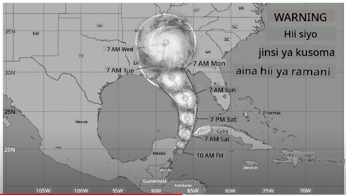
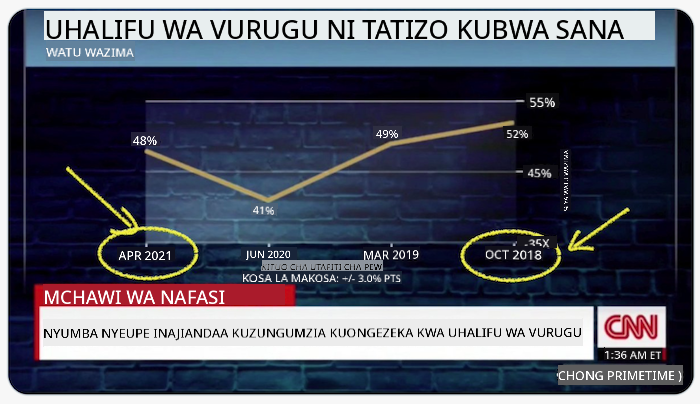
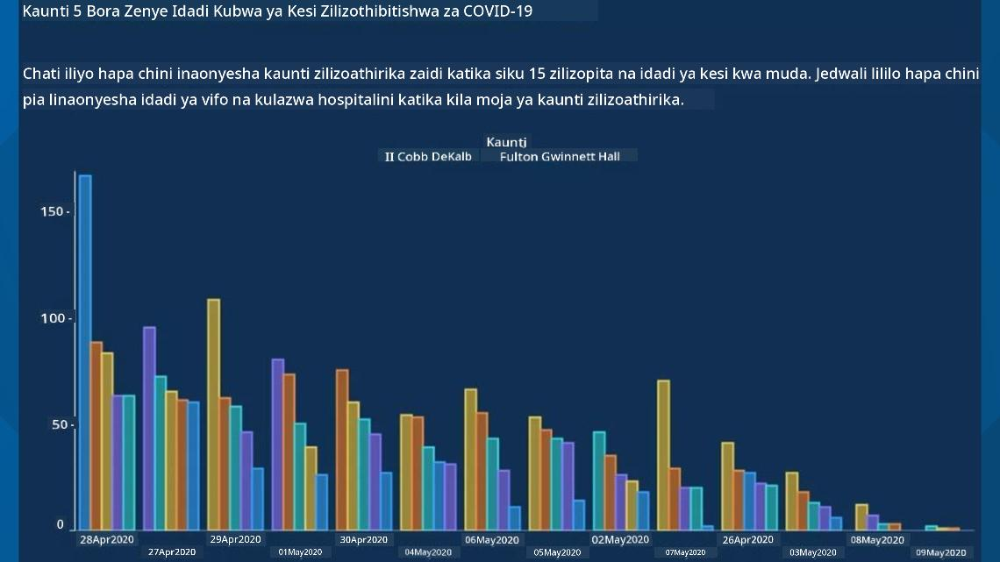
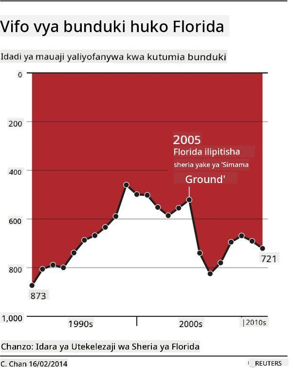
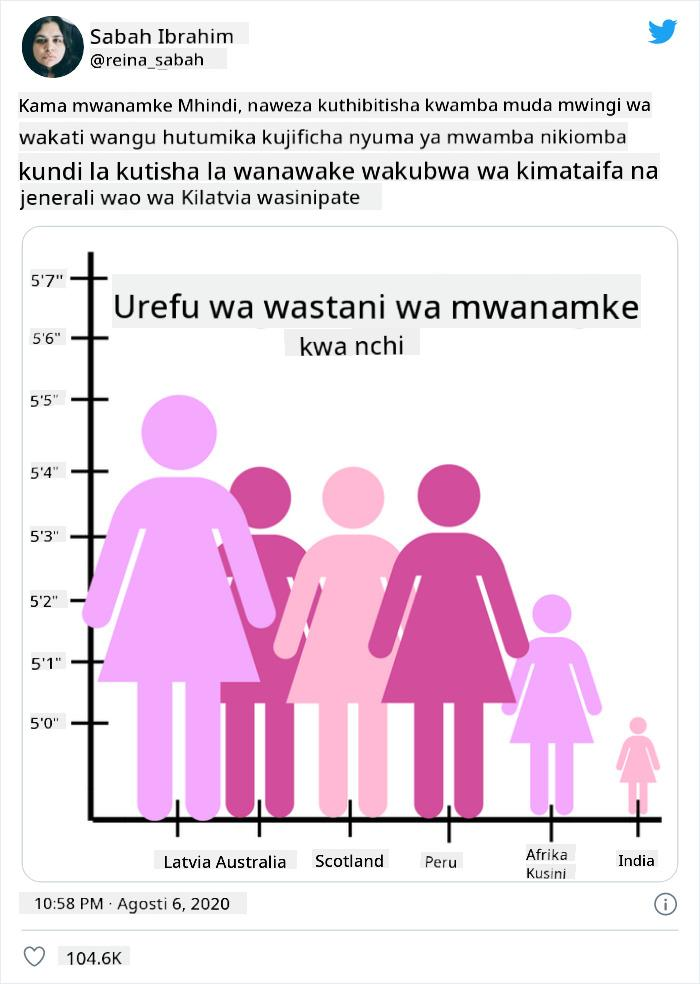
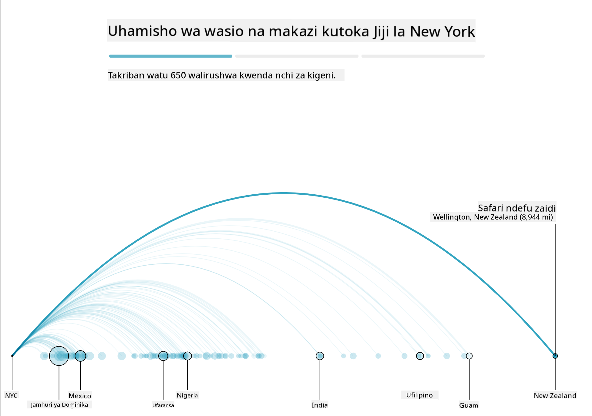
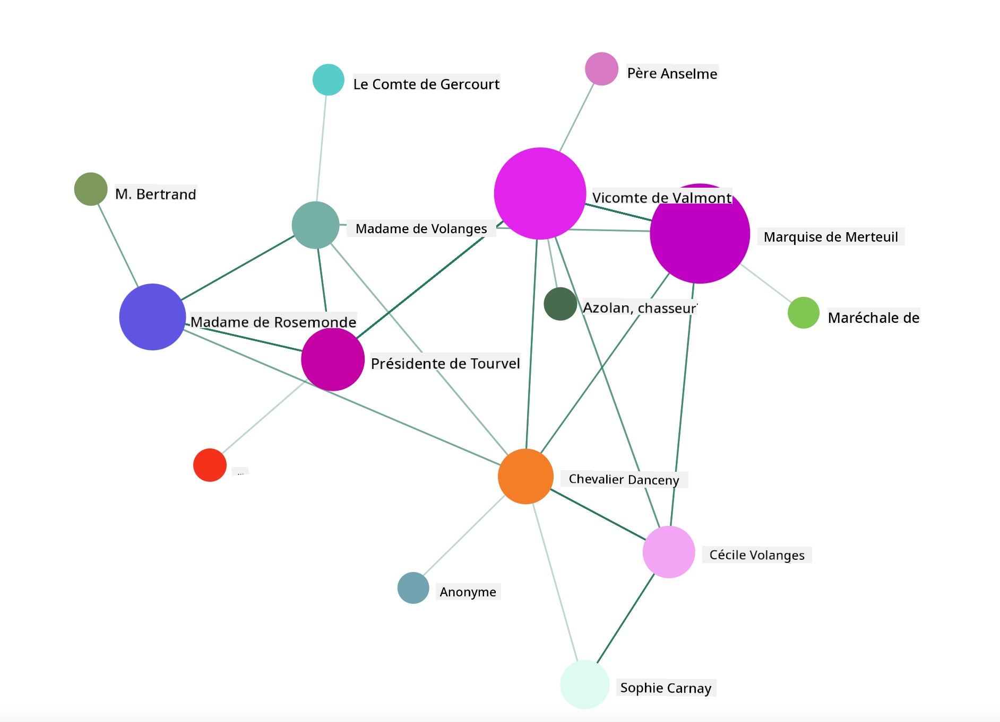

<!--
CO_OP_TRANSLATOR_METADATA:
{
  "original_hash": "4ec4747a9f4f7d194248ea29903ae165",
  "translation_date": "2025-08-26T16:42:34+00:00",
  "source_file": "3-Data-Visualization/13-meaningful-visualizations/README.md",
  "language_code": "sw"
}
-->
# Kutengeneza Uwasilishaji wa Takwimu Wenye Maana

| ](../../sketchnotes/13-MeaningfulViz.png)|
|:---:|
| Uwasilishaji wa Takwimu Wenye Maana - _Sketchnote na [@nitya](https://twitter.com/nitya)_ |

> "Ukipata data na kuibana vya kutosha, itakiri chochote" -- [Ronald Coase](https://en.wikiquote.org/wiki/Ronald_Coase)

Moja ya ujuzi wa msingi wa mwanasayansi wa data ni uwezo wa kuunda uwasilishaji wa takwimu wenye maana unaosaidia kujibu maswali unayoweza kuwa nayo. Kabla ya kuwasilisha data yako, unahitaji kuhakikisha kuwa imefanyiwa usafi na kuandaliwa, kama ulivyofanya katika masomo yaliyopita. Baada ya hapo, unaweza kuanza kuamua jinsi bora ya kuwasilisha data hiyo.

Katika somo hili, utapitia:

1. Jinsi ya kuchagua aina sahihi ya chati  
2. Jinsi ya kuepuka chati za kupotosha  
3. Jinsi ya kutumia rangi kwa usahihi  
4. Jinsi ya kupangilia chati zako ili ziwe rahisi kusomeka  
5. Jinsi ya kujenga suluhisho za chati za 3D au zenye uhuishaji  
6. Jinsi ya kuunda uwasilishaji wa ubunifu  

## [Jaribio la Kabla ya Somo](https://purple-hill-04aebfb03.1.azurestaticapps.net/quiz/24)

## Chagua aina sahihi ya chati

Katika masomo yaliyopita, ulijaribu kujenga aina mbalimbali za uwasilishaji wa takwimu kwa kutumia Matplotlib na Seaborn. Kwa ujumla, unaweza kuchagua [aina sahihi ya chati](https://chartio.com/learn/charts/how-to-select-a-data-vizualization/) kwa swali unalouliza kwa kutumia jedwali hili:

| Unahitaji:                 | Unapaswa kutumia:               |
| -------------------------- | ------------------------------- |
| Kuonyesha mwenendo wa data kwa muda | Line                            |
| Kulinganisha makundi       | Bar, Pie                        |
| Kulinganisha jumla         | Pie, Stacked Bar                |
| Kuonyesha uhusiano         | Scatter, Line, Facet, Dual Line |
| Kuonyesha usambazaji       | Scatter, Histogram, Box         |
| Kuonyesha uwiano           | Pie, Donut, Waffle              |

> ✅ Kulingana na muundo wa data yako, unaweza kuhitaji kuibadilisha kutoka maandishi kwenda namba ili chati fulani iweze kuisapoti.

## Epuka udanganyifu

Hata kama mwanasayansi wa data atachagua chati sahihi kwa data sahihi, kuna njia nyingi ambazo data inaweza kuwasilishwa kwa njia ya kuthibitisha hoja fulani, mara nyingi kwa gharama ya kuharibu uaminifu wa data yenyewe. Kuna mifano mingi ya chati na infografiki za kupotosha!

[](https://www.youtube.com/watch?v=oX74Nge8Wkw "Jinsi chati zinavyodanganya")

> 🎥 Bofya picha hapo juu kwa mazungumzo ya mkutano kuhusu chati za kupotosha

Chati hii inageuza mhimili wa X ili kuonyesha kinyume cha ukweli, kulingana na tarehe:



[Chati hii](https://media.firstcoastnews.com/assets/WTLV/images/170ae16f-4643-438f-b689-50d66ca6a8d8/170ae16f-4643-438f-b689-50d66ca6a8d8_1140x641.jpg) ni ya kupotosha zaidi, kwani jicho linaelekezwa upande wa kulia kuhitimisha kuwa, kwa muda, kesi za COVID zimepungua katika kaunti mbalimbali. Kwa kweli, ukitazama kwa makini tarehe, utagundua kuwa zimepangwa upya ili kuonyesha mwenendo wa kupungua ambao si wa kweli.



Mfano huu maarufu unatumia rangi NA mhimili wa Y uliogeuzwa ili kudanganya: badala ya kuhitimisha kuwa vifo vya bunduki viliongezeka baada ya kupitishwa kwa sheria zinazounga mkono bunduki, jicho linadanganywa kufikiri kinyume chake:



Chati hii ya ajabu inaonyesha jinsi uwiano unavyoweza kudanganywa, kwa njia ya kuchekesha:



Kulinganisha vitu visivyolinganishika ni mbinu nyingine ya hila. Kuna [tovuti nzuri](https://tylervigen.com/spurious-correlations) inayohusu 'uwiano wa uongo' ikionyesha 'ukweli' unaohusisha mambo kama kiwango cha talaka huko Maine na matumizi ya siagi ya margarine. Kikundi cha Reddit pia hukusanya [matumizi mabaya](https://www.reddit.com/r/dataisugly/top/?t=all) ya data.

Ni muhimu kuelewa jinsi jicho linavyoweza kudanganywa kwa urahisi na chati za kupotosha. Hata kama nia ya mwanasayansi wa data ni nzuri, uchaguzi wa aina mbaya ya chati, kama chati ya pie inayoonyesha makundi mengi sana, unaweza kupotosha.

## Rangi

Umeona katika chati ya 'vurugu za bunduki Florida' jinsi rangi inavyoweza kutoa maana ya ziada kwa chati, hasa zile ambazo hazijatengenezwa kwa kutumia maktaba kama Matplotlib na Seaborn ambazo zina maktaba mbalimbali za rangi zilizothibitishwa. Ikiwa unaunda chati kwa mkono, fanya utafiti kidogo wa [nadharia ya rangi](https://colormatters.com/color-and-design/basic-color-theory)

> ✅ Kuwa makini, unapounda chati, kwamba upatikanaji ni kipengele muhimu cha uwasilishaji. Baadhi ya watumiaji wako wanaweza kuwa na upofu wa rangi - je, chati yako inaonekana vizuri kwa watumiaji wenye ulemavu wa kuona?

Kuwa mwangalifu unapochagua rangi za chati yako, kwani rangi inaweza kuwasilisha maana usiyokusudia. 'Pink ladies' katika chati ya 'urefu' hapo juu zinaonyesha maana ya 'kike' ambayo inaongeza hali ya ajabu ya chati yenyewe.

Ingawa [maana ya rangi](https://colormatters.com/color-symbolism/the-meanings-of-colors) inaweza kuwa tofauti katika sehemu mbalimbali za dunia, na huwa zinabadilika kulingana na kivuli chake. Kwa ujumla, maana za rangi ni pamoja na:

| Rangi   | Maana               |
| ------- | ------------------- |
| nyekundu | nguvu               |
| bluu    | uaminifu, uaminifu  |
| njano   | furaha, tahadhari   |
| kijani  | ekolojia, bahati, wivu |
| zambarau | furaha              |
| machungwa | nguvu               |

Ikiwa umepewa jukumu la kujenga chati na rangi maalum, hakikisha kuwa chati zako ni rahisi kufikiwa na rangi unayochagua inalingana na maana unayojaribu kuwasilisha.

## Kupangilia chati zako ili ziwe rahisi kusomeka

Chati hazina maana ikiwa hazisomeki! Chukua muda wa kuzingatia kupangilia upana na urefu wa chati yako ili iweze kuendana vizuri na data yako. Ikiwa kipengele kimoja (kama majimbo yote 50) kinahitaji kuonyeshwa, yaonyeshe wima kwenye mhimili wa Y ikiwa inawezekana ili kuepuka chati inayosogezwa kwa usawa.

Weka lebo kwenye mhimili wako, toa ufafanuzi ikiwa ni lazima, na toa vidokezo vya zana kwa uelewa bora wa data.

Ikiwa data yako ni ya maandishi na ndefu kwenye mhimili wa X, unaweza kuipangilia kwa pembe kwa usomaji bora. [Matplotlib](https://matplotlib.org/stable/tutorials/toolkits/mplot3d.html) inatoa uwezekano wa kuchora chati za 3D, ikiwa data yako inaiunga mkono. Uwasilishaji wa takwimu wa hali ya juu unaweza kuzalishwa kwa kutumia `mpl_toolkits.mplot3d`.


## Uhuishaji na maonyesho ya chati za 3D

Baadhi ya uwasilishaji bora wa takwimu leo ni wa kuhuishwa. Shirley Wu ana mifano ya kushangaza iliyofanywa na D3, kama '[film flowers](http://bl.ocks.org/sxywu/raw/d612c6c653fb8b4d7ff3d422be164a5d/)', ambapo kila ua ni uwasilishaji wa filamu. Mfano mwingine kwa Guardian ni 'bussed out', uzoefu wa maingiliano unaochanganya uwasilishaji na Greensock na D3 pamoja na makala ya scrollytelling kuonyesha jinsi NYC inavyoshughulikia tatizo la watu wasio na makazi kwa kuwapeleka nje ya jiji.



> "Bussed Out: Jinsi Marekani Inavyohamisha Watu Wasio na Makazi" kutoka [the Guardian](https://www.theguardian.com/us-news/ng-interactive/2017/dec/20/bussed-out-america-moves-homeless-people-country-study). Uwasilishaji na Nadieh Bremer & Shirley Wu

Ingawa somo hili halitoshi kufundisha kwa kina maktaba hizi zenye nguvu za uwasilishaji, jaribu kutumia D3 katika programu ya Vue.js kwa kutumia maktaba kuonyesha uwasilishaji wa kitabu "Dangerous Liaisons" kama mtandao wa kijamii uliobuniwa.

> "Les Liaisons Dangereuses" ni riwaya ya barua, au riwaya iliyowasilishwa kama mfululizo wa barua. Iliandikwa mwaka 1782 na Choderlos de Laclos, inasimulia hadithi ya hila za kijamii za wahusika wawili wa tabaka la kifalme la Ufaransa katika karne ya 18, Vicomte de Valmont na Marquise de Merteuil. Wote wawili wanakutana na mwisho mbaya lakini si kabla ya kusababisha uharibifu mkubwa wa kijamii. Riwaya inafunguka kama mfululizo wa barua zilizoandikwa kwa watu mbalimbali katika mzunguko wao, wakipanga kulipiza kisasi au kuleta matatizo. Unda uwasilishaji wa barua hizi kugundua wahusika wakuu wa hadithi, kwa njia ya kuona.

Utakamilisha programu ya wavuti ambayo itaonyesha mtazamo wa uhuishaji wa mtandao huu wa kijamii. Inatumia maktaba iliyojengwa kuunda [uwasilishaji wa mtandao](https://github.com/emiliorizzo/vue-d3-network) kwa kutumia Vue.js na D3. Wakati programu inafanya kazi, unaweza kuvuta nodi kwenye skrini ili kupanga upya data.



## Mradi: Jenga chati kuonyesha mtandao kwa kutumia D3.js

> Folda ya somo hili inajumuisha folda ya `solution` ambapo unaweza kupata mradi uliokamilika, kwa marejeleo yako.

1. Fuata maelekezo katika faili la README.md lililopo kwenye mzizi wa folda ya kuanzia. Hakikisha una NPM na Node.js zikifanya kazi kwenye mashine yako kabla ya kusakinisha utegemezi wa mradi wako.

2. Fungua folda ya `starter/src`. Utakuta folda ya `assets` ambapo unaweza kupata faili ya .json yenye barua zote kutoka kwenye riwaya, zikiwa zimeorodheshwa, na maelezo ya 'to' na 'from'.

3. Kamilisha msimbo katika `components/Nodes.vue` ili kuwezesha uwasilishaji. Tafuta njia inayoitwa `createLinks()` na ongeza kitanzi kilicho hapa chini.

Pitia kitu cha .json ili kukamata data ya 'to' na 'from' kwa barua na kujenga kitu cha `links` ili maktaba ya uwasilishaji iweze kuitumia:

```javascript
//loop through letters
      let f = 0;
      let t = 0;
      for (var i = 0; i < letters.length; i++) {
          for (var j = 0; j < characters.length; j++) {
              
            if (characters[j] == letters[i].from) {
              f = j;
            }
            if (characters[j] == letters[i].to) {
              t = j;
            }
        }
        this.links.push({ sid: f, tid: t });
      }
  ```

Endesha programu yako kutoka kwenye terminal (npm run serve) na furahia uwasilishaji!

## 🚀 Changamoto

Fanya ziara ya mtandao kugundua uwasilishaji wa takwimu wa kupotosha. Je, mwandishi anamdanganya mtumiaji vipi, na je, ni kwa makusudi? Jaribu kurekebisha uwasilishaji ili kuonyesha jinsi unavyopaswa kuonekana.

## [Jaribio la Baada ya Somo](https://purple-hill-04aebfb03.1.azurestaticapps.net/quiz/25)

## Mapitio na Kujisomea

Hapa kuna makala za kusoma kuhusu uwasilishaji wa takwimu wa kupotosha:

https://gizmodo.com/how-to-lie-with-data-visualization-1563576606

http://ixd.prattsi.org/2017/12/visual-lies-usability-in-deceptive-data-visualizations/

Tazama uwasilishaji huu wa kuvutia wa mali za kihistoria na mabaki:

https://handbook.pubpub.org/

Pitia makala hii kuhusu jinsi uhuishaji unavyoweza kuboresha uwasilishaji wako:

https://medium.com/@EvanSinar/use-animation-to-supercharge-data-visualization-cd905a882ad4

## Kazi ya Nyumbani

[Jenga uwasilishaji wako wa kipekee](assignment.md)

---

**Kanusho**:  
Hati hii imetafsiriwa kwa kutumia huduma ya tafsiri ya AI [Co-op Translator](https://github.com/Azure/co-op-translator). Ingawa tunajitahidi kuhakikisha usahihi, tafsiri za kiotomatiki zinaweza kuwa na makosa au kutokuwa sahihi. Hati ya asili katika lugha yake ya awali inapaswa kuchukuliwa kama chanzo cha mamlaka. Kwa taarifa muhimu, tafsiri ya kitaalamu ya binadamu inapendekezwa. Hatutawajibika kwa kutokuelewana au tafsiri zisizo sahihi zinazotokana na matumizi ya tafsiri hii.