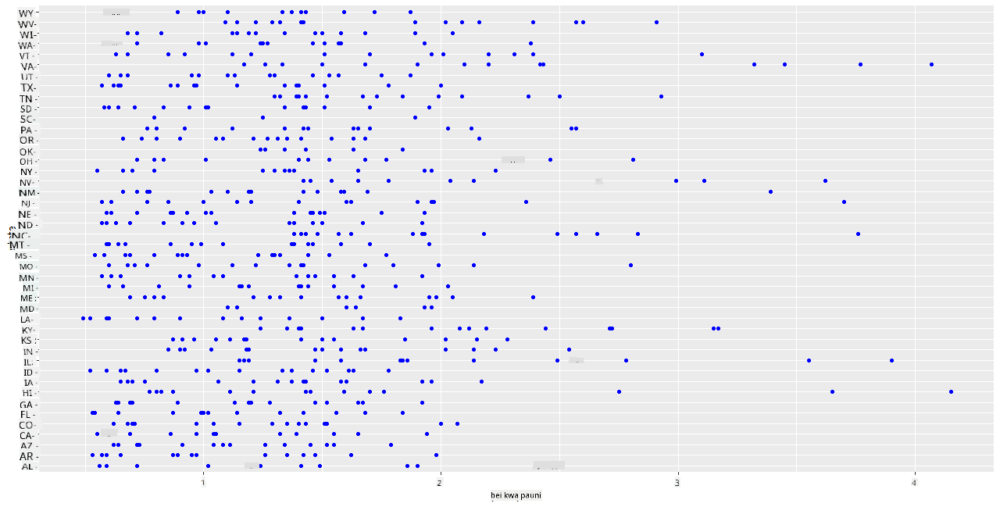
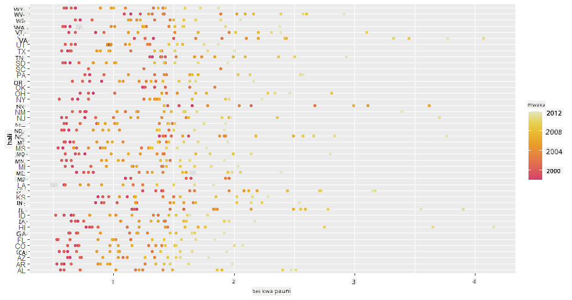
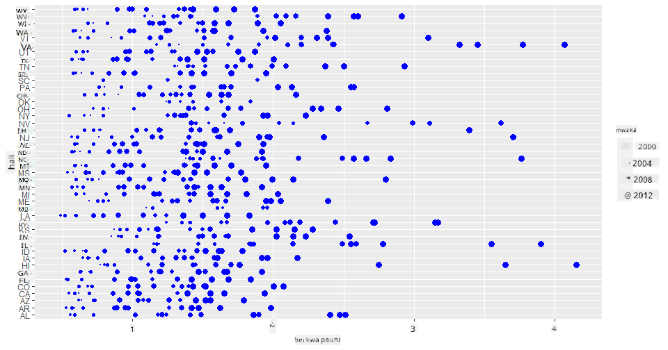
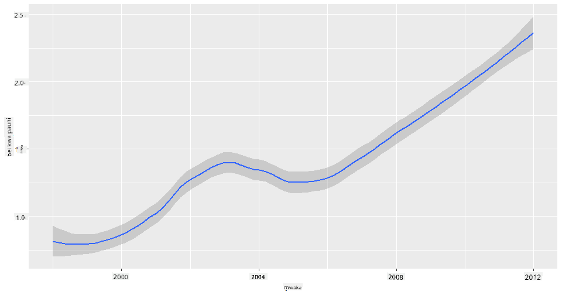
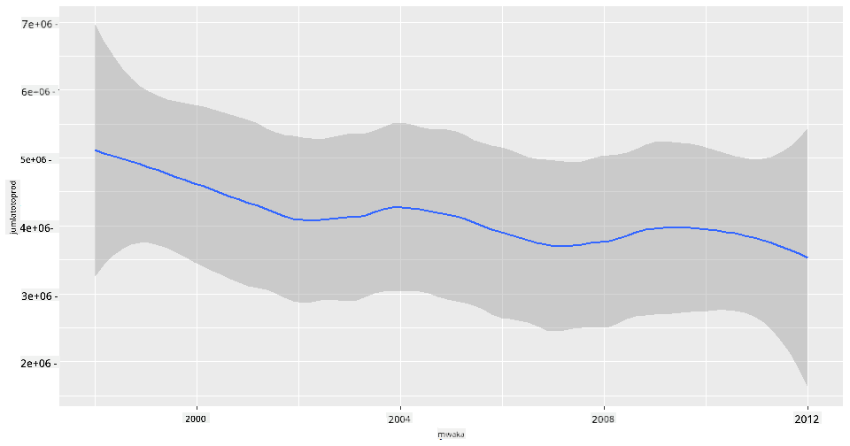
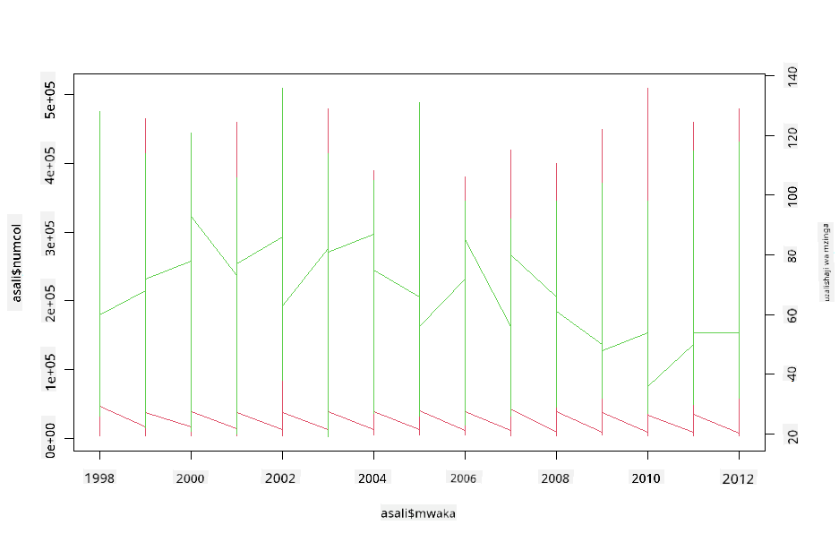

<!--
CO_OP_TRANSLATOR_METADATA:
{
  "original_hash": "a33c5d4b4156a2b41788d8720b6f724c",
  "translation_date": "2025-08-26T17:02:43+00:00",
  "source_file": "3-Data-Visualization/R/12-visualization-relationships/README.md",
  "language_code": "sw"
}
-->
# Kuonyesha Mahusiano: Yote Kuhusu Asali 🍯

| ](../../../sketchnotes/12-Visualizing-Relationships.png)|
|:---:|
|Kuonyesha Mahusiano - _Sketchnote na [@nitya](https://twitter.com/nitya)_ |

Tukiendelea na mtazamo wa asili katika utafiti wetu, hebu tujifunze mbinu za kuvutia za kuonyesha mahusiano kati ya aina mbalimbali za asali, kulingana na seti ya data iliyotolewa na [Idara ya Kilimo ya Marekani](https://www.nass.usda.gov/About_NASS/index.php).

Seti hii ya data yenye takriban vipengele 600 inaonyesha uzalishaji wa asali katika majimbo mengi ya Marekani. Kwa mfano, unaweza kuchunguza idadi ya makoloni, mavuno kwa kila koloni, uzalishaji wa jumla, akiba, bei kwa pauni, na thamani ya asali iliyozalishwa katika jimbo fulani kuanzia mwaka 1998-2012, na safu moja kwa kila mwaka kwa kila jimbo.

Itakuwa ya kuvutia kuonyesha mahusiano kati ya uzalishaji wa jimbo fulani kwa mwaka na, kwa mfano, bei ya asali katika jimbo hilo. Vinginevyo, unaweza kuonyesha mahusiano kati ya mavuno ya asali kwa kila koloni katika majimbo mbalimbali. Kipindi hiki cha miaka kinajumuisha tukio la kusikitisha la 'CCD' au 'Colony Collapse Disorder' lililoonekana kwa mara ya kwanza mwaka 2006 (http://npic.orst.edu/envir/ccd.html), kwa hivyo ni seti ya data yenye umuhimu wa kusoma. 🐝

## [Jaribio la kabla ya somo](https://purple-hill-04aebfb03.1.azurestaticapps.net/quiz/22)

Katika somo hili, unaweza kutumia ggplot2, ambayo umewahi kuitumia, kama maktaba nzuri ya kuonyesha mahusiano kati ya vigezo. Kinachovutia zaidi ni matumizi ya `geom_point` na `qplot` ya ggplot2 ambayo inaruhusu michoro ya alama na mistari kuonyesha haraka '[mahusiano ya takwimu](https://ggplot2.tidyverse.org/)', ambayo humsaidia mtaalamu wa data kuelewa vyema jinsi vigezo vinavyohusiana.

## Michoro ya Alama

Tumia mchoro wa alama kuonyesha jinsi bei ya asali imebadilika, mwaka hadi mwaka, kwa kila jimbo. ggplot2, kwa kutumia `ggplot` na `geom_point`, inagawanya data ya majimbo kwa urahisi na kuonyesha alama za data kwa data ya kategoria na ya nambari.

Hebu tuanze kwa kuingiza data na Seaborn:

```r
honey=read.csv('../../data/honey.csv')
head(honey)
```
Unagundua kuwa data ya asali ina safu kadhaa za kuvutia, ikiwemo mwaka na bei kwa pauni. Hebu tuchunguze data hii, iliyogawanywa kwa majimbo ya Marekani:

| state | numcol | yieldpercol | totalprod | stocks   | priceperlb | prodvalue | year |
| ----- | ------ | ----------- | --------- | -------- | ---------- | --------- | ---- |
| AL    | 16000  | 71          | 1136000   | 159000   | 0.72       | 818000    | 1998 |
| AZ    | 55000  | 60          | 3300000   | 1485000  | 0.64       | 2112000   | 1998 |
| AR    | 53000  | 65          | 3445000   | 1688000  | 0.59       | 2033000   | 1998 |
| CA    | 450000 | 83          | 37350000  | 12326000 | 0.62       | 23157000  | 1998 |
| CO    | 27000  | 72          | 1944000   | 1594000  | 0.7        | 1361000   | 1998 |
| FL    | 230000 | 98          |22540000   | 4508000  | 0.64       | 14426000  | 1998 |

Unda mchoro wa msingi wa alama kuonyesha mahusiano kati ya bei kwa pauni ya asali na jimbo la asili. Fanya mhimili wa `y` uwe mrefu vya kutosha kuonyesha majimbo yote:

```r
library(ggplot2)
ggplot(honey, aes(x = priceperlb, y = state)) +
  geom_point(colour = "blue")
```


Sasa, onyesha data hiyo hiyo kwa mpangilio wa rangi ya asali ili kuonyesha jinsi bei inavyobadilika mwaka hadi mwaka. Unaweza kufanya hivi kwa kuongeza kipengele cha 'scale_color_gradientn' kuonyesha mabadiliko, mwaka hadi mwaka:

> ✅ Jifunze zaidi kuhusu [scale_color_gradientn](https://www.rdocumentation.org/packages/ggplot2/versions/0.9.1/topics/scale_colour_gradientn) - jaribu mpangilio mzuri wa rangi za upinde wa mvua!

```r
ggplot(honey, aes(x = priceperlb, y = state, color=year)) +
  geom_point()+scale_color_gradientn(colours = colorspace::heat_hcl(7))
```


Kwa mabadiliko haya ya mpangilio wa rangi, unaweza kuona wazi kuwa kuna mwelekeo wa kuongezeka kwa bei ya asali kwa pauni mwaka hadi mwaka. Kwa kweli, ukichunguza seti ya sampuli katika data ili kuthibitisha (chagua jimbo fulani, Arizona kwa mfano) unaweza kuona mwelekeo wa ongezeko la bei mwaka hadi mwaka, isipokuwa kwa baadhi ya miaka:

| state | numcol | yieldpercol | totalprod | stocks  | priceperlb | prodvalue | year |
| ----- | ------ | ----------- | --------- | ------- | ---------- | --------- | ---- |
| AZ    | 55000  | 60          | 3300000   | 1485000 | 0.64       | 2112000   | 1998 |
| AZ    | 52000  | 62          | 3224000   | 1548000 | 0.62       | 1999000   | 1999 |
| AZ    | 40000  | 59          | 2360000   | 1322000 | 0.73       | 1723000   | 2000 |
| AZ    | 43000  | 59          | 2537000   | 1142000 | 0.72       | 1827000   | 2001 |
| AZ    | 38000  | 63          | 2394000   | 1197000 | 1.08       | 2586000   | 2002 |
| AZ    | 35000  | 72          | 2520000   | 983000  | 1.34       | 3377000   | 2003 |
| AZ    | 32000  | 55          | 1760000   | 774000  | 1.11       | 1954000   | 2004 |
| AZ    | 36000  | 50          | 1800000   | 720000  | 1.04       | 1872000   | 2005 |
| AZ    | 30000  | 65          | 1950000   | 839000  | 0.91       | 1775000   | 2006 |
| AZ    | 30000  | 64          | 1920000   | 902000  | 1.26       | 2419000   | 2007 |
| AZ    | 25000  | 64          | 1600000   | 336000  | 1.26       | 2016000   | 2008 |
| AZ    | 20000  | 52          | 1040000   | 562000  | 1.45       | 1508000   | 2009 |
| AZ    | 24000  | 77          | 1848000   | 665000  | 1.52       | 2809000   | 2010 |
| AZ    | 23000  | 53          | 1219000   | 427000  | 1.55       | 1889000   | 2011 |
| AZ    | 22000  | 46          | 1012000   | 253000  | 1.79       | 1811000   | 2012 |

Njia nyingine ya kuonyesha mwelekeo huu ni kutumia ukubwa badala ya rangi. Kwa watumiaji wenye matatizo ya kuona rangi, hii inaweza kuwa chaguo bora. Hariri mchoro wako kuonyesha ongezeko la bei kwa ongezeko la mduara wa alama:

```r
ggplot(honey, aes(x = priceperlb, y = state)) +
  geom_point(aes(size = year),colour = "blue") +
  scale_size_continuous(range = c(0.25, 3))
```
Unaweza kuona ukubwa wa alama ukiongezeka polepole.



Je, hili ni suala rahisi la mahitaji na usambazaji? Kutokana na sababu kama mabadiliko ya hali ya hewa na kuporomoka kwa makoloni, je, kuna asali kidogo inayopatikana kwa ununuzi mwaka hadi mwaka, na hivyo bei kuongezeka?

Ili kugundua uhusiano kati ya baadhi ya vigezo katika seti hii ya data, hebu tuchunguze baadhi ya michoro ya mistari.

## Michoro ya Mistari

Swali: Je, kuna ongezeko dhahiri la bei ya asali kwa pauni mwaka hadi mwaka? Unaweza kugundua hili kwa urahisi kwa kuunda mchoro mmoja wa mstari:

```r
qplot(honey$year,honey$priceperlb, geom='smooth', span =0.5, xlab = "year",ylab = "priceperlb")
```
Jibu: Ndiyo, isipokuwa kwa baadhi ya miaka kama 2003:



Swali: Vema, mwaka 2003 tunaweza pia kuona ongezeko la usambazaji wa asali? Je, ukichunguza uzalishaji wa jumla mwaka hadi mwaka?

```python
qplot(honey$year,honey$totalprod, geom='smooth', span =0.5, xlab = "year",ylab = "totalprod")
```



Jibu: Sio kweli. Ukichunguza uzalishaji wa jumla, inaonekana kuwa uliongezeka katika mwaka huo, ingawa kwa ujumla uzalishaji wa asali unaonekana kupungua katika miaka hiyo.

Swali: Katika hali hiyo, ni nini kingeweza kusababisha ongezeko la bei ya asali karibu na mwaka 2003?

Ili kugundua hili, unaweza kuchunguza gridi ya vipengele.

## Gridi ya Vipengele

Gridi ya vipengele huchukua kipengele kimoja cha seti yako ya data (katika hali yetu, unaweza kuchagua 'mwaka' ili kuepuka kuwa na vipengele vingi sana). Seaborn inaweza kisha kutengeneza mchoro kwa kila kipengele cha x na y ulichokichagua kwa kulinganisha kwa urahisi. Je, mwaka 2003 unajitokeza katika aina hii ya kulinganisha?

Unda gridi ya vipengele kwa kutumia `facet_wrap` kama inavyopendekezwa na [nyaraka za ggplot2](https://ggplot2.tidyverse.org/reference/facet_wrap.html).

```r
ggplot(honey, aes(x=yieldpercol, y = numcol,group = 1)) + 
  geom_line() + facet_wrap(vars(year))
```
Katika mchoro huu, unaweza kulinganisha mavuno kwa koloni na idadi ya makoloni mwaka hadi mwaka, sambamba na mpangilio wa safu 3:


Kwa seti hii ya data, hakuna kitu kinachojitokeza hasa kuhusu idadi ya makoloni na mavuno yao, mwaka hadi mwaka na jimbo hadi jimbo. Je, kuna njia tofauti ya kutafuta uhusiano kati ya vigezo hivi viwili?

## Michoro ya Mistari Miwili

Jaribu mchoro wa mistari miwili kwa kuweka mistari miwili juu ya kila mmoja, kwa kutumia `par` na `plot` ya R. Tutakuwa tunachora mwaka kwenye mhimili wa x na kuonyesha mihimili miwili ya y. Kwa hivyo, onyesha mavuno kwa koloni na idadi ya makoloni, juu ya kila mmoja:

```r
par(mar = c(5, 4, 4, 4) + 0.3)              
plot(honey$year, honey$numcol, pch = 16, col = 2,type="l")              
par(new = TRUE)                             
plot(honey$year, honey$yieldpercol, pch = 17, col = 3,              
     axes = FALSE, xlab = "", ylab = "",type="l")
axis(side = 4, at = pretty(range(y2)))      
mtext("colony yield", side = 4, line = 3)   
```


Ingawa hakuna kitu kinachojitokeza karibu na mwaka 2003, inaturuhusu kumaliza somo hili kwa maelezo ya furaha kidogo: ingawa kuna kupungua kwa idadi ya makoloni kwa ujumla, idadi ya makoloni inaimarika hata kama mavuno yao kwa koloni yanapungua.

Endeleeni nyuki, endeleeni!

🐝❤️
## 🚀 Changamoto

Katika somo hili, umejifunza kidogo zaidi kuhusu matumizi mengine ya michoro ya alama na gridi za mistari, ikiwemo gridi za vipengele. Jipatie changamoto ya kuunda gridi ya vipengele kwa kutumia seti tofauti ya data, labda moja uliyotumia kabla ya masomo haya. Angalia muda unaochukua kuunda na jinsi unavyohitaji kuwa makini kuhusu idadi ya gridi unazohitaji kuchora kwa kutumia mbinu hizi.
## [Jaribio la baada ya somo](https://purple-hill-04aebfb03.1.azurestaticapps.net/quiz/23)

## Mapitio na Kujisomea

Michoro ya mistari inaweza kuwa rahisi au ngumu sana. Soma kidogo katika [nyaraka za ggplot2](https://ggplot2.tidyverse.org/reference/geom_path.html#:~:text=geom_line()%20connects%20them%20in,which%20cases%20are%20connected%20together) kuhusu njia mbalimbali unazoweza kutumia kuzijenga. Jaribu kuboresha michoro ya mistari uliyotengeneza katika somo hili kwa kutumia mbinu nyingine zilizoorodheshwa katika nyaraka.
## Kazi

[Chunguza mzinga wa nyuki](assignment.md)

---

**Kanusho**:  
Hati hii imetafsiriwa kwa kutumia huduma ya kutafsiri ya AI [Co-op Translator](https://github.com/Azure/co-op-translator). Ingawa tunajitahidi kuhakikisha usahihi, tafadhali fahamu kuwa tafsiri za kiotomatiki zinaweza kuwa na makosa au kutokuwa sahihi. Hati ya asili katika lugha yake ya awali inapaswa kuzingatiwa kama chanzo cha mamlaka. Kwa taarifa muhimu, tafsiri ya kitaalamu ya binadamu inapendekezwa. Hatutawajibika kwa kutoelewana au tafsiri zisizo sahihi zinazotokana na matumizi ya tafsiri hii.