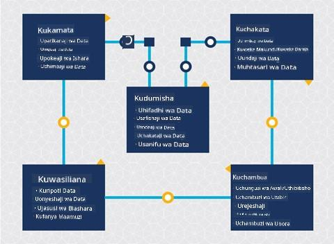
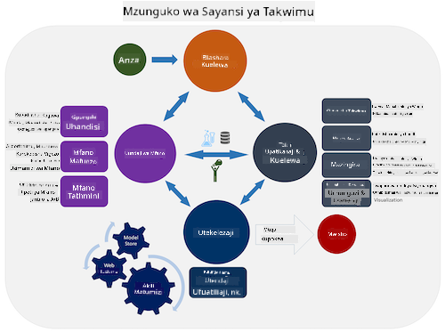
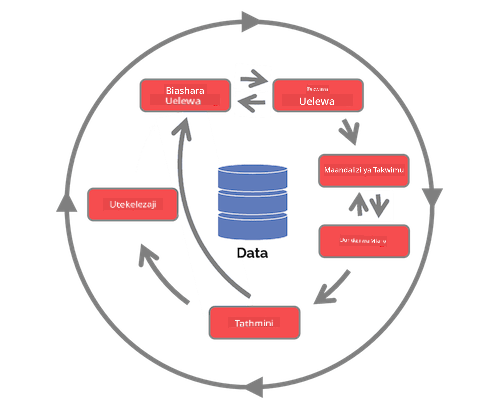

<!--
CO_OP_TRANSLATOR_METADATA:
{
  "original_hash": "c368f8f2506fe56bca0f7be05c4eb71d",
  "translation_date": "2025-08-26T16:21:56+00:00",
  "source_file": "4-Data-Science-Lifecycle/14-Introduction/README.md",
  "language_code": "sw"
}
-->
# Utangulizi wa Mzunguko wa Sayansi ya Takwimu

| ](../../sketchnotes/14-DataScience-Lifecycle.png)|
|:---:|
| Utangulizi wa Mzunguko wa Sayansi ya Takwimu - _Sketchnote na [@nitya](https://twitter.com/nitya)_ |

## [Maswali ya Awali ya Somo](https://red-water-0103e7a0f.azurestaticapps.net/quiz/26)

Kwa sasa, huenda umeshagundua kuwa sayansi ya takwimu ni mchakato. Mchakato huu unaweza kugawanywa katika hatua 5:

- Kukusanya
- Kuchakata
- Kuchambua
- Kuwasilisha
- Kudumisha

Somo hili linazingatia sehemu 3 za mzunguko: kukusanya, kuchakata, na kudumisha.

  
> Picha na [Berkeley School of Information](https://ischoolonline.berkeley.edu/data-science/what-is-data-science/)

## Kukusanya

Hatua ya kwanza ya mzunguko ni muhimu sana kwani hatua zinazofuata zinategemea hii. Kimsingi, ni hatua mbili zilizojumuishwa kuwa moja: kupata data na kufafanua madhumuni na matatizo yanayohitaji kushughulikiwa.  
Kufafanua malengo ya mradi kutahitaji muktadha wa kina kuhusu tatizo au swali. Kwanza, tunahitaji kutambua na kupata wale wanaohitaji tatizo lao kutatuliwa. Hawa wanaweza kuwa wadau wa biashara au wadhamini wa mradi, ambao wanaweza kusaidia kutambua nani au nini kitafaidika na mradi huu pamoja na kile wanachohitaji na kwa nini wanakihitaji. Lengo lililofafanuliwa vizuri linapaswa kuwa la kupimika na la kuhesabika ili kufafanua matokeo yanayokubalika.

Maswali ambayo mtaalamu wa takwimu anaweza kuuliza:
- Je, tatizo hili limewahi kushughulikiwa hapo awali? Nini kiligunduliwa?
- Je, madhumuni na lengo vinaeleweka na wote wanaohusika?
- Je, kuna ukungu wowote na jinsi ya kuupunguza?
- Vikwazo ni vipi?
- Matokeo ya mwisho yanaweza kuonekana vipi?
- Kuna rasilimali kiasi gani (muda, watu, kompyuta) zinazopatikana?

Hatua inayofuata ni kutambua, kukusanya, na hatimaye kuchunguza data inayohitajika kufanikisha malengo haya yaliyofafanuliwa. Katika hatua hii ya upatikanaji, wataalamu wa takwimu wanapaswa pia kutathmini wingi na ubora wa data. Hii inahitaji uchunguzi wa data ili kuthibitisha kuwa kile kilichopatikana kitasaidia kufikia matokeo yanayotarajiwa.

Maswali ambayo mtaalamu wa takwimu anaweza kuuliza kuhusu data:
- Ni data gani tayari ninayo?
- Nani anamiliki data hii?
- Kuna wasiwasi gani kuhusu faragha?
- Je, nina data ya kutosha kutatua tatizo hili?
- Je, data ina ubora unaokubalika kwa tatizo hili?
- Ikiwa nitagundua taarifa za ziada kupitia data hii, je, tunapaswa kuzingatia kubadilisha au kufafanua upya malengo?

## Kuchakata

Hatua ya kuchakata katika mzunguko inazingatia kugundua mifumo katika data pamoja na uundaji wa mifano. Baadhi ya mbinu zinazotumika katika hatua ya kuchakata zinahitaji mbinu za takwimu ili kufichua mifumo. Kwa kawaida, hili lingekuwa kazi ngumu kwa binadamu kufanya na seti kubwa ya data, na hivyo kutegemea kompyuta kufanya kazi nzito ili kuharakisha mchakato. Hatua hii pia ni mahali ambapo sayansi ya takwimu na ujifunzaji wa mashine zinakutana. Kama ulivyojifunza katika somo la kwanza, ujifunzaji wa mashine ni mchakato wa kujenga mifano ili kuelewa data. Mifano ni uwakilishi wa uhusiano kati ya vigezo katika data vinavyosaidia kutabiri matokeo.

Mbinu za kawaida zinazotumika katika hatua hii zimefunikwa katika mtaala wa ML kwa Kompyuta. Fuata viungo ili kujifunza zaidi kuhusu mbinu hizi:

- [Uainishaji](https://github.com/microsoft/ML-For-Beginners/tree/main/4-Classification): Kuandaa data katika makundi kwa matumizi bora zaidi.
- [Kuweka Vikundi](https://github.com/microsoft/ML-For-Beginners/tree/main/5-Clustering): Kuunda vikundi vya data vinavyofanana.
- [Urejeshi](https://github.com/microsoft/ML-For-Beginners/tree/main/2-Regression): Kuamua uhusiano kati ya vigezo ili kutabiri au kutabiri thamani.

## Kudumisha

Katika mchoro wa mzunguko, unaweza kuwa umeona kuwa kudumisha kunakaa kati ya kukusanya na kuchakata. Kudumisha ni mchakato unaoendelea wa kusimamia, kuhifadhi, na kulinda data katika mchakato mzima wa mradi na inapaswa kuzingatiwa katika kipindi chote cha mradi.

### Kuhifadhi Data

Masuala ya jinsi na wapi data inahifadhiwa yanaweza kuathiri gharama ya uhifadhi wake pamoja na utendaji wa jinsi data inavyoweza kufikiwa haraka. Maamuzi kama haya hayafanywi na mtaalamu wa takwimu pekee, lakini wanaweza kujikuta wakifanya chaguo kuhusu jinsi ya kufanya kazi na data kulingana na jinsi inavyohifadhiwa.

Hapa kuna vipengele vya mifumo ya kisasa ya uhifadhi wa data vinavyoweza kuathiri chaguo hizi:

**Kwenye eneo la kazi vs nje ya eneo la kazi vs wingu la umma au la kibinafsi**

Kwenye eneo la kazi inahusu kuhifadhi na kusimamia data kwenye vifaa vyako mwenyewe, kama vile kumiliki seva yenye diski ngumu zinazohifadhi data, wakati nje ya eneo la kazi inategemea vifaa ambavyo huvimiliki, kama vile kituo cha data. Wingu la umma ni chaguo maarufu kwa kuhifadhi data linalohitaji maarifa kidogo kuhusu jinsi au wapi data inahifadhiwa hasa, ambapo umma inahusu miundombinu ya msingi iliyounganishwa inayoshirikiwa na wote wanaotumia wingu. Baadhi ya mashirika yana sera kali za usalama zinazohitaji kuwa na ufikiaji kamili wa vifaa ambapo data inahifadhiwa na hivyo kutegemea wingu la kibinafsi linalotoa huduma zake za wingu. Utajifunza zaidi kuhusu data katika wingu katika [masomo ya baadaye](https://github.com/microsoft/Data-Science-For-Beginners/tree/main/5-Data-Science-In-Cloud).

**Data baridi vs data moto**

Unapofundisha mifano yako, unaweza kuhitaji data zaidi ya mafunzo. Ikiwa unaridhika na mfano wako, data zaidi itafika ili mfano utimize kusudi lake. Kwa hali yoyote, gharama ya kuhifadhi na kufikia data itaongezeka unavyokusanya zaidi. Kutenganisha data inayotumika mara chache, inayojulikana kama data baridi, kutoka kwa data inayofikiwa mara kwa mara, inayojulikana kama data moto, inaweza kuwa chaguo la bei nafuu la uhifadhi wa data kupitia vifaa au huduma za programu. Ikiwa data baridi inahitaji kufikiwa, inaweza kuchukua muda kidogo zaidi kuipata ikilinganishwa na data moto.

### Kusimamia Data

Unapofanya kazi na data, unaweza kugundua kuwa baadhi ya data inahitaji kusafishwa kwa kutumia baadhi ya mbinu zilizofunikwa katika somo linalozingatia [maandalizi ya data](https://github.com/microsoft/Data-Science-For-Beginners/tree/main/2-Working-With-Data/08-data-preparation) ili kujenga mifano sahihi. Data mpya inapofika, itahitaji matumizi sawa ili kudumisha uthabiti wa ubora. Baadhi ya miradi itahusisha matumizi ya zana ya kiotomatiki kwa kusafisha, kujumlisha, na kubana kabla ya data kuhamishwa hadi eneo lake la mwisho. Azure Data Factory ni mfano wa moja ya zana hizi.

### Kulinda Data

Moja ya malengo makuu ya kulinda data ni kuhakikisha kuwa wale wanaofanya kazi nayo wanadhibiti kile kinachokusanywa na katika muktadha gani kinatumika. Kuweka data salama kunahusisha kupunguza ufikiaji kwa wale tu wanaohitaji, kufuata sheria na kanuni za ndani, pamoja na kudumisha viwango vya maadili, kama ilivyofunikwa katika [somo la maadili](https://github.com/microsoft/Data-Science-For-Beginners/tree/main/1-Introduction/02-ethics).

Hapa kuna mambo ambayo timu inaweza kufanya kwa kuzingatia usalama:
- Kuhakikisha kuwa data yote imefichwa
- Kuwapa wateja taarifa kuhusu jinsi data yao inavyotumika
- Kuondoa ufikiaji wa data kwa wale walioacha mradi
- Kuruhusu wanachama fulani tu wa mradi kubadilisha data

## 🚀 Changamoto

Kuna matoleo mengi ya Mzunguko wa Sayansi ya Takwimu, ambapo kila hatua inaweza kuwa na majina tofauti na idadi ya hatua lakini itakuwa na michakato sawa iliyotajwa ndani ya somo hili.

Chunguza [Mzunguko wa Mchakato wa Timu ya Sayansi ya Takwimu](https://docs.microsoft.com/en-us/azure/architecture/data-science-process/lifecycle) na [Mchakato wa Kawaida wa Viwanda kwa Uchimbaji wa Takwimu](https://www.datascience-pm.com/crisp-dm-2/). Taja mambo 3 yanayofanana na tofauti kati ya miwili.

|Mchakato wa Timu ya Sayansi ya Takwimu (TDSP)|Mchakato wa Kawaida wa Viwanda kwa Uchimbaji wa Takwimu (CRISP-DM)|
|--|--|
| |  |
| Picha na [Microsoft](https://docs.microsoft.comazure/architecture/data-science-process/lifecycle) | Picha na [Muungano wa Mchakato wa Sayansi ya Takwimu](https://www.datascience-pm.com/crisp-dm-2/) |

## [Maswali ya Baada ya Somo](https://red-water-0103e7a0f.azurestaticapps.net/quiz/27)

## Mapitio na Kujisomea

Kutumia Mzunguko wa Sayansi ya Takwimu kunahusisha majukumu na kazi nyingi, ambapo baadhi zinaweza kuzingatia sehemu fulani za kila hatua. Mchakato wa Timu ya Sayansi ya Takwimu hutoa rasilimali chache zinazofafanua aina za majukumu na kazi ambazo mtu anaweza kuwa nazo katika mradi.

* [Majukumu na kazi za Mchakato wa Timu ya Sayansi ya Takwimu](https://docs.microsoft.com/en-us/azure/architecture/data-science-process/roles-tasks)  
* [Tekeleza kazi za sayansi ya takwimu: uchunguzi, uundaji, na utekelezaji](https://docs.microsoft.com/en-us/azure/architecture/data-science-process/execute-data-science-tasks)

## Kazi

[Kutathmini Seti ya Data](assignment.md)

---

**Kanusho**:  
Hati hii imetafsiriwa kwa kutumia huduma ya kutafsiri ya AI [Co-op Translator](https://github.com/Azure/co-op-translator). Ingawa tunajitahidi kuhakikisha usahihi, tafadhali fahamu kuwa tafsiri za kiotomatiki zinaweza kuwa na makosa au kutokuwa sahihi. Hati ya asili katika lugha yake ya awali inapaswa kuzingatiwa kama chanzo cha mamlaka. Kwa taarifa muhimu, tafsiri ya kitaalamu ya binadamu inapendekezwa. Hatutawajibika kwa kutoelewana au tafsiri zisizo sahihi zinazotokana na matumizi ya tafsiri hii.