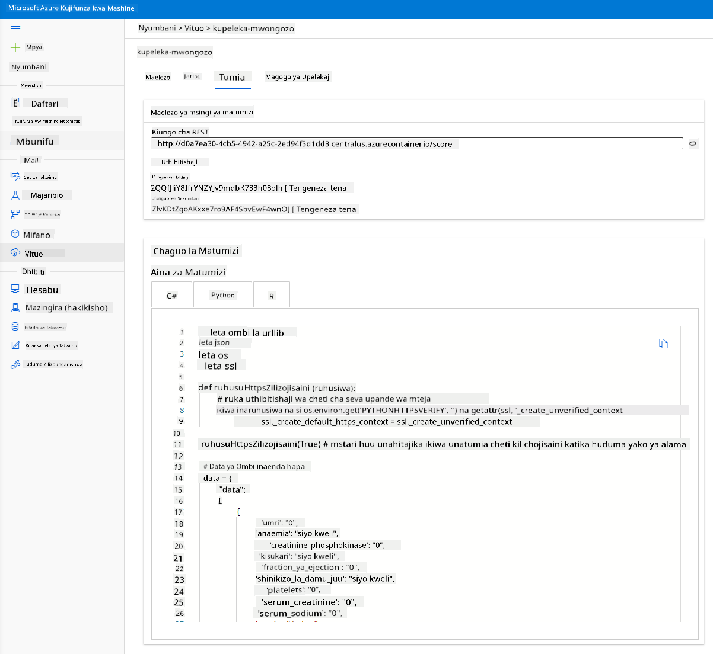

<!--
CO_OP_TRANSLATOR_METADATA:
{
  "original_hash": "14b2a7f1c63202920bd98eeb913f5614",
  "translation_date": "2025-08-26T15:53:44+00:00",
  "source_file": "5-Data-Science-In-Cloud/18-Low-Code/README.md",
  "language_code": "sw"
}
-->
# Sayansi ya Takwimu katika Wingu: Njia ya "Low code/No code"

| ](../../sketchnotes/18-DataScience-Cloud.png)|
|:---:|
| Sayansi ya Takwimu Katika Wingu: Low Code - _Sketchnote na [@nitya](https://twitter.com/nitya)_ |

Jedwali la maudhui:

- [Sayansi ya Takwimu katika Wingu: Njia ya "Low code/No code"](../../../../5-Data-Science-In-Cloud/18-Low-Code)
  - [Maswali ya awali ya somo](../../../../5-Data-Science-In-Cloud/18-Low-Code)
  - [1. Utangulizi](../../../../5-Data-Science-In-Cloud/18-Low-Code)
    - [1.1 Azure Machine Learning ni nini?](../../../../5-Data-Science-In-Cloud/18-Low-Code)
    - [1.2 Mradi wa Utabiri wa Mshindo wa Moyo:](../../../../5-Data-Science-In-Cloud/18-Low-Code)
    - [1.3 Seti ya Takwimu ya Mshindo wa Moyo:](../../../../5-Data-Science-In-Cloud/18-Low-Code)
  - [2. Mafunzo ya modeli kwa njia ya Low code/No code katika Azure ML Studio](../../../../5-Data-Science-In-Cloud/18-Low-Code)
    - [2.1 Unda workspace ya Azure ML](../../../../5-Data-Science-In-Cloud/18-Low-Code)
    - [2.2 Rasilimali za Kompyuta](../../../../5-Data-Science-In-Cloud/18-Low-Code)
      - [2.2.1 Kuchagua chaguo sahihi kwa rasilimali zako za kompyuta](../../../../5-Data-Science-In-Cloud/18-Low-Code)
      - [2.2.2 Kuunda klasta ya kompyuta](../../../../5-Data-Science-In-Cloud/18-Low-Code)
    - [2.3 Kupakia Seti ya Takwimu](../../../../5-Data-Science-In-Cloud/18-Low-Code)
    - [2.4 Mafunzo ya Low code/No code kwa AutoML](../../../../5-Data-Science-In-Cloud/18-Low-Code)
  - [3. Utekelezaji wa modeli kwa njia ya Low code/No code na matumizi ya endpoint](../../../../5-Data-Science-In-Cloud/18-Low-Code)
    - [3.1 Utekelezaji wa modeli](../../../../5-Data-Science-In-Cloud/18-Low-Code)
    - [3.2 Matumizi ya endpoint](../../../../5-Data-Science-In-Cloud/18-Low-Code)
  - [🚀 Changamoto](../../../../5-Data-Science-In-Cloud/18-Low-Code)
  - [Maswali ya baada ya somo](../../../../5-Data-Science-In-Cloud/18-Low-Code)
  - [Mapitio na Kujisomea](../../../../5-Data-Science-In-Cloud/18-Low-Code)
  - [Kazi ya Nyumbani](../../../../5-Data-Science-In-Cloud/18-Low-Code)

## [Maswali ya awali ya somo](https://purple-hill-04aebfb03.1.azurestaticapps.net/quiz/34)

## 1. Utangulizi

### 1.1 Azure Machine Learning ni nini?

Jukwaa la wingu la Azure lina zaidi ya bidhaa 200 na huduma za wingu zilizoundwa kusaidia kuleta suluhisho mpya maishani. Wanasayansi wa takwimu hutumia juhudi nyingi kuchunguza na kuchakata data, na kujaribu aina mbalimbali za algorithimu za mafunzo ya modeli ili kuzalisha modeli sahihi. Kazi hizi huchukua muda mwingi na mara nyingi hutumia vibaya vifaa vya gharama kubwa vya kompyuta.

[Azure ML](https://docs.microsoft.com/azure/machine-learning/overview-what-is-azure-machine-learning?WT.mc_id=academic-77958-bethanycheum&ocid=AID3041109) ni jukwaa linalotegemea wingu kwa ajili ya kujenga na kuendesha suluhisho za kujifunza kwa mashine katika Azure. Inajumuisha vipengele na uwezo mbalimbali vinavyosaidia wanasayansi wa takwimu kuandaa data, kufundisha modeli, kuchapisha huduma za utabiri, na kufuatilia matumizi yao. Muhimu zaidi, inawasaidia kuongeza ufanisi wao kwa kugeuza kiotomatiki kazi nyingi zinazochukua muda zinazohusiana na mafunzo ya modeli; na inawawezesha kutumia rasilimali za kompyuta zinazotegemea wingu ambazo hupimika kwa ufanisi, kushughulikia kiasi kikubwa cha data huku wakipata gharama tu wanapozitumia.

Azure ML hutoa zana zote ambazo watengenezaji na wanasayansi wa takwimu wanahitaji kwa kazi zao za kujifunza kwa mashine. Hizi ni pamoja na:

- **Azure Machine Learning Studio**: ni lango la wavuti katika Azure Machine Learning kwa chaguo za low-code na no-code kwa mafunzo ya modeli, utekelezaji, otomatiki, ufuatiliaji, na usimamizi wa mali. Studio inaunganishwa na Azure Machine Learning SDK kwa uzoefu usio na mshono.
- **Jupyter Notebooks**: kuunda na kujaribu modeli za ML haraka.
- **Azure Machine Learning Designer**: inaruhusu kuburuta na kudondosha moduli ili kujenga majaribio na kisha kupeleka mabomba katika mazingira ya low-code.
- **Automated machine learning UI (AutoML)**: inageuza kiotomatiki kazi za kurudia za maendeleo ya modeli za kujifunza kwa mashine, ikiruhusu kujenga modeli za ML kwa kiwango kikubwa, ufanisi, na tija, huku ikidumisha ubora wa modeli.
- **Data Labelling**: zana ya ML inayosaidia kuweka lebo data kiotomatiki.
- **Kiongezi cha kujifunza kwa mashine kwa Visual Studio Code**: hutoa mazingira kamili ya maendeleo kwa ajili ya kujenga na kusimamia miradi ya ML.
- **CLI ya kujifunza kwa mashine**: hutoa amri za kusimamia rasilimali za Azure ML kutoka kwa mstari wa amri.
- **Ujumuishaji na mifumo ya chanzo huria** kama PyTorch, TensorFlow, Scikit-learn na mingine mingi kwa mafunzo, utekelezaji, na usimamizi wa mchakato wa mwisho hadi mwisho wa kujifunza kwa mashine.
- **MLflow**: ni maktaba ya chanzo huria kwa kusimamia mzunguko wa maisha wa majaribio yako ya kujifunza kwa mashine. **MLFlow Tracking** ni sehemu ya MLflow inayorekodi na kufuatilia vipimo vya mafunzo yako na vielelezo vya modeli, bila kujali mazingira ya jaribio lako.

### 1.2 Mradi wa Utabiri wa Mshindo wa Moyo:

Hakuna shaka kwamba kutengeneza na kujenga miradi ni njia bora ya kujaribu ujuzi na maarifa yako. Katika somo hili, tutaangalia njia mbili tofauti za kujenga mradi wa sayansi ya takwimu kwa utabiri wa mshindo wa moyo katika Azure ML Studio, kupitia Low code/No code na kupitia Azure ML SDK kama inavyoonyeshwa kwenye mpangilio ufuatao:


Kila njia ina faida na hasara zake. Njia ya Low code/No code ni rahisi kuanza nayo kwani inahusisha kuingiliana na GUI (Kiolesura cha Mtumiaji wa Kijigrafia), bila ujuzi wa awali wa msimbo. Njia hii inaruhusu majaribio ya haraka ya uwezekano wa mradi na kuunda POC (Uthibitisho wa Dhana). Hata hivyo, mradi unapoendelea na mambo yanapohitaji kuwa tayari kwa uzalishaji, si rahisi kuunda rasilimali kupitia GUI. Tunahitaji kugeuza kiotomatiki kila kitu kwa njia ya programu, kuanzia uundaji wa rasilimali hadi utekelezaji wa modeli. Hapa ndipo maarifa ya jinsi ya kutumia Azure ML SDK yanapokuwa muhimu.

|                   | Low code/No code | Azure ML SDK              |
|-------------------|------------------|---------------------------|
| Ujuzi wa msimbo   | Hauhitajiki      | Unahitajika               |
| Muda wa kuendeleza| Haraka na rahisi | Inategemea ujuzi wa msimbo|
| Tayari kwa uzalishaji | Hapana          | Ndio                      |

### 1.3 Seti ya Takwimu ya Mshindo wa Moyo:

Magonjwa ya moyo na mishipa (CVDs) ni sababu kuu ya vifo duniani kote, yakichangia 31% ya vifo vyote duniani. Sababu za hatari za mazingira na tabia kama vile matumizi ya tumbaku, lishe isiyo na afya na unene, ukosefu wa mazoezi ya mwili, na matumizi mabaya ya pombe zinaweza kutumika kama vipengele vya modeli za makadirio. Uwezo wa kukadiria uwezekano wa maendeleo ya CVD unaweza kuwa wa manufaa makubwa katika kuzuia mshindo kwa watu walio katika hatari kubwa.

Kaggle imefanya [Seti ya Takwimu ya Mshindo wa Moyo](https://www.kaggle.com/andrewmvd/heart-failure-clinical-data) ipatikane kwa umma, ambayo tutatumia kwa mradi huu. Unaweza kupakua seti ya takwimu sasa. Hii ni seti ya takwimu ya tabular yenye safu 13 (vipengele 12 na kipengele 1 cha lengo) na safu 299.

|    | Jina la Kigezo            | Aina             | Maelezo                                                  | Mfano             |
|----|---------------------------|------------------|----------------------------------------------------------|-------------------|
| 1  | age                       | nambari          | Umri wa mgonjwa                                          | 25                |
| 2  | anaemia                   | boolean          | Kupungua kwa seli nyekundu za damu au hemoglobini        | 0 au 1            |
| 3  | creatinine_phosphokinase  | nambari          | Kiwango cha kimeng'enya cha CPK kwenye damu              | 542               |
| 4  | diabetes                  | boolean          | Ikiwa mgonjwa ana kisukari                               | 0 au 1            |
| 5  | ejection_fraction         | nambari          | Asilimia ya damu inayotoka moyoni kwa kila mkazo         | 45                |
| 6  | high_blood_pressure       | boolean          | Ikiwa mgonjwa ana shinikizo la damu                      | 0 au 1            |
| 7  | platelets                 | nambari          | Seli za damu kwenye damu                                 | 149000            |
| 8  | serum_creatinine          | nambari          | Kiwango cha serum creatinine kwenye damu                | 0.5               |
| 9  | serum_sodium              | nambari          | Kiwango cha serum sodium kwenye damu                    | jun               |
| 10 | sex                       | boolean          | Mwanamke au mwanaume                                    | 0 au 1            |
| 11 | smoking                   | boolean          | Ikiwa mgonjwa anavuta sigara                             | 0 au 1            |
| 12 | time                      | nambari          | Kipindi cha ufuatiliaji (siku)                           | 4                 |
|----|---------------------------|------------------|----------------------------------------------------------|-------------------|
| 21 | DEATH_EVENT [Lengo]       | boolean          | Ikiwa mgonjwa hufa wakati wa kipindi cha ufuatiliaji     | 0 au 1            |

Baada ya kuwa na seti ya takwimu, tunaweza kuanza mradi katika Azure.

## 2. Mafunzo ya modeli kwa njia ya Low code/No code katika Azure ML Studio

### 2.1 Unda workspace ya Azure ML

Ili kufundisha modeli katika Azure ML, unahitaji kwanza kuunda workspace ya Azure ML. Workspace ni rasilimali ya kiwango cha juu kwa Azure Machine Learning, inayotoa mahali pa kati pa kufanya kazi na vitu vyote unavyounda unapoitumia. Workspace huhifadhi historia ya mafunzo yote, ikiwa ni pamoja na kumbukumbu, vipimo, matokeo, na picha ya maandishi yako. Unatumia taarifa hii kuamua ni mafunzo gani yanayozalisha modeli bora. [Jifunze zaidi](https://docs.microsoft.com/azure/machine-learning/concept-workspace?WT.mc_id=academic-77958-bethanycheum&ocid=AID3041109)

Inapendekezwa kutumia kivinjari cha kisasa zaidi kinachooana na mfumo wako wa uendeshaji. Vivinjari vifuatavyo vinasaidiwa:

- Microsoft Edge (Microsoft Edge mpya, toleo la hivi karibuni. Sio Microsoft Edge legacy)
- Safari (toleo la hivi karibuni, Mac pekee)
- Chrome (toleo la hivi karibuni)
- Firefox (toleo la hivi karibuni)

Ili kutumia Azure Machine Learning, unda workspace katika usajili wako wa Azure. Unaweza kisha kutumia workspace hii kusimamia data, rasilimali za kompyuta, msimbo, modeli, na vitu vingine vinavyohusiana na kazi zako za kujifunza kwa mashine.

> **_KUMBUKA:_** Usajili wako wa Azure utatozwa kiasi kidogo kwa ajili ya hifadhi ya data mradi workspace ya Azure Machine Learning ipo katika usajili wako, kwa hivyo tunapendekeza kufuta workspace ya Azure Machine Learning unapokuwa hauitumii tena.

1. Ingia kwenye [Azure portal](https://ms.portal.azure.com/) ukitumia maelezo ya Microsoft yanayohusiana na usajili wako wa Azure.
2. Chagua **＋Create a resource**
   
   

   Tafuta Machine Learning na uchague tile ya Machine Learning

   

   Bonyeza kitufe cha kuunda

   

   Jaza mipangilio kama ifuatavyo:
   - Usajili: Usajili wako wa Azure
   - Kikundi cha rasilimali: Unda au chagua kikundi cha rasilimali
   - Jina la workspace: Weka jina la kipekee kwa workspace yako
   - Eneo: Chagua eneo la kijiografia lililo karibu nawe
   - Akaunti ya hifadhi: Kumbuka akaunti mpya ya hifadhi itakayoundwa kwa workspace yako
   - Key vault: Kumbuka key vault mpya itakayoundwa kwa workspace yako
   - Application insights: Kumbuka rasilimali mpya ya application insights itakayoundwa kwa workspace yako
   - Container registry: Hakuna (moja itaundwa kiotomatiki mara ya kwanza unapopeleka modeli kwenye kontena)

    

   - Bonyeza kitufe cha create + review kisha bonyeza kitufe cha kuunda
3. Subiri workspace yako iundwe (hii inaweza kuchukua dakika chache). Kisha nenda kwenye portal. Unaweza kuipata kupitia huduma ya Machine Learning ya Azure.
4. Kwenye ukurasa wa Muhtasari wa workspace yako, zindua Azure Machine Learning studio (au fungua kichupo kipya cha kivinjari na uende kwenye https://ml.azure.com), na uingie kwenye Azure Machine Learning studio ukitumia akaunti yako ya Microsoft. Ukitakiwa, chagua saraka na usajili wako wa Azure, na workspace yako ya Azure Machine Learning.
   


5. Katika Azure Machine Learning studio, badilisha ikoni ya ☰ juu kushoto ili kuona kurasa mbalimbali kwenye kiolesura. Unaweza kutumia kurasa hizi kusimamia rasilimali katika workspace yako.


Unaweza kusimamia workspace yako ukitumia Azure portal, lakini kwa wanasayansi wa takwimu na wahandisi wa uendeshaji wa Machine Learning, Azure Machine Learning Studio hutoa kiolesura cha mtumiaji kilicholenga zaidi kwa usimamizi wa rasilimali za workspace.

### 2.2 Rasilimali za Kompyuta

Rasilimali za Kompyuta ni rasilimali zinazotegemea wingu ambazo unaweza kutumia kuendesha mchakato wa mafunzo ya modeli na uchunguzi wa data. Kuna aina nne za rasilimali za kompyuta unazoweza kuunda:

- **Compute Instances**: Vituo vya kazi vya maendeleo ambavyo wanasayansi wa takwimu wanaweza kutumia kufanya kazi na data na modeli. Hii inahusisha uundaji wa Mashine ya Virtual (VM) na kuzindua mfano wa daftari. Unaweza kisha kufundisha modeli kwa kuita klasta ya kompyuta kutoka kwenye daftari.
- **Compute Clusters**: Klastas zinazoweza kupimika za VM kwa usindikaji wa majaribio ya msimbo kwa mahitaji. Utahitaji klasta unapofundisha modeli. Compute clusters pia zinaweza kutumia rasilimali maalum za GPU au CPU.
- **Inference Clusters**: Malengo ya utekelezaji wa huduma za utabiri zinazotumia modeli zako zilizofundishwa.
- **Attached Compute**: Inaunganisha rasilimali za kompyuta zilizopo za Azure, kama vile Virtual Machines au makundi ya Azure Databricks.

#### 2.2.1 Kuchagua chaguo sahihi kwa rasilimali zako za kompyuta

Baadhi ya mambo muhimu ya kuzingatia wakati wa kuunda rasilimali ya kompyuta yanaweza kuwa maamuzi muhimu ya kufanya.

**Je, unahitaji CPU au GPU?**

CPU (Central Processing Unit) ni mzunguko wa kielektroniki unaotekeleza maagizo yanayojumuisha programu ya kompyuta. GPU (Graphics Processing Unit) ni mzunguko maalum wa kielektroniki unaoweza kutekeleza msimbo unaohusiana na michoro kwa kasi ya juu sana.

Tofauti kuu kati ya usanifu wa CPU na GPU ni kwamba CPU imeundwa kushughulikia kazi mbalimbali haraka (kama inavyopimwa na kasi ya saa ya CPU), lakini ina mipaka katika usawa wa kazi zinazoweza kuendeshwa. GPU zimeundwa kwa ajili ya hesabu sambamba na kwa hivyo ni bora zaidi kwa kazi za kujifunza kwa kina.

| CPU                                     | GPU                         |
|-----------------------------------------|-----------------------------|
| Gharama nafuu                           | Gharama kubwa               |
| Kiwango cha chini cha usawa             | Kiwango cha juu cha usawa   |
| Polepole katika kufundisha mifano ya kujifunza kwa kina | Bora kwa kujifunza kwa kina |

**Ukubwa wa Klasta**

Makundi makubwa ni ghali zaidi lakini yatatoa majibu bora. Kwa hivyo, ikiwa una muda lakini huna pesa za kutosha, unapaswa kuanza na klasta ndogo. Kinyume chake, ikiwa una pesa lakini huna muda mwingi, unapaswa kuanza na klasta kubwa.

**Ukubwa wa VM**

Kulingana na vikwazo vyako vya muda na bajeti, unaweza kubadilisha ukubwa wa RAM, diski, idadi ya cores na kasi ya saa. Kuongeza vigezo vyote hivyo kutakuwa na gharama kubwa zaidi, lakini kutatoa utendaji bora.

**Instances Zilizojitolea au Zenye Kipaumbele cha Chini?**

Instance yenye kipaumbele cha chini inamaanisha kuwa inaweza kusitishwa: kimsingi, Microsoft Azure inaweza kuchukua rasilimali hizo na kuzitumia kwa kazi nyingine, hivyo kusitisha kazi. Instance iliyojitolea, au isiyositishwa, inamaanisha kuwa kazi haitasitishwa bila ruhusa yako. Hili ni jambo lingine la kuzingatia kati ya muda na pesa, kwani instances zinazoweza kusitishwa ni nafuu zaidi kuliko zile zilizojitolea.

#### 2.2.2 Kuunda klasta ya kompyuta

Katika [Azure ML workspace](https://ml.azure.com/) tuliyounda awali, nenda kwenye kompyuta na utaweza kuona rasilimali tofauti za kompyuta tulizojadili (yaani compute instances, compute clusters, inference clusters na attached compute). Kwa mradi huu, tunahitaji klasta ya kompyuta kwa ajili ya mafunzo ya modeli. Katika Studio, bonyeza menyu ya "Compute", kisha kichupo cha "Compute cluster" na bonyeza kitufe cha "+ New" ili kuunda klasta ya kompyuta.


1. Chagua chaguo zako: Dedicated vs Low priority, CPU au GPU, VM size na idadi ya cores (unaweza kuweka mipangilio ya default kwa mradi huu).
2. Bonyeza kitufe cha Next.


3. Pea klasta jina la kompyuta.
4. Chagua chaguo zako: Idadi ya nodes ya chini/juu, sekunde za kutokuwa na kazi kabla ya kupungua, ufikiaji wa SSH. Kumbuka kuwa ikiwa idadi ya chini ya nodes ni 0, utaokoa pesa wakati klasta haifanyi kazi. Kumbuka kuwa idadi ya juu ya nodes, muda wa mafunzo utakuwa mfupi. Idadi ya juu ya nodes inayopendekezwa ni 3.  
5. Bonyeza kitufe cha "Create". Hatua hii inaweza kuchukua dakika chache.


Nzuri sana! Sasa kwa kuwa tuna klasta ya kompyuta, tunahitaji kupakia data kwenye Azure ML Studio.

### 2.3 Kupakia Dataset

1. Katika [Azure ML workspace](https://ml.azure.com/) tuliyounda awali, bonyeza "Datasets" kwenye menyu ya kushoto na bonyeza kitufe cha "+ Create dataset" ili kuunda dataset. Chagua chaguo la "From local files" na uchague dataset ya Kaggle tuliyopakua awali.
   
   

2. Pea dataset yako jina, aina na maelezo. Bonyeza Next. Pakia data kutoka kwa faili. Bonyeza Next.
   
   

3. Katika Schema, badilisha aina ya data kuwa Boolean kwa vipengele vifuatavyo: anaemia, diabetes, high blood pressure, sex, smoking, na DEATH_EVENT. Bonyeza Next na Bonyeza Create.
   
   

Nzuri sana! Sasa kwa kuwa dataset ipo na klasta ya kompyuta imeundwa, tunaweza kuanza mafunzo ya modeli!

### 2.4 Mafunzo ya Low code/No Code na AutoML 

Maendeleo ya jadi ya modeli za kujifunza mashine yanahitaji rasilimali nyingi, maarifa makubwa ya uwanja, na muda wa kuzalisha na kulinganisha modeli kadhaa. 
Kujifunza mashine kiotomatiki (AutoML), ni mchakato wa kuendesha kiotomatiki kazi za kurudia-rudia za maendeleo ya modeli za kujifunza mashine. Inawawezesha wanasayansi wa data, wachambuzi, na watengenezaji kujenga modeli za ML kwa kiwango kikubwa, ufanisi, na tija, huku ikidumisha ubora wa modeli. Inapunguza muda unaohitajika kupata modeli za ML tayari kwa uzalishaji, kwa urahisi na ufanisi mkubwa. [Jifunze zaidi](https://docs.microsoft.com/azure/machine-learning/concept-automated-ml?WT.mc_id=academic-77958-bethanycheum&ocid=AID3041109)

1. Katika [Azure ML workspace](https://ml.azure.com/) tuliyounda awali bonyeza "Automated ML" kwenye menyu ya kushoto na chagua dataset uliyopakia. Bonyeza Next.

   

2. Ingiza jina jipya la jaribio, safu lengwa (DEATH_EVENT) na klasta ya kompyuta tuliyounda. Bonyeza Next.
   
   

3. Chagua "Classification" na Bonyeza Finish. Hatua hii inaweza kuchukua kati ya dakika 30 hadi saa 1, kulingana na ukubwa wa klasta yako ya kompyuta.
    
    

4. Mara tu mchakato ukikamilika, bonyeza kichupo cha "Automated ML", bonyeza jaribio lako, na bonyeza Algorithm kwenye kadi ya "Best model summary".
    
    

Hapa unaweza kuona maelezo ya kina ya modeli bora ambayo AutoML imezalisha. Unaweza pia kuchunguza modeli nyingine zilizozalishwa kwenye kichupo cha Models. Chukua dakika chache kuchunguza modeli kwenye kitufe cha Explanations (preview). Mara tu unapochagua modeli unayotaka kutumia (hapa tutachagua modeli bora iliyochaguliwa na AutoML), tutaona jinsi tunavyoweza kupeleka modeli hiyo.

## 3. Upelekaji wa modeli kwa Low code/No Code na matumizi ya endpoint
### 3.1 Upelekaji wa modeli

Kiolesura cha kujifunza mashine kiotomatiki kinakuwezesha kupeleka modeli bora kama huduma ya wavuti kwa hatua chache. Upelekaji ni ujumuishaji wa modeli ili iweze kutoa utabiri kulingana na data mpya na kutambua maeneo yanayowezekana ya fursa. Kwa mradi huu, upelekaji kwa huduma ya wavuti inamaanisha kuwa programu za matibabu zitaweza kutumia modeli kutoa utabiri wa moja kwa moja wa hatari ya mgonjwa kupata shambulio la moyo.

Katika maelezo ya modeli bora, bonyeza kitufe cha "Deploy".
    


15. Pea jina, maelezo, aina ya kompyuta (Azure Container Instance), wezesha uthibitishaji na bonyeza Deploy. Hatua hii inaweza kuchukua takriban dakika 20 kukamilika. Mchakato wa upelekaji unajumuisha hatua kadhaa ikiwa ni pamoja na kusajili modeli, kuzalisha rasilimali, na kuzisanidi kwa huduma ya wavuti. Ujumbe wa hali unaonekana chini ya Deploy status. Chagua Refresh mara kwa mara ili kuangalia hali ya upelekaji. Imepelekwa na inafanya kazi wakati hali ni "Healthy".


16. Mara tu imepelekwa, bonyeza kichupo cha Endpoint na bonyeza endpoint uliyoipeleka. Hapa unaweza kupata maelezo yote unayohitaji kujua kuhusu endpoint.


Ajabu! Sasa kwa kuwa tuna modeli iliyopelekwa, tunaweza kuanza matumizi ya endpoint.

### 3.2 Matumizi ya endpoint

Bonyeza kichupo cha "Consume". Hapa unaweza kupata endpoint ya REST na script ya Python katika chaguo la matumizi. Chukua muda kusoma msimbo wa Python.

Script hii inaweza kuendeshwa moja kwa moja kutoka kwa mashine yako ya ndani na itatumia endpoint yako.



Chukua muda kuangalia mistari hii miwili ya msimbo:

```python
url = 'http://98e3715f-xxxx-xxxx-xxxx-9ec22d57b796.centralus.azurecontainer.io/score'
api_key = '' # Replace this with the API key for the web service
```
Kigezo `url` ni endpoint ya REST inayopatikana kwenye kichupo cha consume na kigezo `api_key` ni funguo kuu inayopatikana pia kwenye kichupo cha consume (ikiwa tu umewezesha uthibitishaji). Hivi ndivyo script inaweza kutumia endpoint.

18. Ukiendesha script, unapaswa kuona matokeo yafuatayo:
    ```python
    b'"{\\"result\\": [true]}"'
    ```
Hii inamaanisha kuwa utabiri wa kushindwa kwa moyo kwa data iliyotolewa ni kweli. Hii ina mantiki kwa sababu ukitazama kwa karibu data iliyozalishwa kiotomatiki kwenye script, kila kitu kiko 0 na si kweli kwa default. Unaweza kubadilisha data kwa sampuli ifuatayo ya pembejeo:

```python
data = {
    "data":
    [
        {
            'age': "0",
            'anaemia': "false",
            'creatinine_phosphokinase': "0",
            'diabetes': "false",
            'ejection_fraction': "0",
            'high_blood_pressure': "false",
            'platelets': "0",
            'serum_creatinine': "0",
            'serum_sodium': "0",
            'sex': "false",
            'smoking': "false",
            'time': "0",
        },
        {
            'age': "60",
            'anaemia': "false",
            'creatinine_phosphokinase': "500",
            'diabetes': "false",
            'ejection_fraction': "38",
            'high_blood_pressure': "false",
            'platelets': "260000",
            'serum_creatinine': "1.40",
            'serum_sodium': "137",
            'sex': "false",
            'smoking': "false",
            'time': "130",
        },
    ],
}
```
Script inapaswa kurudisha:
    ```python
    b'"{\\"result\\": [true, false]}"'
    ```

Hongera! Umetumia modeli iliyopelekwa na kuifundisha kwenye Azure ML!

> **_NOTE:_** Mara tu unapomaliza mradi, usisahau kufuta rasilimali zote.
## 🚀 Changamoto

Angalia kwa karibu maelezo ya modeli na maelezo ambayo AutoML imezalisha kwa modeli bora. Jaribu kuelewa kwa nini modeli bora ni bora kuliko nyingine. Ni algorithms gani zililinganishwa? Ni tofauti gani kati yao? Kwa nini ile bora inafanya vizuri zaidi katika kesi hii?

## [Post-Lecture Quiz](https://purple-hill-04aebfb03.1.azurestaticapps.net/quiz/35)

## Mapitio & Kujisomea

Katika somo hili, umejifunza jinsi ya kufundisha, kupeleka na kutumia modeli kutabiri hatari ya kushindwa kwa moyo kwa njia ya Low code/No code katika wingu. Ikiwa bado hujafanya hivyo, chunguza kwa kina maelezo ya modeli ambayo AutoML imezalisha kwa modeli bora na jaribu kuelewa kwa nini modeli bora ni bora kuliko nyingine.

Unaweza kwenda mbali zaidi katika AutoML ya Low code/No code kwa kusoma [hati hii](https://docs.microsoft.com/azure/machine-learning/tutorial-first-experiment-automated-ml?WT.mc_id=academic-77958-bethanycheum&ocid=AID3041109).

## Kazi ya Nyumbani

[Mradi wa Data Science wa Low code/No code kwenye Azure ML](assignment.md)

---

**Kanusho**:  
Hati hii imetafsiriwa kwa kutumia huduma ya kutafsiri ya AI [Co-op Translator](https://github.com/Azure/co-op-translator). Ingawa tunajitahidi kuhakikisha usahihi, tafadhali fahamu kuwa tafsiri za kiotomatiki zinaweza kuwa na makosa au kutokuwa sahihi. Hati ya asili katika lugha yake ya awali inapaswa kuzingatiwa kama chanzo cha mamlaka. Kwa taarifa muhimu, tafsiri ya kitaalamu ya binadamu inapendekezwa. Hatutawajibika kwa kutoelewana au tafsiri zisizo sahihi zinazotokana na matumizi ya tafsiri hii.