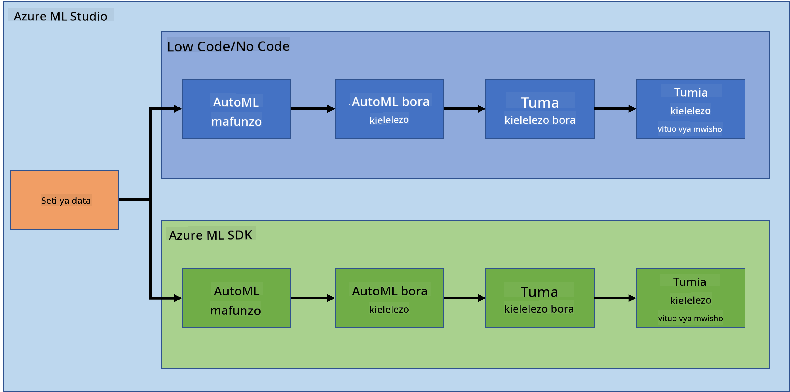

<!--
CO_OP_TRANSLATOR_METADATA:
{
  "original_hash": "73dead89dc2ddda4d6ec0232814a191e",
  "translation_date": "2025-08-26T16:10:34+00:00",
  "source_file": "5-Data-Science-In-Cloud/19-Azure/README.md",
  "language_code": "sw"
}
-->
# Sayansi ya Takwimu katika Wingu: Njia ya "Azure ML SDK"

| ](../../sketchnotes/19-DataScience-Cloud.png)|
|:---:|
| Sayansi ya Takwimu Katika Wingu: Azure ML SDK - _Sketchnote na [@nitya](https://twitter.com/nitya)_ |

Orodha ya yaliyomo:

- [Sayansi ya Takwimu katika Wingu: Njia ya "Azure ML SDK"](../../../../5-Data-Science-In-Cloud/19-Azure)
  - [Maswali ya awali ya somo](../../../../5-Data-Science-In-Cloud/19-Azure)
  - [1. Utangulizi](../../../../5-Data-Science-In-Cloud/19-Azure)
    - [1.1 Azure ML SDK ni nini?](../../../../5-Data-Science-In-Cloud/19-Azure)
    - [1.2 Utangulizi wa mradi wa utabiri wa kushindwa kwa moyo na seti ya data](../../../../5-Data-Science-In-Cloud/19-Azure)
  - [2. Kufundisha modeli kwa Azure ML SDK](../../../../5-Data-Science-In-Cloud/19-Azure)
    - [2.1 Kuunda eneo la kazi la Azure ML](../../../../5-Data-Science-In-Cloud/19-Azure)
    - [2.2 Kuunda mfano wa kompyuta](../../../../5-Data-Science-In-Cloud/19-Azure)
    - [2.3 Kupakia seti ya data](../../../../5-Data-Science-In-Cloud/19-Azure)
    - [2.4 Kuunda Notebooks](../../../../5-Data-Science-In-Cloud/19-Azure)
    - [2.5 Kufundisha modeli](../../../../5-Data-Science-In-Cloud/19-Azure)
      - [2.5.1 Kuweka Eneo la Kazi, jaribio, klasta ya kompyuta na seti ya data](../../../../5-Data-Science-In-Cloud/19-Azure)
      - [2.5.2 Usanidi wa AutoML na mafunzo](../../../../5-Data-Science-In-Cloud/19-Azure)
  - [3. Uwekaji wa modeli na matumizi ya endpoint kwa Azure ML SDK](../../../../5-Data-Science-In-Cloud/19-Azure)
    - [3.1 Kuhifadhi modeli bora](../../../../5-Data-Science-In-Cloud/19-Azure)
    - [3.2 Uwekaji wa modeli](../../../../5-Data-Science-In-Cloud/19-Azure)
    - [3.3 Matumizi ya endpoint](../../../../5-Data-Science-In-Cloud/19-Azure)
  - [🚀 Changamoto](../../../../5-Data-Science-In-Cloud/19-Azure)
  - [Maswali ya baada ya somo](../../../../5-Data-Science-In-Cloud/19-Azure)
  - [Mapitio na Kujisomea](../../../../5-Data-Science-In-Cloud/19-Azure)
  - [Kazi ya nyumbani](../../../../5-Data-Science-In-Cloud/19-Azure)

## [Maswali ya awali ya somo](https://purple-hill-04aebfb03.1.azurestaticapps.net/quiz/36)

## 1. Utangulizi

### 1.1 Azure ML SDK ni nini?

Wanasayansi wa takwimu na watengenezaji wa AI hutumia Azure Machine Learning SDK kujenga na kuendesha mchakato wa mafunzo ya mashine kwa kutumia huduma ya Azure Machine Learning. Unaweza kuingiliana na huduma hii katika mazingira yoyote ya Python, ikiwa ni pamoja na Jupyter Notebooks, Visual Studio Code, au IDE yako unayoipenda ya Python.

Maeneo muhimu ya SDK ni:

- Kuchunguza, kuandaa na kusimamia mzunguko wa maisha wa seti za data zinazotumika katika majaribio ya mafunzo ya mashine.
- Kusimamia rasilimali za wingu kwa ufuatiliaji, kuandika kumbukumbu, na kupanga majaribio ya mafunzo ya mashine.
- Kufundisha modeli ama kwa ndani au kwa kutumia rasilimali za wingu, ikiwa ni pamoja na mafunzo ya modeli yanayoharakishwa na GPU.
- Kutumia mafunzo ya mashine yaliyojiendesha, ambayo yanakubali vigezo vya usanidi na data ya mafunzo. Inarudia kiotomatiki kupitia algoriti na mipangilio ya hyperparameter ili kupata modeli bora kwa utabiri.
- Kuweka huduma za wavuti ili kubadilisha modeli zako zilizofundishwa kuwa huduma za RESTful zinazoweza kutumika katika programu yoyote.

[Jifunze zaidi kuhusu Azure Machine Learning SDK](https://docs.microsoft.com/python/api/overview/azure/ml?WT.mc_id=academic-77958-bethanycheum&ocid=AID3041109)

Katika [somo lililopita](../18-Low-Code/README.md), tuliona jinsi ya kufundisha, kuweka na kutumia modeli kwa njia ya Low code/No code. Tulitumia seti ya data ya Kushindwa kwa Moyo kuunda modeli ya utabiri wa kushindwa kwa moyo. Katika somo hili, tutafanya jambo lile lile lakini kwa kutumia Azure Machine Learning SDK.



### 1.2 Utangulizi wa mradi wa utabiri wa kushindwa kwa moyo na seti ya data

Angalia [hapa](../18-Low-Code/README.md) utangulizi wa mradi wa utabiri wa kushindwa kwa moyo na seti ya data.

## 2. Kufundisha modeli kwa Azure ML SDK
### 2.1 Kuunda eneo la kazi la Azure ML

Kwa urahisi, tutafanya kazi kwenye jupyter notebook. Hii inamaanisha kuwa tayari una Eneo la Kazi na mfano wa kompyuta. Ikiwa tayari una Eneo la Kazi, unaweza kuruka moja kwa moja kwenye sehemu ya 2.3 Kuunda Notebook.

Ikiwa huna, tafadhali fuata maelekezo katika sehemu **2.1 Kuunda eneo la kazi la Azure ML** katika [somo lililopita](../18-Low-Code/README.md) kuunda eneo la kazi.

### 2.2 Kuunda mfano wa kompyuta

Katika [eneo la kazi la Azure ML](https://ml.azure.com/) tulilounda awali, nenda kwenye menyu ya kompyuta na utaona rasilimali tofauti za kompyuta zinazopatikana.


Hebu tuunde mfano wa kompyuta ili kuandaa jupyter notebook. 
1. Bonyeza kitufe cha + New. 
2. Peana jina kwa mfano wako wa kompyuta.
3. Chagua chaguo zako: CPU au GPU, ukubwa wa VM na idadi ya cores.
4. Bonyeza kitufe cha Create.

Hongera, umekamilisha kuunda mfano wa kompyuta! Tutatumia mfano huu wa kompyuta kuunda Notebook katika sehemu ya [Kuunda Notebooks](../../../../5-Data-Science-In-Cloud/19-Azure).

### 2.3 Kupakia seti ya data
Rejelea [somo lililopita](../18-Low-Code/README.md) katika sehemu **2.3 Kupakia seti ya data** ikiwa bado hujapakia seti ya data.

### 2.4 Kuunda Notebooks

> **_NOTE:_** Kwa hatua inayofuata unaweza kuunda notebook mpya kutoka mwanzo, au unaweza kupakia [notebook tuliyounda](notebook.ipynb) katika Azure ML Studio yako. Ili kuipakia, bonyeza tu kwenye menyu ya "Notebook" na upakie notebook.

Notebook ni sehemu muhimu sana ya mchakato wa sayansi ya takwimu. Zinatumika kufanya Uchambuzi wa Takwimu wa Kichunguzi (EDA), kuwasiliana na klasta ya kompyuta kufundisha modeli, au kuwasiliana na klasta ya utabiri kuweka endpoint.

Ili kuunda Notebook, tunahitaji nodi ya kompyuta inayotoa huduma ya jupyter notebook. Rudi kwenye [eneo la kazi la Azure ML](https://ml.azure.com/) na bonyeza kwenye Compute instances. Katika orodha ya compute instances unapaswa kuona [mfano wa kompyuta tuliouunda awali](../../../../5-Data-Science-In-Cloud/19-Azure). 

1. Katika sehemu ya Applications, bonyeza chaguo la Jupyter. 
2. Weka tiki kwenye kisanduku cha "Yes, I understand" na bonyeza kitufe cha Continue.

3. Hii itafungua tabo mpya ya kivinjari na mfano wako wa jupyter notebook kama ifuatavyo. Bonyeza kitufe cha "New" kuunda notebook.


Sasa kwa kuwa tuna Notebook, tunaweza kuanza kufundisha modeli kwa Azure ML SDK.

### 2.5 Kufundisha modeli

Kwanza kabisa, ikiwa una shaka yoyote, rejelea [Azure ML SDK documentation](https://docs.microsoft.com/python/api/overview/azure/ml?WT.mc_id=academic-77958-bethanycheum&ocid=AID3041109). Inayo taarifa zote muhimu za kuelewa moduli tutakazoziona katika somo hili.

#### 2.5.1 Kuweka Eneo la Kazi, jaribio, klasta ya kompyuta na seti ya data

Unahitaji kupakia `workspace` kutoka faili ya usanidi kwa kutumia msimbo ufuatao:

```python
from azureml.core import Workspace
ws = Workspace.from_config()
```

Hii inarudisha kitu cha aina ya `Workspace` kinachowakilisha eneo la kazi. Kisha unahitaji kuunda `experiment` kwa kutumia msimbo ufuatao:

```python
from azureml.core import Experiment
experiment_name = 'aml-experiment'
experiment = Experiment(ws, experiment_name)
```
Ili kupata au kuunda jaribio kutoka eneo la kazi, unahitaji jina la jaribio. Jina la jaribio lazima liwe na herufi 3-36, lianze na herufi au namba, na linaweza kuwa na herufi, namba, underscores, na dashes pekee. Ikiwa jaribio halipatikani katika eneo la kazi, jaribio jipya linaundwa.

Sasa unahitaji kuunda klasta ya kompyuta kwa mafunzo kwa kutumia msimbo ufuatao. Kumbuka kuwa hatua hii inaweza kuchukua dakika chache. 

```python
from azureml.core.compute import AmlCompute

aml_name = "heart-f-cluster"
try:
    aml_compute = AmlCompute(ws, aml_name)
    print('Found existing AML compute context.')
except:
    print('Creating new AML compute context.')
    aml_config = AmlCompute.provisioning_configuration(vm_size = "Standard_D2_v2", min_nodes=1, max_nodes=3)
    aml_compute = AmlCompute.create(ws, name = aml_name, provisioning_configuration = aml_config)
    aml_compute.wait_for_completion(show_output = True)

cts = ws.compute_targets
compute_target = cts[aml_name]
```

Unaweza kupata seti ya data kutoka eneo la kazi kwa kutumia jina la seti ya data kwa njia ifuatayo:

```python
dataset = ws.datasets['heart-failure-records']
df = dataset.to_pandas_dataframe()
df.describe()
```
#### 2.5.2 Usanidi wa AutoML na mafunzo

Ili kuweka usanidi wa AutoML, tumia [AutoMLConfig class](https://docs.microsoft.com/python/api/azureml-train-automl-client/azureml.train.automl.automlconfig(class)?WT.mc_id=academic-77958-bethanycheum&ocid=AID3041109).

Kama ilivyoelezwa katika nyaraka, kuna vigezo vingi ambavyo unaweza kucheza navyo. Kwa mradi huu, tutatumia vigezo vifuatavyo:

- `experiment_timeout_minutes`: Muda wa juu (kwa dakika) ambao jaribio linaruhusiwa kuendesha kabla ya kusimamishwa kiotomatiki na matokeo kufanywa kupatikana kiotomatiki.
- `max_concurrent_iterations`: Idadi ya juu ya majaribio ya mafunzo yanayoruhusiwa kuendesha kwa wakati mmoja.
- `primary_metric`: Kipimo kikuu kinachotumika kuamua hali ya jaribio.
- `compute_target`: Lengo la kompyuta la Azure Machine Learning kuendesha jaribio la Mafunzo ya Mashine Yaliyojiendesha.
- `task`: Aina ya kazi ya kuendesha. Thamani zinaweza kuwa 'classification', 'regression', au 'forecasting' kulingana na aina ya tatizo la ML lililojiendesha.
- `training_data`: Data ya mafunzo itakayotumika ndani ya jaribio. Inapaswa kuwa na vipengele vya mafunzo na safu ya lebo (kwa hiari safu ya uzito wa sampuli).
- `label_column_name`: Jina la safu ya lebo.
- `path`: Njia kamili ya folda ya mradi wa Azure Machine Learning.
- `enable_early_stopping`: Ikiwa kuwezesha kusimamisha mapema ikiwa alama haibadiliki kwa muda mfupi.
- `featurization`: Kiashiria cha ikiwa hatua ya featurization inapaswa kufanywa kiotomatiki au la, au ikiwa featurization iliyobinafsishwa inapaswa kutumika.
- `debug_log`: Faili ya logi ya kuandika taarifa za utatuzi.

```python
from azureml.train.automl import AutoMLConfig

project_folder = './aml-project'

automl_settings = {
    "experiment_timeout_minutes": 20,
    "max_concurrent_iterations": 3,
    "primary_metric" : 'AUC_weighted'
}

automl_config = AutoMLConfig(compute_target=compute_target,
                             task = "classification",
                             training_data=dataset,
                             label_column_name="DEATH_EVENT",
                             path = project_folder,  
                             enable_early_stopping= True,
                             featurization= 'auto',
                             debug_log = "automl_errors.log",
                             **automl_settings
                            )
```
Sasa kwa kuwa umeseti usanidi wako, unaweza kufundisha modeli kwa kutumia msimbo ufuatao. Hatua hii inaweza kuchukua hadi saa moja kulingana na ukubwa wa klasta yako.

```python
remote_run = experiment.submit(automl_config)
```
Unaweza kuendesha widget ya RunDetails kuonyesha majaribio tofauti.
```python
from azureml.widgets import RunDetails
RunDetails(remote_run).show()
```
## 3. Uwekaji wa modeli na matumizi ya endpoint kwa Azure ML SDK

### 3.1 Kuhifadhi modeli bora

`remote_run` ni kitu cha aina ya [AutoMLRun](https://docs.microsoft.com/python/api/azureml-train-automl-client/azureml.train.automl.run.automlrun?WT.mc_id=academic-77958-bethanycheum&ocid=AID3041109). Kitu hiki kina njia ya `get_output()` ambayo inarudisha jaribio bora na modeli iliyofaa.

```python
best_run, fitted_model = remote_run.get_output()
```
Unaweza kuona vigezo vilivyotumika kwa modeli bora kwa kuchapisha tu `fitted_model` na kuona mali za modeli bora kwa kutumia njia ya [get_properties()](https://docs.microsoft.com/python/api/azureml-core/azureml.core.run(class)?view=azure-ml-py#azureml_core_Run_get_properties?WT.mc_id=academic-77958-bethanycheum&ocid=AID3041109).

```python
best_run.get_properties()
```

Sasa sajili modeli kwa kutumia njia ya [register_model](https://docs.microsoft.com/python/api/azureml-train-automl-client/azureml.train.automl.run.automlrun?view=azure-ml-py#register-model-model-name-none--description-none--tags-none--iteration-none--metric-none-?WT.mc_id=academic-77958-bethanycheum&ocid=AID3041109).
```python
model_name = best_run.properties['model_name']
script_file_name = 'inference/score.py'
best_run.download_file('outputs/scoring_file_v_1_0_0.py', 'inference/score.py')
description = "aml heart failure project sdk"
model = best_run.register_model(model_name = model_name,
                                model_path = './outputs/',
                                description = description,
                                tags = None)
```
### 3.2 Uwekaji wa modeli

Baada ya modeli bora kuhifadhiwa, tunaweza kuiweka kwa kutumia darasa la [InferenceConfig](https://docs.microsoft.com/python/api/azureml-core/azureml.core.model.inferenceconfig?view=azure-ml-py?ocid=AID3041109). InferenceConfig inawakilisha mipangilio ya usanidi kwa mazingira maalum yanayotumika kwa uwekaji. Darasa la [AciWebservice](https://docs.microsoft.com/python/api/azureml-core/azureml.core.webservice.aciwebservice?view=azure-ml-py) linawakilisha modeli ya mafunzo ya mashine iliyowekwa kama endpoint ya huduma ya wavuti kwenye Azure Container Instances. Huduma ya wavuti iliyowekwa ni endpoint ya HTTP yenye usawa wa mzigo na API ya REST. Unaweza kutuma data kwa API hii na kupokea utabiri uliorudishwa na modeli.

Modeli inawekwa kwa kutumia njia ya [deploy](https://docs.microsoft.com/python/api/azureml-core/azureml.core.model(class)?view=azure-ml-py#deploy-workspace--name--models--inference-config-none--deployment-config-none--deployment-target-none--overwrite-false--show-output-false-?WT.mc_id=academic-77958-bethanycheum&ocid=AID3041109).

```python
from azureml.core.model import InferenceConfig, Model
from azureml.core.webservice import AciWebservice

inference_config = InferenceConfig(entry_script=script_file_name, environment=best_run.get_environment())

aciconfig = AciWebservice.deploy_configuration(cpu_cores = 1,
                                               memory_gb = 1,
                                               tags = {'type': "automl-heart-failure-prediction"},
                                               description = 'Sample service for AutoML Heart Failure Prediction')

aci_service_name = 'automl-hf-sdk'
aci_service = Model.deploy(ws, aci_service_name, [model], inference_config, aciconfig)
aci_service.wait_for_deployment(True)
print(aci_service.state)
```
Hatua hii inapaswa kuchukua dakika chache.

### 3.3 Matumizi ya endpoint

Unatumia endpoint yako kwa kuunda ingizo la sampuli:

```python
data = {
    "data":
    [
        {
            'age': "60",
            'anaemia': "false",
            'creatinine_phosphokinase': "500",
            'diabetes': "false",
            'ejection_fraction': "38",
            'high_blood_pressure': "false",
            'platelets': "260000",
            'serum_creatinine': "1.40",
            'serum_sodium': "137",
            'sex': "false",
            'smoking': "false",
            'time': "130",
        },
    ],
}

test_sample = str.encode(json.dumps(data))
```
Kisha unaweza kutuma ingizo hili kwa modeli yako kwa utabiri:
```python
response = aci_service.run(input_data=test_sample)
response
```  
Hii inapaswa kutoa `'{"result": [false]}'`. Hii inamaanisha kwamba data ya mgonjwa tuliyotuma kwa endpoint ilizalisha utabiri `false` ambayo inamaanisha mtu huyu hana uwezekano wa kupata shambulio la moyo.  

Hongera! Umetumia modeli iliyowekwa na kufundishwa kwenye Azure ML kwa kutumia Azure ML SDK!  

> **_NOTE:_** Ukimaliza mradi, usisahau kufuta rasilimali zote.  

## 🚀 Changamoto  

Kuna mambo mengine mengi unayoweza kufanya kupitia SDK, kwa bahati mbaya, hatuwezi kuyapitia yote katika somo hili. Lakini habari njema ni kwamba kujifunza jinsi ya kupitia haraka nyaraka za SDK kunaweza kukusaidia sana peke yako. Angalia nyaraka za Azure ML SDK na tafuta darasa la `Pipeline` ambalo linakuruhusu kuunda mifumo ya hatua. Pipeline ni mkusanyiko wa hatua ambazo zinaweza kutekelezwa kama mtiririko wa kazi.  

**HINT:** Nenda kwenye [nyaraka za SDK](https://docs.microsoft.com/python/api/overview/azure/ml/?view=azure-ml-py?WT.mc_id=academic-77958-bethanycheum&ocid=AID3041109) na andika maneno muhimu kwenye kisanduku cha utafutaji kama "Pipeline". Unapaswa kuwa na darasa la `azureml.pipeline.core.Pipeline` katika matokeo ya utafutaji.  

## [Jaribio baada ya somo](https://purple-hill-04aebfb03.1.azurestaticapps.net/quiz/37)  

## Mapitio na Kujifunza Binafsi  

Katika somo hili, umejifunza jinsi ya kufundisha, kuweka na kutumia modeli kutabiri hatari ya kushindwa kwa moyo kwa kutumia Azure ML SDK kwenye wingu. Angalia [nyaraka hizi](https://docs.microsoft.com/python/api/overview/azure/ml/?view=azure-ml-py?WT.mc_id=academic-77958-bethanycheum&ocid=AID3041109) kwa maelezo zaidi kuhusu Azure ML SDK. Jaribu kuunda modeli yako mwenyewe kwa kutumia Azure ML SDK.  

## Kazi  

[Mradi wa Sayansi ya Data kwa kutumia Azure ML SDK](assignment.md)  

---

**Kanusho**:  
Hati hii imetafsiriwa kwa kutumia huduma ya kutafsiri ya AI [Co-op Translator](https://github.com/Azure/co-op-translator). Ingawa tunajitahidi kuhakikisha usahihi, tafadhali fahamu kuwa tafsiri za kiotomatiki zinaweza kuwa na makosa au kutokuwa sahihi. Hati ya asili katika lugha yake ya awali inapaswa kuzingatiwa kama chanzo cha mamlaka. Kwa taarifa muhimu, tafsiri ya kitaalamu ya binadamu inapendekezwa. Hatutawajibika kwa kutoelewana au tafsiri zisizo sahihi zinazotokana na matumizi ya tafsiri hii.