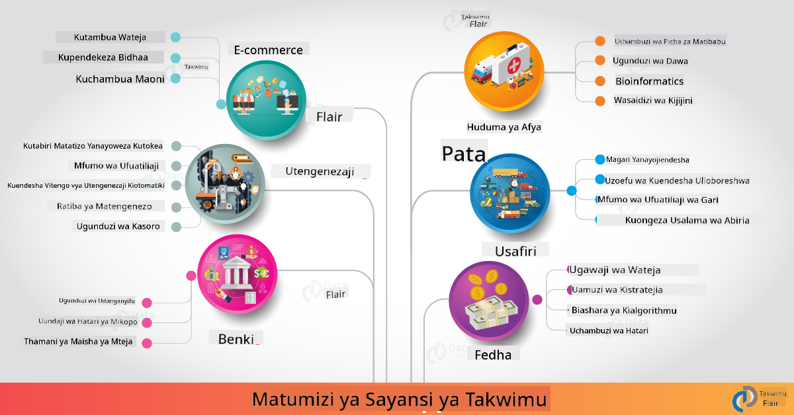

<!--
CO_OP_TRANSLATOR_METADATA:
{
  "original_hash": "67076ed50f54e7d26ba1ba378d6078f1",
  "translation_date": "2025-08-26T15:44:27+00:00",
  "source_file": "6-Data-Science-In-Wild/20-Real-World-Examples/README.md",
  "language_code": "sw"
}
-->
# Sayansi ya Takwimu Katika Ulimwengu Halisi

|  ](../../sketchnotes/20-DataScience-RealWorld.png) |
| :--------------------------------------------------------------------------------------------------------------: |
|               Sayansi ya Takwimu Katika Ulimwengu Halisi - _Sketchnote na [@nitya](https://twitter.com/nitya)_               |

Tuko karibu kumaliza safari hii ya kujifunza!

Tulianza na ufafanuzi wa sayansi ya takwimu na maadili, tukachunguza zana na mbinu mbalimbali za uchambuzi wa takwimu na uwasilishaji, tukapitia mzunguko wa maisha wa sayansi ya takwimu, na tukatazama jinsi ya kupanua na kuendesha kazi za sayansi ya takwimu kwa kutumia huduma za kompyuta za wingu. Kwa hivyo, labda unajiuliza: _"Je, ninawezaje kuhusisha haya yote na muktadha wa ulimwengu halisi?"_

Katika somo hili, tutachunguza matumizi ya sayansi ya takwimu katika sekta mbalimbali na kuangalia mifano maalum katika utafiti, masuala ya kibinadamu ya kidijitali, na uendelevu. Tutatazama fursa za miradi ya wanafunzi na kumalizia na rasilimali muhimu zitakazokusaidia kuendelea na safari yako ya kujifunza!

## Maswali Kabla ya Somo

[Maswali kabla ya somo](https://purple-hill-04aebfb03.1.azurestaticapps.net/quiz/38)

## Sayansi ya Takwimu + Sekta

Shukrani kwa demokrasia ya AI, sasa watengenezaji wanapata urahisi wa kubuni na kuunganisha maamuzi yanayoendeshwa na AI na maarifa yanayotokana na takwimu katika uzoefu wa watumiaji na mtiririko wa kazi za maendeleo. Hapa kuna mifano kadhaa ya jinsi sayansi ya takwimu inavyotumika katika ulimwengu halisi kwenye sekta mbalimbali:

 * [Google Flu Trends](https://www.wired.com/2015/10/can-learn-epic-failure-google-flu-trends/) ilitumia sayansi ya takwimu kuhusisha maneno ya utafutaji na mwenendo wa mafua. Ingawa mbinu hiyo ilikuwa na mapungufu, ilileta ufahamu kuhusu uwezekano (na changamoto) za utabiri wa afya unaotegemea takwimu.

 * [UPS Routing Predictions](https://www.technologyreview.com/2018/11/21/139000/how-ups-uses-ai-to-outsmart-bad-weather/) - inaelezea jinsi UPS inavyotumia sayansi ya takwimu na ujifunzaji wa mashine kutabiri njia bora za usafirishaji, ikizingatia hali ya hewa, mifumo ya trafiki, muda wa mwisho wa utoaji, na zaidi.

 * [NYC Taxicab Route Visualization](http://chriswhong.github.io/nyctaxi/) - takwimu zilizokusanywa kwa kutumia [Sheria za Uhuru wa Habari](https://chriswhong.com/open-data/foil_nyc_taxi/) zilisaidia kuonyesha siku moja katika maisha ya teksi za NYC, zikituonyesha jinsi zinavyosafiri katika jiji lenye shughuli nyingi, pesa wanazopata, na muda wa safari kwa kila kipindi cha masaa 24.

 * [Uber Data Science Workbench](https://eng.uber.com/dsw/) - hutumia takwimu (kama maeneo ya kuchukua na kushuka, muda wa safari, njia zinazopendekezwa n.k.) zilizokusanywa kutoka mamilioni ya safari za Uber *kila siku* kujenga zana ya uchambuzi wa takwimu kusaidia katika bei, usalama, kugundua udanganyifu, na maamuzi ya urambazaji.

 * [Sports Analytics](https://towardsdatascience.com/scope-of-analytics-in-sports-world-37ed09c39860) - inazingatia _uchambuzi wa utabiri_ (uchambuzi wa timu na wachezaji - fikiria [Moneyball](https://datasciencedegree.wisconsin.edu/blog/moneyball-proves-importance-big-data-big-ideas/) - na usimamizi wa mashabiki) na _uwasilishaji wa takwimu_ (dashibodi za timu na mashabiki, michezo n.k.) na matumizi kama utafutaji wa vipaji, kamari ya michezo, na usimamizi wa vifaa/maeneo.

 * [Sayansi ya Takwimu katika Benki](https://data-flair.training/blogs/data-science-in-banking/) - inaonyesha thamani ya sayansi ya takwimu katika sekta ya fedha na matumizi yanayojumuisha uundaji wa mifano ya hatari, kugundua udanganyifu, kugawanya wateja, utabiri wa wakati halisi, na mifumo ya mapendekezo. Uchambuzi wa utabiri pia unaendesha hatua muhimu kama [alama za mkopo](https://dzone.com/articles/using-big-data-and-predictive-analytics-for-credit).

 * [Sayansi ya Takwimu katika Afya](https://data-flair.training/blogs/data-science-in-healthcare/) - inaonyesha matumizi kama picha za matibabu (mfano, MRI, X-Ray, CT-Scan), genomics (mpangilio wa DNA), maendeleo ya dawa (tathmini ya hatari, utabiri wa mafanikio), uchambuzi wa utabiri (huduma ya wagonjwa na vifaa vya usambazaji), ufuatiliaji wa magonjwa na kuzuia n.k.

 Picha: [Data Flair: Matumizi 6 ya Kushangaza ya Sayansi ya Takwimu ](https://data-flair.training/blogs/data-science-applications/)

Mchoro unaonyesha maeneo mengine na mifano ya kutumia mbinu za sayansi ya takwimu. Unataka kuchunguza matumizi mengine? Angalia sehemu ya [Mapitio na Kujisomea](../../../../6-Data-Science-In-Wild/20-Real-World-Examples) hapa chini.

## Sayansi ya Takwimu + Utafiti

|  ](../../sketchnotes/20-DataScience-Research.png) |
| :---------------------------------------------------------------------------------------------------------------: |
|              Sayansi ya Takwimu & Utafiti - _Sketchnote na [@nitya](https://twitter.com/nitya)_              |

Ingawa matumizi ya ulimwengu halisi mara nyingi yanazingatia kesi za matumizi ya sekta kwa kiwango kikubwa, matumizi ya _utafiti_ yanaweza kuwa muhimu kutoka mitazamo miwili:

* _fursa za uvumbuzi_ - kuchunguza utengenezaji wa haraka wa dhana za hali ya juu na kupima uzoefu wa watumiaji kwa matumizi ya kizazi kijacho.
* _changamoto za utekelezaji_ - kuchunguza madhara yanayoweza kutokea au matokeo yasiyotarajiwa ya teknolojia za sayansi ya takwimu katika muktadha wa ulimwengu halisi.

Kwa wanafunzi, miradi ya utafiti inaweza kutoa fursa za kujifunza na kushirikiana ambazo zinaweza kuboresha uelewa wako wa mada, na kupanua ufahamu wako na ushirikiano na watu au timu zinazofanya kazi katika maeneo ya maslahi. Kwa hivyo miradi ya utafiti inaonekanaje na inaweza kuwa na athari gani?

Hebu tuangalie mfano mmoja - [MIT Gender Shades Study](http://gendershades.org/overview.html) kutoka Joy Buolamwini (MIT Media Labs) na [karatasi ya utafiti maarufu](http://proceedings.mlr.press/v81/buolamwini18a/buolamwini18a.pdf) iliyoandikwa kwa ushirikiano na Timnit Gebru (wakati huo akiwa Microsoft Research) ambayo ililenga:

 * **Nini:** Lengo la mradi wa utafiti lilikuwa _kutathmini upendeleo uliopo katika algoriti za uchambuzi wa uso na seti za data_ kulingana na jinsia na aina ya ngozi.
 * **Kwa nini:** Uchambuzi wa uso hutumika katika maeneo kama utekelezaji wa sheria, usalama wa viwanja vya ndege, mifumo ya kuajiri na zaidi - muktadha ambapo uainishaji usio sahihi (mfano, kutokana na upendeleo) unaweza kusababisha madhara ya kiuchumi na kijamii kwa watu au vikundi vilivyoathiriwa. Kuelewa (na kuondoa au kupunguza) upendeleo ni muhimu kwa usawa katika matumizi.
 * **Jinsi:** Watafiti walitambua kuwa viwango vilivyopo vilitumia zaidi masomo yenye ngozi nyepesi, na wakatengeneza seti mpya ya data (picha 1000+) ambayo ilikuwa _imebalansishwa zaidi_ kwa jinsia na aina ya ngozi. Seti ya data ilitumika kutathmini usahihi wa bidhaa tatu za uainishaji wa jinsia (kutoka Microsoft, IBM & Face++).

Matokeo yalionyesha kuwa ingawa usahihi wa jumla wa uainishaji ulikuwa mzuri, kulikuwa na tofauti kubwa katika viwango vya makosa kati ya vikundi mbalimbali - na **makosa ya uainishaji wa jinsia** kuwa juu kwa wanawake au watu wenye ngozi nyeusi, ikionyesha upendeleo.

**Matokeo Muhimu:** Ilileta ufahamu kwamba sayansi ya takwimu inahitaji seti za data _zinazowakilisha zaidi_ (vikundi vilivyobalansishwa) na timu _shirikishi zaidi_ (asili mbalimbali) ili kutambua na kuondoa au kupunguza upendeleo kama huo mapema katika suluhisho za AI. Juhudi za utafiti kama hizi pia ni muhimu kwa mashirika mengi kufafanua kanuni na mazoea ya _AI inayowajibika_ ili kuboresha usawa katika bidhaa na michakato yao ya AI.

**Unataka kujifunza kuhusu juhudi za utafiti zinazohusiana katika Microsoft?**

* Angalia [Miradi ya Utafiti ya Microsoft](https://www.microsoft.com/research/research-area/artificial-intelligence/?facet%5Btax%5D%5Bmsr-research-area%5D%5B%5D=13556&facet%5Btax%5D%5Bmsr-content-type%5D%5B%5D=msr-project) kuhusu Akili Bandia.
* Chunguza miradi ya wanafunzi kutoka [Shule ya Majira ya Joto ya Sayansi ya Takwimu ya Microsoft Research](https://www.microsoft.com/en-us/research/academic-program/data-science-summer-school/).
* Angalia mradi wa [Fairlearn](https://fairlearn.org/) na juhudi za [AI inayowajibika](https://www.microsoft.com/en-us/ai/responsible-ai?activetab=pivot1%3aprimaryr6).

## Sayansi ya Takwimu + Masuala ya Kibinadamu

|  ](../../sketchnotes/20-DataScience-Humanities.png) |
| :---------------------------------------------------------------------------------------------------------------: |
|              Sayansi ya Takwimu & Masuala ya Kibinadamu ya Kidijitali - _Sketchnote na [@nitya](https://twitter.com/nitya)_              |

Masuala ya Kibinadamu ya Kidijitali [yamefafanuliwa](https://digitalhumanities.stanford.edu/about-dh-stanford) kama "mkusanyiko wa mazoea na mbinu zinazochanganya mbinu za kompyuta na uchunguzi wa kibinadamu". [Miradi ya Stanford](https://digitalhumanities.stanford.edu/projects) kama _"kuanzisha upya historia"_ na _"fikra za kishairi"_ inaonyesha uhusiano kati ya [Masuala ya Kibinadamu ya Kidijitali na Sayansi ya Takwimu](https://digitalhumanities.stanford.edu/digital-humanities-and-data-science) - ikisisitiza mbinu kama uchambuzi wa mitandao, uwasilishaji wa taarifa, uchambuzi wa anga na maandishi ambayo yanaweza kutusaidia kutazama upya seti za data za kihistoria na fasihi ili kupata maarifa na mitazamo mipya.

*Unataka kuchunguza na kupanua mradi katika eneo hili?*

Angalia ["Emily Dickinson na Kipimo cha Hisia"](https://gist.github.com/jlooper/ce4d102efd057137bc000db796bfd671) - mfano mzuri kutoka [Jen Looper](https://twitter.com/jenlooper) unaouliza jinsi tunavyoweza kutumia sayansi ya takwimu kutazama upya mashairi yanayojulikana na kutathmini upya maana yake na mchango wa mwandishi wake katika muktadha mpya. Kwa mfano, _je, tunaweza kutabiri msimu ambao shairi liliandikwa kwa kuchambua sauti au hisia zake_ - na hili linatuambia nini kuhusu hali ya akili ya mwandishi katika kipindi husika?

Ili kujibu swali hilo, tunafuata hatua za mzunguko wa maisha wa sayansi ya takwimu:
 * [`Upatikanaji wa Takwimu`](https://gist.github.com/jlooper/ce4d102efd057137bc000db796bfd671#acquiring-the-dataset) - kukusanya seti ya data inayofaa kwa uchambuzi. Chaguo ni pamoja na kutumia API (mfano, [Poetry DB API](https://poetrydb.org/index.html)) au kuchota kurasa za wavuti (mfano, [Project Gutenberg](https://www.gutenberg.org/files/12242/12242-h/12242-h.htm)) kwa kutumia zana kama [Scrapy](https://scrapy.org/).
 * [`Usafishaji wa Takwimu`](https://gist.github.com/jlooper/ce4d102efd057137bc000db796bfd671#clean-the-data) - inaelezea jinsi maandishi yanavyoweza kufanyiwa muundo, kusafishwa, na kurahisishwa kwa kutumia zana za msingi kama Visual Studio Code na Microsoft Excel.
 * [`Uchambuzi wa Takwimu`](https://gist.github.com/jlooper/ce4d102efd057137bc000db796bfd671#working-with-the-data-in-a-notebook) - inaelezea jinsi tunavyoweza kuingiza seti ya data katika "Notebooks" kwa uchambuzi kwa kutumia pakiti za Python (kama pandas, numpy na matplotlib) kupanga na kuonyesha takwimu.
 * [`Uchambuzi wa Hisia`](https://gist.github.com/jlooper/ce4d102efd057137bc000db796bfd671#sentiment-analysis-using-cognitive-services) - inaelezea jinsi tunavyoweza kuunganisha huduma za wingu kama Text Analytics, kwa kutumia zana za kiwango cha chini kama [Power Automate](https://flow.microsoft.com/en-us/) kwa mtiririko wa kazi wa usindikaji wa takwimu kiotomatiki.

Kwa kutumia mtiririko huu, tunaweza kuchunguza athari za msimu kwenye hisia za mashairi, na kutusaidia kuunda mitazamo yetu wenyewe kuhusu mwandishi. Jaribu mwenyewe - kisha panua notebook ili kuuliza maswali mengine au kuonyesha takwimu kwa njia mpya!

> Unaweza kutumia baadhi ya zana katika [Kifaa cha Masuala ya Kibinadamu ya Kidijitali](https://github.com/Digital-Humanities-Toolkit) kufuatilia njia hizi za uchunguzi.

## Sayansi ya Takwimu + Uendelevu

|  ](../../sketchnotes/20-DataScience-Sustainability.png) |
| :---------------------------------------------------------------------------------------------------------------: |
|              Sayansi ya Takwimu & Uendelevu - _Sketchnote na [@nitya](https://twitter.com/nitya)_              |

[Ajenda ya 2030 ya Maendeleo Endelevu](https://sdgs.un.org/2030agenda) - iliyopitishwa na wanachama wote wa Umoja wa Mataifa mwaka 2015 - inatambua malengo 17 ikiwa ni pamoja na yale yanayolenga **Kulinda Sayari** dhidi ya uharibifu na athari za mabadiliko ya hali ya hewa. Juhudi za [Microsoft Sustainability](https://www.microsoft.com/en-us/sustainability) zinaunga mkono malengo haya kwa kuchunguza njia ambazo suluhisho za kiteknolojia zinaweza kusaidia na kujenga mustakabali endelevu zaidi kwa [malengo 4](https://dev.to/azure/a-visual-guide-to-sustainable-software-engineering-53hh) - kuwa na kaboni hasi, maji chanya, taka sifuri, na bioanuwai kufikia mwaka 2030.

Kukabiliana na changamoto hizi kwa kiwango kikubwa na kwa wakati unaofaa kunahitaji fikra za kiwango cha wingu - na takwimu kubwa. Juhudi za [Kompyuta ya Sayari](https://planetarycomputer.microsoft.com/) zinatoa vipengele 4 kusaidia wanasayansi wa takwimu na watengenezaji katika juhudi hizi:

 * [Katalogi ya Takwimu](https://planetarycomputer.microsoft.com/catalog) - yenye petabytes za takwimu za Mfumo wa Dunia (bure na zinazohifadhiwa kwenye Azure).
 * [API ya Sayari](https://planetarycomputer.microsoft.com/docs/reference/stac/) - kusaidia watumiaji kutafuta takwimu zinazofaa kwa nafasi na wakati.
 * [Hub](https://planetarycomputer.microsoft.com/docs/overview/environment/) - mazingira yanayosimamiwa kwa wanasayansi kusindika seti kubwa za takwimu za kijiografia.
 * [Matumizi](https://planetarycomputer.microsoft.com/applications) - kuonyesha kesi za matumizi na zana za maarifa ya uendelevu.
**Mradi wa Planetary Computer kwa sasa uko katika awamu ya majaribio (kuanzia Sep 2021)** - hapa kuna jinsi unavyoweza kuanza kuchangia suluhisho za uendelevu kwa kutumia sayansi ya data.

* [Omba ruhusa](https://planetarycomputer.microsoft.com/account/request) ili kuanza kuchunguza na kuungana na wenzao.
* [Chunguza nyaraka](https://planetarycomputer.microsoft.com/docs/overview/about) ili kuelewa seti za data na API zinazoungwa mkono.
* Chunguza programu kama [Ufuatiliaji wa Mfumo wa Ikolojia](https://analytics-lab.org/ecosystemmonitoring/) kwa msukumo wa mawazo ya programu.

Fikiria jinsi unavyoweza kutumia uwasilishaji wa data kufichua au kuimarisha maarifa muhimu katika maeneo kama mabadiliko ya tabianchi na ukataji miti. Au fikiria jinsi maarifa hayo yanavyoweza kutumika kuunda uzoefu mpya wa watumiaji unaochochea mabadiliko ya tabia kwa maisha endelevu zaidi.

## Sayansi ya Data + Wanafunzi

Tumeelezea matumizi ya ulimwengu halisi katika sekta na utafiti, na tukachunguza mifano ya matumizi ya sayansi ya data katika masuala ya kidijitali ya kibinadamu na uendelevu. Sasa, ni vipi unaweza kujenga ujuzi wako na kushiriki utaalamu wako kama wanafunzi wa sayansi ya data wanaoanza?

Hapa kuna mifano ya miradi ya wanafunzi wa sayansi ya data ili kukupa msukumo.

* [Shule ya Majira ya Joto ya Sayansi ya Data ya MSR](https://www.microsoft.com/en-us/research/academic-program/data-science-summer-school/#!projects) na [miradi](https://github.com/msr-ds3) kwenye GitHub inayochunguza mada kama:
   - [Upendeleo wa Kijamii katika Matumizi ya Nguvu na Polisi](https://www.microsoft.com/en-us/research/video/data-science-summer-school-2019-replicating-an-empirical-analysis-of-racial-differences-in-police-use-of-force/) | [Github](https://github.com/msr-ds3/stop-question-frisk)
   - [Uaminifu wa Mfumo wa Subway wa NYC](https://www.microsoft.com/en-us/research/video/data-science-summer-school-2018-exploring-the-reliability-of-the-nyc-subway-system/) | [Github](https://github.com/msr-ds3/nyctransit)
* [Kidijitali Utamaduni wa Vifaa: Kuchunguza mgawanyo wa kijamii na kiuchumi huko Sirkap](https://claremont.maps.arcgis.com/apps/Cascade/index.html?appid=bdf2aef0f45a4674ba41cd373fa23afc) - kutoka kwa [Ornella Altunyan](https://twitter.com/ornelladotcom) na timu yake huko Claremont, wakitumia [ArcGIS StoryMaps](https://storymaps.arcgis.com/).

## 🚀 Changamoto

Tafuta makala yanayopendekeza miradi ya sayansi ya data inayofaa kwa wanaoanza - kama [hizi mada 50](https://www.upgrad.com/blog/data-science-project-ideas-topics-beginners/) au [hizi mawazo 21 ya miradi](https://www.intellspot.com/data-science-project-ideas) au [hii miradi 16 yenye msimbo wa chanzo](https://data-flair.training/blogs/data-science-project-ideas/) unayoweza kuchambua na kurekebisha. Na usisahau kublogi kuhusu safari zako za kujifunza na kushiriki maarifa yako nasi sote.

## Jaribio Baada ya Somo

[Jaribio baada ya somo](https://purple-hill-04aebfb03.1.azurestaticapps.net/quiz/39)

## Mapitio & Kujisomea

Unataka kuchunguza matumizi zaidi? Hapa kuna makala chache zinazohusiana:
* [Matumizi 17 ya Sayansi ya Data na Mifano](https://builtin.com/data-science/data-science-applications-examples) - Jul 2021
* [Matumizi 11 ya Kushangaza ya Sayansi ya Data katika Ulimwengu Halisi](https://myblindbird.com/data-science-applications-real-world/) - Mei 2021
* [Sayansi ya Data Katika Ulimwengu Halisi](https://towardsdatascience.com/data-science-in-the-real-world/home) - Mkusanyiko wa Makala
* Sayansi ya Data Katika: [Elimu](https://data-flair.training/blogs/data-science-in-education/), [Kilimo](https://data-flair.training/blogs/data-science-in-agriculture/), [Fedha](https://data-flair.training/blogs/data-science-in-finance/), [Filamu](https://data-flair.training/blogs/data-science-at-movies/) na zaidi.

## Kazi

[Chunguza Seti ya Data ya Planetary Computer](assignment.md)

---

**Kanusho**:  
Hati hii imetafsiriwa kwa kutumia huduma ya tafsiri ya AI [Co-op Translator](https://github.com/Azure/co-op-translator). Ingawa tunajitahidi kuhakikisha usahihi, tafsiri za kiotomatiki zinaweza kuwa na makosa au kutokuwa sahihi. Hati ya asili katika lugha yake ya awali inapaswa kuzingatiwa kama chanzo cha mamlaka. Kwa taarifa muhimu, tafsiri ya kitaalamu ya binadamu inapendekezwa. Hatutawajibika kwa kutoelewana au tafsiri zisizo sahihi zinazotokana na matumizi ya tafsiri hii.