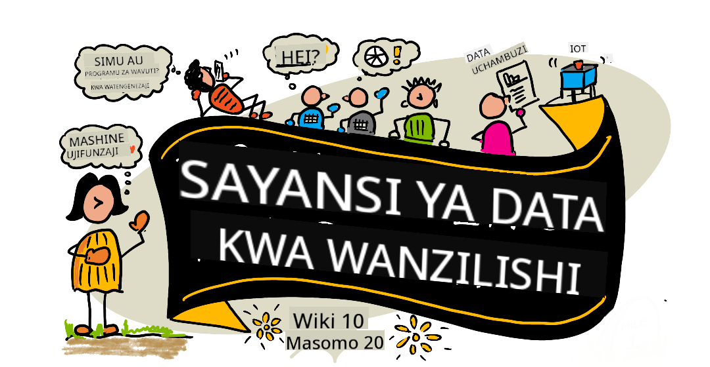

<!--
CO_OP_TRANSLATOR_METADATA:
{
  "original_hash": "dd9a1deb4da680b2cf11ba2e9f5a0a6e",
  "translation_date": "2025-09-29T22:04:14+00:00",
  "source_file": "README.md",
  "language_code": "sw"
}
-->
# Sayansi ya Takwimu kwa Kompyuta - Mtaala

Azure Cloud Advocates wa Microsoft wanakuletea mtaala wa wiki 10, masomo 20 kuhusu Sayansi ya Takwimu. Kila somo linajumuisha maswali ya awali na ya baada ya somo, maelekezo ya maandishi ya kukamilisha somo, suluhisho, na kazi ya nyumbani. Njia yetu ya kujifunza kwa miradi inakuruhusu kujifunza huku ukijenga, njia iliyothibitishwa ya kuhakikisha ujuzi mpya unakaa.

**Shukrani za dhati kwa waandishi wetu:** [Jasmine Greenaway](https://www.twitter.com/paladique), [Dmitry Soshnikov](http://soshnikov.com), [Nitya Narasimhan](https://twitter.com/nitya), [Jalen McGee](https://twitter.com/JalenMcG), [Jen Looper](https://twitter.com/jenlooper), [Maud Levy](https://twitter.com/maudstweets), [Tiffany Souterre](https://twitter.com/TiffanySouterre), [Christopher Harrison](https://www.twitter.com/geektrainer).

**🙏 Shukrani za pekee 🙏 kwa [Microsoft Student Ambassador](https://studentambassadors.microsoft.com/) waandishi, wakaguzi na wachangiaji wa maudhui,** hasa Aaryan Arora, [Aditya Garg](https://github.com/AdityaGarg00), [Alondra Sanchez](https://www.linkedin.com/in/alondra-sanchez-molina/), [Ankita Singh](https://www.linkedin.com/in/ankitasingh007), [Anupam Mishra](https://www.linkedin.com/in/anupam--mishra/), [Arpita Das](https://www.linkedin.com/in/arpitadas01/), ChhailBihari Dubey, [Dibri Nsofor](https://www.linkedin.com/in/dibrinsofor), [Dishita Bhasin](https://www.linkedin.com/in/dishita-bhasin-7065281bb), [Majd Safi](https://www.linkedin.com/in/majd-s/), [Max Blum](https://www.linkedin.com/in/max-blum-6036a1186/), [Miguel Correa](https://www.linkedin.com/in/miguelmque/), [Mohamma Iftekher (Iftu) Ebne Jalal](https://twitter.com/iftu119), [Nawrin Tabassum](https://www.linkedin.com/in/nawrin-tabassum), [Raymond Wangsa Putra](https://www.linkedin.com/in/raymond-wp/), [Rohit Yadav](https://www.linkedin.com/in/rty2423), Samridhi Sharma, [Sanya Sinha](https://www.linkedin.com/mwlite/in/sanya-sinha-13aab1200),
[Sheena Narula](https://www.linkedin.com/in/sheena-narua-n/), [Tauqeer Ahmad](https://www.linkedin.com/in/tauqeerahmad5201/), Yogendrasingh Pawar , [Vidushi Gupta](https://www.linkedin.com/in/vidushi-gupta07/), [Jasleen Sondhi](https://www.linkedin.com/in/jasleen-sondhi/)

||
|:---:|
| Sayansi ya Takwimu kwa Kompyuta - _Sketchnote na [@nitya](https://twitter.com/nitya)_ |

### 🌐 Msaada wa Lugha Nyingi

#### Inasaidiwa kupitia GitHub Action (Imefanywa Kiotomatiki & Daima Imeboreshwa)

[French](../fr/README.md) | [Spanish](../es/README.md) | [German](../de/README.md) | [Russian](../ru/README.md) | [Arabic](../ar/README.md) | [Persian (Farsi)](../fa/README.md) | [Urdu](../ur/README.md) | [Chinese (Simplified)](../zh/README.md) | [Chinese (Traditional, Macau)](../mo/README.md) | [Chinese (Traditional, Hong Kong)](../hk/README.md) | [Chinese (Traditional, Taiwan)](../tw/README.md) | [Japanese](../ja/README.md) | [Korean](../ko/README.md) | [Hindi](../hi/README.md) | [Bengali](../bn/README.md) | [Marathi](../mr/README.md) | [Nepali](../ne/README.md) | [Punjabi (Gurmukhi)](../pa/README.md) | [Portuguese (Portugal)](../pt/README.md) | [Portuguese (Brazil)](../br/README.md) | [Italian](../it/README.md) | [Polish](../pl/README.md) | [Turkish](../tr/README.md) | [Greek](../el/README.md) | [Thai](../th/README.md) | [Swedish](../sv/README.md) | [Danish](../da/README.md) | [Norwegian](../no/README.md) | [Finnish](../fi/README.md) | [Dutch](../nl/README.md) | [Hebrew](../he/README.md) | [Vietnamese](../vi/README.md) | [Indonesian](../id/README.md) | [Malay](../ms/README.md) | [Tagalog (Filipino)](../tl/README.md) | [Swahili](./README.md) | [Hungarian](../hu/README.md) | [Czech](../cs/README.md) | [Slovak](../sk/README.md) | [Romanian](../ro/README.md) | [Bulgarian](../bg/README.md) | [Serbian (Cyrillic)](../sr/README.md) | [Croatian](../hr/README.md) | [Slovenian](../sl/README.md) | [Ukrainian](../uk/README.md) | [Burmese (Myanmar)](../my/README.md)

**Ikiwa ungependa lugha zaidi ziongezwe, orodha ya lugha zinazosaidiwa inapatikana [hapa](https://github.com/Azure/co-op-translator/blob/main/getting_started/supported-languages.md)**

#### Jiunge na Jamii Yetu 

Tuna mfululizo wa kujifunza na AI unaoendelea kwenye Discord, jifunze zaidi na jiunge nasi katika [Learn with AI Series](https://aka.ms/learnwithai/discord) kuanzia tarehe 18 - 30 Septemba, 2025. Utapata vidokezo na mbinu za kutumia GitHub Copilot kwa Sayansi ya Takwimu.

# Je, wewe ni mwanafunzi?

Anza na rasilimali zifuatazo:

- [Ukurasa wa Student Hub](https://docs.microsoft.com/en-gb/learn/student-hub?WT.mc_id=academic-77958-bethanycheum) Katika ukurasa huu, utapata rasilimali za wanaoanza, Student packs na hata njia za kupata vocha ya cheti bila malipo. Huu ni ukurasa wa kuuweka alama na kuutembelea mara kwa mara kwani tunabadilisha maudhui angalau kila mwezi.
- [Microsoft Learn Student Ambassadors](https://studentambassadors.microsoft.com?WT.mc_id=academic-77958-bethanycheum) Jiunge na jamii ya kimataifa ya mabalozi wa wanafunzi, hii inaweza kuwa njia yako ya kuingia Microsoft.

# Kuanza

> **Walimu**: tumetoa [mapendekezo kadhaa](for-teachers.md) ya jinsi ya kutumia mtaala huu. Tunapenda maoni yako [katika jukwaa letu la majadiliano](https://github.com/microsoft/Data-Science-For-Beginners/discussions)!

> **[Wanafunzi](https://aka.ms/student-page)**: ili kutumia mtaala huu peke yako, fanya nakala ya repo nzima na ukamilishe mazoezi peke yako, ukianza na jaribio la awali la somo. Kisha soma somo na ukamilishe shughuli nyingine. Jaribu kuunda miradi kwa kuelewa masomo badala ya kunakili msimbo wa suluhisho; hata hivyo, msimbo huo unapatikana katika folda za /solutions katika kila somo linalohusiana na mradi. Wazo jingine ni kuunda kikundi cha kujifunza na marafiki na kupitia maudhui pamoja. Kwa masomo zaidi, tunapendekeza [Microsoft Learn](https://docs.microsoft.com/en-us/users/jenlooper-2911/collections/qprpajyoy3x0g7?WT.mc_id=academic-77958-bethanycheum).

## Kutana na Timu

**Gif na** [Mohit Jaisal](https://www.linkedin.com/in/mohitjaisal)

> 🎥 Bofya picha hapo juu kwa video kuhusu mradi na watu waliouunda!

## Pedagogia

Tumetumia kanuni mbili za pedagogia wakati wa kuunda mtaala huu: kuhakikisha kuwa ni wa msingi wa miradi na kwamba unajumuisha maswali ya mara kwa mara. Mwisho wa mfululizo huu, wanafunzi watakuwa wamejifunza kanuni za msingi za sayansi ya takwimu, ikiwa ni pamoja na dhana za kimaadili, maandalizi ya takwimu, njia tofauti za kufanya kazi na takwimu, uonyeshaji wa takwimu, uchambuzi wa takwimu, matumizi halisi ya sayansi ya takwimu, na zaidi.

Zaidi ya hayo, jaribio la awali la somo lenye shinikizo ndogo huweka nia ya mwanafunzi kuelekea kujifunza mada, wakati jaribio la pili baada ya somo linahakikisha uhifadhi zaidi. Mtaala huu uliundwa kuwa rahisi na wa kufurahisha na unaweza kuchukuliwa kwa ukamilifu au kwa sehemu. Miradi huanza kwa ndogo na kuwa ngumu zaidi mwishoni mwa mzunguko wa wiki 10.

> Pata [Kanuni za Maadili](CODE_OF_CONDUCT.md), [Mchango](CONTRIBUTING.md), [Miongozo ya Tafsiri](TRANSLATIONS.md). Tunakaribisha maoni yako ya kujenga!

## Kila somo linajumuisha:

- Sketchnote ya hiari
- Video ya ziada ya hiari
- Jaribio la awali la somo
- Somo la maandishi
- Kwa masomo ya msingi wa miradi, mwongozo wa hatua kwa hatua wa jinsi ya kujenga mradi
- Ukaguzi wa maarifa
- Changamoto
- Usomaji wa ziada
- Kazi ya nyumbani
- [Jaribio la baada ya somo](https://ff-quizzes.netlify.app/en/)

> **Kumbuka kuhusu maswali**: Maswali yote yamejumuishwa katika folda ya Quiz-App, kwa jumla ya maswali 40 ya maswali matatu kila moja. Yameunganishwa kutoka ndani ya masomo, lakini programu ya maswali inaweza kuendeshwa ndani au kupelekwa kwenye Azure; fuata maelekezo katika folda ya `quiz-app`. Yanatafsiriwa hatua kwa hatua.

## Masomo
||
|:---:|
| Sayansi ya Takwimu kwa Kompyuta: Ramani ya Njia - _Sketchnote na [@nitya](https://twitter.com/nitya)_ |

| Namba ya Somo | Mada | Kundi la Masomo | Malengo ya Kujifunza | Somo Lililounganishwa | Mwandishi |
| :-----------: | :----------------------------------------: | :--------------------------------------------------: | :-----------------------------------------------------------------------------------------------------------------------------------------------------------------------: | :---------------------------------------------------------------------: | :----: |
| 01 | Kufafanua Sayansi ya Takwimu | [Utangulizi](1-Introduction/README.md) | Jifunze dhana za msingi za sayansi ya takwimu na jinsi inavyohusiana na akili bandia, ujifunzaji wa mashine, na data kubwa. | [somo](1-Introduction/01-defining-data-science/README.md) [video](https://youtu.be/beZ7Mb_oz9I) | [Dmitry](http://soshnikov.com) |
| 02 | Maadili ya Sayansi ya Takwimu | [Utangulizi](1-Introduction/README.md) | Dhana za Maadili ya Data, Changamoto na Mfumo. | [somo](1-Introduction/02-ethics/README.md) | [Nitya](https://twitter.com/nitya) |
| 03 | Kufafanua Data | [Utangulizi](1-Introduction/README.md) | Jinsi data inavyogawanywa na vyanzo vyake vya kawaida. | [somo](1-Introduction/03-defining-data/README.md) | [Jasmine](https://www.twitter.com/paladique) |
| 04 | Utangulizi wa Takwimu na Uwezekano | [Utangulizi](1-Introduction/README.md) | Mbinu za kihisabati za uwezekano na takwimu ili kuelewa data. | [somo](1-Introduction/04-stats-and-probability/README.md) [video](https://youtu.be/Z5Zy85g4Yjw) | [Dmitry](http://soshnikov.com) |
| 05 | Kufanya Kazi na Data ya Mahusiano | [Kufanya Kazi na Data](2-Working-With-Data/README.md) | Utangulizi wa data ya mahusiano na misingi ya kuchunguza na kuchambua data ya mahusiano kwa kutumia Lugha ya Muundo wa Maswali, inayojulikana kama SQL (inayosemwa "see-quell"). | [somo](2-Working-With-Data/05-relational-databases/README.md) | [Christopher](https://www.twitter.com/geektrainer) | | |
| 06 | Kufanya Kazi na Data ya NoSQL | [Kufanya Kazi na Data](2-Working-With-Data/README.md) | Utangulizi wa data isiyo ya mahusiano, aina zake mbalimbali na misingi ya kuchunguza na kuchambua hifadhidata za hati. | [somo](2-Working-With-Data/06-non-relational/README.md) | [Jasmine](https://twitter.com/paladique)|
| 07 | Kufanya Kazi na Python | [Kufanya Kazi na Data](2-Working-With-Data/README.md) | Misingi ya kutumia Python kwa uchunguzi wa data kwa kutumia maktaba kama Pandas. Uelewa wa msingi wa programu ya Python unapendekezwa. | [somo](2-Working-With-Data/07-python/README.md) [video](https://youtu.be/dZjWOGbsN4Y) | [Dmitry](http://soshnikov.com) |
| 08 | Maandalizi ya Data | [Kufanya Kazi na Data](2-Working-With-Data/README.md) | Mada kuhusu mbinu za data za kusafisha na kubadilisha data ili kushughulikia changamoto za data iliyokosekana, isiyo sahihi, au isiyo kamili. | [somo](2-Working-With-Data/08-data-preparation/README.md) | [Jasmine](https://www.twitter.com/paladique) |
| 09 | Kuonyesha Kiasi | [Uonyeshaji wa Data](3-Data-Visualization/README.md) | Jifunze jinsi ya kutumia Matplotlib kuonyesha data ya ndege 🦆 | [somo](3-Data-Visualization/09-visualization-quantities/README.md) | [Jen](https://twitter.com/jenlooper) |
| 10 | Kuonyesha Usambazaji wa Data | [Uonyeshaji wa Data](3-Data-Visualization/README.md) | Kuonyesha uchunguzi na mitindo ndani ya muda maalum. | [somo](3-Data-Visualization/10-visualization-distributions/README.md) | [Jen](https://twitter.com/jenlooper) |
| 11 | Kuonyesha Uwiano | [Uonyeshaji wa Data](3-Data-Visualization/README.md) | Kuonyesha asilimia za makundi na za pekee. | [somo](3-Data-Visualization/11-visualization-proportions/README.md) | [Jen](https://twitter.com/jenlooper) |
| 12 | Kuonyesha Mahusiano | [Uonyeshaji wa Data](3-Data-Visualization/README.md) | Kuonyesha uhusiano na ulinganifu kati ya seti za data na vigezo vyake. | [somo](3-Data-Visualization/12-visualization-relationships/README.md) | [Jen](https://twitter.com/jenlooper) |
| 13 | Uonyeshaji wa Maana | [Uonyeshaji wa Data](3-Data-Visualization/README.md) | Mbinu na mwongozo wa kufanya uonyeshaji wako kuwa wa thamani kwa utatuzi wa matatizo na ufahamu wa kina. | [somo](3-Data-Visualization/13-meaningful-visualizations/README.md) | [Jen](https://twitter.com/jenlooper) |
| 14 | Utangulizi wa Mzunguko wa Sayansi ya Takwimu | [Mzunguko](4-Data-Science-Lifecycle/README.md) | Utangulizi wa mzunguko wa sayansi ya takwimu na hatua yake ya kwanza ya kupata na kutoa data. | [somo](4-Data-Science-Lifecycle/14-Introduction/README.md) | [Jasmine](https://twitter.com/paladique) |
| 15 | Kuchambua | [Mzunguko](4-Data-Science-Lifecycle/README.md) | Awamu hii ya mzunguko wa sayansi ya takwimu inazingatia mbinu za kuchambua data. | [somo](4-Data-Science-Lifecycle/15-analyzing/README.md) | [Jasmine](https://twitter.com/paladique) | | |
| 16 | Mawasiliano | [Mzunguko](4-Data-Science-Lifecycle/README.md) | Awamu hii ya mzunguko wa sayansi ya takwimu inazingatia kuwasilisha ufahamu kutoka kwa data kwa njia inayorahisisha maamuzi kwa watendaji. | [somo](4-Data-Science-Lifecycle/16-communication/README.md) | [Jalen](https://twitter.com/JalenMcG) | | |
| 17 | Sayansi ya Takwimu katika Wingu | [Data ya Wingu](5-Data-Science-In-Cloud/README.md) | Mfululizo huu wa masomo unatoa utangulizi wa sayansi ya takwimu katika wingu na faida zake. | [somo](5-Data-Science-In-Cloud/17-Introduction/README.md) | [Tiffany](https://twitter.com/TiffanySouterre) na [Maud](https://twitter.com/maudstweets) |
| 18 | Sayansi ya Takwimu katika Wingu | [Data ya Wingu](5-Data-Science-In-Cloud/README.md) | Kufundisha mifano kwa kutumia zana za Low Code. |[somo](5-Data-Science-In-Cloud/18-Low-Code/README.md) | [Tiffany](https://twitter.com/TiffanySouterre) na [Maud](https://twitter.com/maudstweets) |
| 19 | Sayansi ya Takwimu katika Wingu | [Data ya Wingu](5-Data-Science-In-Cloud/README.md) | Kuweka mifano kwa kutumia Azure Machine Learning Studio. | [somo](5-Data-Science-In-Cloud/19-Azure/README.md)| [Tiffany](https://twitter.com/TiffanySouterre) na [Maud](https://twitter.com/maudstweets) |
| 20 | Sayansi ya Takwimu katika Mazingira Halisi | [Katika Mazingira Halisi](6-Data-Science-In-Wild/README.md) | Miradi inayotokana na sayansi ya takwimu katika ulimwengu halisi. | [somo](6-Data-Science-In-Wild/20-Real-World-Examples/README.md) | [Nitya](https://twitter.com/nitya) |

## GitHub Codespaces

Fuata hatua hizi kufungua sampuli hii katika Codespace:
1. Bonyeza menyu ya kushuka ya Code na uchague chaguo la Open with Codespaces.
2. Chagua + New codespace chini ya paneli.
Kwa maelezo zaidi, angalia [GitHub documentation](https://docs.github.com/en/codespaces/developing-in-codespaces/creating-a-codespace-for-a-repository#creating-a-codespace).

## VSCode Remote - Containers
Fuata hatua hizi kufungua repo hii katika kontena kwa kutumia mashine yako ya ndani na VSCode kwa kutumia kiendelezi cha VS Code Remote - Containers:

1. Ikiwa ni mara yako ya kwanza kutumia kontena la maendeleo, tafadhali hakikisha mfumo wako unakidhi mahitaji ya awali (yaani, kuwa na Docker iliyosakinishwa) katika [nyaraka za kuanza](https://code.visualstudio.com/docs/devcontainers/containers#_getting-started).

Ili kutumia repo hii, unaweza kufungua repo katika ujazo wa Docker uliojitenga:

**Kumbuka**: Chini ya pazia, hii itatumia Remote-Containers: **Clone Repository in Container Volume...** amri ya kunakili msimbo wa chanzo katika ujazo wa Docker badala ya mfumo wa faili wa ndani. [Volumes](https://docs.docker.com/storage/volumes/) ni njia inayopendekezwa ya kuhifadhi data ya kontena.

Au fungua nakala iliyopakuliwa au iliyoklonwa ya repo:

- Nakili repo hii kwenye mfumo wako wa faili wa ndani.
- Bonyeza F1 na uchague amri ya **Remote-Containers: Open Folder in Container...**.
- Chagua nakala iliyoklonwa ya folda hii, subiri kontena ianze, na ujaribu vitu.

## Ufikiaji wa Nje ya Mtandao

Unaweza kuendesha nyaraka hizi nje ya mtandao kwa kutumia [Docsify](https://docsify.js.org/#/). Nakili repo hii, [sakinisha Docsify](https://docsify.js.org/#/quickstart) kwenye mashine yako ya ndani, kisha katika folda ya mizizi ya repo hii, andika `docsify serve`. Tovuti itahudumiwa kwenye bandari 3000 kwenye localhost yako: `localhost:3000`.

> Kumbuka, daftari hazitaonyeshwa kupitia Docsify, kwa hivyo unapotaka kuendesha daftari, fanya hivyo kando katika VS Code ukiendesha kernel ya Python.

## Mitaala Mingine

Timu yetu inazalisha mitaala mingine! Angalia:

- [Edge AI kwa Kompyuta](https://aka.ms/edgeai-for-beginners)
- [Wakala wa AI kwa Kompyuta](https://aka.ms/ai-agents-beginners)
- [AI ya Kizazi kwa Kompyuta](https://aka.ms/genai-beginners)
- [AI ya Kizazi kwa Kompyuta .NET](https://github.com/microsoft/Generative-AI-for-beginners-dotnet)
- [AI ya Kizazi na JavaScript](https://github.com/microsoft/generative-ai-with-javascript)
- [AI ya Kizazi na Java](https://aka.ms/genaijava)
- [AI kwa Kompyuta](https://aka.ms/ai-beginners)
- [Sayansi ya Takwimu kwa Kompyuta](https://aka.ms/datascience-beginners)
- [Bash kwa Kompyuta](https://github.com/microsoft/bash-for-beginners)
- [ML kwa Kompyuta](https://aka.ms/ml-beginners)
- [Usalama wa Mtandao kwa Kompyuta](https://github.com/microsoft/Security-101) 
- [Web Dev kwa Kompyuta](https://aka.ms/webdev-beginners)
- [IoT kwa Kompyuta](https://aka.ms/iot-beginners)
- [Ujifunzaji wa Mashine kwa Kompyuta](https://aka.ms/ml-beginners)
- [Maendeleo ya XR kwa Kompyuta](https://aka.ms/xr-dev-for-beginners)
- [Kumiliki GitHub Copilot kwa Programu ya AI ya Pamoja](https://aka.ms/GitHubCopilotAI)
- [Maendeleo ya XR kwa Kompyuta](https://github.com/microsoft/xr-development-for-beginners)
- [Kumiliki GitHub Copilot kwa Waendelezaji wa C#/.NET](https://github.com/microsoft/mastering-github-copilot-for-dotnet-csharp-developers)
- [Chagua Safari Yako ya Copilot](https://github.com/microsoft/CopilotAdventures)

---

**Kanusho**:  
Hati hii imetafsiriwa kwa kutumia huduma ya tafsiri ya AI [Co-op Translator](https://github.com/Azure/co-op-translator). Ingawa tunajitahidi kwa usahihi, tafadhali fahamu kuwa tafsiri za kiotomatiki zinaweza kuwa na makosa au kutokuwa sahihi. Hati ya asili katika lugha yake ya awali inapaswa kuzingatiwa kama chanzo cha mamlaka. Kwa taarifa muhimu, tafsiri ya kitaalamu ya binadamu inapendekezwa. Hatutawajibika kwa kutoelewana au tafsiri zisizo sahihi zinazotokana na matumizi ya tafsiri hii.