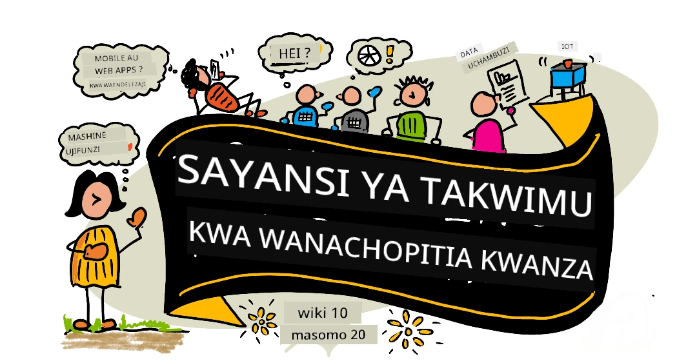
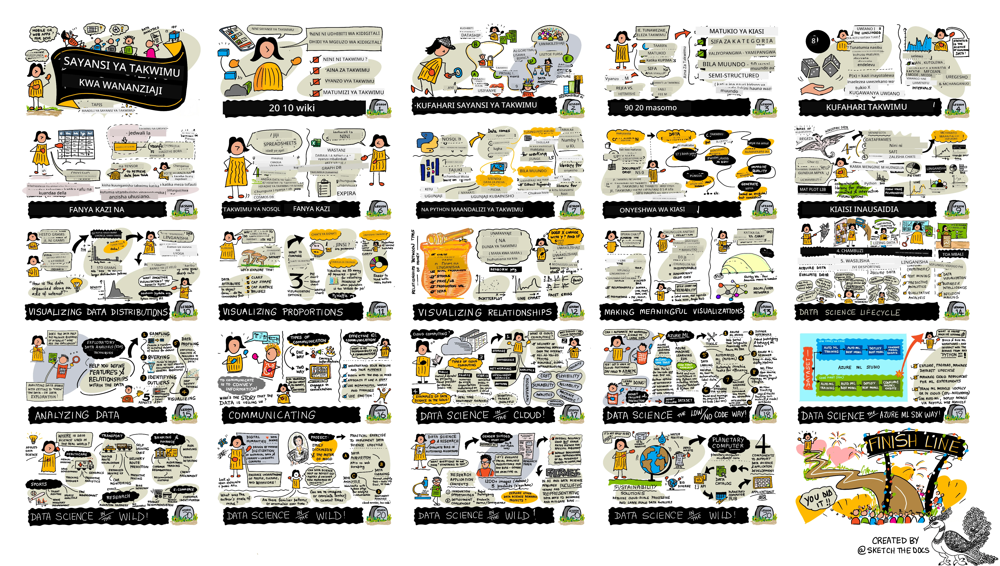

# Sayansi ya Data kwa Waanzilishi - Mtaala

[](https://github.com/codespaces/new?hide_repo_select=true&ref=main&repo=344191198)

[](https://github.com/microsoft/Data-Science-For-Beginners/blob/master/LICENSE)
[](https://GitHub.com/microsoft/Data-Science-For-Beginners/graphs/contributors/)
[](https://GitHub.com/microsoft/Data-Science-For-Beginners/issues/)
[](https://GitHub.com/microsoft/Data-Science-For-Beginners/pulls/)
[](http://makeapullrequest.com)

[](https://GitHub.com/microsoft/Data-Science-For-Beginners/watchers/)
[](https://GitHub.com/microsoft/Data-Science-For-Beginners/network/)
[](https://GitHub.com/microsoft/Data-Science-For-Beginners/stargazers/)


[](https://discord.gg/nTYy5BXMWG)

[](https://aka.ms/foundry/forum)

Watangazaji wa Wingu wa Azure huko Microsoft wanafurahia kutoa mtaala wa wiki 10, masomo 20 yote kuhusu Sayansi ya Data. Kila somo lina maswali kabla na baada ya somo, maelekezo yaliyoandikwa ya kumaliza somo, suluhisho, na kazi. Mbinu yetu ya kufundisha inayotegemea miradi inakuwezesha kujifunza huku ukiunda, njia iliyo thibitishwa kwa ujuzi mpya kuwa 'zeke'.

**Shukrani nyingi kwa waandishi wetu:** [Jasmine Greenaway](https://www.twitter.com/paladique), [Dmitry Soshnikov](http://soshnikov.com), [Nitya Narasimhan](https://twitter.com/nitya), [Jalen McGee](https://twitter.com/JalenMcG), [Jen Looper](https://twitter.com/jenlooper), [Maud Levy](https://twitter.com/maudstweets), [Tiffany Souterre](https://twitter.com/TiffanySouterre), [Christopher Harrison](https://www.twitter.com/geektrainer).

**🙏 Shukrani maalum 🙏 kwa waandishi wetu, wakaguzi na wachangiaji wa maudhui wa [Balozi wa Wanafunzi wa Microsoft](https://studentambassadors.microsoft.com/),** hasa Aaryan Arora, [Aditya Garg](https://github.com/AdityaGarg00), [Alondra Sanchez](https://www.linkedin.com/in/alondra-sanchez-molina/), [Ankita Singh](https://www.linkedin.com/in/ankitasingh007), [Anupam Mishra](https://www.linkedin.com/in/anupam--mishra/), [Arpita Das](https://www.linkedin.com/in/arpitadas01/), ChhailBihari Dubey, [Dibri Nsofor](https://www.linkedin.com/in/dibrinsofor), [Dishita Bhasin](https://www.linkedin.com/in/dishita-bhasin-7065281bb), [Majd Safi](https://www.linkedin.com/in/majd-s/), [Max Blum](https://www.linkedin.com/in/max-blum-6036a1186/), [Miguel Correa](https://www.linkedin.com/in/miguelmque/), [Mohamma Iftekher (Iftu) Ebne Jalal](https://twitter.com/iftu119), [Nawrin Tabassum](https://www.linkedin.com/in/nawrin-tabassum), [Raymond Wangsa Putra](https://www.linkedin.com/in/raymond-wp/), [Rohit Yadav](https://www.linkedin.com/in/rty2423), Samridhi Sharma, [Sanya Sinha](https://www.linkedin.com/mwlite/in/sanya-sinha-13aab1200),
[Sheena Narula](https://www.linkedin.com/in/sheena-narua-n/), [Tauqeer Ahmad](https://www.linkedin.com/in/tauqeerahmad5201/), Yogendrasingh Pawar , [Vidushi Gupta](https://www.linkedin.com/in/vidushi-gupta07/), [Jasleen Sondhi](https://www.linkedin.com/in/jasleen-sondhi/)

||
|:---:|
| Sayansi ya Data kwa Waanzilishi - _Sketchnote na [@nitya](https://twitter.com/nitya)_ |

### 🌐 Msaada wa Lugha Nyingi

#### Inasaidiwa kupitia GitHub Action (Automatiki & Huduma Daima za Hali ya Juu)

<!-- CO-OP TRANSLATOR LANGUAGES TABLE START -->
[Arabic](../ar/README.md) | [Bengali](../bn/README.md) | [Bulgarian](../bg/README.md) | [Burmese (Myanmar)](../my/README.md) | [Chinese (Simplified)](../zh-CN/README.md) | [Chinese (Traditional, Hong Kong)](../zh-HK/README.md) | [Chinese (Traditional, Macau)](../zh-MO/README.md) | [Chinese (Traditional, Taiwan)](../zh-TW/README.md) | [Croatian](../hr/README.md) | [Czech](../cs/README.md) | [Danish](../da/README.md) | [Dutch](../nl/README.md) | [Estonian](../et/README.md) | [Finnish](../fi/README.md) | [French](../fr/README.md) | [German](../de/README.md) | [Greek](../el/README.md) | [Hebrew](../he/README.md) | [Hindi](../hi/README.md) | [Hungarian](../hu/README.md) | [Indonesian](../id/README.md) | [Italian](../it/README.md) | [Japanese](../ja/README.md) | [Kannada](../kn/README.md) | [Khmer](../km/README.md) | [Korean](../ko/README.md) | [Lithuanian](../lt/README.md) | [Malay](../ms/README.md) | [Malayalam](../ml/README.md) | [Marathi](../mr/README.md) | [Nepali](../ne/README.md) | [Nigerian Pidgin](../pcm/README.md) | [Norwegian](../no/README.md) | [Persian (Farsi)](../fa/README.md) | [Polish](../pl/README.md) | [Portuguese (Brazil)](../pt-BR/README.md) | [Portuguese (Portugal)](../pt-PT/README.md) | [Punjabi (Gurmukhi)](../pa/README.md) | [Romanian](../ro/README.md) | [Russian](../ru/README.md) | [Serbian (Cyrillic)](../sr/README.md) | [Slovak](../sk/README.md) | [Slovenian](../sl/README.md) | [Spanish](../es/README.md) | [Swahili](./README.md) | [Swedish](../sv/README.md) | [Tagalog (Filipino)](../tl/README.md) | [Tamil](../ta/README.md) | [Telugu](../te/README.md) | [Thai](../th/README.md) | [Turkish](../tr/README.md) | [Ukrainian](../uk/README.md) | [Urdu](../ur/README.md) | [Vietnamese](../vi/README.md)

> **Unapendelea Kurejesha Kwenye Kompyuta?**
>
> Hifadhi hii ina tafsiri za lugha 50+ ambazo huongeza sana ukubwa wa kupakua. Ili kurejesha bila tafsiri, tumia sparse checkout:
>
> **Bash / macOS / Linux:**
> ```bash
> git clone --filter=blob:none --sparse https://github.com/microsoft/Data-Science-For-Beginners.git
> cd Data-Science-For-Beginners
> git sparse-checkout set --no-cone '/*' '!translations' '!translated_images'
> ```
>
> **CMD (Windows):**
> ```cmd
> git clone --filter=blob:none --sparse https://github.com/microsoft/Data-Science-For-Beginners.git
> cd Data-Science-For-Beginners
> git sparse-checkout set --no-cone "/*" "!translations" "!translated_images"
> ```
>
> Hii inakupa kila unachohitaji ili kumaliza kozi kwa upakuaji wa haraka zaidi.
<!-- CO-OP TRANSLATOR LANGUAGES TABLE END -->

**Ikiwa unataka msaada wa lugha za tafsiri za ziada ziko [hapa](https://github.com/Azure/co-op-translator/blob/main/getting_started/supported-languages.md)**

#### Jiunge na Jamii Yetu  
[](https://discord.gg/nTYy5BXMWG)

Tuna mfululizo wa kujifunza kwa AI kwenye Discord unaoendelea, jifunze zaidi na ujiunge nasi kwenye [Learn with AI Series](https://aka.ms/learnwithai/discord) kuanzia tarehe 18 - 30 Septemba, 2025. Utapata vidokezo na mbinu za kutumia GitHub Copilot kwa Sayansi ya Data.


# Je, wewe ni mwanafunzi?

Anza na rasilimali zifuatazo:

- [Ukubwa wa Mwanafunzi](https://docs.microsoft.com/en-gb/learn/student-hub?WT.mc_id=academic-77958-bethanycheum) Ukurasa huu, utapata rasilimali za waanzilishi, vifurushi vya wanafunzi na hata njia za kupata risiti ya cheti bila malipo. Huu ni ukurasa unaotakiwa kuuweka alama na kuangalia mara kwa mara kadri tunavyobadilisha maudhui angalau kila mwezi.
- [Balozi wa Wanafunzi wa Microsoft](https://studentambassadors.microsoft.com?WT.mc_id=academic-77958-bethanycheum) Jiunge na jamii ya kimataifa ya mabalozi wa wanafunzi, hii inaweza kuwa njia yako ya kuingia Microsoft.

# Kuanzia

## 📚 Nyaraka

- **[Mwongozo wa Usanidi](INSTALLATION.md)** - Maelekezo hatua kwa hatua kwa waanzilishi
- **[Mwongozo wa Matumizi](USAGE.md)** - Mifano na michakato ya kawaida
- **[Matatizo na Ufumbuzi](TROUBLESHOOTING.md)** - Suluhisho za matatizo ya kawaida
- **[Mwongozo wa Kuchangia](CONTRIBUTING.md)** - Jinsi ya kuchangia mradi huu
- **[Kwa Walimu](for-teachers.md)** - Mwongozo wa kufundisha na rasilimali za darasani

## 👨‍🎓 Kwa Wanafunzi
> **Waanzilishi Kamili**: Mpya katika sayansi ya data? Anza na [mifano rafiki kwa waanzilishi](examples/README.md)! Mifano hii rahisi, yenye maelezo itasaidia kuelewa misingi kabla ya kuingia mtaala mzima.
> **[Wanafunzi](https://aka.ms/student-page)**: kutumia mtaala huu peke yako, tengeneza fork ya repo yote na maliza mazoezi peke yako, kuanzia na mtihani wa kabla ya mihadhara. Kisha soma mihadhara na maliza shughuli zote nyingine. Jaribu kuunda miradi kwa kuelewa masomo badala ya kunakili msimbo wa suluhisho; hata hivyo, msimbo huo upo kwenye folda za /solutions katika kila somo linalolenga mradi. Wazo jingine ni kuunda kikundi cha masomo na marafiki na kusoma maudhui pamoja. Kwa masomo zaidi, tunapendekeza [Microsoft Learn](https://docs.microsoft.com/en-us/users/jenlooper-2911/collections/qprpajyoy3x0g7?WT.mc_id=academic-77958-bethanycheum).

**Anza Haraka:**
1. Angalia [Mwongozo wa Usanidi](INSTALLATION.md) kuweka mazingira yako
2. Pitia [Mwongozo wa Matumizi](USAGE.md) kujifunza jinsi ya kutumia mtaala
3. Anza na Somo la 1 na fuata mtiririko
4. Jiunge na [jamii yetu ya Discord](https://aka.ms/ds4beginners/discord) kwa msaada

## 👩‍🏫 Kwa Walimu
> **Walimu**: tumekuwa [tukijumuisha mapendekezo kadhaa](for-teachers.md) juu ya jinsi ya kutumia mtaala huu. Tunapenda maoni yako [katika jukwaa letu la majadiliano](https://github.com/microsoft/Data-Science-For-Beginners/discussions)!

## Kutana na Timu

[](https://youtu.be/8mzavjQSMM4 "Video ya matangazo")

**Gif na** [Mohit Jaisal](https://www.linkedin.com/in/mohitjaisal)

> 🎥 Bonyeza picha hapo juu kwa video kuhusu mradi na watu waliouunda!

## Pedagogia

Tumechagua kanuni mbili za kielimu tunapojenga mtaala huu: kuhakikisha kuwa unategemea miradi na unajumuisha maswali ya mara kwa mara. Mwishoni mwa mfululizo huu, wanafunzi watakuwa wamejifunza kanuni za msingi za sayansi ya data, zikiwemo dhana za maadili, maandalizi ya data, njia mbalimbali za kufanya kazi na data, taswira ya data, uchambuzi wa data, matumizi halisi ya sayansi ya data, na zaidi.

Aidha, mtihani wa chini kabla ya darasa huweka nia ya mwanafunzi kuelekea kujifunza mada, wakati mtihani wa pili baada ya darasa huhakikishia kumbukumbu zaidi. Mtaala huu umeundwa kuwa rahisi na wa kufurahisha na unaweza kuchukuliwa kwa jumla au sehemu. Miradi huanza ndogo na huongezeka ugumu mwishoni mwa mzunguko wa wiki 10.

> Tafuta [Kanuni Yetu za Maadili](CODE_OF_CONDUCT.md), [Mchango](CONTRIBUTING.md), [Mwongozo wa Tafsiri](TRANSLATIONS.md). Tunakaribisha mrejesho wako wa kujenga!

## Kila somo linajumuisha:

- Sketchnote hiari
- Video ya ziada hiari
- Mtihani wa kuwasha moto kabla ya somo
- Somo lililoandikwa
- Kwa masomo yanayotegemea miradi, miongozo ya hatua kwa hatua juu ya jinsi ya kujenga mradi
- Ukaguzi wa maarifa
- Changamoto
- Kusoma zaidi
- Kazi ya nyumbani
- [Mtihani baada ya somo](https://ff-quizzes.netlify.app/en/)

> **Kumbuka kuhusu mitihani**: Mitihani yote iko katika folda ya Quiz-App, kwa jumla ya mitihani 40 yenye maswali matatu kila moja. Zimeunganishwa kutoka ndani ya masomo, lakini programu ya mtihani inaweza kuendeshwa kwa ndani au kuhamishwa Azure; fuata maelekezo katika folda ya `quiz-app`. Zinatafutwa kwa lugha nyingine polepole.

## 🎓 Mifano Rahisi kwa Waanziaji

**Mpya katika Sayansi ya Data?** Tumeunda [folda ya mifano](examples/README.md) yenye msimbo rahisi uliobainishwa vizuri kusaidia kuanza:

- 🌟 **Hello World** - Programu yako ya kwanza ya sayansi ya data
- 📂 **Kupakia Data** - Jifunze kusoma na kuchunguza seti za data
- 📊 **Uchambuzi Rahisi** - Hesabu takwimu na pata mifumo
- 📈 **Taswira za Msingi** - Tengeneza chati na michoro
- 🔬 **Mradi Halisi** - Mtiririko kamili kutoka mwanzo hadi mwisho

Kila mfano unajumuisha maelezo ya kina yanayoelezea kila hatua, kufanya iwe kamili kwa waanziaji kabisa!

👉 **[Anza na mifano](examples/README.md)** 👈

## Masomo


||
|:---:|
| Sayansi ya Data kwa Waanziaji: Ramani ya Njia - _Sketchnote na [@nitya](https://twitter.com/nitya)_ |


| Nambari ya Somo | Mada | Kikundi cha Somo | Malengo ya Kujifunza | Somo Lililounganishwa | Mwandishi |
| :-----------: | :----------------------------------------: | :--------------------------------------------------: | :-----------------------------------------------------------------------------------------------------------------------------------------------------------------------: | :---------------------------------------------------------------------: | :----: |
| 01 | Kuelezea Sayansi ya Data | [Utangulizi](1-Introduction/README.md) | Jifunze dhana za msingi nyuma ya sayansi ya data na jinsi inavyohusiana na akili bandia, ujifunzaji wa mashine, na data kubwa. | [somo](1-Introduction/01-defining-data-science/README.md) [video](https://youtu.be/beZ7Mb_oz9I) | [Dmitry](http://soshnikov.com) |
| 02 | Maadili ya Sayansi ya Data | [Utangulizi](1-Introduction/README.md) | Dhana za Maadili ya Data, Changamoto & Mifumo. | [somo](1-Introduction/02-ethics/README.md) | [Nitya](https://twitter.com/nitya) |
| 03 | Kuelezea Data | [Utangulizi](1-Introduction/README.md) | Jinsi data inavyopangwa na vyanzo vyake vya kawaida. | [somo](1-Introduction/03-defining-data/README.md) | [Jasmine](https://www.twitter.com/paladique) |
| 04 | Utangulizi wa Takwimu & Uwezekano | [Utangulizi](1-Introduction/README.md) | Mbinu za kihisabati za uwezekano na takwimu kuelewa data. | [somo](1-Introduction/04-stats-and-probability/README.md) [video](https://youtu.be/Z5Zy85g4Yjw) | [Dmitry](http://soshnikov.com) |
| 05 | Kufanya kazi na Data ya Uhusiano | [Kufanya kazi na Data](2-Working-With-Data/README.md) | Utangulizi wa data ya uhusiano na misingi ya kuchunguza na kuchambua data ya uhusiano kwa kutumia Lugha Iliyo na Muundo wa Maombi, pia inajulikana kama SQL (inatamkwa “see-quell”). | [somo](2-Working-With-Data/05-relational-databases/README.md) | [Christopher](https://www.twitter.com/geektrainer) | | |
| 06 | Kufanya kazi na Data isiyo ya NoSQL | [Kufanya kazi na Data](2-Working-With-Data/README.md) | Utangulizi wa data isiyo ya uhusiano, aina zake mbalimbali na misingi ya kuchunguza na kuchambua hifadhidata za hati. | [somo](2-Working-With-Data/06-non-relational/README.md) | [Jasmine](https://twitter.com/paladique)|
| 07 | Kufanya kazi na Python | [Kufanya kazi na Data](2-Working-With-Data/README.md) | Misingi ya kutumia Python kwa uchunguzi wa data na maktaba kama Pandas. Uelewa wa msingi wa programu ya Python unashauriwa. | [somo](2-Working-With-Data/07-python/README.md) [video](https://youtu.be/dZjWOGbsN4Y) | [Dmitry](http://soshnikov.com) |
| 08 | Maandalizi ya Data | [Kufanya kazi na Data](2-Working-With-Data/README.md) | Mada juu ya mbinu za kusafisha na kubadilisha data kushughulikia changamoto za data ambayo haipo, si sahihi, au haijakamilika. | [somo](2-Working-With-Data/08-data-preparation/README.md) | [Jasmine](https://www.twitter.com/paladique) |
| 09 | Kutoa Taswira za Kiasi | [Taswira ya Data](3-Data-Visualization/README.md) | Jifunze jinsi ya kutumia Matplotlib kutoa taswira za data za ndege 🦆 | [somo](3-Data-Visualization/09-visualization-quantities/README.md) | [Jen](https://twitter.com/jenlooper) |
| 10 | Kutoa Taswira za Usambazaji wa Data | [Taswira ya Data](3-Data-Visualization/README.md) | Kuonyesha maoni na mwelekeo ndani ya kipindi. | [somo](3-Data-Visualization/10-visualization-distributions/README.md) | [Jen](https://twitter.com/jenlooper) |
| 11 | Kutoa Taswira za Sehemu | [Taswira ya Data](3-Data-Visualization/README.md) | Kuonyesha asilimia zilizo peekee na zilizogawanyika. | [somo](3-Data-Visualization/11-visualization-proportions/README.md) | [Jen](https://twitter.com/jenlooper) |
| 12 | Kutoa Taswira za Uhusiano | [Taswira ya Data](3-Data-Visualization/README.md) | Kuonyesha muunganisho na uhusiano kati ya seti za data na vigezo vyake. | [somo](3-Data-Visualization/12-visualization-relationships/README.md) | [Jen](https://twitter.com/jenlooper) |
| 13 | Taswira Zenye Maana | [Taswira ya Data](3-Data-Visualization/README.md) | Mbinu na miongozo ya kufanya taswira zako kuwa na thamani kwa utatuzi mzuri wa matatizo na maarifa. | [somo](3-Data-Visualization/13-meaningful-visualizations/README.md) | [Jen](https://twitter.com/jenlooper) |
| 14 | Utangulizi wa Mzunguko wa Maisha wa Sayansi ya Data | [Mzunguko wa Maisha](4-Data-Science-Lifecycle/README.md) | Utangulizi wa mzunguko wa maisha ya sayansi ya data na hatua yake ya kwanza ya kupata na kutoa data. | [somo](4-Data-Science-Lifecycle/14-Introduction/README.md) | [Jasmine](https://twitter.com/paladique) |
| 15 | Kuchambua | [Mzunguko wa Maisha](4-Data-Science-Lifecycle/README.md) | Awamu hii ya mzunguko wa maisha ya sayansi ya data inazingatia mbinu za kuchambua data. | [somo](4-Data-Science-Lifecycle/15-analyzing/README.md) | [Jasmine](https://twitter.com/paladique) | | |
| 16 | Mawasiliano | [Mzunguko wa Maisha](4-Data-Science-Lifecycle/README.md) | Awamu hii ya mzunguko wa maisha ya sayansi ya data inazingatia kuwasilisha maarifa kutoka kwa data kwa njia ambayo inarahisisha watoa maamuzi kuelewa. | [somo](4-Data-Science-Lifecycle/16-communication/README.md) | [Jalen](https://twitter.com/JalenMcG) | | |
| 17 | Sayansi ya Data Katika Wingu | [Data Wingu](5-Data-Science-In-Cloud/README.md) | Mfululizo huu wa masomo utanguliza sayansi ya data katika wingu na faida zake. | [somo](5-Data-Science-In-Cloud/17-Introduction/README.md) | [Tiffany](https://twitter.com/TiffanySouterre) na [Maud](https://twitter.com/maudstweets) |
| 18 | Sayansi ya Data Katika Wingu | [Data Wingu](5-Data-Science-In-Cloud/README.md) | Mafunzo ya modeli kwa kutumia zana za Low Code. |[somo](5-Data-Science-In-Cloud/18-Low-Code/README.md) | [Tiffany](https://twitter.com/TiffanySouterre) na [Maud](https://twitter.com/maudstweets) |
| 19 | Sayansi ya Data Katika Wingu | [Data Wingu](5-Data-Science-In-Cloud/README.md) | Kuweka modeli kwa kutumia Azure Machine Learning Studio. | [somo](5-Data-Science-In-Cloud/19-Azure/README.md)| [Tiffany](https://twitter.com/TiffanySouterre) na [Maud](https://twitter.com/maudstweets) |
| 20 | Sayansi ya Data Katika Maisha Halisi | [Maisha Halisi](6-Data-Science-In-Wild/README.md) | Miradi inayoendeshwa na sayansi ya data katika dunia halisi. | [somo](6-Data-Science-In-Wild/20-Real-World-Examples/README.md) | [Nitya](https://twitter.com/nitya) |

## GitHub Codespaces

Fuata hatua hizi kufungua sampuli hii kwenye Codespace:
1. Bonyeza menyu ya Code chini na chagua chaguo la Open with Codespaces.
2. Chagua + New codespace chini kwenye dirisha.
Kwa habari zaidi, angalia [nyaraka za GitHub](https://docs.github.com/en/codespaces/developing-in-codespaces/creating-a-codespace-for-a-repository#creating-a-codespace).

## VSCode Remote - Containers
Fuata hatua hizi kufungua repo hii ndani ya kontena kwa kutumia mashine yako ya ndani na VSCode kwa kutumia nyongeza ya VS Code Remote - Containers:

1. Ikiwa huu ndiyo mara yako ya kwanza kutumia kontena ya maendeleo, tafadhali hakikisha mfumo wako unakidhi mahitaji (yaani kuwa na Docker imewekwa) katika [nyaraka za kuanza](https://code.visualstudio.com/docs/devcontainers/containers#_getting-started).

Ili kutumia hifadhidata hii, unaweza kufungua hifadhidata katika volumu ya Docker iliyotengwa:

**Kumbuka**: Ndani ndani, itatumia amri ya Remote-Containers: **Clone Repository in Container Volume...** kunakili msimbo wa chanzo kwenye volumu ya Docker badala ya mfumo wa faili wa ndani. [Volumu](https://docs.docker.com/storage/volumes/) ndio njia inayopendekezwa kuhifadhi data ya kontena.

Au fungua toleo lililoklonwa au kupakuliwa la hifadhidata:

- Klona hifadhidata hii kwenye mfumo wako wa faili wa ndani.
- Bonyeza F1 na chagua amri ya **Remote-Containers: Open Folder in Container...**.
- Chagua nakala ya folda hii iliyoklonwa, subiri kontena iaanze, na jaribu mambo.

## Upatikanaji wa Offline

Unaweza kuendesha nyaraka hizi offline kwa kutumia [Docsify](https://docsify.js.org/#/). Fanya fork kwa repo hii, [weka Docsify](https://docsify.js.org/#/quickstart) kwenye mashine yako ya ndani, kisha kwenye folda ya mzizi ya repo hii, andika `docsify serve`. Tovuti itahudumiwa kwenye bandari 3000 kwenye localhost yako: `localhost:3000`.

> Kumbuka, daftari hazitaonyeshwa kupitia Docsify, hivyo unapotaka kuendesha daftari, fanya hivyo kwa tofauti ndani ya VS Code ukiendesha kernel ya Python.

## Mitaala Mengine

Timu yetu hutengeneza mitaala mingine! Angalia:

<!-- CO-OP TRANSLATOR OTHER COURSES START -->
### LangChain
[](https://aka.ms/langchain4j-for-beginners)
[](https://aka.ms/langchainjs-for-beginners?WT.mc_id=m365-94501-dwahlin)
[](https://github.com/microsoft/langchain-for-beginners?WT.mc_id=m365-94501-dwahlin)
---

### Azure / Edge / MCP / Wakala
[](https://github.com/microsoft/AZD-for-beginners?WT.mc_id=academic-105485-koreyst)
[](https://github.com/microsoft/edgeai-for-beginners?WT.mc_id=academic-105485-koreyst)
[](https://github.com/microsoft/mcp-for-beginners?WT.mc_id=academic-105485-koreyst)
[](https://github.com/microsoft/ai-agents-for-beginners?WT.mc_id=academic-105485-koreyst)

---
 
### Mfululizo wa AI Inayotengeneza
[](https://github.com/microsoft/generative-ai-for-beginners?WT.mc_id=academic-105485-koreyst)
[-9333EA?style=for-the-badge&labelColor=E5E7EB&color=9333EA)](https://github.com/microsoft/Generative-AI-for-beginners-dotnet?WT.mc_id=academic-105485-koreyst)
[-C084FC?style=for-the-badge&labelColor=E5E7EB&color=C084FC)](https://github.com/microsoft/generative-ai-for-beginners-java?WT.mc_id=academic-105485-koreyst)
[-E879F9?style=for-the-badge&labelColor=E5E7EB&color=E879F9)](https://github.com/microsoft/generative-ai-with-javascript?WT.mc_id=academic-105485-koreyst)

---
 
### Mafunzo ya Msingi
[](https://aka.ms/ml-beginners?WT.mc_id=academic-105485-koreyst)
[](https://aka.ms/datascience-beginners?WT.mc_id=academic-105485-koreyst)
[](https://aka.ms/ai-beginners?WT.mc_id=academic-105485-koreyst)
[](https://github.com/microsoft/Security-101?WT.mc_id=academic-96948-sayoung)
[](https://aka.ms/webdev-beginners?WT.mc_id=academic-105485-koreyst)
[](https://aka.ms/iot-beginners?WT.mc_id=academic-105485-koreyst)
[](https://github.com/microsoft/xr-development-for-beginners?WT.mc_id=academic-105485-koreyst)

---
 
### Mfululizo wa Copilot
[](https://aka.ms/GitHubCopilotAI?WT.mc_id=academic-105485-koreyst)
[](https://github.com/microsoft/mastering-github-copilot-for-dotnet-csharp-developers?WT.mc_id=academic-105485-koreyst)
[](https://github.com/microsoft/CopilotAdventures?WT.mc_id=academic-105485-koreyst)
<!-- CO-OP TRANSLATOR OTHER COURSES END -->

## Kupata Msaada

**Unakumbana na matatizo?** Angalia [Mwongozo wa Utatuzi wa Matatizo](TROUBLESHOOTING.md) kwa suluhisho za matatizo ya kawaida.

Kama unakumbwa au una maswali yeyote kuhusu kujenga programu za AI. Jiunge na wanafunzi wenzako na watengenezaji wenye uzoefu katika mijadala kuhusu MCP. Ni jamii yenye msaada ambapo maswali yanakaribishwa na maarifa yanasambazwa kwa uhuru.

[](https://discord.gg/nTYy5BXMWG)

Kama una maoni kuhusu bidhaa au makosa wakati wa kujenga tembelea:

[](https://aka.ms/foundry/forum)

---

<!-- CO-OP TRANSLATOR DISCLAIMER START -->
**Tangazo la Kukataa**:
Hati hii imetafsiriwa kwa kutumia huduma ya tafsiri ya AI [Co-op Translator](https://github.com/Azure/co-op-translator). Wakati tunajitahidi kwa usahihi, tafadhali fahamu kwamba tafsiri za kiotomatiki zinaweza kuwa na makosa au upungufu wa usahihi. Hati ya asili kwa lugha yake ya mzazi inapaswa kuzingatiwa kama chanzo cha mamlaka. Kwa habari muhimu, tafsiri ya kitaalamu inayofanywa na binadamu inapendekezwa. Sisi hatuwezi kuwajibika kwa maelezo yasiyoeleweka au tafsiri mbaya zinazotokana na matumizi ya tafsiri hii.
<!-- CO-OP TRANSLATOR DISCLAIMER END -->