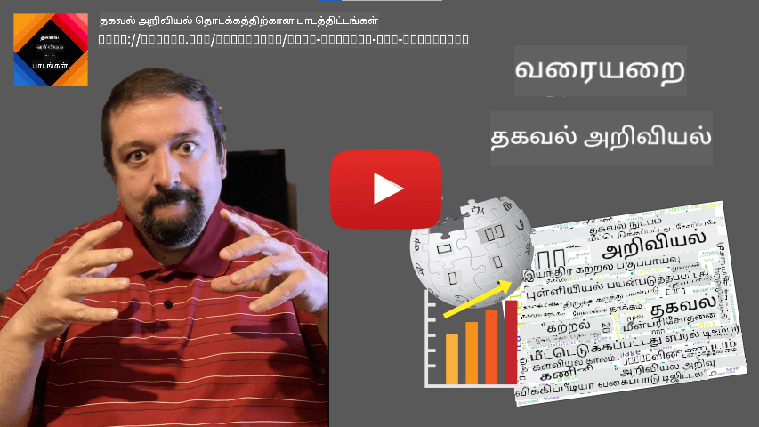
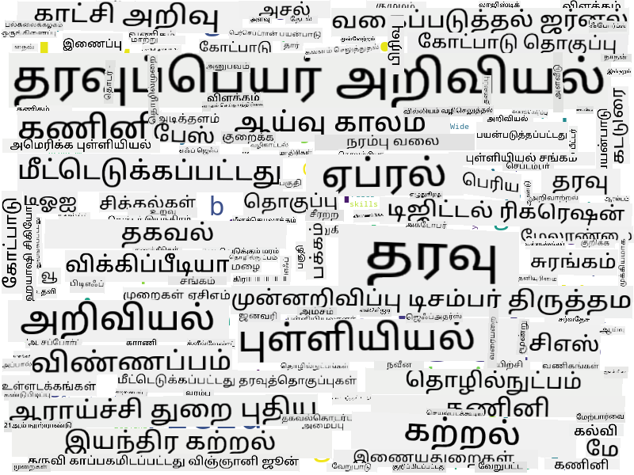

<!--
CO_OP_TRANSLATOR_METADATA:
{
  "original_hash": "a76ab694b1534fa57981311975660bfe",
  "translation_date": "2025-10-11T15:32:38+00:00",
  "source_file": "1-Introduction/01-defining-data-science/README.md",
  "language_code": "ta"
}
-->
# தரவியல் அறிவியல் வரையறை

|  ](../../sketchnotes/01-Definitions.png) |
| :----------------------------------------------------------------------------------------------------: |
|              தரவியல் அறிவியல் வரையறை - _Sketchnote by [@nitya](https://twitter.com/nitya)_               |

---

## [முன்-வகுப்பு வினாடி வினா](https://ff-quizzes.netlify.app/en/ds/quiz/0)

## தரவு என்றால் என்ன?
நாம் தினசரி வாழ்க்கையில் எப்போதும் தரவால் சூழப்பட்டிருக்கிறோம். நீங்கள் இப்போது படிக்கும் உரை தரவாகும். உங்கள் ஸ்மார்ட்போனில் உள்ள நண்பர்களின் தொலைபேசி எண்களின் பட்டியல் தரவாகும், மேலும் உங்கள் கடிகாரத்தில் காட்டப்படும் தற்போதைய நேரமும் தரவாகும். மனிதர்களாகிய நாம் இயல்பாகவே பணத்தை எண்ணுவதன் மூலம் அல்லது நண்பர்களுக்கு கடிதங்களை எழுதுவதன் மூலம் தரவுடன் செயல்படுகிறோம்.

ஆனால், கணினிகள் உருவாக்கப்பட்ட பிறகு தரவின் முக்கியத்துவம் அதிகரித்தது. கணினிகளின் முதன்மை பங்கு கணக்கீடுகளைச் செய்யும் என்பதுதான், ஆனால் அவை செயல்பட தரவைத் தேவைப்படும். எனவே, கணினிகள் தரவை எவ்வாறு சேமிக்கின்றன மற்றும் செயல்படுத்துகின்றன என்பதை நாம் புரிந்துகொள்ள வேண்டும்.

இணையம் தோன்றிய பிறகு, தரவைக் கையாளும் சாதனங்களாக கணினிகளின் பங்கு அதிகரித்தது. நீங்கள் சிந்தித்தால், கணினிகளை நாம் கணக்கீடுகளுக்காக அல்லாமல் தரவின் செயலாக்கம் மற்றும் தொடர்புக்கு அதிகமாகப் பயன்படுத்துகிறோம். நண்பருக்கு மின்னஞ்சல் எழுதும்போது அல்லது இணையத்தில் தகவலைத் தேடும்போது - நாம் தரவை உருவாக்கி, சேமித்து, பரிமாறி, மாற்றுகிறோம்.
> நீங்கள் கடைசியாக கணினிகளை உண்மையில் ஏதேனும் கணக்கீடு செய்ய பயன்படுத்திய நேரத்தை நினைவுபடுத்த முடியுமா?

## தரவியல் அறிவியல் என்றால் என்ன?

[விக்கிப்பீடியாவில்](https://en.wikipedia.org/wiki/Data_science), **தரவியல் அறிவியல்** *கட்டமைக்கப்பட்ட மற்றும் கட்டமைக்கப்படாத தரவிலிருந்து அறிவு மற்றும் உள்ளடக்கங்களை அறிவியல் முறைகளைப் பயன்படுத்தி எடுக்கவும், மற்றும் பல்வேறு பயன்பாட்டு துறைகளில் தரவிலிருந்து அறிவு மற்றும் செயல்படக்கூடிய உள்ளடக்கங்களைப் பயன்படுத்தவும்* ஒரு அறிவியல் துறையாக வரையறுக்கப்பட்டுள்ளது.

இந்த வரையறை தரவியல் அறிவியலின் முக்கிய அம்சங்களை விளக்குகிறது:

* தரவியல் அறிவியலின் முக்கிய நோக்கம் **அறிவை எடுப்பது** என்பது, மற்றொரு வார்த்தையில் - **தரவைப் புரிந்துகொள்வது**, சில மறைக்கப்பட்ட உறவுகளை கண்டறிதல் மற்றும் **மாதிரியை** உருவாக்குதல்.
* தரவியல் அறிவியல் **அறிவியல் முறைகளை** பயன்படுத்துகிறது, உதாரணமாக, சாத்தியக்கூறுகள் மற்றும் புள்ளியியல். *தரவியல் அறிவியல்* என்ற சொல் முதலில் அறிமுகப்படுத்தப்பட்டபோது, சிலர் தரவியல் அறிவியல் என்பது புள்ளியியல் என்ற புதிய அழகான பெயர் மட்டுமே என்று வாதிட்டனர். இன்று இந்த துறை மிகவும் பரந்தது என்பது தெளிவாகிவிட்டது.
* பெறப்பட்ட அறிவு சில **செயல்படக்கூடிய உள்ளடக்கங்களை** உருவாக்க பயன்படுத்தப்பட வேண்டும், அதாவது நீங்கள் உண்மையான வணிக சூழல்களில் பயன்படுத்தக்கூடிய நடைமுறை உள்ளடக்கங்கள்.
* நாங்கள் **கட்டமைக்கப்பட்ட** மற்றும் **கட்டமைக்கப்படாத** தரவுகளில் செயல்பட வேண்டும். இந்த பாடநெறியில் பின்னர் தரவின் வெவ்வேறு வகைகளைப் பற்றி விவாதிக்க வருவோம்.
* **பயன்பாட்டு துறை** என்பது ஒரு முக்கிய கருத்தாகும், மேலும் தரவியல் விஞ்ஞானிகள் பிரச்சினைத் துறையில் குறைந்தபட்சம் சில அளவிலான நிபுணத்துவத்தைப் பெற வேண்டும், உதாரணமாக: நிதி, மருத்துவம், சந்தைப்படுத்தல், போன்றவை.

> தரவியல் அறிவியலின் மற்றொரு முக்கிய அம்சம், தரவை கணினிகளைப் பயன்படுத்தி எவ்வாறு சேகரிக்க, சேமிக்க மற்றும் செயல்படுத்த முடியும் என்பதைப் படிக்கிறது. புள்ளியியல் எங்களுக்கு கணித அடிப்படைகளை வழங்குகிறது, தரவியல் அறிவியல் கணிதக் கருத்துகளைப் பயன்படுத்தி தரவிலிருந்து உண்மையில் உள்ளடக்கங்களை வரையறுக்கிறது.

[ஜிம் கிரே](https://en.wikipedia.org/wiki/Jim_Gray_(computer_scientist)) என்பவரால் வழங்கப்பட்ட ஒரு வழியில், தரவியல் அறிவியலை ஒரு தனி அறிவியல் பரடிகமாகக் கருதலாம்:
* **அறிவியல்**, இதில் நாம் முக்கியமாக கண்காணிப்புகள் மற்றும் பரிசோதனைகளின் முடிவுகளை நம்புகிறோம்
* **கோட்பாட்டியல்**, இதில் புதிய கருத்துக்கள் ஏற்கனவே உள்ள அறிவியல் அறிவிலிருந்து தோன்றுகின்றன
* **கணினி சார்ந்த**, இதில் சில கணினி பரிசோதனைகளின் அடிப்படையில் புதிய கொள்கைகளை கண்டறிகிறோம்
* **தரவை அடிப்படையாகக் கொண்ட**, தரவிலுள்ள உறவுகள் மற்றும் முறைமைகளை கண்டறிவது

## தொடர்புடைய துறைகள்

தரவு எங்கும் பரவலாக இருப்பதால், தரவியல் அறிவியல் தானாகவே பல துறைகளைத் தொடும் பரந்த துறையாகும்.

<dl>
<dt>தரவுத்தொகுப்புகள்</dt>
<dd>
ஒரு முக்கியமான கருத்து **தரவை எவ்வாறு சேமிப்பது**, அதாவது அதை வேகமாக செயலாக்க அனுமதிக்கும் வகையில் அமைப்பது. கட்டமைக்கப்பட்ட மற்றும் கட்டமைக்கப்படாத தரவைச் சேமிக்கும் பல்வேறு வகையான தரவுத்தொகுப்புகள் உள்ளன, <a href="../../2-Working-With-Data/README.md">நாம் இந்த பாடநெறியில் இதைப் பற்றி விவாதிக்கப் போகிறோம்</a>.
</dd>
<dt>பெரிய தரவு</dt>
<dd>
சாதாரணமான அமைப்புடன் மிகப்பெரிய அளவிலான தரவைச் சேமிக்கவும் செயலாக்கவும் நமக்கு அடிக்கடி தேவைப்படும். அந்த தரவை கணினி குழுமத்தில் பகிர்ந்த முறையில் சேமிக்கவும், திறமையாக செயலாக்கவும் சிறப்பு அணுகுமுறைகள் மற்றும் கருவிகள் உள்ளன.
</dd>
<dt>இயந்திரக் கற்றல்</dt>
<dd>
தரவைப் புரிந்துகொள்ள ஒரு வழி **மாதிரியை உருவாக்குவது**, இது விரும்பிய முடிவை முன்னறிவிக்க முடியும். தரவிலிருந்து மாதிரிகளை உருவாக்குவது **இயந்திரக் கற்றல்** என்று அழைக்கப்படுகிறது. இதைப் பற்றி மேலும் அறிய, <a href="https://aka.ms/ml-beginners">இயந்திரக் கற்றல் தொடக்கத்திற்கான பாடநெறியை</a> பாருங்கள்.
</dd>
<dt>கோட்பாட்டு நுண்ணறிவு</dt>
<dd>
இயந்திரக் கற்றலின் ஒரு பகுதி, கோட்பாட்டு நுண்ணறிவு (AI) என்று அழைக்கப்படுகிறது, இது தரவை நம்புகிறது, மேலும் மனித சிந்தனை செயல்முறைகளைப் பின்பற்றும் உயர் சிக்கலான மாதிரிகளை உருவாக்குவதில் ஈடுபடுகிறது. AI முறைகள் அடிக்கடி கட்டமைக்கப்படாத தரவை (உதாரணமாக, இயற்கை மொழி) கட்டமைக்கப்பட்ட உள்ளடக்கங்களாக மாற்ற அனுமதிக்கின்றன.
</dd>
<dt>காட்சிப்படுத்தல்</dt>
<dd>
மிகப்பெரிய அளவிலான தரவை மனிதனுக்கு புரிந்துகொள்ள முடியாது, ஆனால் அந்த தரத்தைப் பயன்படுத்தி பயனுள்ள காட்சிப்படுத்தல்களை உருவாக்கிய பிறகு, நாம் தரவைப் பற்றி மேலும் புரிந்துகொண்டு சில முடிவுகளை எடுக்க முடியும். எனவே, தகவலை காட்சிப்படுத்த பல வழிகளை அறிந்திருப்பது முக்கியம் - இது <a href="../../3-Data-Visualization/README.md">பகுதி 3</a> இல் நாம் கற்றுக்கொள்ளப் போகிறோம். தொடர்புடைய துறைகள் **தகவல் வரைபடங்கள்**, மற்றும் **மனித-கணினி தொடர்பு** ஆகியவற்றை உள்ளடக்கியவை.
</dd>
</dl>

## தரவின் வகைகள்

நாம் ஏற்கனவே கூறியபடி, தரவு எங்கும் உள்ளது. அதை சரியான முறையில் பிடிக்க வேண்டும்! **கட்டமைக்கப்பட்ட** மற்றும் **கட்டமைக்கப்படாத** தரங்களை வேறுபடுத்துவது பயனுள்ளதாக இருக்கும். முன்னதாகக் குறிப்பிடப்பட்டவை பொதுவாக ஒரு நன்றாக அமைக்கப்பட்ட வடிவத்தில், அடிக்கடி ஒரு அட்டவணை அல்லது பல அட்டவணைகளாக பிரதிநிதித்துவம் செய்யப்படும், ஆனால் பின்னதாக உள்ளவை கோப்புகளின் தொகுப்பாக மட்டுமே இருக்கும். சில நேரங்களில் **மறைக்கப்பட்ட கட்டமைப்பு** தரவுகள் பற்றியும் பேசலாம், அவற்றில் ஒரு வகையான அமைப்பு இருக்கும், ஆனால் அது மிகவும் மாறுபடக்கூடும்.

| கட்டமைக்கப்பட்ட                                                                   | மறைக்கப்பட்ட கட்டமைப்பு                                                                                | கட்டமைக்கப்படாத                            |
| ---------------------------------------------------------------------------- | ---------------------------------------------------------------------------------------------- | --------------------------------------- |
| தொலைபேசி எண்களுடன் உள்ள மக்களின் பட்டியல்                                      | இணைப்புகளுடன் உள்ள விக்கிப்பீடியா பக்கங்கள்                                                                     | என்சைக்ளோபீடியா பிரிட்டானிக்காவின் உரை        |
| கடந்த 20 ஆண்டுகளுக்கு ஒரு கட்டிடத்தின் அனைத்து அறைகளில் ஒவ்வொரு நிமிடமும் வெப்பநிலை | JSON வடிவத்தில் உள்ள அறிவியல் ஆவணங்களின் தொகுப்பு, ஆசிரியர்கள், வெளியீட்டு தேதி மற்றும் சுருக்கம் | நிறுவன ஆவணங்களுடன் கோப்பு பகிர்வு     |
| கட்டிடத்தில் நுழையும் அனைத்து மக்களின் வயது மற்றும் பாலினத்திற்கான தரவு                  | இணைய பக்கங்கள்                                                                                 | கண்காணிப்பு கேமராவில் இருந்து வரும் கச்சா வீடியோ

## தரவை எங்கு பெறுவது

தரவைப் பெற பல்வேறு மூலங்கள் உள்ளன, அவற்றை அனைத்தையும் பட்டியலிடுவது சாத்தியமில்லை! இருப்பினும், நீங்கள் தரவைப் பெறக்கூடிய சில வழக்கமான இடங்களை குறிப்பிடலாம்:

* **கட்டமைக்கப்பட்ட**
  - **இணைய பொருட்கள்** (IoT), வெப்பநிலை அல்லது அழுத்த சென்சார்கள் போன்ற பல்வேறு சென்சார்களிலிருந்து தரவை வழங்குகிறது. உதாரணமாக, ஒரு அலுவலக கட்டிடம் IoT சென்சார்களால் சீரமைக்கப்பட்டால், செலவுகளை குறைக்க தானாகவே வெப்பநிலை மற்றும் விளக்குகளை கட்டுப்படுத்தலாம்.
  - **கணக்கெடுப்புகள்** நாம் ஒரு வாங்கிய பிறகு அல்லது ஒரு இணையதளத்தைப் பார்வையிட்ட பிறகு பயனர்களிடம் பூர்த்தி செய்யக் கேட்கும்.
  - **நடத்தை பகுப்பாய்வு** உதாரணமாக, ஒரு பயனர் ஒரு தளத்தில் எவ்வளவு ஆழமாக செல்கிறார் என்பதைப் புரிந்துகொள்ளவும், தளத்தை விட்டு வெளியேறுவதற்கான வழக்கமான காரணம் என்ன என்பதைப் புரிந்துகொள்ள உதவலாம்.
* **கட்டமைக்கப்படாத**
  - **உரைகள்** முழு **உணர்வு மதிப்பீடு** போன்ற உள்ளடக்கங்களை வழங்கக்கூடிய வளமான தரவாக இருக்கலாம், அல்லது முக்கிய வார்த்தைகள் மற்றும் அர்த்தங்களைப் பெறலாம்.
  - **படங்கள்** அல்லது **வீடியோ**. ஒரு கண்காணிப்பு கேமராவில் இருந்து வரும் வீடியோ சாலை போக்குவரத்தை மதிப்பீடு செய்யவும், போக்குவரத்து நெரிசல் பற்றிய தகவல்களை மக்களுக்கு வழங்கவும் பயன்படுத்தப்படலாம்.
  - இணைய சேவையக **பதிகைகள்** எங்கள் தளத்தின் எந்த பக்கங்கள் அடிக்கடி பார்வையிடப்படுகின்றன, மற்றும் எவ்வளவு நேரம் என்பதைப் புரிந்துகொள்ள பயன்படுத்தப்படலாம்.
* மறைக்கப்பட்ட கட்டமைப்பு
  - **சமூக வலை** வரைபடங்கள் பயனர் தன்மைகள் மற்றும் தகவலை பரப்புவதில் சாத்தியமான திறனைப் பற்றிய தரவுகளுக்கான சிறந்த மூலங்களாக இருக்கலாம்.
  - ஒரு பார்ட்டியில் இருந்து புகைப்படங்களின் தொகுப்பு இருந்தால், **குழு இயக்கவியல்** தரவை உருவாக்க முயற்சிக்கலாம், ஒருவருக்கொருவர் புகைப்படம் எடுக்கும் மக்களின் வரைபடத்தை உருவாக்குவதன் மூலம்.

தரவைப் பெறக்கூடிய பல்வேறு சாத்தியமான மூலங்களை அறிந்ததன் மூலம், தரவியல் அறிவியல் தொழில்நுட்பங்களைப் பயன்படுத்தி சூழல்களை மேலும் அறியவும், வணிக செயல்முறைகளை மேம்படுத்தவும் நீங்கள் சிந்திக்க முயற்சிக்கலாம்.

## தரவுடன் நீங்கள் என்ன செய்ய முடியும்

தரவியல் அறிவியலில், தரவின் பயணத்தின் பின்வரும் படிகளின் மீது கவனம் செலுத்துகிறோம்:

<dl>
<dt>1) தரவின் சேகரிப்பு</dt>
<dd>
முதல் படி தரவைச் சேகரிப்பது. பல சந்தர்ப்பங்களில் இது நேரடியான செயல்முறையாக இருக்கலாம், உதாரணமாக, ஒரு வலை பயன்பாட்டிலிருந்து தரவு தரவுத்தொகுப்பிற்கு வரும் போது, சில நேரங்களில் நாங்கள் சிறப்பு தொழில்நுட்பங்களைப் பயன்படுத்த வேண்டும். உதாரணமாக, IoT சென்சார்களிலிருந்து தரவு அதிகமாக இருக்கலாம், மேலும் அனைத்து தரவையும் சேகரிக்க IoT Hub போன்ற இடைநிறுத்தி முனையங்களைப் பயன்படுத்துவது நல்ல நடைமுறையாகும்.
</dd>
<dt>2) தரவை சேமித்தல்</dt>
<dd>
தரவைச் சேமிப்பது சவாலாக இருக்கலாம், குறிப்பாக பெரிய தரவைப் பற்றி பேசும்போது. தரவை எவ்வாறு சேமிக்க வேண்டும் என்பதை முடிவெடுக்கும்போது, எதிர்காலத்தில் நீங்கள் தரவை எவ்வாறு கேட்க விரும்புகிறீர்கள் என்பதை முன்னறிவிப்பது நியாயமானது. தரவைச் சேமிக்க பல வழிகள் உள்ளன:
<ul>
<li>ஒரு தொடர்புடைய தரவுத்தொகுப்பு அட்டவணைகளின் தொகுப்பைச் சேமிக்கிறது, மேலும் SQL எனப்படும் ஒரு சிறப்பு மொழியைப் பயன்படுத்தி அவற்றை கேட்கிறது. பொதுவாக, அட்டவணைகள் திட்டங்கள் எனப்படும் வெவ்வேறு குழுக்களில் ஒழுங்கமைக்கப்பட்டுள்ளன. பல சந்தர்ப்பங்களில், திட்டத்திற்கு பொருந்த தரவை மூல வடிவத்திலிருந்து மாற்ற வேண்டும்.</li>
<li><a href="https://en.wikipedia.org/wiki/NoSQL">NoSQL</a> தரவுத்தொகுப்பு, <a href="https://azure.microsoft.com/services/cosmos-db/?WT.mc_id=academic-77958-bethanycheum">CosmosDB</a> போன்றவை, தரவின் மீது திட்டங்களைச் சுமத்தாது, மேலும், JSON ஆவணங்கள் அல்லது வரைபடங்கள் போன்ற சிக்கலான தரவைச் சேமிக்க அனுமதிக்கிறது. இருப்பினும், NoSQL தரவுத்தொகுப்புகள் SQL இன் செழுமையான கேள்வி திறன்களைப் பெறவில்லை, மேலும் தொடர்புடைய ஒருமைப்பாட்டைச் சுமத்த முடியாது, அதாவது அட்டவணைகளில் தரவு எவ்வாறு அமைக்கப்பட்டுள்ளது மற்றும் அட்டவணைகளுக்கு இடையிலான உறவுகளை நிர்வகிக்கும் விதிகள்.</li>
<li><a href="https://en.wikipedia.org/wiki/Data_lake">தரவுக் குளம்</a> சேமிப்பு, மூல, கட்டமைக்கப்படாத வடிவத்தில் தரவின் பெரிய தொகுப்புகளுக்கு பயன்படுத்தப்படுகிறது. தரவுக் குளங்கள் பெரும்பாலும் பெரிய தரவுடன் பயன்படுத்தப்படுகின்றன, அங்கு அனைத்து தரவையும் ஒரு இயந்திரத்தில் பொருந்த முடியாது, மேலும் சர்வர்களின் குழுமத்தால் சேமிக்கவும் செயல்படுத்தவும் வேண்டும். <a href="https://en.wikipedia.org/wiki/Apache_Parquet">Parquet</a> என்பது பெரும் தரவுடன் இணைந்து அடிக்கடி பயன்படுத்தப்படும் தரவின் வடிவமாகும்.</li> 
</ul>
</dd>
<dt>3) தரவின் செயலாக்கம்</dt>
<dd>
இது தரவின் பயணத்தின் மிகவும் சுவாரஸ்யமான பகுதி, இது தரவை அதன் மூல வடிவத்திலிருந்து காட்சிப்படுத்தல்/மாதிரி பயிற்சிக்கு பயன்படுத்தக்கூடிய வடிவமாக மாற்றுவதில் ஈடுபடுகிறது. உரை அல்லது படங்கள் போன்ற கட்டமைக்கப்படாத தரவ dealt
> நீங்கள் இந்த அணுகுமுறையை சரியானது அல்ல என்று வாதிடலாம், ஏனெனில் தொகுதிகள் வெவ்வேறு நீளங்களில் இருக்கலாம். தொகுதியின் நீளத்தை (எழுத்துக்களின் எண்ணிக்கையில்) அடிப்படையாகக் கொண்டு நேரத்தைப் பிரித்து, அந்த மதிப்புகளை ஒப்பிடுவது நியாயமானதாக இருக்கலாம்.

பல தேர்வு முடிவுகளை ஆய்வு செய்யத் தொடங்கும்போது, மாணவர்கள் புரிந்து கொள்ள சிரமப்படும் கருத்துக்களை கண்டறிய முயற்சிக்கலாம், மேலும் அந்த தகவலை உள்ளடக்கத்தை மேம்படுத்த பயன்படுத்தலாம். அதைச் செய்ய, ஒவ்வொரு கேள்வியும் ஒரு குறிப்பிட்ட கருத்து அல்லது அறிவின் பகுதியுடன் தொடர்புடையதாக வரைபடம் செய்யும் வகையில் தேர்வுகளை வடிவமைக்க வேண்டும்.

நாம் இன்னும் சிக்கலானதாகச் செல்ல விரும்பினால், ஒவ்வொரு தொகுதியின் நேரத்தை மாணவர்களின் வயது பிரிவுடன் ஒப்பிட்டு வரைபடம் செய்யலாம். சில வயது பிரிவுகளுக்கு, தொகுதியை முடிக்க மிகவும் நீண்ட நேரம் ஆகிறது அல்லது மாணவர்கள் அதை முடிக்காமல் விலகுகிறார்கள் என்பதை கண்டறியலாம். இது தொகுதிக்கு வயது பரிந்துரைகளை வழங்க உதவலாம், மேலும் தவறான எதிர்பார்ப்புகளால் ஏற்படும் மக்களின் அதிருப்தியை குறைக்க உதவும்.

## 🚀 சவால்

இந்த சவாலில், டேட்டா சயின்ஸ் துறைக்கு தொடர்புடைய கருத்துக்களை உரைகளைக் கொண்டு கண்டறிய முயற்சிக்கிறோம். டேட்டா சயின்ஸ் பற்றிய விக்கிபீடியா கட்டுரையை எடுத்து, உரையை பதிவிறக்கம் செய்து செயலாக்கி, பின்னர் இதுபோன்ற ஒரு வார்த்தை மேகத்தை உருவாக்குகிறோம்:

[`notebook.ipynb`](../../../../1-Introduction/01-defining-data-science/notebook.ipynb ':ignore') ஐ பார்வையிடவும், குறியீட்டை முழுவதும் படிக்கவும். நீங்கள் குறியீட்டை இயக்கி, அது அனைத்து தரவுப் மாற்றங்களை நேரடியாக எப்படி செயல்படுத்துகிறது என்பதைப் பார்க்கலாம்.

> ஜூபிடர் நோட்புக்-ல் குறியீட்டை இயக்குவது எப்படி என்று தெரியவில்லை என்றால், [இந்த கட்டுரையை](https://soshnikov.com/education/how-to-execute-notebooks-from-github/) பாருங்கள்.

## [பாடத்திற்குப் பிந்தைய வினாடி வினா](https://ff-quizzes.netlify.app/en/ds/quiz/1)

## பணிகள்

* **பணி 1**: மேலே உள்ள குறியீட்டை மாற்றி **பிக் டேட்டா** மற்றும் **மெஷின் லெர்னிங்** துறைகளுக்கான தொடர்புடைய கருத்துகளை கண்டறியவும்.
* **பணி 2**: [டேட்டா சயின்ஸ் சூழல்களைப் பற்றி யோசிக்கவும்](assignment.md)

## க்ரெடிட்ஸ்

இந்த பாடம் [Dmitry Soshnikov](http://soshnikov.com) அவர்களால் ♥️ உடன் உருவாக்கப்பட்டுள்ளது.

---

**குறிப்பு**:  
இந்த ஆவணம் [Co-op Translator](https://github.com/Azure/co-op-translator) என்ற AI மொழிபெயர்ப்பு சேவையை பயன்படுத்தி மொழிபெயர்க்கப்பட்டுள்ளது. எங்கள் நோக்கம் துல்லியமாக இருக்க வேண்டும் என்பதுதான், ஆனால் தானியங்கி மொழிபெயர்ப்புகளில் பிழைகள் அல்லது துல்லியமின்மைகள் இருக்கக்கூடும் என்பதை தயவுசெய்து கவனத்தில் கொள்ளவும். அதன் தாய்மொழியில் உள்ள மூல ஆவணம் அதிகாரப்பூர்வ ஆதாரமாக கருதப்பட வேண்டும். முக்கியமான தகவல்களுக்கு, தொழில்முறை மனித மொழிபெயர்ப்பு பரிந்துரைக்கப்படுகிறது. இந்த மொழிபெயர்ப்பைப் பயன்படுத்துவதால் ஏற்படும் எந்த தவறான புரிதல்கள் அல்லது தவறான விளக்கங்களுக்கு நாங்கள் பொறுப்பல்ல.