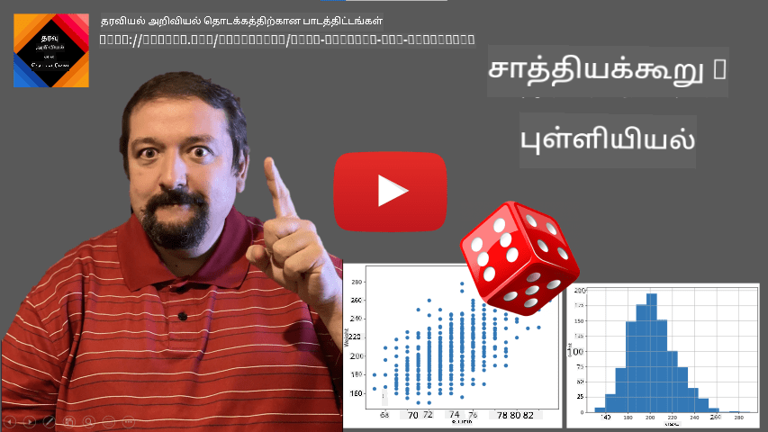
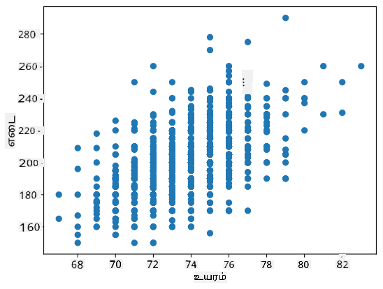

<!--
CO_OP_TRANSLATOR_METADATA:
{
  "original_hash": "ce95884566a74db72572cd51f0cb25ad",
  "translation_date": "2025-10-11T15:42:40+00:00",
  "source_file": "1-Introduction/04-stats-and-probability/README.md",
  "language_code": "ta"
}
-->
# புள்ளியியல் மற்றும் சாத்தியக்கூறுகளின் சுருக்கமான அறிமுகம்

| ](../../sketchnotes/04-Statistics-Probability.png)|
|:---:|
| புள்ளியியல் மற்றும் சாத்தியக்கூறுகள் - _Sketchnote by [@nitya](https://twitter.com/nitya)_ |

புள்ளியியல் மற்றும் சாத்தியக்கூறு கோட்பாடு என்பது கணிதத்தின் இரண்டு தொடர்புடைய பகுதிகள் ஆகும், மேலும் அவை தரவியல் அறிவியலில் மிகவும் முக்கியமானவை. கணிதத்தை ஆழமாக அறியாமல் தரவுடன் செயல்படுவது சாத்தியமானது, ஆனால் குறைந்தபட்சம் சில அடிப்படை கருத்துகளை அறிந்திருப்பது நல்லது. இங்கு உங்களைத் தொடங்க உதவும் ஒரு சுருக்கமான அறிமுகத்தை வழங்குகிறோம்.

[](https://youtu.be/Z5Zy85g4Yjw)

## [முன்-வகுப்பு வினாடி வினா](https://ff-quizzes.netlify.app/en/ds/quiz/6)

## சாத்தியக்கூறு மற்றும் சீரற்ற மாறிகள்

**சாத்தியக்கூறு** என்பது 0 மற்றும் 1 இடையே உள்ள ஒரு எண், இது ஒரு **நிகழ்வு** எவ்வளவு சாத்தியமானது என்பதை வெளிப்படுத்துகிறது. இது நேர்மறை முடிவுகளின் எண்ணிக்கையாக (நிகழ்வை உருவாக்கும் முடிவுகள்), சமமான சாத்தியக்கூறுகளைக் கொண்ட அனைத்து முடிவுகளின் மொத்த எண்ணிக்கையால் வகுக்கப்படுகிறது. உதாரணமாக, ஒரு பாசையை சுழற்றும்போது, எண்கள் வரும் சாத்தியக்கூறு 3/6 = 0.5.

நிகழ்வுகளைப் பற்றி பேசும்போது, நாங்கள் **சீரற்ற மாறிகள்** பயன்படுத்துகிறோம். உதாரணமாக, ஒரு பாசையை சுழற்றும்போது கிடைக்கும் எண்ணை பிரதிநிதித்துவப்படுத்தும் சீரற்ற மாறி 1 முதல் 6 வரை மதிப்புகளை எடுக்கும். 1 முதல் 6 வரை உள்ள எண்களின் தொகுப்பை **மாதிரி இடம்** என்று அழைக்கப்படுகிறது. ஒரு சீரற்ற மாறி ஒரு குறிப்பிட்ட மதிப்பை எடுக்கும் சாத்தியக்கூறைப் பற்றி பேசலாம், உதாரணமாக P(X=3)=1/6.

முந்தைய உதாரணத்தில் உள்ள சீரற்ற மாறி **தொகுதி** என்று அழைக்கப்படுகிறது, ஏனெனில் இது எண்ணக்கூடிய மாதிரி இடத்தை கொண்டுள்ளது, அதாவது enum செய்யக்கூடிய தனித்துவமான மதிப்புகள் உள்ளன. மாதிரி இடம் ஒரு உண்மையான எண்களின் வரம்பாக அல்லது உண்மையான எண்களின் முழு தொகுப்பாக இருக்கும் சந்தர்ப்பங்கள் உள்ளன. இப்படிப்பட்ட மாறிகள் **தொடர்ச்சியானவை** என்று அழைக்கப்படுகின்றன. ஒரு நல்ல உதாரணம் பஸ் வரும் நேரம்.

## சாத்தியக்கூறு பகிர்மானம்

தொகுதி சீரற்ற மாறிகளின் சந்தர்ப்பத்தில், ஒவ்வொரு நிகழ்வின் சாத்தியக்கூறை P(X) என்ற செயல்பாட்டால் விவரிக்க எளிதானது. மாதிரி இடம் *S* இல் உள்ள ஒவ்வொரு மதிப்பிற்கும் *s* 0 முதல் 1 வரை ஒரு எண்ணை வழங்கும், மேலும் அனைத்து நிகழ்வுகளுக்கான P(X=s) மதிப்புகளின் மொத்தம் 1 ஆக இருக்கும்.

மிகவும் பிரபலமான தொகுதி பகிர்மானம் **ஒரேபோன்ற பகிர்மானம்** ஆகும், இதில் N கூறுகளின் மாதிரி இடம் உள்ளது, ஒவ்வொன்றிற்கும் 1/N என்ற சமமான சாத்தியக்கூறு உள்ளது.

தொடர்ச்சியான மாறியின் சாத்தியக்கூறு பகிர்மானத்தை விவரிக்க மிகவும் கடினம், [a,b] என்ற வரம்பிலிருந்து அல்லது உண்மையான எண்களின் முழு தொகுப்பிலிருந்து மதிப்புகள் எடுக்கப்பட்டுள்ளன. பஸ் வரும் நேரத்தை எடுத்துக்கொள்ளுங்கள். உண்மையில், ஒவ்வொரு குறிப்பிட்ட வருகை நேரத்திற்கும் *t*, பஸ் சரியாக அந்த நேரத்தில் வரும் சாத்தியக்கூறு 0!

> இப்போது சாத்தியக்கூறு 0 கொண்ட நிகழ்வுகள் நிகழ்வதை நீங்கள் அறிந்துள்ளீர்கள், மேலும் அவை அடிக்கடி நிகழ்கின்றன! குறைந்தபட்சம் பஸ் வரும் ஒவ்வொரு முறையும்!

நாம் ஒரு மாறி ஒரு குறிப்பிட்ட மதிப்புகளின் இடைவெளியில் விழும் சாத்தியக்கூறைப் பற்றி மட்டுமே பேச முடியும், உதாரணமாக P(t<sub>1</sub>&le;X&lt;t<sub>2</sub>). இந்த சந்தர்ப்பத்தில், சாத்தியக்கூறு பகிர்மானம் **சாத்தியக்கூறு அடர்த்தி செயல்பாடு** p(x) மூலம் விவரிக்கப்படுகிறது, இது:


ஒரேபோன்ற பகிர்மானத்தின் தொடர்ச்சியான இணையானது **தொடர்ச்சியான ஒரேபோன்ற** என்று அழைக்கப்படுகிறது, இது ஒரு முடிவான இடைவெளியில் வரையறுக்கப்பட்டுள்ளது. X மதிப்பு l நீளத்திற்குள் விழும் சாத்தியக்கூறு l-க்கு நிகராக இருக்கும், மேலும் 1 வரை உயர்கிறது.

மற்றொரு முக்கியமான பகிர்மானம் **சாதாரண பகிர்மானம்**, இதைப் பற்றி கீழே மேலும் விரிவாக பேசுவோம்.

## சராசரி, மாறுபாடு மற்றும் நிலையான சிதறல்

நாம் X என்ற சீரற்ற மாறியின் n மாதிரிகளின் வரிசையை வரையறுத்து வரையறுத்து வரையறுத்து வரையறுத்து வரையறுத்து வரையறுத்து வரையறுத்து வரையறுத்து வரையறுத்து வரையறுத்து வரையறுத்து வரையறுத்து varaiyறுத்து varaiyறுத்து varaiyறுத்து varaiyறுத்து varaiyறுத்து varaiyறுத்து varaiyறுத்து varaiyறுத்து varaiyறுத்து varaiyறுத்து varaiyறுத்து varaiyறுத்து varaiyறுத்து varaiyறுத்து varaiyறுத்து varaiyறுத்து varaiyறுத்து varaiyறுத்து varaiyறுத்து varaiyறுத்து varaiyறுத்து varaiy
> **சுவாரஸ்யமான தகவல்**: மாணவர் விநியோகம் கணிதவியலாளர் வில்லியம் சீலி கோஸ்செட் என்பவரால் பெயரிடப்பட்டது. அவர் தனது ஆய்வை "Student" என்ற புனைபெயரில் வெளியிட்டார். அவர் கின்னஸ் பீர் தொழிற்சாலையில் வேலை செய்தார், மேலும் ஒரு பதிப்பின் படி, அவரது தொழிலதிபர், மூலப்பொருட்களின் தரத்தை நிர்ணயிக்க புள்ளியியல் சோதனைகளை பயன்படுத்துவதை பொதுமக்கள் அறிய விரும்பவில்லை.

நாம் நமது மக்கள் தொகையின் சராசரி &mu; ஐ நம்பகத்தன்மை p உடன் மதிப்பீடு செய்ய விரும்பினால், நாம் * (1-p)/2-வது சதவீதத்தை * மாணவர் விநியோகம் A இல் எடுக்க வேண்டும், இது அட்டவணைகளிலிருந்து எடுக்கப்படலாம் அல்லது புள்ளியியல் மென்பொருள் (எ.கா. Python, R, போன்றவை) சில உள்ளமைக்கப்பட்ட செயல்பாடுகளைப் பயன்படுத்தி கணக்கிடலாம். பின்னர் &mu; க்கான இடைவெளி X&pm;A*D/&radic;n ஆக இருக்கும், இதில் X என்பது மாதிரியின் பெறப்பட்ட சராசரி, D என்பது நிலையான சிதறல்.

> **குறிப்பு**: மாணவர் விநியோகத்துடன் தொடர்புடைய முக்கியமான கருத்தான [சுதந்திரத்தின் அளவுகள்](https://en.wikipedia.org/wiki/Degrees_of_freedom_(statistics)) பற்றிய விவாதத்தை நாங்கள் தவிர்க்கிறோம். இந்த கருத்தை ஆழமாகப் புரிந்துகொள்ள புள்ளியியல் தொடர்பான முழுமையான புத்தகங்களைப் பார்க்கலாம்.

எடை மற்றும் உயரங்களுக்கு நம்பகத்தன்மை இடைவெளியை கணக்கிடுவதற்கான ஒரு எடுத்துக்காட்டு [இணைக்கப்பட்ட நோட்புக்குகளில்](notebook.ipynb) கொடுக்கப்பட்டுள்ளது.

| p | எடை சராசரி |
|-----|-----------|
| 0.85 | 201.73±0.94 |
| 0.90 | 201.73±1.08 |
| 0.95 | 201.73±1.28 |

நம்பகத்தன்மை சாத்தியக்கூறுகள் அதிகமாக இருக்கும் போது, நம்பகத்தன்மை இடைவெளி பரந்ததாக இருக்கும் என்பதை கவனிக்கவும்.

## கருதுகோள் சோதனை

நமது பேஸ்பால் வீரர்களின் தரவுத்தொகுப்பில், வெவ்வேறு வீரர் பங்குகள் உள்ளன, அவற்றை கீழே சுருக்கமாகக் காணலாம் ([இணைக்கப்பட்ட நோட்புக்கை](notebook.ipynb) பார்க்கவும்):

| பங்கு | உயரம் | எடை | எண்ணிக்கை |
|------|--------|--------|-------|
| Catcher | 72.723684 | 204.328947 | 76 |
| Designated_Hitter | 74.222222 | 220.888889 | 18 |
| First_Baseman | 74.000000 | 213.109091 | 55 |
| Outfielder | 73.010309 | 199.113402 | 194 |
| Relief_Pitcher | 74.374603 | 203.517460 | 315 |
| Second_Baseman | 71.362069 | 184.344828 | 58 |
| Shortstop | 71.903846 | 182.923077 | 52 |
| Starting_Pitcher | 74.719457 | 205.163636 | 221 |
| Third_Baseman | 73.044444 | 200.955556 | 45 |

First Basemen க்களின் சராசரி உயரம் Second Basemen க்களின் உயரத்தை விட அதிகமாக உள்ளது என்பதை நாம் கவனிக்கலாம். எனவே, **First Basemen க்கள் Second Basemen க்களை விட உயரமாக உள்ளனர்** என்று நாம் முடிவு செய்யலாம்.

> இந்த அறிக்கையை **கருதுகோள்** என்று அழைக்கப்படுகிறது, ஏனெனில் இந்த உண்மை உண்மையில் உண்மையா இல்லையா என்பதை நாங்கள் அறியவில்லை.

எனினும், இந்த முடிவை எடுக்க முடியும் என்பதைத் தீர்மானிக்க எளிதாக இல்லை. மேலே உள்ள விவாதத்திலிருந்து, ஒவ்வொரு சராசரிக்கும் தொடர்புடைய நம்பகத்தன்மை இடைவெளி உள்ளது என்பதை நாங்கள் அறிந்துள்ளோம், எனவே இந்த வேறுபாடு புள்ளியியல் பிழையாக இருக்கலாம். நாங்கள் எங்கள் கருதுகோளை சோதிக்க ஒரு முறையான வழியை தேவைப்படுகிறது.

First மற்றும் Second Basemen க்களின் உயரங்களுக்கு தனித்தனியாக நம்பகத்தன்மை இடைவெளிகளை கணக்கிடுவோம்:

| நம்பகத்தன்மை | First Basemen | Second Basemen |
|------------|---------------|----------------|
| 0.85 | 73.62..74.38 | 71.04..71.69 |
| 0.90 | 73.56..74.44 | 70.99..71.73 |
| 0.95 | 73.47..74.53 | 70.92..71.81 |

எந்த நம்பகத்தன்மையிலும் இடைவெளிகள் ஒட்டவில்லை என்பதை நாம் காணலாம். இது First Basemen க்கள் Second Basemen க்களை விட உயரமாக உள்ளனர் என்ற எங்கள் கருதுகோளை நிரூபிக்கிறது.

மேலும் முறையாக, நாம் தீர்மானிக்க முயற்சிக்கும் பிரச்சனை **இரண்டு சாத்தியக்கூறு விநியோகங்கள் ஒரே மாதிரியானவை** அல்லது குறைந்தபட்சம் ஒரே அளவுகளை கொண்டுள்ளன என்பதைப் பார்க்க வேண்டும். விநியோகம் அடிப்படையில், அதற்கான சோதனைகள் வேறுபடும். நமது விநியோகங்கள் சாதாரணமானவை என்று நாம் அறிந்தால், **[Student t-test](https://en.wikipedia.org/wiki/Student%27s_t-test)** ஐ பயன்படுத்தலாம்.

Student t-test இல், சராசரிகளுக்கிடையிலான வேறுபாட்டை, சிதறலைக் கருத்தில் கொண்டு, **t-value** எனப்படும் மதிப்பை கணக்கிடுகிறோம். t-value **Student distribution** ஐ பின்பற்றுகிறது என்பதை நிரூபிக்கப்படுகிறது, இது நம்பகத்தன்மை அளவுக்கு **p** க்கான உச்ச மதிப்பை பெற அனுமதிக்கிறது (இது கணக்கிடப்படலாம் அல்லது எண் அட்டவணைகளில் பார்க்கலாம்). பின்னர் t-value ஐ இந்த உச்ச மதிப்புடன் ஒப்பிட்டு கருதுகோளை ஒப்புக்கொள்கிறோம் அல்லது நிராகரிக்கிறோம்.

Python இல், **SciPy** தொகுப்பைப் பயன்படுத்தலாம், இது `ttest_ind` செயல்பாட்டை உள்ளடக்கியது (மற்ற பல பயனுள்ள புள்ளியியல் செயல்பாடுகளுடன்!). இது t-value ஐ நமக்காக கணக்கிடுகிறது, மேலும் நம்பகத்தன்மை p-value ஐத் திரும்பப் பெறுகிறது, எனவே நாங்கள் முடிவுகளை வரையறுக்க நம்பகத்தன்மையைப் பார்க்கலாம்.

உதாரணமாக, First மற்றும் Second Basemen க்களின் உயரங்களை ஒப்பிடும் போது, நமக்கு பின்வரும் முடிவுகள் கிடைக்கின்றன:
```python
from scipy.stats import ttest_ind

tval, pval = ttest_ind(df.loc[df['Role']=='First_Baseman',['Height']], df.loc[df['Role']=='Designated_Hitter',['Height']],equal_var=False)
print(f"T-value = {tval[0]:.2f}\nP-value: {pval[0]}")
```
```
T-value = 7.65
P-value: 9.137321189738925e-12
```
நமது நிலைமையில், p-value மிகவும் குறைவாக உள்ளது, இது First Basemen க்கள் உயரமாக உள்ளனர் என்பதை ஆதரிக்கும் வலுவான ஆதாரத்தை குறிக்கிறது.

நாம் சோதிக்க விரும்பும் மற்ற கருதுகோள்களின் வகைகள் பல உள்ளன, உதாரணமாக:
* ஒரு குறிப்பிட்ட மாதிரி ஒரு விநியோகத்தை பின்பற்றுகிறது என்பதை நிரூபிக்க. நமது நிலைமையில், உயரங்கள் சாதாரணமாக விநியோகிக்கப்படுகின்றன என்று நாம் கருதுகிறோம், ஆனால் அதற்கு முறையான புள்ளியியல் சரிபார்ப்பு தேவை.
* ஒரு மாதிரியின் சராசரி மதிப்பு ஒரு முன்கூட்டிய மதிப்புடன் பொருந்துகிறது என்பதை நிரூபிக்க
* பல மாதிரிகளின் சராசரிகளை ஒப்பிடுங்கள் (எ.கா. வெவ்வேறு வயது குழுக்களில் மகிழ்ச்சியின் நிலைமைகளில் வேறுபாடு என்ன)

## Law of Large Numbers மற்றும் Central Limit Theorem

சாதாரண விநியோகம் ஏன் முக்கியமானது என்பதற்கான காரணங்களில் ஒன்று **Central Limit Theorem** ஆகும். N<sub>1</sub>, ..., X<sub>N</sub> எனும் N மதிப்புகளின் பெரிய மாதிரியை எடுக்கிறோம், இது எந்த விநியோகத்திலிருந்தும் சராசரி &mu; மற்றும் சிதறல் &sigma;<sup>2</sup> உடன் எடுக்கப்படுகிறது. பின்னர், N (மற்ற வார்த்தைகளில், N&rarr;&infin;) போதுமான அளவு பெரியதாக இருக்கும் போது, சராசரி &Sigma;<sub>i</sub>X<sub>i</sub> சாதாரணமாக விநியோகிக்கப்படும், சராசரி &mu; மற்றும் சிதறல் &sigma;<sup>2</sup>/N உடன்.

> Central Limit Theorem ஐ வேறு ஒரு வழியில் விளக்குவது, எந்த சீரற்ற மாறிலி மதிப்புகளின் தொகையின் சராசரியை நீங்கள் கணக்கிடும்போது, நீங்கள் சாதாரண விநியோகத்தை பெறுவீர்கள் என்று கூறுவது.

Central Limit Theorem இல் இருந்து, N&rarr;&infin; என்றால், மாதிரி சராசரி &mu; ஐ சமமாக இருக்க வாய்ப்பு 1 ஆக மாறும். இது **Law of Large Numbers** என்று அறியப்படுகிறது.

## Covariance மற்றும் Correlation

தரவைப் பற்றிய தொடர்புகளை கண்டறிவது Data Science இன் முக்கிய பணி. இரண்டு வரிசைகள் **correlate** ஆகின்றன என்று நாம் கூறுகிறோம், அவை ஒரே நேரத்தில் ஒரே மாதிரியான நடத்தை காட்டும் போது, அதாவது அவை ஒரே நேரத்தில் உயர்ந்தாலும்/குறைந்தாலும், அல்லது ஒரு வரிசை உயர்ந்தால் மற்றொன்று குறையும் மற்றும் மாறாக. மற்ற வார்த்தைகளில், இரண்டு வரிசைகளுக்கு இடையில் ஒரு தொடர்பு இருப்பது போல தோன்றுகிறது.

> Correlation என்பது இரண்டு வரிசைகளுக்கு இடையிலான காரணமான தொடர்பை அவசியமாகக் குறிக்காது; சில நேரங்களில் இரு மாறிலிகளும் ஒரு வெளிப்புற காரணத்தைப் பொறுத்து இருக்கலாம், அல்லது இரண்டு வரிசைகள் தொடர்புடையது என்பது முற்றிலும் சாத்தியமாக இருக்கலாம். எனினும், வலுவான கணித தொடர்பு இரண்டு மாறிலிகள் எப்படியாவது இணைக்கப்பட்டுள்ளன என்பதைச் சுட்டிக்காட்டும்.

கணித ரீதியாக, இரண்டு சீரற்ற மாறிலிகளுக்கு இடையிலான தொடர்பை காட்டும் முக்கியமான கருத்து **Covariance** ஆகும், இது இவ்வாறு கணக்கிடப்படுகிறது: Cov(X,Y) = **E**\[(X-**E**(X))(Y-**E**(Y))\]. இரண்டு மாறிலிகளின் சராசரி மதிப்புகளிலிருந்து சிதறலைக் கணக்கிடுகிறோம், பின்னர் அந்த சிதறல்களின் பெருக்கம். இரண்டு மாறிலிகள் ஒன்றாக சிதறினால், பெருக்கம் எப்போதும் நேர்மறை மதிப்பாக இருக்கும், இது நேர்மறை Covariance ஆக சேர்க்கப்படும். இரண்டு மாறிலிகள் ஒத்திசைவற்ற சிதறல்களை (அதாவது ஒன்று சராசரிக்கு கீழே விழும் போது மற்றொன்று சராசரிக்கு மேல் உயர்ந்தால்) வெளிப்படுத்தினால், எப்போதும் எதிர்மறை எண்களைப் பெறுவோம், இது எதிர்மறை Covariance ஆக சேர்க்கப்படும். சிதறல்கள் சார்ந்தவை அல்ல என்றால், அவை சுமார் பூஜ்யமாக சேர்க்கப்படும்.

Covariance இன் முழு மதிப்பு, தொடர்பு எவ்வளவு பெரியது என்பதை எங்களுக்கு அதிகமாகச் சொல்லாது, ஏனெனில் இது உண்மையான மதிப்புகளின் அளவினைப் பொறுத்தது. அதை சாதாரணமாக்க, இரண்டு மாறிலிகளின் நிலையான சிதறலால் Covariance ஐப் பிரிக்கலாம், **Correlation** ஐப் பெற. நல்ல விஷயம் என்னவென்றால், Correlation எப்போதும் [-1,1] வரம்பில் இருக்கும், இதில் 1 என்பது மதிப்புகளுக்கு இடையிலான வலுவான நேர்மறை தொடர்பை குறிக்கிறது, -1 - வலுவான எதிர்மறை தொடர்பு, மற்றும் 0 - எந்த தொடர்பும் இல்லை (மாறிலிகள் சுதந்திரமானவை).

**உதாரணம்**: பேஸ்பால் வீரர்களின் எடைகள் மற்றும் உயரங்களுக்கு இடையிலான தொடர்பை மேலே குறிப்பிடப்பட்ட தரவுத்தொகுப்பிலிருந்து கணக்கிடலாம்:
```python
print(np.corrcoef(weights,heights))
```
இதன் விளைவாக, நாங்கள் **Correlation Matrix** ஐப் பெறுகிறோம்:
```
array([[1.        , 0.52959196],
       [0.52959196, 1.        ]])
```

> Correlation Matrix C ஐ எந்த எண்ணிக்கையிலான உள்ளீட்டு வரிசைகளுக்கும் S<sub>1</sub>, ..., S<sub>n</sub> கணக்கிடலாம். C<sub>ij</sub> இன் மதிப்பு S<sub>i</sub> மற்றும் S<sub>j</sub> க்கு இடையிலான தொடர்பு, மற்றும் கோணியல் கூறுகள் எப்போதும் 1 ஆக இருக்கும் (இது S<sub>i</sub> இன் சுய தொடர்பும் ஆகும்).

நமது நிலைமையில், 0.53 என்ற மதிப்பு ஒரு நபரின் எடை மற்றும் உயரத்திற்கு இடையிலான தொடர்பு இருப்பதை சுட்டிக்காட்டுகிறது. மேலும், ஒரு மதிப்பை மற்றொன்றுக்கு எதிராக சிதறல் வரைபடத்தை உருவாக்கி தொடர்பை காட்சிப்படுத்தலாம்:



> தொடர்பு மற்றும் Covariance பற்றிய மேலும் உதாரணங்கள் [இணைக்கப்பட்ட நோட்புக்கில்](notebook.ipynb) காணலாம்.

## முடிவு

இந்த பிரிவில், நாம் கற்றுக்கொண்டது:

* தரவின் அடிப்படை புள்ளியியல் பண்புகள், உதாரணமாக சராசரி, சிதறல், முறை மற்றும் குவார்டைல்கள்
* சீரற்ற மாறிலிகளின் வெவ்வேறு விநியோகங்கள், சாதாரண விநியோகம் உட்பட
* வெவ்வேறு பண்புகளுக்கு இடையிலான தொடர்பை கண்டறிவது எப்படி
* சில கருதுகோள்களை நிரூபிக்க கணிதம் மற்றும் புள்ளியியல் ஆகியவற்றின் ஒலிய கருவியைப் பயன்படுத்துவது எப்படி
* தரவுத் மாதிரியை வழங்கிய சீரற்ற மாறிலிக்கான நம்பகத்தன்மை இடைவெளிகளை கணக்கிடுவது எப்படி

இது சாத்தியக்கூறு மற்றும் புள்ளியியல் உள்ளடக்கத்தில் உள்ள தலைப்புகளின் முழுமையான பட்டியல் அல்ல, ஆனால் இந்த பாடநெறியில் நல்ல தொடக்கத்தை வழங்க இது போதுமானதாக இருக்க வேண்டும்.

## 🚀 சவால்

நோட்புக்கில் உள்ள மாதிரி குறியீட்டை பயன்படுத்தி மற்ற கருதுகோள்களை சோதிக்கவும்:
1. First Basemen க்கள் Second Basemen க்களை விட வயதானவர்கள்
2. First Basemen க்கள் Third Basemen க்களை விட உயரமானவர்கள்
3. Shortstops க்கள் Second Basemen க்களை விட உயரமானவர்கள்

## [பாடத்திற்குப் பிந்தைய வினாடி வினா](https://ff-quizzes.netlify.app/en/ds/quiz/7)

## மதிப்பீடு மற்றும் சுயபடிப்பு

சாத்தியக்கூறு மற்றும் புள்ளியியல் என்பது மிகவும் பரந்த தலைப்பாகும், இது தனி பாடநெறியைத் தேவைப்படுகிறது. நீங்கள் கோட்பாட்டில் ஆழமாக செல்ல ஆர்வமாக இருந்தால், நீங்கள் பின்வரும் புத்தகங்களைப் படிக்க தொடர விரும்பலாம்:

1. [Carlos Fernandez-Granda](https://cims.nyu.edu/~cfgranda/) நியூயார்க் பல்கலைக்கழகத்திலிருந்து [Probability and Statistics for Data Science](https://cims.nyu.edu/~cfgranda/pages/stuff/probability_stats_for_DS.pdf) (ஆன்லைனில் கிடைக்கிறது) என்ற சிறந்த பாடக்குறிப்புகள் உள்ளன.
1. [Peter and Andrew Bruce. Practical Statistics for Data Scientists.](https://www.oreilly.com/library/view/practical-statistics-for/9781491952955/) [[R இல் மாதிரி குறியீடு](https://github.com/andrewgbruce/statistics-for-data-scientists)]. 
1. [James D. Miller. Statistics for Data Science](https://www.packtpub.com/product/statistics-for-data-science/9781788290678) [[R இல் மாதிரி குறியீடு](https://github.com/PacktPublishing/Statistics-for-Data-Science)]

## பணிக்கட்டளை

[சிறிய Diabetes ஆய்வு](assignment.md)

## Credits

இந்த பாடம் [Dmitry Soshnikov](http://soshnikov.com) அவர்களால் ♥️ உடன் எழுதப்பட்டுள்ளது.

---

**அறிவிப்பு**:  
இந்த ஆவணம் [Co-op Translator](https://github.com/Azure/co-op-translator) என்ற AI மொழிபெயர்ப்பு சேவையை பயன்படுத்தி மொழிபெயர்க்கப்பட்டுள்ளது. நாங்கள் துல்லியத்திற்காக முயற்சிக்கிறோம், ஆனால் தானியங்கி மொழிபெயர்ப்புகளில் பிழைகள் அல்லது தவறுகள் இருக்கக்கூடும் என்பதை கவனத்தில் கொள்ளவும். அதன் சொந்த மொழியில் உள்ள மூல ஆவணம் அதிகாரப்பூர்வ ஆதாரமாக கருதப்பட வேண்டும். முக்கியமான தகவல்களுக்கு, தொழில்முறை மனித மொழிபெயர்ப்பு பரிந்துரைக்கப்படுகிறது. இந்த மொழிபெயர்ப்பைப் பயன்படுத்துவதால் ஏற்படும் எந்த தவறான புரிதல்களுக்கும் அல்லது தவறான விளக்கங்களுக்கும் நாங்கள் பொறுப்பல்ல.