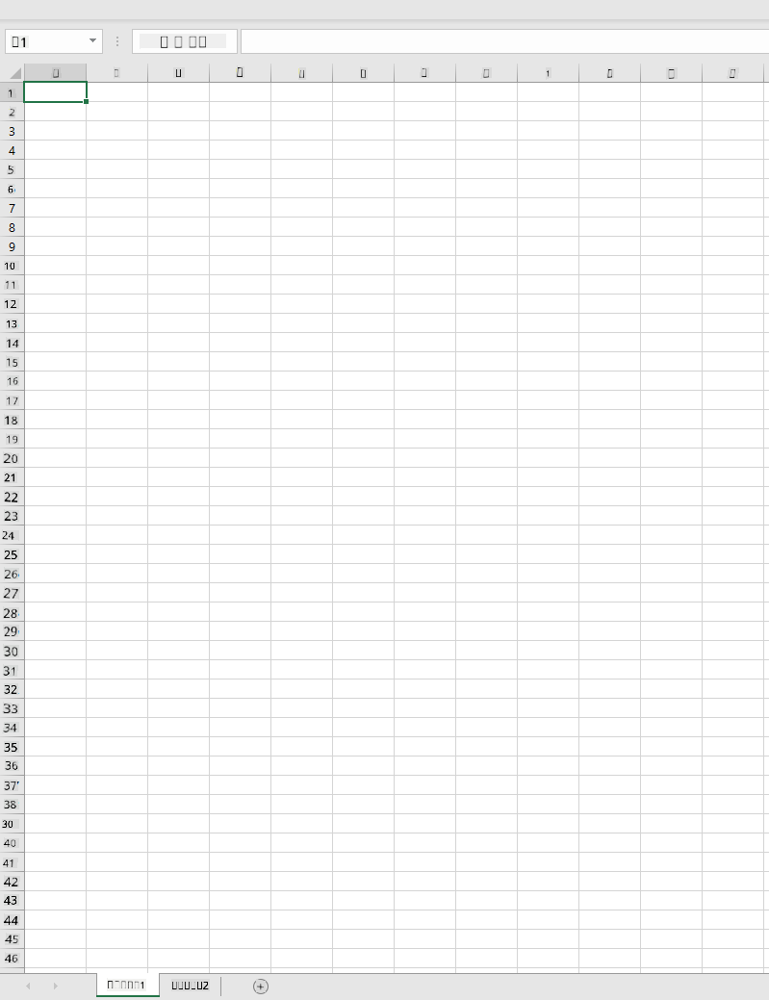
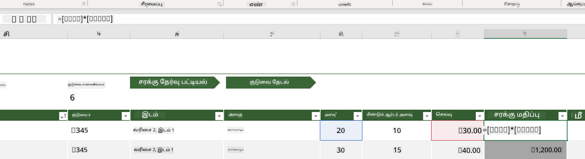
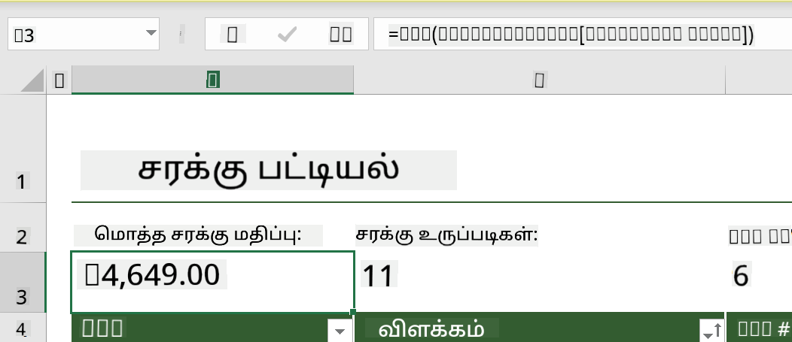
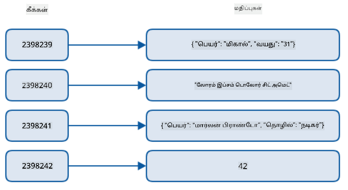
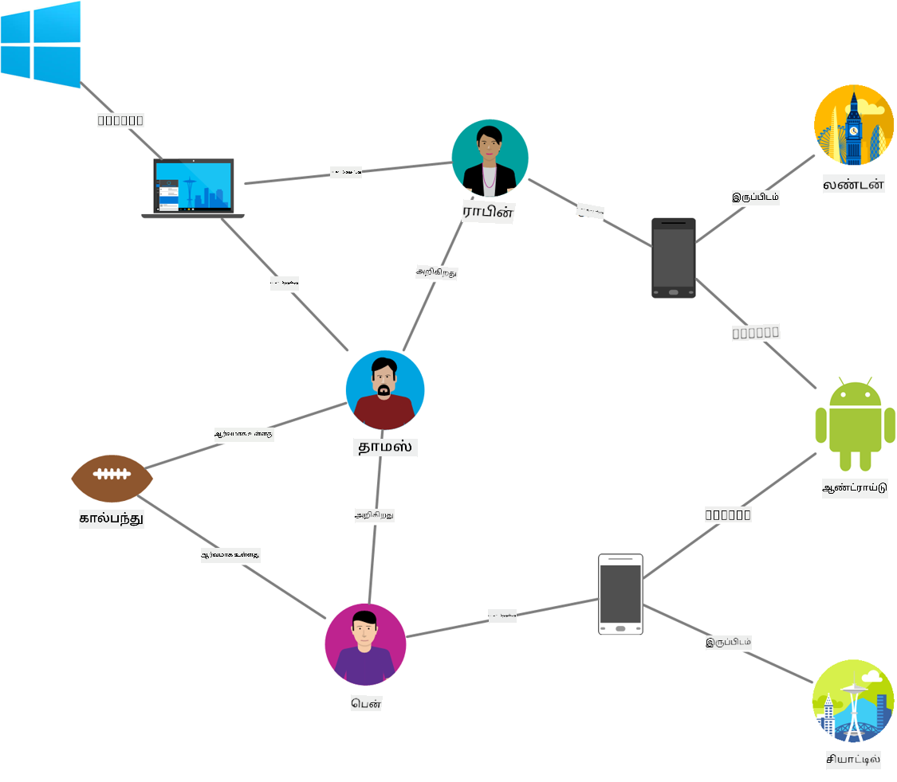
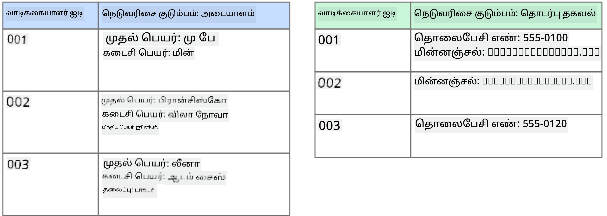
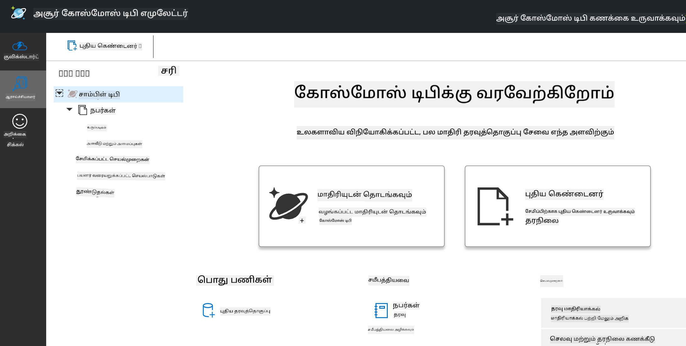
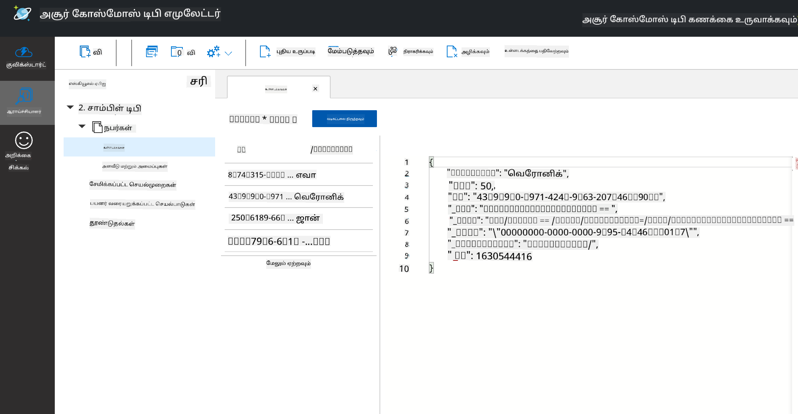
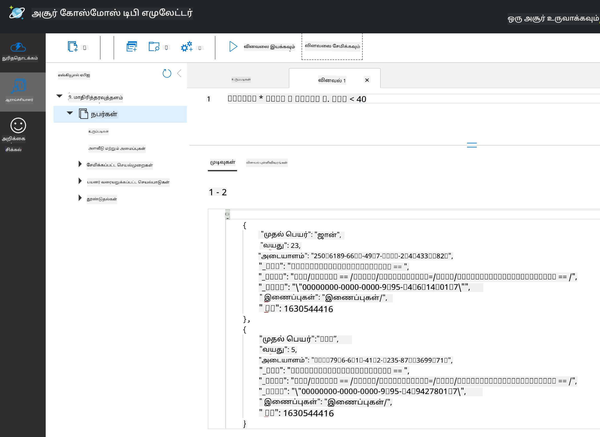

<!--
CO_OP_TRANSLATOR_METADATA:
{
  "original_hash": "c182e87f9f80be7e7cdffc7b40bbfccf",
  "translation_date": "2025-10-11T15:22:27+00:00",
  "source_file": "2-Working-With-Data/06-non-relational/README.md",
  "language_code": "ta"
}
-->
# தரவுடன் வேலை செய்வது: தொடர்பற்ற தரங்கள்

| இன் ஸ்கெட்ச்நோட்](../../sketchnotes/06-NoSQL.png)|
|:---:|
|NoSQL தரவுடன் வேலை செய்வது - _[@nitya](https://twitter.com/nitya) இன் ஸ்கெட்ச்நோட்_ |

## [முன்-வகுப்பு வினாடி வினா](https://ff-quizzes.netlify.app/en/ds/quiz/10)

தரவு தொடர்புடைய தரவுத்தொகுப்புகளுக்கு மட்டுப்படுத்தப்படவில்லை. இந்த பாடம் தொடர்பற்ற தரங்களை மையமாகக் கொண்டு, ஸ்பிரெட்ஷீட்கள் மற்றும் NoSQL பற்றிய அடிப்படைகளை உள்ளடக்கியது.

## ஸ்பிரெட்ஷீட்கள்

ஸ்பிரெட்ஷீட்கள் தரவுகளை சேமிக்கவும், ஆராயவும் பிரபலமான வழியாகும், ஏனெனில் இதை அமைக்கவும் தொடங்கவும் குறைவான வேலை தேவைப்படும். இந்த பாடத்தில் நீங்கள் ஒரு ஸ்பிரெட்ஷீட்டின் அடிப்படை கூறுகள், சூத்திரங்கள் மற்றும் செயல்பாடுகள் ஆகியவற்றைப் பற்றி கற்றுக்கொள்வீர்கள். எடுத்துக்காட்டுகள் Microsoft Excel மூலம் விளக்கப்படும், ஆனால் பிற ஸ்பிரெட்ஷீட் மென்பொருட்களுடன் ஒப்பிடும்போது பெரும்பாலான பகுதிகளுக்கும் தலைப்புகளுக்கும் ஒரே மாதிரியான பெயர்கள் மற்றும் படிகள் இருக்கும்.



ஒரு ஸ்பிரெட்ஷீட் ஒரு கோப்பாகும் மற்றும் கணினி, சாதனம் அல்லது மேக அடிப்படையிலான கோப்பு அமைப்பில் அணுகக்கூடியதாக இருக்கும். மென்பொருள் தானாகவே உலாவியில் அடிப்படையாகவோ அல்லது கணினியில் நிறுவப்பட வேண்டிய பயன்பாடாகவோ இருக்கலாம். Excel இல் இந்த கோப்புகள் **வேலைப்புத்தகங்கள்** என்று வரையறுக்கப்படுகின்றன, மேலும் இந்த பாடத்தின் மீதமுள்ள பகுதிகளில் இந்த சொல் பயன்படுத்தப்படும்.

ஒரு வேலைப்புத்தகத்தில் ஒன்று அல்லது அதற்கு மேற்பட்ட **வேலைத் தாள்கள்** உள்ளன, ஒவ்வொரு வேலைத் தாளமும் தாவல்கள் மூலம் குறிக்கப்படும். ஒரு வேலைத் தாளத்தில் **செல்கள்** எனப்படும் செங்குத்து மற்றும் செங்குத்து வரிசைகளின் சந்திப்பில் உள்ள செதில்கள் உள்ளன, அவை உண்மையான தரவுகளை கொண்டிருக்கும். சில ஸ்பிரெட்ஷீட்களில், முதல் சில வரிசைகளில் தலைப்புகள் இருக்கும், அவை ஒரு செலின் தரவை விவரிக்கின்றன.

Excel வேலைப்புத்தகத்தின் இந்த அடிப்படை கூறங்களுடன், ஒரு ஸ்பிரெட்ஷீட்டின் கூடுதல் பகுதிகளை விளக்க [Microsoft Templates](https://templates.office.com/) இல் இருந்து ஒரு சரக்கு எடுத்துக்காட்டைப் பயன்படுத்துவோம்.

### சரக்குகளை நிர்வகித்தல்

"InventoryExample" எனும் ஸ்பிரெட்ஷீட் கோப்பு, ஒரு சரக்கில் உள்ள பொருட்களின் வடிவமைக்கப்பட்ட ஸ்பிரெட்ஷீட் ஆகும், இதில் மூன்று வேலைத் தாள்கள் உள்ளன, அவற்றின் தாவல்கள் "Inventory List", "Inventory Pick List" மற்றும் "Bin Lookup" என குறிக்கப்படுகின்றன. Inventory List வேலைத் தாளத்தின் வரி 4 தலைப்பு ஆகும், இது தலைப்பு நெடுவரிசையில் உள்ள ஒவ்வொரு செலின் மதிப்பையும் விவரிக்கிறது.



சில நேரங்களில், ஒரு செலின் மதிப்பு, அதன் மதிப்பை உருவாக்க மற்ற செல்களின் மதிப்புகளின் மீது சார்ந்திருக்கும். Inventory List ஸ்பிரெட்ஷீட் அதன் சரக்கில் உள்ள ஒவ்வொரு பொருளின் செலவை கண்காணிக்கிறது, ஆனால் சரக்கில் உள்ள அனைத்திற்கும் செலவை எவ்வாறு கண்டறிவது? [**சூத்திரங்கள்**](https://support.microsoft.com/en-us/office/overview-of-formulas-34519a4e-1e8d-4f4b-84d4-d642c4f63263) செலின் தரவுகளில் செயல்பாடுகளைச் செய்ய பயன்படுகிறது, மேலும் இந்த எடுத்துக்காட்டில் சரக்கின் செலவை கணக்கிட பயன்படுத்தப்படுகிறது. Inventory Value நெடுவரிசையில் உள்ள ஒவ்வொரு பொருளின் மதிப்பையும் கணக்கிட இந்த ஸ்பிரெட்ஷீட் QTY தலைப்பின் கீழ் உள்ள அளவை அதன் செலவுடன் (COST தலைப்பின் கீழ் உள்ள செல்கள்) பெருக்கி ஒரு சூத்திரத்தைப் பயன்படுத்தியது. ஒரு செலின் மீது இரட்டை கிளிக் செய்தால் அல்லது அதை ஹைலைட் செய்தால், அந்த சூத்திரத்தை காணலாம். சூத்திரங்கள் சமன்பாடு குறியீட்டுடன் தொடங்கும், அதன் பிறகு கணக்கீடு அல்லது செயல்பாடு வரும்.



சரக்கின் மொத்த மதிப்பை பெற, Inventory Value இன் அனைத்து மதிப்புகளையும் சேர்க்க மற்றொரு சூத்திரத்தைப் பயன்படுத்தலாம். ஒவ்வொரு செலையும் சேர்த்து மொத்தத்தை உருவாக்க இது கணக்கிடப்படலாம், ஆனால் இது ஒரு சிரமமான பணி. Excel இல் [**செயல்பாடுகள்**](https://support.microsoft.com/en-us/office/sum-function-043e1c7d-7726-4e80-8f32-07b23e057f89) அல்லது செல்களின் மதிப்புகளில் கணக்கீடுகளைச் செய்ய முன்பே வரையறுக்கப்பட்ட சூத்திரங்கள் உள்ளன. செயல்பாடுகள் வாதங்களை தேவைப்படும், அவை இந்த கணக்கீடுகளைச் செய்ய தேவையான மதிப்புகள். செயல்பாடுகள் ஒன்றுக்கு மேற்பட்ட வாதங்களைத் தேவைப்படுத்தும் போது, அவை ஒரு குறிப்பிட்ட வரிசையில் பட்டியலிடப்பட வேண்டும், இல்லையெனில் செயல்பாடு சரியான மதிப்பை கணக்கிடாது. இந்த எடுத்துக்காட்டில் SUM செயல்பாடு பயன்படுத்தப்படுகிறது, மேலும் Inventory Value இன் மதிப்புகளை மொத்தமாக சேர்க்க வாதமாக பயன்படுத்துகிறது, இது வரி 3, நெடுவரிசை B (B3 என்றும் குறிப்பிடப்படுகிறது) கீழ் பட்டியலிடப்பட்டுள்ளது.

## NoSQL

NoSQL என்பது தொடர்பற்ற தரவுகளை சேமிக்க பல்வேறு வழிகளை குறிக்கும் ஒரு பொதுப்பெயர் ஆகும், மேலும் இது "non-SQL", "non-relational" அல்லது "not only SQL" என பொருள்படும். இந்த வகை தரவுத்தொகுப்பு அமைப்புகள் 4 வகைகளாக வகைப்படுத்தப்படலாம்.


> [Michał Białecki Blog](https://www.michalbialecki.com/2018/03/18/azure-cosmos-db-key-value-database-cloud/) மூலம்

[Key-value](https://docs.microsoft.com/en-us/azure/architecture/data-guide/big-data/non-relational-data#keyvalue-data-stores) தரவுத்தொகுப்புகள் தனித்துவமான முக்கியங்களைப் பொருத்துகின்றன, அவை ஒரு மதிப்புடன் இணைக்கப்பட்ட தனித்துவமான அடையாளமாகும். இந்த ஜோடிகள் ஒரு [ஹாஷ் அட்டவணை](https://www.hackerearth.com/practice/data-structures/hash-tables/basics-of-hash-tables/tutorial/) மற்றும் பொருத்தமான ஹாஷிங் செயல்பாட்டைப் பயன்படுத்தி சேமிக்கப்படுகின்றன.


> [Microsoft](https://docs.microsoft.com/en-us/azure/cosmos-db/graph/graph-introduction#graph-database-by-example) மூலம்

[Graph](https://docs.microsoft.com/en-us/azure/architecture/data-guide/big-data/non-relational-data#graph-data-stores) தரவுத்தொகுப்புகள் தரவுகளில் உள்ள உறவுகளை விவரிக்கின்றன, மேலும் அவை நொடுகள் மற்றும் விளிம்புகளின் தொகுப்பாக பிரதிநிதித்துவம் செய்யப்படுகின்றன. ஒரு நோடு ஒரு நிறுவலைக் குறிக்கிறது, இது ஒரு மாணவர் அல்லது வங்கி அறிக்கை போன்ற உண்மையான உலகில் உள்ள ஏதாவது ஒன்றாக இருக்கலாம். விளிம்புகள் இரண்டு நிறுவனங்களுக்கிடையிலான உறவுகளை பிரதிநிதித்துவம் செய்கின்றன. ஒவ்வொரு நோடு மற்றும் விளிம்புகளுக்கும் கூடுதல் தகவல்களை வழங்கும் பண்புகள் உள்ளன.



[Columnar](https://docs.microsoft.com/en-us/azure/architecture/data-guide/big-data/non-relational-data#columnar-data-stores) தரவுத்தொகுப்புகள் தரவுகளை நெடுவரிசைகள் மற்றும் வரிசைகளாக ஒழுங்குபடுத்துகின்றன, ஆனால் ஒவ்வொரு நெடுவரிசையும் நெடுவரிசை குடும்பம் எனப்படும் குழுக்களாகப் பிரிக்கப்படுகிறது, அங்கு ஒரு நெடுவரிசையின் கீழ் உள்ள அனைத்து தரவுகளும் தொடர்புடையவை மற்றும் ஒரு அலகில் மீட்டெடுக்கப்படலாம் மற்றும் மாற்றப்படலாம்.

### Azure Cosmos DB உடன் ஆவண தரவுத்தொகுப்புகள்

[Document](https://docs.microsoft.com/en-us/azure/architecture/data-guide/big-data/non-relational-data#document-data-stores) தரவுத்தொகுப்புகள் முக்கிய-மதிப்பு தரவுத்தொகுப்பின் கருத்தில் அடிப்படையாகக் கட்டப்பட்டுள்ளன, மேலும் புலங்கள் மற்றும் பொருள் மதிப்புகளின் தொடராக உருவாக்கப்பட்டுள்ளன. இந்த பகுதி Cosmos DB எமுலேட்டர் மூலம் ஆவண தரவுத்தொகுப்புகளை ஆராயும்.

Cosmos DB தரவுத்தொகுப்பு "Not Only SQL" என வரையறுக்கப்படுகிறது, இதில் Cosmos DB இன் ஆவண தரவுத்தொகுப்பு தரவுகளை கேட்க SQL இல் சார்ந்துள்ளது. SQL பற்றிய [முந்தைய பாடம்](../05-relational-databases/README.md) மொழியின் அடிப்படைகளை உள்ளடக்கியது, மேலும் இங்கே ஒரு ஆவண தரவுத்தொகுப்பில் சில அதே கேள்விகளை நாங்கள் பயன்படுத்த முடியும். Cosmos DB Emulator ஐப் பயன்படுத்துவோம், இது ஒரு கணினியில் உள்ளூர் தரவுத்தொகுப்பை உருவாக்கவும் ஆராயவும் எங்களுக்கு அனுமதிக்கிறது. எமுலேட்டர் பற்றிய மேலும் படிக்க [இங்கே](https://docs.microsoft.com/en-us/azure/cosmos-db/local-emulator?tabs=ssl-netstd21) பார்க்கவும்.

ஒரு ஆவணம் என்பது புலங்கள் மற்றும் பொருள் மதிப்புகளின் தொகுப்பாகும், அங்கு புலங்கள் பொருள் மதிப்புகள் எதை பிரதிநிதித்துவம் செய்கின்றன என்பதை விவரிக்கின்றன. கீழே ஒரு ஆவணத்தின் எடுத்துக்காட்டு கொடுக்கப்பட்டுள்ளது.

```json
{
    "firstname": "Eva",
    "age": 44,
    "id": "8c74a315-aebf-4a16-bb38-2430a9896ce5",
    "_rid": "bHwDAPQz8s0BAAAAAAAAAA==",
    "_self": "dbs/bHwDAA==/colls/bHwDAPQz8s0=/docs/bHwDAPQz8s0BAAAAAAAAAA==/",
    "_etag": "\"00000000-0000-0000-9f95-010a691e01d7\"",
    "_attachments": "attachments/",
    "_ts": 1630544034
}
```

இந்த ஆவணத்தில் முக்கியமான புலங்கள்: `firstname`, `id`, மற்றும் `age`. Cosmos DB மூலம் உருவாக்கப்பட்ட மற்ற புலங்கள் அடிக்கோடுகளுடன் உள்ளன.

#### Cosmos DB Emulator உடன் தரவுகளை ஆராய்தல்

[Windows க்கான எமுலேட்டரை இங்கே](https://aka.ms/cosmosdb-emulator) பதிவிறக்கி நிறுவலாம். macOS மற்றும் Linux இல் எமுலேட்டரை இயக்குவதற்கான விருப்பங்களைப் பற்றிய விவரங்களுக்கு இந்த [ஆவணத்தை](https://docs.microsoft.com/en-us/azure/cosmos-db/local-emulator?tabs=ssl-netstd21#run-on-linux-macos) பார்க்கவும்.

எமுலேட்டர் ஒரு உலாவி சாளரத்தைத் தொடங்குகிறது, அங்கு எக்ஸ்ப்ளோரர் பார்வை ஆவணங்களை ஆராய அனுமதிக்கிறது.



நீங்கள் தொடர்ந்தால், "Start with Sample" என்பதைக் கிளிக் செய்து SampleDB எனும் மாதிரி தரவுத்தொகுப்பை உருவாக்கவும். நீங்கள் அம்பை கிளிக் செய்வதன் மூலம் SampleDB ஐ விரிவாக்கினால், `Persons` எனும் ஒரு கொண்டெய்னரை காணலாம். ஒரு கொண்டெய்னர் ஒரு தொகுப்பிலுள்ள உருப்படிகளின் தொகுப்பைக் கொண்டுள்ளது, அவை கொண்டெய்னருக்குள் உள்ள ஆவணங்கள். `Items` கீழ் உள்ள நான்கு தனித்துவமான ஆவணங்களை நீங்கள் ஆராயலாம்.



#### Cosmos DB Emulator உடன் ஆவண தரவுகளை கேட்குதல்

மாதிரி தரவுகளை SQL Query பொத்தானை (இடது பக்கம் இரண்டாவது பொத்தான்) கிளிக் செய்வதன் மூலம் கேட்கலாம்.

`SELECT * FROM c` கொண்டெய்னரில் உள்ள அனைத்து ஆவணங்களையும் திரும்பக் கொடுக்கும். ஒரு where கிளாஸ் சேர்த்து 40 க்கும் குறைவான வயதுடையவர்களை கண்டுபிடிப்போம்.

`SELECT * FROM c where c.age < 40`



இந்த கேள்வி இரண்டு ஆவணங்களை திரும்பக் கொடுக்கும், ஒவ்வொரு ஆவணத்திற்கும் வயது மதிப்பு 40 க்கும் குறைவாக உள்ளது என்பதை கவனிக்கவும்.

#### JSON மற்றும் ஆவணங்கள்

நீங்கள் JavaScript Object Notation (JSON) உடன் பரிச்சயமாக இருந்தால், ஆவணங்கள் JSON போன்றே தோன்றும் என்பதை நீங்கள் கவனிப்பீர்கள். இந்த அடைவில் `PersonsData.json` எனும் ஒரு கோப்பு உள்ளது, இதில் மேலும் தரவுகள் உள்ளன, மேலும் அதை எமுலேட்டரில் உள்ள Persons கொண்டெய்னருக்கு நீங்கள் பதிவேற்றலாம் `Upload Item` பொத்தானை பயன்படுத்தி.

பெரும்பாலான சந்தர்ப்பங்களில், JSON தரவுகளை திருப்பும் API களை நேரடியாக ஆவண தரவுத்தொகுப்புகளில் மாற்றி சேமிக்கலாம். கீழே மற்றொரு ஆவணம் உள்ளது, இது Microsoft Twitter கணக்கிலிருந்து ட்வீட்களை பிரதிநிதித்துவம் செய்கிறது, இது Twitter API ஐப் பயன்படுத்தி மீட்டெடுக்கப்பட்டது, பின்னர் Cosmos DB இல் சேர்க்கப்பட்டது.

```json
{
    "created_at": "2021-08-31T19:03:01.000Z",
    "id": "1432780985872142341",
    "text": "Blank slate. Like this tweet if you’ve ever painted in Microsoft Paint before. https://t.co/cFeEs8eOPK",
    "_rid": "dhAmAIUsA4oHAAAAAAAAAA==",
    "_self": "dbs/dhAmAA==/colls/dhAmAIUsA4o=/docs/dhAmAIUsA4oHAAAAAAAAAA==/",
    "_etag": "\"00000000-0000-0000-9f84-a0958ad901d7\"",
    "_attachments": "attachments/",
    "_ts": 1630537000
```

இந்த ஆவணத்தில் முக்கியமான புலங்கள்: `created_at`, `id`, மற்றும் `text`.

## 🚀 சவால்

`TwitterData.json` எனும் ஒரு கோப்பு SampleDB தரவுத்தொகுப்பில் நீங்கள் பதிவேற்றலாம். அதை தனி கொண்டெய்னருக்கு சேர்க்க பரிந்துரைக்கப்படுகிறது. இது செய்யப்படுவது:

1. மேல் வலது மூலையில் உள்ள புதிய கொண்டெய்னர் பொத்தானை கிளிக் செய்யவும்
1. உள்ளமைந்த தரவுத்தொகுப்பை (SampleDB) தேர்ந்தெடுத்து, கொண்டெய்னருக்கான id ஐ உருவாக்கவும்
1. பாகம் விசையை `/id` என அமைக்கவும்
1. சரி என்பதை கிளிக் செய்யவும் (இந்த பார்வையில் உள்ள மற்ற தகவல்களை நீங்கள் புறக்கணிக்கலாம், ஏனெனில் இது உங்கள் கணினியில் உள்ளூர் ரீதியாக இயங்கும் ஒரு சிறிய தரவுத்தொகுப்பு)
1. உங்கள் புதிய கொண்டெய்னரைத் திறந்து, `Upload Item` பொத்தானை பயன்படுத்தி Twitter Data கோப்பை பதிவேற்றவும்

text புலத்தில் Microsoft உள்ள ஆவணங்களை கண்டறிய சில தேர்ந்தெடுக்கப்பட்ட கேள்விகளை இயக்க முயற்சிக்கவும். குறிப்புகள்: [LIKE keyword](https://docs.microsoft.com/en-us/azure/cosmos-db/sql/sql-query-keywords#using-like-with-the--wildcard-character) ஐப் பயன்படுத்த முயற்சிக்கவும்.

## [பிந்தைய-வகுப்பு வினாடி வினா](https://ff-quizzes.netlify.app/en/ds/quiz/11)

## மறுபார்வை & சுயபயிற்சி

- இந்த பாடத்தில் இந்த ஸ்பிரெட்ஷீட்டில் சேர்க்கப்பட்ட சில கூடுதல் வடிவமைப்புகள் மற்றும் அம்சங்களை உள்ளடக்கவில்லை. Excel பற்றிய மேலும் அறிய Microsoft இன் [பெரிய ஆவணங்கள் மற்றும் வீடியோக்களின் நூலகத்தை](https://support.microsoft.com/excel) பாருங்கள்.

- தொடர்பற்ற தரவுகளின் பல்வேறு வகைகளின் பண்புகளை இந்த கட்டமைப்பு ஆவணம் விவரிக்கிறது: [Non-relational Data and NoSQL](https://docs.microsoft.com/en-us/azure/architecture/data-guide/big-data/non-relational-data)

- Cosmos DB என்பது மேக அடிப்படையிலான தொடர்பற்ற தரவுத்தொகுப்பு ஆகும், மேலும் இந்த பாடத்தில் குறிப்பிடப்பட்டுள்ள பல்வேறு NoSQL வகைகளை சேமிக்க முடியும். இந்த [Cosmos DB Microsoft Learn Module](https://docs.microsoft.com/en-us/learn/paths/work-with-nosql-data-in-azure-cosmos-db/) இல் இந்த வகைகள் பற்றிய மேலும் அறியவும்.

## பணிக்குறிப்பு

[Soda Profits](assignment.md)

---

**குறிப்பு**:  
இந்த ஆவணம் [Co-op Translator](https://github.com/Azure/co-op-translator) என்ற AI மொழிபெயர்ப்பு சேவையைப் பயன்படுத்தி மொழிபெயர்க்கப்பட்டுள்ளது. நாங்கள் துல்லியத்திற்காக முயற்சிக்கின்றோம், ஆனால் தானியங்கி மொழிபெயர்ப்புகளில் பிழைகள் அல்லது தவறான தகவல்கள் இருக்கக்கூடும் என்பதை கவனத்தில் கொள்ளவும். அதன் தாய்மொழியில் உள்ள மூல ஆவணம் அதிகாரப்பூர்வ ஆதாரமாக கருதப்பட வேண்டும். முக்கியமான தகவல்களுக்கு, தொழில்முறை மனித மொழிபெயர்ப்பு பரிந்துரைக்கப்படுகிறது. இந்த மொழிபெயர்ப்பைப் பயன்படுத்துவதால் ஏற்படும் எந்த தவறான புரிதல்கள் அல்லது தவறான விளக்கங்களுக்கு நாங்கள் பொறுப்பல்ல.