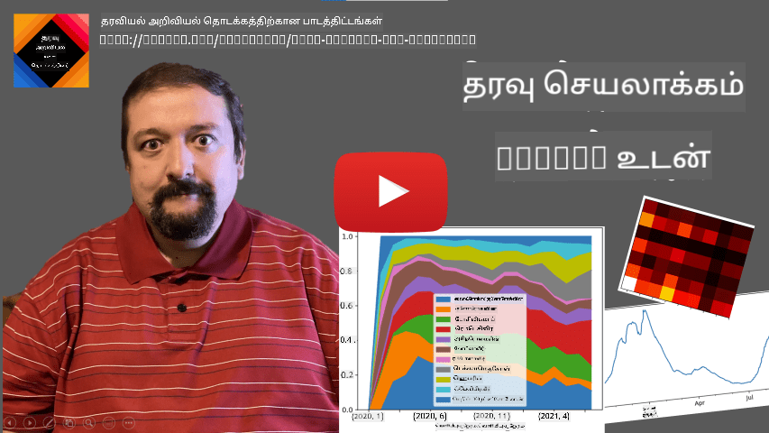
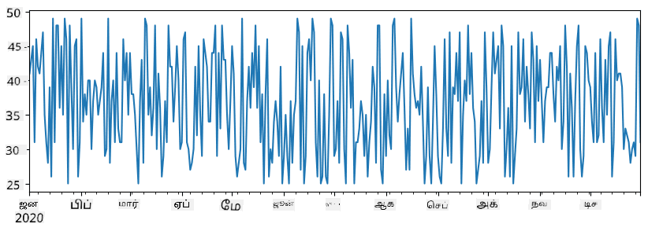
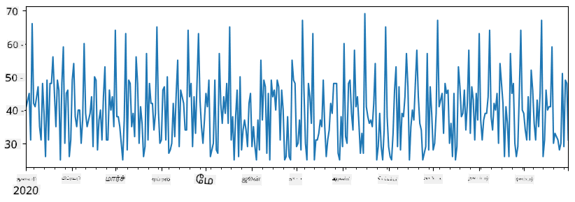
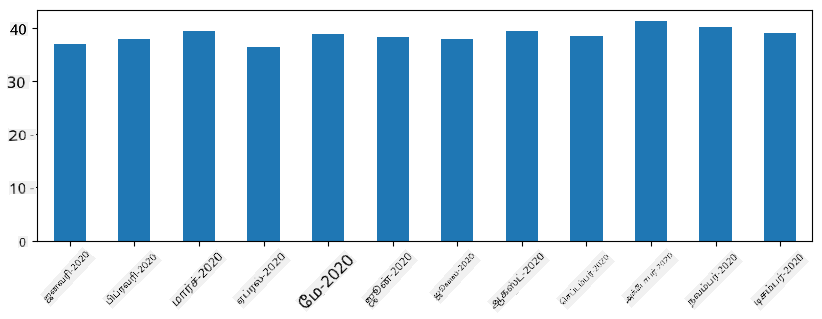
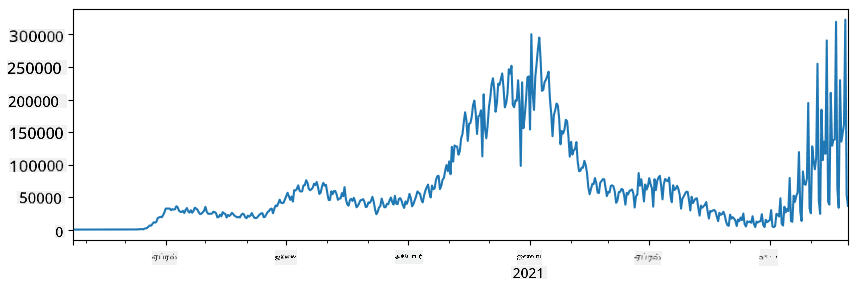
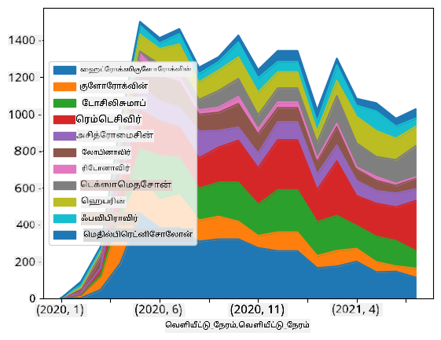

<!--
CO_OP_TRANSLATOR_METADATA:
{
  "original_hash": "7bfec050f4717dcc2dfd028aca9d21f3",
  "translation_date": "2025-10-11T15:18:34+00:00",
  "source_file": "2-Working-With-Data/07-python/README.md",
  "language_code": "ta"
}
-->
# தரவுடன் வேலை செய்வது: Python மற்றும் Pandas நூலகம்

|  ](../../sketchnotes/07-WorkWithPython.png) |
| :-------------------------------------------------------------------------------------------------------: |
|                 Python உடன் வேலை செய்வது - _Sketchnote by [@nitya](https://twitter.com/nitya)_                 |

[](https://youtu.be/dZjWOGbsN4Y)

தரவுகளை சேமிக்கவும், கேள்வி மொழிகளைப் பயன்படுத்தி அவற்றை கேள்வி கேட்கவும் தரவுத்தொகுப்புகள் மிகவும் திறமையான வழிகளை வழங்குகின்றன. ஆனால், தரவுகளை செயலாக்குவதற்கான மிகவும் நெகிழ்வான வழி, உங்கள் சொந்த நிரல்களை எழுதுவதுதான். பல சந்தர்ப்பங்களில், தரவுத்தொகுப்பில் கேள்வி கேட்பது மிகவும் பயனுள்ளதாக இருக்கும். ஆனால் சில நேரங்களில், SQL மூலம் எளிதாக செய்ய முடியாத சிக்கலான தரவுச் செயலாக்கம் தேவைப்படும் போது, உங்கள் சொந்த நிரல்களை எழுதுவது சிறந்த தேர்வாக இருக்கும்.

தரவுச் செயலாக்கத்தை எந்த நிரலாக்க மொழியிலும் செய்யலாம், ஆனால் சில மொழிகள் தரவுடன் வேலை செய்வதில் உயர்ந்த நிலையைப் பெற்றுள்ளன. தரவியல் விஞ்ஞானிகள் பொதுவாக பின்வரும் மொழிகளில் ஒன்றை விரும்புகிறார்கள்:

* **[Python](https://www.python.org/)**, ஒரு பொதுவான பயன்பாட்டு நிரலாக்க மொழி, அதன் எளிமையால் தொடக்கநிலை பயிற்சியாளர்களுக்கு சிறந்த தேர்வாக கருதப்படுகிறது. Python பல கூடுதல் நூலகங்களை கொண்டுள்ளது, இது ZIP காப்பகத்திலிருந்து உங்கள் தரவுகளை எடுக்க அல்லது படத்தை grayscale-ஆக மாற்ற போன்ற பல நடைமுறை பிரச்சனைகளைத் தீர்க்க உதவுகிறது. தரவியல் விஞ்ஞானத்துடன், Python வலை வளர்ச்சிக்காகவும் பரவலாக பயன்படுத்தப்படுகிறது.
* **[R](https://www.r-project.org/)** என்பது புள்ளிவிவர தரவுச் செயலாக்கத்திற்காக உருவாக்கப்பட்ட பாரம்பரிய கருவியாகும். இது பெரிய நூலகக் களஞ்சியத்தை (CRAN) கொண்டுள்ளது, இது தரவுச் செயலாக்கத்திற்கு நல்ல தேர்வாகும். ஆனால், R ஒரு பொதுவான பயன்பாட்டு நிரலாக்க மொழி அல்ல, மேலும் தரவியல் விஞ்ஞானத் துறைக்கு வெளியே அரிதாகவே பயன்படுத்தப்படுகிறது.
* **[Julia](https://julialang.org/)** என்பது தரவியல் விஞ்ஞானத்திற்காகவே உருவாக்கப்பட்ட மற்றொரு மொழியாகும். Python-ஐ விட சிறந்த செயல்திறனை வழங்குவதற்காக இது உருவாக்கப்பட்டுள்ளது, இது அறிவியல் பரிசோதனைகளுக்கு சிறந்த கருவியாகும்.

இந்த பாடத்தில், எளிய தரவுச் செயலாக்கத்திற்காக Python-ஐப் பயன்படுத்துவதில் கவனம் செலுத்துவோம். மொழியின் அடிப்படை அறிமுகம் உங்களிடம் உள்ளது என்று கருதுகிறோம். Python-ஐப் பற்றிய ஆழமான பயணத்தை விரும்பினால், பின்வரும் வளங்களைப் பார்க்கலாம்:

* [Learn Python in a Fun Way with Turtle Graphics and Fractals](https://github.com/shwars/pycourse) - Python நிரலாக்கத்திற்கான GitHub அடிப்படையிலான விரைவான அறிமுகப் பாடநெறி
* [Take your First Steps with Python](https://docs.microsoft.com/en-us/learn/paths/python-first-steps/?WT.mc_id=academic-77958-bethanycheum) [Microsoft Learn](http://learn.microsoft.com/?WT.mc_id=academic-77958-bethanycheum) இல் உள்ள கற்றல் பாதை

தரவு பல வடிவங்களில் வரலாம். இந்த பாடத்தில், மூன்று தரவுப் வடிவங்களைப் பரிசீலிப்போம் - **அட்டவணை தரவு**, **உரை** மற்றும் **படங்கள்**.

நாம் தொடர்புடைய அனைத்து நூலகங்களின் முழு கண்ணோட்டத்தை வழங்காமல், சில தரவுச் செயலாக்க உதாரணங்களில் கவனம் செலுத்துவோம். இது என்ன செய்ய முடியும் என்பதற்கான முக்கியமான கருத்தை உங்களுக்கு வழங்கும், மேலும் உங்களுக்கு தேவையான போது உங்கள் பிரச்சனைகளுக்கான தீர்வுகளை எங்கு தேட வேண்டும் என்பதற்கான புரிதலை உங்களுக்கு வழங்கும்.

> **மிகவும் பயனுள்ள ஆலோசனை**: நீங்கள் செய்ய வேண்டிய ஒரு குறிப்பிட்ட செயல்பாட்டை எப்படி செய்வது என்று தெரியவில்லை என்றால், அதை இணையத்தில் தேட முயற்சிக்கவும். [Stackoverflow](https://stackoverflow.com/) பல பொதுவான பணிகளுக்கான Python குறியீட்டு மாதிரிகளை அடிக்கடி கொண்டுள்ளது.

## [பாடத்துக்கு முன் வினாடி வினா](https://ff-quizzes.netlify.app/en/ds/quiz/12)

## அட்டவணை தரவு மற்றும் Dataframes

நீங்கள் தொடர்புடைய தரவுத்தொகுப்புகளைப் பற்றி பேசும்போது அட்டவணை தரவுகளை ஏற்கனவே சந்தித்துள்ளீர்கள். உங்களிடம் அதிக அளவிலான தரவுகள் உள்ளன, மேலும் அவை பல்வேறு இணைக்கப்பட்ட அட்டவணைகளில் உள்ளன, SQL-ஐப் பயன்படுத்துவது மிகவும் பொருத்தமானதாக இருக்கும். ஆனால், பல சந்தர்ப்பங்களில், ஒரு அட்டவணை தரவுடன் நாம் **புரிதல்** அல்லது **உள்ளடக்கம்** பெற வேண்டும், உதாரணமாக விநியோகம், மதிப்புகளுக்கிடையிலான தொடர்பு போன்றவை. தரவியல் விஞ்ஞானத்தில், அசல் தரவின் சில மாற்றங்களைச் செய்ய வேண்டும், அதற்குப் பிறகு காட்சிப்படுத்தல் செய்ய வேண்டும். Python-ஐப் பயன்படுத்தி இந்த இரண்டு படிகளையும் எளிதாக செய்யலாம்.

Python-இல் அட்டவணை தரவுகளைச் சமாளிக்க உதவக்கூடிய இரண்டு மிகவும் பயனுள்ள நூலகங்கள் உள்ளன:
* **[Pandas](https://pandas.pydata.org/)**, **Dataframes**-ஐ மாற்றுவதற்கு அனுமதிக்கிறது, இது தொடர்புடைய அட்டவணைகளுக்கு ஒத்ததாகும். நீங்கள் பெயரிடப்பட்ட நெடுவரிசைகளைப் பெறலாம், மேலும் வரிசைகள், நெடுவரிசைகள் மற்றும் Dataframes-களில் பல்வேறு செயல்பாடுகளைச் செய்யலாம்.
* **[Numpy](https://numpy.org/)**, **tensors**, அதாவது பல-பரிமாண **arrays**-களுடன் வேலை செய்யும் நூலகமாகும். Array ஒரே அடிப்படை வகையின் மதிப்புகளை கொண்டுள்ளது, மேலும் இது dataframe-ஐ விட எளிமையானது, ஆனால் இது அதிக கணித செயல்பாடுகளை வழங்குகிறது மற்றும் குறைவான overhead-ஐ உருவாக்குகிறது.

நீங்கள் தெரிந்திருக்க வேண்டிய மற்ற சில நூலகங்கள்:
* **[Matplotlib](https://matplotlib.org/)**, தரவுக் காட்சிப்படுத்தல் மற்றும் வரைபடங்களை வரைதல் செய்ய பயன்படும் நூலகம்
* **[SciPy](https://www.scipy.org/)**, சில கூடுதல் அறிவியல் செயல்பாடுகளைக் கொண்ட நூலகம். ப вероятத்திற்கும் புள்ளிவிவரங்களுக்கும் தொடர்புடைய போது நாம் ஏற்கனவே இந்த நூலகத்தை சந்தித்துள்ளோம்.

Python நிரலின் தொடக்கத்தில் இந்த நூலகங்களை இறக்குமதி செய்ய நீங்கள் பொதுவாக பயன்படுத்தும் குறியீடு இங்கே:
```python
import numpy as np
import pandas as pd
import matplotlib.pyplot as plt
from scipy import ... # you need to specify exact sub-packages that you need
``` 

Pandas சில அடிப்படை கருத்துகளின் மீது மையமாக உள்ளது.

### Series 

**Series** என்பது மதிப்புகளின் வரிசையாகும், இது ஒரு பட்டியல் அல்லது numpy array-க்கு ஒத்ததாகும். முக்கியமான வேறுபாடு என்னவென்றால், series-க்கு **index** உள்ளது, மேலும் series-களில் செயல்படும்போது (எ.கா., அவற்றைச் சேர்க்கும்போது), index கணக்கில் எடுத்துக்கொள்ளப்படுகிறது. Index எளிய integer வரிசை எண்ணாக இருக்கலாம் (இது பட்டியல் அல்லது array-இல் இருந்து series உருவாக்கும்போது இயல்பாக index ஆகும்), அல்லது date interval போன்ற சிக்கலான அமைப்பைக் கொண்டிருக்கலாம்.

> **குறிப்பு**: Pandas குறித்த அறிமுக குறியீடு இணைக்கப்பட்ட notebook [`notebook.ipynb`](notebook.ipynb) இல் உள்ளது. இங்கே சில உதாரணங்களை மட்டுமே சுருக்கமாகக் கொடுக்கிறோம், மேலும் முழு notebook-ஐப் பார்க்க நீங்கள் வரவேற்கப்படுகிறீர்கள்.

ஒரு உதாரணத்தைப் பரிசீலிக்கவும்: நாங்கள் எங்கள் ice-cream கடையின் விற்பனையைப் பகுப்பாய்வு செய்ய விரும்புகிறோம். ஒரு குறிப்பிட்ட காலத்திற்கு விற்பனைக் கணக்குகளின் (ஒவ்வொரு நாளும் விற்கப்பட்ட பொருட்களின் எண்ணிக்கை) வரிசையை உருவாக்குவோம்:

```python
start_date = "Jan 1, 2020"
end_date = "Mar 31, 2020"
idx = pd.date_range(start_date,end_date)
print(f"Length of index is {len(idx)}")
items_sold = pd.Series(np.random.randint(25,50,size=len(idx)),index=idx)
items_sold.plot()
```


இப்போது ஒவ்வொரு வாரமும் நாங்கள் நண்பர்களுக்காக ஒரு பார்ட்டி ஏற்பாடு செய்கிறோம், மேலும் ஒரு பார்ட்டிக்காக கூடுதல் 10 ice-cream பாக்ஸ் எடுக்கிறோம். இதை காட்ட மற்றொரு series உருவாக்கலாம்:
```python
additional_items = pd.Series(10,index=pd.date_range(start_date,end_date,freq="W"))
```
இரண்டு series-களை சேர்க்கும்போது, மொத்த எண்ணிக்கையைப் பெறுகிறோம்:
```python
total_items = items_sold.add(additional_items,fill_value=0)
total_items.plot()
```


> **குறிப்பு**: எளிய syntax `total_items+additional_items`-ஐப் பயன்படுத்தவில்லை. அதைச் செய்திருந்தால், resulting series-ல் பல `NaN` (*Not a Number*) மதிப்புகளைப் பெற்றிருப்போம். இது `additional_items` series-ல் சில index புள்ளிகளுக்கு missing values உள்ளதால், மேலும் `NaN`-ஐ எதற்கும் சேர்த்தால் `NaN` ஆகிறது. எனவே addition செய்யும்போது `fill_value` parameter-ஐ குறிப்பிட வேண்டும்.

Time series-களுடன், நாம் **resample** செய்யலாம், அதாவது series-ஐ வேறு நேர இடைவெளிகளுடன் மாற்றலாம். உதாரணமாக, மாதாந்திர விற்பனை அளவின் சராசரியை கணக்கிட விரும்பினால், பின்வரும் குறியீட்டை பயன்படுத்தலாம்:
```python
monthly = total_items.resample("1M").mean()
ax = monthly.plot(kind='bar')
```


### DataFrame

DataFrame என்பது ஒரே index-ஐ கொண்ட பல series-களின் தொகுப்பாகும். பல series-களை ஒன்றாக இணைத்து DataFrame உருவாக்கலாம்:
```python
a = pd.Series(range(1,10))
b = pd.Series(["I","like","to","play","games","and","will","not","change"],index=range(0,9))
df = pd.DataFrame([a,b])
```
இது பின்வருமாறு ஒரு கிடைமட்ட அட்டவணையை உருவாக்கும்:
|     | 0   | 1    | 2   | 3   | 4      | 5   | 6      | 7    | 8    |
| --- | --- | ---- | --- | --- | ------ | --- | ------ | ---- | ---- |
| 0   | 1   | 2    | 3   | 4   | 5      | 6   | 7      | 8    | 9    |
| 1   | I   | like | to  | use | Python | and | Pandas | very | much |

Series-களை நெடுவரிசைகளாகவும், dictionary-ஐப் பயன்படுத்தி column பெயர்களை குறிப்பிடவும் முடியும்:
```python
df = pd.DataFrame({ 'A' : a, 'B' : b })
```
இது பின்வருமாறு ஒரு அட்டவணையை உருவாக்கும்:

|     | A   | B      |
| --- | --- | ------ |
| 0   | 1   | I      |
| 1   | 2   | like   |
| 2   | 3   | to     |
| 3   | 4   | use    |
| 4   | 5   | Python |
| 5   | 6   | and    |
| 6   | 7   | Pandas |
| 7   | 8   | very   |
| 8   | 9   | much   |

**குறிப்பு**: முந்தைய அட்டவணையை transpose செய்து, eg. ````python
df = pd.DataFrame([a,b]).T..rename(columns={ 0 : 'A', 1 : 'B' })
```
` எழுதுவதன் மூலம் இந்த அட்டவணை அமைப்பைப் பெறலாம். `.T` என்பது DataFrame-ஐ transpose செய்யும் செயல்பாடு, அதாவது வரிசைகள் மற்றும் நெடுவரிசைகளை மாற்றுவது, மேலும் `rename` செயல்பாடு column-களை முந்தைய உதாரணத்துடன் பொருந்த하도록 பெயரிட அனுமதிக்கிறது.

DataFrames-ல் செய்யக்கூடிய சில முக்கிய செயல்பாடுகள் இங்கே:

**Column தேர்வு**. தனிப்பட்ட column-களை `df['A']` எழுதுவதன் மூலம் தேர்வு செய்யலாம் - இந்த செயல்பாடு Series-ஐ திருப்புகிறது. `df[['B','A']]` எழுதுவதன் மூலம் column-களின் துணைத் தொகுப்பை மற்றொரு DataFrame-க்கு தேர்வு செய்யலாம் - இது மற்றொரு DataFrame-ஐ திருப்புகிறது.

**குறிப்பிட்ட வரிசைகளைத் தேர்வு செய்வது**. உதாரணமாக, column `A` 5-ஐ விட அதிகமாக உள்ள வரிசைகளை மட்டும் விட்டு விட `df[df['A']>5]` எழுதலாம்.

> **குறிப்பு**: Filtering செயல்படும் விதம் பின்வருமாறு. `df['A']<5` என்ற வெளிப்பாடு boolean series-ஐ திருப்புகிறது, இது அசல் series `df['A']`-இல் ஒவ்வொரு உருப்படிக்குமான வெளிப்பாடு `True` அல்லது `False` என்பதை குறிக்கிறது. Boolean series index ஆக பயன்படுத்தப்படும் போது, DataFrame-ல் உள்ள வரிசைகளின் துணைத் தொகுப்பை திருப்புகிறது. எனவே, பொதுவான Python boolean வெளிப்பாட்டைப் பயன்படுத்த முடியாது, உதாரணமாக, `df[df['A']>5 and df['A']<7]` எழுதுவது தவறாக இருக்கும். அதற்கு பதிலாக, boolean series-ல் சிறப்பு `&` செயல்பாட்டைப் பயன்படுத்தி `df[(df['A']>5) & (df['A']<7)]` (*இங்கே அடுக்குகள் முக்கியம்*) எழுத வேண்டும்.

**புதிய கணக்கிடக்கூடிய column-களை உருவாக்குவது**. DataFrame-க்கு புதிய கணக்கிடக்கூடிய column-களை எளிதாக உருவாக்கலாம்:
```python
df['DivA'] = df['A']-df['A'].mean() 
``` 
இந்த உதாரணம் A-இன் mean மதிப்பிலிருந்து A-இன் வேறுபாட்டை கணக்கிடுகிறது. இங்கே உண்மையில் என்ன நடக்கிறது என்றால், நாம் ஒரு series-ஐ கணக்கிடுகிறோம், பின்னர் இந்த series-ஐ இடது பக்கம் ஒதுக்கி, மற்றொரு column-ஐ உருவாக்குகிறோம். எனவே, series-க்கு பொருந்தாத எந்த செயல்பாடுகளையும் பயன்படுத்த முடியாது, உதாரணமாக, கீழே உள்ள குறியீடு தவறாகும்:
```python
# Wrong code -> df['ADescr'] = "Low" if df['A'] < 5 else "Hi"
df['LenB'] = len(df['B']) # <- Wrong result
``` 
கீழே உள்ள உதாரணம், ச syntactically சரியானதாக இருந்தாலும், தவறான முடிவைத் தருகிறது, ஏனெனில் இது series `B`-இன் நீளத்தை column-ல் உள்ள அனைத்து மதிப்புகளுக்கும் ஒதுக்குகிறது, ஆனால் நாம் எதிர்பார்த்த individual elements-இன் நீளத்தை அல்ல.

இந்த மாதிரியான சிக்கலான வெளிப்பாடுகளை கணக்கிட வேண்டும் என்றால், `apply` செயல்பாட்டைப் பயன்படுத்தலாம். கடைசி உதாரணத்தை பின்வருமாறு எழுதலாம்:
```python
df['LenB'] = df['B'].apply(lambda x : len(x))
# or 
df['LenB'] = df['B'].apply(len)
```

மேலே உள்ள செயல்பாடுகளுக்குப் பிறகு, பின்வரும் DataFrame-ஐப் பெறுவோம்:

|     | A   | B      | DivA | LenB |
| --- | --- | ------ | ---- | ---- |
| 0   | 1   | I      | -4.0 | 1    |
| 1   | 2   | like   | -3.0 | 4    |
| 2   | 3   | to     | -2.0 | 2    |
| 3   | 4   | use    | -1.0 | 3    |
| 4   | 5   | Python | 0.0  | 6    |
| 5   | 6   | and    | 1.0  | 3    |
| 6   | 7   | Pandas | 2.0  | 6    |
| 7   | 8   | very   | 3.0  | 4    |
| 8   | 9   | much   | 4.0  | 4    |

**எண்களைக் கொண்டு வரிசைகளைத் தேர்வு செய்வது** `iloc` construct-ஐப் பயன்படுத்தி செய்யலாம். உதாரணமாக, DataFrame-ல் முதல் 5 வரிசைகளைத் தேர்வு செய்ய:
```python
df.iloc[:5]
```

**Grouping** Excel-இல் உள்ள *pivot tables* போன்ற முடிவுகளைப் பெற அடிக்கடி பயன்படுத்தப்படுகிறது. Column `A`-இன் mean மதிப்பை ஒவ்வொரு `LenB` எண்ணிக்கைக்கும் கணக்கிட விரும்பினால், `LenB` மூலம் DataFrame-ஐ குழுவாகக் கொண்டு, `mean`-ஐ அழைக்கலாம்:
```python
df.groupby(by='LenB')[['A','DivA']].mean()
```
Mean மற்றும் குழுவில் உள்ள உருப்படிகளின் எண்ணிக்கையை கணக்கிட வேண்டும் என்றால், மேலும் சிக்கலான `aggregate` செயல்பாட்டைப் பயன்படுத்தலாம்:
```python
df.groupby(by='LenB') \
 .aggregate({ 'DivA' : len, 'A' : lambda x: x.mean() }) \
 .rename(columns={ 'DivA' : 'Count', 'A' : 'Mean'})
```
இது பின்வரும் அட்டவணையைத் தருகிறது:

| LenB | Count | Mean     |
| ---- | ----- | -------- |
| 1    | 1     | 1.000000 |
| 2    | 1     | 3.000000 |
| 3    | 2     | 5.000000 |
| 4    | 3     | 6.333333 |
| 6    | 2     | 6.000000 |

### தரவுகளைப் பெறுதல்
நாம் Python பொருட்களிலிருந்து Series மற்றும் DataFrames உருவாக்க எவ்வளவு எளிது என்பதை பார்த்தோம். ஆனால், தரவுகள் பொதுவாக ஒரு உரை கோப்பு அல்லது Excel அட்டவணை வடிவத்தில் வரும். அதிர்ஷ்டவசமாக, Pandas தரவுகளை டிஸ்கில் இருந்து ஏற்ற எளிய வழியை வழங்குகிறது. உதாரணமாக, CSV கோப்பை படிக்க இது போன்ற எளிதானது:
```python
df = pd.read_csv('file.csv')
```
 "சவால்" பிரிவில், வெளிப்புற வலைத்தளங்களில் இருந்து தரவுகளை பெறுவது உட்பட, மேலும் பல தரவுகளை ஏற்ற உதாரணங்களை காண்போம்.

### அச்சிடுதல் மற்றும் வரைபடம்

ஒரு தரவியல் விஞ்ஞானி அடிக்கடி தரவுகளை ஆராய வேண்டும், எனவே அதை காட்சிப்படுத்தும் திறன் முக்கியமானது. DataFrame பெரியதாக இருந்தால், பல நேரங்களில் நாம் சரியாக செய்கிறோம் என்பதை உறுதிப்படுத்த முதல் சில வரிகளை அச்சிட விரும்புகிறோம். இதை `df.head()` அழைப்பதன் மூலம் செய்யலாம். நீங்கள் Jupyter Notebook-ல் இதை இயக்கினால், DataFrame-ஐ அழகான அட்டவணை வடிவத்தில் அச்சிடும்.

நாம் சில களங்களை காட்சிப்படுத்த `plot` செயல்பாட்டின் பயன்பாட்டை பார்த்தோம். `plot` பல பணிகளுக்கு மிகவும் பயனுள்ளதாக உள்ளது, மேலும் `kind=` பராமரிப்பின் மூலம் பல்வேறு வகை வரைபடங்களை ஆதரிக்கிறது. ஆனால், நீங்கள் எப்போதும் மூல `matplotlib` நூலகத்தைப் பயன்படுத்தி மேலும் சிக்கலானதை வரைபடம் செய்யலாம். தரவுக் காட்சிப்படுத்தல் பற்றிய விரிவான பாடங்களை தனித்தனியாக கற்கைநெறிகளில் கையாளுவோம்.

இந்த சுருக்கம் Pandas இன் முக்கியமான கருத்துக்களை உள்ளடக்கியது, ஆனால் இந்த நூலகம் மிகவும் வளமானது, மேலும் இதன் மூலம் நீங்கள் செய்யக்கூடியவற்றுக்கு எல்லையில்லை! இப்போது இந்த அறிவை குறிப்பிட்ட பிரச்சினையைத் தீர்க்க பயன்படுத்துவோம்.

## 🚀 சவால் 1: COVID பரவலைப் பகுப்பாய்வு

முதல் பிரச்சினை COVID-19 தொற்றுநோயின் பரவலை மாதிரியாக்கல் ஆகும். இதைச் செய்ய, [Center for Systems Science and Engineering](https://systems.jhu.edu/) (CSSE) மற்றும் [Johns Hopkins University](https://jhu.edu/) வழங்கிய, பல நாடுகளில் பாதிக்கப்பட்டவர்களின் எண்ணிக்கையைப் பற்றிய தரவுகளைப் பயன்படுத்துவோம். இந்த தரவுத்தொகுப்பு [இந்த GitHub Repository](https://github.com/CSSEGISandData/COVID-19) இல் கிடைக்கிறது.

தரவுகளை எப்படி கையாள வேண்டும் என்பதை விளக்க, [`notebook-covidspread.ipynb`](notebook-covidspread.ipynb) ஐ திறந்து மேலிருந்து கீழ்வரை படிக்குமாறு உங்களை அழைக்கிறோம். நீங்கள் செல்களை இயக்கவும், இறுதியில் நாம் விட்டுச் சென்ற சில சவால்களைச் செய்யவும் முடியும்.



> Jupyter Notebook-ல் குறியீட்டை இயக்குவது எப்படி என்று தெரியவில்லை என்றால், [இந்த கட்டுரை](https://soshnikov.com/education/how-to-execute-notebooks-from-github/) பார்க்கவும்.

## அமைப்பற்ற தரவுகளுடன் வேலை செய்வது

தரவுகள் அடிக்கடி அட்டவணை வடிவத்தில் வரும், ஆனால் சில சந்தர்ப்பங்களில் குறைவான அமைப்புடைய தரவுகளை, உதாரணமாக உரை அல்லது படங்களை கையாள வேண்டும். இந்தச் சந்தர்ப்பத்தில், மேலே பார்த்த தரவுகளை செயலாக்க தொழில்நுட்பங்களைப் பயன்படுத்த, **அமைப்புடைய** தரவுகளை எப்படியாவது **எடுக்க** வேண்டும். சில உதாரணங்கள் இவை:

* உரையிலிருந்து முக்கிய வார்த்தைகளை எடுத்து, அவை எவ்வளவு முறை தோன்றுகின்றன என்பதைப் பார்க்க
* படத்தில் உள்ள பொருட்களைப் பற்றிய தகவலை எடுக்க நரம்பியல் வலைகளைப் பயன்படுத்துதல்
* வீடியோ கேமரா பீடில் உள்ள மக்களின் உணர்வுகளைப் பற்றிய தகவலைப் பெறுதல்

## 🚀 சவால் 2: COVID ஆய்வுக் கட்டுரைகளைப் பகுப்பாய்வு

இந்த சவாலில், COVID தொற்றுநோயின் தலைப்புடன் தொடர்ந்து, இந்த விஷயத்தில் அறிவியல் ஆய்வுக் கட்டுரைகளை செயலாக்க கவனம் செலுத்துவோம். [CORD-19 Dataset](https://www.kaggle.com/allen-institute-for-ai/CORD-19-research-challenge) இல் 7000 க்கும் மேற்பட்ட (எழுதும் நேரத்தில்) COVID பற்றிய கட்டுரைகள், மெட்டாடேட்டா மற்றும் சுருக்கங்களுடன் (அவற்றில் பாதி முழு உரையுடன்) கிடைக்கின்றன.

இந்த தரவுத்தொகுப்பை [Text Analytics for Health](https://docs.microsoft.com/azure/cognitive-services/text-analytics/how-tos/text-analytics-for-health/?WT.mc_id=academic-77958-bethanycheum) அறிவாற்றல் சேவையைப் பயன்படுத்தி பகுப்பாய்வு செய்வதற்கான முழு உதாரணம் [இந்த வலைப்பதிவில்](https://soshnikov.com/science/analyzing-medical-papers-with-azure-and-text-analytics-for-health/) விவரிக்கப்பட்டுள்ளது. இந்த பகுப்பாய்வின் எளிய பதிப்பை நாம் விவாதிக்கிறோம்.

> **NOTE**: இந்த தொகுப்பின் ஒரு நகலை இந்த repository இல் வழங்கவில்லை. முதலில் [`metadata.csv`](https://www.kaggle.com/allen-institute-for-ai/CORD-19-research-challenge?select=metadata.csv) கோப்பை [இந்த Kaggle தொகுப்பில்](https://www.kaggle.com/allen-institute-for-ai/CORD-19-research-challenge) பதிவிறக்க வேண்டும். Kaggle-ல் பதிவு தேவைப்படலாம். பதிவு இல்லாமல் [இங்கே](https://ai2-semanticscholar-cord-19.s3-us-west-2.amazonaws.com/historical_releases.html) பதிவிறக்கலாம், ஆனால் இது மெட்டாடேட்டா கோப்புடன் முழு உரைகளை உள்ளடக்கியதாக இருக்கும்.

[`notebook-papers.ipynb`](notebook-papers.ipynb) ஐ திறந்து மேலிருந்து கீழ்வரை படிக்கவும். நீங்கள் செல்களை இயக்கவும், இறுதியில் நாம் விட்டுச் சென்ற சில சவால்களைச் செய்யவும் முடியும்.



## பட தரவுகளை செயலாக்குதல்

சமீபத்தில், படங்களைப் புரிந்துகொள்ள சக்திவாய்ந்த AI மாதிரிகள் உருவாக்கப்பட்டுள்ளன. முன்பே பயிற்சி பெற்ற நரம்பியல் வலைகளை அல்லது மேக சேவைகளைப் பயன்படுத்தி பல பணிகளை தீர்க்க முடியும். சில உதாரணங்கள்:

* **பட வகைப்படுத்தல்**, இது படத்தை முன்பே வரையறுக்கப்பட்ட வகைகளில் ஒன்றாக வகைப்படுத்த உதவுகிறது. [Custom Vision](https://azure.microsoft.com/services/cognitive-services/custom-vision-service/?WT.mc_id=academic-77958-bethanycheum) போன்ற சேவைகளைப் பயன்படுத்தி உங்கள் சொந்த பட வகைப்படுத்திகளை எளிதாக பயிற்சி செய்யலாம்.
* **பொருள் கண்டறிதல்** படத்தில் உள்ள பல்வேறு பொருட்களை கண்டறிய. [Computer Vision](https://azure.microsoft.com/services/cognitive-services/computer-vision/?WT.mc_id=academic-77958-bethanycheum) போன்ற சேவைகள் பொதுவான பொருட்களை கண்டறிய உதவுகிறது, மேலும் [Custom Vision](https://azure.microsoft.com/services/cognitive-services/custom-vision-service/?WT.mc_id=academic-77958-bethanycheum) மாதிரியை குறிப்பிட்ட பொருட்களை கண்டறிய பயிற்சி செய்யலாம்.
* **முகம் கண்டறிதல்**, வயது, பாலினம் மற்றும் உணர்வு கண்டறிதல் உட்பட. இது [Face API](https://azure.microsoft.com/services/cognitive-services/face/?WT.mc_id=academic-77958-bethanycheum) மூலம் செய்யலாம்.

இந்த மேக சேவைகள் அனைத்தும் [Python SDKs](https://docs.microsoft.com/samples/azure-samples/cognitive-services-python-sdk-samples/cognitive-services-python-sdk-samples/?WT.mc_id=academic-77958-bethanycheum) மூலம் அழைக்கப்படலாம், எனவே உங்கள் தரவுகளை ஆராயும் பணியில் எளிதாக இணைக்கலாம்.

பட தரவுத் தரவுகளை ஆராய சில உதாரணங்கள்:
* [How to Learn Data Science without Coding](https://soshnikov.com/azure/how-to-learn-data-science-without-coding/) வலைப்பதிவில், Instagram புகைப்படங்களை ஆராய்ந்து, ஒரு புகைப்படத்திற்கு மக்கள் அதிக லைக்குகளை வழங்க என்ன காரணமாகிறது என்பதைப் புரிந்துகொள்கிறோம். முதலில் [Computer Vision](https://azure.microsoft.com/services/cognitive-services/computer-vision/?WT.mc_id=academic-77958-bethanycheum) மூலம் புகைப்படங்களில் இருந்து அதிக தகவல்களை எடுத்து, பின்னர் [Azure Machine Learning AutoML](https://docs.microsoft.com/azure/machine-learning/concept-automated-ml/?WT.mc_id=academic-77958-bethanycheum) ஐப் பயன்படுத்தி விளக்கமான மாதிரியை உருவாக்குகிறோம்.
* [Facial Studies Workshop](https://github.com/CloudAdvocacy/FaceStudies) இல், [Face API](https://azure.microsoft.com/services/cognitive-services/face/?WT.mc_id=academic-77958-bethanycheum) ஐப் பயன்படுத்தி நிகழ்வுகளில் உள்ள மக்களின் புகைப்படங்களில் உணர்வுகளை எடுத்து, மக்களை மகிழ்ச்சியாக்க என்ன காரணமாகிறது என்பதைப் புரிந்துகொள்கிறோம்.

## முடிவு

நீங்கள் ஏற்கனவே அமைப்புடைய அல்லது அமைப்பற்ற தரவுகளை வைத்திருந்தாலும், Python-ஐப் பயன்படுத்தி தரவுகளை செயலாக்க மற்றும் புரிந்துகொள்ள தொடர்பான அனைத்து படிகளையும் செய்யலாம். இது தரவுகளை செயலாக்க மிகவும் நெகிழ்வான வழியாகும், மேலும் அதனால் பெரும்பாலான தரவியல் விஞ்ஞானிகள் Python-ஐ தங்கள் முதன்மை கருவியாகப் பயன்படுத்துகிறார்கள். உங்கள் தரவியல் பயணத்தில் தீவிரமாக இருக்க விரும்பினால் Python-ஐ ஆழமாக கற்றல் நல்ல யோசனை.

## [பாடத்திற்குப் பிந்தைய வினாடி வினா](https://ff-quizzes.netlify.app/en/ds/quiz/13)

## மதிப்பீடு மற்றும் சுயபயிற்சி

**புத்தகங்கள்**
* [Wes McKinney. Python for Data Analysis: Data Wrangling with Pandas, NumPy, and IPython](https://www.amazon.com/gp/product/1491957662)

**ஆன்லைன் வளங்கள்**
* அதிகாரப்பூர்வ [10 minutes to Pandas](https://pandas.pydata.org/pandas-docs/stable/user_guide/10min.html) டுடோரியல்
* [Pandas Visualization பற்றிய ஆவணங்கள்](https://pandas.pydata.org/pandas-docs/stable/user_guide/visualization.html)

**Python கற்றல்**
* [Learn Python in a Fun Way with Turtle Graphics and Fractals](https://github.com/shwars/pycourse)
* [Take your First Steps with Python](https://docs.microsoft.com/learn/paths/python-first-steps/?WT.mc_id=academic-77958-bethanycheum) Microsoft Learn-ல் [Learning Path](http://learn.microsoft.com/?WT.mc_id=academic-77958-bethanycheum)

## பணிக்கட்டளை

[மேலே உள்ள சவால்களுக்கு மேலும் விரிவான தரவுப் படிப்பைச் செய்யவும்](assignment.md)

## கிரெடிட்ஸ்

இந்த பாடம் [Dmitry Soshnikov](http://soshnikov.com) அவர்களால் ♥️ உடன் எழுதப்பட்டுள்ளது.

---

**குறிப்பு**:  
இந்த ஆவணம் [Co-op Translator](https://github.com/Azure/co-op-translator) என்ற AI மொழிபெயர்ப்பு சேவையை பயன்படுத்தி மொழிபெயர்க்கப்பட்டுள்ளது. எங்கள் நோக்கம் துல்லியமாக இருக்க வேண்டும் என்பதுதான், ஆனால் தானியங்கி மொழிபெயர்ப்புகளில் பிழைகள் அல்லது துல்லியமின்மைகள் இருக்கக்கூடும் என்பதை தயவுசெய்து கவனத்தில் கொள்ளவும். அதன் தாய்மொழியில் உள்ள மூல ஆவணம் அதிகாரப்பூர்வ ஆதாரமாக கருதப்பட வேண்டும். முக்கியமான தகவல்களுக்கு, தொழில்முறை மனித மொழிபெயர்ப்பு பரிந்துரைக்கப்படுகிறது. இந்த மொழிபெயர்ப்பைப் பயன்படுத்துவதால் ஏற்படும் எந்த தவறான புரிதல்கள் அல்லது தவறான விளக்கங்களுக்கு நாங்கள் பொறுப்பல்ல.