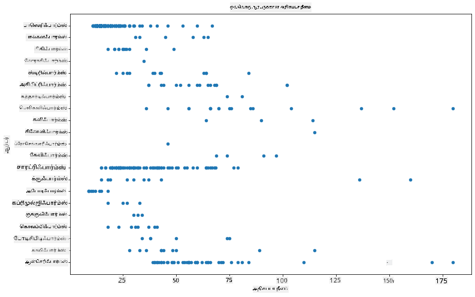
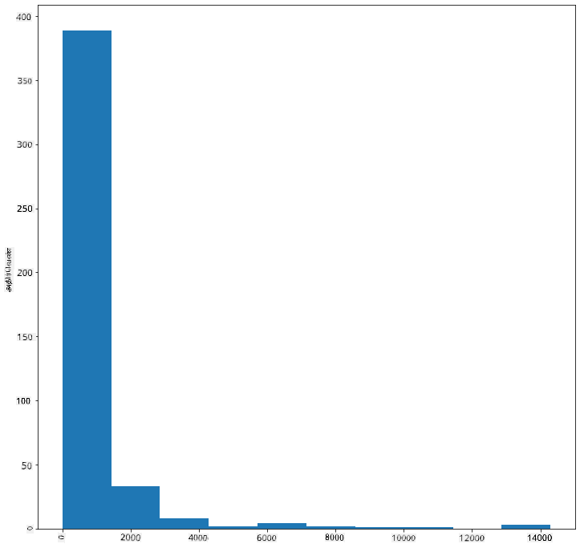
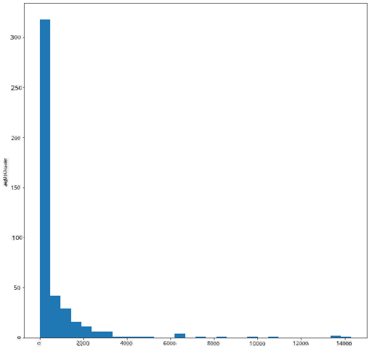
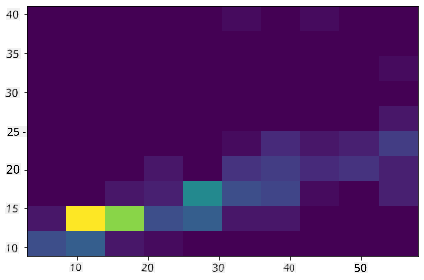
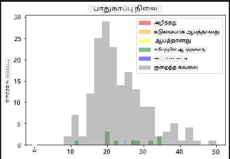
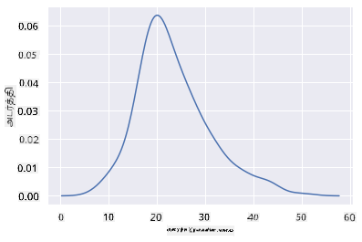
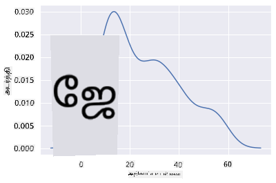
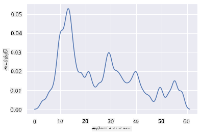
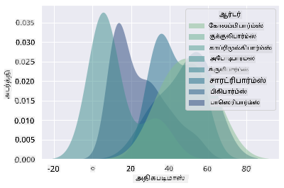
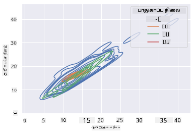

<!--
CO_OP_TRANSLATOR_METADATA:
{
  "original_hash": "80a20467e046d312809d008395051fc7",
  "translation_date": "2025-10-11T15:53:35+00:00",
  "source_file": "3-Data-Visualization/10-visualization-distributions/README.md",
  "language_code": "ta"
}
-->
# விநியோகங்களை காட்சிப்படுத்துதல்

| ](../../sketchnotes/10-Visualizing-Distributions.png)|
|:---:|
| விநியோகங்களை காட்சிப்படுத்துதல் - _Sketchnote by [@nitya](https://twitter.com/nitya)_ |

முந்தைய பாடத்தில், மினசோட்டாவின் பறவைகள் பற்றிய தரவுத்தொகுப்பில் சில சுவாரஸ்யமான தகவல்களை நீங்கள் கற்றுக்கொண்டீர்கள். புறம்பான தரவுகளை காட்சிப்படுத்துவதன் மூலம் சில தவறான தரவுகளை கண்டறிந்தீர்கள் மற்றும் பறவைகள் வகைகளின் அதிகபட்ச நீளத்தின் வேறுபாடுகளைப் பார்த்தீர்கள்.

## [பாடத்திற்கு முன் வினாடி வினா](https://ff-quizzes.netlify.app/en/ds/quiz/18)
## பறவைகள் தரவுத்தொகுப்பை ஆராயுங்கள்

தரவை ஆராய்வதற்கான மற்றொரு வழி அதன் விநியோகத்தைப் பார்க்கும் வழியாகும், அதாவது தரவு ஒரு அச்சில் எவ்வாறு ஒழுங்குபடுத்தப்பட்டுள்ளது என்பதைப் பார்க்கும் வழி. உதாரணமாக, மினசோட்டாவின் பறவைகளின் அதிகபட்ச இறகளவு அல்லது அதிகபட்ச உடல் எடை பற்றிய பொது விநியோகத்தை நீங்கள் அறிய விரும்பலாம்.

இந்த தரவுத்தொகுப்பில் உள்ள தரவின் விநியோகங்கள் பற்றிய சில தகவல்களை கண்டறிவோம். இந்த பாடத்தின் கோப்பகத்தின் அடிப்பகுதியில் உள்ள _notebook.ipynb_ கோப்பில் Pandas, Matplotlib மற்றும் உங்கள் தரவுகளை இறக்குமதி செய்யுங்கள்:

```python
import pandas as pd
import matplotlib.pyplot as plt
birds = pd.read_csv('../../data/birds.csv')
birds.head()
```

|      | Name                         | ScientificName         | Category              | Order        | Family   | Genus       | ConservationStatus | MinLength | MaxLength | MinBodyMass | MaxBodyMass | MinWingspan | MaxWingspan |
| ---: | :--------------------------- | :--------------------- | :-------------------- | :----------- | :------- | :---------- | :----------------- | --------: | --------: | ----------: | ----------: | ----------: | ----------: |
|    0 | Black-bellied whistling-duck | Dendrocygna autumnalis | Ducks/Geese/Waterfowl | Anseriformes | Anatidae | Dendrocygna | LC                 |        47 |        56 |         652 |        1020 |          76 |          94 |
|    1 | Fulvous whistling-duck       | Dendrocygna bicolor    | Ducks/Geese/Waterfowl | Anseriformes | Anatidae | Dendrocygna | LC                 |        45 |        53 |         712 |        1050 |          85 |          93 |
|    2 | Snow goose                   | Anser caerulescens     | Ducks/Geese/Waterfowl | Anseriformes | Anatidae | Anser       | LC                 |        64 |        79 |        2050 |        4050 |         135 |         165 |
|    3 | Ross's goose                 | Anser rossii           | Ducks/Geese/Waterfowl | Anseriformes | Anatidae | Anser       | LC                 |      57.3 |        64 |        1066 |        1567 |         113 |         116 |
|    4 | Greater white-fronted goose  | Anser albifrons        | Ducks/Geese/Waterfowl | Anseriformes | Anatidae | Anser       | LC                 |        64 |        81 |        1930 |        3310 |         130 |         165 |

பொதுவாக, தரவு எவ்வாறு விநியோகமாக உள்ளது என்பதை விரைவாக பார்க்க நீங்கள் முந்தைய பாடத்தில் செய்தது போல ஒரு சிதறல் வரைபடத்தைப் பயன்படுத்தலாம்:

```python
birds.plot(kind='scatter',x='MaxLength',y='Order',figsize=(12,8))

plt.title('Max Length per Order')
plt.ylabel('Order')
plt.xlabel('Max Length')

plt.show()
```


இது ஒவ்வொரு பறவையின் வரிசையின் உடல் நீளத்தின் பொது விநியோகத்தை ஒரு பார்வையில் காட்டுகிறது, ஆனால் உண்மையான விநியோகங்களை காட்சிப்படுத்த இது சிறந்த வழி அல்ல. இந்த பணியை சாதாரணமாக ஹிஸ்டோகிராம் உருவாக்குவதன் மூலம் செய்யலாம்.
## ஹிஸ்டோகிராம்களுடன் வேலை செய்வது

Matplotlib ஹிஸ்டோகிராம்களைப் பயன்படுத்தி தரவின் விநியோகத்தை காட்சிப்படுத்த சிறந்த வழிகளை வழங்குகிறது. இந்த வகை வரைபடம் ஒரு பட்டி வரைபடம் போன்றது, இதில் விநியோகம் பட்டிகளின் உயர்வு மற்றும் சரிவின் மூலம் காணப்படலாம். ஹிஸ்டோகிராம் உருவாக்க, உங்களுக்கு எண் தரவு தேவை. ஹிஸ்டோகிராம் உருவாக்க, 'hist' என வகையை வரையறுத்து ஒரு வரைபடத்தை வரைபடமாக்கலாம். இந்த வரைபடம் முழு தரவுத்தொகுப்பின் எண்ணியல் தரவின் வரம்புக்கான MaxBodyMass விநியோகத்தை காட்டுகிறது. தரவின் வரிசையை சிறிய பின்களாகப் பிரிப்பதன் மூலம், இது தரவின் மதிப்புகளின் விநியோகத்தை காட்சிப்படுத்த முடியும்:

```python
birds['MaxBodyMass'].plot(kind = 'hist', bins = 10, figsize = (12,12))
plt.show()
```


நீங்கள் காணக்கூடியது போல, இந்த தரவுத்தொகுப்பில் உள்ள 400+ பறவைகளில் பெரும்பாலானவை Max Body Mass 2000 க்கும் குறைவாக உள்ள வரம்பில் உள்ளன. `bins` அளவுருவை 30 போன்ற அதிக எண்ணிக்கைக்கு மாற்றுவதன் மூலம் தரவின் மீது மேலும் தெளிவான பார்வையைப் பெறுங்கள்:

```python
birds['MaxBodyMass'].plot(kind = 'hist', bins = 30, figsize = (12,12))
plt.show()
```


இந்த வரைபடம் விநியோகத்தை மேலும் நுணுக்கமாக காட்டுகிறது. இடது பக்கம் குறைவாக சாய்ந்த ஒரு வரைபடத்தை நீங்கள் ஒரு குறிப்பிட்ட வரம்பில் உள்ள தரவை மட்டும் தேர்ந்தெடுப்பதன் மூலம் உருவாக்கலாம்:

உங்கள் தரவை வடிகட்டி, உடல் எடை 60 க்கும் குறைவாக உள்ள பறவைகளை மட்டும் பெறுங்கள், மேலும் 40 `bins` காட்சிப்படுத்துங்கள்:

```python
filteredBirds = birds[(birds['MaxBodyMass'] > 1) & (birds['MaxBodyMass'] < 60)]      
filteredBirds['MaxBodyMass'].plot(kind = 'hist',bins = 40,figsize = (12,12))
plt.show()     
```


✅ மற்ற வடிகட்டல்கள் மற்றும் தரவுப் புள்ளிகளை முயற்சிக்கவும். தரவின் முழு விநியோகத்தைப் பார்க்க, `['MaxBodyMass']` வடிகட்டலை நீக்கி லேபிள் செய்யப்பட்ட விநியோகங்களை காட்சிப்படுத்தவும்.

ஹிஸ்டோகிராம் சில நல்ல நிறம் மற்றும் லேபிள் மேம்பாடுகளை முயற்சிக்கவும்:

இரண்டு விநியோகங்களின் இடையிலான தொடர்பை ஒப்பிட 2D ஹிஸ்டோகிராம் உருவாக்குங்கள். `MaxBodyMass` மற்றும் `MaxLength` ஐ ஒப்பிடுவோம். Matplotlib பிரகாசமான நிறங்களைப் பயன்படுத்தி ஒருங்கிணைப்பை காட்ட ஒரு உள்ளமைந்த வழியை வழங்குகிறது:

```python
x = filteredBirds['MaxBodyMass']
y = filteredBirds['MaxLength']

fig, ax = plt.subplots(tight_layout=True)
hist = ax.hist2d(x, y)
```
இந்த இரண்டு கூறுகளின் இடையே எதிர்பார்க்கப்பட்ட அச்சில் ஒரு எதிர்பார்க்கப்பட்ட தொடர்பு உள்ளது, குறிப்பாக ஒரு வலுவான ஒருங்கிணைப்பு புள்ளியுடன்:



ஹிஸ்டோகிராம்கள் இயல்பாக எண்ணியல் தரவுகளுக்கு நன்றாக வேலை செய்கின்றன. உரை தரவுகளின் அடிப்படையில் விநியோகங்களை நீங்கள் பார்க்க வேண்டியிருந்தால் என்ன செய்வீர்கள்? 
## உரை தரவுகளைப் பயன்படுத்தி விநியோகங்களை ஆராயுங்கள் 

இந்த தரவுத்தொகுப்பில் பறவையின் வகை மற்றும் அதன் ஜெனஸ், இனங்கள் மற்றும் குடும்பம் மற்றும் அதன் பாதுகாப்பு நிலை பற்றிய நல்ல தகவல்களும் உள்ளன. இந்த பாதுகாப்பு தகவலை ஆராய்வோம். பறவைகள் பாதுகாப்பு நிலையின் அடிப்படையில் எவ்வாறு விநியோகமாக உள்ளன?

> ✅ இந்த தரவுத்தொகுப்பில், பாதுகாப்பு நிலையை விவரிக்க பல சுருக்கெழுத்துகள் பயன்படுத்தப்படுகின்றன. இந்த சுருக்கெழுத்துகள் [IUCN Red List Categories](https://www.iucnredlist.org/) என்ற அமைப்பிலிருந்து வருகின்றன, இது இனங்களின் நிலையை பட்டியலிடும் அமைப்பு.
> 
> - CR: மிகவும் ஆபத்தானது
> - EN: ஆபத்தானது
> - EX: அழிந்தது
> - LC: குறைந்த கவலை
> - NT: அருகிலுள்ள ஆபத்து
> - VU: பாதிக்கப்படக்கூடியது

இவை உரை அடிப்படையிலான மதிப்புகள் ஆகும், எனவே ஹிஸ்டோகிராம் உருவாக்க மாற்றம் செய்ய வேண்டும். FilteredBirds dataframe ஐப் பயன்படுத்தி, அதன் பாதுகாப்பு நிலையை அதன் குறைந்தபட்ச இறகளவுடன் காட்சிப்படுத்துங்கள். நீங்கள் என்ன காண்கிறீர்கள்?

```python
x1 = filteredBirds.loc[filteredBirds.ConservationStatus=='EX', 'MinWingspan']
x2 = filteredBirds.loc[filteredBirds.ConservationStatus=='CR', 'MinWingspan']
x3 = filteredBirds.loc[filteredBirds.ConservationStatus=='EN', 'MinWingspan']
x4 = filteredBirds.loc[filteredBirds.ConservationStatus=='NT', 'MinWingspan']
x5 = filteredBirds.loc[filteredBirds.ConservationStatus=='VU', 'MinWingspan']
x6 = filteredBirds.loc[filteredBirds.ConservationStatus=='LC', 'MinWingspan']

kwargs = dict(alpha=0.5, bins=20)

plt.hist(x1, **kwargs, color='red', label='Extinct')
plt.hist(x2, **kwargs, color='orange', label='Critically Endangered')
plt.hist(x3, **kwargs, color='yellow', label='Endangered')
plt.hist(x4, **kwargs, color='green', label='Near Threatened')
plt.hist(x5, **kwargs, color='blue', label='Vulnerable')
plt.hist(x6, **kwargs, color='gray', label='Least Concern')

plt.gca().set(title='Conservation Status', ylabel='Min Wingspan')
plt.legend();
```



குறைந்தபட்ச இறகளவு மற்றும் பாதுகாப்பு நிலைக்கு இடையில் நல்ல தொடர்பு இல்லை என்று தோன்றுகிறது. இந்த முறையைப் பயன்படுத்தி தரவுத்தொகுப்பின் பிற கூறுகளைச் சோதிக்கவும். நீங்கள் வேறு தொடர்புகளை கண்டுபிடிக்கிறீர்களா?

## அடர்த்தி வரைபடங்கள்

இப்போது வரைபடங்கள் 'கட்டம் கட்டமாக' உள்ளன மற்றும் ஒரு வளைவில் மென்மையாக ஓடவில்லை என்பதை நீங்கள் கவனித்திருக்கலாம். மென்மையான அடர்த்தி வரைபடத்தை காட்ட, நீங்கள் அடர்த்தி வரைபடத்தை முயற்சிக்கலாம்.

அடர்த்தி வரைபடங்களுடன் வேலை செய்ய, புதிய வரைபட நூலகமான [Seaborn](https://seaborn.pydata.org/generated/seaborn.kdeplot.html) ஐ அறிந்து கொள்ளுங்கள்.

Seaborn ஐ ஏற்ற, அடிப்படை அடர்த்தி வரைபடத்தை முயற்சிக்கவும்:

```python
import seaborn as sns
import matplotlib.pyplot as plt
sns.kdeplot(filteredBirds['MinWingspan'])
plt.show()
```


குறைந்தபட்ச இறகளவு தரவுக்கான முந்தைய வரைபடத்தை இது எவ்வாறு பிரதிபலிக்கிறது என்பதை நீங்கள் காணலாம்; இது கொஞ்சம் மென்மையாக உள்ளது. Seaborn இன் ஆவணங்களின் படி, "ஹிஸ்டோகிராமுடன் ஒப்பிடும்போது, ​​KDE ஒரு குறைவாக குழப்பமான மற்றும் அதிகமாக விளக்கக்கூடிய வரைபடத்தை உருவாக்க முடியும், குறிப்பாக பல விநியோகங்களை வரையும்போது. ஆனால் அடிப்படை விநியோகம் கட்டுப்படுத்தப்பட்ட அல்லது மென்மையானதாக இல்லாவிட்டால், இது விகிதாச்சித்ரங்களை அறிமுகப்படுத்தும் சாத்தியம் உள்ளது. ஹிஸ்டோகிராமைப் போலவே, நல்ல மென்மையான அளவுருக்களைத் தேர்ந்தெடுப்பது பிரதிநிதித்துவத்தின் தரத்தைப் பாதிக்கிறது." [source](https://seaborn.pydata.org/generated/seaborn.kdeplot.html) மற்ற வார்த்தைகளில், எப்போதும் போல புறம்பானவை உங்கள் வரைபடங்களை தவறாக நடக்கச் செய்யும்.

முதலாவது வரைபடத்தில் நீங்கள் உருவாக்கிய MaxBodyMass கோட்டை மீண்டும் பார்க்க விரும்பினால், இந்த முறையைப் பயன்படுத்தி அதை மிகவும் மென்மையாகச் செய்யலாம்:

```python
sns.kdeplot(filteredBirds['MaxBodyMass'])
plt.show()
```


மிகவும் மென்மையான, ஆனால் மிக மென்மையான கோடு வேண்டுமெனில், `bw_adjust` அளவுருவைத் திருத்தவும்:

```python
sns.kdeplot(filteredBirds['MaxBodyMass'], bw_adjust=.2)
plt.show()
```


✅ இந்த வகை வரைபடத்திற்கான அளவுருக்களைப் பற்றி படிக்கவும் மற்றும் பரிசோதிக்கவும்!

இந்த வகை வரைபடம் அழகாக விளக்கக்கூடிய காட்சிகளை வழங்குகிறது. சில கோடுகளின் மூலம், உதாரணமாக, ஒவ்வொரு பறவையின் வரிசைக்கு அதிகபட்ச உடல் எடை அடர்த்தியை நீங்கள் காட்டலாம்:

```python
sns.kdeplot(
   data=filteredBirds, x="MaxBodyMass", hue="Order",
   fill=True, common_norm=False, palette="crest",
   alpha=.5, linewidth=0,
)
```



ஒரே வரைபடத்தில் பல மாறிகளின் அடர்த்தியை நீங்கள் வரைபடமாக்கலாம். ஒரு பறவையின் MaxLength மற்றும் MinLength ஐ அதன் பாதுகாப்பு நிலைக்கு ஒப்பிடுங்கள்:

```python
sns.kdeplot(data=filteredBirds, x="MinLength", y="MaxLength", hue="ConservationStatus")
```



'பாதிக்கப்படக்கூடிய' பறவைகள் அதன் நீளத்தின் அடிப்படையில் உள்ள குழு பொருத்தமானதா என்பதை ஆராய்வது மதிப்புமிக்கதா என்பதை ஆராய்வது பொருத்தமாக இருக்கலாம்.

## 🚀 சவால்

ஹிஸ்டோகிராம்கள் அடிப்படை சிதறல் வரைபடங்கள், பட்டி வரைபடங்கள் அல்லது கோடு வரைபடங்களுடன் ஒப்பிடும்போது ஒரு நவீன வகை வரைபடமாகும். ஹிஸ்டோகிராம்கள் பயன்படுத்தப்படும் நல்ல உதாரணங்களை இணையத்தில் தேடுங்கள். அவை எவ்வாறு பயன்படுத்தப்படுகின்றன, அவை என்ன காட்டுகின்றன, மற்றும் எந்த துறைகள் அல்லது ஆராய்ச்சி பகுதிகளில் அவை பெரும்பாலும் பயன்படுத்தப்படுகின்றன?

## [பாடத்திற்கு பின் வினாடி வினா](https://ff-quizzes.netlify.app/en/ds/quiz/19)

## மதிப்பீடு & சுயபடிப்பு

இந்த பாடத்தில், நீங்கள் Matplotlib ஐ பயன்படுத்தி Seaborn உடன் வேலை செய்யத் தொடங்கினீர்கள், மேலும் நவீனமான வரைபடங்களை உருவாக்கினீர்கள். Seaborn இல் `kdeplot` பற்றிய ஆராய்ச்சி செய்யுங்கள், இது "ஒரு அல்லது அதற்கு மேற்பட்ட பரிமாணங்களில் தொடர்ச்சியான சாத்தியமான அடர்த்தி வளைவு". [ஆவணங்களை](https://seaborn.pydata.org/generated/seaborn.kdeplot.html) படித்து அது எவ்வாறு செயல்படுகிறது என்பதைப் புரிந்துகொள்ளுங்கள்.

## பணிக்கான ஒதுக்கீடு

[உங்கள் திறன்களைப் பயன்படுத்துங்கள்](assignment.md)

---

**குறிப்பு**:  
இந்த ஆவணம் [Co-op Translator](https://github.com/Azure/co-op-translator) என்ற AI மொழிபெயர்ப்பு சேவையைப் பயன்படுத்தி மொழிபெயர்க்கப்பட்டுள்ளது. நாங்கள் துல்லியத்திற்காக முயற்சிக்கின்றோம், ஆனால் தானியங்கி மொழிபெயர்ப்புகளில் பிழைகள் அல்லது தவறான தகவல்கள் இருக்கக்கூடும் என்பதை கவனத்தில் கொள்ளவும். அதன் தாய்மொழியில் உள்ள மூல ஆவணம் அதிகாரப்பூர்வ ஆதாரமாக கருதப்பட வேண்டும். முக்கியமான தகவல்களுக்கு, தொழில்முறை மனித மொழிபெயர்ப்பு பரிந்துரைக்கப்படுகிறது. இந்த மொழிபெயர்ப்பைப் பயன்படுத்துவதால் ஏற்படும் எந்த தவறான புரிதல்கள் அல்லது தவறான விளக்கங்களுக்கு நாங்கள் பொறுப்பல்ல.