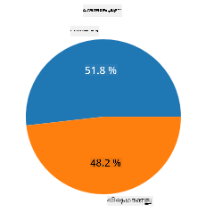
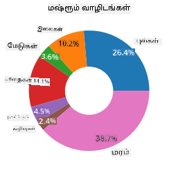
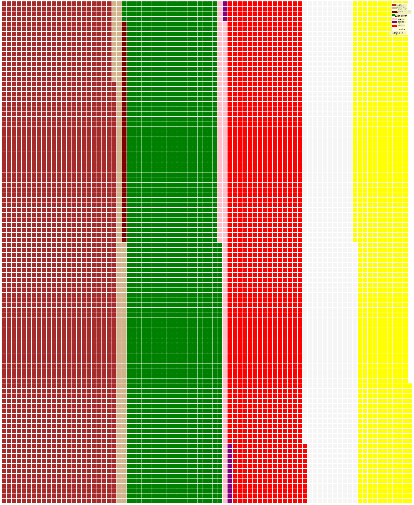

<!--
CO_OP_TRANSLATOR_METADATA:
{
  "original_hash": "42119bcc97bee88254e381156d770f3c",
  "translation_date": "2025-10-11T15:54:42+00:00",
  "source_file": "3-Data-Visualization/11-visualization-proportions/README.md",
  "language_code": "ta"
}
-->
# விகிதங்களை காட்சிப்படுத்துதல்

| ](../../sketchnotes/11-Visualizing-Proportions.png)|
|:---:|
|விகிதங்களை காட்சிப்படுத்துதல் - _Sketchnote by [@nitya](https://twitter.com/nitya)_ |

இந்த பாடத்தில், நீங்கள் இயற்கை சார்ந்த வேறு தரவுத்தொகுப்பைப் பயன்படுத்தி விகிதங்களை காட்சிப்படுத்தப் போகிறீர்கள், உதாரணமாக, காளான் பற்றிய தரவுத்தொகுப்பில் எத்தனை வகையான பூஞ்சைகள் உள்ளன என்பதைப் பார்க்கலாம். Audubon-இன் தரவுத்தொகுப்பிலிருந்து பெறப்பட்ட Agaricus மற்றும் Lepiota குடும்பங்களில் உள்ள 23 வகையான காளான்களின் விவரங்களைப் பயன்படுத்தி இந்த அற்புதமான பூஞ்சைகளை ஆராய்வோம். நீங்கள் பின்வரும் சுவையான காட்சிகளை முயற்சிக்கலாம்:

- பை வரைபடங்கள் 🥧
- டோனட் வரைபடங்கள் 🍩
- வாஃபிள் வரைபடங்கள் 🧇

> 💡 Microsoft Research-இன் [Charticulator](https://charticulator.com) எனும் ஒரு மிகவும் 흥미로운 திட்டம் தரவுக் காட்சிப்படுத்தலுக்கான இலவச டிராக் அண்ட் டிராப் இடைமுகத்தை வழங்குகிறது. அவர்களின் ஒரு டுடோரியலில் கூட இந்த காளான் தரவுத்தொகுப்பைப் பயன்படுத்துகிறார்கள்! எனவே, நீங்கள் தரவுகளை ஆராய்ந்து, அதே நேரத்தில் நூலகத்தைப் பற்றியும் கற்றுக்கொள்ளலாம்: [Charticulator tutorial](https://charticulator.com/tutorials/tutorial4.html).

## [பாடத்திற்கு முன் வினாடி வினா](https://ff-quizzes.netlify.app/en/ds/quiz/20)

## உங்கள் காளான்களைப் பற்றி அறிந்து கொள்ளுங்கள் 🍄

காளான்கள் மிகவும் 흥미மானவை. அவற்றைப் படிக்க ஒரு தரவுத்தொகுப்பை இறக்குமதி செய்வோம்:

```python
import pandas as pd
import matplotlib.pyplot as plt
mushrooms = pd.read_csv('../../data/mushrooms.csv')
mushrooms.head()
```
ஒரு அட்டவணை அச்சிடப்பட்டு, பகுப்பாய்வுக்கான சிறந்த தரவுகளை வழங்குகிறது:


| வகுப்பு     | தொப்பி வடிவம் | தொப்பி மேற்பரப்பு | தொப்பி நிறம் | காயம் | மணம்    | கில்கள் இணைப்பு | கில்கள் இடைவெளி | கில்கள் அளவு | கில்கள் நிறம் | கம்பம் வடிவம் | கம்பம் வேர்கள் | கம்பம் மேற்பரப்பு-கோடு மேல் | கம்பம் மேற்பரப்பு-கோடு கீழ் | கம்பம் நிறம்-கோடு மேல் | கம்பம் நிறம்-கோடு கீழ் | மடல் வகை | மடல் நிறம் | வளைய எண் | வளைய வகை | மஞ்சள்-அச்சு-நிறம் | மக்கள் தொகை | வாழிடம் |
| --------- | --------- | ----------- | --------- | ------- | ------- | --------------- | ------------ | --------- | ---------- | ----------- | ---------- | ------------------------ | ------------------------ | ---------------------- | ---------------------- | --------- | ---------- | ----------- | --------- | ----------------- | ---------- | ------- |
| விஷம்     | வளைந்தது    | மிருதுவானது      | பழுப்பு     | காயம் | துர்நாற்றம் | சுதந்திரம்            | நெருக்கமானது        | குறுகியது    | கருப்பு      | பெரிதாக்குதல்   | சமமானது      | மிருதுவானது                   | மிருதுவானது                   | வெள்ளை                  | வெள்ளை                  | பகுதி   | வெள்ளை      | ஒன்று         | தொங்கும்   | கருப்பு             | சிதறியவை  | நகரம்   |
| சாப்பிடக்கூடியது    | வளைந்தது    | மிருதுவானது      | மஞ்சள்    | காயம் | பாதாம்  | சுதந்திரம்            | நெருக்கமானது        | அகலமானது     | கருப்பு      | பெரிதாக்குதல்   | கிளப்       | மிருதுவானது                   | மிருதுவானது                   | வெள்ளை                  | வெள்ளை                  | பகுதி   | வெள்ளை      | ஒன்று         | தொங்கும்   | பழுப்பு             | ஏராளமானவை   | புல்வெளிகள் |
| சாப்பிடக்கூடியது    | மணி      | மிருதுவானது      | வெள்ளை     | காயம் | சோம்பல்   | சுதந்திரம்            | நெருக்கமானது        | அகலமானது     | பழுப்பு      | பெரிதாக்குதல்   | கிளப்       | மிருதுவானது                   | மிருதுவானது                   | வெள்ளை                  | வெள்ளை                  | பகுதி   | வெள்ளை      | ஒன்று         | தொங்கும்   | பழுப்பு             | ஏராளமானவை   | புலங்கள் |
| விஷம்     | வளைந்தது    | பரப்பானது       | வெள்ளை     | காயம் | துர்நாற்றம் | சுதந்திரம்            | நெருக்கமானது        | குறுகியது    | பழுப்பு      | பெரிதாக்குதல்   | சமமானது      | மிருதுவானது                   | மிருதுவானது                   | வெள்ளை                  | வெள்ளை                  | பகுதி   | வெள்ளை      | ஒன்று         | தொங்கும்   | கருப்பு             | சிதறியவை  | நகரம்   |

உடனடியாக, அனைத்து தரவுகளும் உரை வடிவத்தில் இருப்பதை நீங்கள் கவனிக்கிறீர்கள். இந்த தரவுகளை ஒரு வரைபடத்தில் பயன்படுத்த, நீங்கள் மாற்ற வேண்டும். உண்மையில், பெரும்பாலான தரவுகள் ஒரு பொருளாக பிரதிநிதித்துவம் செய்கின்றன:

```python
print(mushrooms.select_dtypes(["object"]).columns)
```

வெளியீடு:

```output
Index(['class', 'cap-shape', 'cap-surface', 'cap-color', 'bruises', 'odor',
       'gill-attachment', 'gill-spacing', 'gill-size', 'gill-color',
       'stalk-shape', 'stalk-root', 'stalk-surface-above-ring',
       'stalk-surface-below-ring', 'stalk-color-above-ring',
       'stalk-color-below-ring', 'veil-type', 'veil-color', 'ring-number',
       'ring-type', 'spore-print-color', 'population', 'habitat'],
      dtype='object')
```
இந்த தரவுகளை எடுத்து 'வகுப்பு' நெடுவரிசையை ஒரு வகையாக மாற்றுங்கள்:

```python
cols = mushrooms.select_dtypes(["object"]).columns
mushrooms[cols] = mushrooms[cols].astype('category')
```

```python
edibleclass=mushrooms.groupby(['class']).count()
edibleclass
```

இப்போது, நீங்கள் காளான் தரவுகளை அச்சிடினால், அது விஷம்/சாப்பிடக்கூடிய வகுப்புகளின் படி பிரிக்கப்பட்டு வகைகளாகக் குழுவாக்கப்பட்டிருப்பதை நீங்கள் காணலாம்:


|           | தொப்பி வடிவம் | தொப்பி மேற்பரப்பு | தொப்பி நிறம் | காயம் | மணம் | கில்கள் இணைப்பு | கில்கள் இடைவெளி | கில்கள் அளவு | கில்கள் நிறம் | கம்பம் வடிவம் | ... | கம்பம் மேற்பரப்பு-கோடு கீழ் | கம்பம் நிறம்-கோடு மேல் | கம்பம் நிறம்-கோடு கீழ் | மடல் வகை | மடல் நிறம் | வளைய எண் | வளைய வகை | மஞ்சள்-அச்சு-நிறம் | மக்கள் தொகை | வாழிடம் |
| --------- | --------- | ----------- | --------- | ------- | ---- | --------------- | ------------ | --------- | ---------- | ----------- | --- | ------------------------ | ---------------------- | ---------------------- | --------- | ---------- | ----------- | --------- | ----------------- | ---------- | ------- |
| வகுப்பு     |           |             |           |         |      |                 |              |           |            |             |     |                          |                        |                        |           |            |             |           |                   |            |         |
| சாப்பிடக்கூடியது    | 4208      | 4208        | 4208      | 4208    | 4208 | 4208            | 4208         | 4208      | 4208       | 4208        | ... | 4208                     | 4208                   | 4208                   | 4208      | 4208       | 4208        | 4208      | 4208              | 4208       | 4208    |
| விஷம்     | 3916      | 3916        | 3916      | 3916    | 3916 | 3916            | 3916         | 3916      | 3916       | 3916        | ... | 3916                     | 3916                   | 3916                   | 3916      | 3916       | 3916        | 3916      | 3916              | 3916       | 3916    |

இந்த அட்டவணையில் வழங்கப்பட்ட வரிசையைப் பின்பற்றி உங்கள் வகுப்பு வகை லேபிள்களை உருவாக்கினால், நீங்கள் ஒரு பை வரைபடத்தை உருவாக்கலாம்:

## பை!

```python
labels=['Edible','Poisonous']
plt.pie(edibleclass['population'],labels=labels,autopct='%.1f %%')
plt.title('Edible?')
plt.show()
```
வோலா, இந்த இரண்டு வகுப்புகளின் படி தரவின் விகிதங்களை காட்டும் ஒரு பை வரைபடம். குறிப்பாக இங்கு லேபிள் வரிசையின் சரியான ஒழுங்கை பெறுவது மிகவும் முக்கியம், எனவே லேபிள் வரிசை உருவாக்கப்படும் ஒழுங்கை சரிபார்க்க உறுதியாக இருங்கள்!



## டோனட்கள்!

ஒரு சிறிது காட்சிப்படுத்துவதற்கு 흥미க்கூடிய பை வரைபடம் என்பது டோனட் வரைபடம், இது நடுவில் ஒரு துளையுடன் கூடிய பை வரைபடம். இந்த முறையைப் பயன்படுத்தி உங்கள் தரவுகளைப் பார்ப்போம்.

காளான்கள் வளரும் பல்வேறு வாழிடங்களைப் பாருங்கள்:

```python
habitat=mushrooms.groupby(['habitat']).count()
habitat
```
இங்கு, உங்கள் தரவுகளை வாழிடத்தின் படி குழுவாக்குகிறீர்கள். 7 வாழிடங்கள் பட்டியலிடப்பட்டுள்ளன, எனவே உங்கள் டோனட் வரைபடத்திற்கான லேபிள்களாக அவற்றைப் பயன்படுத்துங்கள்:

```python
labels=['Grasses','Leaves','Meadows','Paths','Urban','Waste','Wood']

plt.pie(habitat['class'], labels=labels,
        autopct='%1.1f%%', pctdistance=0.85)
  
center_circle = plt.Circle((0, 0), 0.40, fc='white')
fig = plt.gcf()

fig.gca().add_artist(center_circle)
  
plt.title('Mushroom Habitats')
  
plt.show()
```



இந்த குறியீடு ஒரு வரைபடத்தையும் ஒரு மைய வட்டத்தையும் வரைகிறது, பின்னர் அந்த மைய வட்டத்தை வரைபடத்தில் சேர்க்கிறது. மைய வட்டத்தின் அகலத்தை `0.40` ஐ மற்றொரு மதிப்பாக மாற்றுவதன் மூலம் திருத்துங்கள்.

டோனட் வரைபடங்களை பல வழிகளில் மாற்றி லேபிள்களை மாற்றலாம். குறிப்பாக, லேபிள்களை வாசிக்க எளிதாக்கலாம். மேலும் [docs](https://matplotlib.org/stable/gallery/pie_and_polar_charts/pie_and_donut_labels.html?highlight=donut) இல் அறிக.

இப்போது உங்கள் தரவுகளை குழுவாக்கி அதை பை அல்லது டோனட் வடிவில் காட்சிப்படுத்துவது எப்படி என்பதை நீங்கள் அறிந்துள்ளீர்கள், நீங்கள் மற்ற வகையான வரைபடங்களை ஆராயலாம். வாஃபிள் வரைபடத்தை முயற்சிக்கவும், இது அளவுகளை 2D சதுரங்களின் வரிசையாக காட்சிப்படுத்தும் ஒரு வேறுபட்ட வழியாகும்.
## வாஃபிள்கள்!

'வாஃபிள்' வகை வரைபடம் என்பது அளவுகளை 2D சதுரங்களின் வரிசையாக காட்சிப்படுத்தும் ஒரு வேறுபட்ட வழியாகும். இந்த தரவுத்தொகுப்பில் காளான் தொப்பி நிறங்களின் வெவ்வேறு அளவுகளை காட்சிப்படுத்த முயற்சிக்கவும். இதைச் செய்ய, [PyWaffle](https://pypi.org/project/pywaffle/) எனும் உதவிக் நூலகத்தை நிறுவி Matplotlib ஐப் பயன்படுத்தவும்:

```python
pip install pywaffle
```

உங்கள் தரவின் ஒரு பகுதியைத் தேர்ந்தெடுத்து குழுவாக்கவும்:

```python
capcolor=mushrooms.groupby(['cap-color']).count()
capcolor
```

லேபிள்களை உருவாக்கி உங்கள் தரவுகளை குழுவாக்குவதன் மூலம் ஒரு வாஃபிள் வரைபடத்தை உருவாக்கவும்:

```python
import pandas as pd
import matplotlib.pyplot as plt
from pywaffle import Waffle
  
data ={'color': ['brown', 'buff', 'cinnamon', 'green', 'pink', 'purple', 'red', 'white', 'yellow'],
    'amount': capcolor['class']
     }
  
df = pd.DataFrame(data)
  
fig = plt.figure(
    FigureClass = Waffle,
    rows = 100,
    values = df.amount,
    labels = list(df.color),
    figsize = (30,30),
    colors=["brown", "tan", "maroon", "green", "pink", "purple", "red", "whitesmoke", "yellow"],
)
```

வாஃபிள் வரைபடத்தைப் பயன்படுத்தி, இந்த காளான் தரவுத்தொகுப்பின் தொப்பி நிறங்களின் விகிதங்களை தெளிவாகக் காணலாம். 흥미க்கூடாக, பல பச்சை-தொப்பி காளான்கள் உள்ளன!



✅ Pywaffle [Font Awesome](https://fontawesome.com/) இல் கிடைக்கும் எந்த ஐகானையும் பயன்படுத்தும் வரைபடங்களில் ஐகான்களை ஆதரிக்கிறது. சதுரங்களுக்குப் பதிலாக ஐகான்களைப் பயன்படுத்தி மேலும் 흥미க்கூடிய வாஃபிள் வரைபடத்தை உருவாக்க சில பரிசோதனைகளைச் செய்யுங்கள்.

இந்த பாடத்தில், நீங்கள் விகிதங்களை காட்சிப்படுத்த மூன்று வழிகளை கற்றுக்கொண்டீர்கள். முதலில், உங்கள் தரவுகளை வகைகளாகக் குழுவாக்க வேண்டும், பின்னர் தரவுகளை காட்சிப்படுத்த சிறந்த வழி எது என்பதைத் தீர்மானிக்க வேண்டும் - பை, டோனட் அல்லது வாஃபிள். அனைத்தும் சுவையானவை மற்றும் ஒரு தரவுத்தொகுப்பின் உடனடி கண்ணோட்டத்தை வழங்கி பயனரை மகிழ்விக்கின்றன.

## 🚀 சவால்

இந்த சுவையான வரைபடங்களை [Charticulator](https://charticulator.com) இல் மீண்டும் உருவாக்க முயற்சிக்கவும்.
## [பாடத்திற்குப் பின் வினாடி வினா](https://ff-quizzes.netlify.app/en/ds/quiz/21)

## மதிப்பீடு & சுயபடிப்பு

எப்போது பை, டோனட் அல்லது வாஃபிள் வரைபடத்தைப் பயன்படுத்த வேண்டும் என்பது சில நேரங்களில் தெளிவாக இருக்காது. இந்த தலைப்பில் படிக்க சில கட்டுரைகள் இங்கே:

https://www.beautiful.ai/blog/battle-of-the-charts-pie-chart-vs-donut-chart

https://medium.com/@hypsypops/pie-chart-vs-donut-chart-showdown-in-the-ring-5d24fd86a9ce

https://www.mit.edu/~mbarker/formula1/f1help/11-ch-c6.htm

https://medium.datadriveninvestor.com/data-visualization-done-the-right-way-with-tableau-waffle-chart-fdf2a19be402

இந்த சிக்கலான முடிவைப் பற்றிய மேலும் தகவல்களைத் தேடி ஆராயுங்கள்.
## பணிக்கட்டளை

[Excel இல் முயற்சிக்கவும்](assignment.md)

---

**குறிப்பு**:  
இந்த ஆவணம் [Co-op Translator](https://github.com/Azure/co-op-translator) என்ற AI மொழிபெயர்ப்பு சேவையைப் பயன்படுத்தி மொழிபெயர்க்கப்பட்டுள்ளது. நாங்கள் துல்லியத்திற்காக முயற்சிக்கிறோம், ஆனால் தானியக்க மொழிபெயர்ப்புகளில் பிழைகள் அல்லது தவறான தகவல்கள் இருக்கக்கூடும் என்பதை கவனத்தில் கொள்ளவும். அதன் தாய்மொழியில் உள்ள மூல ஆவணம் அதிகாரப்பூர்வ ஆதாரமாக கருதப்பட வேண்டும். முக்கியமான தகவல்களுக்கு, தொழில்முறை மனித மொழிபெயர்ப்பு பரிந்துரைக்கப்படுகிறது. இந்த மொழிபெயர்ப்பைப் பயன்படுத்துவதால் ஏற்படும் எந்த தவறான புரிதல்கள் அல்லது தவறான விளக்கங்களுக்கு நாங்கள் பொறுப்பல்ல.