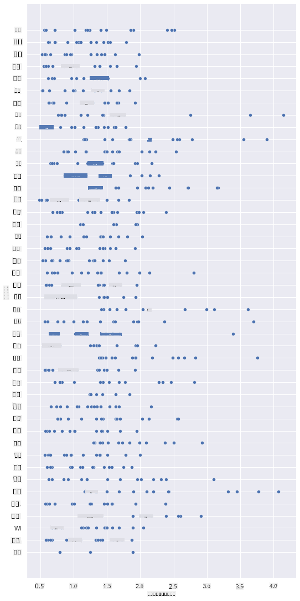
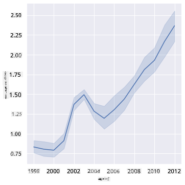
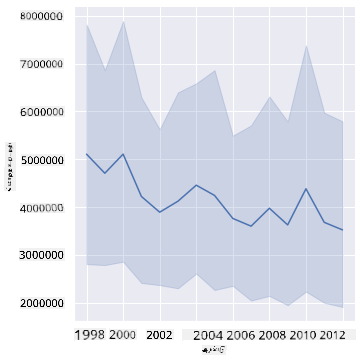
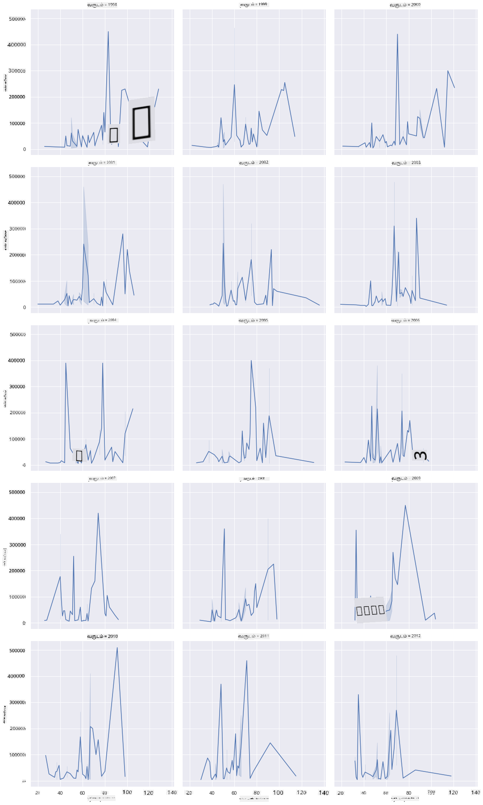
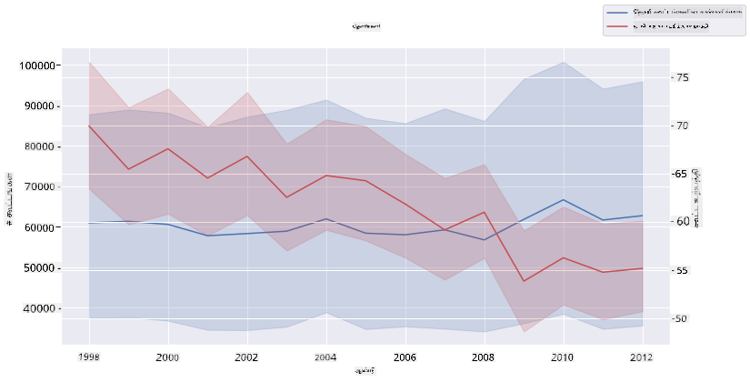

<!--
CO_OP_TRANSLATOR_METADATA:
{
  "original_hash": "0764fd4077f3f04a1d968ec371227744",
  "translation_date": "2025-10-11T16:03:04+00:00",
  "source_file": "3-Data-Visualization/12-visualization-relationships/README.md",
  "language_code": "ta"
}
-->
# உறவுகளை காட்சிப்படுத்தல்: தேனின் அழகிய உலகம் 🍯

| ](../../sketchnotes/12-Visualizing-Relationships.png)|
|:---:|
|உறவுகளை காட்சிப்படுத்தல் - _Sketchnote by [@nitya](https://twitter.com/nitya)_ |

எங்கள் ஆராய்ச்சியின் இயற்கை மையத்தை தொடர்ந்தும், அமெரிக்க வேளாண்மை துறை ([United States Department of Agriculture](https://www.nass.usda.gov/About_NASS/index.php)) வழங்கிய தரவுத்தொகுப்பின் அடிப்படையில், பல்வேறு வகையான தேனின் உறவுகளை காட்சிப்படுத்துவதற்கான சுவாரஸ்யமான முறைகளை கண்டறிவோம்.

இந்த 600 பொருட்கள் கொண்ட தரவுத்தொகுப்பு, அமெரிக்காவின் பல மாநிலங்களில் தேனின் உற்பத்தியை காட்டுகிறது. உதாரணமாக, நீங்கள் ஒரு மாநிலத்தில் 1998-2012 காலகட்டத்தில், ஆண்டுக்கு ஒரு வரிசை கொண்ட தரவுகளைப் பார்த்து, தேன்கூட்டங்களின் எண்ணிக்கை, ஒவ்வொரு கூட்டத்திற்கான விளைச்சல், மொத்த உற்பத்தி, கையிருப்பு, ஒரு பவுனுக்கு விலை மற்றும் உற்பத்தி மதிப்பு ஆகியவற்றை ஆராயலாம்.

ஒரு மாநிலத்தின் ஆண்டுதோறும் உற்பத்தி மற்றும் அந்த மாநிலத்தில் தேனின் விலை ஆகியவற்றின் உறவை காட்சிப்படுத்துவது சுவாரஸ்யமாக இருக்கும். அல்லது, மாநிலங்களின் ஒவ்வொரு தேன்கூட்டத்திற்கான விளைச்சலின் உறவை காட்சிப்படுத்தலாம். இந்த காலகட்டம் 2006-ல் முதன்முதலாக கண்டறியப்பட்ட 'CCD' அல்லது 'Colony Collapse Disorder' (http://npic.orst.edu/envir/ccd.html) எனும் அழிவை உள்ளடக்கியது, எனவே இது ஆராய்வதற்கு முக்கியமான தரவுத்தொகுப்பாகும். 🐝

## [முன்-வகுப்பு வினாடி வினா](https://ff-quizzes.netlify.app/en/ds/quiz/22)

இந்த பாடத்தில், நீங்கள் முன்பே பயன்படுத்திய Seaborn நூலகத்தை, மாறிகளின் உறவுகளை காட்சிப்படுத்த ஒரு நல்ல வழியாக பயன்படுத்தலாம். குறிப்பாக, Seaborn இன் `relplot` செயல்பாட்டை பயன்படுத்துவது சுவாரஸ்யமாக இருக்கும், இது '[புள்ளியியல் உறவுகள்](https://seaborn.pydata.org/tutorial/relational.html?highlight=relationships)' காட்சிப்படுத்த புள்ளி வரைபடங்கள் மற்றும் கோடு வரைபடங்களை விரைவாக உருவாக்க உதவுகிறது, இது தரவியல் விஞ்ஞானிக்கு மாறிகள் ஒருவருக்கொருவர் எப்படி தொடர்புடையவை என்பதைப் புரிந்துகொள்ள உதவுகிறது.

## புள்ளி வரைபடங்கள்

ஒவ்வொரு ஆண்டும், ஒவ்வொரு மாநிலத்திலும் தேனின் விலை எப்படி மாறியுள்ளது என்பதை காட்ட புள்ளி வரைபடத்தைப் பயன்படுத்துங்கள். Seaborn இன் `relplot` செயல்பாட்டை பயன்படுத்தி, மாநில தரவுகளைத் தொகுத்து, வகை மற்றும் எண் தரவுகளுக்கான புள்ளிகளை காட்சிப்படுத்துகிறது.

முதலில் தரவுகளை மற்றும் Seaborn ஐ இறக்குமதி செய்வோம்:

```python
import pandas as pd
import matplotlib.pyplot as plt
import seaborn as sns
honey = pd.read_csv('../../data/honey.csv')
honey.head()
```
தரவுகளில் ஆண்டு மற்றும் ஒரு பவுனுக்கு விலை போன்ற பல சுவாரஸ்யமான பத்திகள் உள்ளன என்பதை நீங்கள் கவனிக்கிறீர்கள். இந்த தரவுகளை, அமெரிக்க மாநிலங்களின் அடிப்படையில் தொகுத்து ஆராய்வோம்:

| state | numcol | yieldpercol | totalprod | stocks   | priceperlb | prodvalue | year |
| ----- | ------ | ----------- | --------- | -------- | ---------- | --------- | ---- |
| AL    | 16000  | 71          | 1136000   | 159000   | 0.72       | 818000    | 1998 |
| AZ    | 55000  | 60          | 3300000   | 1485000  | 0.64       | 2112000   | 1998 |
| AR    | 53000  | 65          | 3445000   | 1688000  | 0.59       | 2033000   | 1998 |
| CA    | 450000 | 83          | 37350000  | 12326000 | 0.62       | 23157000  | 1998 |
| CO    | 27000  | 72          | 1944000   | 1594000  | 0.7        | 1361000   | 1998 |

தேனின் ஒரு பவுனுக்கு விலை மற்றும் அதன் அமெரிக்க மாநிலத்தின் உறவை காட்ட ஒரு அடிப்படை புள்ளி வரைபடத்தை உருவாக்குங்கள். அனைத்து மாநிலங்களையும் காட்சிப்படுத்த `y` அச்சை போதுமான உயரமாக அமைக்கவும்:

```python
sns.relplot(x="priceperlb", y="state", data=honey, height=15, aspect=.5);
```


இப்போது, ஆண்டுதோறும் தேனின் விலை எப்படி மாறுகிறது என்பதை காட்ட தேன் நிறத்துடன் கூடிய ஒரு வண்ணத் திட்டத்தை பயன்படுத்துங்கள். இதை ஆண்டுதோறும் மாற்றத்தை காட்ட 'hue' அளவுருவைச் சேர்த்தால் செய்யலாம்:

> ✅ Seaborn இல் நீங்கள் பயன்படுத்தக்கூடிய [வண்ணத் திட்டங்கள்](https://seaborn.pydata.org/tutorial/color_palettes.html) பற்றி மேலும் அறிக - ஒரு அழகான வானவில் வண்ணத் திட்டத்தை முயற்சிக்கவும்!

```python
sns.relplot(x="priceperlb", y="state", hue="year", palette="YlOrBr", data=honey, height=15, aspect=.5);
```


இந்த வண்ணத் திட்ட மாற்றத்துடன், ஆண்டுகளின் போக்கில் தேனின் ஒரு பவுனுக்கு விலை அதிகரித்துள்ளது என்பது தெளிவாக தெரிகிறது. உண்மையில், தரவுகளில் ஒரு மாதிரியைப் பார்த்தால் (உதாரணமாக, அரிசோனா மாநிலத்தை எடுத்துக்கொள்ளுங்கள்), சில விதிவிலக்குகளைத் தவிர, ஆண்டுதோறும் விலை அதிகரிக்கும் முறைபாட்டை நீங்கள் காணலாம்:

| state | numcol | yieldpercol | totalprod | stocks  | priceperlb | prodvalue | year |
| ----- | ------ | ----------- | --------- | ------- | ---------- | --------- | ---- |
| AZ    | 55000  | 60          | 3300000   | 1485000 | 0.64       | 2112000   | 1998 |
| AZ    | 52000  | 62          | 3224000   | 1548000 | 0.62       | 1999000   | 1999 |
| AZ    | 40000  | 59          | 2360000   | 1322000 | 0.73       | 1723000   | 2000 |
| AZ    | 43000  | 59          | 2537000   | 1142000 | 0.72       | 1827000   | 2001 |
| AZ    | 38000  | 63          | 2394000   | 1197000 | 1.08       | 2586000   | 2002 |
| AZ    | 35000  | 72          | 2520000   | 983000  | 1.34       | 3377000   | 2003 |
| AZ    | 32000  | 55          | 1760000   | 774000  | 1.11       | 1954000   | 2004 |
| AZ    | 36000  | 50          | 1800000   | 720000  | 1.04       | 1872000   | 2005 |
| AZ    | 30000  | 65          | 1950000   | 839000  | 0.91       | 1775000   | 2006 |
| AZ    | 30000  | 64          | 1920000   | 902000  | 1.26       | 2419000   | 2007 |
| AZ    | 25000  | 64          | 1600000   | 336000  | 1.26       | 2016000   | 2008 |
| AZ    | 20000  | 52          | 1040000   | 562000  | 1.45       | 1508000   | 2009 |
| AZ    | 24000  | 77          | 1848000   | 665000  | 1.52       | 2809000   | 2010 |
| AZ    | 23000  | 53          | 1219000   | 427000  | 1.55       | 1889000   | 2011 |
| AZ    | 22000  | 46          | 1012000   | 253000  | 1.79       | 1811000   | 2012 |

இந்த முன்னேற்றத்தை வண்ணத்திற்குப் பதிலாக அளவைப் பயன்படுத்தி காட்சிப்படுத்த ஒரு முறை முயற்சிக்கவும். வண்ணக்குறைபாடு உள்ள பயனர்களுக்கு இது சிறந்த விருப்பமாக இருக்கலாம். விலை அதிகரிப்பை புள்ளியின் சுற்றளவு அதிகரிப்பால் காட்ட உங்கள் காட்சிப்படுத்தலைத் திருத்துங்கள்:

```python
sns.relplot(x="priceperlb", y="state", size="year", data=honey, height=15, aspect=.5);
```
புள்ளிகளின் அளவு تدريجமாக அதிகரிப்பதை நீங்கள் காணலாம்.


இது ஒரு எளிய வழங்கல் மற்றும் தேவைச் சூழல் ஆக இருக்கிறதா? காலநிலை மாற்றம் மற்றும் தேன்கூட்ட அழிவு போன்ற காரணங்களால், ஆண்டுதோறும் வாங்குவதற்கு குறைவான தேன் கிடைக்கிறதா, எனவே விலை அதிகரிக்கிறதா?

இந்த தரவுத்தொகுப்பில் சில மாறிகளுக்கு இடையேயான தொடர்பை கண்டறிய, சில கோடு வரைபடங்களை ஆராய்வோம்.

## கோடு வரைபடங்கள்

கேள்வி: ஆண்டுதோறும் தேனின் ஒரு பவுனுக்கு விலை அதிகரிப்பது தெளிவாக உள்ளதா? அதை ஒரு கோடு வரைபடம் மூலம் எளிதாகக் கண்டறியலாம்:

```python
sns.relplot(x="year", y="priceperlb", kind="line", data=honey);
```
பதில்: ஆம், 2003 ஆம் ஆண்டின் சுற்றியுள்ள சில விதிவிலக்குகளுடன்:



✅ Seaborn தரவுகளை ஒரு கோட்டில் தொகுத்து, "ஒவ்வொரு x மதிப்பில் பல அளவீடுகளை சராசரியாகக் காட்டுகிறது மற்றும் சராசரியின் 95% நம்பகத்தன்மை இடைவெளியை வரைபடத்தில் காட்டுகிறது". [மூலம்](https://seaborn.pydata.org/tutorial/relational.html). இந்த நேரம் எடுத்துக்கொள்ளும் செயல்பாட்டை `ci=None` சேர்த்து முடக்கலாம்.

கேள்வி: 2003 ஆம் ஆண்டில் தேனின் வழங்கலில் ஒரு உச்சம் காணப்படுகிறதா? ஆண்டுதோறும் மொத்த உற்பத்தியைப் பாருங்கள்:

```python
sns.relplot(x="year", y="totalprod", kind="line", data=honey);
```



பதில்: அவ்வளவாக இல்லை. மொத்த உற்பத்தியைப் பார்த்தால், அந்த குறிப்பிட்ட ஆண்டில் அது அதிகரித்தது போல் தெரிகிறது, ஆனால் பொதுவாக, இந்த ஆண்டுகளில் உற்பத்தி குறைந்து கொண்டிருக்கிறது.

கேள்வி: அப்படியென்றால், 2003 ஆம் ஆண்டில் தேனின் விலையில் ஏற்பட்ட உச்சத்தை என்ன காரணமாக இருக்கலாம்?

இதைக் கண்டறிய, ஒரு Facet Grid ஐ ஆராயலாம்.

## Facet Grids

Facet Grids உங்கள் தரவுத்தொகுப்பின் ஒரு அம்சத்தை (எங்கள் வழக்கில், 'ஆண்டு' என்பதைத் தேர்ந்தெடுக்கலாம்) எடுத்துக்கொள்கிறது. Seaborn உங்கள் தேர்ந்தெடுத்த x மற்றும் y ஒருங்கிணைப்புகளுக்கான ஒவ்வொரு அம்சத்திற்கும் ஒரு வரைபடத்தை உருவாக்குகிறது, மேலும் எளிதாக ஒப்பிட உதவுகிறது. 2003 ஆம் ஆண்டு இந்த வகையான ஒப்பீட்டில் தனித்துவமாகத் தெரிகிறதா?

Seaborn இன் [ஆவணத்தில்](https://seaborn.pydata.org/generated/seaborn.FacetGrid.html?highlight=facetgrid#seaborn.FacetGrid) பரிந்துரைக்கப்பட்ட `relplot` ஐ தொடர்ந்து Facet Grid ஐ உருவாக்குங்கள்.

```python
sns.relplot(
    data=honey, 
    x="yieldpercol", y="numcol",
    col="year", 
    col_wrap=3,
    kind="line"
    )
```
இந்த காட்சிப்படுத்தலில், ஒவ்வொரு ஆண்டும் ஒவ்வொரு மாநிலத்திலும் ஒவ்வொரு தேன்கூட்டத்திற்கான விளைச்சல் மற்றும் தேன்கூட்டங்களின் எண்ணிக்கையை ஒப்பிடலாம், 3 க்கான நெடுவரிசை அமைப்புடன்:



இந்த தரவுத்தொகுப்பில், ஆண்டுதோறும் மற்றும் மாநிலத்திற்கும் தேன்கூட்டங்களின் எண்ணிக்கை மற்றும் அவற்றின் விளைச்சலுடன் தொடர்புடைய எந்தவொரு விஷயமும் குறிப்பிடத்தக்கதாகத் தெரியவில்லை. இந்த இரண்டு மாறிகளுக்கு இடையேயான தொடர்பை கண்டறிய வேறு வழி இருக்கிறதா?

## இரட்டை கோடு வரைபடங்கள்

Seaborn இன் 'despine' ஐ பயன்படுத்தி அதன் மேல் மற்றும் வலது spines ஐ அகற்றவும், மற்றும் Matplotlib இன் [ax.twinx](https://matplotlib.org/stable/api/_as_gen/matplotlib.axes.Axes.twinx.html) ஐ பயன்படுத்தி இரண்டு கோடு வரைபடங்களை ஒன்றின் மேல் ஒன்றாக ஒட்ட முயற்சிக்கவும். Twinx ஒரு வரைபடத்தை x அச்சை பகிர்ந்து இரண்டு y அச்சுகளை காட்சிப்படுத்த அனுமதிக்கிறது. எனவே, ஒவ்வொரு தேன்கூட்டத்திற்கான விளைச்சல் மற்றும் தேன்கூட்டங்களின் எண்ணிக்கையை superimposed காட்சிப்படுத்துங்கள்:

```python
fig, ax = plt.subplots(figsize=(12,6))
lineplot = sns.lineplot(x=honey['year'], y=honey['numcol'], data=honey, 
                        label = 'Number of bee colonies', legend=False)
sns.despine()
plt.ylabel('# colonies')
plt.title('Honey Production Year over Year');

ax2 = ax.twinx()
lineplot2 = sns.lineplot(x=honey['year'], y=honey['yieldpercol'], ax=ax2, color="r", 
                         label ='Yield per colony', legend=False) 
sns.despine(right=False)
plt.ylabel('colony yield')
ax.figure.legend();
```


2003 ஆம் ஆண்டின் சுற்றியுள்ள எந்தவொரு விஷயமும் கண்களுக்கு தெளிவாகத் தெரியவில்லை, ஆனால் இது இந்த பாடத்தை ஒரு சிறிய மகிழ்ச்சியான குறிப்பில் முடிக்க அனுமதிக்கிறது: தேன்கூட்டங்களின் எண்ணிக்கை குறைந்து கொண்டிருப்பதுடன், அவற்றின் விளைச்சல் குறைந்தாலும், தேன்கூட்டங்களின் எண்ணிக்கை நிலைத்திருக்கிறது.

தேன்கூட்டங்கள் வாழ்க!

🐝❤️
## 🚀 சவால்

இந்த பாடத்தில், நீங்கள் புள்ளி வரைபடங்கள் மற்றும் Facet Grids உட்பட பல்வேறு பயன்பாடுகளைப் பற்றி மேலும் அறிந்தீர்கள். இந்த தொழில்நுட்பங்களைப் பயன்படுத்தி வரைபடங்களை உருவாக்க எவ்வளவு நேரம் எடுத்துக்கொள்கிறது என்பதை கவனிக்கவும், நீங்கள் வரைபடங்களை உருவாக்கும் போது எவ்வளவு grids தேவை என்பதை கவனமாக இருக்கவும்.

## [பாடத்திற்குப் பிந்தைய வினாடி வினா](https://ff-quizzes.netlify.app/en/ds/quiz/23)

## மதிப்பீடு மற்றும் சுயபயிற்சி

கோடு வரைபடங்கள் எளிமையானவையாகவும் மிகவும் சிக்கலானவையாகவும் இருக்கலாம். [Seaborn ஆவணத்தில்](https://seaborn.pydata.org/generated/seaborn.lineplot.html) கொடுக்கப்பட்டுள்ள பல்வேறு வழிகளில் அவற்றை உருவாக்கலாம் என்பதைப் பற்றி கொஞ்சம் படிக்கவும். இந்த பாடத்தில் நீங்கள் உருவாக்கிய கோடு வரைபடங்களை ஆவணத்தில் பட்டியலிடப்பட்டுள்ள பிற முறைகளுடன் மேம்படுத்த முயற்சிக்கவும்.
## பணிக்கட்டளை

[தேன்கூட்டத்தில் மூழ்குங்கள்](assignment.md)

---

**குறிப்பு**:  
இந்த ஆவணம் [Co-op Translator](https://github.com/Azure/co-op-translator) என்ற AI மொழிபெயர்ப்பு சேவையைப் பயன்படுத்தி மொழிபெயர்க்கப்பட்டுள்ளது. எங்கள் தரச்செயல்முறையை உறுதிப்படுத்த முயற்சிக்கிறோம், ஆனால் தானியக்க மொழிபெயர்ப்புகளில் பிழைகள் அல்லது தவறுகள் இருக்கக்கூடும் என்பதை தயவுசெய்து கவனத்தில் கொள்ளவும். அதன் தாய்மொழியில் உள்ள மூல ஆவணம் அதிகாரப்பூர்வ ஆதாரமாக கருதப்பட வேண்டும். முக்கியமான தகவல்களுக்கு, தொழில்முறை மனித மொழிபெயர்ப்பு பரிந்துரைக்கப்படுகிறது. இந்த மொழிபெயர்ப்பைப் பயன்படுத்துவதால் ஏற்படும் எந்த தவறான புரிதல்கள் அல்லது தவறான விளக்கங்களுக்கு நாங்கள் பொறுப்பல்ல.