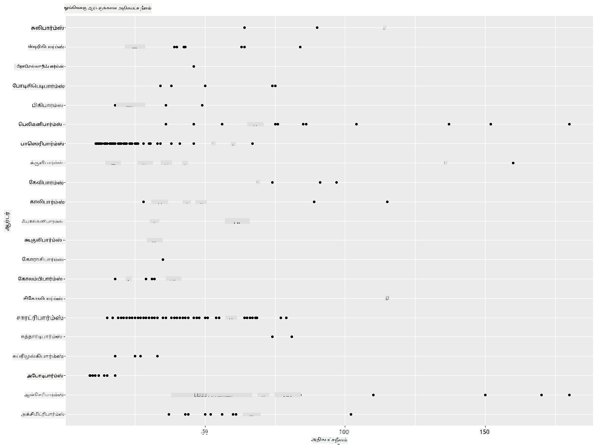
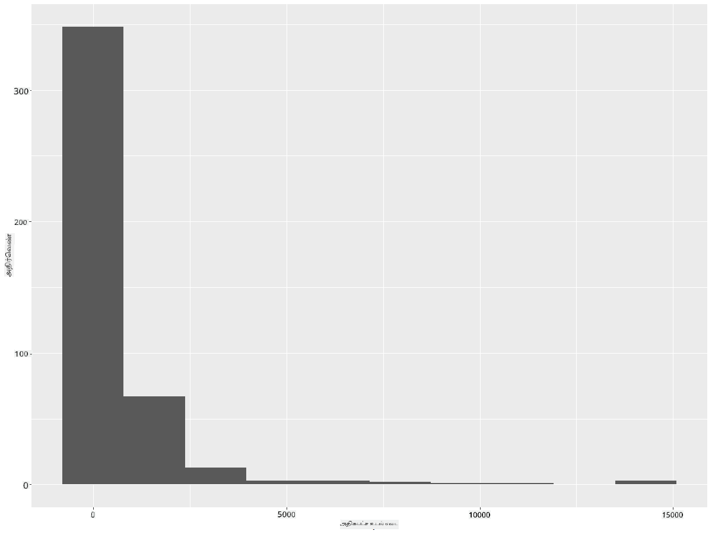
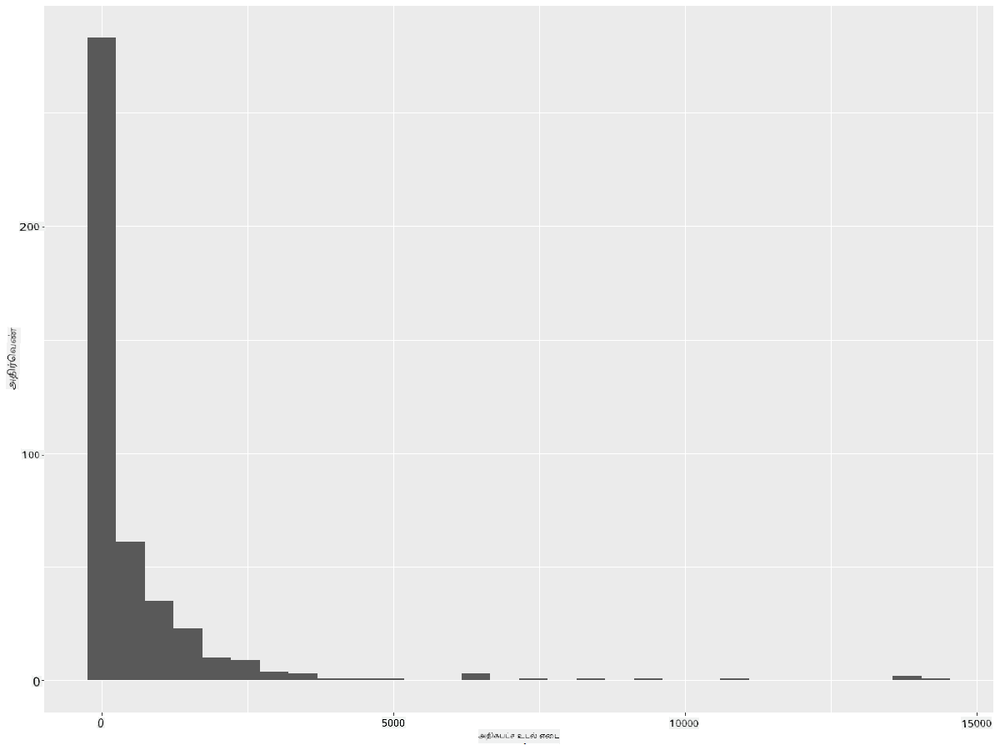
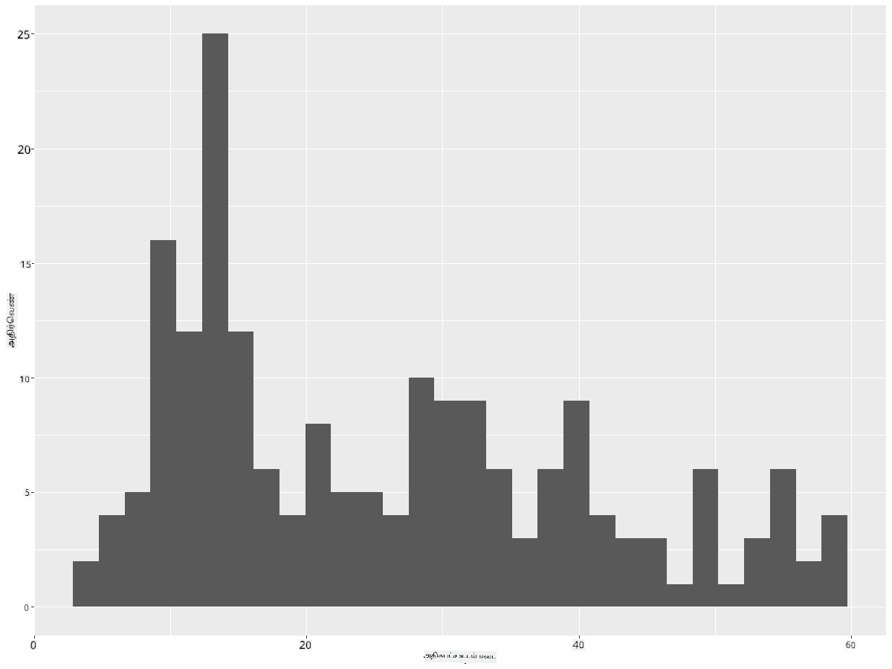
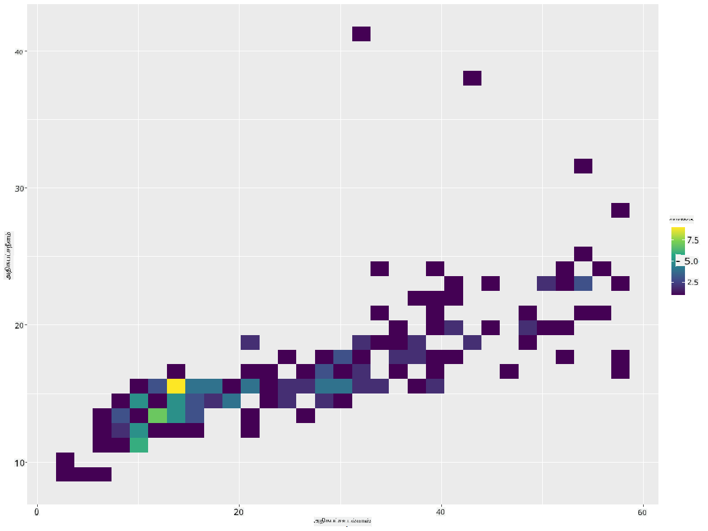
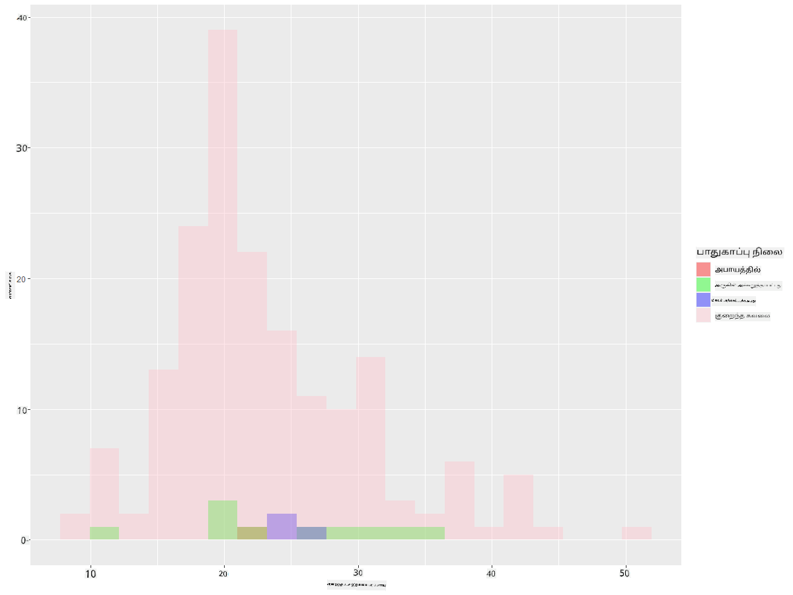
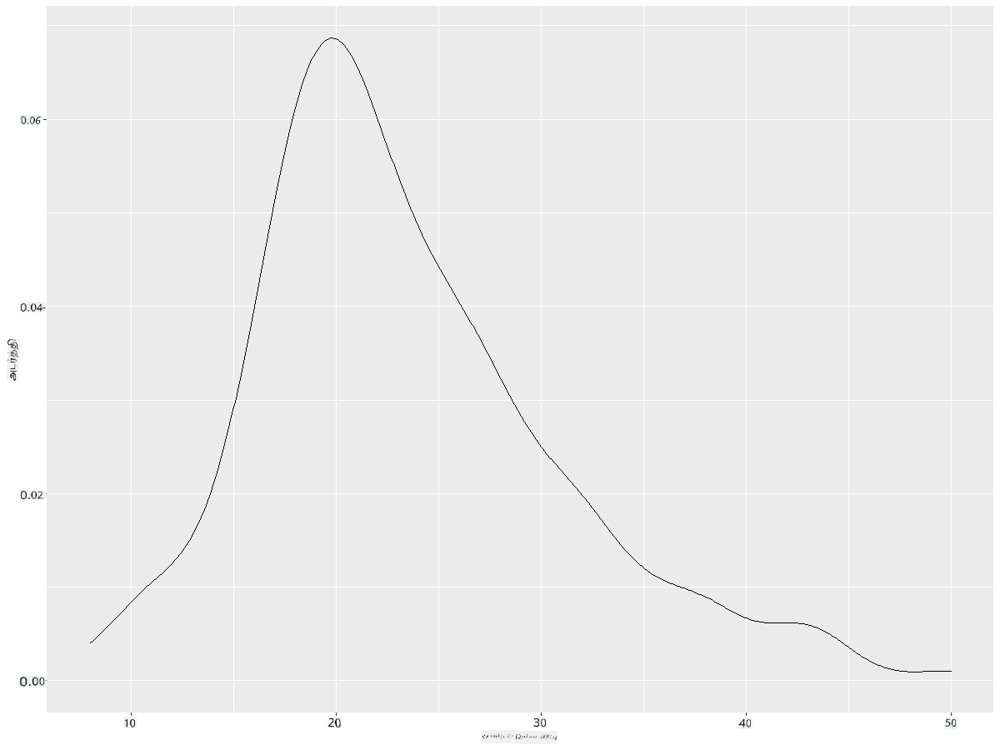
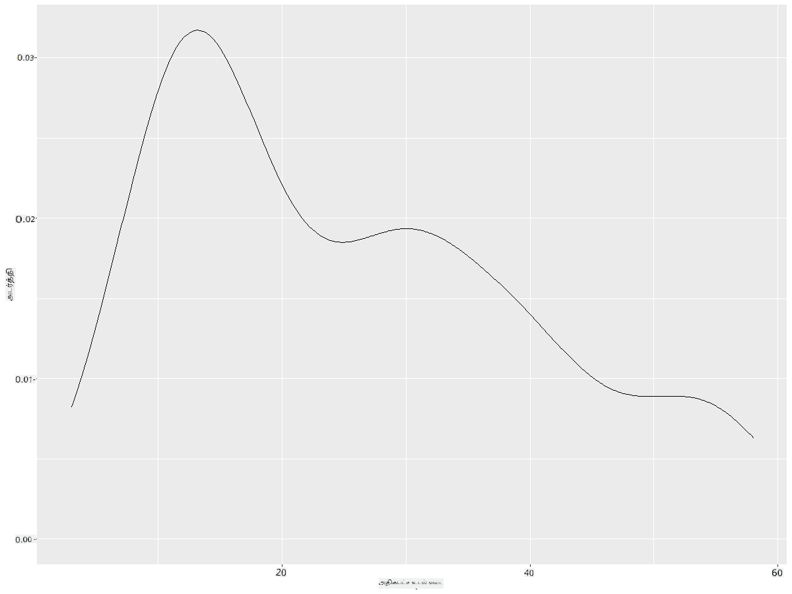
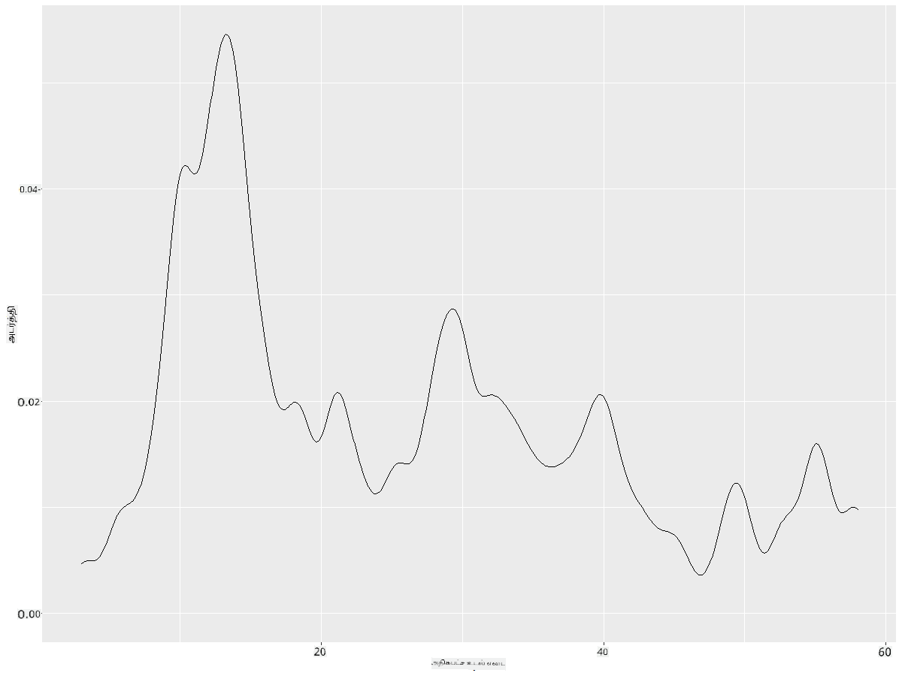
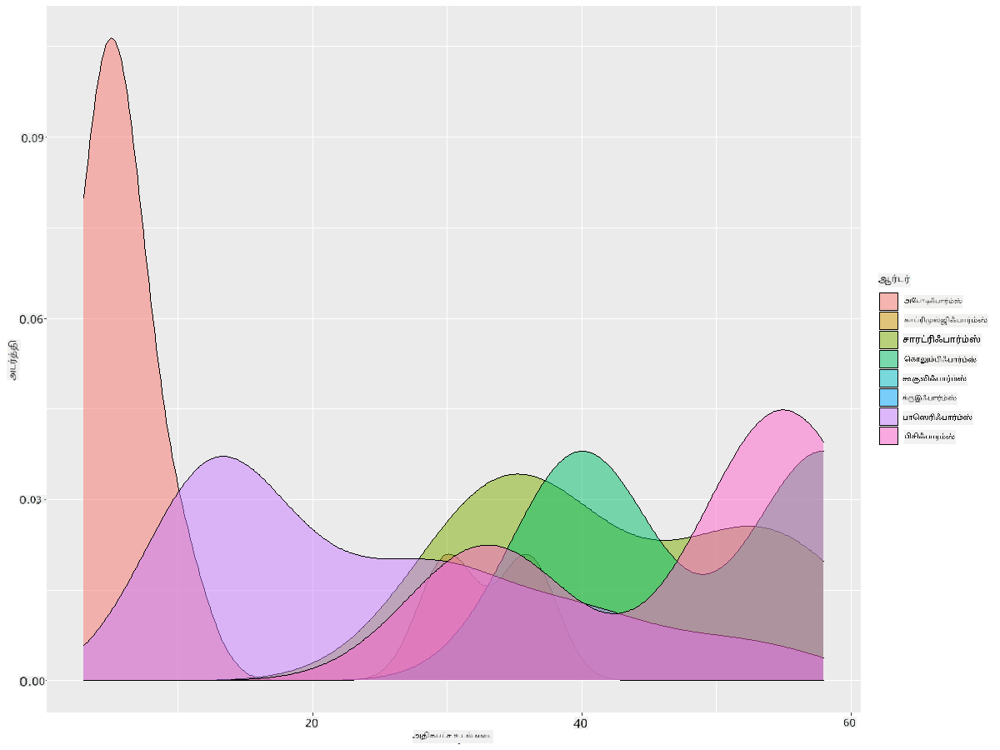

<!--
CO_OP_TRANSLATOR_METADATA:
{
  "original_hash": "ea67c0c40808fd723594de6896c37ccf",
  "translation_date": "2025-10-11T15:57:24+00:00",
  "source_file": "3-Data-Visualization/R/10-visualization-distributions/README.md",
  "language_code": "ta"
}
-->
# விநியோகங்களை காட்சிப்படுத்துதல்

| ](https://github.com/microsoft/Data-Science-For-Beginners/blob/main/sketchnotes/10-Visualizing-Distributions.png)|
|:---:|
| விநியோகங்களை காட்சிப்படுத்துதல் - _Sketchnote by [@nitya](https://twitter.com/nitya)_ |

முந்தைய பாடத்தில், மினசோட்டாவின் பறவைகள் பற்றிய தரவுத்தொகுப்பில் சில சுவாரஸ்யமான தகவல்களை நீங்கள் கற்றுக்கொண்டீர்கள். புறக்கணிக்கப்பட்ட தரவுகளை காட்சிப்படுத்துவதன் மூலம் சில தவறான தரவுகளை கண்டறிந்தீர்கள் மற்றும் பறவைகள் வகைகளின் அதிகபட்ச நீளத்தின் வேறுபாடுகளைப் பார்த்தீர்கள்.

## [பாடத்துக்கு முன் வினாடி வினா](https://purple-hill-04aebfb03.1.azurestaticapps.net/quiz/18)
## பறவைகள் தரவுத்தொகுப்பை ஆராயுங்கள்

தரவை ஆராய்வதற்கான மற்றொரு வழி அதன் விநியோகத்தைப் பார்ப்பது, அல்லது தரவுகள் ஒரு அச்சில் எவ்வாறு ஒழுங்குபடுத்தப்பட்டுள்ளன என்பதைப் பார்ப்பது. உதாரணமாக, இந்த தரவுத்தொகுப்பில், மினசோட்டா பறவைகளின் அதிகபட்ச இறகின் அகலம் அல்லது அதிகபட்ச உடல் எடை பற்றிய பொது விநியோகத்தைப் பற்றி நீங்கள் அறிய விரும்பலாம்.

இந்த தரவுத்தொகுப்பில் உள்ள தரவின் விநியோகங்கள் பற்றிய சில தகவல்களை கண்டறிவோம். உங்கள் R கான்சோலில், `ggplot2` மற்றும் தரவுத்தொகுப்பை இறக்குமதி செய்யுங்கள். முந்தைய தலைப்பில் செய்தது போலவே தரவுத்தொகுப்பிலிருந்து புறக்கணிக்கப்பட்டவற்றை நீக்குங்கள்.

```r
library(ggplot2)

birds <- read.csv("../../data/birds.csv",fileEncoding="UTF-8-BOM")

birds_filtered <- subset(birds, MaxWingspan < 500)
head(birds_filtered)
```
|      | பெயர்                         | அறிவியல் பெயர்         | வகை              | வரிசை        | குடும்பம்   | ஜெனஸ்       | பாதுகாப்பு நிலை | குறைந்தபட்ச நீளம் | அதிகபட்ச நீளம் | குறைந்தபட்ச உடல் எடை | அதிகபட்ச உடல் எடை | குறைந்தபட்ச இறகின் அகலம் | அதிகபட்ச இறகின் அகலம் |
| ---: | :--------------------------- | :--------------------- | :-------------------- | :----------- | :------- | :---------- | :----------------- | --------: | --------: | ----------: | ----------: | ----------: | ----------: |
|    0 | கருப்பு வயிற்று விசில் வாத்து | Dendrocygna autumnalis | வாத்துகள்/தாரைகள்/நீர்ப்பறவைகள் | Anseriformes | Anatidae | Dendrocygna | LC                 |        47 |        56 |         652 |        1020 |          76 |          94 |
|    1 | Fulvous விசில் வாத்து       | Dendrocygna bicolor    | வாத்துகள்/தாரைகள்/நீர்ப்பறவைகள் | Anseriformes | Anatidae | Dendrocygna | LC                 |        45 |        53 |         712 |        1050 |          85 |          93 |
|    2 | பனிவாத்து                   | Anser caerulescens     | வாத்துகள்/தாரைகள்/நீர்ப்பறவைகள் | Anseriformes | Anatidae | Anser       | LC                 |        64 |        79 |        2050 |        4050 |         135 |         165 |
|    3 | Ross's வாத்து                 | Anser rossii           | வாத்துகள்/தாரைகள்/நீர்ப்பறவைகள் | Anseriformes | Anatidae | Anser       | LC                 |      57.3 |        64 |        1066 |        1567 |         113 |         116 |
|    4 | பெரிய வெள்ளை முன் வாத்து  | Anser albifrons        | வாத்துகள்/தாரைகள்/நீர்ப்பறவைகள் | Anseriformes | Anatidae | Anser       | LC                 |        64 |        81 |        1930 |        3310 |         130 |         165 |

பொதுவாக, தரவுகள் எவ்வாறு விநியோகிக்கப்பட்டுள்ளன என்பதை நீங்கள் விரைவாக பார்க்க முடியும், முந்தைய பாடத்தில் செய்தது போல ஒரு சிதறல் வரைபடத்தைப் பயன்படுத்தி:

```r
ggplot(data=birds_filtered, aes(x=Order, y=MaxLength,group=1)) +
  geom_point() +
  ggtitle("Max Length per order") + coord_flip()
```


இது ஒவ்வொரு பறவையின் வரிசைக்கு உடல் நீளத்தின் பொது விநியோகத்தை ஒரு பார்வையில் காட்டுகிறது, ஆனால் உண்மையான விநியோகங்களை காட்சிப்படுத்த இது சிறந்த வழி அல்ல. இந்த பணியை சாதாரணமாக ஒரு ஹிஸ்டோகிராம் உருவாக்குவதன் மூலம் கையாளலாம்.
## ஹிஸ்டோகிராம்களுடன் வேலை செய்வது

`ggplot2` ஹிஸ்டோகிராம்களைப் பயன்படுத்தி தரவின் விநியோகத்தை காட்சிப்படுத்த சிறந்த வழிகளை வழங்குகிறது. இந்த வகை வரைபடம் ஒரு பட்டை வரைபடம் போன்றது, இதில் விநியோகம் பட்டைகளின் உயர்வு மற்றும் சரிவின் மூலம் காணப்படலாம். ஹிஸ்டோகிராம் உருவாக்க, எண் தரவுகள் தேவை. ஹிஸ்டோகிராம் உருவாக்க, 'hist' என வகையை வரையறுத்து ஒரு வரைபடத்தை வரைபடலாம். இந்த வரைபடம் முழு தரவுத்தொகுப்பின் எண் தரவுகளின் வரம்பிற்கான MaxBodyMass விநியோகத்தை காட்டுகிறது. தரவுகளின் வரிசையை சிறிய பின்களாகப் பிரிப்பதன் மூலம், இது தரவுகளின் மதிப்புகளின் விநியோகத்தை காட்சிப்படுத்த முடியும்:

```r
ggplot(data = birds_filtered, aes(x = MaxBodyMass)) + 
  geom_histogram(bins=10)+ylab('Frequency')
```


நீங்கள் காணக்கூடியது போல, இந்த தரவுத்தொகுப்பில் உள்ள 400+ பறவைகளில் பெரும்பாலானவை Max Body Mass 2000 க்கும் குறைவாக உள்ளன. `bins` அளவுருவை 30 போன்ற அதிக எண்ணிக்கைக்கு மாற்றுவதன் மூலம் தரவின் மீது மேலும் உள்ளுணர்வு பெறுங்கள்:

```r
ggplot(data = birds_filtered, aes(x = MaxBodyMass)) + geom_histogram(bins=30)+ylab('Frequency')
```



இந்த வரைபடம் விநியோகத்தை மேலும் நுணுக்கமாகக் காட்டுகிறது. இடது பக்கம் குறைவாக சாய்ந்த ஒரு வரைபடத்தை, நீங்கள் குறிப்பிட்ட வரம்பிற்குள் உள்ள தரவுகளை மட்டும் தேர்ந்தெடுப்பதன் மூலம் உருவாக்க முடியும்:

உங்கள் தரவுகளை வடிகட்டி, உடல் எடை 60 க்கும் குறைவாக உள்ள பறவைகளை மட்டும் பெறுங்கள், மேலும் 30 `bins` காட்சிப்படுத்துங்கள்:

```r
birds_filtered_1 <- subset(birds_filtered, MaxBodyMass > 1 & MaxBodyMass < 60)
ggplot(data = birds_filtered_1, aes(x = MaxBodyMass)) + 
  geom_histogram(bins=30)+ylab('Frequency')
```



✅ மற்ற வடிகட்டல்கள் மற்றும் தரவுப் புள்ளிகளை முயற்சிக்கவும். தரவின் முழு விநியோகத்தைப் பார்க்க, `['MaxBodyMass']` வடிகட்டலை நீக்கி, லேபிள் செய்யப்பட்ட விநியோகங்களை காட்சிப்படுத்தவும்.

ஹிஸ்டோகிராம் சில நல்ல நிறம் மற்றும் லேபிள் மேம்பாடுகளை முயற்சிக்கவும்:

இரண்டு விநியோகங்களின் உறவினை ஒப்பிட 2D ஹிஸ்டோகிராம் உருவாக்குங்கள். `MaxBodyMass` மற்றும் `MaxLength` ஐ ஒப்பிடுவோம். `ggplot2` பிரகாசமான நிறங்களைப் பயன்படுத்தி இணைப்புகளை காட்ட ஒரு உள்ளமைக்கப்பட்ட வழியை வழங்குகிறது:

```r
ggplot(data=birds_filtered_1, aes(x=MaxBodyMass, y=MaxLength) ) +
  geom_bin2d() +scale_fill_continuous(type = "viridis")
```
இந்த இரண்டு கூறுகளின் எதிர்பார்க்கப்பட்ட அச்சில் ஒரு எதிர்பார்க்கப்பட்ட தொடர்பு உள்ளது, குறிப்பாக ஒரு வலுவான இணைப்பு புள்ளியுடன்:



ஹிஸ்டோகிராம்கள் எண் தரவுகளுக்கு இயல்பாகவே நன்றாக வேலை செய்கின்றன. உரை தரவுகளின் படி விநியோகங்களைப் பார்க்க வேண்டுமென்றால் என்ன செய்ய வேண்டும்? 
## உரை தரவுகளைப் பயன்படுத்தி விநியோகங்களை ஆராயுங்கள் 

இந்த தரவுத்தொகுப்பில் பறவைகள் வகை மற்றும் அதன் ஜெனஸ், இனங்கள், குடும்பம் மற்றும் பாதுகாப்பு நிலை பற்றிய நல்ல தகவல்களும் அடங்கும். இந்த பாதுகாப்பு தகவலை ஆராய்வோம். பறவைகள் எந்த பாதுகாப்பு நிலையின் படி விநியோகிக்கப்பட்டுள்ளன?

> ✅ இந்த தரவுத்தொகுப்பில், பாதுகாப்பு நிலையை விவரிக்க பல சுருக்கங்கள் பயன்படுத்தப்படுகின்றன. இந்த சுருக்கங்கள் [IUCN Red List Categories](https://www.iucnredlist.org/) என்ற அமைப்பிலிருந்து வருகின்றன, இது இனங்களின் நிலையை பட்டியலிடும் அமைப்பு.
> 
> - CR: மிக ஆபத்தான நிலை
> - EN: ஆபத்தான நிலை
> - EX: அழிந்தது
> - LC: குறைந்த கவலை
> - NT: ஆபத்துக்கு அருகில்
> - VU: பாதிக்கப்படக்கூடியது

இவை உரை அடிப்படையிலான மதிப்புகள் ஆகும், எனவே ஹிஸ்டோகிராம் உருவாக்க மாற்றம் செய்ய வேண்டும். FilteredBirds தரவுத்தொகுப்பைப் பயன்படுத்தி, அதன் பாதுகாப்பு நிலையை குறைந்தபட்ச இறகின் அகலத்துடன் காட்சிப்படுத்துங்கள். நீங்கள் என்ன காண்கிறீர்கள்? 

```r
birds_filtered_1$ConservationStatus[birds_filtered_1$ConservationStatus == 'EX'] <- 'x1' 
birds_filtered_1$ConservationStatus[birds_filtered_1$ConservationStatus == 'CR'] <- 'x2'
birds_filtered_1$ConservationStatus[birds_filtered_1$ConservationStatus == 'EN'] <- 'x3'
birds_filtered_1$ConservationStatus[birds_filtered_1$ConservationStatus == 'NT'] <- 'x4'
birds_filtered_1$ConservationStatus[birds_filtered_1$ConservationStatus == 'VU'] <- 'x5'
birds_filtered_1$ConservationStatus[birds_filtered_1$ConservationStatus == 'LC'] <- 'x6'

ggplot(data=birds_filtered_1, aes(x = MinWingspan, fill = ConservationStatus)) +
  geom_histogram(position = "identity", alpha = 0.4, bins = 20) +
  scale_fill_manual(name="Conservation Status",values=c("red","green","blue","pink"),labels=c("Endangered","Near Threathened","Vulnerable","Least Concern"))
```



குறைந்தபட்ச இறகின் அகலம் மற்றும் பாதுகாப்பு நிலைக்கு இடையில் நல்ல தொடர்பு இல்லை என்று தெரிகிறது. இந்த முறை பயன்படுத்தி தரவுத்தொகுப்பின் பிற கூறுகளை சோதிக்கவும். நீங்கள் எந்த தொடர்பையும் கண்டுபிடிக்கிறீர்களா?

## அடர்த்தி வரைபடங்கள்

இப்போது வரைபடங்கள் 'படிகள்' போலவும், வளைவாக மிருதுவாக இருக்காமல் இருப்பதை நீங்கள் கவனித்திருக்கலாம். மிருதுவான அடர்த்தி வரைபடத்தை காட்ட, நீங்கள் அடர்த்தி வரைபடத்தை முயற்சிக்கலாம்.

இப்போது அடர்த்தி வரைபடங்களுடன் வேலை செய்யலாம்!

```r
ggplot(data = birds_filtered_1, aes(x = MinWingspan)) + 
  geom_density()
```


குறைந்தபட்ச இறகின் அகல தரவுகளுக்கான முந்தைய வரைபடத்தை இது எவ்வாறு பிரதிபலிக்கிறது என்பதை நீங்கள் காணலாம்; இது கொஞ்சம் மிருதுவாக உள்ளது. நீங்கள் இரண்டாவது வரைபடத்தில் உள்ள மிருதுவற்ற MaxBodyMass வரியை மீண்டும் பார்க்க விரும்பினால், இந்த முறையைப் பயன்படுத்தி அதை மிகவும் நன்றாக மிருதுவாக்கலாம்:

```r
ggplot(data = birds_filtered_1, aes(x = MaxBodyMass)) + 
  geom_density()
```


மிகவும் மிருதுவான, ஆனால் மிக மிருதுவாக இல்லாத ஒரு வரியை நீங்கள் விரும்பினால், `adjust` அளவுருவைத் திருத்தவும்: 

```r
ggplot(data = birds_filtered_1, aes(x = MaxBodyMass)) + 
  geom_density(adjust = 1/5)
```


✅ இந்த வகை வரைபடத்திற்கான அளவுருக்களைப் பற்றி படித்து, பரிசோதிக்கவும்!

இந்த வகை வரைபடம் அழகாக விளக்கமான காட்சிகளை வழங்குகிறது. சில கோடுகளின் உதவியுடன், உதாரணமாக, ஒவ்வொரு பறவையின் வரிசைக்கு அதிகபட்ச உடல் எடை அடர்த்தியை நீங்கள் காட்டலாம்:

```r
ggplot(data=birds_filtered_1,aes(x = MaxBodyMass, fill = Order)) +
  geom_density(alpha=0.5)
```


## 🚀 சவால்

ஹிஸ்டோகிராம்கள் அடிப்படை சிதறல் வரைபடங்கள், பட்டை வரைபடங்கள் அல்லது கோடு வரைபடங்களை விட ஒரு மேம்பட்ட வகை வரைபடமாகும். இணையத்தில் நல்ல ஹிஸ்டோகிராம் உதாரணங்களைத் தேடுங்கள். அவை எவ்வாறு பயன்படுத்தப்படுகின்றன, அவை என்ன காட்டுகின்றன, மற்றும் எந்த துறைகள் அல்லது ஆராய்ச்சி பகுதிகளில் அவை பெரும்பாலும் பயன்படுத்தப்படுகின்றன?

## [பாடத்துக்குப் பின் வினாடி வினா](https://purple-hill-04aebfb03.1.azurestaticapps.net/quiz/19)

## மதிப்பீடு & சுயபயிற்சி

இந்த பாடத்தில், நீங்கள் `ggplot2` ஐப் பயன்படுத்தி, மேலும் மேம்பட்ட வரைபடங்களை காட்சிப்படுத்தத் தொடங்கினீர்கள். `geom_density_2d()` பற்றி "ஒரு அல்லது அதற்கு மேற்பட்ட பரிமாணங்களில் தொடர்ச்சியான சாத்தியமான அடர்த்தி வளைவு" என்று ஆராயுங்கள். இது எவ்வாறு செயல்படுகிறது என்பதைப் புரிந்துகொள்ள [ஆவணங்களை](https://ggplot2.tidyverse.org/reference/geom_density_2d.html) படியுங்கள்.

## பணிக்கட்டளை

[உங்கள் திறன்களை பயன்படுத்துங்கள்](assignment.md)

---

**குறிப்பு**:  
இந்த ஆவணம் [Co-op Translator](https://github.com/Azure/co-op-translator) என்ற AI மொழிபெயர்ப்பு சேவையைப் பயன்படுத்தி மொழிபெயர்க்கப்பட்டுள்ளது. நாங்கள் துல்லியத்திற்காக முயற்சிக்கின்றோம், ஆனால் தானியக்க மொழிபெயர்ப்புகளில் பிழைகள் அல்லது தவறான தகவல்கள் இருக்கக்கூடும் என்பதை தயவுசெய்து கவனத்தில் கொள்ளுங்கள். அதன் தாய்மொழியில் உள்ள மூல ஆவணம் அதிகாரப்பூர்வ ஆதாரமாக கருதப்பட வேண்டும். முக்கியமான தகவல்களுக்கு, தொழில்முறை மனித மொழிபெயர்ப்பு பரிந்துரைக்கப்படுகிறது. இந்த மொழிபெயர்ப்பைப் பயன்படுத்துவதால் ஏற்படும் எந்த தவறான புரிதல்கள் அல்லது தவறான விளக்கங்களுக்கு நாங்கள் பொறுப்பல்ல.