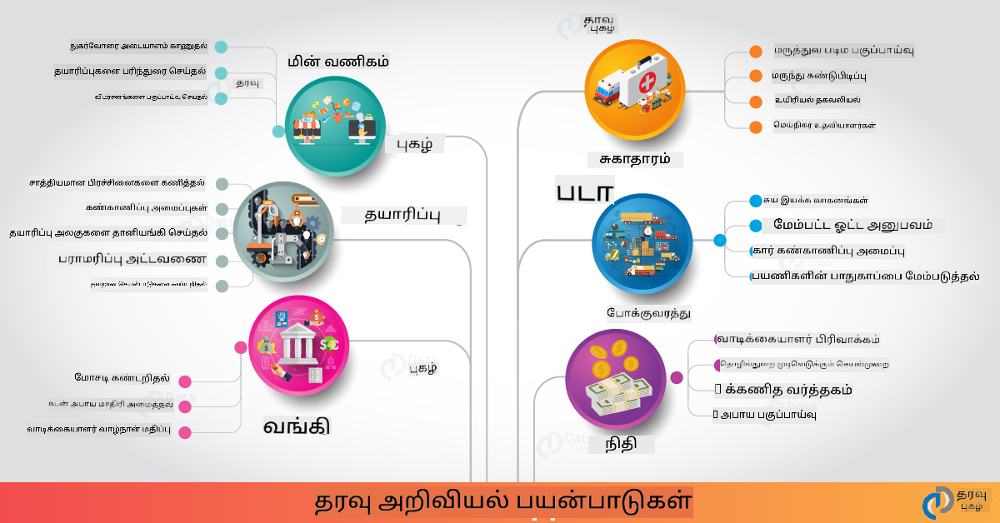

<!--
CO_OP_TRANSLATOR_METADATA:
{
  "original_hash": "0f67a4139454816631526779a456b734",
  "translation_date": "2025-10-11T15:45:00+00:00",
  "source_file": "6-Data-Science-In-Wild/20-Real-World-Examples/README.md",
  "language_code": "ta"
}
-->
# உண்மையான உலகில் தரவியல் அறிவியல்

|  மூலம் உருவாக்கப்பட்ட ஸ்கெட்ச் ](../../sketchnotes/20-DataScience-RealWorld.png) |
| :--------------------------------------------------------------------------------------------------------------: |
|               உண்மையான உலகில் தரவியல் அறிவியல் - _[@nitya](https://twitter.com/nitya) மூலம் உருவாக்கப்பட்ட ஸ்கெட்ச்_               |

இந்தக் கற்றல் பயணத்தின் முடிவில் நாம் வந்துவிட்டோம்!

தரவியல் அறிவியல் மற்றும் நெறிமுறைகள் பற்றிய வரையறைகளுடன் தொடங்கிய நாம், தரவுகளை பகுப்பாய்வு மற்றும் காட்சிப்படுத்துவதற்கான பல்வேறு கருவிகள் மற்றும் தொழில்நுட்பங்களை ஆராய்ந்தோம், தரவியல் அறிவியல் வாழ்க்கைச் சுழற்சியை மதிப்பீடு செய்தோம், மற்றும் மேக கணினி சேவைகளுடன் தரவியல் அறிவியல் பணிகளை விரிவாக்கி தானியங்கச் செய்யும் வழிகளைப் பார்த்தோம். எனவே, நீங்கள் சிந்திக்கலாம்: _"இந்தக் கற்றல்களை உண்மையான உலக சூழலுக்கு எப்படி பொருத்துவது?"_

இந்த பாடத்தில், தொழில்துறையில் தரவியல் அறிவியலின் உண்மையான உலக பயன்பாடுகளை ஆராய்வோம் மற்றும் ஆராய்ச்சி, டிஜிட்டல் மனிதநேயங்கள் மற்றும் நிலைத்தன்மை போன்ற குறிப்பிட்ட உதாரணங்களில் ஆழமாகப் பார்க்கலாம். மாணவர் திட்ட வாய்ப்புகளைப் பார்ப்பதுடன், உங்கள் கற்றல் பயணத்தை தொடர உதவும் பயனுள்ள வளங்களுடன் முடிவுக்கு வருவோம்!

## முன்-வகுப்பு வினாடி வினா

## [முன்-வகுப்பு வினாடி வினா](https://ff-quizzes.netlify.app/en/ds/quiz/38)

## தரவியல் அறிவியல் + தொழில்

AI-யின் ஜனநாயகமயமாக்கலுக்கு நன்றி, டெவலப்பர்கள் தற்போது AI-ஐ இயக்கும் முடிவெடுப்புகள் மற்றும் தரவின் அடிப்படையிலான உள்ளடக்கங்களை பயனர் அனுபவங்கள் மற்றும் மேம்பாட்டு பணிகளில் வடிவமைத்து ஒருங்கிணைக்க எளிதாகக் கண்டுபிடிக்கின்றனர். தரவியல் அறிவியல் "தொழில்துறையில்" எப்படி "பயன்படுத்தப்படுகிறது" என்பதை விளக்கும் சில உதாரணங்கள் இங்கே:

 * [Google Flu Trends](https://www.wired.com/2015/10/can-learn-epic-failure-google-flu-trends/) - தேடல் சொற்களை காய்ச்சல் போக்குகளுடன் தொடர்புபடுத்த தரவியல் அறிவியலை பயன்படுத்தியது. இந்த அணுகுமுறை சில குறைபாடுகளைக் கொண்டிருந்தாலும், இது தரவின் அடிப்படையிலான சுகாதார கணிப்புகளின் சாத்தியங்கள் (மற்றும் சவால்கள்) குறித்து விழிப்புணர்வை ஏற்படுத்தியது.

 * [UPS வழித்தட கணிப்புகள்](https://www.technologyreview.com/2018/11/21/139000/how-ups-uses-ai-to-outsmart-bad-weather/) - UPS எப்படி தரவியல் அறிவியல் மற்றும் இயந்திர கற்றலை பயன்படுத்தி, வானிலை நிலைகள், போக்குவரத்து முறை, விநியோக காலக்கெடுகள் மற்றும் பலவற்றை கருத்தில் கொண்டு விநியோகத்திற்கான சிறந்த வழித்தடங்களை கணிக்கிறது என்பதை விளக்குகிறது.

 * [NYC டாக்ஸிகாப் வழித்தட காட்சிப்படுத்தல்](http://chriswhong.github.io/nyctaxi/) - [தகவல் சுதந்திர சட்டங்கள்](https://chriswhong.com/open-data/foil_nyc_taxi/) மூலம் சேகரிக்கப்பட்ட தரவுகள், NYC டாக்ஸிகாப்களின் ஒரு நாளின் வாழ்க்கையை காட்சிப்படுத்த உதவியது. இது அவர்கள் நகரத்தை எவ்வாறு வழிநடத்துகிறார்கள், அவர்கள் சம்பாதிக்கும் பணம் மற்றும் ஒவ்வொரு 24 மணி நேர காலத்தில் பயணங்களின் கால அளவைப் புரிந்துகொள்ள உதவியது.

 * [Uber Data Science Workbench](https://eng.uber.com/dsw/) - தினசரி மில்லியன் கணக்கான Uber பயணங்களிலிருந்து சேகரிக்கப்பட்ட தரவுகளை (pickup & dropoff இடங்கள், பயண காலம், விருப்பமான வழித்தடங்கள் போன்றவை) பயன்படுத்தி, விலை நிர்ணயம், பாதுகாப்பு, மோசடி கண்டறிதல் மற்றும் வழிநடத்தல் முடிவுகளுக்கு உதவும் தரவுப் பகுப்பாய்வு கருவியை உருவாக்குகிறது.

 * [விளையாட்டு பகுப்பாய்வு](https://towardsdatascience.com/scope-of-analytics-in-sports-world-37ed09c39860) - _முன்கூட்டிய கணிப்புகள்_ (குழு மற்றும் வீரர் பகுப்பாய்வு - [Moneyball](https://datasciencedegree.wisconsin.edu/blog/moneyball-proves-importance-big-data-big-ideas/) போன்றவை - மற்றும் ரசிகர் மேலாண்மை) மற்றும் _தரவு காட்சிப்படுத்தல்_ (குழு & ரசிகர் டாஷ்போர்டுகள், விளையாட்டுகள் போன்றவை) ஆகியவற்றில் கவனம் செலுத்துகிறது. திறன் தேடுதல், விளையாட்டு சூதாட்டம் மற்றும் சரக்கு/இட மேலாண்மை போன்ற பயன்பாடுகளுடன்.

 * [வங்கி துறையில் தரவியல் அறிவியல்](https://data-flair.training/blogs/data-science-in-banking/) - அபாய மாதிரிகள் மற்றும் மோசடி கண்டறிதல் முதல் வாடிக்கையாளர் பிரிவாக்கம், நேரடி கணிப்பு மற்றும் பரிந்துரை அமைப்புகள் வரை நிதி துறையில் தரவியல் அறிவியலின் மதிப்பை விளக்குகிறது. முன்கூட்டிய கணிப்புகள் [கடன் மதிப்பெண்கள்](https://dzone.com/articles/using-big-data-and-predictive-analytics-for-credit) போன்ற முக்கியமான அளவுகோல்களை இயக்குகின்றன.

 * [சுகாதாரத்தில் தரவியல் அறிவியல்](https://data-flair.training/blogs/data-science-in-healthcare/) - மருத்துவ படங்கள் (எ.கா., MRI, X-Ray, CT-Scan), ஜீனோமிக்ஸ் (DNA வரிசைப்படுத்தல்), மருந்து மேம்பாடு (அபாய மதிப்பீடு, வெற்றியின் கணிப்பு), முன்கூட்டிய கணிப்புகள் (நோயாளி பராமரிப்பு & வழங்கல் தளவாடங்கள்), நோய் கண்காணிப்பு மற்றும் தடுப்பு போன்ற பயன்பாடுகளை விளக்குகிறது.

 படத்தின் உரிமை: [Data Flair: 6 Amazing Data Science Applications ](https://data-flair.training/blogs/data-science-applications/)

இந்த படத்தில் தரவியல் அறிவியல் தொழில்நுட்பங்களைப் பயன்படுத்துவதற்கான பிற துறைகள் மற்றும் உதாரணங்கள் காட்டப்படுகின்றன. பிற பயன்பாடுகளை ஆராய விரும்புகிறீர்களா? கீழே உள்ள [மதிப்பீடு & சுய கற்றல்](../../../../6-Data-Science-In-Wild/20-Real-World-Examples) பிரிவைப் பாருங்கள்.

## தரவியல் அறிவியல் + ஆராய்ச்சி

|  மூலம் உருவாக்கப்பட்ட ஸ்கெட்ச் ](../../sketchnotes/20-DataScience-Research.png) |
| :---------------------------------------------------------------------------------------------------------------: |
|              தரவியல் அறிவியல் & ஆராய்ச்சி - _[@nitya](https://twitter.com/nitya) மூலம் உருவாக்கப்பட்ட ஸ்கெட்ச்_              |

உண்மையான உலக பயன்பாடுகள் பெரும்பாலும் தொழில்துறை பயன்பாடுகளில் மையமாக இருக்கும்போது, _ஆராய்ச்சி_ பயன்பாடுகள் மற்றும் திட்டங்கள் இரண்டு கோணங்களில் பயனுள்ளதாக இருக்கலாம்:

* _மூலோபாய வாய்ப்புகள்_ - அடுத்த தலைமுறை பயன்பாடுகளுக்கான மேம்பட்ட கருத்துக்களை விரைவாக உருவாக்குதல் மற்றும் பயனர் அனுபவங்களை சோதித்தல்.
* _விநியோக சவால்கள்_ - உண்மையான உலக சூழல்களில் தரவியல் அறிவியல் தொழில்நுட்பங்களின் சாத்தியமான தீமைகள் அல்லது எதிர்பாராத விளைவுகளை ஆராய்தல்.

மாணவர்களுக்கு, இந்த ஆராய்ச்சி திட்டங்கள் உங்கள் தலைப்பை புரிந்துகொள்ளவும், மற்றும் தொடர்புடைய நபர்கள் அல்லது குழுக்களுடன் உங்கள் விழிப்புணர்வு மற்றும் ஈடுபாட்டை விரிவாக்கவும் கற்றல் மற்றும் ஒத்துழைப்பு வாய்ப்புகளை வழங்கலாம். எனவே, ஆராய்ச்சி திட்டங்கள் எப்படி இருக்கும் மற்றும் அவை எப்படி தாக்கத்தை ஏற்படுத்த முடியும்?

ஒரு உதாரணத்தைப் பார்ப்போம் - [MIT Gender Shades Study](http://gendershades.org/overview.html) Joy Buolamwini (MIT Media Labs) மற்றும் Timnit Gebru (Microsoft Research) இணைந்து எழுதிய [குறிப்பிடத்தக்க ஆராய்ச்சி ஆவணம்](http://proceedings.mlr.press/v81/buolamwini18a/buolamwini18a.pdf) மூலம்:

 * **என்ன:** இந்த ஆராய்ச்சி திட்டத்தின் நோக்கம் _பாலினம் மற்றும் தோல் வகை அடிப்படையில் தானியக்க முகம் பகுப்பாய்வு அல்காரிதங்கள் மற்றும் தரவுத்தொகுப்புகளில் உள்ள பாகுபாட்டை மதிப்பீடு செய்வது_.
 * **ஏன்:** முகம் பகுப்பாய்வு சட்ட அமலாக்கம், விமான நிலைய பாதுகாப்பு, வேலைவாய்ப்பு அமைப்புகள் போன்ற பகுதிகளில் பயன்படுத்தப்படுகிறது - பாகுபாட்டால் தவறான வகைப்படுத்தல்கள் பொருளாதார மற்றும் சமூக தீமைகளை ஏற்படுத்தும் சூழல்களில். பாகுபாடுகளை புரிந்துகொள்வது (மற்றும் நீக்குதல் அல்லது குறைத்தல்) பயன்பாட்டில் நியாயத்தை மேம்படுத்த முக்கியம்.
 * **எப்படி:** ஆராய்ச்சியாளர்கள், முன்னர் பயன்படுத்தப்பட்ட தரவுத்தொகுப்புகள் பெரும்பாலும் வெளிச்சமான தோல் கொண்ட பொருட்களை பயன்படுத்தியதை உணர்ந்து, பாலினம் மற்றும் தோல் வகை அடிப்படையில் _மிகவும் சமநிலையான_ புதிய தரவுத்தொகுப்பை (1000+ படங்கள்) உருவாக்கினர். இந்த தரவுத்தொகுப்பு Microsoft, IBM மற்றும் Face++ ஆகிய மூன்று பாலின வகைப்படுத்தல் தயாரிப்புகளின் துல்லியத்தை மதிப்பீடு செய்ய பயன்படுத்தப்பட்டது.

முடிவுகள், மொத்த வகைப்படுத்தல் துல்லியம் நல்லதாக இருந்தாலும், பல துணை குழுக்களுக்கிடையே பிழை விகிதங்களில் குறிப்பிடத்தக்க வேறுபாடு இருந்தது - **தவறான பாலின வகைப்படுத்தல்** பெண்கள் அல்லது இருண்ட தோல் கொண்டவர்களுக்கு அதிகமாக இருந்தது, இது பாகுபாட்டைக் குறிக்கிறது.

**முக்கிய முடிவுகள்:** தரவியல் அறிவியலுக்கு _சமநிலையான தரவுத்தொகுப்புகள்_ (சமநிலையான துணை குழுக்கள்) மற்றும் _உள்ளடக்கிய குழுக்கள்_ (பல்வேறு பின்னணிகள்) தேவை என்பதை விழிப்புணர்வு ஏற்படுத்தியது. AI தீர்வுகளில் பாகுபாடுகளை முன்னதாகவே கண்டறிந்து நீக்க அல்லது குறைக்க உதவும் ஆராய்ச்சி முயற்சிகள் பல நிறுவனங்களில் _பொறுப்பான AI_ கொள்கைகள் மற்றும் நடைமுறைகளை வரையறுக்க உதவுகின்றன.

**Microsoft-இல் தொடர்புடைய ஆராய்ச்சி முயற்சிகளைப் பற்றி அறிய விரும்புகிறீர்களா?**

* [Microsoft Research Projects](https://www.microsoft.com/research/research-area/artificial-intelligence/?facet%5Btax%5D%5Bmsr-research-area%5D%5B%5D=13556&facet%5Btax%5D%5Bmsr-content-type%5D%5B%5D=msr-project) ஐ Artificial Intelligence-ல் பாருங்கள்.
* [Microsoft Research Data Science Summer School](https://www.microsoft.com/en-us/research/academic-program/data-science-summer-school/) மாணவர் திட்டங்களை ஆராயுங்கள்.
* [Fairlearn](https://fairlearn.org/) திட்டம் மற்றும் [Responsible AI](https://www.microsoft.com/en-us/ai/responsible-ai?activetab=pivot1%3aprimaryr6) முயற்சிகளைப் பாருங்கள்.

## தரவியல் அறிவியல் + மனிதநேயங்கள்

|  மூலம் உருவாக்கப்பட்ட ஸ்கெட்ச் ](../../sketchnotes/20-DataScience-Humanities.png) |
| :---------------------------------------------------------------------------------------------------------------: |
|              தரவியல் அறிவியல் & டிஜிட்டல் மனிதநேயங்கள் - _[@nitya](https://twitter.com/nitya) மூலம் உருவாக்கப்பட்ட ஸ்கெட்ச்_              |

டிஜிட்டல் மனிதநேயங்கள் [வரையறுக்கப்பட்டுள்ளன](https://digitalhumanities.stanford.edu/about-dh-stanford) "கணினி முறைகளை மனிதநேய ஆராய்ச்சியுடன் இணைக்கும் நடைமுறைகள் மற்றும் அணுகுமுறைகளின் தொகுப்பாக". [ஸ்டான்ஃபோர்டு திட்டங்கள்](https://digitalhumanities.stanford.edu/projects) போன்றவை _"வரலாற்றை மீண்டும் தொடங்குதல்"_ மற்றும் _"கவிதை சிந்தனை"_ [டிஜிட்டல் மனிதநேயங்கள் மற்றும் தரவியல் அறிவியல்](https://digitalhumanities.stanford.edu/digital-humanities-and-data-science) இடையேயான இணைப்பை விளக்குகின்றன - இது நெட்வொர்க் பகுப்பாய்வு, தகவல் காட்சிப்படுத்தல், இட மற்றும் உரை பகுப்பாய்வு போன்ற தொழில்நுட்பங்களை வலியுறுத்துகிறது, இது வரலாற்று மற்றும் இலக்கிய தரவுத்தொகுப்புகளை மீண்டும் ஆராய்ந்து புதிய பார்வைகள் மற்றும் பார்வைகளை பெற உதவுகிறது.

*இந்த துறையில் ஒரு திட்டத்தை ஆராய்ந்து விரிவாக்க விரும்புகிறீர்களா?*

["Emily Dickinson and the Meter of Mood"](https://gist.github.com/jlooper/ce4d102efd057137bc000db796bfd671) - [Jen Looper](https://twitter.com/jenlooper) மூலம் ஒரு சிறந்த உதாரணத்தைப் பாருங்கள், இது தரவியல் அறிவியலைப் பயன்படுத்தி பரிச்சயமான கவிதைகளை மீண்டும் ஆராய்ந்து அதன் அர்த்தத்தை மற்றும் அதன் ஆசிரியரின் பங்களிப்புகளை புதிய சூழல்களில் மீளாய்வு செய்ய நம்மை அழைக்கிறது. உதாரணமாக, _கவிதையின் சுருக்கம் அல்லது உணர்வுகளைப் பகுப்பாய்வு செய்வதன் மூலம் அது எழுதப்பட்ட பருவத்தை நாம் கணிக்க முடியுமா_ - மேலும் இது தொடர்பான காலகட்டத்தில் ஆசிரியரின் மனநிலையைப் பற்றி எங்களை என்ன சொல்கிறது?

அந்தக் கேள்விக்கு பதிலளிக்க, தரவியல் அறிவியல் வாழ்க்கைச் சுழற்சியின் படிகளைப் பின்பற்றுகிறோம்:
 * [`தரவு சேகரிப்பு`](https://gist.github.com/jlooper/ce4d102efd057137bc000db796bfd671#acquiring-the-dataset) - பகுப்பாய்வுக்கான தொடர்புடைய தரவுத்தொகுப்பை சேகரிக்க. API (எ.கா., [Poetry DB API](https://poetrydb.org/index.html)) அல்லது வலைப் பக்கங்களை [Project Gutenberg](https://www.gutenberg.org/files/12242/12242-h/12242-h.htm) போன்ற கருவிகளைப் பயன்படுத்தி சேகரிக்கலாம்.
 * [`தரவு சுத்திகரிப்பு`](https://gist.github.com/jlooper/ce4d102efd057137bc000db796bfd671#clean-the-data) - உரை எப்படி வடிவமைக்கப்பட வேண்டும், சுத்தம் செய்யப்பட வேண்டும் மற்றும் எளிமைப்படுத்தப்பட வேண்டும் என்பதை அடிப்படை கருவிகளைப் பயன்படுத்தி விளக்குகிறது, Visual Studio Code மற்றும் Microsoft Excel போன்றவை.
 * [`தரவு பகுப்பாய்வு`](https://gist.github.com/jlooper/ce4d102efd057137bc000db796bfd671#working-with-the-data-in-a-notebook) - Python தொகுப்புகள் (pandas, numpy மற்றும் matplotlib போன்றவை) பயன்படுத்தி தரவுகளை ஒழுங்குபடுத்தி காட்சிப்படுத்த "Notebooks" இல் தரவுத்தொகுப்பை இறக்குமதி செய்வது எப்படி என்பதை விளக்குகிறது.
 * [`உணர்வு பகுப்பாய்வு`](https://gist.github.com/jlooper/ce4d102efd057137bc000db796bfd671#sentiment-analysis-using-cognitive-services) - Text Analytics போன்ற மேக சேவைகளை, [Power Automate](https://flow.microsoft.com/en-us/) போன்ற குறைந்த குறியீட்டு கருவிகளைப் பயன்படுத்தி தானியங்கிய தரவுப் செயலாக்க பணிகளை ஒருங்கிணைக்க எப்படி முடியும் என்பதை விளக்குகிறது.

இந்த பணிச்சுழற்சியைப் பயன்படுத்தி, கவிதைகளின் உணர்வுகளின் பருவ தாக்கங்களை ஆராயலாம், மேலும் ஆசிரியரின் மீது நம்முடைய பார்வைகளை உருவாக்க உதவலாம். அதை நீங்களே முயற்சிக்கவும் - பின்னர் மற்ற கேள்விகளை கேட்க அல்லது தரவுகளை புதிய வழிகளில் காட்சிப்படுத்த நோட்புக் விரிவாக்கவும்!

> இந்த விசாரணை வழிகளைத் தொடர [Digital Humanities toolkit](https://github.com/Digital-Humanities-Toolkit) இல் உள்ள சில கருவிகளை நீங்கள் பயன்படுத்தலாம்.

## தரவியல் அறிவியல் + நிலைத்தன்மை

|  மூலம் உருவாக்கப்பட்ட ஸ்கெட்ச் ](../../sketchnotes/20-DataScience-Sustainability.png) |
| :---------------------------------------------------------------------------------------------------------------: |
|              தரவியல் அறிவியல் & நிலைத்தன்மை - _[@nitya](https://twitter.com/nitya) மூலம் உருவாக்கப்பட்ட ஸ்கெட்ச்_              |

[2030 நிலைத்த வளர்ச்சி திட்டம்](https://sdgs.un.org/2030agenda) - 2015-ல் அனைத்து ஐக்கிய நாடுகள் உறுப்பினர்களால் ஏற்றுக்கொள்ளப்பட்டது - **கிரகத்தை பாதுகாப்பது** மற்றும் காலநிலை மாற்றத்தின் தாக்கத்திலிருந்து பாதுகாப்பது போன்ற 17 இலக்குகளை அடையாளம் காண்கிறது. [Microsoft Sustainability](https://www.microsoft.com/en-us/sustainability) முயற்சி இந்த இலக்குகளை ஆதரிக்க, மற்றும் 2030-க்குள் கார்பன் குறைவானது, நீர் நேர்மறை, சுழற்சி கழிவுகள் இல்லாதது மற்றும் உயிரின பன்முகத்தன்மை ஆகிய 4 இலக்கங்களை [மையமாகக் கொண்டு](https://dev.to/azure/a-visual-guide-to-sustainable-software-engineering-53hh) நிலைத்தமான எதிர்காலங்களை உருவாக்க தொழில்நுட்ப தீர்வுகளை ஆராய்கிறது.

இந்த சவால்களை அளவீடு
* [Applications](https://planetarycomputer.microsoft.com/applications) - நிலைத்தன்மை தொடர்பான தகவல்களைப் பெற பயன்பாடுகள் மற்றும் கருவிகளைப் பயன்படுத்தும் வழிமுறைகள்.

**Planetary Computer Project தற்போது முன்னோட்ட நிலையில் உள்ளது (செப்டம்பர் 2021)** - தரவியல் அறிவியலைப் பயன்படுத்தி நிலைத்தன்மை தீர்வுகளை உருவாக்க தொடங்குவதற்கான வழிமுறைகள் இங்கே.

* [அணுகலை கோருங்கள்](https://planetarycomputer.microsoft.com/account/request) ஆராய்ச்சி தொடங்கவும் மற்றும் சக மாணவர்களுடன் இணைக்கவும்.
* [ஆவணங்களை ஆராயுங்கள்](https://planetarycomputer.microsoft.com/docs/overview/about) ஆதரிக்கப்படும் தரவுத்தொகுப்புகள் மற்றும் API-களைப் புரிந்துகொள்ள.
* [Ecosystem Monitoring](https://analytics-lab.org/ecosystemmonitoring/) போன்ற பயன்பாடுகளை ஆராய்ந்து, புதிய பயன்பாட்டு யோசனைகளுக்கு ஊக்கமளிக்கவும்.

காலநிலை மாற்றம் மற்றும் காடழிப்பு போன்ற பிரச்சினைகளில் தொடர்புடைய தகவல்களை வெளிப்படுத்த அல்லது அதிகரிக்க தரவுக் காட்சிப்படுத்தலை எவ்வாறு பயன்படுத்தலாம் என்பதை யோசிக்கவும். அல்லது, நிலைத்தன்மையான வாழ்க்கைக்கு உந்துதல் அளிக்கும் புதிய பயனர் அனுபவங்களை உருவாக்க தகவல்களை எவ்வாறு பயன்படுத்தலாம் என்பதை யோசிக்கவும்.

## தரவியல் அறிவியல் + மாணவர்கள்

தொழில்துறை மற்றும் ஆராய்ச்சியில் உண்மையான பயன்பாடுகள் குறித்து நாம் பேசினோம், மேலும் டிஜிட்டல் மனிதவியல் மற்றும் நிலைத்தன்மை தொடர்பான தரவியல் அறிவியல் பயன்பாட்டு உதாரணங்களை ஆராய்ந்தோம். தரவியல் அறிவியலில் தொடக்க நிலை திறன்களை உருவாக்கி, உங்கள் நிபுணத்துவத்தை எவ்வாறு பகிரலாம்?

இங்கே சில தரவியல் அறிவியல் மாணவர் திட்டங்கள் உங்களுக்கு ஊக்கமளிக்க:

* [MSR Data Science Summer School](https://www.microsoft.com/en-us/research/academic-program/data-science-summer-school/#!projects) மற்றும் GitHub [projects](https://github.com/msr-ds3) மூலம் பின்வரும் தலைப்புகளை ஆராய்கின்றன:
    - [Racial Bias in Police Use of Force](https://www.microsoft.com/en-us/research/video/data-science-summer-school-2019-replicating-an-empirical-analysis-of-racial-differences-in-police-use-of-force/) | [Github](https://github.com/msr-ds3/stop-question-frisk)
    - [Reliability of NYC Subway System](https://www.microsoft.com/en-us/research/video/data-science-summer-school-2018-exploring-the-reliability-of-the-nyc-subway-system/) | [Github](https://github.com/msr-ds3/nyctransit)
* [Digitizing Material Culture: Exploring socio-economic distributions in Sirkap](https://claremont.maps.arcgis.com/apps/Cascade/index.html?appid=bdf2aef0f45a4674ba41cd373fa23afc) - [Ornella Altunyan](https://twitter.com/ornelladotcom) மற்றும் Claremont குழுவின் முயற்சி, [ArcGIS StoryMaps](https://storymaps.arcgis.com/) பயன்படுத்தி.

## 🚀 சவால்

தொடக்க நிலை தரவியல் அறிவியல் திட்டங்களை பரிந்துரைக்கும் கட்டுரைகளை தேடுங்கள் - [இந்த 50 தலைப்புகள்](https://www.upgrad.com/blog/data-science-project-ideas-topics-beginners/) அல்லது [இந்த 21 திட்ட யோசனைகள்](https://www.intellspot.com/data-science-project-ideas) அல்லது [இந்த 16 திட்டங்கள் மற்றும் மூலக் குறியீடு](https://data-flair.training/blogs/data-science-project-ideas/) போன்றவற்றை ஆராய்ந்து, அவற்றை பிரித்து மீண்டும் உருவாக்குங்கள். மேலும், உங்கள் கற்றல் பயணங்களைப் பற்றி வலைப்பதிவு செய்ய மறக்காதீர்கள், உங்கள் கருத்துகளை அனைவருடன் பகிரவும்.

## பாடத்திற்குப் பிந்தைய வினாடி வினா

## [பாடத்திற்குப் பிந்தைய வினாடி வினா](https://ff-quizzes.netlify.app/en/ds/quiz/39)

## மதிப்பீடு & சுயபயிற்சி

மேலும் பயன்பாடுகளை ஆராய விரும்புகிறீர்களா? இங்கே சில தொடர்புடைய கட்டுரைகள் உள்ளன:
* [17 Data Science Applications and Examples](https://builtin.com/data-science/data-science-applications-examples) - ஜூலை 2021
* [11 Breathtaking Data Science Applications in Real World](https://myblindbird.com/data-science-applications-real-world/) - மே 2021
* [Data Science In The Real World](https://towardsdatascience.com/data-science-in-the-real-world/home) - கட்டுரை தொகுப்பு
* [12 Real-World Data Science Applications with Examples](https://www.scaler.com/blog/data-science-applications/) - மே 2024
* தரவியல் அறிவியல்: [கல்வி](https://data-flair.training/blogs/data-science-in-education/), [விவசாயம்](https://data-flair.training/blogs/data-science-in-agriculture/), [நிதி](https://data-flair.training/blogs/data-science-in-finance/), [திரைப்படங்கள்](https://data-flair.training/blogs/data-science-at-movies/), [சுகாதாரம்](https://onlinedegrees.sandiego.edu/data-science-health-care/) மற்றும் பல.

## பணிக்கட்டளை

[Planetary Computer Dataset ஒன்றை ஆராயுங்கள்](assignment.md)

---

**குறிப்பு**:  
இந்த ஆவணம் [Co-op Translator](https://github.com/Azure/co-op-translator) என்ற AI மொழிபெயர்ப்பு சேவையைப் பயன்படுத்தி மொழிபெயர்க்கப்பட்டுள்ளது. நாங்கள் துல்லியத்திற்காக முயற்சிக்கின்றோம், ஆனால் தானியங்கி மொழிபெயர்ப்புகளில் பிழைகள் அல்லது தவறான தகவல்கள் இருக்கக்கூடும் என்பதை தயவுசெய்து கவனத்தில் கொள்ளுங்கள். அதன் தாய்மொழியில் உள்ள மூல ஆவணம் அதிகாரப்பூர்வ ஆதாரமாக கருதப்பட வேண்டும். முக்கியமான தகவல்களுக்கு, தொழில்முறை மனித மொழிபெயர்ப்பு பரிந்துரைக்கப்படுகிறது. இந்த மொழிபெயர்ப்பைப் பயன்படுத்துவதால் ஏற்படும் எந்த தவறான புரிதல்கள் அல்லது தவறான விளக்கங்களுக்கு நாங்கள் பொறுப்பல்ல.