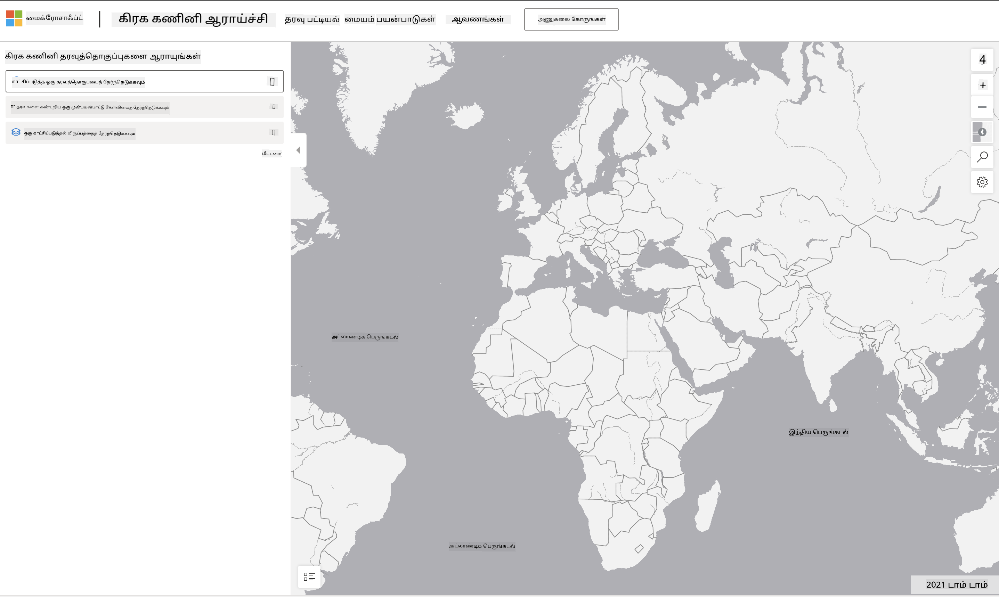

<!--
CO_OP_TRANSLATOR_METADATA:
{
  "original_hash": "d1e05715f9d97de6c4f1fb0c5a4702c0",
  "translation_date": "2025-10-11T15:46:36+00:00",
  "source_file": "6-Data-Science-In-Wild/20-Real-World-Examples/assignment.md",
  "language_code": "ta"
}
-->
# ஒரு கோள் கணினி தரவுத்தொகுப்பை ஆராயுங்கள்

## வழிமுறைகள்

இந்த பாடத்தில், பல்வேறு தரவியல் அறிவியல் பயன்பாட்டு துறைகள் குறித்து பேசினோம் - ஆராய்ச்சி, நிலைத்தன்மை மற்றும் டிஜிட்டல் மனிதவியல் தொடர்பான உதாரணங்களை ஆழமாக ஆராய்ந்தோம். இந்த பணியில், இந்த உதாரணங்களில் ஒன்றை மேலும் விரிவாக ஆராய்ந்து, தரவுக் காட்சிப்படுத்தல் மற்றும் பகுப்பாய்வு தொடர்பான உங்கள் கற்றல்களைப் பயன்படுத்தி நிலைத்தன்மை தரவின் மீது உள்ளுணர்வுகளை பெற வேண்டும்.

[Planetary Computer](https://planetarycomputer.microsoft.com/) திட்டத்தில் கணக்குடன் அணுகக்கூடிய தரவுத்தொகுப்புகள் மற்றும் APIகள் உள்ளன - பணியின் கூடுதல் படியை முயற்சிக்க விரும்பினால் அணுகலைக் கோருங்கள். இந்த தளம் கணக்கை உருவாக்காமல் பயன்படுத்தக்கூடிய [Explorer](https://planetarycomputer.microsoft.com/explore) அம்சத்தையும் வழங்குகிறது.

`படிகள்:`
Explorer இடைமுகம் (கீழே உள்ள ஸ்கிரீன்ஷாட்டில் காட்டப்பட்டுள்ளது) உங்களுக்கு ஒரு தரவுத்தொகுப்பை (வழங்கப்பட்ட விருப்பங்களில் இருந்து), ஒரு முன்பதிவு செய்யப்பட்ட கேள்வியை (தரவை வடிகட்ட) மற்றும் ஒரு காட்சிப்படுத்தல் விருப்பத்தை (சரியான காட்சிப்படுத்தலை உருவாக்க) தேர்ந்தெடுக்க அனுமதிக்கிறது. இந்த பணியில், உங்கள் பணி:

 1. [Explorer documentation](https://planetarycomputer.microsoft.com/docs/overview/explorer/) ஐ படிக்கவும் - விருப்பங்களைப் புரிந்துகொள்ளவும்.
 2. [Catalog](https://planetarycomputer.microsoft.com/catalog) தரவுத்தொகுப்பை ஆராயவும் - ஒவ்வொன்றின் நோக்கத்தை அறியவும்.
 3. Explorer ஐப் பயன்படுத்தவும் - உங்களுக்கு விருப்பமான ஒரு தரவுத்தொகுப்பைத் தேர்ந்தெடுக்கவும், தொடர்புடைய கேள்வி மற்றும் காட்சிப்படுத்தல் விருப்பத்தைத் தேர்ந்தெடுக்கவும்.

`உங்கள் பணி:`
இப்போது உலாவியில் உருவாக்கப்படும் காட்சிப்படுத்தலை ஆராய்ந்து, பின்வரும் கேள்விகளுக்கு பதிலளிக்கவும்:
 * தரவுத்தொகுப்பில் என்ன _அம்சங்கள்_ உள்ளன?
 * காட்சிப்படுத்தல் என்ன _உள்ளுணர்வுகள்_ அல்லது முடிவுகளை வழங்குகிறது?
 * இந்த உள்ளுணர்வுகளின் _பொருட்கள்_ திட்டத்தின் நிலைத்தன்மை இலக்குகளுக்கு என்ன?
 * காட்சிப்படுத்தலின் _குறைகள்_ என்ன (அதாவது, நீங்கள் எந்த உள்ளுணர்வை பெறவில்லை)?
 * நீங்கள் மூலதரவைப் பெற முடிந்தால், எந்த _மாற்று காட்சிப்படுத்தல்களை_ உருவாக்குவீர்கள், ஏன்?

`கூடுதல் புள்ளிகள்:`
ஒரு கணக்குக்கு விண்ணப்பிக்கவும் - ஏற்றுக்கொள்ளப்பட்ட பிறகு உள்நுழையவும்.
 * _Launch Hub_ விருப்பத்தைப் பயன்படுத்தி மூலதரவை ஒரு Notebook இல் திறக்கவும்.
 * தரவை இடைமுகமாக ஆராய்ந்து, நீங்கள் யோசித்த மாற்று காட்சிப்படுத்தல்களை செயல்படுத்தவும்.
 * இப்போது உங்கள் தனிப்பயன் காட்சிப்படுத்தல்களை பகுப்பாய்வு செய்யவும் - நீங்கள் முன்பு தவறவிட்ட உள்ளுணர்வுகளை பெற முடிந்ததா?

## மதிப்பீடு

மிகச் சிறந்தது | போதுமானது | மேம்பாடு தேவை
--- | --- | -- |
அனைத்து ஐந்து முக்கிய கேள்விகளுக்கும் பதிலளிக்கப்பட்டது. மாணவர் தற்போதைய மற்றும் மாற்று காட்சிப்படுத்தல்கள் நிலைத்தன்மை நோக்கங்கள் அல்லது முடிவுகளைப் பற்றிய உள்ளுணர்வுகளை எவ்வாறு வழங்க முடியும் என்பதை தெளிவாக அடையாளம் காட்டியுள்ளார்.| மாணவர் குறைந்தது முதல் 3 கேள்விகளுக்கு மிகச் சிறந்த விவரத்துடன் பதிலளித்துள்ளார், Explorer ஐ நடைமுறையில் பயன்படுத்திய அனுபவத்தை காட்டியுள்ளார்.| மாணவர் பல கேள்விகளுக்கு பதிலளிக்கத் தவறியுள்ளார் அல்லது போதுமான விவரங்களை வழங்கவில்லை - இது திட்டத்திற்கான பொருத்தமான முயற்சி செய்யப்படவில்லை என்பதை காட்டுகிறது |

---

**அறிவிப்பு**:  
இந்த ஆவணம் [Co-op Translator](https://github.com/Azure/co-op-translator) என்ற AI மொழிபெயர்ப்பு சேவையை பயன்படுத்தி மொழிபெயர்க்கப்பட்டுள்ளது. நாங்கள் துல்லியத்திற்காக முயற்சிக்கிறோம், ஆனால் தானியங்கி மொழிபெயர்ப்புகளில் பிழைகள் அல்லது தவறுகள் இருக்கக்கூடும் என்பதை கவனத்தில் கொள்ளவும். அதன் சொந்த மொழியில் உள்ள மூல ஆவணம் அதிகாரப்பூர்வ ஆதாரமாக கருதப்பட வேண்டும். முக்கியமான தகவல்களுக்கு, தொழில்முறை மனித மொழிபெயர்ப்பு பரிந்துரைக்கப்படுகிறது. இந்த மொழிபெயர்ப்பைப் பயன்படுத்துவதால் ஏற்படும் எந்த தவறான புரிதல்களுக்கும் அல்லது தவறான விளக்கங்களுக்கும் நாங்கள் பொறுப்பல்ல.