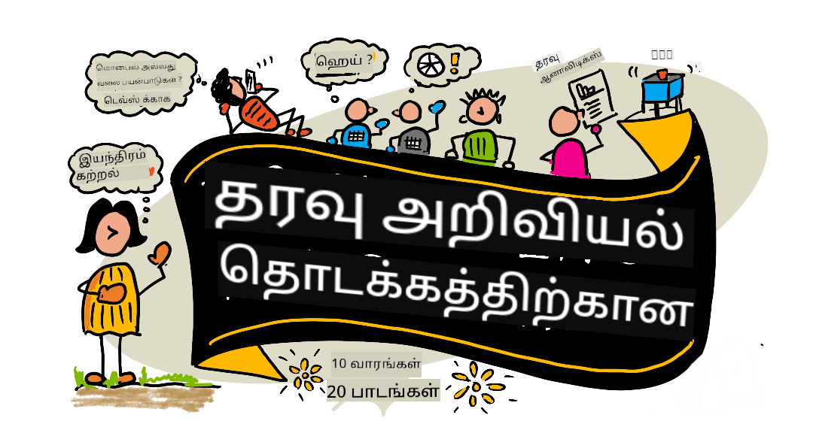

<!--
CO_OP_TRANSLATOR_METADATA:
{
  "original_hash": "7c31d1a22c746b1d0f0582d4f54702ba",
  "translation_date": "2025-12-25T00:42:28+00:00",
  "source_file": "README.md",
  "language_code": "ta"
}
-->
# ஆரம்பநிலை தரவு அறிவியல் - ஒரு பாடத்திட்டம்

Microsoft இல் உள்ள Azure Cloud Advocates தங்கள் 10-வார, 20-பாடங்களில் தொடங்கும் முழு தரவு அறிவியல் பாடத்திட்டத்தை வழங்குவதில் மகிழ்ச்சி அடைகின்றனர். ஒவ்வொரு பாடத்திலுமும் பாடத்திற்குப் முந்தைய மற்றும் பின்னர் நடைபெற்ற பரீட்சைகள், பாடத்தை முடிக்க எழுதப்பட்ட வழிமுறைகள், ஒரு தீர்வு மற்றும் ஒரு பணிவசூலம் உள்ளன. எங்கள் திட்டம் சார்ந்த கற்பித்தல் முறை, நீங்கள் கட்டுமானம் செய்யும் போது கற்க ஊக்குவிக்கும் ஒரு நிரூபித்த வழி ஆகும், புதிய திறன்கள் 'தாங்க' உதவுகிறது.

**எங்கள் ஆசிரியர்களுக்கு இதயம் பூர்வமான நன்றி:** [Jasmine Greenaway](https://www.twitter.com/paladique), [Dmitry Soshnikov](http://soshnikov.com), [Nitya Narasimhan](https://twitter.com/nitya), [Jalen McGee](https://twitter.com/JalenMcG), [Jen Looper](https://twitter.com/jenlooper), [Maud Levy](https://twitter.com/maudstweets), [Tiffany Souterre](https://twitter.com/TiffanySouterre), [Christopher Harrison](https://www.twitter.com/geektrainer).

**🙏 சிறப்பு நன்றி 🙏 எங்கள் [Microsoft Student Ambassador](https://studentambassadors.microsoft.com/) ஆசிரியர்கள், விமர்சகர்கள் மற்றும் உள்ளடக்க பங்களிப்பாளர்களுக்கு,** குறிப்பாக Aaryan Arora, [Aditya Garg](https://github.com/AdityaGarg00), [Alondra Sanchez](https://www.linkedin.com/in/alondra-sanchez-molina/), [Ankita Singh](https://www.linkedin.com/in/ankitasingh007), [Anupam Mishra](https://www.linkedin.com/in/anupam--mishra/), [Arpita Das](https://www.linkedin.com/in/arpitadas01/), ChhailBihari Dubey, [Dibri Nsofor](https://www.linkedin.com/in/dibrinsofor), [Dishita Bhasin](https://www.linkedin.com/in/dishita-bhasin-7065281bb), [Majd Safi](https://www.linkedin.com/in/majd-s/), [Max Blum](https://www.linkedin.com/in/max-blum-6036a1186/), [Miguel Correa](https://www.linkedin.com/in/miguelmque/), [Mohamma Iftekher (Iftu) Ebne Jalal](https://twitter.com/iftu119), [Nawrin Tabassum](https://www.linkedin.com/in/nawrin-tabassum), [Raymond Wangsa Putra](https://www.linkedin.com/in/raymond-wp/), [Rohit Yadav](https://www.linkedin.com/in/rty2423), Samridhi Sharma, [Sanya Sinha](https://www.linkedin.com/mwlite/in/sanya-sinha-13aab1200),
[Sheena Narula](https://www.linkedin.com/in/sheena-narua-n/), [Tauqeer Ahmad](https://www.linkedin.com/in/tauqeerahmad5201/), Yogendrasingh Pawar , [Vidushi Gupta](https://www.linkedin.com/in/vidushi-gupta07/), [Jasleen Sondhi](https://www.linkedin.com/in/jasleen-sondhi/)

||
|:---:|
| ஆரம்பநிலை தரவு அறிவியல் - _ஸ்கெட்ச்நோட் எழுதியவர் [@nitya](https://twitter.com/nitya)_ |

### 🌐 பல மொழி ஆதரவு

#### GitHub Action மூலம் ஆதரிக்கப்படுகிறது (தானியக்கமாகவும் எப்போதும் புதுப்பிக்கப்பட்டும்)

<!-- CO-OP TRANSLATOR LANGUAGES TABLE START -->
[Arabic](../ar/README.md) | [Bengali](../bn/README.md) | [Bulgarian](../bg/README.md) | [Burmese (Myanmar)](../my/README.md) | [Chinese (Simplified)](../zh/README.md) | [Chinese (Traditional, Hong Kong)](../hk/README.md) | [Chinese (Traditional, Macau)](../mo/README.md) | [Chinese (Traditional, Taiwan)](../tw/README.md) | [Croatian](../hr/README.md) | [Czech](../cs/README.md) | [Danish](../da/README.md) | [Dutch](../nl/README.md) | [Estonian](../et/README.md) | [Finnish](../fi/README.md) | [French](../fr/README.md) | [German](../de/README.md) | [Greek](../el/README.md) | [Hebrew](../he/README.md) | [Hindi](../hi/README.md) | [Hungarian](../hu/README.md) | [Indonesian](../id/README.md) | [Italian](../it/README.md) | [Japanese](../ja/README.md) | [Kannada](../kn/README.md) | [Korean](../ko/README.md) | [Lithuanian](../lt/README.md) | [Malay](../ms/README.md) | [Malayalam](../ml/README.md) | [Marathi](../mr/README.md) | [Nepali](../ne/README.md) | [Nigerian Pidgin](../pcm/README.md) | [Norwegian](../no/README.md) | [Persian (Farsi)](../fa/README.md) | [Polish](../pl/README.md) | [Portuguese (Brazil)](../br/README.md) | [Portuguese (Portugal)](../pt/README.md) | [Punjabi (Gurmukhi)](../pa/README.md) | [Romanian](../ro/README.md) | [Russian](../ru/README.md) | [Serbian (Cyrillic)](../sr/README.md) | [Slovak](../sk/README.md) | [Slovenian](../sl/README.md) | [Spanish](../es/README.md) | [Swahili](../sw/README.md) | [Swedish](../sv/README.md) | [Tagalog (Filipino)](../tl/README.md) | [Tamil](./README.md) | [Telugu](../te/README.md) | [Thai](../th/README.md) | [Turkish](../tr/README.md) | [Ukrainian](../uk/README.md) | [Urdu](../ur/README.md) | [Vietnamese](../vi/README.md)
<!-- CO-OP TRANSLATOR LANGUAGES TABLE END -->

**மேலும் மொழிபெயர்ப்புகள் ஆதரிக்கப்பட விரும்பினால், ஆதரிக்கப்படும் மொழிகள் இங்கே பட்டியலிடப்பட்டுள்ளன [here](https://github.com/Azure/co-op-translator/blob/main/getting_started/supported-languages.md)**

#### எங்கள் சமுதாயத்தில் சேருங்கள்

18 - 30 செப்டம்பர், 2025 இடையே நடைபெறும், AI உடன் கற்கும் தொடர் நிகழ்ச்சியில் நாங்கள் ஒரு தொடர்ச்சியான Discord செயற்பாட்டை நடத்துகிறோம், மேலும் அறிந்து எங்கள் [Learn with AI Series](https://aka.ms/learnwithai/discord) இல் சேருங்கள். நீங்கள் Data Science க்காக GitHub Copilot பயன்படுத்துவதற்கான குறிப்புகள் மற்றும் உத்திகளைக் பெறுவீர்கள்.

# நீங்களா ஒரு மாணவர்?

தொடங்க கீழ் உள்ள வளங்களை பயன்படுத்துங்கள்:

- [Student Hub page](https://docs.microsoft.com/en-gb/learn/student-hub?WT.mc_id=academic-77958-bethanycheum) இந்தப் பக்கத்தில் நீங்கள் தொடக்க நிலை வளங்கள், மாணவர் பேக்குகள் மற்றும் இலவச சான்றிதழ் வவுச்சர் பெறுவதற்கான வழிகளைக் காண்பீர்கள். நாம் உள்ளடக்கத்தை மாதத்திற்கு ஒருமுறை மாற்றும் என்பதினால் இந்தப் பக்கத்தை புத்தகக்குறிப்பாக வைத்துக் கொண்டு இடையிடையே பார்க்கவேண்டிய ஒன்று.
- [Microsoft Learn Student Ambassadors](https://studentambassadors.microsoft.com?WT.mc_id=academic-77958-bethanycheum) உலகளாவிய மாணவர் தூதர்கள் சமூகத்தில் சேருங்கள், இது Microsoft உடனான உங்கள் வாயிலாக இருக்கலாம்.

# தொடக்கம்

## 📚 ஆவணங்கள்

- **[Installation Guide](INSTALLATION.md)** - தொடக்கக்காரர்களுக்கான படி படியாக உள்ளமைப்பு வழிமுறைகள்
- **[Usage Guide](USAGE.md)** - எடுத்துக்கூறுகள் மற்றும் பொதுவான வேலைப்பாடுகள்
- **[Troubleshooting](TROUBLESHOOTING.md)** - பொதுவான பிரச்சினைகளுக்கு தீர்வுகள்
- **[Contributing Guide](CONTRIBUTING.md)** - இந்த திட்டத்திற்கு எப்படி பங்களிக்க வேண்டும்
- **[For Teachers](for-teachers.md)** - பாடநெறி வழிகாட்டி மற்றும் வகுப்பு வளங்கள்

## 👨‍🎓 மாணவர்களுக்கு
> **முழுமையாக புதியவர்கள்**: தரவு அறிவியலில் புதியவரா? எங்கள் [beginner-friendly examples](examples/README.md) உடன் தொடங்குங்கள்! இந்த எளிமையான, நன்கு கருத்திட்ட எடுத்துக்காட்டுகள் முழு பாடநெறியை ஆழமாக பார்க்கும் முன் அடிப்படைகளைப் புரிந்துகொள்ள உதவும்.
> **[Students](https://aka.ms/student-page)**: இந்த பாடத்திட்டத்தை தனியாகப் பயன்படுத்த, முழு ரெப்போக்களை fork செய்து, முன்ன்-பாடப் பரீட்சையிலிருந்து துவங்கி பயிற்சிகள் அனைத்தையும் தனியாக முடிக்கவும். பின்னர் லெக்ச்சரை படித்து மற்ற செயல்பாடுகளை முடிக்கவும். தீர்வு குறியீட்டை நகலெடுக்காமல் பாடங்கள் மூலம் புரிந்துகொண்டு திட்டங்களை உருவாக்க முயற்சிக்கவும்; இருப்பினும் அந்த குறியீடு ஒவ்வொரு திட்டக்கு சார்ந்த பாடத்திலுள்ள /solutions கோப்புறைகளில் கிடைக்கிறது. மற்றொரு ஐ디어 வல்லுனர் குழுவுடன் சேர்ந்து உள்ளடக்கத்தைப் பங்கிட்டுப்போவது. விரிவான ஆய்வுத் துறைக்காக, நாங்கள் [Microsoft Learn](https://docs.microsoft.com/en-us/users/jenlooper-2911/collections/qprpajyoy3x0g7?WT.mc_id=academic-77958-bethanycheum) ஐ பரிந்துரைக்கிறோம்.

**விரைவு தொடக்கம்:**
1. உங்கள் சூழலை அமைக்க [Installation Guide](INSTALLATION.md) ஐப் பார்க்கவும்
2. பாடத்திட்டத்துடன் ఎలా வேலை செய்ய வேண்டும் என்பதை அறிய [Usage Guide](USAGE.md) ஐ திருத்தி பாருங்கள்
3. பாடம் 1 இல் இருந்து தொடங்கி வரிசைப்படி செயல்படுங்கள்
4. ஆதரவுக்கு எங்கள் [Discord community](https://aka.ms/ds4beginners/discord) இல் சேருங்கள்

## 👩‍🏫 ஆசிரியர்களுக்காக

> **ஆசிரியர்கள்**: இந்த பாடத்திட்டத்தை எப்படி பயன்படுத்துவது என்பதற்கான சில பரிந்துரைகளை நாங்கள் [சேர்த்துள்ளோம்](for-teachers.md). உங்கள் கருத்துக்களை எங்கள் [விமர்சனை forum](https://github.com/microsoft/Data-Science-For-Beginners/discussions) இல் பெற விரும்புகிறோம்!

## குழுவினரை சந்தியுங்கள்

**Gif** [Mohit Jaisal](https://www.linkedin.com/in/mohitjaisal) tomonidan
> 🎥 மேலுள்ள படத்தை கிளிக் செய்து திட்டம் மற்றும் அதை உருவாக்கியவர்கள் பற்றிய வீடியோவைப் பார்க்கவும்!

## கல்வியியல்

இந்த பாடத்திட்டத்தை உருவாக்கும்போது இரண்டு கல்வி கொள்கைகளைத் தேர்ந்தெடுத்துள்ளோம்: இது திட்டம் சார்ந்ததாக இருக்க வேண்டும் மற்றும் அதில் அடிக்கடி தேர்வுகள் இடம்பெற வேண்டும் என்பதை உறுதிசெய்தல். இந்த தொடரின் முடிவில், மாணவர்கள் தரவு அறிவியலின் அடிப்படை கொள்கைகள், அதில் எதிரொலிக்கும் நெறிமுறைகள், தரவு தயாரிப்பு, தரவுடன் வேலை செய்வதின் விதமான வழிகள், தரவு காட்சிப்படுத்தல், தரவு பகுப்பாய்வு, தரவு அறிவியலின் நிஜ உலக பயன்பாடுகள் மற்றும் பலவற்றை கற்றுக் கொள்வார்கள்.

மேலும், வகுப்பிற்கு முன் குறைந்த-பாதுநிலை தேர்வு ஒரு தலைப்பை கற்றுக்கொள்வதில் மாணவரின் மனஅறிவை அமைக்கிறது, மற்றும் வகுப்புக்குப் பின் இரண்டாவது தேர்வு மேலதிக retention-ஐ உறுதிசெய்கிறது. இந்த பாடத்திட்டம் பண்பெற்றதும் சுவாரஸ்யமானதுமாக வடிவமைக்கப்பட்டுள்ளது மற்றும் முழுவதும் அல்லது பகுதி போது எடுத்துக்கொள்ளலாம். திட்டங்கள் சிறியதாக தொடங்கி 10 வார சுற்றின் இறுதிக்குப் பேரழகாக சிக்கலானதாக மாறுகின்றன.

> எங்கள் [நடத்தை விதிமுறைகள்](CODE_OF_CONDUCT.md), [பங்களிப்பு](CONTRIBUTING.md), [மொழிபெயர்ப்பு](TRANSLATIONS.md) வழிமுறைகளைப் பாருங்கள். உங்கள் கட்டுமானகரமான கருத்துக்களை நாங்கள் வரவேற்கிறோம்!

## ஒவ்வொரு பாடத்திலும் அடங்கும்:

- விருப்ப ஸ்கெட்ச்னோட்
- விருப்பத்தேர்வு கூடுதல் வீடியோ
- பாடத்திற்குமுன் தயாரிப்பு தேர்வு
- எழுதிய பாடம்
- திட்டம் சார்ந்த பாடங்களுக்கு, திட்டத்தை கட்டுவதற்கான படிநிலை அணுகுமுறை வழிகாட்டிகள்
- அறிவு சோதனைகள்
- ஒரு சவால்
- கூடுதல் வாசிப்பு
- ஒப்படைப்பு
- [பாடத்திற்குப் பிறகு தேர்வு](https://ff-quizzes.netlify.app/en/)

> **குயிஸ்கள் பற்றி ஒரு குறிப்புரை**: அனைத்து குயிஸ்களும் Quiz-App கோப்புறையில் உள்ளன, ஒவ்வொன்றும் மூன்று கேள்விகள் கொண்ட மொத்தம் 40 குயிஸ்கள். அவை பாடங்களில் இருந்து இணைக்கப்பட்டுள்ளன, ஆனால் quiz app-ஐ உள்ளூரில் இயக்கவோ அல்லது Azure-க்கு deploy செய்யவோ முடியும்; `quiz-app` கோப்புறையிலுள்ள அறிவுறுத்தல்களை பின்பற்றவும். அவை படிப்படியாக உள்ளூர் மொழிகளில் வடிவமைக்கப்படுகின்றன.

## 🎓 தொடக்கத்திற்கான சுலபமான உதாரணங்கள்

**தரவு அறிவியலில் புதியவரா?** எங்கள் சிறப்பு [உதாரணங்கள் அடைவு](examples/README.md) உருவாக்கப்பட்டுள்ளது, தொடங்க உதவும் எளிய மற்றும் நன்கு கருத்துரைக்கப்பட்ட கோடுகளுடன்:

- 🌟 **Hello World** - உங்கள் முதல் தரவு அறிவியல் நிரல்
- 📂 **Loading Data** - தரவுத்தொகுப்புகளை வாசித்து ஆய்வு செய்வதை கற்றுக்கொள்ளுங்கள்
- 📊 **Simple Analysis** - புள்ளிவிவரங்களை கணக்கிட்டு மாதிரிகள்/வடிவங்களை கண்டறியுங்கள்
- 📈 **Basic Visualization** - சார்ட்கள் மற்றும் வரைபடங்களை உருவாக்குங்கள்
- 🔬 **Real-World Project** - துவக்கத்திலிருந்து முடிவுவரை முழு வேலைநெறியை செலுத்துங்கள்

ஒவ்வொரு உதாரணத்திலும் ஒவ்வொரு படியையும் விளக்கும் விரிவான கருத்துரைகள் உள்ளன, இது முழுமையாக தொடக்கத்திற்குத் தகுதியானது!

👉 **[உதாரணங்களோடு தொடங்குங்கள்](examples/README.md)** 👈

## பாடங்கள்

||
|:---:|
| தரவு அறிவியல் ஆரம்பத்திற்கான வரைபடம் - _ஸ்கெட்ச்னோட் by [@nitya](https://twitter.com/nitya)_ |

| Lesson Number | Topic | Lesson Grouping | Learning Objectives | Linked Lesson | Author |
| :-----------: | :----------------------------------------: | :--------------------------------------------------: | :-----------------------------------------------------------------------------------------------------------------------------------------------------------------------: | :---------------------------------------------------------------------: | :----: |
| 01 | தரவு அறிவியலை வரையறுத்தல் | [அறிமுகம்](1-Introduction/README.md) | தரவு அறிவியலின் அடிப்படை கருத்துக்கள் மற்றும் அது செயற்கை நுண்ணறிவு, இயந்திர கற்கை மற்றும் பெரிய தரவுடன் எவ்வாறு தொடர்புடையது என்பதைக் கற்றுக்கொள்ளுங்கள். | [பாடம்](1-Introduction/01-defining-data-science/README.md) [வீடியோ](https://youtu.be/beZ7Mb_oz9I) | [Dmitry](http://soshnikov.com) |
| 02 | தரவு நெறிமுறை | [அறிமுகம்](1-Introduction/README.md) | தரவு நெறிமுறை கருத்துக்கள், சவால்கள் மற்றும் கட்டமைப்புகள். | [பாடம்](1-Introduction/02-ethics/README.md) | [Nitya](https://twitter.com/nitya) |
| 03 | தரவை வரையறுத்தல் | [அறிமுகம்](1-Introduction/README.md) | தரவு எப்படித் வகைப்படுத்தப்படுகிறது மற்றும் அதன் பொதுவான ஆதாரங்கள். | [பாடம்](1-Introduction/03-defining-data/README.md) | [Jasmine](https://www.twitter.com/paladique) |
| 04 | புள்ளியியல் மற்றும் சாத்தியக்கூறு அறிமுகம் | [அறிமுகம்](1-Introduction/README.md) | தரவை புரிந்துகொள்ள சாத்தியக்கூறு மற்றும் புள்ளியியலில் பயன்படும் கணித தொழில்நுட்பங்கள். | [பாடம்](1-Introduction/04-stats-and-probability/README.md) [வீடியோ](https://youtu.be/Z5Zy85g4Yjw) | [Dmitry](http://soshnikov.com) |
| 05 | உறவியல் தரவுடன் வேலை செய்வது | [தரவுடன் வேலை செய்தல்](2-Working-With-Data/README.md) | உறவியல் தரவிற்கு அறிமுகம் மற்றும் Structured Query Language (SQL - உச்சரிப்பில் “see-quell”) பயன்படுத்தி உறவியல் தரவுகளை ஆராய்வதும் பகுப்பாய்வு செய்வதும் பற்றிய அடிப்படைத் தந்திரங்கள். | [பாடம்](2-Working-With-Data/05-relational-databases/README.md) | [Christopher](https://www.twitter.com/geektrainer) | | |
| 06 | NoSQL தரவுடன் வேலை செய்வது | [தரவுடன் வேலை செய்தல்](2-Working-With-Data/README.md) | அடிக்கடி-உறவில்லாத தரவிற்கு (non-relational data) அறிமுகம், அதன் வெவ்வேறு வகைகள் மற்றும் பதிவு தரவுத்தளங்களை ஆராய்ந்து பகுப்பாய்வு செய்வதின் அடிப்படை. | [பாடம்](2-Working-With-Data/06-non-relational/README.md) | [Jasmine](https://twitter.com/paladique)|
| 07 | Python உடன் வேலை செய்வது | [தரவுடன் வேலை செய்தல்](2-Working-With-Data/README.md) | Pandas போன்ற நூலகங்களைப் பயன்படுத்தி தரவு ஆராய்ச்சிக்காக Python பயன்படுத்துவதின் அடிப்படை. Python.programming அடிப்படை புரிதல் பரிதாபமாக பரிந்துரைக்கப்படுகிறது. | [பாடம்](2-Working-With-Data/07-python/README.md) [வீடியோ](https://youtu.be/dZjWOGbsN4Y) | [Dmitry](http://soshnikov.com) |
| 08 | தரவு தயாரிப்பு | [தரவுடன் வேலை செய்தல்](2-Working-With-Data/README.md) | காணாமல் போன, தவறான அல்லது முழுமையற்ற தரவுகளின் சவால்களை கையாள தரவை சுத்தம் செய்வதும் மாற்றுவதும் போன்ற தரவுத் தொழில்நுட்பங்கள். | [பாடம்](2-Working-With-Data/08-data-preparation/README.md) | [Jasmine](https://www.twitter.com/paladique) |
| 09 | அளவுகளை காட்சிப்படுத்துதல் | [தரவு காட்சிப்படுத்தல்](3-Data-Visualization/README.md) | Matplotlib ஐ பயன்படுத்தி பறவை தரவுகளை 🦆 காட்சிப்படுத்துவது எப்படி என்பதை கற்றுக்கொள்ளுங்கள் | [பாடம்](3-Data-Visualization/09-visualization-quantities/README.md) | [Jen](https://twitter.com/jenlooper) |
| 10 | தரவு விநியோகங்களை காட்சிப்படுத்துதல் | [தரவு காட்சிப்படுத்தல்](3-Data-Visualization/README.md) | ஒரு இடைவெளியின் உள்ளே காணப்படும் தெளிவுகள் மற்றும் போக்குகளை காட்சிப்படுத்துதல். | [பாடம்](3-Data-Visualization/10-visualization-distributions/README.md) | [Jen](https://twitter.com/jenlooper) |
| 11 | விகிதங்களை காட்சிப்படுத்துதல் | [தரவு காட்சிப்படுத்தல்](3-Data-Visualization/README.md) | தனித்தனி மற்றும் குழுவாக்கப்பட்ட சதவீதங்களை காட்சிப்படுத்துதல். | [பாடம்](3-Data-Visualization/11-visualization-proportions/README.md) | [Jen](https://twitter.com/jenlooper) |
| 12 | உறவுகளை காட்சிப்படுத்துதல் | [தரவு காட்சிப்படுத்தல்](3-Data-Visualization/README.md) | தரவுத்தொடர்களின் மற்றும் அவர்களின் மாறிலிகளின் இடையிலான தொடர்புகள் மற்றும் சார்புகளை காட்சிப்படுத்துதல். | [பாடம்](3-Data-Visualization/12-visualization-relationships/README.md) | [Jen](https://twitter.com/jenlooper) |
| 13 | பொருளுணர்ந்த காட்சிப்படுத்தல்கள் | [தரவு காட்சிப்படுத்தல்](3-Data-Visualization/README.md) | உங்கள் காட்சிப்படுத்தல்களை விளக்கக்கூடிய மற்றும் தீர்வு காண்பதற்கும்洞றிவுகளைப் பெறுவதற்கும் பயன்படும் முறைகள் மற்றும் வழிகாட்டுதல்கள். | [பாடம்](3-Data-Visualization/13-meaningful-visualizations/README.md) | [Jen](https://twitter.com/jenlooper) |
| 14 | தரவு அறிவியல் வாழ்க்கைச்சுற்றத்திற்கு அறிமுகம் | [வாழ்க்கைச் சுற்றம்](4-Data-Science-Lifecycle/README.md) | தரவு அறிவியல் வாழ்க்கைச்சுற்றிற்கான அறிமுகம் மற்றும் தரவை பெற்றெடுப்பது மற்றும் எடுத்தெடுப்பது என்ற முதலாவது படி. | [பாடம்](4-Data-Science-Lifecycle/14-Introduction/README.md) | [Jasmine](https://twitter.com/paladique) |
| 15 | பகுப்பாய்வு | [வாழ்க்கைச் சுற்றம்](4-Data-Science-Lifecycle/README.md) | தரவு அறிவியல் வாழ்க்கைச்சுற்றின் இந்த நிலை தரவை பகுப்பாய்வு செய்யும் நுட்பங்கள üzerine கவனம் செலுத்துகிறது. | [பாடம்](4-Data-Science-Lifecycle/15-analyzing/README.md) | [Jasmine](https://twitter.com/paladique) | | |
| 16 | தகவல் பகிர்வு | [வாழ்க்கைச் சுற்றம்](4-Data-Science-Lifecycle/README.md) | தரவு வழங்கும் உள்ளுணர்வுகளை தீர்மானிகளால் எளிதாக புரிந்துகொள்ளக்கூடியவாறு சமர்ப்பிப்பதில் இந்த நிலை கவனம் செலுத்துகிறது. | [பாடம்](4-Data-Science-Lifecycle/16-communication/README.md) | [Jalen](https://twitter.com/JalenMcG) | | |
| 17 | மேகத்தில் தரவு அறிவியல் | [மேகத் தரவு](5-Data-Science-In-Cloud/README.md) | மேகத்தில் தரவு அறிவியல் மற்றும் அதன் நன்மைகள் குறித்து இந்த பாடங்களின் தொடர் அறிமுகப்படுத்துகிறது. | [பாடம்](5-Data-Science-In-Cloud/17-Introduction/README.md) | [Tiffany](https://twitter.com/TiffanySouterre) and [Maud](https://twitter.com/maudstweets) |
| 18 | மேகத்தில் தரவு அறிவியல் | [மேகத் தரவு](5-Data-Science-In-Cloud/README.md) | Low Code கருவிகளைப் பயன்படுத்தி மாடல்களை பயிற்றுவித்தல். |[பாடம்](5-Data-Science-In-Cloud/18-Low-Code/README.md) | [Tiffany](https://twitter.com/TiffanySouterre) and [Maud](https://twitter.com/maudstweets) |
| 19 | மேகத்தில் தரவு அறிவியல் | [மேகத் தரவு](5-Data-Science-In-Cloud/README.md) | Azure Machine Learning Studio உடன் மாடல்களை இயக்குதல் (deploying). | [பாடம்](5-Data-Science-In-Cloud/19-Azure/README.md)| [Tiffany](https://twitter.com/TiffanySouterre) and [Maud](https://twitter.com/maudstweets) |
| 20 | உண்மைக் சூழலில் தரவு அறிவியல் | [உண்மை சூழல்](6-Data-Science-In-Wild/README.md) | உண்மையான உலகில் தரவு அறிவியலில் நடத்தப்படும் திட்டங்கள். | [பாடம்](6-Data-Science-In-Wild/20-Real-World-Examples/README.md) | [Nitya](https://twitter.com/nitya) |

## GitHub Codespaces

இந்த மாதிரியை Codespace-இலே திறக்க பின்வரும் படிகளை பின்பற்றவும்:
1. Code drop-down மெனுவை கிளிக் செய்து Open with Codespaces விருப்பத்தைத் தேர்ந்தெடுக்கவும்.
2. மேல் பெட்டியின் அடிவகுதியில் + New codespace ஐ தேர்ந்தெடுக்கவும்.
மேலும் தகவலுக்கு, [GitHub documentation](https://docs.github.com/en/codespaces/developing-in-codespaces/creating-a-codespace-for-a-repository#creating-a-codespace)-ஐப் பார்க்கவும்.

## VSCode Remote - Containers
உங்கள் உள்ளூர் கணினி மற்றும் VSCode-இன் VS Code Remote - Containers நீட்சியைப் பயன்படுத்தி இந்த ஒன்றியல் கோப்பகத்தை கன்டெய்னரில் திறக்க பின்வரும் படிகளை பின்பற்றவும்:

1. இது உங்கள் முதன் முறையாக ஒரு development container பயன்படுத்தினால், உங்கள் சிஸ்டம் தேவையான முன்னோட்டங்கள் (உதாரணத்திற்கு Docker நிறுவப்பட்டுள்ளது) இருந்துள்ளதா என்பதை [the getting started documentation](https://code.visualstudio.com/docs/devcontainers/containers#_getting-started)-இல் உறுதிசெய்யவும்.

இந்த கோப்பகத்தை பயன்படுத்த, நீங்கள் அல்லது तो ஒரு தனியான Docker volume-இல் இந்த repository-ஐ திறக்கலாம்:

**Note**: வெளிப்புறமாக, இது Remote-Containers: **Clone Repository in Container Volume...** கட்டளையைப் பயன்படுத்தி மூலக் கோப்புகளை உள்ளூர்த் கோப்புதளத்தின் பதிலாக Docker volume-இல் கிளோன் செய்யும். [Volumes](https://docs.docker.com/storage/volumes/) என்பது கன்டெய்னர் தரவுகளை நிலையானவாறு வைத்திருக்க பரிந்துரைக்கப்படும் முறை.

அல்லது உள்ளூரில் கிளோன் செய்த அல்லது பதிவிறக்கப்பட்ட பதிப்பை திறக்கவும்:

- இந்த GitHub repo-ஐ உங்கள் உள்ளூர் கோப்புதளத்திற்குக் கிளோன் செய்யவும்.
- F1 அழுத்தி **Remote-Containers: Open Folder in Container...** கட்டளையைத் தேர்ந்தெடுக்கவும்.
- கிளோன்டு செய்யப்பட்ட இந்த கோப்புறை தேர்ந்தெடுத்து, கன்டெய்னர் துவங்கும் வரை காத்திருங்கள் மற்றும் முயற்சிக்கவும்.

## ஆஃப்லைன் அணுகல்

[Docsify](https://docsify.js.org/#/) ஐப் பயன்படுத்தி இந்த ஆவணத்தை ஆஃப்லைனில் இயக்கலாம். இந்த repo-ஐ fork செய்து, உங்கள் உள்ளூர் இயந்திரத்தில் [Docsify ஐ நிறுவவும்](https://docsify.js.org/#/quickstart), பிறகு இந்த repo-வின் root கோப்புறையில் `docsify serve` என்பதை টাইப் செய்யவும். இணையதளம் உங்கள் localhost இல் போர்ட் 3000-ல் சேவையாக இருக்கும்: `localhost:3000`.

> குறிப்பு: நோட்புக்குகள் Docsify மூலம் ரெண்டர் செய்யப்படமாட்டாது, ஆகவே நீங்கள் ஒரு நோட்புக் இயக்கப்பட வேண்டுமென்றால், அதை தனியாக VS Code-ல் Python kernel ஓட்டுகிற நிலையில் செய்யவும்.

## பிற பாடத்திட்டங்கள்

எங்கள் குழு பிற பாடத்திட்டங்களையும் உருவாக்குகிறது! இதைப் பார்க்கவும்:

<!-- CO-OP TRANSLATOR OTHER COURSES START -->
### LangChain

---

### Azure / Edge / MCP / Agents

---
 
### உருவாக்கும் AI தொடர்

[-9333EA?style=for-the-badge&labelColor=E5E7EB&color=9333EA)](https://github.com/microsoft/Generative-AI-for-beginners-dotnet?WT.mc_id=academic-105485-koreyst)
[-C084FC?style=for-the-badge&labelColor=E5E7EB&color=C084FC)](https://github.com/microsoft/generative-ai-for-beginners-java?WT.mc_id=academic-105485-koreyst)
[-E879F9?style=for-the-badge&labelColor=E5E7EB&color=E879F9)](https://github.com/microsoft/generative-ai-with-javascript?WT.mc_id=academic-105485-koreyst)

---
 
### முக்கிய கற்றல்

---
 
### Copilot தொடர்

<!-- CO-OP TRANSLATOR OTHER COURSES END -->

## உதவி பெறுதல்

**சிக்கல்களை எதிர்கொள்கிறீர்களா?** எங்கள் [பிரச்சனை தீர்க்கும் வழிகாட்டி](TROUBLESHOOTING.md) பொதுவான பிரச்சனைகளுக்கான தீர்வுகளுக்காகப் பார்வையிடவும்.

If you get stuck or have any questions about building AI apps. Join fellow learners and experienced developers in discussions about MCP. It's a supportive community where questions are welcome and knowledge is shared freely.

If you have product feedback or errors while building visit:

---

<!-- CO-OP TRANSLATOR DISCLAIMER START -->
பதிவிலக்கு:
இந்த ஆவணம் AI மொழிபெயர்ப்பு சேவையாகும் Co-op Translator (https://github.com/Azure/co-op-translator) மூலம் மொழிபெயர்க்கப்பட்டுள்ளது. நாங்கள் துல்லியத்திற்காக முயற்சி செய்கிறோம் என்றாலும், தானியங்கி மொழிபெயர்ப்புகளில் தவறுகள் அல்லது துல்லியமின்மைகள் இருக்கலாம் என்பதை தயவுசெய்து கருத்தில் கொள்ளவும். மூல ஆவணம் அதன் சொந்த மொழியில் அதிகாரபூர்வ மூலமாக கருதப்பட வேண்டும். முக்கியமான தகவல்களுக்கு, தொழில்முறை மனித மொழிபெயர்ப்பை பரிந்துரைக்கின்றோம். இந்த மொழிபெயர்ப்பு பயன்பாட்டினால் ஏற்படக்கூடிய எந்த தவறான புரிதல்களுக்கும் அல்லது தவறான விளக்கங்களுக்கும் நாங்கள் பொறுப்பேற்கமாட்டோம்.
<!-- CO-OP TRANSLATOR DISCLAIMER END -->