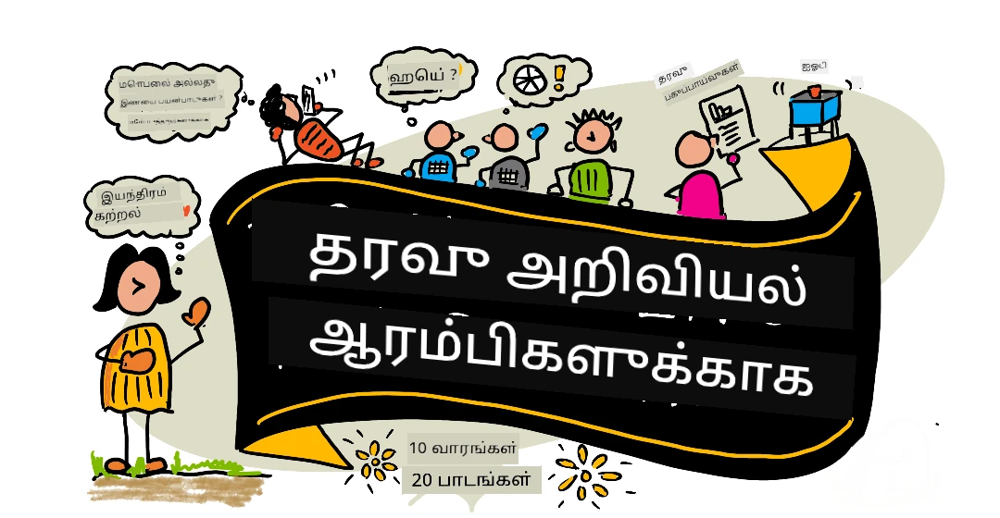
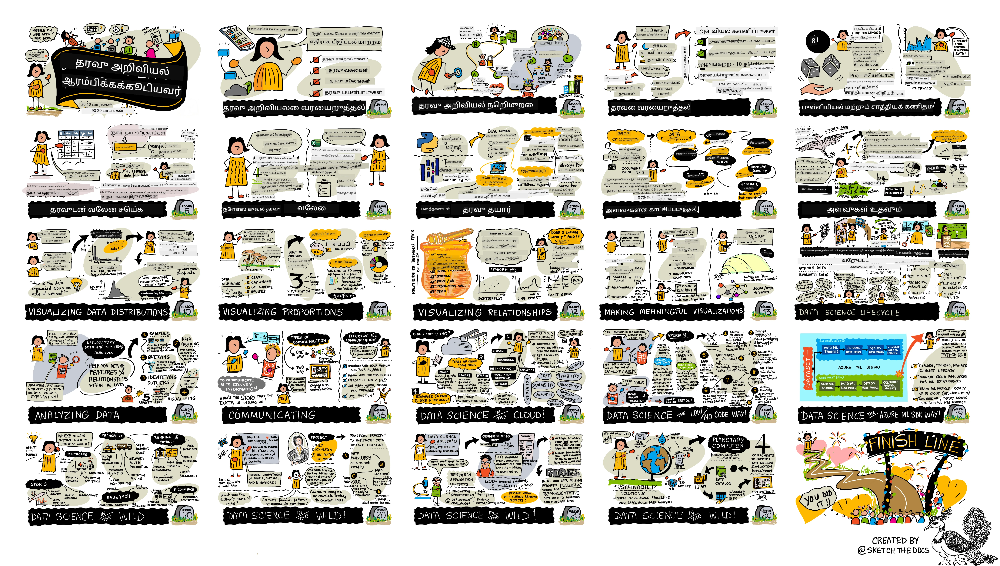

# தொடக்கக்கலார்களுக்கான தரவு அறிவியல் - பாடத்திட்டம்

[](https://github.com/codespaces/new?hide_repo_select=true&ref=main&repo=344191198)

[](https://github.com/microsoft/Data-Science-For-Beginners/blob/master/LICENSE)
[](https://GitHub.com/microsoft/Data-Science-For-Beginners/graphs/contributors/)
[](https://GitHub.com/microsoft/Data-Science-For-Beginners/issues/)
[](https://GitHub.com/microsoft/Data-Science-For-Beginners/pulls/)
[](http://makeapullrequest.com)

[](https://GitHub.com/microsoft/Data-Science-For-Beginners/watchers/)
[](https://GitHub.com/microsoft/Data-Science-For-Beginners/network/)
[](https://GitHub.com/microsoft/Data-Science-For-Beginners/stargazers/)


[](https://discord.gg/nTYy5BXMWG)

[](https://aka.ms/foundry/forum)

மைக்ரோசாஃப்ட் Azure க்லவுட் அதிகாரிகள் தரவு அறிவியலைப் பற்றிய 10 வாரங்கள், 20 பாடங்கள் கொண்ட பாடத்திட்டத்தை வழங்குவதில் மகிழ்ச்சி அடைகிறார்கள். ஒவ்வொரு பாடத்திலும் முன்-பாடம் மற்றும் பின்-பாடக் கேள்விப் பட்டியல்கள், பாடத்தை முடிக்க எழுதப்பட்ட வழிமுறைகள், ஒரு தீர்வு மற்றும் ஒரு பணிப்பணி உள்ளடக்கப்பட்டுள்ளது. எங்கள் திட்டத்தில் அடிப்படையாக்கப்பட்ட கற்கை முறையால் நீங்கள் கட்டும் போது கற்றுக் கொள்ள முடியும், இது புதிய திறன்கள் 'தொடரத் தென்றல்' ஏற்படுத்தும் மூலம் என்று நிரூபிக்கப்பட்டது.

**எங்கள் எழுத்தாளர்களுக்கு மனமார்ந்த நன்றிகள்:** [ஜாஸ்மின் கிரின்வே](https://www.twitter.com/paladique), [டிமிட்ரி சோஷ்னிகொவ்](http://soshnikov.com), [நித்யா நரசிமھان](https://twitter.com/nitya), [ஜாலன் மகீ](https://twitter.com/JalenMcG), [ஜென் லூப்பர்](https://twitter.com/jenlooper), [மாட்டு லெவி](https://twitter.com/maudstweets), [டிபானி சௌட்டரேர்](https://twitter.com/TiffanySouterre), [கிரிஸ்டோபர் ஹாரிசன்](https://www.twitter.com/geektrainer).

**🙏 எங்கள் [மைக்ரோசாஃப்ட் மாணவர் தூதர்கள்](https://studentambassadors.microsoft.com/) எழுத்தாளர்கள், மதிப்பாய்வாளர்கள் மற்றும் உள்ளடக்க பங்களிப்பாளர்களுக்கு சிறப்பு நன்றிகள் 🙏**, குறிப்பாக ஆர்யன் அரோரா, [அதித்ய கார்க்](https://github.com/AdityaGarg00), [அலோந்த்ரா சாஞ்சஸ்](https://www.linkedin.com/in/alondra-sanchez-molina/), [அங்கீதா சிங்](https://www.linkedin.com/in/ankitasingh007), [அனுபம் மிஷ்ரா](https://www.linkedin.com/in/anupam--mishra/), [அர்பிதா தாஸ்](https://www.linkedin.com/in/arpitadas01/), சைல் பிஹாரி துபே, [டிப்ரி ந்ஸோஃபர்](https://www.linkedin.com/in/dibrinsofor), [டிஷிதா பாசின்](https://www.linkedin.com/in/dishita-bhasin-7065281bb), [மாஜித் சাফி](https://www.linkedin.com/in/majd-s/), [மேக்ஸ் பிளம்](https://www.linkedin.com/in/max-blum-6036a1186/), [மிகேல் காரியா](https://www.linkedin.com/in/miguelmque/), [மொஹம்மா இஃப்தேகர் (இஃப்டு) எப்னி ஜலால்](https://twitter.com/iftu119), [நவரின் தபாஸ்சும்](https://www.linkedin.com/in/nawrin-tabassum), [ரெய்மோண்ட் வாயன்சா முதலியோர்](https://www.linkedin.com/in/raymond-wp/), [ரோஹித் யாதவ்](https://www.linkedin.com/in/rty2423), சம்ரிதி சர்மா, [சந்யா சிங்ஹா](https://www.linkedin.com/mwlite/in/sanya-sinha-13aab1200),
[சீனா நருலா](https://www.linkedin.com/in/sheena-narua-n/), [தௌகீர் அஹ்மத்](https://www.linkedin.com/in/tauqeerahmad5201/), யோகேந்திரசிங் பவர, [விடுஷி குப்தா](https://www.linkedin.com/in/vidushi-gupta07/), [ஜாஸ்லீன் சொந்தி](https://www.linkedin.com/in/jasleen-sondhi/)

||
|:---:|
| தொடக்கக்கலார்களுக்கான தரவு அறிவியல் - _ஸ்கெட்ச் நோட்டு [@nitya](https://twitter.com/nitya) tarafından_ |

### 🌐 பலமொழி ஆதரவு

#### GitHub செயலியால் ஆதரிக்கப்பட்டது (தானியங்கி மற்றும் எப்போதும் புதுப்பிக்கப்படும்)

<!-- CO-OP TRANSLATOR LANGUAGES TABLE START -->
[Arabic](../ar/README.md) | [Bengali](../bn/README.md) | [Bulgarian](../bg/README.md) | [Burmese (Myanmar)](../my/README.md) | [Chinese (Simplified)](../zh-CN/README.md) | [Chinese (Traditional, Hong Kong)](../zh-HK/README.md) | [Chinese (Traditional, Macau)](../zh-MO/README.md) | [Chinese (Traditional, Taiwan)](../zh-TW/README.md) | [Croatian](../hr/README.md) | [Czech](../cs/README.md) | [Danish](../da/README.md) | [Dutch](../nl/README.md) | [Estonian](../et/README.md) | [Finnish](../fi/README.md) | [French](../fr/README.md) | [German](../de/README.md) | [Greek](../el/README.md) | [Hebrew](../he/README.md) | [Hindi](../hi/README.md) | [Hungarian](../hu/README.md) | [Indonesian](../id/README.md) | [Italian](../it/README.md) | [Japanese](../ja/README.md) | [Kannada](../kn/README.md) | [Khmer](../km/README.md) | [Korean](../ko/README.md) | [Lithuanian](../lt/README.md) | [Malay](../ms/README.md) | [Malayalam](../ml/README.md) | [Marathi](../mr/README.md) | [Nepali](../ne/README.md) | [Nigerian Pidgin](../pcm/README.md) | [Norwegian](../no/README.md) | [Persian (Farsi)](../fa/README.md) | [Polish](../pl/README.md) | [Portuguese (Brazil)](../pt-BR/README.md) | [Portuguese (Portugal)](../pt-PT/README.md) | [Punjabi (Gurmukhi)](../pa/README.md) | [Romanian](../ro/README.md) | [Russian](../ru/README.md) | [Serbian (Cyrillic)](../sr/README.md) | [Slovak](../sk/README.md) | [Slovenian](../sl/README.md) | [Spanish](../es/README.md) | [Swahili](../sw/README.md) | [Swedish](../sv/README.md) | [Tagalog (Filipino)](../tl/README.md) | [Tamil](./README.md) | [Telugu](../te/README.md) | [Thai](../th/README.md) | [Turkish](../tr/README.md) | [Ukrainian](../uk/README.md) | [Urdu](../ur/README.md) | [Vietnamese](../vi/README.md)

> **உள்ளூர் கிளோன் செய்தல் விரும்புகிறீர்களா?**
>
> இந்த நிரல்கூடு 50+ மொழி மொழிபெயர்ப்புகளை கொண்டுள்ளது, இது பதிவிறக்கம் அளவை பெரிதாக அதிகரிக்கிறது. மொழிபெயர்ப்புகள் இல்லாமல் கிளோன் செய்ய spares checkout பயன்படுத்தவும்:
>
> **Bash / macOS / Linux:**
> ```bash
> git clone --filter=blob:none --sparse https://github.com/microsoft/Data-Science-For-Beginners.git
> cd Data-Science-For-Beginners
> git sparse-checkout set --no-cone '/*' '!translations' '!translated_images'
> ```
>
> **CMD (Windows):**
> ```cmd
> git clone --filter=blob:none --sparse https://github.com/microsoft/Data-Science-For-Beginners.git
> cd Data-Science-For-Beginners
> git sparse-checkout set --no-cone "/*" "!translations" "!translated_images"
> ```
>
> இது விரைவான பதிவிறக்கத்துடன் படிப்பை முடிப்பதற்கு தேவையான அனைத்தையும் வழங்கும்.
<!-- CO-OP TRANSLATOR LANGUAGES TABLE END -->

**மேலும் மொழிபெயர்ப்பு மொழிகள் ஆதரவு தேவைப்பட்டால் இங்கு பட்டியலிடப்பட்டுள்ளது [இங்கே](https://github.com/Azure/co-op-translator/blob/main/getting_started/supported-languages.md)**

#### எங்கள் சமுதாயத்தில் இணையுங்கள்
[](https://discord.gg/nTYy5BXMWG)

நாம் AI-ன் மூலம் கற்றல் தொடர் தொடர்ந்தும் நடைபெற்று வருகிறது, மேலும் அறிந்து எங்கள் [Learn with AI Series](https://aka.ms/learnwithai/discord) இல் 2025 செப்டம்பர் 18 - 30 வரை கலந்து கொள்ளுங்கள். தரவு அறிவியலுக்கான GitHub Copilot பயன்படுத்துவதற்கான குறிப்புகள் மற்றும் முறைகள் கிடைக்கும்.


# நீங்கள் ஒரு மாணவரா?

பின்வரும் வளன்களைத் தொடங்கு:

- [மாணவர் மையப் பக்கம்](https://docs.microsoft.com/en-gb/learn/student-hub?WT.mc_id=academic-77958-bethanycheum) இந்த பக்கத்தில், நீங்கள் தொடக்க வளங்களையும், மாணவர் தொகுப்புகளையும், ஒரு இலவச சான்றிதழ் வௌ்சர் பெறுவதற்கான வழிகளையும் காணலாம். இது ஒரு பக்கம் நீங்கள் பூட்டியில் வைக்கவும், காலக்கெடுவின்போது மாற்றப்படும் உள்ளடக்கத்தைக் காணவும் வேண்டும்.
- [Microsoft Learn Student Ambassadors](https://studentambassadors.microsoft.com?WT.mc_id=academic-77958-bethanycheum) உலகளாவிய மாணவர் தூதர்கள் சமூகத்தில் இணையுங்கள், இது உங்கள் மைக்ரோசாஃப்ட் போக்குவரத்துக்கான வழியாக அமையலாம்.

# தொடக்கம்

## 📚 ஆவணங்கள்

- **[நிறுவல் வழிகாட்டி](INSTALLATION.md)** - புதியவர்களுக்கு படிப்படியாக அமைக்கும் வழிமுறைகள்
- **[பயன்பாடு வழிகாட்டி](USAGE.md)** - எடுத்துக்காட்டுகள் மற்றும் பொதுவான வேலைநடப்புகள்
- **[பிரச்சனை தீர்வு](TROUBLESHOOTING.md)** - பொதுவான பிரச்சனைகளுக்கான தீர்வுகள்
- **[பங்களிக்க வழிகாட்டி](CONTRIBUTING.md)** - இந்தத் திட்டத்தில் பங்களிப்பது எப்படி
- **[ஆசிரியர்களுக்கு](for-teachers.md)** - கற்பித்தல் வழிகாட்டுதல் மற்றும் வகுப்பு வளங்கள்

## 👨‍🎓 மாணவர்களுக்கு
> **முழுமையான தொடக்கக்கலார்கள்**: தரவு அறிவியலில் புதியவரா? எங்கள் [தொடக்கக்கடைகார எடுத்துக்காட்டுகளை](examples/README.md) நோக்குங்கள்! இந்த எளிமையான, நன்கு கருத்து செய்யபட்ட எடுத்துக்காட்டுகள் முழு பாடத்திட்டத்தில் நுழையுமுன் அடிப்படைகளை புரிந்துகொள்ள உதவும்.
> **[மாணவர்கள்](https://aka.ms/student-page)**: இந்த பாடத்திட்டத்தை தனியாகப் பயன்படுத்த, முழு ரெப்போவை fork செய்து, முன்னுரை வினாடி வினா மூலம் தொடங்கி, பாடங்களை படித்து மற்ற செயல்களை முடிக்கவும். தீர்வு குறியீட்டை நகலெடுக்காமல் பாடங்களை புரிந்து கொண்டு திட்டங்களை உருவாக்க முயற்சிக்கவும்; இருப்பினும், தீர்வு குறியீடு ஒவ்வொரு திட்ட சார்ந்த பாடத்திலும் /solutions கோப்புறையில் கிடைக்கிறது. மேலும், நண்பர்களுடன் படிக்கும் குழுவை உருவாக்கி ஒன்றாக உள்ளடக்கத்தைப் பகிரவும். மேலதிக படிப்புக்காக, [Microsoft Learn](https://docs.microsoft.com/en-us/users/jenlooper-2911/collections/qprpajyoy3x0g7?WT.mc_id=academic-77958-bethanycheum) பரிந்துரைக்கப்படுகிறது.

**விரைவு தொடக்கம்:**
1. உங்கள் சுற்றுச்சூழலை அமைப்பதற்கு [நிறுவல் வழிகாட்டி](INSTALLATION.md) ஐ பார்க்கவும்
2. பாடத்திட்டத்துடன் எப்படிக் வேலை செய்ய வேண்டும் என்பதை அறிய [பயன்பாடு வழிகாட்டி](USAGE.md) ஐ மதிப்பாய்வு செய்யவும்
3. பாடம் 1-ல் தொடங்கி வரிசைப்படுத்திப் பணி செய்யவும்
4. ஆதரவுக்காக எங்கள் [Discord சமூகம்](https://aka.ms/ds4beginners/discord) இணைக்கவும்

## 👩‍🏫 ஆசிரியர்களுக்கு
> **ஆசிரியர்கள்**: இந்த பாடத்திட்டத்தை பயன்படுத்துவதற்கான [சலுகைகள் சில](for-teachers.md) சேர்த்துள்ளோம். உங்கள் கருத்துக்களை [எங்கள் விவாத மேடையில்](https://github.com/microsoft/Data-Science-For-Beginners/discussions) பகிர்ந்து கொள்ளுங்கள்!

## குழுவை சந்திப்போம்

[](https://youtu.be/8mzavjQSMM4 "பிரமோ வீடியோ")

**கிஃப்ஸ் உருவாக்கியவர்** [Mohit Jaisal](https://www.linkedin.com/in/mohitjaisal)

> 🎥 மேலே உள்ள படம் கிளிக் செய்து இந்த திட்டத்தையும் அதை உருவாக்கியவர்களையும் பற்றிய காணொளியைப் பார்க்கவும்!

## கற்பிக்க/body/body

இந்த பாடத்திட்டத்தை உருவாக்கும்போது இரண்டு கற்பித்தல் ஆதாரவாதங்களை நாம் தேர்ந்தெடுத்துள்ளோம்: அது திட்ட ஆதாரமாக இருக்க வேண்டும் மற்றும் நிறைவேற்று தடவைகள் அடிக்கடி இடம்பெற வேண்டும். இந்த தொடர் முடிவில், மாணவர்கள் தரவு அறிவியலின் அடிப்படையான கொள்கைகளையும், அறநெறி கருத்துகளை, தரவு தயார் செயல் முறைகளை, தரவுடன் வேலை செய்யும் விதங்களை, தரவு காட்சி வடிவமைப்புகளை, தரவு பகுப்பாய்வுகளை, தரவு அறிவியலின் உண்மையான உலக பயன்பாடுகளை ஆகியவற்றை கற்றுக்கொள்ளுவர்.

மேலும், வகுப்புக்கு முன் ஒரு குறைந்த-போகும் வினாடி வினா மாணவரின் ஒரு தலைவினை உருவாக்கி, வகுப்புக்குப் பிறகு ஒரு இரண்டாவது வினாடி வினா மேலும் நினைவில் வைத்திருப்பதை உறுதி செய்கிறது. இப்பாடத்திட்டம் இனிமையானதாகவும், திடீரெனமானதாகவும் இருக்கப் பாடப்படுகிறது மற்றும் முழுதாக அல்லது பகுதியாய் எடுத்துக் கொள்ளலாம். திட்டங்கள் சிறிது சிறிதாக தொடங்கி, 10 வார கால படியில் அதிகம் சிக்கலானவையாக மாறும்.

> எங்கள் [நடத்தை விதிகள்](CODE_OF_CONDUCT.md), [சேர்க்கை](CONTRIBUTING.md), [மொழிபெயர்ப்பு](TRANSLATIONS.md) வழிகாட்டுதல்களை காணவும். உங்கள் கட்டமைப்பான கருத்துக்களை வரவேற்கிறோம்!

## ஒவ்வொரு பாடத்திலும் உள்ளவை:

- விருப்பமான ஸ்கெட்ச்நோட்டு
- விருப்பமான கூடுதல் வீடியோ
- பாடத்திற்குமுன் வெற்றிட சூத்திர வினா
- எழுதப்பட்ட பாடம்
- திட்ட ஆதார பாடங்களுக்கு, கட்டமைப்புக்கான படி படி வழிகாட்டிகள்
- அறிவு பரிசோதனைகள்
- ஒரு சவால்
- கூடுதல் வாசிப்பு
- பணிகள்
- [பாடத்திற்குப் பிற.vinavan](https://ff-quizzes.netlify.app/en/)

> **வினா பற்றிய ஒரு குறிப்பு**: அனைத்து வினாக்களும் Quiz-App கோப்புறையில் உள்ளன, மூன்று கேள்விகள் கொண்ட மொத்தம் 40 வினாக்கள். அவை பாடங்களில் இணைக்கப்பட்டுள்ளன, ஆனால் Quiz App ஐ உள்ளூரோ அல்லது Azure இல் இயக்கலாம்; `quiz-app` கோப்புறையில் உள்ள வழிகாட்டல்களை பின்பற்றவும். அவை படிப்படியாக உள்ளூர் மொழிபெயர்க்கப்பட்டு வருகின்றன.

## 🎓 தொடக்க நண்பர் எடுத்துக்காட்டுகள்

**தரவு அறிவியலில் புதியவரா?** எளிய, நன்கு விளக்கப்பட்ட குறியீடுகளை கொண்ட ஒரு சிறப்பு [எடுத்துக்காட்டுகள் அடைவுப் பகுதி](examples/README.md) உருவாக்கியுள்ளோம்:

- 🌟 **வணக்கம் உலகம்** - உங்கள் முதல் தரவு அறிவியல் திட்டம்
- 📂 **தரவு ஏற்றுதல்** - தரவுத்தொகுப்புகளைப் படிக்க மற்றும் ஆராய கற்றுக் கொள்ளுங்கள்
- 📊 **எளிய பகுப்பாய்வு** - புள்ளிவிவரங்களை கணக்கிடவும், மாதிரிகளை கண்டறிக
- 📈 **அடிப்படையான காட்சி** - வரைபடங்கள் மற்றும் பட்டியல்களை உருவாக்கு
- 🔬 **உண்மையான உலக திட்டம்** - ஆரம்பத்திலிருந்து முடிவுவரை முழு பணிச்சுற்று

ஒவ்வொரு எடுத்துக்காட்டும் முழு விளக்கக்குறிப்புகளும் கொண்டிருக்கிறது, இது முற்றிலும் ஆரம்பகற்கக்கூடியவர்களுக்கு ஏற்றதாக இருக்கிறது!

👉 **[எடுத்துக்காட்டுகளுடன் தொடங்கவும்](examples/README.md)** 👈

## பாடங்கள்


||
|:---:|
| தரவு அறிவியல் ஆரம்பக்காரர்களுக்கான சாலை வரைவு - _ஸ்கெட்ச்நோட்டு [@nitya](https://twitter.com/nitya) tarafından உருவாக்கப்பட்டது_ |


| பாட எண் | பொருள் | பாட குழு | கற்றல் நோக்கங்கள் | இணைக்கப்பட்ட பாடம் | ஆசிரியர் |
| :-----------: | :----------------------------------------: | :--------------------------------------------------: | :-----------------------------------------------------------------------------------------------------------------------------------------------------------------------: | :---------------------------------------------------------------------: | :----: |
| 01 | தரவு அறிவியலை வரையறுத்தல் | [அறிமுகம்](1-Introduction/README.md) | தரவு அறிவியலின் அடிப்படை கொள்கைகளை மற்றும் இது செயற்கை நுண்ணறிவு, மெஷின் லெர்னிங் மற்றும் பெரிய தரவுடன் எப்படி தொடர்புடையதென கற்றுக்கொள்ளவும். | [பாடம்](1-Introduction/01-defining-data-science/README.md) [வீடியோ](https://youtu.be/beZ7Mb_oz9I) | [Dmitry](http://soshnikov.com) |
| 02 | தரவு அறிவியல் தர்மம் | [அறிமுகம்](1-Introduction/README.md) | தரவு அறநெறி கொள்கைகள், சவால்கள் மற்றும் கட்டமைப்புகள். | [பாடம்](1-Introduction/02-ethics/README.md) | [Nitya](https://twitter.com/nitya) |
| 03 | தரவினைப் வரையறுத்தல் | [அறிமுகம்](1-Introduction/README.md) | தரவு வகைப்படுத்தப்படுவது மற்றும் அதன் பொதுவான மூலங்கள். | [பாடம்](1-Introduction/03-defining-data/README.md) | [Jasmine](https://www.twitter.com/paladique) |
| 04 | புள்ளியியல் மற்றும் நிகழ்ச்சி அறிமுகம் | [அறிமுகம்](1-Introduction/README.md) | தரவை புரிந்துகொள்ள நிகழ்ச்சி மற்றும் புள்ளியியல் கணித முறைகள். | [பாடம்](1-Introduction/04-stats-and-probability/README.md) [வீடியோ](https://youtu.be/Z5Zy85g4Yjw) | [Dmitry](http://soshnikov.com) |
| 05 | தொடர்பு தரவுடன் பணியாற்றுதல் | [தரவு உடன் பணியாற்றுதல்](2-Working-With-Data/README.md) | தொடர்பு தரவை அறிமுகம் செய்தல் மற்றும் தொகுப்புசெலுத்தல் மற்றும் தொடர்பு தரவுகளை அறிய SQL (சீ-க்கு-எல் என்றெழுதப்படும்) பயன்படுத்துதல் அடிப்படைகள். | [பாடம்](2-Working-With-Data/05-relational-databases/README.md) | [Christopher](https://www.twitter.com/geektrainer) | | |
| 06 | NoSQL தரவுடன் பணியாற்றுதல் | [தரவு உடன் பணியாற்றுதல்](2-Working-With-Data/README.md) | தொடர்பில்லாத தரவு, அதன் விதிகள் மற்றும் ஆவண தரவுத்தளங்களை ஆராய்ச்சி செய்வது பற்றிய அடிப்படைகள். | [பாடம்](2-Working-With-Data/06-non-relational/README.md) | [Jasmine](https://twitter.com/paladique) |
| 07 | Python உடன் பணியாற்றுதல் | [தரவு உடன் பணியாற்றுதல்](2-Working-With-Data/README.md) | Pandas போன்ற நூலகங்களை பயன்படுத்தி தரவை ஆய்வு செய்வதில் Python அடிப்படைகள். Python நிரல் எழுததல் அடிப்படைகள் பரிந்துரைக்கப்படுகிறது. | [பாடம்](2-Working-With-Data/07-python/README.md) [வீடியோ](https://youtu.be/dZjWOGbsN4Y) | [Dmitry](http://soshnikov.com) |
| 08 | தரவு தயார் பணிகள் | [தரவு உடன் பணியாற்றுதல்](2-Working-With-Data/README.md) | இழந்த, தவறான அல்லது பூர்த்தி செய்யாத தரவுடன் சம்பந்தப்பட்ட சவால்களை கையாள தரவு சுத்தம் மற்றும் மாற்றுதல் தொடர்பான தொழில்நுட்பங்கள். | [பாடம்](2-Working-With-Data/08-data-preparation/README.md) | [Jasmine](https://www.twitter.com/paladique) |
| 09 | அளவுகளைக் காண்பித்தல் | [தரவு காட்சியமைப்பு](3-Data-Visualization/README.md) | சில பறவைகள் தரவை Matplotlib கொண்டு காண்பித்தல் 🦆 | [பாடம்](3-Data-Visualization/09-visualization-quantities/README.md) | [Jen](https://twitter.com/jenlooper) |
| 10 | தரவு விநியோகங்களை காண்பித்தல் | [தரவு காட்சியமைப்பு](3-Data-Visualization/README.md) | ஒரு இடைவெளியில் காணப்படும் கண்காணிப்புகள் மற்றும் போக்குகளை காண்பித்தல். | [பாடம்](3-Data-Visualization/10-visualization-distributions/README.md) | [Jen](https://twitter.com/jenlooper) |
| 11 | விகிதங்களைக் காண்பித்தல் | [தரவு காட்சியமைப்பு](3-Data-Visualization/README.md) | தனித்த மற்றும் கூட்டப்பட்ட சதவீதங்களை காண்பித்தல். | [பாடம்](3-Data-Visualization/11-visualization-proportions/README.md) | [Jen](https://twitter.com/jenlooper) |
| 12 | உறவுகளை காண்பித்தல் | [தரவு காட்சியமைப்பு](3-Data-Visualization/README.md) | தரவு தொகுதிகள் மற்றும் அவர்களின் மாறிலிகள் இடையேயான தொடர்புகள் மற்றும் ஒற்றுமைகளை காண்பித்து விளக்குதல். | [பாடம்](3-Data-Visualization/12-visualization-relationships/README.md) | [Jen](https://twitter.com/jenlooper) |
| 13 | பொருத்தமான காட்சிப்படுத்தல்கள் | [தரவு காட்சியமைப்பு](3-Data-Visualization/README.md) | உங்கள் காட்சிகளை மதிப்புமிக்கவை ஆக செய்யும் தொழில்நுட்பங்கள் மற்றும் வழிகாட்டல்கள். | [பாடம்](3-Data-Visualization/13-meaningful-visualizations/README.md) | [Jen](https://twitter.com/jenlooper) |
| 14 | தரவு அறிவியல் வாழ்க்கைச்சுற்று அறிமுகம் | [வாழ்க்கைச் சுற்று](4-Data-Science-Lifecycle/README.md) | தரவு அறிவியல் வாழ்க்கைச் சுற்று மற்றும் தரவை பெறல் மற்றும் எடுக்கும் முதற்கட்டம் அறிமுகம். | [பாடம்](4-Data-Science-Lifecycle/14-Introduction/README.md) | [Jasmine](https://twitter.com/paladique) |
| 15 | பகுப்பாய்வு | [வாழ்க்கைச் சுற்று](4-Data-Science-Lifecycle/README.md) | தரவு அறிவியல் வாழ்க்கைச் சுற்றின் பகுப்பாய்வு கட்டத்தைச் சார்ந்த தொழில்நுட்பங்கள். | [பாடம்](4-Data-Science-Lifecycle/15-analyzing/README.md) | [Jasmine](https://twitter.com/paladique) | | |
| 16 | தொடர்பு | [வாழ்க்கைச் சுற்று](4-Data-Science-Lifecycle/README.md) | தரவு இலக்குகளை எளிதாக புரிந்துகொள்ள முடியும் வகையில், முடிவெடுத்தோருக்கு தரவு அறிவுத் தரவுகளை அறிமுகப்படுத்தும் கட்டம். | [பாடம்](4-Data-Science-Lifecycle/16-communication/README.md) | [Jalen](https://twitter.com/JalenMcG) | | |
| 17 | மேகத்தில் தரவு அறிவியல் | [மேக தரவு](5-Data-Science-In-Cloud/README.md) | மேகத்தில் தரவு அறிவியலின் அறிமுகம் மற்றும் அதன் நன்மைகள். | [பாடம்](5-Data-Science-In-Cloud/17-Introduction/README.md) | [Tiffany](https://twitter.com/TiffanySouterre) மற்றும் [Maud](https://twitter.com/maudstweets) |
| 18 | மேகத்தில் தரவு அறிவியல் | [மேக தரவு](5-Data-Science-In-Cloud/README.md) | குறைந்த குறியீடு கருவிகளை பயன்படுத்தி மாதிரிகள் பயிற்றல். | [பாடம்](5-Data-Science-In-Cloud/18-Low-Code/README.md) | [Tiffany](https://twitter.com/TiffanySouterre) மற்றும் [Maud](https://twitter.com/maudstweets) |
| 19 | மேகத்தில் தரவு அறிவியல் | [மேக தரவு](5-Data-Science-In-Cloud/README.md) | Azure Machine Learning Studio மூலம் மாதிரிகளை விவரிப்பது. | [பாடம்](5-Data-Science-In-Cloud/19-Azure/README.md) | [Tiffany](https://twitter.com/TiffanySouterre) மற்றும் [Maud](https://twitter.com/maudstweets) |
| 20 | இயற்கையில் தரவு அறிவியல் | [இயற்கையில்](6-Data-Science-In-Wild/README.md) | உண்மையான உலகில் தரவு அறிவியலில் இயக்கப்படும் திட்டங்கள். | [பாடம்](6-Data-Science-In-Wild/20-Real-World-Examples/README.md) | [Nitya](https://twitter.com/nitya) |

## GitHub Codespaces

இந்த மாதிரியை Codespace இல் திறக்க கீழ்கண்ட படிகளை பின்தொடரவும்:
1. Code ட்ராப்டவுன் மேனுவை கிளிக் செய்து Open with Codespaces விருப்பத்தை தேர்வு செய்யவும்.
2. பக்கம் கீழே உள்ள + New codespace ஐ தேர்வு செய்யவும்.
மேலும் விளக்கங்களுக்காக, [GitHub ஆவணத்தை](https://docs.github.com/en/codespaces/developing-in-codespaces/creating-a-codespace-for-a-repository#creating-a-codespace) பார்க்கவும்.

## VSCode Remote - Containers
உங்கள் உள்ளூர் கணினியிலும் VSCode பயன்பாட்டையும் பயன்படுத்தி இந்த கோப்பகத்தை container இல் திறக்க கீழ்கண்ட படிகளை பின்பற்றவும்:

1. இது உங்கள் முதல் தடவை என்றால், தேவையான முன்னேற்பாடுகள் (உதாரணம்: Docker நிறுவப்பட்டுள்ளது) இருப்பதை [தொடங்கும் வழிகாட்டல்](https://code.visualstudio.com/docs/devcontainers/containers#_getting-started) இலிருந்து உறுதிப்படுத்தவும்.

இந்த கோப்பகத்தை பயன்படுத்த, நீங்கள் அணிகலனிலும் நோக்கி தொடங்கலாம்:

**குறிப்பு**: இந்த செயலியில் Remote-Containers: **Clone Repository in Container Volume...** கட்டளையை பயன்படுத்தி மூலக் குறியீட்டை உள்ளூர் கோப்பு முறைமைக்குப் பதிலாக Docker தொகுதியில் சுருக்கம் செய்யப்படும். [தொகுதிகள்](https://docs.docker.com/storage/volumes/) என்பவை container தரவைக் காப்பாற்றுவதற்கான நிதானமுறை.

அல்லது உள்ளூர் படிமமாக அல்லது பதிவிறக்கம் செய்த கோப்பகத்தை திறக்கவும்:

- இந்த கோப்பகத்தை உள்ளூர் கோப்பு முறையில் க்ளோன் செய்யவும்.
- F1 அழுத்தவும் மற்றும் **Remote-Containers: Open Folder in Container...** கட்டளையை தேர்வு செய்யவும்.
- இந்த கோப்பகத்தின் க்ளோன் செய்யப்பட்ட பதிப்பை தேர்வு செய்யவும், container துவங்கும் வரை காத்திருக்கவும், பின்னர் சோதனை செய்யவும்.

## ஆன்லைன் அலைஅணிகல்

[Docsify](https://docsify.js.org/#/) ஐப் பயன்படுத்தி இந்த ஆவணத்தை ஆன்லைனிலிருந்து இயக்கலாம். இந்த repo வை கிளோன் செய்து, உங்கள் உள்ளூர் கணினியில் [Docsify ஐ நிறுவி](https://docsify.js.org/#/quickstart), பின்னர் இந்த repo வின் ரூட் அடைவில் `docsify serve` என தட்டச்சு செய்யவும். இணையதளம் உங்கள் உள்ளூர் புலத்தில் 3000 இடைமுகத்தில் வழங்கப்படும்: `localhost:3000`.

> குறிப்பு, நோட்புக் கோப்புகள் Docsify மூலம் காண்பிக்கப்படமாட்டாது, ஆகையால் நோட்புக் இயக்கவேண்டுமானால் அதை தனித்தனியாக VS Code இல் Python கர்னல் இயக்கி செய்யவும்.

## பிற பாடத்திட்டங்கள்

எங்கள் குழு பிற பாடத்திட்டங்களை உருவாக்குகிறது! பாருங்கள்:

<!-- CO-OP TRANSLATOR OTHER COURSES START -->
### LangChain
[](https://aka.ms/langchain4j-for-beginners)
[](https://aka.ms/langchainjs-for-beginners?WT.mc_id=m365-94501-dwahlin)
[](https://github.com/microsoft/langchain-for-beginners?WT.mc_id=m365-94501-dwahlin)
---

### ஆக்ஷர் / எட்ஜ் / MCP / பிரதிநிதிகள்
[](https://github.com/microsoft/AZD-for-beginners?WT.mc_id=academic-105485-koreyst)
[](https://github.com/microsoft/edgeai-for-beginners?WT.mc_id=academic-105485-koreyst)
[](https://github.com/microsoft/mcp-for-beginners?WT.mc_id=academic-105485-koreyst)
[](https://github.com/microsoft/ai-agents-for-beginners?WT.mc_id=academic-105485-koreyst)

---
 
### உருவாக்கும் AI தொடர்
[](https://github.com/microsoft/generative-ai-for-beginners?WT.mc_id=academic-105485-koreyst)
[-9333EA?style=for-the-badge&labelColor=E5E7EB&color=9333EA)](https://github.com/microsoft/Generative-AI-for-beginners-dotnet?WT.mc_id=academic-105485-koreyst)
[-C084FC?style=for-the-badge&labelColor=E5E7EB&color=C084FC)](https://github.com/microsoft/generative-ai-for-beginners-java?WT.mc_id=academic-105485-koreyst)
[-E879F9?style=for-the-badge&labelColor=E5E7EB&color=E879F9)](https://github.com/microsoft/generative-ai-with-javascript?WT.mc_id=academic-105485-koreyst)

---
 
### கோர் கற்றல்
[](https://aka.ms/ml-beginners?WT.mc_id=academic-105485-koreyst)
[](https://aka.ms/datascience-beginners?WT.mc_id=academic-105485-koreyst)
[](https://aka.ms/ai-beginners?WT.mc_id=academic-105485-koreyst)
[](https://github.com/microsoft/Security-101?WT.mc_id=academic-96948-sayoung)
[](https://aka.ms/webdev-beginners?WT.mc_id=academic-105485-koreyst)
[](https://aka.ms/iot-beginners?WT.mc_id=academic-105485-koreyst)
[](https://github.com/microsoft/xr-development-for-beginners?WT.mc_id=academic-105485-koreyst)

---
 
### கோபைலட் தொடர்
[](https://aka.ms/GitHubCopilotAI?WT.mc_id=academic-105485-koreyst)
[](https://github.com/microsoft/mastering-github-copilot-for-dotnet-csharp-developers?WT.mc_id=academic-105485-koreyst)
[](https://github.com/microsoft/CopilotAdventures?WT.mc_id=academic-105485-koreyst)
<!-- CO-OP TRANSLATOR OTHER COURSES END -->

## உதவி பெறுதல்

**பிரச்சனைகள் எதிர்கொள்கிறீர்களா?** பொதுவான பிரச்சனைகளுக்கு தீர்வாக எங்கள் [பிரச்சனை தீர்க்கும் வழிகாட்டியை](TROUBLESHOOTING.md) பார்க்கவும்.

நீங்கள் முடங்கியிருந்தும் அல்லது AI செயலிகளை உருவாக்குவது பற்றி எந்தவொரு கேள்விகளும் இருந்தாலும், MCP பற்றி பேசும் மற்ற கற்றல் ஈடுபட்டவர்கள் மற்றும் அனுபவமுள்ள டெவலப்பர்களுடன் சேரவும். இது கேள்விகளுக்கு வரவேற்பு அளிக்கும் மற்றும் அறிவு சாய்ந்துகொள்ளப்படும் ஒரு ஆதரவான சமூகமாகும்.

[](https://discord.gg/nTYy5BXMWG)

உங்கள் தயாரிப்பு கருத்துக்களோ அல்லது பிழைகள் இருந்தால், கட்டுமானத்தின் போது பார்வையிடவும்:

[](https://aka.ms/foundry/forum)

---

<!-- CO-OP TRANSLATOR DISCLAIMER START -->
**பிரதி ஒத்திகை**:  
இந்த ஆவணம் [Co-op Translator](https://github.com/Azure/co-op-translator) என்ற AI மொழிபெயர்ப்பு சேவையை பயன்படுத்தி மொழிபெயர்க்கப்பட்டுள்ளது. நமது துல்லியத்திற்கான முயற்சிகள் இருந்தாலும், தானியங்கி மொழிபெயர்ப்புகளில் தவறுகள் அல்லது Bruinsசறுக்கைகள் உள்ளடக்கக்கூடும் என்பதைக் கவனத்தில் கொள்ளவும். அசல் ஆவணம் அதன் சொந்த மொழியில் அதிகாரப்பூர்வ ஆதாரமாகக் கருதப்பட வேண்டும். முக்கிய தகவல்களுக்காக, தொழில்முறை மனித மொழிபெயர்ப்பு பரிந்துரைக்கப்படுகிறது. இந்த மொழிபெயர்ப்பைப் பயன்படுத்தியதனால் ஏற்படும் எந்தவொரு புரிதலின்மோ தவறான விளக்கமோ குறித்து நாங்கள் பொறுப்பேற்கப்போகவில்லை.
<!-- CO-OP TRANSLATOR DISCLAIMER END -->