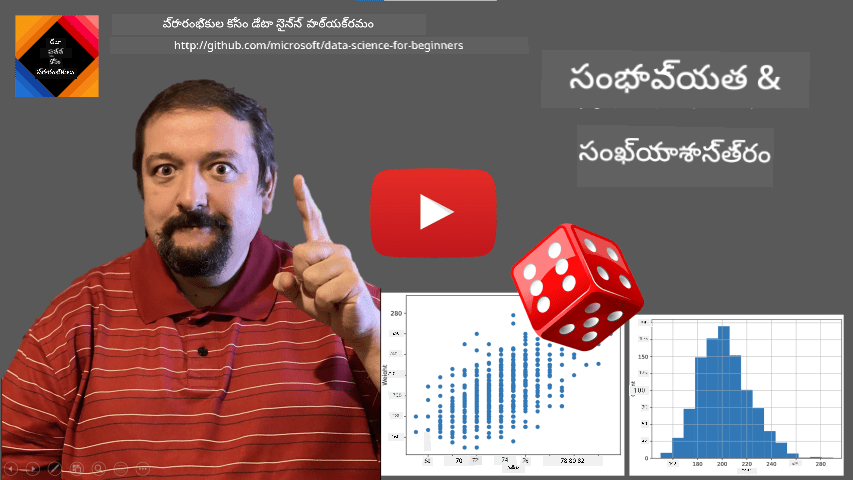
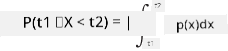
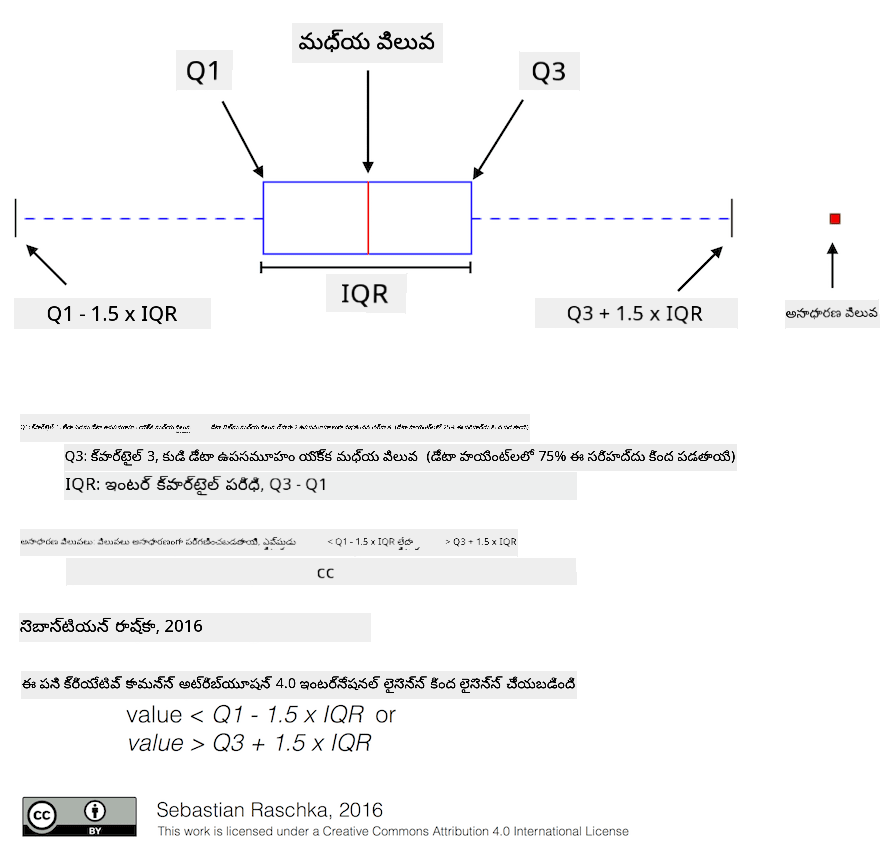
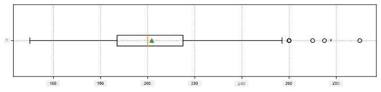
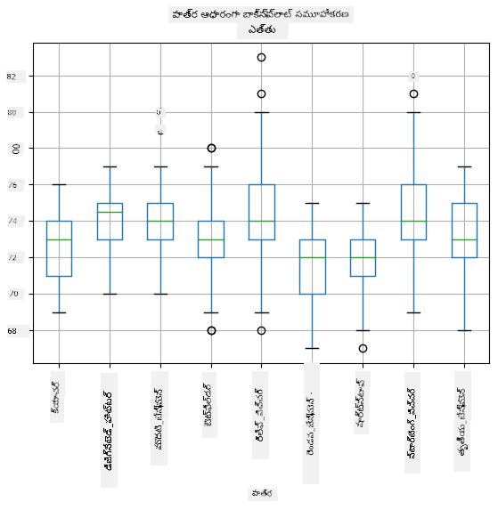
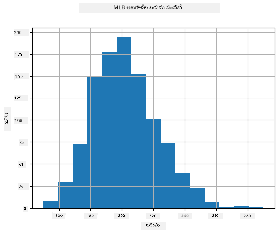
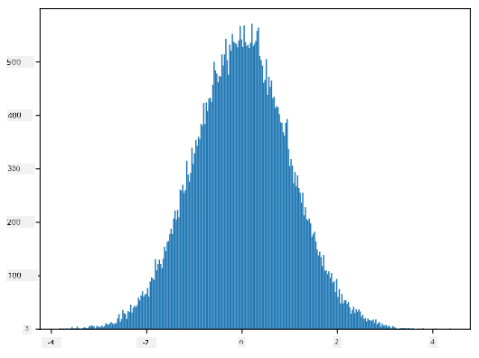
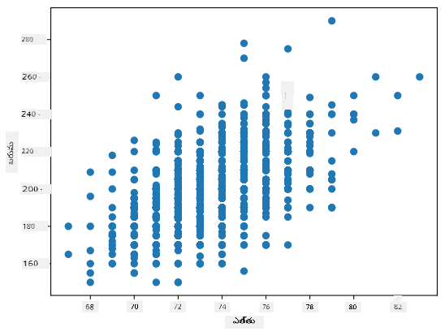

<!--
CO_OP_TRANSLATOR_METADATA:
{
  "original_hash": "ce95884566a74db72572cd51f0cb25ad",
  "translation_date": "2025-12-19T13:48:12+00:00",
  "source_file": "1-Introduction/04-stats-and-probability/README.md",
  "language_code": "te"
}
-->
# గణాంకాలు మరియు సంభావ్యతకు సంక్షిప్త పరిచయం

| ద్వారా ](../../sketchnotes/04-Statistics-Probability.png)|
|:---:|
| గణాంకాలు మరియు సంభావ్యత - _స్కెచ్ నోట్ [@nitya](https://twitter.com/nitya) ద్వారా_ |

గణాంకాలు మరియు సంభావ్యత సిద్ధాంతం గణితశాస్త్రంలోని రెండు అత్యంత సంబంధిత విభాగాలు, ఇవి డేటా సైన్స్‌కు చాలా సంబంధం కలిగి ఉంటాయి. గణితంపై లోతైన జ్ఞానం లేకుండా కూడా డేటాతో పని చేయవచ్చు, కానీ కనీసం కొన్ని ప్రాథమిక భావనలను తెలుసుకోవడం మంచిది. ఇక్కడ మేము మీకు ప్రారంభం కావడానికి సహాయపడే సంక్షిప్త పరిచయాన్ని అందిస్తాము.

[](https://youtu.be/Z5Zy85g4Yjw)


## [పాఠం ముందు క్విజ్](https://ff-quizzes.netlify.app/en/ds/quiz/6)

## సంభావ్యత మరియు యాదృచ్ఛిక చరాలు

**సంభావ్యత** అనేది 0 మరియు 1 మధ్య ఉన్న ఒక సంఖ్య, ఇది ఒక **ఈవెంట్** సంభవించే అవకాశాన్ని వ్యక్తం చేస్తుంది. ఇది ఈవెంట్‌కు దారితీసే సానుకూల ఫలితాల సంఖ్యను, మొత్తం ఫలితాల సంఖ్యతో భాగించి నిర్వచించబడుతుంది, అన్ని ఫలితాలు సమానంగా సంభావ్యమని తీసుకుంటే. ఉదాహరణకు, ఒక డైను త్రో చేసినప్పుడు, సమ సంఖ్య వచ్చే సంభావ్యత 3/6 = 0.5.

ఈవెంట్ల గురించి మాట్లాడేటప్పుడు, మేము **యాదృచ్ఛిక చరాలు** ఉపయోగిస్తాము. ఉదాహరణకు, డై త్రో చేసినప్పుడు వచ్చిన సంఖ్యను సూచించే యాదృచ్ఛిక చరము 1 నుండి 6 వరకు విలువలు తీసుకుంటుంది. 1 నుండి 6 వరకు ఉన్న సంఖ్యల సమూహాన్ని **నమూనా స్థలం** అంటారు. ఒక యాదృచ్ఛిక చరము ఒక నిర్దిష్ట విలువ తీసుకునే సంభావ్యత గురించి మాట్లాడవచ్చు, ఉదాహరణకు P(X=3)=1/6.

ముందటి ఉదాహరణలో యాదృచ్ఛిక చరము **విభిన్న** అని పిలవబడుతుంది, ఎందుకంటే దానికి లెక్కించదగిన నమూనా స్థలం ఉంటుంది, అంటే వేర్వేరు విలువలు ఉంటాయి. కొన్ని సందర్భాల్లో నమూనా స్థలం నిజ సంఖ్యల పరిధి లేదా మొత్తం నిజ సంఖ్యల సమూహం కావచ్చు. అలాంటి చరాలు **అనంతర** అని పిలవబడతాయి. బస్సు వచ్చే సమయం మంచి ఉదాహరణ.

## సంభావ్యత పంపిణీ

విభిన్న యాదృచ్ఛిక చరాల సందర్భంలో, ప్రతి ఈవెంట్ యొక్క సంభావ్యతను P(X) అనే ఫంక్షన్ ద్వారా సులభంగా వివరించవచ్చు. నమూనా స్థలం *S* నుండి ప్రతి విలువ *s* కు 0 నుండి 1 మధ్య ఒక సంఖ్య ఇస్తుంది, అన్ని ఈవెంట్లకు P(X=s) విలువల మొత్తం 1 అవుతుంది.

అత్యంత ప్రసిద్ధ విభిన్న పంపిణీ **సమాన పంపిణీ** (uniform distribution), ఇందులో N అంశాల నమూనా స్థలం ఉంటుంది, ప్రతి అంశానికి 1/N సమాన సంభావ్యత ఉంటుంది.

అనంతర చరాల సంభావ్యత పంపిణీని వివరించడం కష్టం, వీటి విలువలు [a,b] మధ్య లేదా మొత్తం నిజ సంఖ్యల సమూహం నుండి తీసుకోబడతాయి. బస్సు వచ్చే సమయాన్ని పరిగణించండి. నిజానికి, ప్రతి ఖచ్చితమైన వచ్చే సమయం *t* కోసం, ఆ సమయానికి బస్సు రావడం సంభావ్యత 0!

> ఇప్పుడు మీరు తెలుసుకున్నారు, 0 సంభావ్యత ఉన్న ఈవెంట్లు జరుగుతాయి, మరియు చాలా సార్లు! కనీసం ప్రతి సారి బస్సు వచ్చినప్పుడు!

మేము ఒక విలువ ఇచ్చిన పరిధిలో పడే సంభావ్యత గురించి మాత్రమే మాట్లాడవచ్చు, ఉదా. P(t<sub>1</sub>&le;X&lt;t<sub>2</sub>). ఈ సందర్భంలో, సంభావ్యత పంపిణీని **సంభావ్యత సాంద్రత ఫంక్షన్** p(x) ద్వారా వివరించవచ్చు, అలా


  
సమాన పంపిణీకి అనురూపమైన అనంతర పంపిణీని **అనంతర సమాన పంపిణీ** అంటారు, ఇది ఒక పరిమిత పరిధిలో నిర్వచించబడుతుంది. విలువ X ఒక l పొడవు ఉన్న పరిధిలో పడే సంభావ్యత l కు అనుపాతంగా ఉంటుంది, మరియు 1 వరకు పెరుగుతుంది.

మరొక ముఖ్యమైన పంపిణీ **సాధారణ పంపిణీ** (normal distribution), దీని గురించి మేము క్రింద మరింత వివరంగా మాట్లాడతాము.

## సగటు, వ్యత్యాసం మరియు ప్రమాణ విభిన్నత

ఒక యాదృచ్ఛిక చరము X యొక్క n నమూనాల శ్రేణి తీసుకుందాం: x<sub>1</sub>, x<sub>2</sub>, ..., x<sub>n</sub>. సాంప్రదాయ పద్ధతిలో **సగటు** (లేదా **గణిత సగటు**) విలువను (x<sub>1</sub>+x<sub>2</sub>+...+x<sub>n</sub>)/n గా నిర్వచించవచ్చు. నమూనా పరిమాణం పెరిగినప్పుడు (అంటే n&rarr;&infin;) పంపిణీ యొక్క సగటు (లేదా **ఆశ** (expectation)) లభిస్తుంది. ఆశను **E**(x) గా సూచిస్తాము.

> ఏదైనా విభిన్న పంపిణీకి విలువలు {x<sub>1</sub>, x<sub>2</sub>, ..., x<sub>N</sub>} మరియు సంభావ్యతలు p<sub>1</sub>, p<sub>2</sub>, ..., p<sub>N</sub> ఉంటే, ఆశ E(X)=x<sub>1</sub>p<sub>1</sub>+x<sub>2</sub>p<sub>2</sub>+...+x<sub>N</sub>p<sub>N</sub> అని నిరూపించవచ్చు.

విలువలు ఎంత దూరంగా వ్యాప్తి చెందాయో తెలుసుకోవడానికి, వ్యత్యాసం &sigma;<sup>2</sup> = &sum;(x<sub>i</sub> - &mu;)<sup>2</sup>/n ను లెక్కించవచ్చు, ఇక్కడ &mu; అనేది సగటు. &sigma; ను **ప్రమాణ విభిన్నత** (standard deviation) అంటారు, &sigma;<sup>2</sup> ను **వ్యత్యాసం** (variance) అంటారు.

## మోడ్, మాధ్యమం మరియు క్వార్టైల్‌లు

కొన్నిసార్లు, సగటు డేటాకు "సాధారణ" విలువను సరైన రీతిలో సూచించదు. ఉదాహరణకు, కొన్ని అత్యంత విలువలు సగటుపై ప్రభావం చూపవచ్చు. మరో మంచి సూచిక **మాధ్యమం** (median), ఇది అర్థం డేటా పాయింట్లు దాని కంటే తక్కువగా ఉంటాయి, మిగతా అర్థం ఎక్కువగా ఉంటాయి.

డేటా పంపిణీని అర్థం చేసుకోవడానికి, **క్వార్టైల్‌లు** గురించి మాట్లాడటం ఉపయోగకరం:

* మొదటి క్వార్టైల్, లేదా Q1, అంటే 25% డేటా దాని కంటే తక్కువగా ఉంటుంది
* మూడవ క్వార్టైల్, లేదా Q3, అంటే 75% డేటా దాని కంటే తక్కువగా ఉంటుంది

గ్రాఫికల్‌గా మాధ్యమం మరియు క్వార్టైల్‌ల సంబంధాన్ని **బాక్స్ ప్లాట్** అనే చిత్రంలో చూపవచ్చు:



ఇక్కడ మేము **ఇంటర్-క్వార్టైల్ పరిధి** IQR=Q3-Q1 ను లెక్కిస్తాము, మరియు **అత్యధిక విలువలు** (outliers) - [Q1-1.5*IQR,Q3+1.5*IQR] పరిధికి వెలుపల ఉన్న విలువలు.

చిన్న సంఖ్యలో విలువలు ఉన్న పరిమిత పంపిణీకి, ఎక్కువ సార్లు కనిపించే విలువను **మోడ్** అంటారు. ఇది తరచుగా వర్గీకృత డేటాకు వర్తిస్తుంది, ఉదా. రంగులు. ఉదాహరణకు, రెండు గుంపుల ప్రజలు ఉన్నారు - కొంతమంది ఎరుపు రంగును ఇష్టపడతారు, మరికొందరు నీలం రంగును. రంగులను సంఖ్యలతో కోడ్ చేస్తే, ఇష్టమైన రంగు సగటు విలువ ఆరెంజ్-గ్రీన్ మధ్యలో ఉంటుంది, ఇది ఏ గుంపు ఇష్టాన్ని సూచించదు. కానీ మోడ్ ఆ రంగులలో ఒకటి లేదా రెండూ కావచ్చు, ప్రజల ఓట్ల సంఖ్య సమానమైతే (ఈ సందర్భంలో నమూనాను **బహుముఖ** (multimodal) అంటారు).
## వాస్తవ ప్రపంచ డేటా

వాస్తవ జీవిత డేటాను విశ్లేషించినప్పుడు, అవి యాదృచ్ఛిక చరాలు కాకపోవచ్చు, అంటే ఫలితం తెలియని ప్రయోగాలు చేయడం కాదు. ఉదాహరణకు, బేస్‌బాల్ ఆటగాళ్ల బృందం మరియు వారి శరీర డేటా, ఉదా. ఎత్తు, బరువు, వయస్సు. ఆ సంఖ్యలు ఖచ్చితంగా యాదృచ్ఛికం కావు, కానీ అదే గణిత భావనలను వర్తింపజేయవచ్చు. ఉదాహరణకు, వ్యక్తుల బరువుల శ్రేణిని ఒక యాదృచ్ఛిక చరము నుండి తీసుకున్న విలువల శ్రేణిగా పరిగణించవచ్చు. క్రింద [మేజర్ లీగ్ బేస్‌బాల్](http://mlb.mlb.com/index.jsp) నుండి తీసుకున్న నిజమైన ఆటగాళ్ల బరువుల శ్రేణి ఉంది, [ఈ డేటాసెట్](http://wiki.stat.ucla.edu/socr/index.php/SOCR_Data_MLB_HeightsWeights) నుండి (సౌకర్యార్థం, మొదటి 20 విలువలు మాత్రమే చూపబడినవి):

```
[180.0, 215.0, 210.0, 210.0, 188.0, 176.0, 209.0, 200.0, 231.0, 180.0, 188.0, 180.0, 185.0, 160.0, 180.0, 185.0, 197.0, 189.0, 185.0, 219.0]
```

> **గమనిక**: ఈ డేటాసెట్‌తో పని చేసే ఉదాహరణ చూడాలంటే, [సహాయక నోట్బుక్](notebook.ipynb) చూడండి. ఈ పాఠంలో చాల సవాళ్లు ఉన్నాయి, వాటిని ఆ నోట్బుక్‌లో కోడ్ జోడించి పూర్తి చేయవచ్చు. డేటాతో ఎలా పని చేయాలో తెలియకపోతే, భయపడకండి - తర్వాతి సమయంలో Python ఉపయోగించి డేటాతో పని చేయడం మళ్ళీ నేర్చుకుంటాము. Jupyter Notebookలో కోడ్ ఎలా నడిపించాలో తెలియకపోతే, [ఈ వ్యాసం](https://soshnikov.com/education/how-to-execute-notebooks-from-github/) చూడండి.

ఇది మా డేటా కోసం సగటు, మాధ్యమం మరియు క్వార్టైల్‌లను చూపించే బాక్స్ ప్లాట్:



మా డేటాలో వేర్వేరు ఆటగాళ్ల **పాత్రలు** గురించి సమాచారం ఉన్నందున, పాత్రల వారీగా బాక్స్ ప్లాట్ కూడా చేయవచ్చు - ఇది పాత్రల మధ్య పరిమాణాల విలువలు ఎలా భిన్నమవుతాయో అర్థం చేసుకోవడానికి సహాయపడుతుంది. ఈసారి మేము ఎత్తును పరిగణిస్తాము:



ఈ చిత్రణ సూచిస్తుంది, సగటున మొదటి బేస్‌మెన్ ఎత్తు రెండవ బేస్‌మెన్ కంటే ఎక్కువ. ఈ పాఠంలో తర్వాత మేము ఈ హైపోథిసిస్‌ను మరింత అధికారికంగా పరీక్షించడం మరియు మా డేటా గణాంకపరంగా ప్రామాణికమని చూపడం నేర్చుకుంటాము.

> వాస్తవ ప్రపంచ డేటాతో పని చేసే సమయంలో, అన్ని డేటా పాయింట్లు కొన్ని సంభావ్యత పంపిణీ నుండి తీసుకున్న నమూనాలు అని భావిస్తాము. ఈ భావన మాకు మెషీన్ లెర్నింగ్ సాంకేతికతలను వర్తింపజేసి పనిచేసే ముందస్తు నమూనాలను నిర్మించడానికి అనుమతిస్తుంది.

మా డేటా పంపిణీని చూడటానికి, మేము **హిస్టోగ్రామ్** అనే గ్రాఫ్‌ను చిత్రించవచ్చు. X-అక్షంలో వివిధ బరువు పరిధులు (అంటే **బిన్లు**) ఉంటాయి, మరియు నిలువు అక్షం ఆ పరిధిలో మా యాదృచ్ఛిక చరము నమూనా ఉన్న సార్లు చూపిస్తుంది.



ఈ హిస్టోగ్రామ్ నుండి మీరు చూడవచ్చు అన్ని విలువలు ఒక నిర్దిష్ట సగటు బరువు చుట్టూ కేంద్రీకృతమై ఉన్నాయి, మరియు ఆ బరువునుండి దూరంగా పోతే ఆ బరువుల సంఖ్య తక్కువగా ఉంటుంది. అంటే, బేస్‌బాల్ ఆటగాడి బరువు సగటు బరువుతో చాలా భిన్నంగా ఉండటం చాలా అసంభావ్యం. బరువుల వ్యత్యాసం సగటు నుండి బరువులు ఎంత భిన్నంగా ఉండవచ్చో చూపిస్తుంది.

> ఇతర వ్యక్తుల బరువులు తీసుకుంటే, బేస్‌బాల్ లీగ్ కాకుండా, పంపిణీ భిన్నంగా ఉండవచ్చు. అయితే, పంపిణీ ఆకారం అదే ఉంటుంది, కానీ సగటు మరియు వ్యత్యాసం మారతాయి. కాబట్టి, మా నమూనాను బేస్‌బాల్ ఆటగాళ్లపై శిక్షణ ఇస్తే, అది విశ్వవిద్యాలయ విద్యార్థులపై వర్తింపజేస్తే తప్పు ఫలితాలు ఇవ్వవచ్చు, ఎందుకంటే ప్రాథమిక పంపిణీ భిన్నంగా ఉంటుంది.
## సాధారణ పంపిణీ

ముందు చూచిన బరువుల పంపిణీ చాలా సాధారణం, మరియు వాస్తవ ప్రపంచం నుండి చాలా కొలతలు అదే రకమైన పంపిణీని అనుసరిస్తాయి, కానీ వేర్వేరు సగటు మరియు వ్యత్యాసంతో. ఈ పంపిణీని **సాధారణ పంపిణీ** అంటారు, ఇది గణాంకాలలో చాలా ముఖ్యమైన పాత్ర పోషిస్తుంది.

సాధారణ పంపిణీ ఉపయోగించి, భవిష్యత్తు బేస్‌బాల్ ఆటగాళ్ల యాదృచ్ఛిక బరువులను సృష్టించడం సరైన మార్గం. ఒకసారి మేము సగటు బరువు `mean` మరియు ప్రమాణ విభిన్నత `std` తెలుసుకున్నాక, 1000 బరువు నమూనాలను క్రింది విధంగా సృష్టించవచ్చు:
```python
samples = np.random.normal(mean,std,1000)
``` 

సృష్టించిన నమూనాల హిస్టోగ్రామ్‌ను చిత్రిస్తే, పై చూపిన చిత్రానికి చాలా సమీపంగా ఉంటుంది. నమూనాల సంఖ్య మరియు బిన్ల సంఖ్య పెంచితే, మేము సిద్దాంతానికి మరింత దగ్గరగా ఉన్న సాధారణ పంపిణీ చిత్రాన్ని సృష్టించవచ్చు:



*సగటు=0 మరియు ప్రమాణ విభిన్నత=1 ఉన్న సాధారణ పంపిణీ*

## విశ్వాస అంతరాలు

బేస్‌బాల్ ఆటగాళ్ల బరువుల గురించి మాట్లాడేటప్పుడు, ఒక నిర్దిష్ట **యాదృచ్ఛిక చరము W** ఉందని భావిస్తాము, ఇది అన్ని బేస్‌బాల్ ఆటగాళ్ల బరువుల ఆదర్శ సంభావ్యత పంపిణీకి అనుగుణంగా ఉంటుంది (అంటే **జనాభా**). మా బరువుల శ్రేణి జనాభాలోని ఒక ఉపసమూహం, అంటే **నమూనా**. ఆసక్తికరమైన ప్రశ్న ఏమిటంటే, W పంపిణీ యొక్క పరిమాణాలు, అంటే జనాభా సగటు మరియు వ్యత్యాసం తెలుసుకోవచ్చా?

సులభమైన సమాధానం మా నమూనా సగటు మరియు వ్యత్యాసం లెక్కించడం. అయితే, మా యాదృచ్ఛిక నమూనా పూర్తి జనాభాను సరిగ్గా ప్రతిబింబించకపోవచ్చు. కాబట్టి **విశ్వాస అంతరం** గురించి మాట్లాడటం అర్థం.

> **విశ్వాస అంతరం** అనేది మా నమూనా ఆధారంగా జనాభా నిజమైన సగటును అంచనా వేయడం, ఇది ఒక నిర్దిష్ట సంభావ్యత (లేదా **విశ్వాస స్థాయి**)తో ఖచ్చితంగా ఉంటుంది.

మా పంపిణీ నుండి X<sub>1</sub>, ..., X<sub>n</sub> నమూనాలు ఉన్నాయని భావిద్దాం. ప్రతి సారి నమూనా తీసుకున్నప్పుడు, వేరే సగటు విలువ &mu; వస్తుంది. కాబట్టి &mu; ఒక యాదృచ్ఛిక చరము అని పరిగణించవచ్చు. విశ్వాస p ఉన్న విశ్వాస అంతరం (L<sub>p</sub>,R<sub>p</sub>) అని పిలవబడుతుంది, ఇది **P**(L<sub>p</sub>&leq;&mu;&leq;R<sub>p</sub>) = p, అంటే కొలిచిన సగటు విలువ ఆ పరిధిలో పడే సంభావ్యత p.

ఈ విశ్వాస అంతరాలు ఎలా లెక్కించబడతాయో మా సంక్షిప్త పరిచయంలో చర్చించడం కష్టం. మరిన్ని వివరాలు [వికీపీడియాలో](https://en.wikipedia.org/wiki/Confidence_interval) చూడవచ్చు. సంక్షిప్తంగా, మేము నమూనా సగటు పంపిణీని జనాభా నిజమైన సగటుతో సంబంధించి నిర్వచిస్తాము, దీనిని **స్టూడెంట్ పంపిణీ** అంటారు.
> **ఆసక్తికరమైన వాస్తవం**: స్టూడెంట్ పంపిణీని గణిత శాస్త్రజ్ఞుడు విలియం సీలీ గోసెట్ పేరుతో పిలుస్తారు, అతను తన పత్రాన్ని "స్టూడెంట్" అనే పర్యాయ నామంతో ప్రచురించాడు. అతను గిన్నెస్ బ్రూయరీలో పని చేశాడు, మరియు ఒక సంస్కరణ ప్రకారం, అతని ఉద్యోగదారు వారు ముడి పదార్థాల నాణ్యతను నిర్ణయించడానికి గణాంక పరీక్షలను ఉపయోగిస్తున్నారని సాధారణ ప్రజలకు తెలియకుండా ఉండాలని కోరుకున్నారు.

మనం మన జనాభా సగటు &mu; ను విశ్వాసం p తో అంచనా వేయాలనుకుంటే, మనం స్టూడెంట్ పంపిణీ A యొక్క *(1-p)/2-వ శాతం స్థానాన్ని* తీసుకోవాలి, ఇది పట్టికల నుండి తీసుకోవచ్చు లేదా గణాంక సాఫ్ట్‌వేర్ (ఉదా. Python, R, మొదలైనవి) లోని కొన్ని బిల్ట్-ఇన్ ఫంక్షన్లను ఉపయోగించి కంప్యూట్ చేయవచ్చు. ఆపై &mu; కోసం అంతరం X&pm;A*D/&radic;n గా ఇవ్వబడుతుంది, ఇక్కడ X నమూనా నుండి పొందిన సగటు, D ప్రామాణిక వ్యత్యాసం.

> **గమనిక**: మేము [స్వేచ్ఛా డిగ్రీలు](https://en.wikipedia.org/wiki/Degrees_of_freedom_(statistics)) అనే ముఖ్యమైన భావన చర్చను కూడా వదిలివేస్తున్నాము, ఇది స్టూడెంట్ పంపిణీకి సంబంధించి ముఖ్యమైనది. మీరు ఈ భావనను లోతుగా అర్థం చేసుకోవడానికి గణాంకాలపై మరింత పూర్తి పుస్తకాలను చూడవచ్చు.

బరువు మరియు ఎత్తుల విశ్వాస అంతరాన్ని లెక్కించే ఉదాహరణ [సహాయక నోట్బుక్స్](notebook.ipynb) లో ఇవ్వబడింది.

| p | బరువు సగటు |
|-----|-----------|
| 0.85 | 201.73±0.94 |
| 0.90 | 201.73±1.08 |
| 0.95 | 201.73±1.28 |

గమనించండి, విశ్వాసం అవకాశము ఎక్కువైతే, విశ్వాస అంతరం కూడా విస్తృతంగా ఉంటుంది.

## హైపోథిసిస్ పరీక్ష

మన బేస్‌బాల్ ఆటగాళ్ల డేటాసెట్‌లో, వివిధ ఆటగాడు పాత్రలు ఉన్నాయి, అవి క్రింద సారాంశం చేయబడినవి ([సహాయక నోట్బుక్](notebook.ipynb) లో ఈ పట్టిక ఎలా లెక్కించాలో చూడండి):

| పాత్ర | ఎత్తు | బరువు | సంఖ్య |
|------|--------|--------|-------|
| క్యాచర్ | 72.723684 | 204.328947 | 76 |
| డిజైనేటెడ్_హిట్టర్ | 74.222222 | 220.888889 | 18 |
| ఫస్ట్_బేస్మన్ | 74.000000 | 213.109091 | 55 |
| అవుట్‌ఫీల్డర్ | 73.010309 | 199.113402 | 194 |
| రిలీఫ్_పిచ్చర్ | 74.374603 | 203.517460 | 315 |
| సెకండ్_బేస్మన్ | 71.362069 | 184.344828 | 58 |
| షార్ట్‌స్టాప్ | 71.903846 | 182.923077 | 52 |
| స్టార్టింగ్_పిచ్చర్ | 74.719457 | 205.163636 | 221 |
| థర్డ్_బేస్మన్ | 73.044444 | 200.955556 | 45 |

మనం గమనించవచ్చు, ఫస్ట్ బేస్మన్‌ల సగటు ఎత్తు సెకండ్ బేస్మన్‌ల కంటే ఎక్కువగా ఉంది. కాబట్టి, మనం ఈ నిర్ణయానికి రావచ్చు: **ఫస్ట్ బేస్మన్‌లు సెకండ్ బేస్మన్‌ల కంటే ఎత్తుగా ఉంటారు**.

> ఈ ప్రకటనను **హైపోథిసిస్** అంటారు, ఎందుకంటే ఈ వాస్తవం నిజమో కాదో మనకు తెలియదు.

కానీ, ఈ నిర్ణయం ఎప్పుడూ స్పష్టంగా ఉండదు. పై చర్చ ప్రకారం ప్రతి సగటుకు ఒక విశ్వాస అంతరం ఉంటుంది, కాబట్టి ఈ తేడా గణాంక తప్పిదం మాత్రమే కావచ్చు. మన హైపోథిసిస్‌ను పరీక్షించడానికి మరింత అధికారిక మార్గం అవసరం.

మనం ఫస్ట్ మరియు సెకండ్ బేస్మన్‌ల ఎత్తుల కోసం విశ్వాస అంతరాలను వేర్వేరు లెక్కిద్దాం:

| విశ్వాసం | ఫస్ట్ బేస్మన్ | సెకండ్ బేస్మన్ |
|------------|---------------|----------------|
| 0.85 | 73.62..74.38 | 71.04..71.69 |
| 0.90 | 73.56..74.44 | 70.99..71.73 |
| 0.95 | 73.47..74.53 | 70.92..71.81 |

మనం చూడవచ్చు, ఎటువంటి విశ్వాసంలో ఈ అంతరాలు ఒకదానితో ఒకటి మిళితం కావు. ఇది మన హైపోథిసిస్‌ను నిరూపిస్తుంది, అంటే ఫస్ట్ బేస్మన్‌లు సెకండ్ బేస్మన్‌ల కంటే ఎత్తుగా ఉంటారు.

మరింత అధికారికంగా, మనం పరిష్కరించాల్సిన సమస్య ఏమిటంటే **రెండు ప్రాబబిలిటీ పంపిణీలు ఒకే విధంగా ఉన్నాయా లేదా కనీసం ఒకే పారామితులు కలిగి ఉన్నాయా అని చూడటం**. పంపిణీ ఆధారంగా, మనం వేర్వేరు పరీక్షలను ఉపయోగించాలి. మన పంపిణీలు సాధారణమైనవి అని తెలుసుకుంటే, మనం **[స్టూడెంట్ t-పరీక్ష](https://en.wikipedia.org/wiki/Student%27s_t-test)** ఉపయోగించవచ్చు.

స్టూడెంట్ t-పరీక్షలో, మనం **t-విలువ**ను లెక్కిస్తాము, ఇది సగటుల మధ్య తేడాను సూచిస్తుంది, వ్యత్యాసాన్ని పరిగణలోకి తీసుకుంటూ. ఇది t-విలువ స్టూడెంట్ పంపిణీని అనుసరిస్తుందని చూపించబడింది, ఇది మనకు ఇచ్చిన విశ్వాస స్థాయికి **p** త్రెషోల్డ్ విలువను అందిస్తుంది (ఇది లెక్కించవచ్చు లేదా సంఖ్యా పట్టికలలో చూడవచ్చు). ఆపై మనం t-విలువను ఈ త్రెషోల్డ్‌తో పోల్చి హైపోథిసిస్‌ను ఆమోదించవచ్చు లేదా తిరస్కరించవచ్చు.

Pythonలో, మనం **SciPy** ప్యాకేజీని ఉపయోగించవచ్చు, ఇది `ttest_ind` ఫంక్షన్‌ను కలిగి ఉంది (ఇతర అనేక ఉపయోగకర గణాంక ఫంక్షన్లతో పాటు!). ఇది మనకు t-విలువను లెక్కిస్తుంది, అలాగే విశ్వాస p-విలువ యొక్క రివర్స్ లుకప్ కూడా చేస్తుంది, కాబట్టి మనం కేవలం విశ్వాసాన్ని చూసి నిర్ణయం తీసుకోవచ్చు.

ఉదాహరణకు, ఫస్ట్ మరియు సెకండ్ బేస్మన్‌ల ఎత్తుల మధ్య మన తులన ఈ క్రింది ఫలితాలను ఇస్తుంది: 
```python
from scipy.stats import ttest_ind

tval, pval = ttest_ind(df.loc[df['Role']=='First_Baseman',['Height']], df.loc[df['Role']=='Designated_Hitter',['Height']],equal_var=False)
print(f"T-value = {tval[0]:.2f}\nP-value: {pval[0]}")
```
```
T-value = 7.65
P-value: 9.137321189738925e-12
```
మన సందర్భంలో, p-విలువ చాలా తక్కువగా ఉంది, అంటే ఫస్ట్ బేస్మన్‌లు ఎక్కువ ఎత్తుగా ఉన్నారని బలమైన సాక్ష్యం ఉంది.

మరియు మనం పరీక్షించదలచిన ఇతర హైపోథిసిస్‌లు కూడా ఉన్నాయి, ఉదా:
* ఒక నమూనా కొన్ని పంపిణీని అనుసరిస్తుందని నిరూపించడానికి. మన ఉదాహరణలో ఎత్తులు సాధారణ పంపిణీ అనుకుంటున్నాము, కానీ అది అధికారిక గణాంక ధృవీకరణ అవసరం.
* ఒక నమూనా సగటు విలువ కొన్ని ముందుగా నిర్వచించిన విలువకు సరిపోతుందని నిరూపించడానికి
* అనేక నమూనాల సగటులను పోల్చడానికి (ఉదా. వయస్సు వర్గాల మధ్య సంతోష స్థాయిల తేడా)

## పెద్ద సంఖ్యల చట్టం మరియు సెంట్రల్ లిమిట్ థియోరమ్

సాధారణ పంపిణీ ఎందుకు ముఖ్యమో ఒక కారణం **సెంట్రల్ లిమిట్ థియోరమ్**. మనకు N స్వతంత్ర విలువల పెద్ద నమూనా X<sub>1</sub>, ..., X<sub>N</sub> ఉందని ఊహించండి, ఇవి ఏదైనా పంపిణీ నుండి తీసుకున్నవి, సగటు &mu; మరియు వ్యత్యాసం &sigma;<sup>2</sup> కలిగి ఉంటాయి. ఆపై, సరిపడా పెద్ద N (మరియు అంటే N&rarr;&infin;) కోసం, సగటు &Sigma;<sub>i</sub>X<sub>i</sub> సాధారణ పంపిణీ అవుతుంది, సగటు &mu; మరియు వ్యత్యాసం &sigma;<sup>2</sup>/N తో.

> సెంట్రల్ లిమిట్ థియోరమ్‌ను మరో విధంగా అర్థం చేసుకోవచ్చు: పంపిణీ ఏదైనా ఉన్నా సరే, ఏదైనా యాదృచ్ఛిక వేరియబుల్ విలువల సమాహారం సగటును లెక్కించినప్పుడు అది సాధారణ పంపిణీ అవుతుంది.

సెంట్రల్ లిమిట్ థియోరమ్ నుండి ఇది కూడా తెలుస్తుంది, N&rarr;&infin; అయినప్పుడు, నమూనా సగటు &mu; కు సమానం అయ్యే అవకాశము 1 అవుతుంది. దీన్ని **పెద్ద సంఖ్యల చట్టం** అంటారు.

## కోవేరియన్స్ మరియు సహసంబంధం

డేటా సైన్స్ చేసే పనుల్లో ఒకటి డేటా మధ్య సంబంధాలను కనుగొనడం. మనం రెండు వరుసలు **సహసంబంధం** కలిగి ఉన్నాయని అంటాము, అవి ఒకే సమయంలో సమాన ప్రవర్తన చూపిస్తే, అంటే అవి ఒకేసారి పెరుగుతాయి/తగ్గుతాయి, లేదా ఒకటి పెరిగినప్పుడు మరొకటి తగ్గుతుంది. అంటే, రెండు వరుసల మధ్య సంబంధం ఉందని అనిపిస్తుంది.

> సహసంబంధం తప్పనిసరిగా కారణ సంబంధాన్ని సూచించదు; కొన్ని సందర్భాల్లో రెండు వేరియబుల్స్ ఒక బాహ్య కారణంపై ఆధారపడి ఉండవచ్చు, లేదా ఇది కేవలం సంయోగం కావచ్చు. అయినప్పటికీ, బలమైన గణిత సహసంబంధం రెండు వేరియబుల్స్ ఏదో విధంగా అనుసంధానమై ఉన్నాయని సూచిస్తుంది.

గణితంగా, రెండు యాదృచ్ఛిక వేరియబుల్స్ మధ్య సంబంధాన్ని చూపే ప్రధాన భావన **కోవేరియన్స్**, ఇది ఇలా లెక్కించబడుతుంది: Cov(X,Y) = **E**\[(X-**E**(X))(Y-**E**(Y))\]. మనం రెండు వేరియబుల్స్ వారి సగటు విలువల నుండి వ్యత్యాసాలను లెక్కించి, ఆ వ్యత్యాసాల గుణాకారాన్ని తీసుకుంటాము. రెండు వేరియబుల్స్ కలిసి వ్యత్యాసం చూపిస్తే, గుణాకారం ఎప్పుడూ సానుకూలం అవుతుంది, ఇది సానుకూల కోవేరియన్స్‌ను కలిగిస్తుంది. రెండు వేరియబుల్స్ సమకాలీనంగా వ్యత్యాసం చూపించకపోతే (ఉదా. ఒకటి సగటు కంటే తక్కువగా ఉండగా మరొకటి ఎక్కువగా ఉంటే), మనం ఎప్పుడూ ప్రతికూల సంఖ్యలను పొందుతాము, అవి ప్రతికూల కోవేరియన్స్‌ను కలిగిస్తాయి. వ్యత్యాసాలు పరస్పరం ఆధారపడకపోతే, అవి సుమారు సున్నా అవుతాయి.

కోవేరియన్స్ యొక్క పరమాణు విలువ మనకు సహసంబంధం ఎంత బలంగా ఉందో చెప్పదు, ఎందుకంటే అది అసలు విలువల పరిమాణంపై ఆధారపడి ఉంటుంది. దీన్ని సాధారణీకరించడానికి, మనం కోవేరియన్స్‌ను రెండు వేరియబుల్స్ యొక్క ప్రామాణిక వ్యత్యాసాల ద్వారా భాగిస్తాము, దీని ద్వారా **సహసంబంధం** వస్తుంది. మంచి విషయం ఏమిటంటే, సహసంబంధం ఎప్పుడూ [-1,1] పరిధిలో ఉంటుంది, ఇక్కడ 1 బలమైన సానుకూల సహసంబంధం, -1 బలమైన ప్రతికూల సహసంబంధం, 0 - ఎలాంటి సహసంబంధం లేదు (వేరియబుల్స్ స్వతంత్రంగా ఉంటాయి) అని సూచిస్తుంది.

**ఉదాహరణ**: పై పేర్కొన్న బేస్‌బాల్ ఆటగాళ్ల డేటాసెట్ నుండి బరువు మరియు ఎత్తుల మధ్య సహసంబంధం లెక్కించవచ్చు:
```python
print(np.corrcoef(weights,heights))
```
ఫలితంగా, మనకు ఈ విధమైన **సహసంబంధ మ్యాట్రిక్స్** వస్తుంది:
```
array([[1.        , 0.52959196],
       [0.52959196, 1.        ]])
```

> సహసంబంధ మ్యాట్రిక్స్ C ను ఎన్ని ఇన్‌పుట్ వరుసలు S<sub>1</sub>, ..., S<sub>n</sub> ఉన్నా లెక్కించవచ్చు. C<sub>ij</sub> విలువ S<sub>i</sub> మరియు S<sub>j</sub> మధ్య సహసంబంధం, మరియు డయాగనల్ మూలకాలు ఎప్పుడూ 1 (ఇది S<sub>i</sub> యొక్క స్వీయ సహసంబంధం).

మన సందర్భంలో, 0.53 విలువ వ్యక్తి బరువు మరియు ఎత్తు మధ్య కొంత సహసంబంధం ఉందని సూచిస్తుంది. మనం ఒక విలువను మరొకదానిపై స్కాటర్ ప్లాట్ కూడా చేయవచ్చు సంబంధాన్ని దృశ్యంగా చూడటానికి:



> సహసంబంధం మరియు కోవేరియన్స్ పై మరిన్ని ఉదాహరణలు [సహాయక నోట్బుక్](notebook.ipynb) లో చూడవచ్చు.

## ముగింపు

ఈ విభాగంలో, మనం నేర్చుకున్నాం:

* డేటా యొక్క ప్రాథమిక గణాంక లక్షణాలు, ఉదా. సగటు, వ్యత్యాసం, మోడ్ మరియు క్వార్టైల్‌లు
* యాదృచ్ఛిక వేరియబుల్స్ యొక్క వివిధ పంపిణీలు, సహా సాధారణ పంపిణీ
* వివిధ లక్షణాల మధ్య సహసంబంధం ఎలా కనుగొనాలో
* గణితం మరియు గణాంకాల సరైన పరికరాలను ఉపయోగించి కొన్ని హైపోథిసిస్‌లను ఎలా నిరూపించాలో
* డేటా నమూనా ఇచ్చిన యాదృచ్ఛిక వేరియబుల్ కోసం విశ్వాస అంతరాలను ఎలా లెక్కించాలో

ఇవి ప్రాబబిలిటీ మరియు గణాంకాలలో ఉన్న అంశాల పూర్తి జాబితా కాదు, కానీ ఈ కోర్సులో మంచి ప్రారంభం ఇవ్వడానికి సరిపోతుంది.

## 🚀 సవాలు

నోట్బుక్‌లోని నమూనా కోడ్ ఉపయోగించి ఈ ఇతర హైపోథిసిస్‌లను పరీక్షించండి: 
1. ఫస్ట్ బేస్మన్‌లు సెకండ్ బేస్మన్‌ల కంటే వయసు ఎక్కువవారు
2. ఫస్ట్ బేస్మన్‌లు థర్డ్ బేస్మన్‌ల కంటే ఎత్తుగా ఉంటారు
3. షార్ట్‌స్టాప్‌లు సెకండ్ బేస్మన్‌ల కంటే ఎత్తుగా ఉంటారు

## [పోస్ట్-లెక్చర్ క్విజ్](https://ff-quizzes.netlify.app/en/ds/quiz/7)

## సమీక్ష & స్వీయ అధ్యయనం

ప్రాబబిలిటీ మరియు గణాంకాలు చాలా విస్తృతమైన విషయం, కాబట్టి దీనికి ప్రత్యేక కోర్సు అవసరం. మీరు సిద్ధాంతంలో లోతుగా వెళ్లాలనుకుంటే, క్రింది పుస్తకాలను చదవడం కొనసాగించవచ్చు:

1. న్యూయార్క్ యూనివర్సిటీ నుండి [Carlos Fernandez-Granda](https://cims.nyu.edu/~cfgranda/) గారి గొప్ప లెక్చర్ నోట్స్ [Probability and Statistics for Data Science](https://cims.nyu.edu/~cfgranda/pages/stuff/probability_stats_for_DS.pdf) (ఆన్‌లైన్‌లో అందుబాటులో)
1. [Peter and Andrew Bruce. Practical Statistics for Data Scientists.](https://www.oreilly.com/library/view/practical-statistics-for/9781491952955/) [[R లో నమూనా కోడ్](https://github.com/andrewgbruce/statistics-for-data-scientists)].
1. [James D. Miller. Statistics for Data Science](https://www.packtpub.com/product/statistics-for-data-science/9781788290678) [[R లో నమూనా కోడ్](https://github.com/PacktPublishing/Statistics-for-Data-Science)]

## అసైన్‌మెంట్

[చిన్న డయాబెటిస్ అధ్యయనం](assignment.md)

## క్రెడిట్స్

ఈ పాఠం ♥️ తో [Dmitry Soshnikov](http://soshnikov.com) రచించారు.

---

<!-- CO-OP TRANSLATOR DISCLAIMER START -->
**అస్పష్టత**:  
ఈ పత్రాన్ని AI అనువాద సేవ [Co-op Translator](https://github.com/Azure/co-op-translator) ఉపయోగించి అనువదించబడింది. మేము ఖచ్చితత్వానికి ప్రయత్నించినప్పటికీ, ఆటోమేటెడ్ అనువాదాల్లో పొరపాట్లు లేదా తప్పిదాలు ఉండవచ్చు. అసలు పత్రం దాని స్వదేశీ భాషలోనే అధికారిక మూలంగా పరిగణించాలి. ముఖ్యమైన సమాచారానికి, ప్రొఫెషనల్ మానవ అనువాదం సిఫార్సు చేయబడుతుంది. ఈ అనువాదం వాడకంలో ఏర్పడిన ఏవైనా అపార్థాలు లేదా తప్పుదారుల కోసం మేము బాధ్యత వహించము.
<!-- CO-OP TRANSLATOR DISCLAIMER END -->