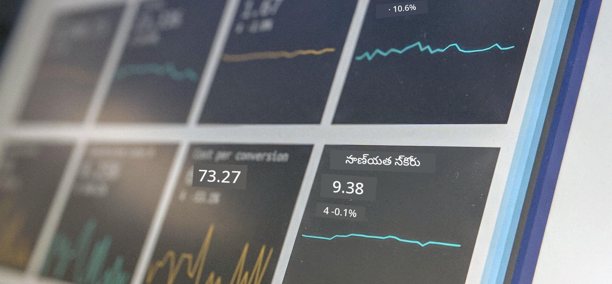

<!--
CO_OP_TRANSLATOR_METADATA:
{
  "original_hash": "696a8474a01054281704cbfb09148949",
  "translation_date": "2025-12-19T13:22:49+00:00",
  "source_file": "1-Introduction/README.md",
  "language_code": "te"
}
-->
# డేటా సైన్స్ పరిచయం

> ఫోటో <a href="https://unsplash.com/@dawson2406?utm_source=unsplash&utm_medium=referral&utm_content=creditCopyText">స్టీఫెన్ డాసన్</a> ద్వారా <a href="https://unsplash.com/s/photos/data?utm_source=unsplash&utm_medium=referral&utm_content=creditCopyText">అన్స్ప్లాష్</a>లో
  
ఈ పాఠాలలో, మీరు డేటా సైన్స్ ఎలా నిర్వచించబడిందో తెలుసుకుంటారు మరియు డేటా శాస్త్రవేత్తలు పరిగణించవలసిన నైతిక అంశాలను తెలుసుకుంటారు. మీరు డేటా ఎలా నిర్వచించబడిందో తెలుసుకుంటారు మరియు డేటా సైన్స్ యొక్క ప్రాథమిక అకాడమిక్ విభాగాలు అయిన గణాంకాలు మరియు సంభావ్యత గురించి కొంత తెలుసుకుంటారు.

### విషయాలు

1. [డేటా సైన్స్ నిర్వచనం](01-defining-data-science/README.md)
2. [డేటా సైన్స్ నైతికత](02-ethics/README.md)
3. [డేటా నిర్వచనం](03-defining-data/README.md)
4. [గణాంకాలు మరియు సంభావ్యత పరిచయం](04-stats-and-probability/README.md)

### క్రెడిట్స్

ఈ పాఠాలు ❤️ తో [నిత్య నరసింహన్](https://twitter.com/nitya) మరియు [డ్మిత్రి సోష్నికోవ్](https://twitter.com/shwars) రాసారు.

---

<!-- CO-OP TRANSLATOR DISCLAIMER START -->
**అస్పష్టత**:  
ఈ పత్రాన్ని AI అనువాద సేవ [Co-op Translator](https://github.com/Azure/co-op-translator) ఉపయోగించి అనువదించబడింది. మేము ఖచ్చితత్వానికి ప్రయత్నించినప్పటికీ, ఆటోమేటెడ్ అనువాదాల్లో పొరపాట్లు లేదా తప్పిదాలు ఉండవచ్చు. అసలు పత్రం దాని స్వదేశీ భాషలోనే అధికారిక మూలంగా పరిగణించాలి. ముఖ్యమైన సమాచారానికి, ప్రొఫెషనల్ మానవ అనువాదం సిఫార్సు చేయబడుతుంది. ఈ అనువాదం వాడకంలో ఏర్పడిన ఏవైనా అపార్థాలు లేదా తప్పుదారుల కోసం మేము బాధ్యత వహించము.
<!-- CO-OP TRANSLATOR DISCLAIMER END -->