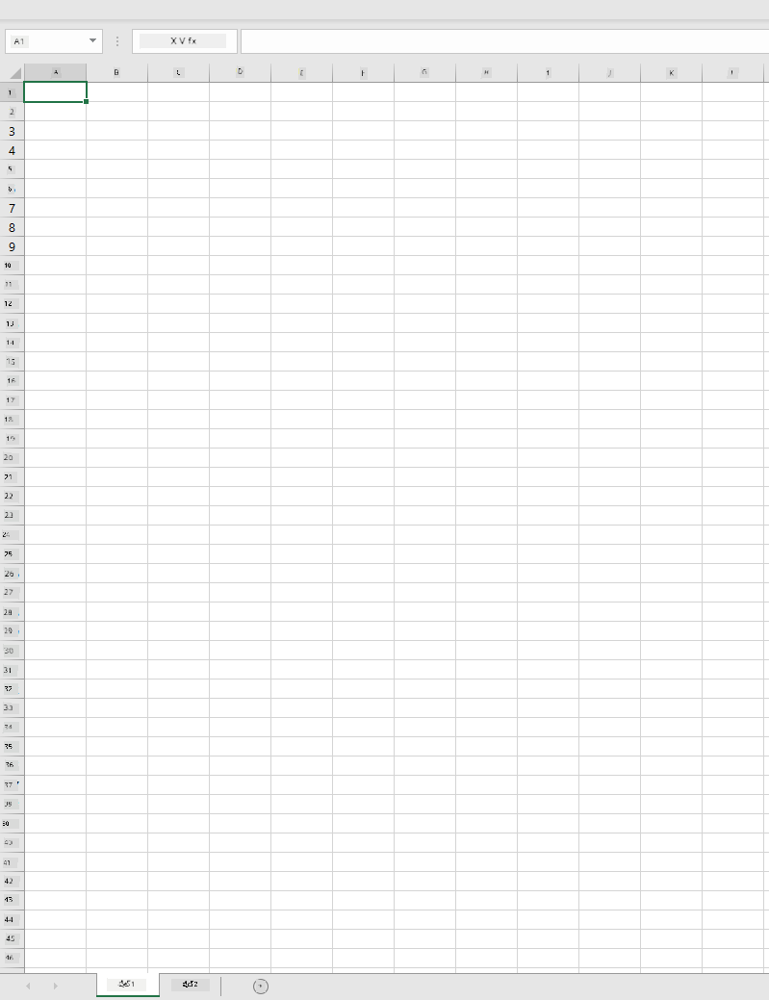
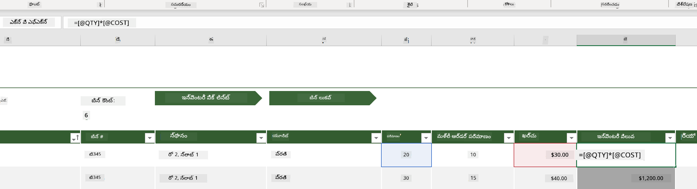
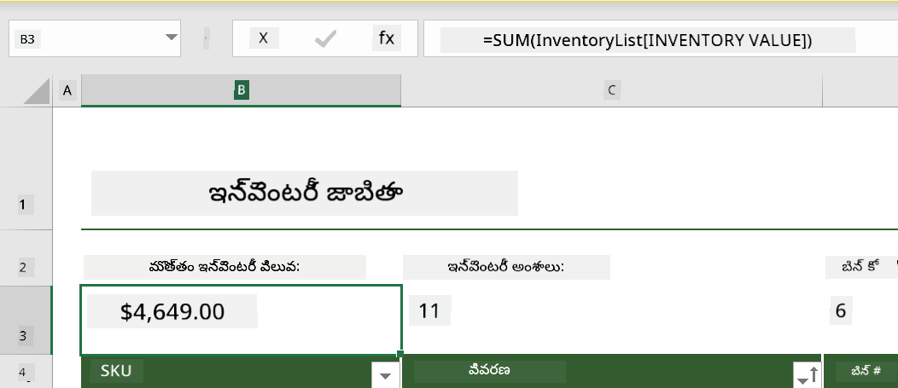
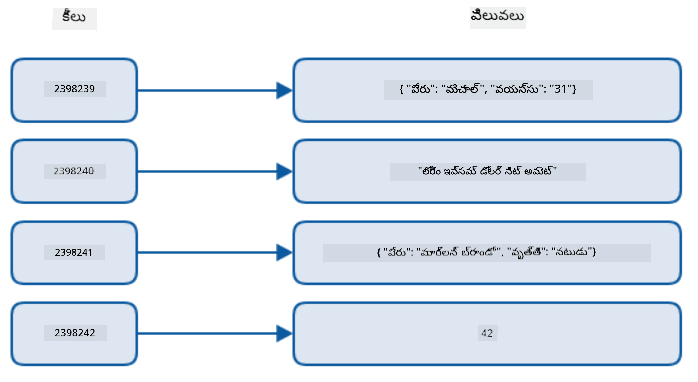
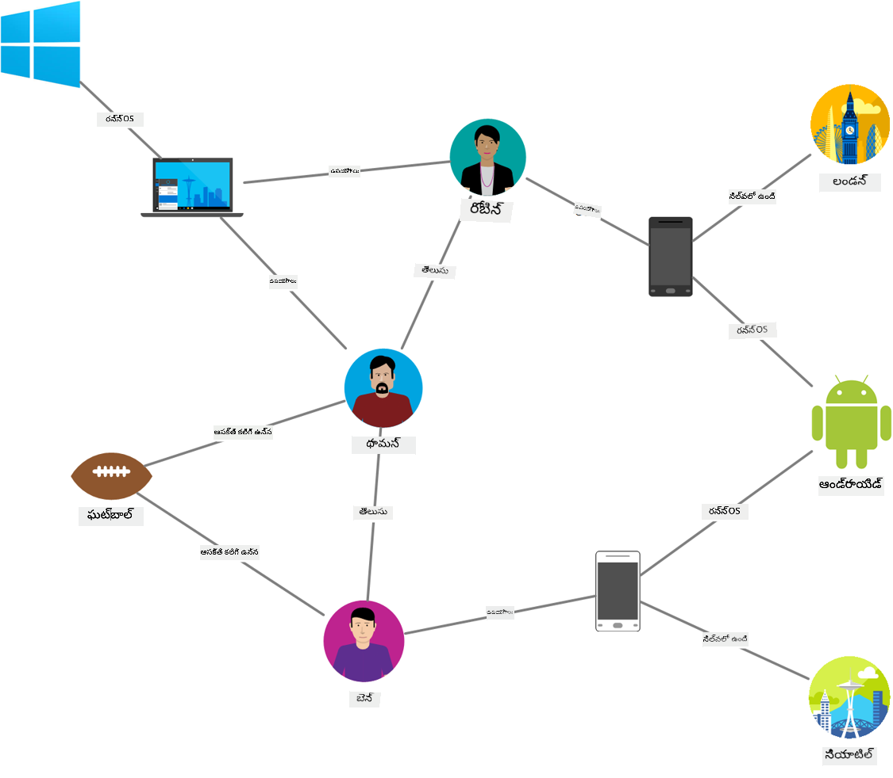
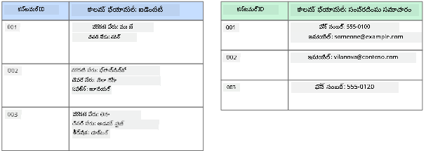
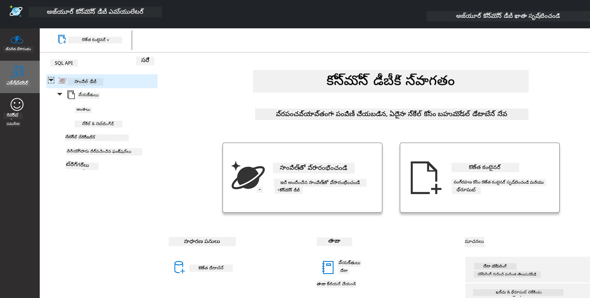
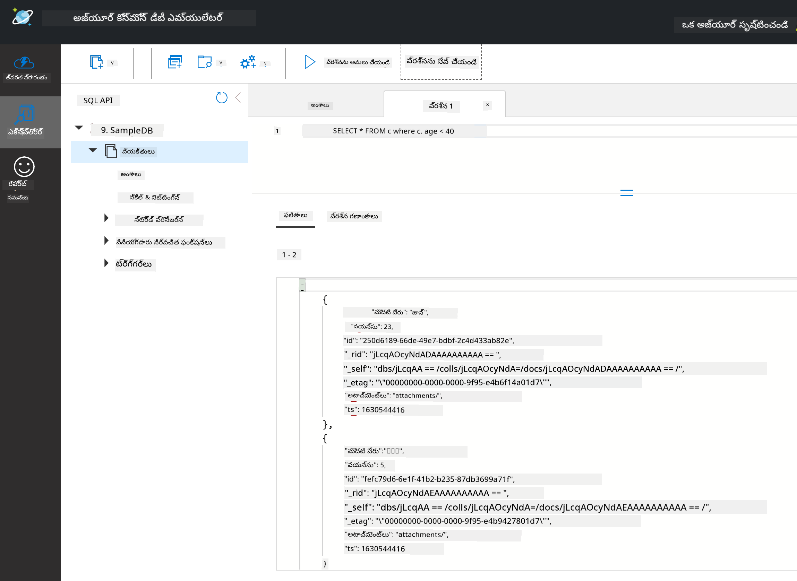

<!--
CO_OP_TRANSLATOR_METADATA:
{
  "original_hash": "c182e87f9f80be7e7cdffc7b40bbfccf",
  "translation_date": "2025-12-19T15:37:55+00:00",
  "source_file": "2-Working-With-Data/06-non-relational/README.md",
  "language_code": "te"
}
-->
# డేటాతో పని చేయడం: నాన్-రిలేషనల్ డేటా

| ద్వారా ](../../sketchnotes/06-NoSQL.png)|
|:---:|
|నోస్క్యూఎల్ డేటాతో పని చేయడం - _స్కెచ్ నోట్ [@nitya](https://twitter.com/nitya) ద్వారా_ |

## [పూర్వ-లెక్చర్ క్విజ్](https://ff-quizzes.netlify.app/en/ds/quiz/10)

డేటా రిలేషనల్ డేటాబేస్‌లకు పరిమితం కాదు. ఈ పాఠం నాన్-రిలేషనల్ డేటాపై దృష్టి సారించి, స్ప్రెడ్షీట్స్ మరియు నోస్క్యూఎల్ యొక్క ప్రాథమిక అంశాలను కవర్ చేస్తుంది.

## స్ప్రెడ్షీట్స్

స్ప్రెడ్షీట్స్ డేటాను నిల్వ చేయడానికి మరియు అన్వేషించడానికి ప్రాచుర్యం పొందిన మార్గం, ఎందుకంటే దీన్ని సెటప్ చేయడం మరియు ప్రారంభించడం తక్కువ పని అవసరం. ఈ పాఠంలో మీరు స్ప్రెడ్షీట్ యొక్క ప్రాథమిక భాగాలు, అలాగే ఫార్మూలాలు మరియు ఫంక్షన్లను నేర్చుకుంటారు. ఉదాహరణలు మైక్రోసాఫ్ట్ ఎక్సెల్‌తో చూపబడతాయి, కానీ చాలా భాగాలు మరియు విషయాలు ఇతర స్ప్రెడ్షీట్ సాఫ్ట్‌వేర్‌తో పోలిస్తే సమాన పేర్లు మరియు దశలను కలిగి ఉంటాయి.



స్ప్రెడ్షీట్ ఒక ఫైల్ మరియు కంప్యూటర్, పరికరం లేదా క్లౌడ్ ఆధారిత ఫైల్ సిస్టమ్‌లో అందుబాటులో ఉంటుంది. సాఫ్ట్‌వేర్ బ్రౌజర్ ఆధారితంగా ఉండవచ్చు లేదా కంప్యూటర్‌లో ఇన్‌స్టాల్ చేయాల్సిన అనువర్తనం లేదా యాప్‌గా డౌన్లోడ్ చేయవలసినది కావచ్చు. ఎక్సెల్‌లో ఈ ఫైళ్లను **వర్క్‌బుక్స్** అని కూడా నిర్వచిస్తారు మరియు ఈ పదజాలం ఈ పాఠం మిగిలిన భాగంలో ఉపయోగించబడుతుంది.

ఒక వర్క్‌బుక్ ఒకటి లేదా అంతకంటే ఎక్కువ **వర్క్‌షీట్లు** కలిగి ఉంటుంది, ప్రతి వర్క్‌షీట్ టాబ్‌ల ద్వారా లేబుల్ చేయబడుతుంది. వర్క్‌షీట్‌లో **సెల్స్** అనే చతురస్రాలు ఉంటాయి, ఇవి వాస్తవ డేటాను కలిగి ఉంటాయి. ఒక సెల్ ఒక వరుస మరియు కాలమ్ యొక్క సంధి, కాలమ్స్ అక్షరాల ద్వారా లేబుల్ చేయబడి, వరుసలు సంఖ్యల ద్వారా లేబుల్ చేయబడ్డాయి. కొన్ని స్ప్రెడ్షీట్స్ మొదటి కొన్ని వరుసల్లో హెడర్లు ఉంటాయి, ఇవి సెల్‌లోని డేటాను వివరించడానికి ఉపయోగిస్తారు.

ఈ ప్రాథమిక అంశాలతో, మైక్రోసాఫ్ట్ టెంప్లేట్స్ నుండి ఒక ఉదాహరణను ఉపయోగించి, ఇన్వెంటరీపై దృష్టి సారించి స్ప్రెడ్షీట్ యొక్క కొన్ని అదనపు భాగాలను పరిశీలిస్తాము.

### ఇన్వెంటరీ నిర్వహణ

"InventoryExample" అనే స్ప్రెడ్షీట్ ఫైల్ ఒక ఫార్మాట్ చేయబడిన ఇన్వెంటరీలోని అంశాల స్ప్రెడ్షీట్, ఇది మూడు వర్క్‌షీట్లను కలిగి ఉంటుంది, టాబ్‌లు "Inventory List", "Inventory Pick List" మరియు "Bin Lookup" అని లేబుల్ చేయబడ్డాయి. Inventory List వర్క్‌షీట్‌లో నాల్గవ వరుస హెడర్, ఇది హెడర్ కాలమ్‌లోని ప్రతి సెల్ విలువను వివరిస్తుంది.



కొన్ని సందర్భాల్లో ఒక సెల్ విలువను ఉత్పత్తి చేయడానికి ఇతర సెల్స్ విలువలపై ఆధారపడి ఉంటుంది. ఇన్వెంటరీ జాబితా స్ప్రెడ్షీట్ తన ఇన్వెంటరీలోని ప్రతి అంశం యొక్క ఖర్చును ట్రాక్ చేస్తుంది, కానీ ఇన్వెంటరీలోని మొత్తం విలువ తెలుసుకోవాలంటే? [**ఫార్మూలాలు**](https://support.microsoft.com/en-us/office/overview-of-formulas-34519a4e-1e8d-4f4b-84d4-d642c4f63263) సెల్ డేటాపై చర్యలు నిర్వహిస్తాయి మరియు ఈ ఉదాహరణలో ఇన్వెంటరీ ఖర్చును లెక్కించడానికి ఉపయోగిస్తారు. ఈ స్ప్రెడ్షీట్ ఇన్వెంటరీ విలువ కాలమ్‌లో ఫార్ములాను ఉపయోగించి ప్రతి అంశం విలువను లెక్కిస్తుంది, ఇది QTY హెడర్ కింద ఉన్న పరిమాణాన్ని COST హెడర్ కింద ఉన్న ఖర్చులతో గుణిస్తుంది. ఒక సెల్‌ను డబుల్ క్లిక్ చేయడం లేదా హైలైట్ చేయడం ద్వారా ఫార్ములా కనిపిస్తుంది. మీరు గమనిస్తారు ఫార్మూలాలు సమాన చిహ్నంతో ప్రారంభమవుతాయి, తరువాత లెక్కింపు లేదా ఆపరేషన్ ఉంటుంది.



మేము మరో ఫార్ములాను ఉపయోగించి ఇన్వెంటరీ విలువలన్నింటినీ కలిపి మొత్తం విలువను పొందవచ్చు. ప్రతి సెల్‌ను జోడించడం ద్వారా మొత్తం లెక్కించవచ్చు, కానీ అది కష్టమైన పని. ఎక్సెల్ [**ఫంక్షన్లు**](https://support.microsoft.com/en-us/office/sum-function-043e1c7d-7726-4e80-8f32-07b23e057f89) కలిగి ఉంది, ఇవి సెల్ విలువలపై లెక్కింపులు నిర్వహించడానికి ముందుగా నిర్వచించబడిన ఫార్మూలాలు. ఫంక్షన్లు ఆర్గ్యుమెంట్లను అవసరం చేస్తాయి, ఇవి లెక్కింపులు నిర్వహించడానికి అవసరమైన విలువలు. ఫంక్షన్లు ఒక కంటే ఎక్కువ ఆర్గ్యుమెంట్లు అవసరం అయితే, అవి నిర్దిష్ట క్రమంలో జాబితా చేయబడాలి లేకపోతే ఫంక్షన్ సరైన విలువను లెక్కించకపోవచ్చు. ఈ ఉదాహరణ SUM ఫంక్షన్‌ను ఉపయోగిస్తుంది, ఇది ఇన్వెంటరీ విలువల విలువలను ఆర్గ్యుమెంట్‌గా ఉపయోగించి వరుస 3, కాలమ్ B (B3 అని కూడా పిలవబడుతుంది) కింద మొత్తం లెక్కిస్తుంది.

## నోస్క్యూఎల్

నోస్క్యూఎల్ అనేది నాన్-రిలేషనల్ డేటాను నిల్వ చేయడానికి వివిధ మార్గాలకు umbrella పదం, దీన్ని "నాన్-ఎస్‌క్యూఎల్", "నాన్-రిలేషనల్" లేదా "నాట్ ఓన్లీ SQL" అని అర్థం చేసుకోవచ్చు. ఈ రకమైన డేటాబేస్ సిస్టమ్స్ 4 రకాలుగా వర్గీకరించబడతాయి.


> మూలం [Michał Białecki Blog](https://www.michalbialecki.com/2018/03/18/azure-cosmos-db-key-value-database-cloud/)

[కీ-విలువ](https://docs.microsoft.com/en-us/azure/architecture/data-guide/big-data/non-relational-data#keyvalue-data-stores) డేటాబేస్‌లు ప్రత్యేక కీలు, అంటే విలువతో అనుసంధానించబడిన ప్రత్యేక గుర్తింపును జతచేస్తాయి. ఈ జంటలు సరైన హాషింగ్ ఫంక్షన్‌తో [హాష్ టేబుల్](https://www.hackerearth.com/practice/data-structures/hash-tables/basics-of-hash-tables/tutorial/) ఉపయోగించి నిల్వ చేయబడతాయి.


> మూలం [Microsoft](https://docs.microsoft.com/en-us/azure/cosmos-db/graph/graph-introduction#graph-database-by-example)

[గ్రాఫ్](https://docs.microsoft.com/en-us/azure/architecture/data-guide/big-data/non-relational-data#graph-data-stores) డేటాబేస్‌లు డేటాలో సంబంధాలను వివరించడానికి ఉపయోగిస్తారు మరియు నోడ్స్ మరియు ఎడ్జెస్ సేకరణగా ప్రాతినిధ్యం వహిస్తాయి. ఒక నోడ్ ఒక ఎంటిటీని సూచిస్తుంది, ఇది వాస్తవ ప్రపంచంలో ఉన్న ఏదైనా, ఉదాహరణకు ఒక విద్యార్థి లేదా బ్యాంక్ స్టేట్‌మెంట్. ఎడ్జెస్ రెండు ఎంటిటీల మధ్య సంబంధాన్ని సూచిస్తాయి. ప్రతి నోడ్ మరియు ఎడ్జ్‌కు అదనపు సమాచారం అందించే లక్షణాలు ఉంటాయి.



[కాలమ్నార్](https://docs.microsoft.com/en-us/azure/architecture/data-guide/big-data/non-relational-data#columnar-data-stores) డేటా స్టోర్‌లు డేటాను కాలమ్స్ మరియు వరుసలుగా ఏర్పాటు చేస్తాయి, ఇది రిలేషనల్ డేటా నిర్మాణంలా ఉంటుంది, కానీ ప్రతి కాలమ్ కాలమ్ ఫ్యామిలీ అని పిలవబడే సమూహాలుగా విభజించబడుతుంది, ఒక కాలమ్ కింద ఉన్న అన్ని డేటా సంబంధితంగా ఉంటుంది మరియు ఒక యూనిట్‌గా పొందవచ్చు మరియు మార్చవచ్చు.

### Azure Cosmos DB తో డాక్యుమెంట్ డేటా స్టోర్‌లు

[డాక్యుమెంట్](https://docs.microsoft.com/en-us/azure/architecture/data-guide/big-data/non-relational-data#document-data-stores) డేటా స్టోర్‌లు కీ-విలువ డేటా స్టోర్ కాన్సెప్ట్‌పై ఆధారపడి, ఫీల్డ్స్ మరియు ఆబ్జెక్టుల సిరీస్‌తో తయారవుతాయి. ఈ విభాగం Cosmos DB ఎమ్యులేటర్‌తో డాక్యుమెంట్ డేటాబేస్‌లను అన్వేషిస్తుంది.

Cosmos DB డేటాబేస్ "నాట్ ఓన్లీ SQL" నిర్వచనానికి సరిపోతుంది, ఇక్కడ Cosmos DB యొక్క డాక్యుమెంట్ డేటాబేస్ డేటాను క్వెరీ చేయడానికి SQL పై ఆధారపడి ఉంటుంది. [మునుపటి పాఠం](../05-relational-databases/README.md) SQL యొక్క ప్రాథమిక అంశాలను కవర్ చేస్తుంది, మరియు ఇక్కడ డాక్యుమెంట్ డేటాబేస్‌కు కొన్ని అదే క్వెరీలను వర్తింపజేయగలము. మేము Cosmos DB ఎమ్యులేటర్‌ను ఉపయోగించబోతున్నాము, ఇది కంప్యూటర్‌లో స్థానికంగా డాక్యుమెంట్ డేటాబేస్‌ను సృష్టించి అన్వేషించడానికి అనుమతిస్తుంది. ఎమ్యులేటర్ గురించి మరింత చదవండి [ఇక్కడ](https://docs.microsoft.com/en-us/azure/cosmos-db/local-emulator?tabs=ssl-netstd21).

ఒక డాక్యుమెంట్ ఫీల్డ్స్ మరియు ఆబ్జెక్ట్ విలువల సేకరణ, ఫీల్డ్స్ ఆబ్జెక్ట్ విలువ ఏమిటి అనేది వివరిస్తాయి. క్రింద ఒక డాక్యుమెంట్ ఉదాహరణ ఉంది.

```json
{
    "firstname": "Eva",
    "age": 44,
    "id": "8c74a315-aebf-4a16-bb38-2430a9896ce5",
    "_rid": "bHwDAPQz8s0BAAAAAAAAAA==",
    "_self": "dbs/bHwDAA==/colls/bHwDAPQz8s0=/docs/bHwDAPQz8s0BAAAAAAAAAA==/",
    "_etag": "\"00000000-0000-0000-9f95-010a691e01d7\"",
    "_attachments": "attachments/",
    "_ts": 1630544034
}
```

ఈ డాక్యుమెంట్‌లో ఆసక్తి ఉన్న ఫీల్డ్స్: `firstname`, `id`, మరియు `age`. మిగతా అండర్‌స్కోర్ ఉన్న ఫీల్డ్స్ Cosmos DB ద్వారా ఉత్పత్తి చేయబడ్డాయి.

#### Cosmos DB ఎమ్యులేటర్‌తో డేటాను అన్వేషించడం

మీరు ఎమ్యులేటర్‌ను [విండోస్ కోసం ఇక్కడ డౌన్లోడ్ చేసి ఇన్‌స్టాల్ చేయవచ్చు](https://aka.ms/cosmosdb-emulator). macOS మరియు Linux కోసం ఎమ్యులేటర్‌ను ఎలా నడపాలో ఈ [డాక్యుమెంటేషన్](https://docs.microsoft.com/en-us/azure/cosmos-db/local-emulator?tabs=ssl-netstd21#run-on-linux-macos) చూడండి.

ఎమ్యులేటర్ బ్రౌజర్ విండోను ప్రారంభిస్తుంది, ఇక్కడ ఎక్స్‌ప్లోరర్ వీక్షణ డాక్యుమెంట్లను అన్వేషించడానికి అనుమతిస్తుంది.



మీరు అనుసరిస్తున్నట్లయితే, "Start with Sample" క్లిక్ చేసి SampleDB అనే నమూనా డేటాబేస్‌ను సృష్టించండి. Sample DB ను ఎర్రో క్లిక్ చేసి విస్తరించండి, మీరు `Persons` అనే కంటైనర్‌ను కనుగొంటారు, కంటైనర్ ఒక అంశాల సేకరణను కలిగి ఉంటుంది, ఇవి కంటైనర్‌లోని డాక్యుమెంట్లు. మీరు `Items` కింద ఉన్న నాలుగు వ్యక్తిగత డాక్యుమెంట్లను అన్వేషించవచ్చు.


#### Cosmos DB ఎమ్యులేటర్‌తో డాక్యుమెంట్ డేటాను క్వెరీ చేయడం

మేము కొత్త SQL Query బటన్ (ఎడమ నుండి రెండవ బటన్) క్లిక్ చేసి నమూనా డేటాను కూడా క్వెరీ చేయవచ్చు.

`SELECT * FROM c` కంటైనర్‌లోని అన్ని డాక్యుమెంట్లను తిరిగి ఇస్తుంది. ఇప్పుడు ఒక where క్లాజ్ జోడించి 40 కంటే తక్కువ వయస్సు ఉన్న వారిని కనుగొనండి.

`SELECT * FROM c where c.age < 40`

 

క్వెరీ రెండు డాక్యుమెంట్లను తిరిగి ఇస్తుంది, ప్రతి డాక్యుమెంట్ వయస్సు విలువ 40 కంటే తక్కువగా ఉంది.

#### JSON మరియు డాక్యుమెంట్లు

మీకు జావాస్క్రిప్ట్ ఆబ్జెక్ట్ నోటేషన్ (JSON) పరిచయం అయితే, డాక్యుమెంట్లు JSON లాగా కనిపిస్తాయి. ఈ డైరెక్టరీలో `PersonsData.json` ఫైల్ ఉంది, దీనిని మీరు ఎమ్యులేటర్‌లో Persons కంటైనర్‌కు `Upload Item` బటన్ ద్వారా అప్లోడ్ చేయవచ్చు.

అధిక భాగంలో, JSON డేటాను తిరిగి ఇచ్చే APIs డాక్యుమెంట్ డేటాబేస్‌లలో నేరుగా బదిలీ చేసి నిల్వ చేయవచ్చు. క్రింద మరో డాక్యుమెంట్ ఉంది, ఇది మైక్రోసాఫ్ట్ ట్విట్టర్ ఖాతా నుండి Twitter API ఉపయోగించి పొందిన ట్వీట్లను సూచిస్తుంది, తరువాత Cosmos DB లో చేర్చబడింది.

```json
{
    "created_at": "2021-08-31T19:03:01.000Z",
    "id": "1432780985872142341",
    "text": "Blank slate. Like this tweet if you’ve ever painted in Microsoft Paint before. https://t.co/cFeEs8eOPK",
    "_rid": "dhAmAIUsA4oHAAAAAAAAAA==",
    "_self": "dbs/dhAmAA==/colls/dhAmAIUsA4o=/docs/dhAmAIUsA4oHAAAAAAAAAA==/",
    "_etag": "\"00000000-0000-0000-9f84-a0958ad901d7\"",
    "_attachments": "attachments/",
    "_ts": 1630537000
```

ఈ డాక్యుమెంట్‌లో ఆసక్తి ఉన్న ఫీల్డ్స్: `created_at`, `id`, మరియు `text`.

## 🚀 సవాలు

SampleDB డేటాబేస్‌కు మీరు అప్లోడ్ చేయగల `TwitterData.json` ఫైల్ ఉంది. దాన్ని వేరే కంటైనర్‌లో జోడించడం సిఫార్సు చేయబడింది. ఇది ఇలా చేయవచ్చు:

1. పై కుడి మూలలో కొత్త కంటైనర్ బటన్ క్లిక్ చేయండి
1. ఉన్న డేటాబేస్ (SampleDB) ఎంచుకుని కంటైనర్ ID సృష్టించండి
1. పార్టిషన్ కీని `/id` గా సెట్ చేయండి
1. OK క్లిక్ చేయండి (ఈ వీక్షణలో మిగతా సమాచారాన్ని మీరు పక్కన పెట్టవచ్చు, ఇది మీ యంత్రంలో స్థానికంగా నడుస్తున్న చిన్న డేటాసెట్)
1. మీ కొత్త కంటైనర్ తెరవండి మరియు `Upload Item` బటన్‌తో Twitter Data ఫైల్‌ను అప్లోడ్ చేయండి

టెక్స్ట్ ఫీల్డ్‌లో Microsoft ఉన్న డాక్యుమెంట్లను కనుగొనడానికి కొన్ని SELECT క్వెరీలను నడపండి. సూచన: [LIKE కీవర్డ్](https://docs.microsoft.com/en-us/azure/cosmos-db/sql/sql-query-keywords#using-like-with-the--wildcard-character) ఉపయోగించడానికి ప్రయత్నించండి

## [పోస్ట్-లెక్చర్ క్విజ్](https://ff-quizzes.netlify.app/en/ds/quiz/11)

## సమీక్ష & స్వీయ అధ్యయనం

- ఈ స్ప్రెడ్షీట్‌కు కొన్ని అదనపు ఫార్మాటింగ్ మరియు ఫీచర్లు జోడించబడ్డాయి, ఇవి ఈ పాఠం కవర్ చేయవు. మీరు మరింత తెలుసుకోవాలనుకుంటే మైక్రోసాఫ్ట్ వద్ద [విస్తృత డాక్యుమెంటేషన్ మరియు వీడియోల లైబ్రరీ](https://support.microsoft.com/excel) ఉంది.

- ఈ ఆర్కిటెక్చరల్ డాక్యుమెంటేషన్ వివిధ రకాల నాన్-రిలేషనల్ డేటా లక్షణాలను వివరించును: [నాన్-రిలేషనల్ డేటా మరియు నోస్క్యూఎల్](https://docs.microsoft.com/en-us/azure/architecture/data-guide/big-data/non-relational-data)

- Cosmos DB ఒక క్లౌడ్ ఆధారిత నాన్-రిలేషనల్ డేటాబేస్, ఇది ఈ పాఠంలో పేర్కొన్న వివిధ నోస్క్యూఎల్ రకాలను కూడా నిల్వ చేయగలదు. ఈ రకాల గురించి మరింత తెలుసుకోండి ఈ [Cosmos DB Microsoft Learn మాడ్యూల్](https://docs.microsoft.com/en-us/learn/paths/work-with-nosql-data-in-azure-cosmos-db/)

## అసైన్‌మెంట్

[Soda Profits](assignment.md)

---

<!-- CO-OP TRANSLATOR DISCLAIMER START -->
**అస్పష్టత**:  
ఈ పత్రాన్ని AI అనువాద సేవ [Co-op Translator](https://github.com/Azure/co-op-translator) ఉపయోగించి అనువదించబడింది. మేము ఖచ్చితత్వానికి ప్రయత్నించినప్పటికీ, ఆటోమేటెడ్ అనువాదాల్లో పొరపాట్లు లేదా తప్పిదాలు ఉండవచ్చు. మూల పత్రం దాని స్వదేశీ భాషలో అధికారిక మూలంగా పరిగణించాలి. ముఖ్యమైన సమాచారానికి, ప్రొఫెషనల్ మానవ అనువాదం సిఫార్సు చేయబడుతుంది. ఈ అనువాదం వాడకంలో ఏర్పడిన ఏవైనా అపార్థాలు లేదా తప్పుదారుల కోసం మేము బాధ్యత వహించము.
<!-- CO-OP TRANSLATOR DISCLAIMER END -->