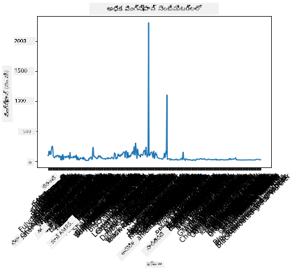
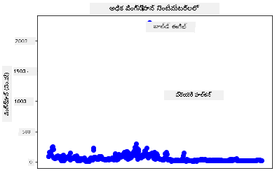
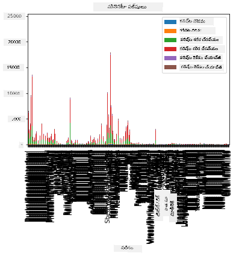
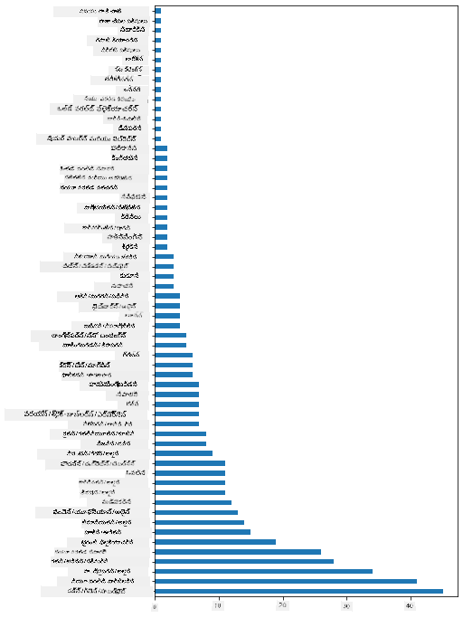
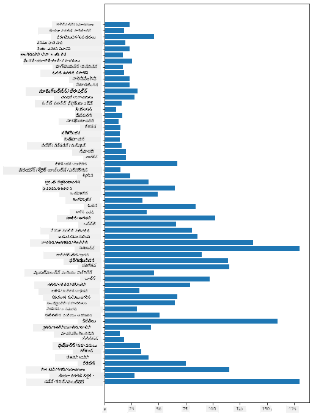
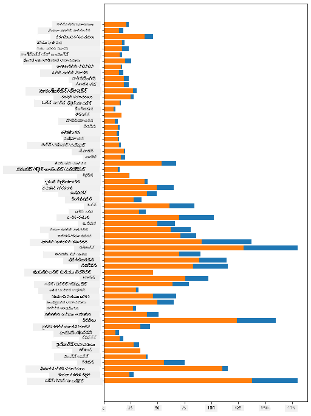

<!--
CO_OP_TRANSLATOR_METADATA:
{
  "original_hash": "a49d78e32e280c410f04e5f2a2068e77",
  "translation_date": "2025-12-19T16:12:50+00:00",
  "source_file": "3-Data-Visualization/09-visualization-quantities/README.md",
  "language_code": "te"
}
-->
# పరిమాణాలను దృశ్యీకరించడం

| ద్వారా ](../../sketchnotes/09-Visualizing-Quantities.png)|
|:---:|
| పరిమాణాలను దృశ్యీకరించడం - _స్కెచ్ నోట్ [@nitya](https://twitter.com/nitya) ద్వారా_ |

ఈ పాఠంలో మీరు పరిమాణం అనే భావన చుట్టూ ఆసక్తికరమైన దృశ్యీకరణలను సృష్టించడం ఎలా అనేది నేర్చుకోవడానికి అందుబాటులో ఉన్న అనేక Python లైబ్రరీలలో ఒకదాన్ని ఉపయోగించడం ఎలా అనేది అన్వేషించబోతున్నారు. మినెసోటా పక్షుల గురించి శుభ్రపరిచిన డేటాసెట్ ఉపయోగించి, మీరు స్థానిక వన్యజీవుల గురించి అనేక ఆసక్తికరమైన విషయాలను తెలుసుకోవచ్చు.  
## [పాఠం ముందు క్విజ్](https://ff-quizzes.netlify.app/en/ds/quiz/16)

## Matplotlib తో రెక్కల వ్యాప్తిని పరిశీలించండి

వివిధ రకాల సులభమైన మరియు సున్నితమైన ప్లాట్లు మరియు చార్ట్లను సృష్టించడానికి అద్భుతమైన లైబ్రరీ [Matplotlib](https://matplotlib.org/stable/index.html). సాధారణంగా, ఈ లైబ్రరీలను ఉపయోగించి డేటాను ప్లాట్ చేయడం అనేది మీ డేటాఫ్రేమ్‌లో మీరు లక్ష్యంగా పెట్టుకోవాలనుకునే భాగాలను గుర్తించడం, ఆ డేటాపై అవసరమైన మార్పులు చేయడం, దాని x మరియు y అక్ష విలువలను కేటాయించడం, ఏ రకమైన ప్లాట్ చూపించాలో నిర్ణయించడం, మరియు ఆ ప్లాట్‌ను చూపించడం అనే ప్రక్రియ. Matplotlib అనేక రకాల దృశ్యీకరణలను అందిస్తుంది, కానీ ఈ పాఠం కోసం, పరిమాణాన్ని దృశ్యీకరించడానికి అత్యంత అనుకూలమైన వాటిపై దృష్టి పెట్టుదాం: లైన్ చార్ట్లు, స్కాటర్‌ప్లాట్లు, మరియు బార్ ప్లాట్లు.

> ✅ మీ డేటా నిర్మాణానికి మరియు మీరు చెప్పదలచుకున్న కథకు సరిపోయే ఉత్తమ చార్ట్‌ను ఉపయోగించండి.  
> - కాలానుగుణ ధోరణులను విశ్లేషించడానికి: లైన్  
> - విలువలను పోల్చడానికి: బార్, కాలమ్, పై, స్కాటర్‌ప్లాట్  
> - భాగాలు మొత్తం తో ఎలా సంబంధించాయో చూపించడానికి: పై  
> - డేటా పంపిణీని చూపించడానికి: స్కాటర్‌ప్లాట్, బార్  
> - ధోరణులను చూపించడానికి: లైన్, కాలమ్  
> - విలువల మధ్య సంబంధాలను చూపించడానికి: లైన్, స్కాటర్‌ప్లాట్, బబుల్

మీ వద్ద ఒక డేటాసెట్ ఉంటే మరియు ఒక నిర్దిష్ట అంశం ఎంతగా ఉన్నదో కనుగొనాల్సిన అవసరం ఉంటే, మొదటి పనుల్లో ఒకటి దాని విలువలను పరిశీలించడం అవుతుంది.

✅ Matplotlib కోసం చాలా మంచి 'చీట్ షీట్లు' [ఇక్కడ](https://matplotlib.org/cheatsheets/cheatsheets.pdf) అందుబాటులో ఉన్నాయి.

## పక్షుల రెక్కల వ్యాప్తి విలువల గురించి లైన్ ప్లాట్ నిర్మించండి

ఈ పాఠం ఫోల్డర్ రూట్‌లో ఉన్న `notebook.ipynb` ఫైల్‌ను తెరవండి మరియు ఒక సెల్ జోడించండి.

> గమనిక: డేటా ఈ రిపో యొక్క రూట్‌లోని `/data` ఫోల్డర్‌లో నిల్వ చేయబడింది.

```python
import pandas as pd
import matplotlib.pyplot as plt
birds = pd.read_csv('../../data/birds.csv')
birds.head()
```
ఈ డేటా టెక్స్ట్ మరియు సంఖ్యల మిశ్రమం:


|      | పేరు                         | శాస్త్రీయపేరు         | వర్గం              | ఆర్డర్        | కుటుంబం   | జెనస్       | సంరక్షణ స్థితి | కనిష్ఠ పొడవు | గరిష్ఠ పొడవు | కనిష్ఠ శరీర బరువు | గరిష్ఠ శరీర బరువు | కనిష్ఠ రెక్కల వ్యాప్తి | గరిష్ఠ రెక్కల వ్యాప్తి |
| ---: | :--------------------------- | :--------------------- | :-------------------- | :----------- | :------- | :---------- | :----------------- | --------: | --------: | ----------: | ----------: | ----------: | ----------: |
|    0 | బ్లాక్-బెల్లీడ్ విసిలింగ్-డక్ | Dendrocygna autumnalis | డక్స్/గీస్స్/వాటర్‌ఫౌల్ | Anseriformes | Anatidae | Dendrocygna | LC                 |        47 |        56 |         652 |        1020 |          76 |          94 |
|    1 | ఫుల్వస్ విసిలింగ్-డక్       | Dendrocygna bicolor    | డక్స్/గీస్స్/వాటర్‌ఫౌల్ | Anseriformes | Anatidae | Dendrocygna | LC                 |        45 |        53 |         712 |        1050 |          85 |          93 |
|    2 | స్నో గూస్                   | Anser caerulescens     | డక్స్/గీస్స్/వాటర్‌ఫౌల్ | Anseriformes | Anatidae | Anser       | LC                 |        64 |        79 |        2050 |        4050 |         135 |         165 |
|    3 | రాస్ గూస్                 | Anser rossii           | డక్స్/గీస్స్/వాటర్‌ఫౌల్ | Anseriformes | Anatidae | Anser       | LC                 |      57.3 |        64 |        1066 |        1567 |         113 |         116 |
|    4 | గ్రేటర్ వైట్-ఫ్రంట్ గూస్  | Anser albifrons        | డక్స్/గీస్స్/వాటర్‌ఫౌల్ | Anseriformes | Anatidae | Anser       | LC                 |        64 |        81 |        1930 |        3310 |         130 |         165 |

కొన్ని సంఖ్యా డేటాను ప్రాథమిక లైన్ ప్లాట్ ఉపయోగించి ప్లాట్ చేయడం ప్రారంభిద్దాం. మీరు ఈ ఆసక్తికరమైన పక్షుల గరిష్ఠ రెక్కల వ్యాప్తి యొక్క దృశ్యాన్ని కావాలనుకుంటే.

```python
wingspan = birds['MaxWingspan'] 
wingspan.plot()
```


మీకు వెంటనే ఏమి కనిపిస్తుంది? కనీసం ఒక అవుట్లయర్ ఉన్నట్లు కనిపిస్తోంది - అది చాలా పెద్ద రెక్కల వ్యాప్తి! 2300 సెంటీమీటర్ల రెక్కల వ్యాప్తి అంటే 23 మీటర్లు - మినెసోటాలో ప్టెరోడాక్టిల్స్ తిరుగుతున్నారా? పరిశీలిద్దాం.

మీరు అవుట్లయర్లను కనుగొనడానికి Excel లో త్వరితంగా సార్ట్ చేయవచ్చు, అవి తప్పులే కావచ్చు, కానీ ప్లాట్లోనే పని కొనసాగించి దృశ్యీకరణ ప్రక్రియను కొనసాగించండి.

x-అక్షకు లేబుల్స్ జోడించి ఏ రకమైన పక్షులు ఉన్నాయో చూపించండి:

```
plt.title('Max Wingspan in Centimeters')
plt.ylabel('Wingspan (CM)')
plt.xlabel('Birds')
plt.xticks(rotation=45)
x = birds['Name'] 
y = birds['MaxWingspan']

plt.plot(x, y)

plt.show()
```


లేబుల్స్ 45 డిగ్రీల కోణంలో తిప్పినా కూడా చదవడానికి చాలా ఉన్నాయి. వేరే వ్యూహం ప్రయత్నిద్దాం: అవుట్లయర్లకు మాత్రమే లేబుల్స్ ఇవ్వండి మరియు లేబుల్స్‌ను చార్ట్ లోపల ఉంచండి. లేబలింగ్ కోసం మరింత స్థలం కోసం స్కాటర్ చార్ట్ ఉపయోగించవచ్చు:

```python
plt.title('Max Wingspan in Centimeters')
plt.ylabel('Wingspan (CM)')
plt.tick_params(axis='both',which='both',labelbottom=False,bottom=False)

for i in range(len(birds)):
    x = birds['Name'][i]
    y = birds['MaxWingspan'][i]
    plt.plot(x, y, 'bo')
    if birds['MaxWingspan'][i] > 500:
        plt.text(x, y * (1 - 0.05), birds['Name'][i], fontsize=12)
    
plt.show()
```
ఇక్కడ ఏమి జరుగుతోంది? మీరు `tick_params` ఉపయోగించి దిగువ లేబుల్స్‌ను దాచారు మరియు మీ పక్షుల డేటాసెట్ పై లూప్ సృష్టించారు. `bo` ఉపయోగించి చిన్న నీలి బిందువులతో చార్ట్ ప్లాట్ చేసి, గరిష్ఠ రెక్కల వ్యాప్తి 500 కంటే ఎక్కువ ఉన్న పక్షుల కోసం వారి పేరు బిందువు పక్కన ప్రదర్శించారు. మీరు y అక్షం పై లేబుల్స్ కొంచెం ఆఫ్‌సెట్ చేశారు (`y * (1 - 0.05)`) మరియు పక్షి పేరును లేబుల్ గా ఉపయోగించారు.

మీరు ఏమి కనుగొన్నారు?


## మీ డేటాను ఫిల్టర్ చేయండి

బాల్డ్ ఈగిల్ మరియు ప్రేరి ఫాల్కన్, చాలా పెద్ద పక్షులు కావచ్చు, గరిష్ఠ రెక్కల వ్యాప్తికి అదనపు `0` తప్పుగా జోడించబడినట్లు కనిపిస్తున్నాయి. 25 మీటర్ల రెక్కల వ్యాప్తి ఉన్న బాల్డ్ ఈగిల్‌ను మీరు కలుసుకోవడం అసాధ్యమే, అయితే ఉంటే, దయచేసి మాకు తెలియజేయండి! ఆ రెండు అవుట్లయర్లను తీసేసి కొత్త డేటాఫ్రేమ్ సృష్టిద్దాం:

```python
plt.title('Max Wingspan in Centimeters')
plt.ylabel('Wingspan (CM)')
plt.xlabel('Birds')
plt.tick_params(axis='both',which='both',labelbottom=False,bottom=False)
for i in range(len(birds)):
    x = birds['Name'][i]
    y = birds['MaxWingspan'][i]
    if birds['Name'][i] not in ['Bald eagle', 'Prairie falcon']:
        plt.plot(x, y, 'bo')
plt.show()
```

అవుట్లయర్లను ఫిల్టర్ చేయడం ద్వారా, మీ డేటా ఇప్పుడు మరింత సమగ్రంగా మరియు అర్థమయ్యేలా మారింది.


ఇప్పుడు రెక్కల వ్యాప్తి పరంగా కనీసం శుభ్రమైన డేటాసెట్ ఉన్నందున, ఈ పక్షుల గురించి మరింత తెలుసుకుందాం.

లైన్ మరియు స్కాటర్ ప్లాట్లు డేటా విలువలు మరియు వాటి పంపిణీ గురించి సమాచారం చూపించగలవు, కానీ ఈ డేటాసెట్‌లో ఉన్న విలువల గురించి ఆలోచించాలి. మీరు ఈ పరిమాణం గురించి క్రింది ప్రశ్నలకు జవాబుల కోసం దృశ్యీకరణలు సృష్టించవచ్చు:

> పక్షుల ఎన్ని వర్గాలు ఉన్నాయి, వాటి సంఖ్యలు ఎంత?  
> ఎన్ని పక్షులు అంతరించిపోయాయి, ప్రమాదంలో ఉన్నవి, అరుదైనవి లేదా సాధారణమైనవి?  
> లినియస్ యొక్క పదజాలంలో వివిధ జెనస్ మరియు ఆర్డర్లలో ఎన్ని ఉన్నాయి?  
## బార్ చార్ట్లను అన్వేషించండి

డేటా గుంపులను చూపించాల్సినప్పుడు బార్ చార్ట్లు ఉపయోగకరంగా ఉంటాయి. ఈ డేటాసెట్‌లో ఉన్న పక్షుల వర్గాలను అన్వేషించి ఏది సంఖ్యలో అత్యధికమో చూడండి.

నోట్‌బుక్ ఫైల్‌లో ప్రాథమిక బార్ చార్ట్ సృష్టించండి

✅ గమనిక, మీరు గత సెక్షన్‌లో గుర్తించిన రెండు అవుట్లయర్ పక్షులను ఫిల్టర్ చేయవచ్చు, వారి రెక్కల వ్యాప్తిలో తప్పును సరిచేయవచ్చు, లేదా రెక్కల వ్యాప్తి విలువలపై ఆధారపడని ఈ వ్యాయామాల కోసం వాటిని ఉంచవచ్చు.

మీరు బార్ చార్ట్ సృష్టించాలనుకుంటే, మీరు దృష్టి పెట్టదలచుకున్న డేటాను ఎంచుకోవచ్చు. బార్ చార్ట్లు రా డేటా నుండి సృష్టించవచ్చు:

```python
birds.plot(x='Category',
        kind='bar',
        stacked=True,
        title='Birds of Minnesota')

```


ఈ బార్ చార్ట్ చదవలేనిది ఎందుకంటే చాలా ఎక్కువ గుంపు కాని డేటా ఉంది. మీరు ప్లాట్ చేయదలచుకున్న డేటాను మాత్రమే ఎంచుకోవాలి, కాబట్టి పక్షుల పొడవును వారి వర్గం ఆధారంగా చూద్దాం.

మీ డేటాను పక్షుల వర్గం మాత్రమే కలిగి ఉండేలా ఫిల్టర్ చేయండి.

✅ మీరు డేటాను నిర్వహించడానికి Pandas ఉపయోగిస్తారని గమనించండి, తరువాత Matplotlib చార్టింగ్ చేస్తుంది.

చాలా వర్గాలు ఉన్నందున, మీరు ఈ చార్ట్‌ను నిలువుగా ప్రదర్శించి అందరి డేటా కోసం ఎత్తును సర్దుబాటు చేయవచ్చు:

```python
category_count = birds.value_counts(birds['Category'].values, sort=True)
plt.rcParams['figure.figsize'] = [6, 12]
category_count.plot.barh()
```


ఈ బార్ చార్ట్ ప్రతి వర్గంలో పక్షుల సంఖ్యను బాగా చూపిస్తుంది. ఒక చూపులోనే, ఈ ప్రాంతంలో అత్యధిక సంఖ్యలో పక్షులు డక్స్/గీస్స్/వాటర్‌ఫౌల్ వర్గంలో ఉన్నాయని మీరు చూడవచ్చు. మినెసోటా '10,000 సరస్సుల భూమి' కాబట్టి ఇది ఆశ్చర్యకరం కాదు!

✅ ఈ డేటాసెట్‌పై మరిన్ని లెక్కింపులు ప్రయత్నించండి. ఏదైనా ఆశ్చర్యంగా ఉందా?

## డేటాను పోల్చడం

మీరు కొత్త అక్షాలను సృష్టించి గుంపు డేటా యొక్క వివిధ పోలికలను ప్రయత్నించవచ్చు. పక్షి యొక్క వర్గం ఆధారంగా గరిష్ఠ పొడవు (MaxLength) పోలికను ప్రయత్నించండి:

```python
maxlength = birds['MaxLength']
plt.barh(y=birds['Category'], width=maxlength)
plt.rcParams['figure.figsize'] = [6, 12]
plt.show()
```


ఇక్కడ ఏ ఆశ్చర్యం లేదు: హమ్మింగ్‌బర్డ్స్ పెలికాన్స్ లేదా గీస్స్ కంటే తక్కువ MaxLength కలిగి ఉంటాయి. డేటా తార్కికంగా అర్థం కావడం మంచిది!

మీరు బార్ చార్ట్ల మరింత ఆసక్తికరమైన దృశ్యీకరణలను సృష్టించవచ్చు డేటాను సూపర్ ఇంపోజ్ చేయడం ద్వారా. ఒక నిర్దిష్ట పక్షి వర్గంపై కనిష్ఠ మరియు గరిష్ఠ పొడవును సూపర్ ఇంపోజ్ చేద్దాం:

```python
minLength = birds['MinLength']
maxLength = birds['MaxLength']
category = birds['Category']

plt.barh(category, maxLength)
plt.barh(category, minLength)

plt.show()
```
ఈ ప్లాట్‌లో, మీరు పక్షి వర్గం ప్రకారం కనిష్ఠ పొడవు మరియు గరిష్ఠ పొడవు పరిధిని చూడవచ్చు. ఈ డేటా ప్రకారం, పక్షి పెద్దదైతే, దాని పొడవు పరిధి కూడా పెద్దదని మీరు సురక్షితంగా చెప్పవచ్చు. ఆసక్తికరం!



## 🚀 సవాలు

ఈ పక్షుల డేటాసెట్ ఒక నిర్దిష్ట పర్యావరణ వ్యవస్థలోని వివిధ రకాల పక్షుల గురించి సమృద్ధి సమాచారం అందిస్తుంది. ఇంటర్నెట్‌లో వెతకండి మరియు ఇతర పక్షుల డేటాసెట్లను కనుగొనగలరా చూడండి. ఈ పక్షుల చుట్టూ చార్ట్లు మరియు గ్రాఫ్‌లను నిర్మించడం సాధన చేయండి, మీరు తెలియని విషయాలను కనుగొనండి.

## [పాఠం తర్వాత క్విజ్](https://ff-quizzes.netlify.app/en/ds/quiz/17)

## సమీక్ష & స్వీయ అధ్యయనం

ఈ మొదటి పాఠం Matplotlib ఉపయోగించి పరిమాణాలను దృశ్యీకరించడం గురించి కొంత సమాచారం ఇచ్చింది. దృశ్యీకరణ కోసం డేటాసెట్లతో పని చేసే ఇతర మార్గాల గురించి పరిశోధన చేయండి. [Plotly](https://github.com/plotly/plotly.py) ఒకటి, ఇది ఈ పాఠాల్లో కవర్ చేయబడదు, కాబట్టి అది ఏమి అందించగలదో చూడండి.  
## అసైన్‌మెంట్

[లైన్లు, స్కాటర్స్, మరియు బార్లు](assignment.md)

---

<!-- CO-OP TRANSLATOR DISCLAIMER START -->
**అస్పష్టత**:  
ఈ పత్రాన్ని AI అనువాద సేవ [Co-op Translator](https://github.com/Azure/co-op-translator) ఉపయోగించి అనువదించబడింది. మేము ఖచ్చితత్వానికి ప్రయత్నించినప్పటికీ, ఆటోమేటెడ్ అనువాదాల్లో పొరపాట్లు లేదా తప్పిదాలు ఉండవచ్చు. అసలు పత్రం దాని స్వదేశీ భాషలోనే అధికారిక మూలంగా పరిగణించాలి. ముఖ్యమైన సమాచారానికి, ప్రొఫెషనల్ మానవ అనువాదం సిఫార్సు చేయబడుతుంది. ఈ అనువాదం వాడకంలో ఏర్పడిన ఏవైనా అపార్థాలు లేదా తప్పుదారితీసే అర్థాలు కోసం మేము బాధ్యత వహించము.
<!-- CO-OP TRANSLATOR DISCLAIMER END -->