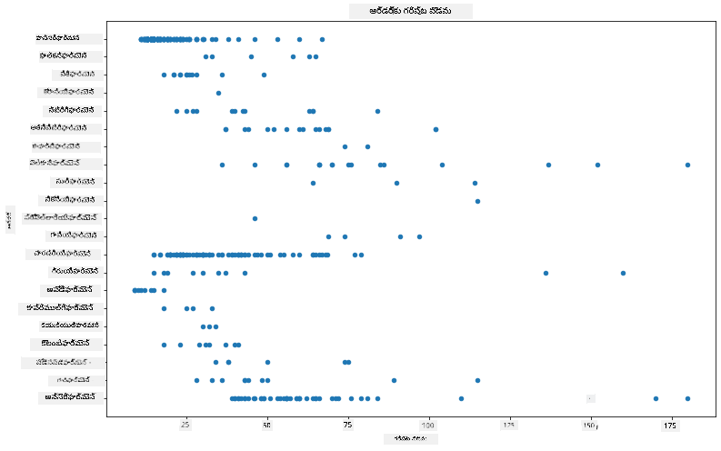
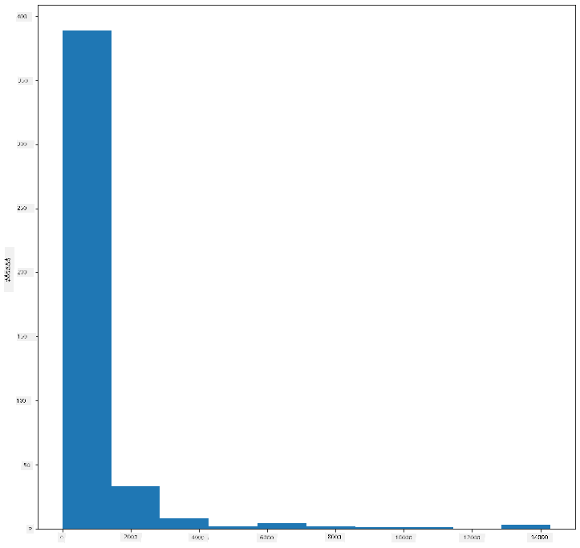
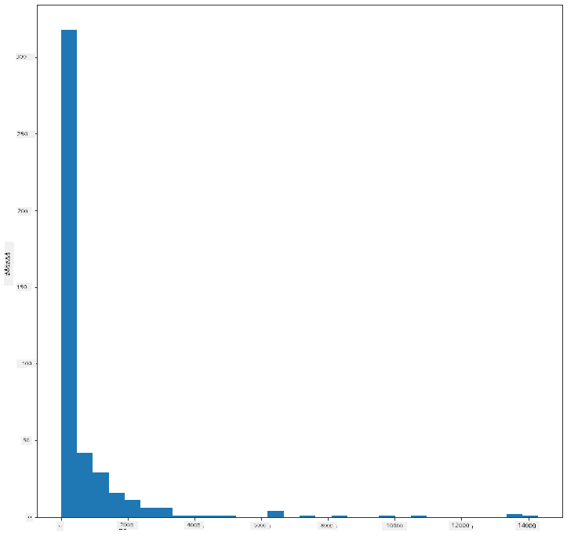
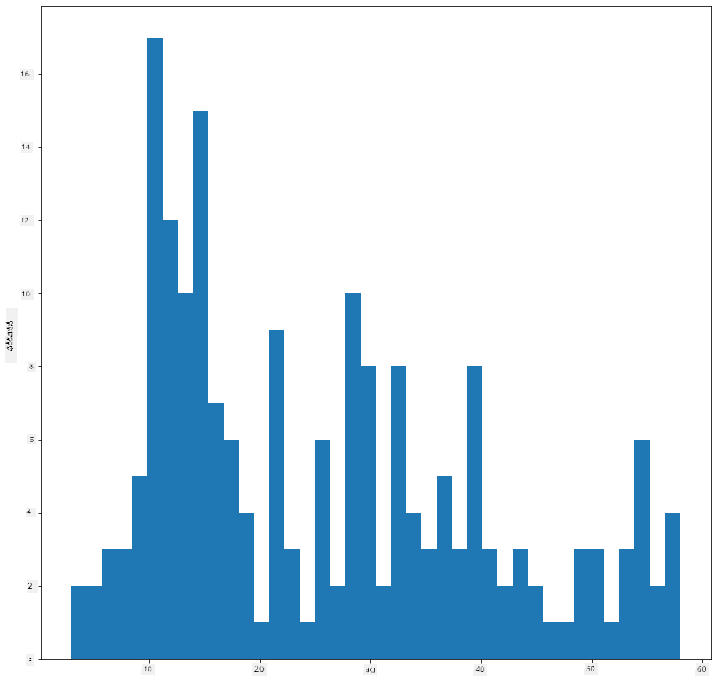
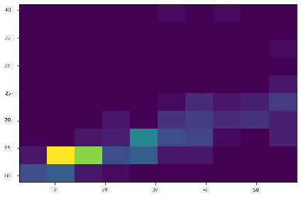
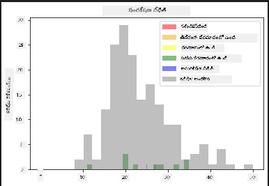
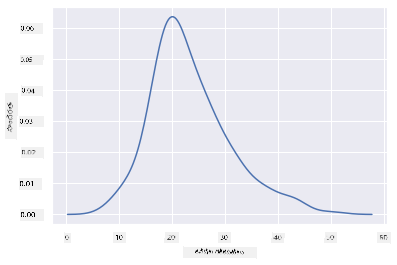
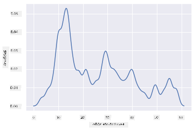
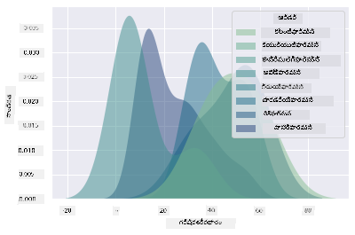
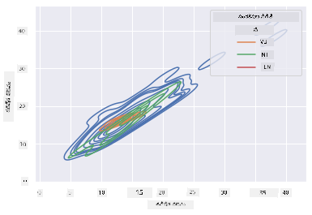

<!--
CO_OP_TRANSLATOR_METADATA:
{
  "original_hash": "80a20467e046d312809d008395051fc7",
  "translation_date": "2025-12-19T15:52:59+00:00",
  "source_file": "3-Data-Visualization/10-visualization-distributions/README.md",
  "language_code": "te"
}
-->
# పంపిణీలను దృశ్యీకరించడం

| ](../../sketchnotes/10-Visualizing-Distributions.png)|
|:---:|
| పంపిణీలను దృశ్యీకరించడం - _Sketchnote by [@nitya](https://twitter.com/nitya)_ |

మునుపటి పాఠంలో, మీరు మినెసోటా పక్షుల గురించి ఒక డేటాసెట్ గురించి కొన్ని ఆసక్తికరమైన విషయాలను నేర్చుకున్నారు. మీరు అవుట్లయర్లను దృశ్యీకరించడం ద్వారా కొన్ని తప్పు డేటాను కనుగొన్నారు మరియు పక్షుల వర్గాల మధ్య గరిష్ట పొడవు ద్వారా తేడాలను పరిశీలించారు.

## [పాఠం ముందు క్విజ్](https://ff-quizzes.netlify.app/en/ds/quiz/18)
## పక్షుల డేటాసెట్‌ను అన్వేషించండి

డేటాను లోతుగా పరిశీలించే మరో మార్గం దాని పంపిణీని చూడటం, లేదా డేటా ఒక అక్షం మీద ఎలా ఏర్పాటు చేయబడిందో చూడటం. ఉదాహరణకు, మీరు ఈ డేటాసెట్ కోసం మినెసోటా పక్షుల గరిష్ట రెక్కపట్టు లేదా గరిష్ట శరీర ద్రవ్యరాశి యొక్క సాధారణ పంపిణీ గురించి తెలుసుకోవాలనుకోవచ్చు.

ఈ డేటాసెట్‌లో డేటా పంపిణీల గురించి కొన్ని విషయాలను కనుగొనండి. ఈ పాఠం ఫోల్డర్ రూట్‌లో ఉన్న _notebook.ipynb_ ఫైల్‌లో, Pandas, Matplotlib మరియు మీ డేటాను దిగుమతి చేసుకోండి:

```python
import pandas as pd
import matplotlib.pyplot as plt
birds = pd.read_csv('../../data/birds.csv')
birds.head()
```

|      | Name                         | ScientificName         | Category              | Order        | Family   | Genus       | ConservationStatus | MinLength | MaxLength | MinBodyMass | MaxBodyMass | MinWingspan | MaxWingspan |
| ---: | :--------------------------- | :--------------------- | :-------------------- | :----------- | :------- | :---------- | :----------------- | --------: | --------: | ----------: | ----------: | ----------: | ----------: |
|    0 | Black-bellied whistling-duck | Dendrocygna autumnalis | Ducks/Geese/Waterfowl | Anseriformes | Anatidae | Dendrocygna | LC                 |        47 |        56 |         652 |        1020 |          76 |          94 |
|    1 | Fulvous whistling-duck       | Dendrocygna bicolor    | Ducks/Geese/Waterfowl | Anseriformes | Anatidae | Dendrocygna | LC                 |        45 |        53 |         712 |        1050 |          85 |          93 |
|    2 | Snow goose                   | Anser caerulescens     | Ducks/Geese/Waterfowl | Anseriformes | Anatidae | Anser       | LC                 |        64 |        79 |        2050 |        4050 |         135 |         165 |
|    3 | Ross's goose                 | Anser rossii           | Ducks/Geese/Waterfowl | Anseriformes | Anatidae | Anser       | LC                 |      57.3 |        64 |        1066 |        1567 |         113 |         116 |
|    4 | Greater white-fronted goose  | Anser albifrons        | Ducks/Geese/Waterfowl | Anseriformes | Anatidae | Anser       | LC                 |        64 |        81 |        1930 |        3310 |         130 |         165 |


సాధారణంగా, మీరు డేటా ఎలా పంపిణీ చేయబడిందో త్వరగా చూడటానికి మునుపటి పాఠంలో చేసినట్లుగా స్కాటర్ ప్లాట్ ఉపయోగించవచ్చు:

```python
birds.plot(kind='scatter',x='MaxLength',y='Order',figsize=(12,8))

plt.title('Max Length per Order')
plt.ylabel('Order')
plt.xlabel('Max Length')

plt.show()
```


ఇది పక్షుల ఆర్డర్ ప్రకారం శరీర పొడవు యొక్క సాధారణ పంపిణీకి అవలోకనం ఇస్తుంది, కానీ ఇది నిజమైన పంపిణీలను ప్రదర్శించడానికి ఉత్తమ మార్గం కాదు. ఆ పని సాధారణంగా హిస్టోగ్రామ్ సృష్టించడం ద్వారా నిర్వహించబడుతుంది.
## హిస్టోగ్రామ్‌లతో పని చేయడం

Matplotlib డేటా పంపిణీని హిస్టోగ్రామ్‌లను ఉపయోగించి దృశ్యీకరించడానికి చాలా మంచి మార్గాలను అందిస్తుంది. ఈ రకమైన చార్ట్ ఒక బార్ చార్ట్ లాంటిది, ఇక్కడ పంపిణీని బార్ల పెరుగుదల మరియు తగ్గుదల ద్వారా చూడవచ్చు. హిస్టోగ్రామ్ నిర్మించడానికి, మీరు సంఖ్యాత్మక డేటా అవసరం. హిస్టోగ్రామ్ నిర్మించడానికి, మీరు 'hist' అనే కింద చార్ట్‌ను ప్లాట్ చేయవచ్చు. ఈ చార్ట్ మొత్తం డేటాసెట్ యొక్క సంఖ్యాత్మక డేటా పరిధి కోసం MaxBodyMass పంపిణీని చూపిస్తుంది. డేటా శ్రేణిని చిన్న బిన్లుగా విభజించడం ద్వారా, ఇది డేటా విలువల పంపిణీని ప్రదర్శించగలదు:

```python
birds['MaxBodyMass'].plot(kind = 'hist', bins = 10, figsize = (12,12))
plt.show()
```


మీరు చూడగలిగినట్లుగా, ఈ డేటాసెట్‌లో 400+ పక్షులలో ఎక్కువ భాగం వారి గరిష్ట శరీర ద్రవ్యరాశి 2000 కంటే తక్కువ పరిధిలో ఉంటాయి. `bins` పారామీటర్‌ను 30 లాంటి ఎక్కువ సంఖ్యకు మార్చి డేటా గురించి మరింత అవగాహన పొందండి:

```python
birds['MaxBodyMass'].plot(kind = 'hist', bins = 30, figsize = (12,12))
plt.show()
```


ఈ చార్ట్ మరింత సూక్ష్మంగా పంపిణీని చూపిస్తుంది. ఎడమవైపు తక్కువ వంకరగా ఉన్న చార్ట్‌ను మీరు ఒక నిర్దిష్ట పరిధిలో మాత్రమే డేటాను ఎంచుకోవడం ద్వారా సృష్టించవచ్చు:

మీ డేటాను ఫిల్టర్ చేసి శరీర ద్రవ్యరాశి 60 కంటే తక్కువ ఉన్న పక్షులను మాత్రమే తీసుకోండి, మరియు 40 `bins` చూపించండి:

```python
filteredBirds = birds[(birds['MaxBodyMass'] > 1) & (birds['MaxBodyMass'] < 60)]      
filteredBirds['MaxBodyMass'].plot(kind = 'hist',bins = 40,figsize = (12,12))
plt.show()     
```


✅ మరిన్ని ఫిల్టర్లు మరియు డేటా పాయింట్లను ప్రయత్నించండి. డేటా యొక్క పూర్తి పంపిణీని చూడటానికి, `['MaxBodyMass']` ఫిల్టర్‌ను తీసివేయండి మరియు లేబుల్ చేసిన పంపిణీలను చూపించండి.

హిస్టోగ్రామ్ కొన్ని మంచి రంగు మరియు లేబులింగ్ మెరుగుదలలను కూడా అందిస్తుంది:

రెండు పంపిణీల మధ్య సంబంధాన్ని పోల్చడానికి 2D హిస్టోగ్రామ్ సృష్టించండి. `MaxBodyMass` మరియు `MaxLength` ను పోల్చుకుందాం. Matplotlib ప్రకాశవంతమైన రంగులను ఉపయోగించి సమీకరణాన్ని చూపడానికి ఒక బిల్ట్-ఇన్ మార్గాన్ని అందిస్తుంది:

```python
x = filteredBirds['MaxBodyMass']
y = filteredBirds['MaxLength']

fig, ax = plt.subplots(tight_layout=True)
hist = ax.hist2d(x, y)
```
ఈ రెండు అంశాల మధ్య ఒక అంచనా సంబంధం కనిపిస్తుంది, ఒక ప్రత్యేకంగా బలమైన సమీకరణ బిందువు తో:



హిస్టోగ్రామ్‌లు సంఖ్యాత్మక డేటాకు డిఫాల్ట్‌గా బాగా పనిచేస్తాయి. మీరు టెక్స్ట్ డేటా ప్రకారం పంపిణీలను చూడాలనుకుంటే ఏమవుతుంది?
## టెక్స్ట్ డేటా ఉపయోగించి పంపిణీల కోసం డేటాసెట్‌ను అన్వేషించండి

ఈ డేటాసెట్‌లో పక్షుల వర్గం, జనస్, జాతి, కుటుంబం మరియు సంరక్షణ స్థితి గురించి మంచి సమాచారం కూడా ఉంది. ఈ సంరక్షణ సమాచారాన్ని లోతుగా పరిశీలిద్దాం. పక్షులు వారి సంరక్షణ స్థితి ప్రకారం ఎలా పంపిణీ అవుతాయి?

> ✅ డేటాసెట్‌లో, సంరక్షణ స్థితిని వివరించడానికి కొన్ని సంక్షిప్త రూపాలు ఉపయోగించబడ్డాయి. ఈ సంక్షిప్త రూపాలు [IUCN రెడ్ లిస్ట్ కేటగిరీలు](https://www.iucnredlist.org/) నుండి వచ్చాయి, ఇది జాతుల స్థితిని నమోదు చేసే సంస్థ.
> 
> - CR: తీవ్రంగా ప్రమాదంలో ఉన్నది
> - EN: ప్రమాదంలో ఉన్నది
> - EX: అంతరించిపోయింది
> - LC: తక్కువ ఆందోళన
> - NT: సమీప ప్రమాదంలో ఉన్నది
> - VU: సున్నితమైనది

ఇవి టెక్స్ట్ ఆధారిత విలువలు కాబట్టి మీరు హిస్టోగ్రామ్ సృష్టించడానికి ట్రాన్స్‌ఫార్మ్ చేయాలి. filteredBirds డేటాఫ్రేమ్ ఉపయోగించి, దాని సంరక్షణ స్థితిని మరియు కనిష్ట రెక్కపట్టును ప్రదర్శించండి. మీరు ఏమి చూస్తారు?

```python
x1 = filteredBirds.loc[filteredBirds.ConservationStatus=='EX', 'MinWingspan']
x2 = filteredBirds.loc[filteredBirds.ConservationStatus=='CR', 'MinWingspan']
x3 = filteredBirds.loc[filteredBirds.ConservationStatus=='EN', 'MinWingspan']
x4 = filteredBirds.loc[filteredBirds.ConservationStatus=='NT', 'MinWingspan']
x5 = filteredBirds.loc[filteredBirds.ConservationStatus=='VU', 'MinWingspan']
x6 = filteredBirds.loc[filteredBirds.ConservationStatus=='LC', 'MinWingspan']

kwargs = dict(alpha=0.5, bins=20)

plt.hist(x1, **kwargs, color='red', label='Extinct')
plt.hist(x2, **kwargs, color='orange', label='Critically Endangered')
plt.hist(x3, **kwargs, color='yellow', label='Endangered')
plt.hist(x4, **kwargs, color='green', label='Near Threatened')
plt.hist(x5, **kwargs, color='blue', label='Vulnerable')
plt.hist(x6, **kwargs, color='gray', label='Least Concern')

plt.gca().set(title='Conservation Status', ylabel='Min Wingspan')
plt.legend();
```



కనిష్ట రెక్కపట్టు మరియు సంరక్షణ స్థితి మధ్య మంచి సంబంధం కనిపించడం లేదు. ఈ పద్ధతిని ఉపయోగించి డేటాసెట్ యొక్క ఇతర అంశాలను పరీక్షించండి. మీరు ఏదైనా సంబంధం కనుగొంటారా?

## డెన్సిటీ ప్లాట్లు

ముందు చూసిన హిస్టోగ్రామ్‌లు 'స్టెప్ప్డ్' లాగా ఉంటాయి మరియు మృదువుగా వంకరగా ప్రవహించవు. మరింత మృదువైన డెన్సిటీ చార్ట్ చూపించడానికి, మీరు డెన్సిటీ ప్లాట్ ప్రయత్నించవచ్చు.

డెన్సిటీ ప్లాట్లతో పని చేయడానికి, మీరు కొత్త ప్లాటింగ్ లైబ్రరీ అయిన [Seaborn](https://seaborn.pydata.org/generated/seaborn.kdeplot.html) ను పరిచయం చేసుకోండి.

Seaborn లోడ్ చేసి, ఒక ప్రాథమిక డెన్సిటీ ప్లాట్ ప్రయత్నించండి:

```python
import seaborn as sns
import matplotlib.pyplot as plt
sns.kdeplot(filteredBirds['MinWingspan'])
plt.show()
```


మీరు చూడవచ్చు, ఈ ప్లాట్ కనిష్ట రెక్కపట్టు డేటాకు ముందు ప్లాట్‌ను ప్రతిధ్వనిస్తుంది; ఇది కేవలం కొంచెం మృదువుగా ఉంటుంది. Seaborn డాక్యుమెంటేషన్ ప్రకారం, "హిస్టోగ్రామ్‌తో పోలిస్తే, KDE ఒక ప్లాట్‌ను తక్కువ గందరగోళంగా మరియు మరింత అర్థం చేసుకునేలా ఉత్పత్తి చేయగలదు, ముఖ్యంగా బహుళ పంపిణీలను డ్రా చేస్తున్నప్పుడు. కానీ ఇది ప్రాథమిక పంపిణీ పరిమితమైన లేదా మృదువుగా లేనప్పుడు వక్రీకరణలను పరిచయం చేసే అవకాశం ఉంది. హిస్టోగ్రామ్ లాగా, ప్రాతినిధ్యం నాణ్యత కూడా మంచి స్మూతింగ్ పారామీటర్ల ఎంపికపై ఆధారపడి ఉంటుంది." [మూలం](https://seaborn.pydata.org/generated/seaborn.kdeplot.html) అంటే, అవుట్లయర్లు ఎప్పుడూ మీ చార్ట్లను చెడగొడతాయి.

మీరు రెండవ చార్ట్‌లో ఉన్న ఆ జాగెడ్ MaxBodyMass లైన్‌ను తిరిగి చూడాలనుకుంటే, ఈ పద్ధతిని ఉపయోగించి దాన్ని బాగా మృదువుగా చేయవచ్చు:

```python
sns.kdeplot(filteredBirds['MaxBodyMass'])
plt.show()
```


మీకు మృదువైనది కావాలి కానీ చాలా మృదువైనది కాదు అనుకుంటే, `bw_adjust` పారామీటర్‌ను సవరించండి:

```python
sns.kdeplot(filteredBirds['MaxBodyMass'], bw_adjust=.2)
plt.show()
```


✅ ఈ రకమైన ప్లాట్ కోసం అందుబాటులో ఉన్న పారామీటర్ల గురించి చదవండి మరియు ప్రయోగాలు చేయండి!

ఈ రకమైన చార్ట్ అందమైన వివరణాత్మక దృశ్యీకరణలను అందిస్తుంది. కొన్ని కోడ్ లైన్లతో, ఉదాహరణకు, మీరు పక్షుల ఆర్డర్ ప్రకారం గరిష్ట శరీర ద్రవ్యరాశి డెన్సిటీని చూపించవచ్చు:

```python
sns.kdeplot(
   data=filteredBirds, x="MaxBodyMass", hue="Order",
   fill=True, common_norm=False, palette="crest",
   alpha=.5, linewidth=0,
)
```



మీరు ఒకే చార్ట్‌లో అనేక వేరియబుల్స్ డెన్సిటీని కూడా మ్యాప్ చేయవచ్చు. పక్షుల గరిష్ట పొడవు మరియు కనిష్ట పొడవును వారి సంరక్షణ స్థితితో పోల్చండి:

```python
sns.kdeplot(data=filteredBirds, x="MinLength", y="MaxLength", hue="ConservationStatus")
```



వозможно, 'Vulnerable' పక్షుల పొడవుల ప్రకారం క్లస్టర్ అర్థవంతమో లేదో పరిశోధించడం విలువైనది.

## 🚀 సవాలు

హిస్టోగ్రామ్‌లు ప్రాథమిక స్కాటర్‌ప్లాట్లు, బార్ చార్ట్లు లేదా లైన్ చార్ట్ల కంటే మరింత సాంకేతిక రకమైన చార్ట్లు. ఇంటర్నెట్‌లో హిస్టోగ్రామ్‌ల ఉపయోగానికి మంచి ఉదాహరణలను వెతకండి. అవి ఎలా ఉపయోగిస్తారు, ఏమి చూపిస్తాయి, మరియు ఏ రంగాలలో లేదా పరిశోధనా ప్రాంతాలలో ఎక్కువగా ఉపయోగిస్తారు?

## [పాఠం తర్వాత క్విజ్](https://ff-quizzes.netlify.app/en/ds/quiz/19)

## సమీక్ష & స్వీయ అధ్యయనం

ఈ పాఠంలో, మీరు Matplotlib ఉపయోగించి Seaborn తో మరింత సాంకేతిక చార్ట్లను చూపడం ప్రారంభించారు. Seaborn లో `kdeplot` గురించి కొంత పరిశోధన చేయండి, ఇది "ఒక లేదా ఎక్కువ కొలతలలో నిరంతర సంభావ్యత డెన్సిటీ వక్రరేఖ". ఇది ఎలా పనిచేస్తుందో అర్థం చేసుకోవడానికి [డాక్యుమెంటేషన్](https://seaborn.pydata.org/generated/seaborn.kdeplot.html) చదవండి.

## అసైన్‌మెంట్

[మీ నైపుణ్యాలను వర్తించండి](assignment.md)

---

<!-- CO-OP TRANSLATOR DISCLAIMER START -->
**అస్పష్టత**:  
ఈ పత్రాన్ని AI అనువాద సేవ [Co-op Translator](https://github.com/Azure/co-op-translator) ఉపయోగించి అనువదించబడింది. మేము ఖచ్చితత్వానికి ప్రయత్నించినప్పటికీ, ఆటోమేటెడ్ అనువాదాల్లో పొరపాట్లు లేదా తప్పిదాలు ఉండవచ్చు. మూల పత్రం దాని స్వదేశీ భాషలో అధికారిక మూలంగా పరిగణించాలి. ముఖ్యమైన సమాచారానికి, ప్రొఫెషనల్ మానవ అనువాదం సిఫార్సు చేయబడుతుంది. ఈ అనువాదం వాడకంలో ఏర్పడిన ఏవైనా అపార్థాలు లేదా తప్పుదారితీసే అర్థాలు కోసం మేము బాధ్యత వహించము.
<!-- CO-OP TRANSLATOR DISCLAIMER END -->