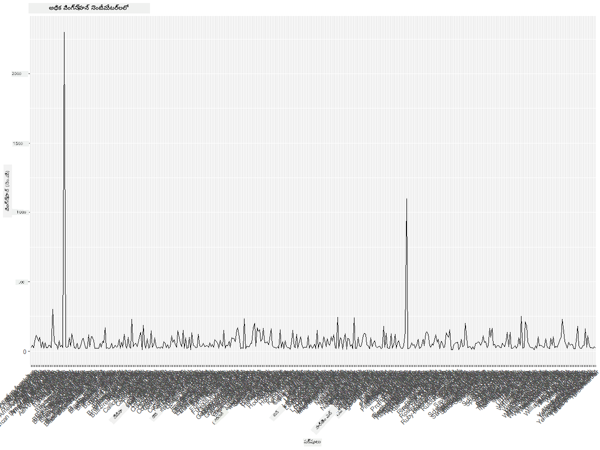
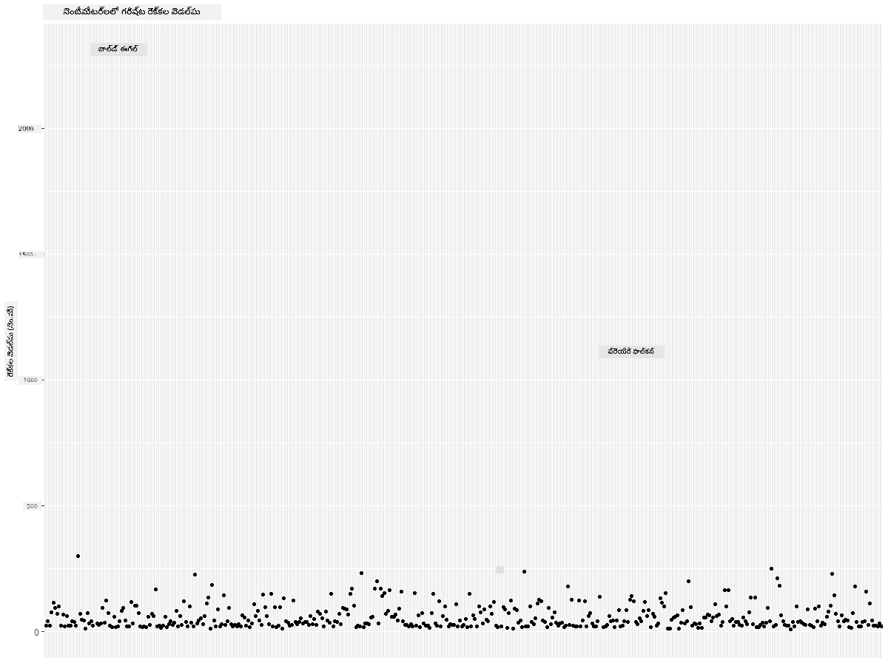
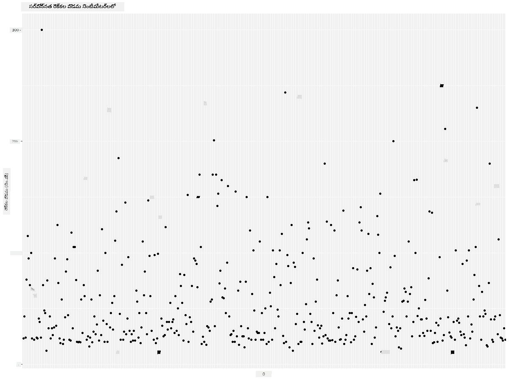
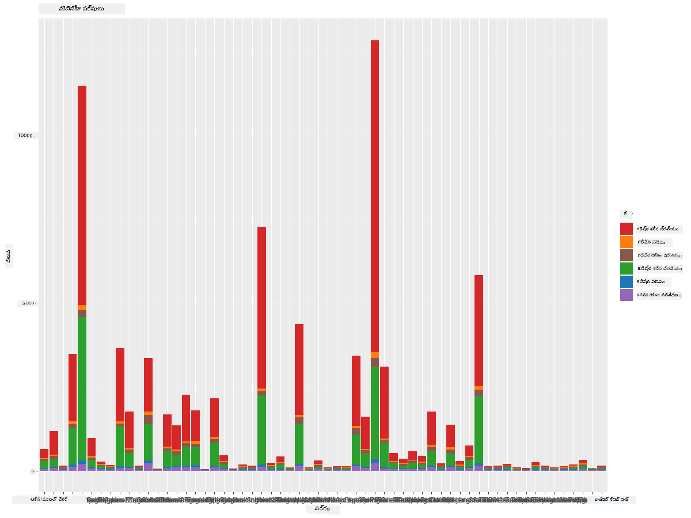
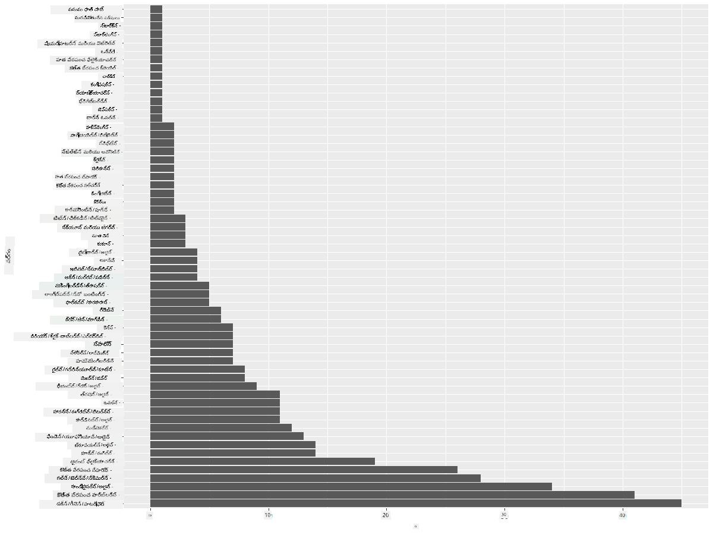
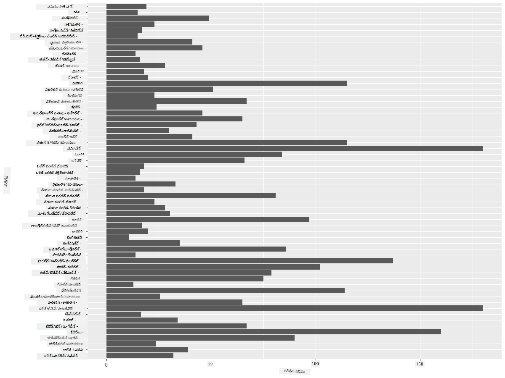
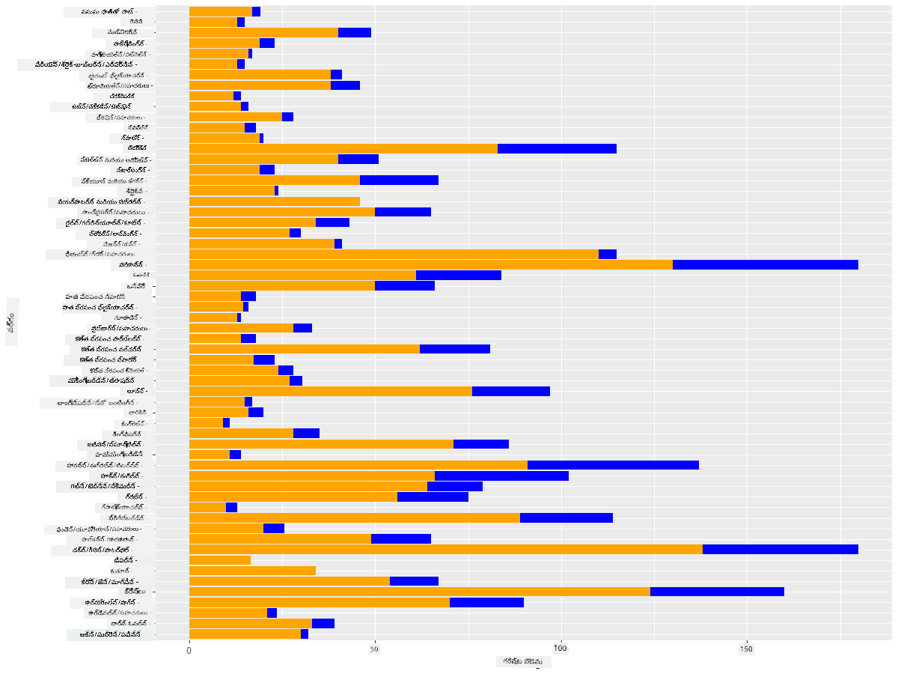

<!--
CO_OP_TRANSLATOR_METADATA:
{
  "original_hash": "22acf28f518a4769ea14fa42f4734b9f",
  "translation_date": "2025-12-19T16:30:58+00:00",
  "source_file": "3-Data-Visualization/R/09-visualization-quantities/README.md",
  "language_code": "te"
}
-->
# పరిమాణాలను దృశ్యీకరించడం
| ద్వారా ](https://github.com/microsoft/Data-Science-For-Beginners/blob/main/sketchnotes/09-Visualizing-Quantities.png)|
|:---:|
| పరిమాణాలను దృశ్యీకరించడం - _స్కెచ్ నోట్ [@nitya](https://twitter.com/nitya) ద్వారా_ |

ఈ పాఠంలో మీరు పరిమాణం అనే భావన చుట్టూ ఆసక్తికరమైన దృశ్యీకరణలను సృష్టించడానికి అందుబాటులో ఉన్న అనేక R ప్యాకేజీలు మరియు లైబ్రరీలను ఎలా ఉపయోగించాలో తెలుసుకుంటారు. మినెసోటా పక్షుల గురించి శుభ్రపరిచిన డేటాసెట్ ఉపయోగించి, మీరు స్థానిక వన్యజీవుల గురించి అనేక ఆసక్తికరమైన విషయాలను తెలుసుకోవచ్చు.  
## [పాఠం ముందు క్విజ్](https://purple-hill-04aebfb03.1.azurestaticapps.net/quiz/16)

## ggplot2 తో రెక్కల వ్యాప్తిని పరిశీలించండి
వివిధ రకాల సాదా మరియు సున్నితమైన ప్లాట్లు మరియు చార్ట్లను సృష్టించడానికి అద్భుతమైన లైబ్రరీ [ggplot2](https://cran.r-project.org/web/packages/ggplot2/index.html). సాధారణంగా, ఈ లైబ్రరీలను ఉపయోగించి డేటాను ప్లాట్ చేయడం అనేది మీ డేటాఫ్రేమ్‌లో మీరు లక్ష్యంగా పెట్టుకున్న భాగాలను గుర్తించడం, ఆ డేటాపై అవసరమైన మార్పులు చేయడం, దాని x మరియు y అక్ష విలువలను కేటాయించడం, ఏ రకమైన ప్లాట్ చూపించాలో నిర్ణయించడం, మరియు ఆ తర్వాత ప్లాట్ చూపించడం అనే ప్రక్రియ.

`ggplot2` అనేది The Grammar of Graphics ఆధారంగా గ్రాఫిక్స్‌ను ప్రకటనాత్మకంగా సృష్టించడానికి ఒక వ్యవస్థ. [The Grammar of Graphics](https://en.wikipedia.org/wiki/Ggplot2) అనేది డేటా దృశ్యీకరణకు సాధారణ పద్ధతి, ఇది గ్రాఫ్‌లను స్కేల్స్ మరియు లేయర్స్ వంటి సారాంశ భాగాలుగా విభజిస్తుంది. అంటే, తక్కువ కోడ్‌తో ఒకవైపు లేదా బహువైపు డేటా కోసం ప్లాట్లు మరియు గ్రాఫ్‌లను సృష్టించడం సులభం కావడం వలన `ggplot2` R లో దృశ్యీకరణలకు అత్యంత ప్రాచుర్యం పొందిన ప్యాకేజీ. వినియోగదారు `ggplot2`కి వేరియబుల్స్‌ను ఎస్టెటిక్స్‌కు ఎలా మ్యాప్ చేయాలో, గ్రాఫికల్ ప్రిమిటివ్స్‌ను ఎలా ఉపయోగించాలో చెబుతారు, మిగతా పనిని `ggplot2` చూసుకుంటుంది.

> ✅ ప్లాట్ = డేటా + ఎస్టెటిక్స్ + జ్యామితి
> - డేటా అంటే డేటాసెట్
> - ఎస్టెటిక్స్ అంటే అధ్యయనం చేయవలసిన వేరియబుల్స్ (x మరియు y వేరియబుల్స్)
> - జ్యామితి అంటే ప్లాట్ రకం (లైన్ ప్లాట్, బార్ ప్లాట్, మొదలైనవి)

మీ డేటా మరియు మీరు చెప్పదలచుకున్న కథ ప్రకారం ఉత్తమ జ్యామితిని (ప్లాట్ రకం) ఎంచుకోండి.

> - ధోరణులను విశ్లేషించడానికి: లైన్, కాలమ్
> - విలువలను పోల్చడానికి: బార్, కాలమ్, పై, స్కాటర్‌ప్లాట్
> - భాగాలు మొత్తం తో ఎలా సంబంధించాయో చూపించడానికి: పై
> - డేటా పంపిణీని చూపించడానికి: స్కాటర్‌ప్లాట్, బార్
> - విలువల మధ్య సంబంధాలను చూపించడానికి: లైన్, స్కాటర్‌ప్లాట్, బబుల్

✅ మీరు ggplot2 కోసం ఈ వివరణాత్మక [చీట్‌షీట్](https://nyu-cdsc.github.io/learningr/assets/data-visualization-2.1.pdf) కూడా చూడవచ్చు.

## పక్షుల రెక్కల వ్యాప్తి విలువలపై లైన్ ప్లాట్ నిర్మించండి

R కన్సోల్ తెరవండి మరియు డేటాసెట్‌ను దిగుమతి చేసుకోండి.  
> గమనిక: డేటాసెట్ ఈ రిపో యొక్క రూట్‌లోని `/data` ఫోల్డర్‌లో నిల్వ చేయబడింది.

డేటాసెట్‌ను దిగుమతి చేసుకుని డేటా యొక్క హెడ్ను (పై 5 వరుసలు) పరిశీలిద్దాం.

```r
birds <- read.csv("../../data/birds.csv",fileEncoding="UTF-8-BOM")
head(birds)
```
డేటా యొక్క హెడ్లో టెక్స్ట్ మరియు సంఖ్యల మిశ్రమం ఉంది:

|      | Name                         | ScientificName         | Category              | Order        | Family   | Genus       | ConservationStatus | MinLength | MaxLength | MinBodyMass | MaxBodyMass | MinWingspan | MaxWingspan |
| ---: | :--------------------------- | :--------------------- | :-------------------- | :----------- | :------- | :---------- | :----------------- | --------: | --------: | ----------: | ----------: | ----------: | ----------: |
|    0 | Black-bellied whistling-duck | Dendrocygna autumnalis | Ducks/Geese/Waterfowl | Anseriformes | Anatidae | Dendrocygna | LC                 |        47 |        56 |         652 |        1020 |          76 |          94 |
|    1 | Fulvous whistling-duck       | Dendrocygna bicolor    | Ducks/Geese/Waterfowl | Anseriformes | Anatidae | Dendrocygna | LC                 |        45 |        53 |         712 |        1050 |          85 |          93 |
|    2 | Snow goose                   | Anser caerulescens     | Ducks/Geese/Waterfowl | Anseriformes | Anatidae | Anser       | LC                 |        64 |        79 |        2050 |        4050 |         135 |         165 |
|    3 | Ross's goose                 | Anser rossii           | Ducks/Geese/Waterfowl | Anseriformes | Anatidae | Anser       | LC                 |      57.3 |        64 |        1066 |        1567 |         113 |         116 |
|    4 | Greater white-fronted goose  | Anser albifrons        | Ducks/Geese/Waterfowl | Anseriformes | Anatidae | Anser       | LC                 |        64 |        81 |        1930 |        3310 |         130 |         165 |

కొన్ని సంఖ్యా డేటాను ప్రాథమిక లైన్ ప్లాట్ ఉపయోగించి ప్లాట్ చేయడం ప్రారంభిద్దాం. ఈ ఆసక్తికరమైన పక్షుల గరిష్ట రెక్కల వ్యాప్తి యొక్క దృశ్యాన్ని మీరు కావాలనుకుంటే.

```r
install.packages("ggplot2")
library("ggplot2")
ggplot(data=birds, aes(x=Name, y=MaxWingspan,group=1)) +
  geom_line() 
```
ఇక్కడ, మీరు `ggplot2` ప్యాకేజీని ఇన్‌స్టాల్ చేసి, తరువాత `library("ggplot2")` కమాండ్ ఉపయోగించి వర్క్‌స్పేస్‌లో దిగుమతి చేసుకుంటారు. ggplot లో ఏదైనా ప్లాట్ చేయడానికి `ggplot()` ఫంక్షన్ ఉపయోగిస్తారు మరియు డేటాసెట్, x మరియు y వేరియబుల్స్‌ను లక్షణాలుగా పేర్కొంటారు. ఈ సందర్భంలో, లైన్ ప్లాట్ చేయాలనుకున్నందున `geom_line()` ఫంక్షన్ ఉపయోగిస్తారు.


మీకు వెంటనే ఏమి కనిపిస్తుంది? కనీసం ఒక అవుట్లయర్ ఉన్నట్లు కనిపిస్తోంది - అది చాలా పెద్ద రెక్కల వ్యాప్తి! 2000+ సెంటీమీటర్ల రెక్కల వ్యాప్తి అంటే 20 మీటర్లకు పైగా - మినెసోటాలో ప్టెరోడాక్టిల్స్ తిరుగుతున్నారా? పరిశీలిద్దాం.

మీరు అవుట్లయర్లను కనుగొనడానికి ఎక్సెల్‌లో త్వరితంగా సార్ట్ చేయవచ్చు, అవి తప్పులే కావచ్చు, కానీ ప్లాట్ నుండి పని కొనసాగించి దృశ్యీకరణ ప్రక్రియ కొనసాగించండి.

x-అక్షకు లేబుల్స్ జోడించి ఏ రకమైన పక్షులు ఉన్నాయో చూపించండి:

```r
ggplot(data=birds, aes(x=Name, y=MaxWingspan,group=1)) +
  geom_line() +
  theme(axis.text.x = element_text(angle = 45, hjust=1))+
  xlab("Birds") +
  ylab("Wingspan (CM)") +
  ggtitle("Max Wingspan in Centimeters")
```
`theme` లో కోణాన్ని పేర్కొంటాము మరియు `xlab()` మరియు `ylab()` లో వరుసగా x మరియు y అక్ష లేబుల్స్‌ను పేర్కొంటాము. `ggtitle()` గ్రాఫ్/ప్లాట్‌కు పేరు ఇస్తుంది.



లేబుల్స్ 45 డిగ్రీల కోణంలో తిరిగినా, చదవడానికి చాలా ఉన్నాయి. వేరే వ్యూహం ప్రయత్నిద్దాం: అవుట్లయర్లకు మాత్రమే లేబుల్స్ ఇవ్వండి మరియు లేబుల్స్‌ను చార్ట్ లోపల సెట్ చేయండి. లేబులింగ్‌కు మరింత స్థలం కోసం స్కాటర్ చార్ట్ ఉపయోగించవచ్చు:

```r
ggplot(data=birds, aes(x=Name, y=MaxWingspan,group=1)) +
  geom_point() +
  geom_text(aes(label=ifelse(MaxWingspan>500,as.character(Name),'')),hjust=0,vjust=0) + 
  theme(axis.title.x=element_blank(), axis.text.x=element_blank(), axis.ticks.x=element_blank())
  ylab("Wingspan (CM)") +
  ggtitle("Max Wingspan in Centimeters") + 
```
ఇక్కడ ఏమి జరుగుతోంది? మీరు `geom_point()` ఫంక్షన్ ఉపయోగించి స్కాటర్ పాయింట్లను ప్లాట్ చేశారు. దీని ద్వారా, `MaxWingspan > 500` ఉన్న పక్షులకు లేబుల్స్ జోడించారు మరియు ప్లాట్‌ను క్లట్టర్ చేయకుండా x అక్ష上的 లేబుల్స్‌ను దాచారు.

మీరు ఏమి కనుగొంటారు?



## మీ డేటాను ఫిల్టర్ చేయండి

బాల్డ్ ఈగిల్ మరియు ప్రేరి ఫాల్కన్, చాలా పెద్ద పక్షులు కావచ్చు, గరిష్ట రెక్కల వ్యాప్తికి అదనంగా 0 తప్పుగా జోడించబడినట్లు కనిపిస్తున్నాయి. 25 మీటర్ల రెక్కల వ్యాప్తి ఉన్న బాల్డ్ ఈగిల్‌ను మీరు కలుసుకోవడం అసాధ్యమే, అయితే ఉంటే దయచేసి మాకు తెలియజేయండి! ఆ రెండు అవుట్లయర్లను తీసేసి కొత్త డేటాఫ్రేమ్ సృష్టిద్దాం:

```r
birds_filtered <- subset(birds, MaxWingspan < 500)

ggplot(data=birds_filtered, aes(x=Name, y=MaxWingspan,group=1)) +
  geom_point() +
  ylab("Wingspan (CM)") +
  xlab("Birds") +
  ggtitle("Max Wingspan in Centimeters") + 
  geom_text(aes(label=ifelse(MaxWingspan>500,as.character(Name),'')),hjust=0,vjust=0) +
  theme(axis.text.x=element_blank(), axis.ticks.x=element_blank())
```
మేము కొత్త డేటాఫ్రేమ్ `birds_filtered` సృష్టించి స్కాటర్ ప్లాట్ చేశాము. అవుట్లయర్లను తీసివేసిన తర్వాత, మీ డేటా మరింత సమగ్రమైనది మరియు అర్థమయ్యేలా మారింది.



ఇప్పుడు రెక్కల వ్యాప్తి పరంగా కనీసం శుభ్రమైన డేటాసెట్ ఉన్నందున, ఈ పక్షుల గురించి మరింత తెలుసుకుందాం.

లైన్ మరియు స్కాటర్ ప్లాట్లు డేటా విలువలు మరియు వాటి పంపిణీ గురించి సమాచారం చూపించగలవు, కానీ ఈ డేటాసెట్‌లోని విలువలను మనం ఆలోచించాలి. మీరు ఈ ప్రశ్నలకు సమాధానాలు కనుగొనడానికి దృశ్యీకరణలు సృష్టించవచ్చు:

> పక్షుల ఎన్ని వర్గాలు ఉన్నాయి, వాటి సంఖ్య ఎంత?
> ఎన్ని పక్షులు అంతరించిపోయినవి, ప్రమాదంలో ఉన్నవి, అరుదైనవి లేదా సాధారణమైనవి?
> లినియస్ యొక్క పదజాలంలో వివిధ జెనస్ మరియు ఆర్డర్స్ ఎన్ని?

## బార్ చార్ట్లను అన్వేషించండి

డేటా సమూహాలను చూపించడానికి బార్ చార్ట్లు ఉపయోగకరంగా ఉంటాయి. ఈ డేటాసెట్‌లో ఉన్న పక్షుల వర్గాలను పరిశీలించి ఏది సంఖ్యలో ఎక్కువగా ఉందో చూద్దాం. ఫిల్టర్ చేసిన డేటాపై బార్ చార్ట్ సృష్టిద్దాం.

```r
install.packages("dplyr")
install.packages("tidyverse")

library(lubridate)
library(scales)
library(dplyr)
library(ggplot2)
library(tidyverse)

birds_filtered %>% group_by(Category) %>%
  summarise(n=n(),
  MinLength = mean(MinLength),
  MaxLength = mean(MaxLength),
  MinBodyMass = mean(MinBodyMass),
  MaxBodyMass = mean(MaxBodyMass),
  MinWingspan=mean(MinWingspan),
  MaxWingspan=mean(MaxWingspan)) %>% 
  gather("key", "value", - c(Category, n)) %>%
  ggplot(aes(x = Category, y = value, group = key, fill = key)) +
  geom_bar(stat = "identity") +
  scale_fill_manual(values = c("#D62728", "#FF7F0E", "#8C564B","#2CA02C", "#1F77B4", "#9467BD")) +                   
  xlab("Category")+ggtitle("Birds of Minnesota")

```
తదుపరి కోడ్‌లో, డేటాను మానిప్యులేట్ చేసి గ్రూప్ చేయడానికి సహాయపడే [dplyr](https://www.rdocumentation.org/packages/dplyr/versions/0.7.8) మరియు [lubridate](https://www.rdocumentation.org/packages/lubridate/versions/1.8.0) ప్యాకేజీలను ఇన్‌స్టాల్ చేస్తారు. మొదట, పక్షుల `Category` ప్రకారం డేటాను గ్రూప్ చేసి, `MinLength`, `MaxLength`, `MinBodyMass`, `MaxBodyMass`, `MinWingspan`, `MaxWingspan` కాలమ్స్‌ను సమ్మరీ చేస్తారు. తరువాత, `ggplot2` ప్యాకేజీ ఉపయోగించి బార్ చార్ట్ ప్లాట్ చేసి వేర్వేరు వర్గాల రంగులు మరియు లేబుల్స్‌ను పేర్కొంటారు.



ఈ బార్ చార్ట్ చదవడానికి కష్టమైనది ఎందుకంటే చాలా డేటా గ్రూప్ చేయబడలేదు. మీరు ప్లాట్ చేయదలచుకున్న డేటాను మాత్రమే ఎంచుకోవాలి, కాబట్టి పక్షుల వర్గం ఆధారంగా వారి పొడవును చూద్దాం.

మీ డేటాను పక్షుల వర్గం మాత్రమే కలిగి ఉండేలా ఫిల్టర్ చేయండి.

చాలా వర్గాలు ఉన్నందున, ఈ చార్ట్‌ను నిలువుగా ప్రదర్శించి అందరి డేటా కోసం ఎత్తును సర్దుబాటు చేయవచ్చు:

```r
birds_count<-dplyr::count(birds_filtered, Category, sort = TRUE)
birds_count$Category <- factor(birds_count$Category, levels = birds_count$Category)
ggplot(birds_count,aes(Category,n))+geom_bar(stat="identity")+coord_flip()
```
ముందుగా `Category` కాలమ్‌లోని ప్రత్యేక విలువలను లెక్కించి, వాటిని కొత్త డేటాఫ్రేమ్ `birds_count` లో సర్దుబాటు చేస్తారు. ఈ సర్దుబాటు చేసిన డేటాను అదే స్థాయిలో ఫ్యాక్టర్ చేసి, సర్దుబాటు చేసిన విధంగా ప్లాట్ చేయబడుతుంది. `ggplot2` ఉపయోగించి బార్ చార్ట్ ప్లాట్ చేస్తారు. `coord_flip()` హారిజాంటల్ బార్లను ప్లాట్ చేస్తుంది.



ఈ బార్ చార్ట్ ప్రతి వర్గంలో పక్షుల సంఖ్యను బాగా చూపిస్తుంది. ఒక చూపులోనే, ఈ ప్రాంతంలో అత్యధిక సంఖ్యలో పక్షులు Ducks/Geese/Waterfowl వర్గంలో ఉన్నాయని మీరు చూడవచ్చు. మినెసోటా '10,000 సరస్సుల భూమి' కాబట్టి ఇది ఆశ్చర్యకరం కాదు!

✅ ఈ డేటాసెట్‌పై మరిన్ని లెక్కింపులు ప్రయత్నించండి. ఏదైనా ఆశ్చర్యంగా ఉందా?

## డేటాను పోల్చడం

మీరు గ్రూప్ చేసిన డేటాను వేరే అక్షాలతో పోల్చడం ప్రయత్నించవచ్చు. పక్షుల వర్గం ఆధారంగా గరిష్ట పొడవు (MaxLength) పోలిక ప్రయత్నించండి:

```r
birds_grouped <- birds_filtered %>%
  group_by(Category) %>%
  summarise(
  MaxLength = max(MaxLength, na.rm = T),
  MinLength = max(MinLength, na.rm = T)
           ) %>%
  arrange(Category)
  
ggplot(birds_grouped,aes(Category,MaxLength))+geom_bar(stat="identity")+coord_flip()
```
`birds_filtered` డేటాను `Category` ప్రకారం గ్రూప్ చేసి బార్ గ్రాఫ్ ప్లాట్ చేస్తారు.



ఇక్కడ ఏ ఆశ్చర్యం లేదు: హమ్మింగ్‌బర్డ్స్‌కు పెలికాన్స్ లేదా గీస్లతో పోలిస్తే తక్కువ MaxLength ఉంటుంది. డేటా తార్కికంగా అర్థమయ్యేలా ఉండటం మంచిది!

మీరు మరింత ఆసక్తికరమైన బార్ చార్ట్లను సృష్టించవచ్చు, డేటాను సూపరింపోజ్ చేసి. ఒక పక్షుల వర్గంపై కనిష్ట మరియు గరిష్ట పొడవును సూపరింపోజ్ చేద్దాం:

```r
ggplot(data=birds_grouped, aes(x=Category)) +
  geom_bar(aes(y=MaxLength), stat="identity", position ="identity",  fill='blue') +
  geom_bar(aes(y=MinLength), stat="identity", position="identity", fill='orange')+
  coord_flip()
```


## 🚀 సవాలు

ఈ పక్షుల డేటాసెట్ ఒక ప్రత్యేక పర్యావరణ వ్యవస్థలోని వివిధ రకాల పక్షుల గురించి సమృద్ధిగా సమాచారం అందిస్తుంది. ఇంటర్నెట్‌లో వెతకండి మరియు ఇతర పక్షుల డేటాసెట్లను కనుగొనండి. ఈ పక్షుల చుట్టూ చార్ట్లు మరియు గ్రాఫ్‌లను నిర్మించడం సాధన చేయండి, మీరు తెలియని విషయాలను కనుగొనండి.

## [పాఠం తర్వాత క్విజ్](https://purple-hill-04aebfb03.1.azurestaticapps.net/quiz/17)

## సమీక్ష & స్వీయ అధ్యయనం

ఈ మొదటి పాఠం `ggplot2` ఉపయోగించి పరిమాణాలను ఎలా దృశ్యీకరించాలో కొంత సమాచారం ఇచ్చింది. దృశ్యీకరణ కోసం డేటాసెట్లతో పని చేసే ఇతర మార్గాల గురించి పరిశోధన చేయండి. [Lattice](https://stat.ethz.ch/R-manual/R-devel/library/lattice/html/Lattice.html) మరియు [Plotly](https://github.com/plotly/plotly.R#readme) వంటి ఇతర ప్యాకేజీలను ఉపయోగించి మీరు దృశ్యీకరించగల డేటాసెట్లను వెతకండి.

## అసైన్‌మెంట్
[లైన్లు, స్కాటర్స్, మరియు బార్లు](assignment.md)

---

<!-- CO-OP TRANSLATOR DISCLAIMER START -->
**అస్పష్టత**:  
ఈ పత్రాన్ని AI అనువాద సేవ [Co-op Translator](https://github.com/Azure/co-op-translator) ఉపయోగించి అనువదించబడింది. మేము ఖచ్చితత్వానికి ప్రయత్నించినప్పటికీ, ఆటోమేటెడ్ అనువాదాల్లో పొరపాట్లు లేదా తప్పిదాలు ఉండవచ్చు. అసలు పత్రం దాని స్వదేశీ భాషలోనే అధికారిక మూలంగా పరిగణించాలి. ముఖ్యమైన సమాచారానికి, ప్రొఫెషనల్ మానవ అనువాదం సిఫార్సు చేయబడుతుంది. ఈ అనువాదం వాడకంలో ఏర్పడిన ఏవైనా అపార్థాలు లేదా తప్పుదారుల కోసం మేము బాధ్యత వహించము.
<!-- CO-OP TRANSLATOR DISCLAIMER END -->