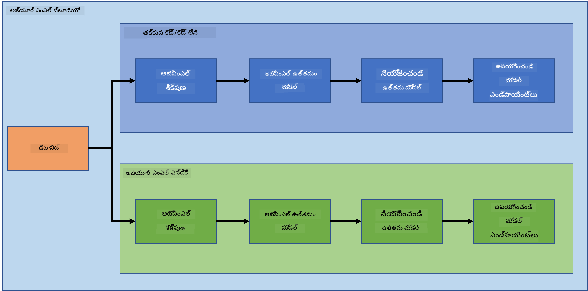

<!--
CO_OP_TRANSLATOR_METADATA:
{
  "original_hash": "8dfe141a0f46f7d253e07f74913c7f44",
  "translation_date": "2025-12-19T13:23:34+00:00",
  "source_file": "5-Data-Science-In-Cloud/README.md",
  "language_code": "te"
}
-->
# క్లౌడ్‌లో డేటా సైన్స్

> ఫోటో [Jelleke Vanooteghem](https://unsplash.com/@ilumire) నుండి [Unsplash](https://unsplash.com/s/photos/cloud?orientation=landscape)

బిగ్ డేటాతో డేటా సైన్స్ చేయడంలో, క్లౌడ్ ఒక గేమ్ చేంజర్ కావచ్చు. తదుపరి మూడు పాఠాలలో, క్లౌడ్ అంటే ఏమిటి మరియు అది ఎందుకు చాలా సహాయకరమో మనం చూడబోతున్నాము. మనం హార్ట్ ఫెయిల్యూర్ డేటాసెట్‌ను కూడా పరిశీలించి, ఎవరికైనా హార్ట్ ఫెయిల్యూర్ ఉండే అవకాశాన్ని అంచనా వేయడానికి ఒక మోడల్‌ను నిర్మించబోతున్నాము. మోడల్‌ను శిక్షణ ఇవ్వడం, డిప్లాయ్ చేయడం మరియు రెండు వేర్వేరు మార్గాల్లో వినియోగించడం కోసం క్లౌడ్ శక్తిని ఉపయోగిస్తాము. ఒక మార్గం లో కోడ్/నో కోడ్ ఫ్యాషన్‌లో కేవలం యూజర్ ఇంటర్‌ఫేస్ ఉపయోగించడం, మరొక మార్గం Azure మెషీన్ లెర్నింగ్ సాఫ్ట్‌వేర్ డెవలపర్ కిట్ (Azure ML SDK) ఉపయోగించడం.

### విషయాలు

1. [డేటా సైన్స్ కోసం క్లౌడ్ ఎందుకు ఉపయోగించాలి?](17-Introduction/README.md)
2. [క్లౌడ్‌లో డేటా సైన్స్: "లో కోడ్/నో కోడ్" విధానం](18-Low-Code/README.md)
3. [క్లౌడ్‌లో డేటా సైన్స్: "Azure ML SDK" విధానం](19-Azure/README.md)

### క్రెడిట్స్
ఈ పాఠాలు ☁️ మరియు 💕 తో [Maud Levy](https://twitter.com/maudstweets) మరియు [Tiffany Souterre](https://twitter.com/TiffanySouterre) రచించారు

హార్ట్ ఫెయిల్యూర్ ప్రిడిక్షన్ ప్రాజెక్ట్ కోసం డేటా [Larxel](https://www.kaggle.com/andrewmvd) నుండి [Kaggle](https://www.kaggle.com/andrewmvd/heart-failure-clinical-data) లో పొందబడింది. ఇది [Attribution 4.0 International (CC BY 4.0)](https://creativecommons.org/licenses/by/4.0/) లైసెన్స్ కింద ఉంది.

---

<!-- CO-OP TRANSLATOR DISCLAIMER START -->
**అస్పష్టత**:  
ఈ పత్రాన్ని AI అనువాద సేవ [Co-op Translator](https://github.com/Azure/co-op-translator) ఉపయోగించి అనువదించబడింది. మేము ఖచ్చితత్వానికి ప్రయత్నించినప్పటికీ, ఆటోమేటెడ్ అనువాదాల్లో పొరపాట్లు లేదా తప్పిదాలు ఉండవచ్చు. అసలు పత్రం దాని స్వదేశీ భాషలోనే అధికారిక మూలంగా పరిగణించాలి. ముఖ్యమైన సమాచారానికి, ప్రొఫెషనల్ మానవ అనువాదం చేయించుకోవడం మంచిది. ఈ అనువాదం వలన కలిగే ఏవైనా అపార్థాలు లేదా తప్పుదారుల బాధ్యత మేము తీసుకోము.
<!-- CO-OP TRANSLATOR DISCLAIMER END -->