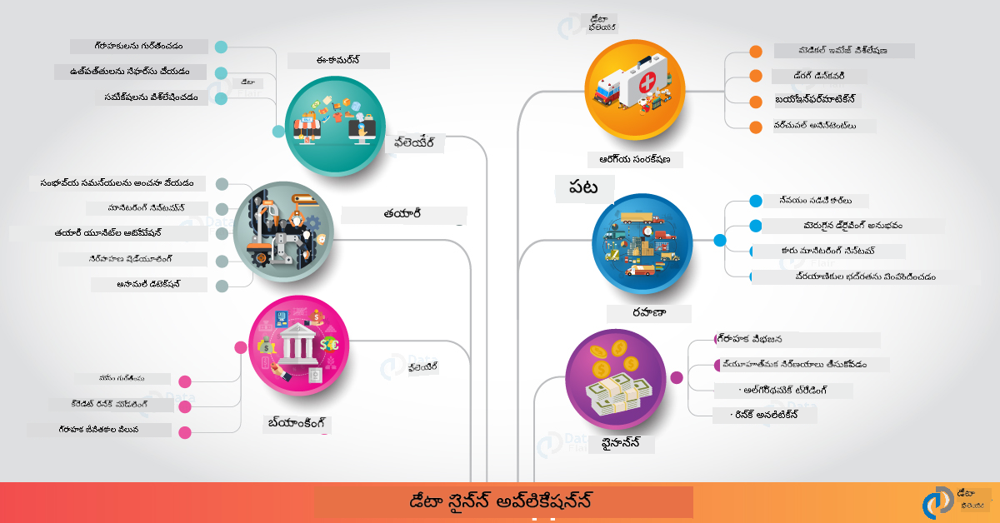

<!--
CO_OP_TRANSLATOR_METADATA:
{
  "original_hash": "0f67a4139454816631526779a456b734",
  "translation_date": "2025-12-19T16:40:41+00:00",
  "source_file": "6-Data-Science-In-Wild/20-Real-World-Examples/README.md",
  "language_code": "te"
}
-->
# వాస్తవ ప్రపంచంలో డేటా సైన్స్

|  ](../../sketchnotes/20-DataScience-RealWorld.png) |
| :--------------------------------------------------------------------------------------------------------------: |
|               వాస్తవ ప్రపంచంలో డేటా సైన్స్ - _స్కెచ్‌నోట్ [@nitya](https://twitter.com/nitya) ద్వారా_               |

మనం ఈ నేర్చుకునే ప్రయాణం చివరికి దాదాపు చేరుకున్నాము!

మనం డేటా సైన్స్ మరియు నైతికత నిర్వచనాలతో ప్రారంభించి, డేటా విశ్లేషణ మరియు విజువలైజేషన్ కోసం వివిధ సాధనాలు & సాంకేతికతలను అన్వేషించాము, డేటా సైన్స్ జీవన చక్రాన్ని సమీక్షించాము, మరియు క్లౌడ్ కంప్యూటింగ్ సేవలతో డేటా సైన్స్ వర్క్‌ఫ్లోలను స్కేలు చేయడం మరియు ఆటోమేట్ చేయడం చూశాము. కాబట్టి, మీరు ఆశ్చర్యపోతున్నారు: _"నేను ఈ అన్ని నేర్చుకున్న విషయాలను వాస్తవ ప్రపంచ సందర్భాలకు ఎలా ఖచ్చితంగా అన్వయించగలను?"_

ఈ పాఠంలో, పరిశ్రమలో డేటా సైన్స్ యొక్క వాస్తవ ప్రపంచ అనువర్తనాలను పరిశీలిస్తాము మరియు పరిశోధన, డిజిటల్ హ్యూమానిటీస్, మరియు సస్టెయినబిలిటీ సందర్భాలలో ప్రత్యేక ఉదాహరణలను లోతుగా చూడబోతున్నాము. విద్యార్థి ప్రాజెక్ట్ అవకాశాలను పరిశీలించి, మీ నేర్చుకునే ప్రయాణాన్ని కొనసాగించడానికి సహాయపడే ఉపయోగకరమైన వనరులతో ముగిస్తాము!
## పాఠం ముందు క్విజ్

## [పాఠం ముందు క్విజ్](https://ff-quizzes.netlify.app/en/ds/quiz/38)

## డేటా సైన్స్ + పరిశ్రమ

AI ప్రజాస్వామ్యీకరణకు కృతజ్ఞతలు, డెవలపర్లు ఇప్పుడు AI-నడిచే నిర్ణయాలు మరియు డేటా ఆధారిత అవగాహనలను వినియోగదారు అనుభవాలు మరియు అభివృద్ధి వర్క్‌ఫ్లోలలో డిజైన్ చేయడం మరియు సమీకరించడం సులభంగా కనుగొంటున్నారు. పరిశ్రమలో డేటా సైన్స్ "అన్వయించబడిన" వాస్తవ ప్రపంచ అనువర్తనాల కొన్ని ఉదాహరణలు ఇక్కడ ఉన్నాయి:

 * [Google Flu Trends](https://www.wired.com/2015/10/can-learn-epic-failure-google-flu-trends/) డేటా సైన్స్ ఉపయోగించి శోధన పదాలను ఫ్లూ ట్రెండ్స్‌తో సంబంధపెట్టింది. ఈ విధానం లోపాలు ఉన్నప్పటికీ, డేటా ఆధారిత ఆరోగ్య సంరక్షణ అంచనాల అవకాశాలు (మరియు సవాళ్లు) పై అవగాహన పెంచింది.

 * [UPS Routing Predictions](https://www.technologyreview.com/2018/11/21/139000/how-ups-uses-ai-to-outsmart-bad-weather/) - UPS ఎలా డేటా సైన్స్ మరియు మెషీన్ లెర్నింగ్ ఉపయోగించి వాతావరణ పరిస్థితులు, ట్రాఫిక్ నమూనాలు, డెలివరీ గడువులు మరియు మరిన్ని పరిగణలోకి తీసుకుని డెలివరీకి ఉత్తమ మార్గాలను అంచనా వేస్తుందో వివరిస్తుంది.

 * [NYC Taxicab Route Visualization](http://chriswhong.github.io/nyctaxi/) - [Freedom Of Information Laws](https://chriswhong.com/open-data/foil_nyc_taxi/) ఉపయోగించి సేకరించిన డేటా NYC క్యాబ్‌ల ఒక రోజును విజువలైజ్ చేయడంలో సహాయపడింది, అవి బిజీ నగరంలో ఎలా నావిగేట్ అవుతాయో, వారు సంపాదించే డబ్బు, మరియు ప్రతి 24 గంటల కాలంలో ప్రయాణాల వ్యవధి గురించి మనకు అర్థం చేసుకోవడంలో సహాయపడింది.

 * [Uber Data Science Workbench](https://eng.uber.com/dsw/) - మిలియన్ల ఉబెర్ ప్రయాణాల నుండి సేకరించిన డేటా (పికప్ & డ్రాప్ ఆఫ్ లొకేషన్లు, ప్రయాణ వ్యవధి, ప్రాధాన్యత మార్గాలు మొదలైనవి) ను ఉపయోగించి ధర నిర్ణయం, భద్రత, మోసం గుర్తింపు మరియు నావిగేషన్ నిర్ణయాలకు సహాయపడే డేటా విశ్లేషణ సాధనాన్ని *ప్రతి రోజు* నిర్మిస్తుంది.

 * [Sports Analytics](https://towardsdatascience.com/scope-of-analytics-in-sports-world-37ed09c39860) - _పూర్వానుమాన విశ్లేషణ_ (టీమ్ మరియు ప్లేయర్ విశ్లేషణ - [Moneyball](https://datasciencedegree.wisconsin.edu/blog/moneyball-proves-importance-big-data-big-ideas/) ను ఆలోచించండి - మరియు ఫ్యాన్ నిర్వహణ) మరియు _డేటా విజువలైజేషన్_ (టీమ్ & ఫ్యాన్ డాష్‌బోర్డ్లు, ఆటలు మొదలైనవి) పై దృష్టి సారిస్తుంది, టాలెంట్ స్కౌటింగ్, క్రీడా జూదం మరియు ఇన్వెంటరీ/వెన్యూ నిర్వహణ వంటి అనువర్తనాలతో.

 * [Data Science in Banking](https://data-flair.training/blogs/data-science-in-banking/) - ఆర్థిక పరిశ్రమలో డేటా సైన్స్ విలువను హైలైట్ చేస్తుంది, ప్రమాద మోడలింగ్ మరియు మోసం గుర్తింపు నుండి కస్టమర్ విభజన, రియల్-టైమ్ అంచనా మరియు సిఫార్సు వ్యవస్థల వరకు అనువర్తనాలతో. పూర్వానుమాన విశ్లేషణలు [క్రెడిట్ స్కోర్లు](https://dzone.com/articles/using-big-data-and-predictive-analytics-for-credit) వంటి కీలక చర్యలను కూడా నడిపిస్తాయి.

 * [Data Science in Healthcare](https://data-flair.training/blogs/data-science-in-healthcare/) - వైద్య ఇమేజింగ్ (ఉదా: MRI, X-Ray, CT-స్కాన్), జెనోమిక్స్ (DNA సీక్వెన్సింగ్), ఔషధ అభివృద్ధి (ప్రమాద అంచనా, విజయ అంచనా), పూర్వానుమాన విశ్లేషణ (రోగి సంరక్షణ & సరఫరా లాజిస్టిక్స్), వ్యాధి ట్రాకింగ్ & నివారణ వంటి అనువర్తనాలను హైలైట్ చేస్తుంది.

 చిత్రం క్రెడిట్: [Data Flair: 6 అద్భుతమైన డేటా సైన్స్ అనువర్తనాలు](https://data-flair.training/blogs/data-science-applications/)

ఈ చిత్రం ఇతర డొమైన్‌లు మరియు డేటా సైన్స్ సాంకేతికతలను అన్వయించడానికి ఉదాహరణలను చూపిస్తుంది. ఇతర అనువర్తనాలను అన్వేషించాలనుకుంటున్నారా? క్రింద [సమీక్ష & స్వీయ అధ్యయనం](../../../../6-Data-Science-In-Wild/20-Real-World-Examples) విభాగాన్ని చూడండి.

## డేటా సైన్స్ + పరిశోధన

|  ](../../sketchnotes/20-DataScience-Research.png) |
| :---------------------------------------------------------------------------------------------------------------: |
|              డేటా సైన్స్ & పరిశోధన - _స్కెచ్‌నోట్ [@nitya](https://twitter.com/nitya) ద్వారా_              |

వాస్తవ ప్రపంచ అనువర్తనాలు తరచుగా పరిశ్రమ ఉపయోగ కేసులపై స్కేలు చేస్తాయి, అయితే _పరిశోధన_ అనువర్తనాలు మరియు ప్రాజెక్టులు రెండు దృష్టికోణాల నుండి ఉపయోగకరంగా ఉండవచ్చు:

* _నవీనత అవకాశాలు_ - అధునాతన భావనల వేగవంతమైన ప్రోటోటైపింగ్ మరియు తదుపరి తరం అనువర్తనాల కోసం వినియోగదారు అనుభవాల పరీక్ష.
* _ప్రయోగ సవాళ్లు_ - వాస్తవ ప్రపంచ సందర్భాలలో డేటా సైన్స్ సాంకేతికతల వల్ల కలిగే హానులు లేదా అనుకోని పరిణామాలను పరిశీలించడం.

విద్యార్థులకు, ఈ పరిశోధన ప్రాజెక్టులు విషయంపై మీ అవగాహనను మెరుగుపరచడానికి మరియు ఆసక్తి ఉన్న ప్రాంతాలలో పని చేస్తున్న సంబంధిత వ్యక్తులు లేదా బృందాలతో మీ అవగాహన మరియు పాల్గొనడం విస్తరించడానికి నేర్చుకునే మరియు సహకార అవకాశాలను అందించవచ్చు. కాబట్టి పరిశోధన ప్రాజెక్టులు ఎలా ఉంటాయి మరియు అవి ఎలా ప్రభావం చూపగలవు?

ఒక ఉదాహరణను చూద్దాం - జాయ్ బుఓలామ్విని (MIT మీడియా ల్యాబ్స్) నుండి [MIT Gender Shades Study](http://gendershades.org/overview.html) మరియు [సంతకం పరిశోధన పత్రం](http://proceedings.mlr.press/v81/buolamwini18a/buolamwini18a.pdf) టిమ్నిట్ గేబ్రూ (అప్పుడు మైక్రోసాఫ్ట్ రీసెర్చ్) తో సహ-రచయితగా, ఇది కేంద్రీకృతమైంది:

 * **ఏమి:** పరిశోధన ప్రాజెక్ట్ లక్ష్యం _లింగం మరియు చర్మ రకం ఆధారంగా ఆటోమేటెడ్ ముఖ విశ్లేషణ అల్గోరిథమ్స్ మరియు డేటాసెట్‌లలో ఉన్న పక్షపాతాన్ని అంచనా వేయడం_.
 * **ఎందుకు:** ముఖ విశ్లేషణను చట్ట అమలు, విమానాశ్రయ భద్రత, నియామక వ్యవస్థలు మరియు మరిన్ని ప్రాంతాలలో ఉపయోగిస్తారు - తప్పు వర్గీకరణలు (ఉదా: పక్షపాతం కారణంగా) ప్రభావిత వ్యక్తులు లేదా సమూహాలకు ఆర్థిక మరియు సామాజిక హానులు కలిగించవచ్చు. పక్షపాతాలను అర్థం చేసుకోవడం (మరియు తొలగించడం లేదా తగ్గించడం) వినియోగంలో న్యాయసమ్మతతకు కీలకం.
 * **ఎలా:** పరిశోధకులు గమనించారు ప్రస్తుత బెంచ్‌మార్కులు ఎక్కువగా తేలికపాటి చర్మం కలిగిన వ్యక్తులను ఉపయోగిస్తున్నాయని, మరియు లింగం మరియు చర్మ రకం ద్వారా _మరింత సమతుల్యమైన_ కొత్త డేటా సెట్ (1000+ చిత్రాలు) సేకరించారు. ఈ డేటా సెట్‌ను మైక్రోసాఫ్ట్, IBM & Face++ నుండి మూడు లింగ వర్గీకరణ ఉత్పత్తుల ఖచ్చితత్వాన్ని అంచనా వేయడానికి ఉపయోగించారు.

ఫలితాలు చూపించాయి మొత్తం వర్గీకరణ ఖచ్చితత్వం మంచి ఉన్నప్పటికీ, వివిధ ఉపసమూహాల మధ్య లోపాల రేట్లలో గమనించదగిన తేడా ఉంది - **తప్పు లింగ నిర్ధారణ** మహిళల లేదా గాఢ చర్మ రకం కలిగిన వ్యక్తుల కోసం ఎక్కువగా ఉండటం, ఇది పక్షపాతానికి సూచిక.

**ప్రధాన ఫలితాలు:** డేటా సైన్స్‌కు మరింత _ప్రతినిధి డేటాసెట్‌లు_ (సమతుల్య ఉపసమూహాలు) మరియు మరింత _సమగ్ర బృందాలు_ (వివిధ నేపథ్యాలు) అవసరం అని అవగాహన పెంచింది, తద్వారా AI పరిష్కారాలలో ఇలాంటి పక్షపాతాలను ముందుగానే గుర్తించి తొలగించవచ్చు లేదా తగ్గించవచ్చు. ఇలాంటి పరిశోధనా ప్రయత్నాలు అనేక సంస్థలు తమ AI ఉత్పత్తులు మరియు ప్రక్రియలలో న్యాయసమ్మతతను మెరుగుపరచడానికి _జవాబుదారీ AI_ సూత్రాలు మరియు ఆచరణలను నిర్వచించడంలో కూడా కీలకంగా ఉంటాయి.

**మైక్రోసాఫ్ట్‌లో సంబంధిత పరిశోధనా ప్రయత్నాల గురించి తెలుసుకోవాలనుకుంటున్నారా?**

* ఆర్టిఫిషియల్ ఇంటెలిజెన్స్ పై [Microsoft Research Projects](https://www.microsoft.com/research/research-area/artificial-intelligence/?facet%5Btax%5D%5Bmsr-research-area%5D%5B%5D=13556&facet%5Btax%5D%5Bmsr-content-type%5D%5B%5D=msr-project) చూడండి.
* [Microsoft Research Data Science Summer School](https://www.microsoft.com/en-us/research/academic-program/data-science-summer-school/) నుండి విద్యార్థి ప్రాజెక్టులను అన్వేషించండి.
* [Fairlearn](https://fairlearn.org/) ప్రాజెక్ట్ మరియు [Responsible AI](https://www.microsoft.com/en-us/ai/responsible-ai?activetab=pivot1%3aprimaryr6) కార్యక్రమాలను చూడండి.

## డేటా సైన్స్ + హ్యూమానిటీస్

|  ](../../sketchnotes/20-DataScience-Humanities.png) |
| :---------------------------------------------------------------------------------------------------------------: |
|              డేటా సైన్స్ & డిజిటల్ హ్యూమానిటీస్ - _స్కెచ్‌నోట్ [@nitya](https://twitter.com/nitya) ద్వారా_              |

డిజిటల్ హ్యూమానిటీస్ [ఇలా నిర్వచించబడింది](https://digitalhumanities.stanford.edu/about-dh-stanford) "కంప్యూటేషనల్ పద్ధతులను మానవీయ విచారణతో కలిపే ఆచరణల మరియు దృక్పథాల సేకరణగా". [స్టాన్‌ఫర్డ్ ప్రాజెక్టులు](https://digitalhumanities.stanford.edu/projects) వంటి _"రీఫుటింగ్ హిస్టరీ"_ మరియు _"పోయటిక్ థింకింగ్"_ [డిజిటల్ హ్యూమానిటీస్ మరియు డేటా సైన్స్](https://digitalhumanities.stanford.edu/digital-humanities-and-data-science) మధ్య సంబంధాన్ని చూపిస్తాయి - నెట్‌వర్క్ విశ్లేషణ, సమాచార విజువలైజేషన్, స్థల మరియు పాఠ విశ్లేషణ వంటి సాంకేతికతలను ప్రాముఖ్యం ఇస్తూ, ఇవి మనకు చారిత్రక మరియు సాహిత్య డేటా సెట్‌లను తిరిగి పరిశీలించి కొత్త అవగాహన మరియు దృష్టికోణాలను పొందడంలో సహాయపడతాయి.

*ఈ విభాగంలో ప్రాజెక్టును అన్వేషించి విస్తరించాలనుకుంటున్నారా?*

["Emily Dickinson and the Meter of Mood"](https://gist.github.com/jlooper/ce4d102efd057137bc000db796bfd671) చూడండి - [జెన్ లూపర్](https://twitter.com/jenlooper) నుండి ఒక గొప్ప ఉదాహరణ, ఇది డేటా సైన్స్ ఉపయోగించి పరిచయమైన కవిత్వాన్ని తిరిగి పరిశీలించి దాని అర్థం మరియు రచయిత యొక్క కృషిని కొత్త సందర్భాలలో మళ్లీ అంచనా వేయవచ్చా అని అడుగుతుంది. ఉదాహరణకు, _కవిత్వం రచించబడిన సీజన్‌ను దాని టోన్ లేదా భావాన్ని విశ్లేషించడం ద్వారా అంచనా వేయగలమా_ - మరియు ఇది రచయిత యొక్క మానసిక స్థితి గురించి సంబంధిత కాలంలో ఏమి చెబుతుంది?

ఆ ప్రశ్నకు సమాధానం ఇవ్వడానికి, మనం డేటా సైన్స్ జీవన చక్రం దశలను అనుసరిస్తాము:
 * [`డేటా సేకరణ`](https://gist.github.com/jlooper/ce4d102efd057137bc000db796bfd671#acquiring-the-dataset) - విశ్లేషణ కోసం సంబంధిత డేటాసెట్ సేకరించడానికి. ఎంపికలు API ఉపయోగించడం (ఉదా: [Poetry DB API](https://poetrydb.org/index.html)) లేదా వెబ్ పేజీలను స్క్రాప్ చేయడం (ఉదా: [Project Gutenberg](https://www.gutenberg.org/files/12242/12242-h/12242-h.htm)) [Scrapy](https://scrapy.org/) వంటి సాధనాలతో.
 * [`డేటా శుభ్రపరిచే ప్రక్రియ`](https://gist.github.com/jlooper/ce4d102efd057137bc000db796bfd671#clean-the-data) - టెక్స్ట్‌ను ఎలా ఫార్మాట్ చేయవచ్చో, శుభ్రపరచవచ్చో మరియు సులభతరం చేయవచ్చో Visual Studio Code మరియు Microsoft Excel వంటి ప్రాథమిక సాధనాలతో వివరించబడింది.
 * [`డేటా విశ్లేషణ`](https://gist.github.com/jlooper/ce4d102efd057137bc000db796bfd671#working-with-the-data-in-a-notebook) - ఇప్పుడు డేటాసెట్‌ను "నోట్బుక్స్" లోకి దిగుమతి చేసుకుని, Python ప్యాకేజీలు (pandas, numpy, matplotlib వంటి) ఉపయోగించి డేటాను సజావుగా నిర్వహించి విజువలైజ్ చేయవచ్చని వివరించబడింది.
 * [`భావ విశ్లేషణ`](https://gist.github.com/jlooper/ce4d102efd057137bc000db796bfd671#sentiment-analysis-using-cognitive-services) - Text Analytics వంటి క్లౌడ్ సేవలను, [Power Automate](https://flow.microsoft.com/en-us/) వంటి లో-కోడ్ సాధనాలతో ఆటోమేటెడ్ డేటా ప్రాసెసింగ్ వర్క్‌ఫ్లోల కోసం ఎలా సమీకరించవచ్చో వివరించబడింది.

ఈ వర్క్‌ఫ్లో ఉపయోగించి, కవిత్వాల భావంపై సీజనల్ ప్రభావాలను అన్వేషించవచ్చు, మరియు రచయితపై మన స్వంత దృష్టికోణాలను రూపొందించడంలో సహాయపడుతుంది. మీరు స్వయంగా ప్రయత్నించండి - ఆపై నోట్బుక్‌ను విస్తరించి ఇతర ప్రశ్నలను అడగండి లేదా డేటాను కొత్త రీతుల్లో విజువలైజ్ చేయండి!

> మీరు ఈ విచారణ మార్గాలను అనుసరించడానికి [డిజిటల్ హ్యూమానిటీస్ టూల్‌కిట్](https://github.com/Digital-Humanities-Toolkit) లోని కొన్ని సాధనాలను ఉపయోగించవచ్చు

## డేటా సైన్స్ + సస్టెయినబిలిటీ

|  ](../../sketchnotes/20-DataScience-Sustainability.png) |
| :---------------------------------------------------------------------------------------------------------------: |
|              డేటా సైన్స్ & సస్టెయినబిలిటీ - _స్కెచ్‌నోట్ [@nitya](https://twitter.com/nitya) ద్వారా_              |

[2030 సుస్థిర అభివృద్ధి కార్యాచరణ](https://sdgs.un.org/2030agenda) - 2015లో అన్ని ఐక్యరాజ్యసమితి సభ్యులు ఆమోదించినది - 17 లక్ష్యాలను గుర్తించింది, వాటిలో కొన్ని **గ్రహాన్ని రక్షించడం** మరియు వాతావరణ మార్పు ప్రభావాలను ఎదుర్కోవడంపై దృష్టి సారించాయి. [Microsoft Sustainability](https://www.microsoft.com/en-us/sustainability) కార్యక్రమం ఈ లక్ష్యాలను మద్దతు ఇస్తూ, సాంకేతిక పరిష్కారాలు మరింత సుస్థిర భవిష్యత్తులను నిర్మించడంలో సహాయపడే మార్గాలను అన్వేషిస్తుంది, [4 లక్ష్యాలపై దృష్టి](https://dev.to/azure/a-visual-guide-to-sustainable-software-engineering-53hh) - 2030 నాటికి కార్బన్ నెగటివ్, నీటి పాజిటివ్, జీరో వ్యర్థం, మరియు బయో వైవిధ్యంతో ఉండటం.

ఈ సవాళ్లను స్కేలబుల్ మరియు సమయానుకూలంగా ఎదుర్కోవడానికి క్లౌడ్-స్థాయి ఆలోచన మరియు పెద్ద స్థాయి డేటా అవసరం. [Planetary Computer](https://planetarycomputer.microsoft.com/) కార్యక్రమం డేటా శాస్త్రవేత్తలు మరియు డెవలపర్లకు ఈ ప్రయత్నంలో సహాయపడేందుకు 4 భాగాలను అందిస్తుంది:
 
 * [డేటా క్యాటలాగ్](https://planetarycomputer.microsoft.com/catalog) - భూమి వ్యవస్థల డేటా పెటాబైట్లతో (ఉచితం & Azure-హోస్టెడ్).
 * [Planetary API](https://planetarycomputer.microsoft.com/docs/reference/stac/) - వినియోగదారులు స్థలం మరియు కాలం అంతటా సంబంధిత డేటాను శోధించడానికి సహాయపడుతుంది.
 * [హబ్](https://planetarycomputer.microsoft.com/docs/overview/environment/) - శాస్త్రవేత్తలు భారీ భూభౌతిక డేటాసెట్‌లను ప్రాసెస్ చేయడానికి నిర్వహించబడే వాతావరణం.
 * [అప్లికేషన్లు](https://planetarycomputer.microsoft.com/applications) - సుస్థిరత అవగాహన కోసం ఉపయోగాల & సాధనాలను ప్రదర్శించండి.

**ది ప్లానెటరీ కంప్యూటర్ ప్రాజెక్ట్ ప్రస్తుతం ప్రివ్యూ లో ఉంది (సెప్టెంబర్ 2021 నాటికి)** - డేటా సైన్స్ ఉపయోగించి సుస్థిరత పరిష్కారాలకు మీరు ఎలా సహకరించవచ్చు అనేది ఇక్కడ ఉంది.

* [అనుమతి అభ్యర్థించండి](https://planetarycomputer.microsoft.com/account/request) అన్వేషణ ప్రారంభించడానికి మరియు సహచరులతో కనెక్ట్ కావడానికి.
* [డాక్యుమెంటేషన్ అన్వేషించండి](https://planetarycomputer.microsoft.com/docs/overview/about) మద్దతు పొందిన డేటాసెట్‌లు మరియు APIలను అర్థం చేసుకోవడానికి.
* [Ecosystem Monitoring](https://analytics-lab.org/ecosystemmonitoring/) వంటి అప్లికేషన్లను ప్రేరణ కోసం అన్వేషించండి.

క్లైమేట్ మార్పు మరియు అడవి నాశనం వంటి ప్రాంతాలలో సంబంధిత అవగాహనలను ప్రదర్శించడానికి లేదా పెంచడానికి మీరు డేటా విజువలైజేషన్‌ను ఎలా ఉపయోగించవచ్చు అనేది ఆలోచించండి. లేదా మరింత సుస్థిర జీవనానికి ప్రేరేపించే ప్రవర్తనా మార్పులకు కొత్త వినియోగదారు అనుభవాలను సృష్టించడానికి అవగాహనలను ఎలా ఉపయోగించవచ్చు అనేది ఆలోచించండి.

## డేటా సైన్స్ + విద్యార్థులు

మేము పరిశ్రమ మరియు పరిశోధనలో వాస్తవ ప్రపంచ అప్లికేషన్ల గురించి మాట్లాడాము, మరియు డిజిటల్ హ్యూమానిటీస్ మరియు సుస్థిరతలో డేటా సైన్స్ అప్లికేషన్ ఉదాహరణలను అన్వేషించాము. కాబట్టి మీరు డేటా సైన్స్ ప్రారంభికులుగా మీ నైపుణ్యాలను ఎలా అభివృద్ధి చేసుకుని మీ నైపుణ్యాలను పంచుకోవచ్చు?

ఇక్కడ మీకు ప్రేరణ ఇచ్చే కొన్ని డేటా సైన్స్ విద్యార్థి ప్రాజెక్టుల ఉదాహరణలు ఉన్నాయి.

 * [MSR డేటా సైన్స్ సమ్మర్ స్కూల్](https://www.microsoft.com/en-us/research/academic-program/data-science-summer-school/#!projects) GitHub [ప్రాజెక్టులు](https://github.com/msr-ds3) తో ఈ విషయాలను అన్వేషిస్తోంది:
    - [పోలీస్ బలవంతపు ఉపయోగంలో జాతి పక్షపాతం](https://www.microsoft.com/en-us/research/video/data-science-summer-school-2019-replicating-an-empirical-analysis-of-racial-differences-in-police-use-of-force/) | [Github](https://github.com/msr-ds3/stop-question-frisk)
    - [NYC సబ్వే సిస్టమ్ విశ్వసనీయత](https://www.microsoft.com/en-us/research/video/data-science-summer-school-2018-exploring-the-reliability-of-the-nyc-subway-system/) | [Github](https://github.com/msr-ds3/nyctransit)
 * [డిజిటైజింగ్ మెటీరియల్ కల్చర్: సిర్కాప్ లో సామాజిక-ఆర్థిక పంపిణీలను అన్వేషించడం](https://claremont.maps.arcgis.com/apps/Cascade/index.html?appid=bdf2aef0f45a4674ba41cd373fa23afc) - [Ornella Altunyan](https://twitter.com/ornelladotcom) మరియు క్లేర్మోంట్ టీమ్ ద్వారా, [ArcGIS StoryMaps](https://storymaps.arcgis.com/) ఉపయోగించి.

## 🚀 సవాలు

డేటా సైన్స్ ప్రాజెక్టులను ప్రారంభికులకు స్నేహపూర్వకంగా సిఫార్సు చేసే వ్యాసాలను వెతకండి - ఉదాహరణకు [ఈ 50 అంశాలు](https://www.upgrad.com/blog/data-science-project-ideas-topics-beginners/) లేదా [ఈ 21 ప్రాజెక్ట్ ఆలోచనలు](https://www.intellspot.com/data-science-project-ideas) లేదా [ఈ 16 ప్రాజెక్టులు మూల కోడ్ తో](https://data-flair.training/blogs/data-science-project-ideas/) మీరు విడగొట్టి మళ్లీ రూపొందించుకోవచ్చు. మరియు మీ నేర్చుకున్న ప్రయాణాలను బ్లాగ్ చేయడం మరియు మీ అవగాహనలను మాతో అందరితో పంచుకోవడం మర్చిపోకండి.

## పోస్ట్-లెక్చర్ క్విజ్

## [పోస్ట్-లెక్చర్ క్విజ్](https://ff-quizzes.netlify.app/en/ds/quiz/39)

## సమీక్ష & స్వీయ అధ్యయనం

మరిన్ని ఉపయోగాల గురించి తెలుసుకోవాలనుకుంటున్నారా? ఇక్కడ కొన్ని సంబంధిత వ్యాసాలు ఉన్నాయి:
 * [17 డేటా సైన్స్ అప్లికేషన్లు మరియు ఉదాహరణలు](https://builtin.com/data-science/data-science-applications-examples) - జూలై 2021
 * [11 అద్భుతమైన డేటా సైన్స్ అప్లికేషన్లు వాస్తవ ప్రపంచంలో](https://myblindbird.com/data-science-applications-real-world/) - మే 2021
 * [వాస్తవ ప్రపంచంలో డేటా సైన్స్](https://towardsdatascience.com/data-science-in-the-real-world/home) - వ్యాస సేకరణ
 * [12 వాస్తవ ప్రపంచ డేటా సైన్స్ అప్లికేషన్లు ఉదాహరణలతో](https://www.scaler.com/blog/data-science-applications/) - మే 2024
 * డేటా సైన్స్ లో: [విద్య](https://data-flair.training/blogs/data-science-in-education/), [వ్యవసాయం](https://data-flair.training/blogs/data-science-in-agriculture/), [ఆర్థికం](https://data-flair.training/blogs/data-science-in-finance/), [సినిమాలు](https://data-flair.training/blogs/data-science-at-movies/), [ఆరోగ్య సంరక్షణ](https://onlinedegrees.sandiego.edu/data-science-health-care/) & మరిన్ని.

## అసైన్‌మెంట్

[ప్లానెటరీ కంప్యూటర్ డేటాసెట్ అన్వేషించండి](assignment.md)

---

<!-- CO-OP TRANSLATOR DISCLAIMER START -->
**అస్పష్టత**:  
ఈ పత్రాన్ని AI అనువాద సేవ [Co-op Translator](https://github.com/Azure/co-op-translator) ఉపయోగించి అనువదించబడింది. మేము ఖచ్చితత్వానికి ప్రయత్నించినప్పటికీ, ఆటోమేటెడ్ అనువాదాల్లో పొరపాట్లు లేదా తప్పిదాలు ఉండవచ్చు. మూల పత్రం దాని స్వదేశీ భాషలోనే అధికారిక మూలంగా పరిగణించాలి. ముఖ్యమైన సమాచారానికి, ప్రొఫెషనల్ మానవ అనువాదం సిఫార్సు చేయబడుతుంది. ఈ అనువాదం వాడకంలో ఏర్పడిన ఏవైనా అపార్థాలు లేదా తప్పుదారులు కోసం మేము బాధ్యత వహించము.
<!-- CO-OP TRANSLATOR DISCLAIMER END -->