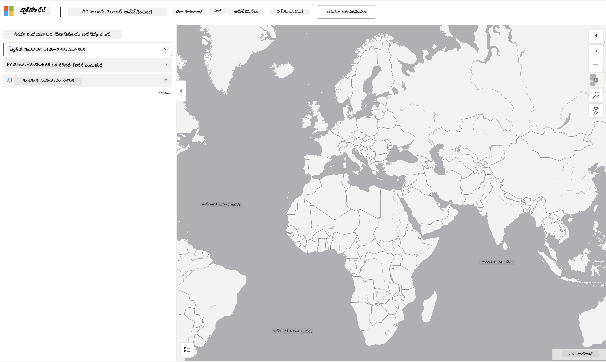

<!--
CO_OP_TRANSLATOR_METADATA:
{
  "original_hash": "d1e05715f9d97de6c4f1fb0c5a4702c0",
  "translation_date": "2025-12-19T16:59:03+00:00",
  "source_file": "6-Data-Science-In-Wild/20-Real-World-Examples/assignment.md",
  "language_code": "te"
}
-->
# ఒక ప్లానెటరీ కంప్యూటర్ డేటాసెట్‌ను అన్వేషించండి

## సూచనలు

ఈ పాఠంలో, మేము వివిధ డేటా సైన్స్ అప్లికేషన్ డొమైన్‌ల గురించి మాట్లాడాము - పరిశోధన, సస్టెయినబిలిటీ మరియు డిజిటల్ హ్యూమానిటీస్‌కు సంబంధించిన ఉదాహరణలలో లోతైన అవగాహనతో. ఈ అసైన్‌మెంట్‌లో, మీరు ఈ ఉదాహరణలలో ఒకదాన్ని మరింత వివరంగా అన్వేషించి, సస్టెయినబిలిటీ డేటా గురించి అవగాహన పొందడానికి డేటా విజువలైజేషన్లు మరియు విశ్లేషణలపై మీ నేర్చుకున్న విషయాలను వర్తింపజేస్తారు.

[Planetary Computer](https://planetarycomputer.microsoft.com/) ప్రాజెక్ట్‌లో డేటాసెట్‌లు మరియు APIs ఉన్నాయి, వీటిని ఖాతాతో యాక్సెస్ చేయవచ్చు - మీరు అసైన్‌మెంట్ బోనస్ దశను ప్రయత్నించాలనుకుంటే యాక్సెస్ కోసం ఒక ఖాతాను అభ్యర్థించండి. సైట్‌లో ఖాతా సృష్టించకుండా ఉపయోగించుకునే [Explorer](https://planetarycomputer.microsoft.com/explore) ఫీచర్ కూడా అందుబాటులో ఉంది.

`దశలు:`
Explorer ఇంటర్‌ఫేస్ (క్రింద స్క్రీన్‌షాట్‌లో చూపబడింది) మీరు ఒక డేటాసెట్‌ను (నివ్వబడిన ఎంపికల నుండి), ఒక ప్రీసెట్ క్వెరీ (డేటాను ఫిల్టర్ చేయడానికి) మరియు ఒక రేండరింగ్ ఆప్షన్ (సంబంధిత విజువలైజేషన్ సృష్టించడానికి) ఎంచుకునే అవకాశం ఇస్తుంది. ఈ అసైన్‌మెంట్‌లో, మీ పని:

 1. [Explorer డాక్యుమెంటేషన్](https://planetarycomputer.microsoft.com/docs/overview/explorer/) చదవండి - ఎంపికలను అర్థం చేసుకోండి.
 2. డేటాసెట్ [క్యాటలాగ్](https://planetarycomputer.microsoft.com/catalog) అన్వేషించండి - ప్రతి డేటాసెట్ యొక్క ఉద్దేశ్యాన్ని తెలుసుకోండి.
 3. Explorer ఉపయోగించండి - ఆసక్తికరమైన డేటాసెట్ ఎంచుకోండి, సంబంధిత క్వెరీ & రేండరింగ్ ఆప్షన్ ఎంచుకోండి.

`మీ పని:`
ఇప్పుడు బ్రౌజర్‌లో రేండర్ అయిన విజువలైజేషన్‌ను అధ్యయనం చేసి క్రింది ప్రశ్నలకు సమాధానం ఇవ్వండి:
 * డేటాసెట్‌లో ఏ _ఫీచర్లు_ ఉన్నాయి?
 * విజువలైజేషన్ ఏ _అవగాహన_ లేదా ఫలితాలను అందిస్తుంది?
 * ఆ అవగాహనల యొక్క ప్రాజెక్ట్ సస్టెయినబిలిటీ లక్ష్యాలపై ఏ _ప్రభావాలు_ ఉన్నాయి?
 * విజువలైజేషన్ యొక్క ఏ _పరిమితులు_ ఉన్నాయి (అంటే, మీరు పొందలేని అవగాహన ఏమిటి?)
 * మీరు రా డేటాను పొందగలిగితే, మీరు ఏ _వికల్ప విజువలైజేషన్లు_ సృష్టించేవారు, మరియు ఎందుకు?

`బోనస్ పాయింట్లు:`
ఖాతాకు దరఖాస్తు చేయండి - అంగీకరించబడిన తర్వాత లాగిన్ అవ్వండి.
 * _Launch Hub_ ఆప్షన్ ఉపయోగించి రా డేటాను నోట్బుక్‌లో తెరవండి.
 * డేటాను ఇంటరాక్టివ్‌గా అన్వేషించి, మీరు ఆలోచించిన ప్రత్యామ్నాయ విజువలైజేషన్లను అమలు చేయండి.
 * ఇప్పుడు మీ కస్టమ్ విజువలైజేషన్లను విశ్లేషించండి - మీరు ముందుగా మిస్ అయిన అవగాహనలను పొందగలిగారా?

## రూబ్రిక్

ఉదాహరణాత్మకంగా | సరిపడా | మెరుగుదల అవసరం
--- | --- | -- |
అన్ని ఐదు ప్రధాన ప్రశ్నలకు సమాధానమివ్వబడింది. విద్యార్థి ప్రస్తుత మరియు ప్రత్యామ్నాయ విజువలైజేషన్లు సస్టెయినబిలిటీ లక్ష్యాలు లేదా ఫలితాలపై ఎలా అవగాహనలను అందించగలవో స్పష్టంగా గుర్తించారు.| విద్యార్థి కనీసం టాప్ 3 ప్రశ్నలకు విపులంగా సమాధానమివ్వగా, Explorer తో ప్రాక్టికల్ అనుభవం ఉన్నట్లు చూపించారు. | విద్యార్థి అనేక ప్రశ్నలకు సమాధానం ఇవ్వలేకపోయారు లేదా తగిన వివరాలు ఇవ్వలేదు - ప్రాజెక్ట్ కోసం అర్థవంతమైన ప్రయత్నం చేయలేదని సూచిస్తుంది |

---

<!-- CO-OP TRANSLATOR DISCLAIMER START -->
**అస్పష్టత**:  
ఈ పత్రాన్ని AI అనువాద సేవ [Co-op Translator](https://github.com/Azure/co-op-translator) ఉపయోగించి అనువదించబడింది. మేము ఖచ్చితత్వానికి ప్రయత్నించినప్పటికీ, ఆటోమేటెడ్ అనువాదాల్లో పొరపాట్లు లేదా తప్పిదాలు ఉండవచ్చు. మూల పత్రం దాని స్వదేశీ భాషలో అధికారిక మూలంగా పరిగణించాలి. ముఖ్యమైన సమాచారానికి, ప్రొఫెషనల్ మానవ అనువాదం సిఫార్సు చేయబడుతుంది. ఈ అనువాదం వాడకంలో ఏర్పడిన ఏవైనా అపార్థాలు లేదా తప్పుదారుల కోసం మేము బాధ్యత వహించము.
<!-- CO-OP TRANSLATOR DISCLAIMER END -->