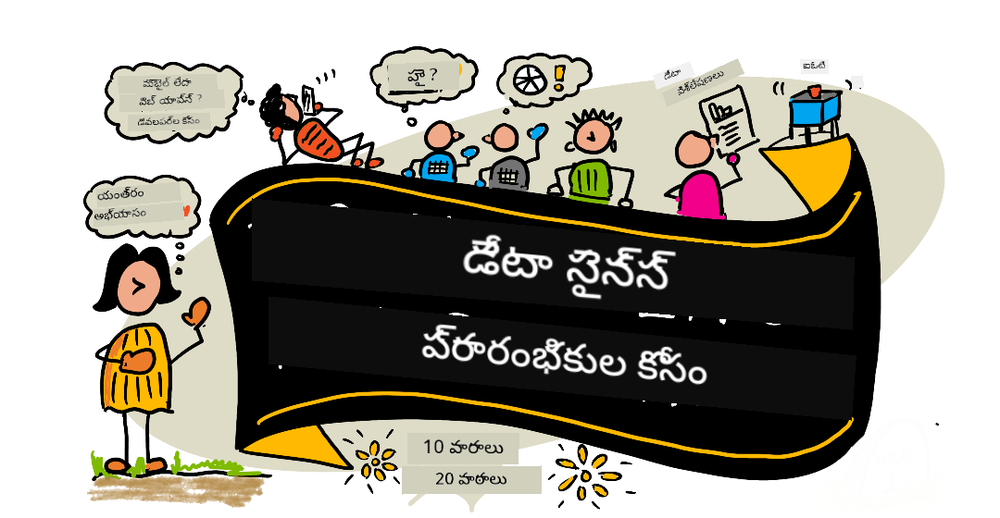

<!--
CO_OP_TRANSLATOR_METADATA:
{
  "original_hash": "7c31d1a22c746b1d0f0582d4f54702ba",
  "translation_date": "2025-12-25T00:51:55+00:00",
  "source_file": "README.md",
  "language_code": "te"
}
-->
# ప్రారంభులకు డేటా సైన్స్ - ఒక పాఠ్యక్రమం

Microsoftలోని Azure Cloud Advocates డేటా సైన్స్ గురించి 10 వారాల, 20 పాఠాల పాఠ్యక్రమాన్ని అందజేయడం సంతోషంగా ఉంది. ప్రతి పాఠంలో పాఠం ముందు మరియు పాఠం తర్వాత ఉన్న క్విజ్‌లు, పాఠాన్ని పూర్తి చేయడానికి వ్రాత-based సూచనలు, పరిష్కారం మరియు ఒక అసైన్‌మెంట్ ఉంటాయి. మా ప్రాజెక్ట్-ఆధారిత ఆధ్యాపక పద్ధతి మీరు నిర్మిస్తున్నప్పుడు నేర్చుకోవడానికి అనుమతిస్తుంది, ఇది కొత్త నైపుణ్యాలు మెరుగ్గా నిలిచేలా చేయడానికి సాక్ష్యమైన విధానం.

**మా రచయితలకు హృదయపూర్వక ధన్యవాదాలు:** [Jasmine Greenaway](https://www.twitter.com/paladique), [Dmitry Soshnikov](http://soshnikov.com), [Nitya Narasimhan](https://twitter.com/nitya), [Jalen McGee](https://twitter.com/JalenMcG), [Jen Looper](https://twitter.com/jenlooper), [Maud Levy](https://twitter.com/maudstweets), [Tiffany Souterre](https://twitter.com/TiffanySouterre), [Christopher Harrison](https://www.twitter.com/geektrainer).

**🙏 ప్రత్యేక ధన్యవాదాలు 🙏 మా [Microsoft Student Ambassador](https://studentambassadors.microsoft.com/) రచయితలు, సమీక్షకులు మరియు కంటెంట్ సహకారులకు,** ముఖ్యంగా Aaryan Arora, [Aditya Garg](https://github.com/AdityaGarg00), [Alondra Sanchez](https://www.linkedin.com/in/alondra-sanchez-molina/), [Ankita Singh](https://www.linkedin.com/in/ankitasingh007), [Anupam Mishra](https://www.linkedin.com/in/anupam--mishra/), [Arpita Das](https://www.linkedin.com/in/arpitadas01/), ChhailBihari Dubey, [Dibri Nsofor](https://www.linkedin.com/in/dibrinsofor), [Dishita Bhasin](https://www.linkedin.com/in/dishita-bhasin-7065281bb), [Majd Safi](https://www.linkedin.com/in/majd-s/), [Max Blum](https://www.linkedin.com/in/max-blum-6036a1186/), [Miguel Correa](https://www.linkedin.com/in/miguelmque/), [Mohamma Iftekher (Iftu) Ebne Jalal](https://twitter.com/iftu119), [Nawrin Tabassum](https://www.linkedin.com/in/nawrin-tabassum), [Raymond Wangsa Putra](https://www.linkedin.com/in/raymond-wp/), [Rohit Yadav](https://www.linkedin.com/in/rty2423), Samridhi Sharma, [Sanya Sinha](https://www.linkedin.com/mwlite/in/sanya-sinha-13aab1200),
[Sheena Narula](https://www.linkedin.com/in/sheena-narua-n/), [Tauqeer Ahmad](https://www.linkedin.com/in/tauqeerahmad5201/), Yogendrasingh Pawar , [Vidushi Gupta](https://www.linkedin.com/in/vidushi-gupta07/), [Jasleen Sondhi](https://www.linkedin.com/in/jasleen-sondhi/)

||
|:---:|
| ప్రాథమికుల కోసం డేటా సైన్స్ - _స్కెచ్‌నోట్ ద్వారా [@nitya](https://twitter.com/nitya)_ |

### 🌐 బహుభాషా మద్దతు

#### GitHub Action ద్వారా మద్దతు (ఆటోమెటెడ్ & ఎప్పుడూ నవీకరించబడిన)

<!-- CO-OP TRANSLATOR LANGUAGES TABLE START -->
[అరబిక్](../ar/README.md) | [బెంగాలీ](../bn/README.md) | [బల్గేరియన్](../bg/README.md) | [బర్మీస్ (మయన్మార్)](../my/README.md) | [చైనీస్ (సంక్షిప్త)](../zh/README.md) | [చైనీస్ (సాంప్రదాయిక, హాంకాంగ్)](../hk/README.md) | [చైనీస్ (సాంప్రదాయిక, మకావ్)](../mo/README.md) | [చైనీస్ (సాంప్రదాయిక, టైవాన్)](../tw/README.md) | [క్రొయాటియన్](../hr/README.md) | [చెక్](../cs/README.md) | [డానిష్](../da/README.md) | [డచ్](../nl/README.md) | [ఎస్టోనియన్](../et/README.md) | [ఫినిష్](../fi/README.md) | [ఫ్రెంచ్](../fr/README.md) | [జర్మన్](../de/README.md) | [గ్రీక్](../el/README.md) | [హిబ్రూ](../he/README.md) | [హిందీ](../hi/README.md) | [హంగేరియన్](../hu/README.md) | [ఇండోనేషియన్](../id/README.md) | [ఇటాలియన్](../it/README.md) | [జపనీస్](../ja/README.md) | [కన్నడ](../kn/README.md) | [కొరియన్](../ko/README.md) | [లిథువేనియన్](../lt/README.md) | [మలేయ్](../ms/README.md) | [మలయాలం](../ml/README.md) | [మరాఠీ](../mr/README.md) | [నేపాలి](../ne/README.md) | [నైజీరియన్ పిడ్జిన్](../pcm/README.md) | [నార్వేజియన్](../no/README.md) | [పర్శియన్ (ఫార్సీ)](../fa/README.md) | [పోలిష్](../pl/README.md) | [పోర్చుగీస్ (బ్రెజిల్)](../br/README.md) | [పోర్చుగీస్ (పోర్చుగల్)](../pt/README.md) | [పంజాబీ (గుర్ముఖి)](../pa/README.md) | [రూమేనియన్](../ro/README.md) | [రష్యన్](../ru/README.md) | [సర్బియన్ (సిరిలిక్)](../sr/README.md) | [స్లోవాక్](../sk/README.md) | [స్లోవేనియన్](../sl/README.md) | [స్పానిష్](../es/README.md) | [స్వాహిలి](../sw/README.md) | [స్వీడిష్](../sv/README.md) | [టగాలోగ్ (ఫిలిపీనో)](../tl/README.md) | [తమిళ్](../ta/README.md) | [తెలుగు](./README.md) | [థాయ్](../th/README.md) | [టర్కిష్](../tr/README.md) | [యుక్రెనియన్](../uk/README.md) | [ఉర్దూ](../ur/README.md) | [వియత్నామీస్](../vi/README.md)
<!-- CO-OP TRANSLATOR LANGUAGES TABLE END -->

**మీకు అదనపు అనువాద భాషలు కావాలంటే మద్దతు పొందే భాషలు [ఇక్కడ](https://github.com/Azure/co-op-translator/blob/main/getting_started/supported-languages.md) జాబితాలో ఉన్నాయి**

#### మా కమ్యూనిటీలో చేరండి 

మా వద్ద Discord లెర్న్ విత్ AI సిరీస్ కొనసాగుతోంది, మరింత తెలుసుకోండి మరియు 18 - 30 సెప్టెంబర్, 2025 కాలంలో మాతో చేరడానికి [Learn with AI Series](https://aka.ms/learnwithai/discord)లో జాయిన్ అవ్వండి. మీరు Data Science కోసం GitHub Copilot ఉపయోగించే టిప్స్ మరియు ట్రిక్స్ పొందుతారు.

# మీరు విద్యార్థి?

క్రింది వనరులతో ప్రారంభించండి:

- [స్టూడెంట్ హబ్ పేజీ](https://docs.microsoft.com/en-gb/learn/student-hub?WT.mc_id=academic-77958-bethanycheum) ఈ పేజీలో మీరు ప్రారంభిక వనరులు, స్టూడెంట్ ప్యాక్లు మరియు ఉచిత సర్టిఫికెట్ వోచర్ పొందే మార్గాలను కనుగొంటారు. మేము కనీసం నెలకి ఒకసారి కంటెంట్ను మార్చేస్తామనుకోగా, ఈ పేజీని బుక్‌మార్క్ చేయడం మరియు మధ్యపు సమయంలో తనిఖీ చేయడం మంచిది.
- [Microsoft Learn Student Ambassadors](https://studentambassadors.microsoft.com?WT.mc_id=academic-77958-bethanycheum) స్టూడెంట్ అంబాసడర్స్ యొక్క గ్లోబల్ కమ్యూనిటీలో చేరిం, ఇది మీకు Microsoft లోకి బాటుగా ఉండవచ్చు.

# ప్రారంభించడం

## 📚 డాక్యుమెంటేషన్

- **[ఇన్‌స్టాలేషన్ గైడ్](INSTALLATION.md)** - ప్రారంభికులకు దశలవారీగా సెటప్ సూచనలు
- **[వాడుక గైడ్](USAGE.md)** - ఉదాహరణలు మరియు సాధారణ వర్క్‌ఫ్లోలు
- **[సమస్య పరిష్కారం](TROUBLESHOOTING.md)** - సాధారణ సమస్యలకు పరిష్కారాలు
- **[కాంట్రిబ్యూటింగ్ గైడ్](CONTRIBUTING.md)** - ఈ ప్రాజెక్టుకు ఎలా దోహదపడాలో
- **[ఉపాధ్యాయుల కోసం](for-teachers.md)** - బోధన దిశానిర్దేశం మరియు తరగతి వనరులు

## 👨‍🎓 విద్యార్థుల కోసం
> **సంపూర్ణ ప్రారంభికులు**: డేటా సైన్స్ కి కొత్తవా? మా [ప్రారంభికులకు అనుకూలమైన ఉదాహరణలు](examples/README.md) నుండి ప్రారంభించండి! ఈ సాధారణ, బాగా వ్యాఖ్యానించిన ఉదాహరణలు పూర్తి పాఠ్యక్రమంలోకి ప్రవేశించే ముందే బేసిక్‌ను అర్థం చేసుకోవడంలో మీకు సహాయపడతాయి.
> **[విద్యార్థులు](https://aka.ms/student-page)**: ఈ పాఠ్యక్రమాన్ని స్వయంగా ఉపయోగించుకోవడానికి, మొత్తం repoని fork చేసి, ఒక ప్రి-లెక్చర్ క్విజ్ తో మొదలుపెట్టి స్వయంగా వ్యాయామాలను పూర్తి చేయండి. ఆపై లెక్చర్ ని చదివి మిగతా కార్యకలాపాలను పూర్తి చేయండి. పరిష్కార కోడ్‌ను కాపీ చేయడానికి కాకుండా పాఠాలను అర్థం చేసుకొని ప్రాజెక్టులను సృష్టించడానికి ప్రయత్నించండి; అయితే ఆ కోడ్ ప్రతి ప్రాజెక్ట్-ఆధారిత పాఠంలోని /solutions ఫోల్డర్లలో అందుబాటులో ఉంటుంది. మరో ఒక ఆలోచనగా, మీ స్నేహితులతో చదువుచేర్చుకొనే గ్రూప్ ఏర్పరిచి కలిసి కంటెంట్‌ను వెళ్లిపోవచ్చు. మరింత అధ్యయనానికి, మేము [Microsoft Learn](https://docs.microsoft.com/en-us/users/jenlooper-2911/collections/qprpajyoy3x0g7?WT.mc_id=academic-77958-bethanycheum)ను సూచిస్తాము.

**త్వరిత ప్రారంభం:**
1. మీ పరిసరాన్ని సెటప్ చేయడానికి [ఇన్‌స్టాలేషన్ గైడ్](INSTALLATION.md)ను తనిఖీ చేయండి
2. పాఠ్యక్రమంతో ఎలా పని చేయాలో తెలుసుకోవడానికి [వాడుక గైడ్](USAGE.md)ని సమీక్షించండి
3. పాఠం 1 నుండి ప్రారంభించి క్రమంగా ముందుకు పని చేయండి
4. మద్దతును పొందడానికి మా [Discord కమ్యూనిటీ](https://aka.ms/ds4beginners/discord) లో చేరండి

## 👩‍🏫 ఉపాధ్యాయుల కోసం

> **ఉపాధ్యాయులు**: ఈ పాఠ్యక్రమాన్ని ఎలా ఉపయోగించాలో మేము కొన్న సూచనలను [సరిపెట్టాము](for-teachers.md). మీ ఫీడ్‌బ్యాక్‌ను మేము మన చర్చా ఫోరంలో స్వాగతిస్తాము [ఇక్కడ](https://github.com/microsoft/Data-Science-For-Beginners/discussions)!

## జట్టును పరిచయం

**గిఫ్ ద్వారా** [Mohit Jaisal](https://www.linkedin.com/in/mohitjaisal)
> 🎥 పై చిత్రాన్ని క్లిక్ చేసి ప్రాజెక్ట్ గురించి వీడియో కోసం  దాన్ని సృష్టించిన వ్యక్తుల గురించి చూడండి!

## శిక్షణ సిద్ధాంతం

ఈ పాఠ్యక్రమాన్ని నిర్మించేటప్పుడు మేము రెండు శిక్షణాత్మక సూత్రాలను తీసుకున్నాం: అది ప్రాజెక్ట్-ఆధారితంగా ఉండాలి మరియు తరచుగా క్విజ్‌లు ఉండేలా ఉండాలి. ఈ సిరీస్ చివరికి, విద్యార్థులు డేటా సైన్స్ యొక్క మౌలిక సిద్ధాంతాలను, నైతిక భావనలు, డేటా తయారీ, డేటా‌తో పని చేయడానికి వివిధ విధానాలు, డేటా విజువలైజేషన్, డేటా విశ్లేషణ, డేటా సైన్స్ యొక్క వాస్తవ ప్రపంచ వినియోగకేసులు మరియు మరిన్ని నేర్చుకుంటారు.

ఇంకా, తరగతి ముందు ఒక తక్కువ-పరిమాణపు క్విజ్ విద్యార్థి యొక్క ఆచరణను ఒక అంశాన్ని నేర్చుకోవడానికి ఉద్దేశ్యాన్ని ఏర్పరుస్తుంది, తరగతి తర్వాత రెండవ క్విజ్ ఇంకా మెమరీని బలపరుస్తుంది. ఈ పాఠ్యక్రమం సరళంగా, సరదాగా ఉండేందుకు డిజైన్ చేయబడింది మరియు మొత్తం లేదా భాగంగా తీసుకోవచ్చు. ప్రాజెక్ట్లు చిన్నది నుంచి మొదలవుతూ 10 వారాల చక్రం చివరికి ఎక్కువగా స్ఫూర్తివంతంగా క్లిష్టంగా మారతాయి.

> మా [Code of Conduct](CODE_OF_CONDUCT.md), [Contributing](CONTRIBUTING.md),  [Translation](TRANSLATIONS.md) మార్గదర్శకాలని చూడండి. మీ నిర్మాణాత్మక అభిప్రాయాలను మేము స్వాగతిస్తాము!

## ప్రతి పాఠంలో ఇవి ఉంటాయి:

- ఐచ్చిక స్కెచ్‌నోట్
- ఐచ్చిక పూరక వీడియో
- పాఠం ముందు వార్మప్ క్విజ్
- వ్రాత పాఠం
- ప్రాజెక్ట్-ఆధారిత పాఠాల కోసం, ప్రాజెక్ట్ ఎలా నిర్మించాలో దశబద్దంగా మార్గదర్శకాలు
- జ్ఞాన పరీక్షలు
- ఒక సవాల్
- పూరక పఠనం
- అసైన్‌మెంట్
- [పాఠం తర్వాత క్విజ్](https://ff-quizzes.netlify.app/en/)

> **క్విజ్‌ల గురించి ఒక గమనిక**: అన్ని క్విజ్‌లు Quiz-App ఫోల్డర్‌లో ఉన్నాయి, మొత్తం 40 క్విజ్‌లు, ఒక్కోటి మూడు ప్రశ్నలతో. అవి పాఠాల్లో లింక్ చేయబడ్డాయి, కానీ quiz app స్థానికంగా నడపవచ్చు లేదా Azure కు డిప్లాయ్ చేయవచ్చు; `quiz-app` ఫోల్డర్ లోని సూచనలను అనుసరించండి. అవి徐徐గా స్థానీకరణ జరుగుతున్నాయి.

## 🎓 ప్రారంభికులకు అనుకూల ఉదాహరణలు

**డేటా సైన్స్ కొత్తవారా?** మేము ప్రారంభించడానికి సహాయపడే సాదా, బాగా కామెంట్ చేయబడిన కోడ్‌తో ప్రత్యేక [ఉదాహరణల డైరెక్టరీ](examples/README.md) సృష్టించాము:

- 🌟 **హలో వరల్డ్** - మీ మొదటి డేటా సైన్స్ ప్రోగ్రామ్
- 📂 **డేటా లోడ్ చేయడం** - డేటాసెట్‌లను చదవడం మరియు అన్వేషించడం నేర్చుకోండి
- 📊 **సాధారణ విశ్లేషణ** - గణాంకాలను లెక్కించి నమూనాలను కనుగొనండి
- 📈 **ప్రాథమిక విజువలైజేషన్** - చార్ట్లు మరియు గ్రాఫ్‌లను సృష్టించండి
- 🔬 **వాస్తవ ప్రపంచ ప్రాజెక్ట్** - ప్రారంభం నుంచి పూర్తి వర్క్‌ఫ్లో

ప్రతి ఉదాహరణలో ప్రతి దశను వివరించే వివరణాత్మక కామెంట్లు ఉంటాయి, ఇది మొత్తం కొత్తవారికి తగినట్లుగా చేస్తుంది!

👉 **[ఉదాహరణలతో ప్రారంభించండి](examples/README.md)** 👈

## పాఠాలు

||
|:---:|
| ప్రారంభికుల కోసం డేటా సైన్స్: రోడ్‌మ్యాప్ - _స్కెచ్‌నోట్ రచన [@nitya](https://twitter.com/nitya)_ |

| పాఠం సంఖ్య | అంశం | పాఠ సమూహం | నేర్చుకోవాల్సిన లక్ష్యాలు | లింక్ చేసిన పాఠం | రచయిత |
| :-----------: | :----------------------------------------: | :--------------------------------------------------: | :-----------------------------------------------------------------------------------------------------------------------------------------------------------------------: | :---------------------------------------------------------------------: | :----: |
| 01 | డేటా సైన్స్ నిర్వచనం | [Introduction](1-Introduction/README.md) | డేటా సైన్స్ వెనుక ఉండే మౌలిక భావనలు మరియు అది ఆర్టిఫిషియల్ ఇంటెలిజెన్స్, మెషిన్ లెర్నింగ్ మరియు బిగ్ డేటాతో ఎలా సంబంధితమో తెలుసుకోండి. | [పాఠం](1-Introduction/01-defining-data-science/README.md) [వీడియో](https://youtu.be/beZ7Mb_oz9I) | [Dmitry](http://soshnikov.com) |
| 02 | డేటా సైన్స్ నైతికత | [Introduction](1-Introduction/README.md) | డేటా నైతికత భావనలు, సవాళ్లు & ఫ్రేమ్‌వర్క్‌లు. | [పాఠం](1-Introduction/02-ethics/README.md) | [Nitya](https://twitter.com/nitya) |
| 03 | డేటా నిర్వచనం | [Introduction](1-Introduction/README.md) | డేటా ఎలా వర్గీకరించబడుతుంది మరియు దాని సాధారణ మూలాలు ఏమిటో. | [పాఠం](1-Introduction/03-defining-data/README.md) | [Jasmine](https://www.twitter.com/paladique) |
| 04 | గణాంకం & సంభావ్యతకి పరిచయం | [Introduction](1-Introduction/README.md) | డేటాను అర్థం చేసుకునేందుకు సంభావ్యత మరియు గణాంకాల గణితీయ సూక్తులు. | [పాఠం](1-Introduction/04-stats-and-probability/README.md) [వీడియో](https://youtu.be/Z5Zy85g4Yjw) | [Dmitry](http://soshnikov.com) |
| 05 | సంబంధిత డేటాతో పని చేయుట | [Working With Data](2-Working-With-Data/README.md) | సంబంధిత డేటాకు పరిచయం మరియు Structured Query Language గా కూడా పిలవబడే SQL (ఉచ్చారణ “see-quell”) తో సంబంధిత డేటాను అన్వేషించడం మరియు విశ్లేషించడం యొక్క మౌలికాలు. | [పాఠం](2-Working-With-Data/05-relational-databases/README.md) | [Christopher](https://www.twitter.com/geektrainer) | | |
| 06 | NoSQL డేటాతో పని చేయుట | [Working With Data](2-Working-With-Data/README.md) | బైన-రిలేషనల్ కాని డేటా, దాని వివిధ రకాలు మరియు డాక్యుమెంట్ డేటాబేస్‌లను అన్వేషించడం మరియు విశ్లేషించడం యొక్క మౌలికాలు. | [పాఠం](2-Working-With-Data/06-non-relational/README.md) | [Jasmine](https://twitter.com/paladique)|
| 07 | Python తో పని చేయుట | [Working With Data](2-Working-With-Data/README.md) | Pandas వంటి లైబ్రరీలను ఉపయోగించి డేటా అన్వేషణ కోసం Python ఉపయోగించుట యొక్క మౌలికాలు. Python ప్రోగ్రామింగ్ యొక్క పునాదిలు అర్థం చేసుకోవడం సూచించబడుతుంది. | [పాఠం](2-Working-With-Data/07-python/README.md) [వీడియో](https://youtu.be/dZjWOGbsN4Y) | [Dmitry](http://soshnikov.com) |
| 08 | డేటా తయారీ | [Working With Data](2-Working-With-Data/README.md) | గాయపడిన, తప్పుదారిలోకి వెళ్లిన లేదా అపూర్ణమైన డేటాను ఎదుర్కొనుటకు శుభ్రపరచడం మరియు ట్రాన్స్ఫార్మ్ చేయడం వంటి డేటా సాంకేతికతల విషయాలు. | [పాఠం](2-Working-With-Data/08-data-preparation/README.md) | [Jasmine](https://www.twitter.com/paladique) |
| 09 | పరిమాణాలను విజువలైజ్ చేయుట | [Data Visualization](3-Data-Visualization/README.md) | Matplotlib ను ఉపయోగించి పక్షుల డేటాను ఎలా విజువలైజ్ చేయాలో నేర్చుకోండి 🦆 | [పాఠం](3-Data-Visualization/09-visualization-quantities/README.md) | [Jen](https://twitter.com/jenlooper) |
| 10 | డేటా పంపిణీని విజువలైజ్ చేయుట | [Data Visualization](3-Data-Visualization/README.md) | ఒక ఇంటర్వల్‌లో నిపుణుల مشاهదలు మరియు ధోరణులను విజువలైజ్ చేయడం. | [పాఠం](3-Data-Visualization/10-visualization-distributions/README.md) | [Jen](https://twitter.com/jenlooper) |
| 11 | సగటులను విజువలైజ్ చేయుట | [Data Visualization](3-Data-Visualization/README.md) | వేరేcito మరియు సమూహించిన శాతం విలువలను విజువలైజ్ చేయడం. | [పాఠం](3-Data-Visualization/11-visualization-proportions/README.md) | [Jen](https://twitter.com/jenlooper) |
| 12 | సంబంధాలను విజువలైజ్ చేయుట | [Data Visualization](3-Data-Visualization/README.md) | డేటా సెట్ల మరియు వాటి పారామితుల మధ్య సంబంధాలు మరియు సమన్వయాలను విజువలైజ్ చేయడం. | [పాఠం](3-Data-Visualization/12-visualization-relationships/README.md) | [Jen](https://twitter.com/jenlooper) |
| 13 | అర్థవంతమైన విజువలైజేషన్లు | [Data Visualization](3-Data-Visualization/README.md) | సమస్య పరిష్కారం మరియు అవగాహన కోసం మీ విజువలైజేషన్లను విలువైనదిగా చేయడానికి సాంకేతికతలు మరియు మార్గదర్శకత్వం. | [పాఠం](3-Data-Visualization/13-meaningful-visualizations/README.md) | [Jen](https://twitter.com/jenlooper) |
| 14 | డేటా సైన్స్ లైఫ్‌సైకిల్‌కు పరిచయం | [Lifecycle](4-Data-Science-Lifecycle/README.md) | డేటా సైన్స్ లైఫ్‌సైకిల్‌కు పరిచయం మరియు డేటాను పొందడం మరియు ఎక్స్ట్రాక్ట్ చేయడం అనే మొదటి దశ. | [పాఠం](4-Data-Science-Lifecycle/14-Introduction/README.md) | [Jasmine](https://twitter.com/paladique) |
| 15 | విశ్లేషణ | [Lifecycle](4-Data-Science-Lifecycle/README.md) | డేటా సైన్స్ లైఫ్‌సైకిల్‌లో ఈ దశ డేటాను విశ్లేషించడానికి సాంకేతికతలపై దృష్టి సారిస్తుంది. | [పాఠం](4-Data-Science-Lifecycle/15-analyzing/README.md) | [Jasmine](https://twitter.com/paladique) | | |
| 16 | కమ్యూనికేషన్ | [Lifecycle](4-Data-Science-Lifecycle/README.md) | డేటా సైన్స్ లైఫ్‌సైకిల్‌లో ఈ దశ డేటా నుండి వచ్చిన అవగాహనలను నిర్ణయకర్తలు సులభంగా అర్థం చేసుకునేలా ప్రదర్శించడంపై దృష్టి సారిస్తుంది. | [పాఠం](4-Data-Science-Lifecycle/16-communication/README.md) | [Jalen](https://twitter.com/JalenMcG) | | |
| 17 | క్లౌడ్‌లో డేటా సైన్స్ | [Cloud Data](5-Data-Science-In-Cloud/README.md) | ఈ పాఠాల సిరీస్ క్లౌడ్‌లో డేటా సైన్స్ మరియు దాని లాభాలపై పరిచయం చేస్తుంది. | [పాఠం](5-Data-Science-In-Cloud/17-Introduction/README.md) | [Tiffany](https://twitter.com/TiffanySouterre) and [Maud](https://twitter.com/maudstweets) |
| 18 | క్లౌడ్‌లో డేటా సైన్స్ | [Cloud Data](5-Data-Science-In-Cloud/README.md) | Low Code సాధనాలను ఉపయోగించి మోడల్స్ ట్రైనింగ్. |[పాఠం](5-Data-Science-In-Cloud/18-Low-Code/README.md) | [Tiffany](https://twitter.com/TiffanySouterre) and [Maud](https://twitter.com/maudstweets) |
| 19 | క్లౌడ్‌లో డేటా సైన్స్ | [Cloud Data](5-Data-Science-In-Cloud/README.md) | Azure Machine Learning Studio తో మోడళ్లను డిప్లాయ్ చేయడం. | [పాఠం](5-Data-Science-In-Cloud/19-Azure/README.md)| [Tiffany](https://twitter.com/TiffanySouterre) and [Maud](https://twitter.com/maudstweets) |
| 20 | వనంలో డేటా సైన్స్ | [In the Wild](6-Data-Science-In-Wild/README.md) | వాస్తవ ప్రపంచంలో డేటా సైన్స్ నడిపే ప్రాజెక్టులు. | [పాఠం](6-Data-Science-In-Wild/20-Real-World-Examples/README.md) | [Nitya](https://twitter.com/nitya) |

## GitHub Codespaces

ఈ నమూనాను ఒక Codespaceలో öppిన్ చేయడానికి ఈ దశలను అనుసరించండి:
1. Code డ్రాప్-డౌన్ మెనూలను క్లిక్ చేసి Open with Codespaces ఎంపికను ఎంచుకోండి.
2. ప్యాన్ బాటంలో క్రింద ఉన్న + New codespace ఎంచుకోండి.
మరిన్ని వివరాల కోసం, [GitHub డాక్యుమెంటేషన్](https://docs.github.com/en/codespaces/developing-in-codespaces/creating-a-codespace-for-a-repository#creating-a-codespace) చూడండి.

## VSCode Remote - Containers
ఈ రెపోను మీ స్థానిక యంత్రంలో మరియు VSCode ద్వారా VS Code Remote - Containers ఎక్స్టెన్షన్‌ను ఉపయోగించి ఒక కంటైనర్‌లో ఓపెన్ చేయడానికి ఈ దశలను అనుసరించండి:

1. మీరు డెవలప్‌మెంట్ కంటైనర్‌ను మొదటిసారిగా ఉపయోగిస్తుంటే, దయచేసి మీ సిస్టమ్ ముందస్తు-అవసరాలు (ఉదా. Docker ఇన్స్టాల్ చేయబడినదని) [getting started documentation](https://code.visualstudio.com/docs/devcontainers/containers#_getting-started)లో చూసి నిర్ధారించండి.

ఈ రెపొజిటరీని ఉపయోగించడానికి, మీరు లేదా రెపోను ఒక వేరుగా డాకర్ వాల్యూమ్‌లో ఓపెన్ చేయొచ్చు:

**గమనిక**: ఆ పని Remote-Containers: **Clone Repository in Container Volume...** కమాండ్‌ను ఉపయోగిస్తుంది, ఇది సోర్స్ కోడ్‌ను స్థానిక ఫైల్ సిస్టమ్ స్థానంలో డాకర్ వాల్యూమ్‌లో క్లోన్ చేయడానికి ఉపయోగిస్తదు. [Volumes](https://docs.docker.com/storage/volumes/) కంటైనర్ డేటాను నిల్వ చేయడానికి ఇష్టమైన మెకానిజం.

లేదా రెపొ యొక్క స్థానికంగా క్లోన్ చేయబడిన లేదా డౌన్‌లోడ్ చేసిన కాపీని ఓపెన్ చేయండి:

- ఈ రెపొను మీ స్థానిక ఫైల్ సిస్టమ్‌కి క్లోన్ చేయండి.
- F1 నొక్కండి మరియు Remote-Containers: Open Folder in Container... కమాండ్‌ను ఎంచుకోండి.
- ఈ ఫోల్డర్ యొక్క క్లోన్ కాపీని ఎంచుకుని, కంటైనర్ ప్రారంభమయ్యే వరకు వేచి, తర్వాత ప్రయత్నించండి.

## ఆఫ్‌లైన్ యాక్సెస్

[Docsify](https://docsify.js.org/#/)ను ఉపయోగించి మీరు ఈ డాక్యుమెంటేషన్‌ను ఆఫ్‌లైన్‌లో నడపవచ్చు. ఈ రెపోను fork చేయండి, మీ స్థానిక యంత్రంలో [Docsify ఇన్స్టాల్](https://docsify.js.org/#/quickstart) చేయండి, ఆపై ఈ రెపొ యొక్క రూట్ ఫోల్డర్‌లో `docsify serve` టైప్ చేయండి. వెబ్‌సైట్ మీ స్థానిక 호స్ట్లో పోర్ట్ 3000 పై సర్వ్ అవుతుంది: `localhost:3000`.

> గమనిక, నోట్‌బుక్స్ Docsify ద్వారా రేండర్ కొరకు కనిపించవు, కాబట్టి మీరు నోట్‌బుక్ నడపాల్సినప్పుడు, దాన్ని వేరుగా VS Code లో Python kernelతో రన్ చేయండి.

## ఇతర పాఠ్య కార్యక్రమాలు

మా టీమ్ ఇతర పాఠ్యక్రమాలను కూడా తయారుచేస్తుంది! చూసి తెలుసుకోండి:

<!-- CO-OP TRANSLATOR OTHER COURSES START -->
### LangChain

---

### Azure / Edge / MCP / Agents

---
 
### సృజనాత్మక AI సిరీస్

[-9333EA?style=for-the-badge&labelColor=E5E7EB&color=9333EA)](https://github.com/microsoft/Generative-AI-for-beginners-dotnet?WT.mc_id=academic-105485-koreyst)
[-C084FC?style=for-the-badge&labelColor=E5E7EB&color=C084FC)](https://github.com/microsoft/generative-ai-for-beginners-java?WT.mc_id=academic-105485-koreyst)
[-E879F9?style=for-the-badge&labelColor=E5E7EB&color=E879F9)](https://github.com/microsoft/generative-ai-with-javascript?WT.mc_id=academic-105485-koreyst)

---
 
### ప్రధాన అభ్యాసం

---
 
### Copilot సిరీస్

<!-- CO-OP TRANSLATOR OTHER COURSES END -->

## సహాయం

**సమస్యలు ఎదురవుతున్నాయా?** సాధారణ సమస్యల పరిష్కారాల కోసం మా [పరిష్కార మార్గదర్శి](TROUBLESHOOTING.md) న్ను పరిశీలించండి.

మీరు చిక్కుకున్నట్లయితే లేదా AI యాప్స్ నిర్మించడంపై మీకు ఏవైనా ప్రశ్నలు ఉంటే. MCP గురించి చర్చల్లో ఇతర అభ్యాసకులు మరియు అనుభవజ్ఞులైన డెవలపర్లతో చేరండి. ఇది ప్రశ్నలకు స్వాగతమిచ్చే మరియు జ్ఞానాన్ని ఉచితంగా పంచుకునే ఒక సహాయక సముదాయం.

If you have product feedback or errors while building visit:

---

<!-- CO-OP TRANSLATOR DISCLAIMER START -->
అస్పష్టీకరణ:
ఈ పత్రాన్ని AI అనువాద సేవ [Co-op Translator](https://github.com/Azure/co-op-translator) ఉపయోగించి అనువదించబడింది. మేము ఖచ్చితత్వానికి యత్నించినప్పటికీ, స్వయంచాలిత అనువాదాల్లో పొరపాట్లు లేదా లోపాలు ఉండే అవకాశం ఉందని దయచేసి గమనించండి. అసలు పత్రాన్ని దాని స్థానిక భాషలో అధికారిక మూలంగా పరిగణించాలి. కీలకమైన సమాచారం కోసం వృత్తిపరమైన మానవ అనువాదాన్ని సూచిస్తాము. ఈ అనువాదం వాడకంవలన ఏర్పడిన ఏవైనా అపార్థాలు లేదా తప్పుగా అర్థం చేసుకోవడాలకై మేము బాధ్యత వహించము.
<!-- CO-OP TRANSLATOR DISCLAIMER END -->