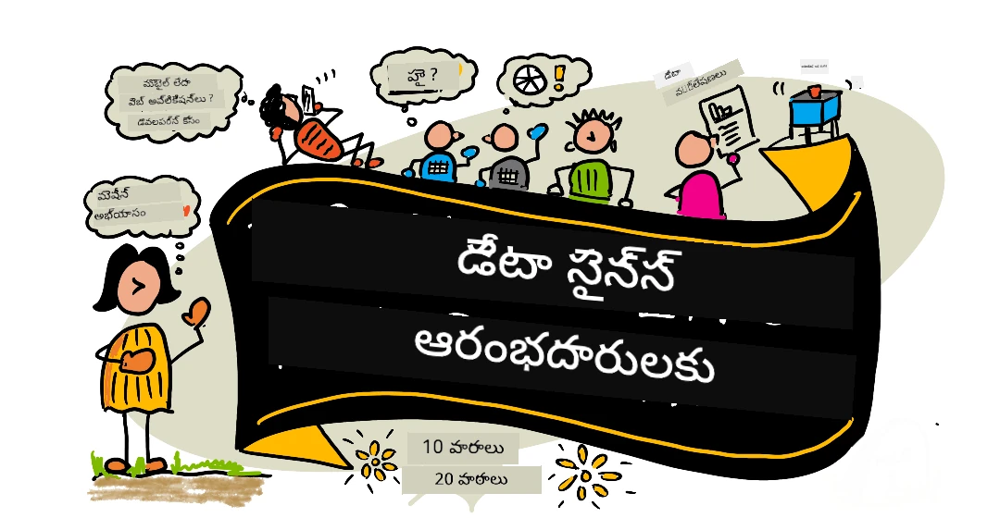
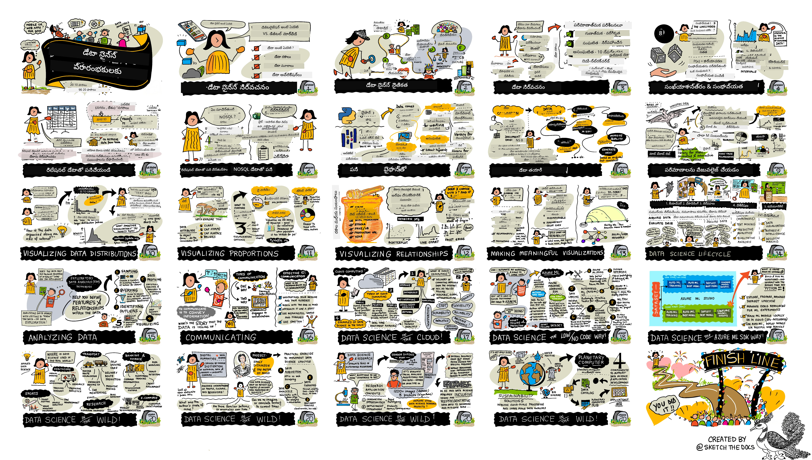

# ప్రారంభికుల కోసం డేటా సైన్స్ - పాఠ్యক্রমం

[](https://github.com/codespaces/new?hide_repo_select=true&ref=main&repo=344191198)

[](https://github.com/microsoft/Data-Science-For-Beginners/blob/master/LICENSE)
[](https://GitHub.com/microsoft/Data-Science-For-Beginners/graphs/contributors/)
[](https://GitHub.com/microsoft/Data-Science-For-Beginners/issues/)
[](https://GitHub.com/microsoft/Data-Science-For-Beginners/pulls/)
[](http://makeapullrequest.com)

[](https://GitHub.com/microsoft/Data-Science-For-Beginners/watchers/)
[](https://GitHub.com/microsoft/Data-Science-For-Beginners/network/)
[](https://GitHub.com/microsoft/Data-Science-For-Beginners/stargazers/)


[](https://discord.gg/nTYy5BXMWG)

[](https://aka.ms/foundry/forum)

Microsoft లో Azure Cloud Advocates డేటా సైన్స్ గురించి 10 వారాల, 20 పాఠాలు కలిగిన పాఠ్యಕ್ರಮాన్ని అందడం ఆనందంగా ఉంది. ప్రతి పాఠం ముందు మరియు తరువాత క్విజ్‌లు, పాఠం పూర్తిచేయడానికి రచనాత్మక సూచనలు, పరిష్కారం మరియు అసైన్మెంట్ కలిగివుంటుంది. మన ప్రాజెక్టు-ఆధారిత పాఠ్య విధానం ద్వారా మీరు చేర్చుకుంటూ నేర్చుకోవచ్చు, ఇది కొత్త నైపుణ్యాలు 'స్థిరంగా' ఉండటానికి సాక్ష్యమైన పద్ధతి.

**మా రచయితలకు హృదయపు ధన్యవాదాలు:** [Jasmine Greenaway](https://www.twitter.com/paladique), [Dmitry Soshnikov](http://soshnikov.com), [Nitya Narasimhan](https://twitter.com/nitya), [Jalen McGee](https://twitter.com/JalenMcG), [Jen Looper](https://twitter.com/jenlooper), [Maud Levy](https://twitter.com/maudstweets), [Tiffany Souterre](https://twitter.com/TiffanySouterre), [Christopher Harrison](https://www.twitter.com/geektrainer).

**🙏 ప్రత్యేక ధన్యవాదాలు 🙏 మా [Microsoft Student Ambassador](https://studentambassadors.microsoft.com/) రచయితలు, సమీక్షకులు మరియు సబంధితులకు,** ముఖ్యంగా Aaryan Arora, [Aditya Garg](https://github.com/AdityaGarg00), [Alondra Sanchez](https://www.linkedin.com/in/alondra-sanchez-molina/), [Ankita Singh](https://www.linkedin.com/in/ankitasingh007), [Anupam Mishra](https://www.linkedin.com/in/anupam--mishra/), [Arpita Das](https://www.linkedin.com/in/arpitadas01/), ChhailBihari Dubey, [Dibri Nsofor](https://www.linkedin.com/in/dibrinsofor), [Dishita Bhasin](https://www.linkedin.com/in/dishita-bhasin-7065281bb), [Majd Safi](https://www.linkedin.com/in/majd-s/), [Max Blum](https://www.linkedin.com/in/max-blum-6036a1186/), [Miguel Correa](https://www.linkedin.com/in/miguelmque/), [Mohamma Iftekher (Iftu) Ebne Jalal](https://twitter.com/iftu119), [Nawrin Tabassum](https://www.linkedin.com/in/nawrin-tabassum), [Raymond Wangsa Putra](https://www.linkedin.com/in/raymond-wp/), [Rohit Yadav](https://www.linkedin.com/in/rty2423), Samridhi Sharma, [Sanya Sinha](https://www.linkedin.com/mwlite/in/sanya-sinha-13aab1200),
[Sheena Narula](https://www.linkedin.com/in/sheena-narua-n/), [Tauqeer Ahmad](https://www.linkedin.com/in/tauqeerahmad5201/), Yogendrasingh Pawar , [Vidushi Gupta](https://www.linkedin.com/in/vidushi-gupta07/), [Jasleen Sondhi](https://www.linkedin.com/in/jasleen-sondhi/)

||
|:---:|
| ప్రారంభికుల కోసం డేటా సైన్స్ - _స్కెచ్ నోట్ - [@nitya](https://twitter.com/nitya)_ |

### 🌐 బహుభాషా మద్దతు

#### GitHub యాక్షన్ ద్వారా మద్దతు (స్వయంచాలిత & ఎప్పటికప్పుడు నవీకరించబడుతుంది)

<!-- CO-OP TRANSLATOR LANGUAGES TABLE START -->
[Arabic](../ar/README.md) | [Bengali](../bn/README.md) | [Bulgarian](../bg/README.md) | [Burmese (Myanmar)](../my/README.md) | [Chinese (Simplified)](../zh-CN/README.md) | [Chinese (Traditional, Hong Kong)](../zh-HK/README.md) | [Chinese (Traditional, Macau)](../zh-MO/README.md) | [Chinese (Traditional, Taiwan)](../zh-TW/README.md) | [Croatian](../hr/README.md) | [Czech](../cs/README.md) | [Danish](../da/README.md) | [Dutch](../nl/README.md) | [Estonian](../et/README.md) | [Finnish](../fi/README.md) | [French](../fr/README.md) | [German](../de/README.md) | [Greek](../el/README.md) | [Hebrew](../he/README.md) | [Hindi](../hi/README.md) | [Hungarian](../hu/README.md) | [Indonesian](../id/README.md) | [Italian](../it/README.md) | [Japanese](../ja/README.md) | [Kannada](../kn/README.md) | [Khmer](../km/README.md) | [Korean](../ko/README.md) | [Lithuanian](../lt/README.md) | [Malay](../ms/README.md) | [Malayalam](../ml/README.md) | [Marathi](../mr/README.md) | [Nepali](../ne/README.md) | [Nigerian Pidgin](../pcm/README.md) | [Norwegian](../no/README.md) | [Persian (Farsi)](../fa/README.md) | [Polish](../pl/README.md) | [Portuguese (Brazil)](../pt-BR/README.md) | [Portuguese (Portugal)](../pt-PT/README.md) | [Punjabi (Gurmukhi)](../pa/README.md) | [Romanian](../ro/README.md) | [Russian](../ru/README.md) | [Serbian (Cyrillic)](../sr/README.md) | [Slovak](../sk/README.md) | [Slovenian](../sl/README.md) | [Spanish](../es/README.md) | [Swahili](../sw/README.md) | [Swedish](../sv/README.md) | [Tagalog (Filipino)](../tl/README.md) | [Tamil](../ta/README.md) | [Telugu](./README.md) | [Thai](../th/README.md) | [Turkish](../tr/README.md) | [Ukrainian](../uk/README.md) | [Urdu](../ur/README.md) | [Vietnamese](../vi/README.md)

> **స్థానికంగా క్లోన్ చేయాలనుకుంటున్నారా?**
>
> ఈ రిపాజిటరీలో 50+ భాషలలో అనువాదాలు ఉన్నాయి, అవి డౌన్లోడ్ సైజ్‌ను గణనీయంగా పెంచుతాయి. అనువాదాలు లేకుండా క్లోన్ చేయడానికి, స్పార్స్ చెకౌట్‌ను ఉపయోగించండి:
>
> **Bash / macOS / Linux:**
> ```bash
> git clone --filter=blob:none --sparse https://github.com/microsoft/Data-Science-For-Beginners.git
> cd Data-Science-For-Beginners
> git sparse-checkout set --no-cone '/*' '!translations' '!translated_images'
> ```
>
> **CMD (Windows):**
> ```cmd
> git clone --filter=blob:none --sparse https://github.com/microsoft/Data-Science-For-Beginners.git
> cd Data-Science-For-Beginners
> git sparse-checkout set --no-cone "/*" "!translations" "!translated_images"
> ```
>
> దీని ద్వారా మీరు ఈ కోర్సును పూర్తి చేయడానికి అవసరమైన అన్ని ఫైళ్లను చాలా వేగంగా డౌన్లోడ్ చేసుకోగలుగుతారు.
<!-- CO-OP TRANSLATOR LANGUAGES TABLE END -->

**ఇంకా అదనపు అనువాద భాషలను మద్దతు ఇవ్వాలనుకుంటే అవి [ఇక్కడ](https://github.com/Azure/co-op-translator/blob/main/getting_started/supported-languages.md) జాబితా చేయబడ్డాయి**

#### మా కమ్యూనిటీ లో చేరండి 
[](https://discord.gg/nTYy5BXMWG)

మేము డిస్కోర్డ్ లో AI తో నేర్చుకునే సిరీస్ కొనసాగిస్తున్నాము, ఇంకా తెలుసుకోవడానికి మరియు చేరడానికి [Learn with AI Series](https://aka.ms/learnwithai/discord) వద్ద 18 - 30 సెప్టెంబర్, 2025 మధ్య. మీరు డేటా సైన్స్ కోసం GitHub Copilot ఉపయోగించే సూచనలు మరియు చిట్కాలను పొందగలుగుతారు.


# మీరు విద్యార్థి అయితే?

దీని ద్వారా మొదలు పెట్టండి:

- [Student Hub పేజీ](https://docs.microsoft.com/en-gb/learn/student-hub?WT.mc_id=academic-77958-bethanycheum) ఈ పేజీలో ప్రారంభికుల కోసం వనరులు, విద్యార్థి ప్యాకేజీలు మరియు ఉచిత సర్టిఫికెట్ వోచర్ పొందే మార్గాలు ఉంటాయి. ఇది ఒక పేజీని బుక్‌మార్క్ చేసి కొన్నిసార్లు తనిఖీ చేయండి, ఎందుకంటే మేము కనీసం నెలకు ఒకదఫా కంటెంట్ మారుస్తూ ఉంటాము.
- [Microsoft Learn Student Ambassadors](https://studentambassadors.microsoft.com?WT.mc_id=academic-77958-bethanycheum) ప్రపంచవ్యాప్తంగా ఉన్న విద్యార్థి అంబాసడర్లు కమ్యూనిటీ లో చేరండి, ఇది Microsoft లో ప్రవేశించే మీ మార్గం కావచ్చు.

# మొదలు పెట్టడం

## 📚 డాక్యుమెంటేషన్

- **[సంస్థాపనా గైడ్](INSTALLATION.md)** - ప్రారంభికులకు దశలవారీ సెటప్ సూచనలు
- **[వినియోగ గైడ్](USAGE.md)** - ఉదాహరణలు మరియు సాధారణ వర్క్‌ఫ్లోలు
- **[సమస్య పరిష్కారం](TROUBLESHOOTING.md)** - సాధారణ సమస్యలకు పరిష్కారాలు
- **[ఫ్రాజెక్టుకు సహకారం](CONTRIBUTING.md)** - ఈ ప్రాజెక్టుకి ఎలా సహకరించాలో
- **[ఉపాధ్యాయులకు](for-teachers.md)** - బోధనా మార్గదర్శకాలు మరియు తరగతి వనరులు

## 👨‍🎓 విద్యార్థుల కోసం
> **పూర్తిగా ప్రారంభికులు**: డేటా సైన్స్ కొత్తదేనా? మా [ప్రారంభికులకు అనుకూలమైన ఉదాహరణలతో](examples/README.md) మొదలెయ్యండి! ఈ సులభమైన, బాగా వ్యాఖ్యానించిన ఉదాహరణలు మీరు పూర్తిగా పాఠ్యక్రమంలోకి దిగకమునుపు ప్రాథమికాంశాలను అర్థం చేసుకోవడంలో సహాయపడతాయి.
> **[విద్యార్థులు](https://aka.ms/student-page)**: ఈ పాఠ్యక్రమాన్ని మీరు స్వయంగా ఉపయోగించడానికి, మొత్తం రిపోజిటరీని ఫోర్క్ చేసి మొదట ప్రీ-лек్చర్ క్విజ్‌తో ప్రారంభించి పూర్తి వ్యాయామాలను చేయండి. తరువాత లెక్చర్ చదివి మిగిలిన కార్యకలాపాలు పూర్తి చేయండి. పరిష్కార కోడ్‌ను కాపీ చేసుకోవటం కాకుండా పాఠాలు అర్థం చేసుకుని ప్రాజెక్టులను సృష్టించడానికి ప్రయత్నించండి; అయితే, ఆ కోడ్ ప్రతి ప్రాజెక్టు-కేంద్రీకృత పాఠంలో /solutions ఫోల్డర్‌లలో అందుబాటులో ఉంటుంది. మరో ఆలోచనగా మీరు స్నేహితులతో ఒక స్టడీ గ్రూప్ ఏర్పాటు చేసి కంటెంట్‌ను కలిసి పరిశీలించవచ్చు. మరింత అధ్యయనానికి, మేము [Microsoft Learn](https://docs.microsoft.com/en-us/users/jenlooper-2911/collections/qprpajyoy3x0g7?WT.mc_id=academic-77958-bethanycheum)ను సిఫార్సు చేస్తాము.

**వేగవంతమైన ప్రారంభం:**
1. మీ వాతావరణాన్ని సెటప్ చేసుకోవడానికి [సంస్థాపనా గైడ్](INSTALLATION.md)ని చూడండి
2. పాఠ్యక్రమంతో ఎలా పని చేయాలో తెలుసుకోవడానికి [వినియోగ గైడ్](USAGE.md)ని సమీక్షించండి
3. లెసన్ 1 నుండి ప్రారంభించి క్రమంగా పనిచేయండి
4. సమర్థన కోసం మా [డిస్కోర్డ్ కమ్యూనిటీ](https://aka.ms/ds4beginners/discord)లో చేరండి

## 👩‍🏫 ఉపాధ్యాయులకు
> **ఉపాధ్యాయులు**: ఈ పాఠ్యక్రమాన్ని ఎలా ఉపయోగించాలో కొన్ని సూచనలను మేము [చేర్చాము](for-teachers.md). మీ అభిప్రాయాన్ని మేము మా చర్చా ఫోరం [లో పొందాలనుకుంటున్నాము](https://github.com/microsoft/Data-Science-For-Beginners/discussions)!

## జట్టు పరిచయం

[](https://youtu.be/8mzavjQSMM4 "ప్రమో వీడియో")

**జీఫ్** [మోహిత్ జైసాల్](https://www.linkedin.com/in/mohitjaisal) ద్వారా

> 🎥 ప్రాజెక్టు మరియు దాన్ని సృష్టించిన వారి గురించి వీడియో కోసం పై చిత్రం క్లిక్ చేయండి!

## పాఠ్యశాస్త్రం

ఈ పాఠ్యక్రమాన్ని రూపొందించే సమయంలో మేము రెండు పాఠశాస్త్ర సిద్ధాంతాలను ఎంచుకున్నాము: ఇది ప్రాజెక్ట్-ఆధారితంగా ఉండాలని మరియు తరచుగా క్విజ్‌లను కలిగి ఉండాలని. ఈ సిరీస్ ముగిసే వరకు, విద్యార్థులు డేటా సైన్స్ ప్రాథమిక సూత్రాలు నేర్చుకుంటారు, వాటిలో నైతిక సిద్ధాంతాలు, డేటా సన్నాహకం, డేటాతో పని చేసే వివిధ మార్గాలు, డేటా విజువలైజేషన్, డేటా విశ్లేషణ, డేటా సైన్స్ యొక్క వాస్తవ ప్రపంచ ఉపయోగాలు మరియు మరిన్ని ఉన్నాయి.

అదనంగా, తరగతి ప్రారంభానికి ముందు తక్కువ-పరిధి క్విజ్ ఒక విషయం నేర్చుకోవడానికి విద్యార్థి లక్ష్యాన్ని సెట్ చేస్తుంది, తరగతి తర్వాత రెండవ క్విజ్ మరింత సంరక్షణను నిర్ధారిస్తుంది. ఈ పాఠ్యక్రమం సౌలభ్యంగా మరియు సంతోషంగా ఉండేందుకు రూపొందించబడి ఉంది మరియు మొత్తం లేదా భాగంగా తీసుకోవచ్చు. ప్రాజెక్టులు చిన్నవిగా మొదలుకొని 10 వారాల చక్రం చివరికి క్లిష్టత పెరుగుతుంది.

> మా [ఆచరణ సంకేతం](CODE_OF_CONDUCT.md), [కాంట్రిబ్యూషన్](CONTRIBUTING.md), [భాషಾಂತರ](TRANSLATIONS.md) మార్గదర్శకాలు చూడండి. మీ నిర్మాణాత్మక అభిప్రాయాలను స్వాగతిస్తున్నాము!

## ప్రతి పాఠం లో ఉంటాయి:

- ఐచ్ఛిక స్కెచ్ నోట్
- ఐచ్ఛిక సప్లిమెంటల్ వీడియో
- పాఠం ముందు వార్మప్ క్విజ్
- వ్రాతపూర్వక పాఠం
- ప్రాజెక్ట్-ఆధారిత పాఠాల కోసం, ప్రాజెక్టును ఎలా నిర్మించాలో దశల వారీ గైడ్‌లు
- జ్ఞాన పరీక్షలు
- ఒక ఛాలెంజ్
- సప్లిమెంటల్ పఠనం
- అసైన్మెంట్
- [పాఠం తర్వాత క్విజ్](https://ff-quizzes.netlify.app/en/)

> **క్విజ్‌ల గురించి కొన్ని మాటలు:** అన్ని క్విజ్‌లు Quiz-App ఫోల్డర్‌లో ఉంటాయి, మొత్తం 40 క్విజ్‌లు, ప్రతీటి లో మూడు ప్రశ్నలు ఉంటాయి. అవి పాఠాల నుండి లింక్ అయ్యాయి, కానీ క్విజ్ యాప్‌ను స్థానికంగా నిర్వహించవచ్చు లేదా Azureలో డిప్లాయ్ చేయవచ్చు; `quiz-app` ఫోల్డర్‌లోని సూచనలను అనుసరించండి. అవి స్థిరంగా స్థానికంగా మార్చబడుతున్నాయి.

## 🎓 ప్రారంభ దశకు సరిపోయే ఉదాహరణలు

**డేటా సైన్స్‌కు కొత్తగా ఉన్నారా?** మీరు ప్రారంభించడానికై సులభమైన, బాగా వ్యాఖ్యాత వేశారు కోడ్‌తో ప్రత్యేక [ఉదాహరణల డైరెక్టరీ](examples/README.md) ని మేము సృష్టించాము:

- 🌟 **హెలో వరల్డ్** – మీ మొదటి డేటా సైన్స్ ప్రోగ్రామ్
- 📂 **డేటా లోడ్ చేయడం** – డేటాసెట్‌లు చదవడం మరియు అన్వేషించడం నేర్చుకోండి
- 📊 **సరళ విశ్లేషణ** – గణాంకాలు లెక్కించడం మరియు నమూనాలను కనుగొనుoది
- 📈 **బేసిక్ విజువలైజేషన్** – చార్టులు మరియు గ్రాఫ్‌లను సృష్టించండి
- 🔬 **వాస్తవ ప్రపంచ ప్రాజెక్ట్** – మొదటి నుండి పూర్తి వర్క్‌ఫ్లో

ప్రతి ఉదాహరణలో ప్రతి దశను వివరించే విపులమైన వ్యాఖ్యానాలు ఉంటాయి, ఇది పూర్తిగా ప్రారంభ దశ విద్యార్థులకు సరిపోయినది!

👉 **[ఉదాహరణలతో ప్రారంభించండి](examples/README.md)** 👈

## పాఠాలు

||
|:---:|
| డేటా సైన్స్ ఫర్ బిగినర్స్: రోడ్‌మ్యాప్ - _[@nitya](https://twitter.com/nitya) ద్వారా స్కెచ్‌నోట్_ |

| పాఠం సంఖ్య | విషయం | పాఠం సమూహం | నేర్చుకోవలసిన లక్ష్యాలు | లింక్డ్ పాఠం | రచయిత |
| :-----------: | :----------------------------------------: | :--------------------------------------------------: | :-----------------------------------------------------------------------------------------------------------------------------------------------------------------------: | :---------------------------------------------------------------------: | :----: |
| 01 | డేటా సైన్స్ నిర్వచనం | [పరిచయం](1-Introduction/README.md) | డేటా సైన్స్ వెనుక ప్రాథమిక భావనలు, మరియు అది కృతిమ సున్నితత్వం, మెషీన్ లెర్నింగ్, మరియు బిగ్ డేటాతో ఎలా సంబంధం ఉన్నదో తెలుసుకోండి. | [పాఠం](1-Introduction/01-defining-data-science/README.md) [వీడియో](https://youtu.be/beZ7Mb_oz9I) | [ద్మిత్రి](http://soshnikov.com) |
| 02 | డేటా సైన్స్ నైతికత | [పరిచయం](1-Introduction/README.md) | డేటా నైతికత భావనలు, సవాళ్లు & ఫ్రేమ్‌వర్క్‌లు. | [పాఠం](1-Introduction/02-ethics/README.md) | [నిత్య](https://twitter.com/nitya) |
| 03 | డేటా నిర్వచనం | [పరిచయం](1-Introduction/README.md) | డేటా ఎలా వర్గీకరించబడింది మరియు దాని సాధారణ మూలాలు. | [పాఠం](1-Introduction/03-defining-data/README.md) | [జాస్మిన్](https://www.twitter.com/paladique) |
| 04 | గణాంకాలు & సంభావ్యతకు పరిచయం | [పరిచయం](1-Introduction/README.md) | డేటాను అర్థం చేసుకోవడానికి సంభావ్యత మరియు గణాంకాల గణిత సాంకేతికతలు. | [పాఠం](1-Introduction/04-stats-and-probability/README.md) [వీడియో](https://youtu.be/Z5Zy85g4Yjw) | [ద్మిత్రి](http://soshnikov.com) |
| 05 | రిలేషనల్ డేటాతో పని చేయడం | [డేటాతో పని](2-Working-With-Data/README.md) | రిలేషనల్ డేటాకు పరిచయం మరియు స్ట్రక్చర్డ్ క్వైనల్ లాంగ్వేజ్ (SQL) తో రిలేషనల్ డేటా విశ్లేషణ మరియు అన్వేషణ వ్యతిరేకంగా ప్రాథమికాలు. | [పాఠం](2-Working-With-Data/05-relational-databases/README.md) | [క్రిస్టోఫర్](https://www.twitter.com/geektrainer) | | |
| 06 | నాన్-SQL డేటాతో పని చేయడం | [డేటాతో పని](2-Working-With-Data/README.md) | నాన్-రిలేషనల్ డేటా, దాని వివిధ రకాలు మరియు డాక్యుమెంట్ డేటాబేస్‌ల అన్వేషణ మరియు విశ్లేషణ యొక్క ప్రాథమికాలు. | [పాఠం](2-Working-With-Data/06-non-relational/README.md) | [జాస్మిన్](https://twitter.com/paladique)|
| 07 | Pythonతో పని చేయడం | [డేటాతో పని](2-Working-With-Data/README.md) | పాండాస్ వంటి లైబ్రరీలతో డేటా అన్వేషణకు Python ఉపయోగించే ప్రాథమికాలు. Python ప్రోగ్రామింగ్ యొక్క మౌలిక అవగాహన అవసరం. | [పాఠం](2-Working-With-Data/07-python/README.md) [వీడియో](https://youtu.be/dZjWOGbsN4Y) | [ద్మిత్రి](http://soshnikov.com) |
| 08 | డేటా సన్నాహకం | [డేటాతో పని](2-Working-With-Data/README.md) | గాయపడి, తప్పు లేదా অসম్పూర్ణ డేటా సమస్యలను నిర్వహించడానికి డేటా శుభ్రం మరియు మార్చు సాంకేతికాలు. | [పాఠం](2-Working-With-Data/08-data-preparation/README.md) | [జాస్మిన్](https://www.twitter.com/paladique) |
| 09 | పరిమాణాలను విజువలైజ్ చేయడం | [డేటా విజువలైజేషన్](3-Data-Visualization/README.md) | మట్లాబ్ ఉపయోగించి బర్డ్ డేటాను విజువలైజ్ చేయడం నేర్చుకోండి 🦆 | [పాఠం](3-Data-Visualization/09-visualization-quantities/README.md) | [జెన్](https://twitter.com/jenlooper) |
| 10 | డేటా పంపిణీలను విజువలైజ్ చేయడం | [డేటా విజువలైజేషన్](3-Data-Visualization/README.md) | ఆబ్జర్వేషన్లను మరియు ట్రెండ్‌లను ఒక ఇంటర్వెల్లో విజువలైజ్ చేయడం. | [పాఠం](3-Data-Visualization/10-visualization-distributions/README.md) | [జెన్](https://twitter.com/jenlooper) |
| 11 | అనుపాతాలను విజువలైజ్ చేయడం | [డేటా విజువలైజేషన్](3-Data-Visualization/README.md) | విడిపోయిన మరియు సమూహిత శాతం విజువలైజింగ్. | [పాఠం](3-Data-Visualization/11-visualization-proportions/README.md) | [జెన్](https://twitter.com/jenlooper) |
| 12 | సంబంధాలను విజువలైజ్ చేయడం | [డేటా విజువలైజేషన్](3-Data-Visualization/README.md) | డేటా సెట్ల మధ్య సంబంధాలు మరియు సహసంబంధాలను విజువలైజ్ చేయడం. | [పాఠం](3-Data-Visualization/12-visualization-relationships/README.md) | [జెన్](https://twitter.com/jenlooper) |
| 13 | అర్థవంతమైన విజువలైజేషన్లు | [డేటా విజువలైజేషన్](3-Data-Visualization/README.md) | మీ విజువలైజేషన్లను విలువైనది కావడానికి సాంకేతికాలు మరియు మార్గదర్శకాలు. | [పాఠం](3-Data-Visualization/13-meaningful-visualizations/README.md) | [జెన్](https://twitter.com/jenlooper) |
| 14 | డేటా సైన్స్ జీవిత చక్రానికి పరిచయం | [జీవిత చక్రం](4-Data-Science-Lifecycle/README.md) | డేటా సైన్స్ జీవిత చక్రానికి పరిచయం మరియు డేటాను సేకరించడం, పొందడం మొదటి దశ. | [పాఠం](4-Data-Science-Lifecycle/14-Introduction/README.md) | [జాస్మిన్](https://twitter.com/paladique) |
| 15 | విశ్లేషణ | [జీవిత చక్రం](4-Data-Science-Lifecycle/README.md) | డేటా విశ్లేషణ సాంకేతికతలపై దృష్టి సారించే డేటా సైన్స్ జీవిత చక్ర దశ. | [పాఠం](4-Data-Science-Lifecycle/15-analyzing/README.md) | [జాస్మిన్](https://twitter.com/paladique) | | |
| 16 | కమ్యూనికేషన్ | [జీవిత చక్రం](4-Data-Science-Lifecycle/README.md) | డేటా నుండి సంపాదించిన సమాచారాన్ని నిర్ణయ మేకర్లకు అర్థమయ్యే విధంగా అందించే దశ. | [పాఠం](4-Data-Science-Lifecycle/16-communication/README.md) | [జాలెన్](https://twitter.com/JalenMcG) | | |
| 17 | క్లౌడ్లో డేటా సైన్స్ | [క్లౌడ్ డేటా](5-Data-Science-In-Cloud/README.md) | ఈ సిరీస్ క్లౌడ్లో డేటా సైన్స్ మరియు దాని ప్రయోజనాలను పరిచయం చేస్తుంది. | [పాఠం](5-Data-Science-In-Cloud/17-Introduction/README.md) | [టిఫనీ](https://twitter.com/TiffanySouterre) మరియు [మాడ్](https://twitter.com/maudstweets) |
| 18 | క్లౌడ్లో డేటా సైన్స్ | [క్లౌడ్ డేటా](5-Data-Science-In-Cloud/README.md) | Low Code టూల్స్ ఉపయోగించి మోడళ్లు శిక్షణ. |[పాఠం](5-Data-Science-In-Cloud/18-Low-Code/README.md) | [టిఫనీ](https://twitter.com/TiffanySouterre) మరియు [మాడ్](https://twitter.com/maudstweets) |
| 19 | క్లౌడ్లో డేటా సైన్స్ | [క్లౌడ్ డేటా](5-Data-Science-In-Cloud/README.md) | Azure మెషిన్ లెర్నింగ్ స్టూడియోతో మోడళ్లు డిప్లాయ్ చేయడం. | [పాఠం](5-Data-Science-In-Cloud/19-Azure/README.md)| [టిఫనీ](https://twitter.com/TiffanySouterre) మరియు [మాడ్](https://twitter.com/maudstweets) |
| 20 | వన్య లో డేటా సైన్స్ | [In the Wild](6-Data-Science-In-Wild/README.md) | వాస్తవ ప్రపంచంలో డేటా సైన్స్ నడిపించే ప్రాజెక్టులు. | [పాఠం](6-Data-Science-In-Wild/20-Real-World-Examples/README.md) | [నిత్య](https://twitter.com/nitya) |

## GitHub కోడ్స్‌పేస్‌లు

ఈ నమూనాను కోడ్స్‌పేస్‌లో తెరవడానికి ఈ దశలను అనుసరించండి:
1. కోడ్ డ్రాప్-డౌన్ మెనూలో క్లిక్ చేసి Open with Codespaces ఎంపికను ఎంచుకోండి.
2. ప్యానెల్ కింద భాగంలో + New codespace ఎంచుకోండి.
అధిక సమాచారం కోసం, [GitHub డాక్యుమెంటేషన్](https://docs.github.com/en/codespaces/developing-in-codespaces/creating-a-codespace-for-a-repository#creating-a-codespace) చూడండి.

## VSCode రిమోట్ - కంటెయినర్‌లు
మీ స్థానిక మెషిన్ మరియు VSCode ఉపయోగించి ఈ రిపోను కంటెయినర్‌లో తెరవడానికి ఈ దశలను అనుసరించండి:

1. మీరు మొదటి సారి డెవలప్‌మెంట్ కంటెయినర్ ఉపయోగిస్తుంటే, మీ సిస్టమ్ ప్రీ-రిక్విసిట్లను (అంటే Docker ఇపుడే ఇన్‌స్టాల్ చేయబడింది) [గెట్ స్టార్టెడ్ డాక్యుమెంటేషన్](https://code.visualstudio.com/docs/devcontainers/containers#_getting-started) లో చూసుకోవాలి.

ఈ రిపోను ఉపయోగించడానికి, లేదా సాధారణంగా డాకర్ వాల్యూమ్ను ఉపయోగించి రిపోను ఓపెన్ చేయవచ్చు:

**గమనిక**: ఈ క్రింద రిమోట్-కంటెయినర్స్: **Clone Repository in Container Volume...** కమాండ్ ఉపయోగించి సోర్స్ కోడ్‌ను స్ధానిక ఫైల్ సిస్టమ్ బదులుగా డాకర్ వాల్యూమ్‌లో క్లోన్ చేస్తుంది. [వాల్యూమ్‌లు](https://docs.docker.com/storage/volumes/) కంటెయినర్ డేటా నిల్వ కొరకు ఇష్టమైన పద్ధతి.

లేదా స్థానికంగా క్లోన్ చేయబడిన లేదా డౌన్‌లోడ్ చేసిన రిపోను తెరవాలి:

- ఈ రిపోను మీ స్థానిక ఫైల్ సిస్టమ్‌కు క్లోన్ చేయండి.
- F1 నొక్కి **Remote-Containers: Open Folder in Container...** కమాండ్ ఎంచుకోండి.
- ఈ ఫోల్డరు క్లోన్ చేసిన కాపీ ఎంచుకుని, కంటెయినర్ ప్రారంభం కావడానికి వేచిచూడండి, ఆపై ప్రయత్నించండి.

## ఆఫ్‌లైన్ యాక్సెస్

మీరు [Docsify](https://docsify.js.org/#/) ఉపయోగించి ఈ డాక్యుమెంటేషన్‌ను ఆఫ్‌లైన్‌లోనూ నడిపించవచ్చు. ఈ రిపోను ఫోర్క్ చేసి, మీ స్థానిక మెషిన్నులో [Docsify ఇన్‌స్టాల్](https://docsify.js.org/#/quickstart) చేసి, ఆ రిపో యొక్క రూట్ ఫోల్డర్లో `docsify serve` టైప్ చేయండి. వెబ్‌సైట్ మీ localhost: 3000 పోర్ట్లో అందుబాటులో ఉంటుంది: `localhost:3000`.

> గమనిక, నోట్బుక్స్ Docsify ద్వారా రేండ్ర్ చేయబడవు, కనుక మీరు నోట్బుక్ నడపాల్సినప్పుడు, దాన్ని వేరుగా VS Code లో Python కర్నెల్ నడుపుతూ చేయాలి.

## ఇతర పాఠ్యక్రమాలు

మా జట్టు ఇతర పాఠ్యక్రమాలు కూడా తయారు చేస్తుంది! చూడండి:

<!-- CO-OP TRANSLATOR OTHER COURSES START -->
### LangChain
[](https://aka.ms/langchain4j-for-beginners)
[](https://aka.ms/langchainjs-for-beginners?WT.mc_id=m365-94501-dwahlin)
[](https://github.com/microsoft/langchain-for-beginners?WT.mc_id=m365-94501-dwahlin)
---

### అజ్యూర్ / ఎడ్‌జ్ / MCP / ఏజెంట్లు
[](https://github.com/microsoft/AZD-for-beginners?WT.mc_id=academic-105485-koreyst)
[](https://github.com/microsoft/edgeai-for-beginners?WT.mc_id=academic-105485-koreyst)
[](https://github.com/microsoft/mcp-for-beginners?WT.mc_id=academic-105485-koreyst)
[](https://github.com/microsoft/ai-agents-for-beginners?WT.mc_id=academic-105485-koreyst)

---
 
### జనరేటివ్ AI సిరీస్
[](https://github.com/microsoft/generative-ai-for-beginners?WT.mc_id=academic-105485-koreyst)
[-9333EA?style=for-the-badge&labelColor=E5E7EB&color=9333EA)](https://github.com/microsoft/Generative-AI-for-beginners-dotnet?WT.mc_id=academic-105485-koreyst)
[-C084FC?style=for-the-badge&labelColor=E5E7EB&color=C084FC)](https://github.com/microsoft/generative-ai-for-beginners-java?WT.mc_id=academic-105485-koreyst)
[-E879F9?style=for-the-badge&labelColor=E5E7EB&color=E879F9)](https://github.com/microsoft/generative-ai-with-javascript?WT.mc_id=academic-105485-koreyst)

---
 
### కోర్ లెర్నింగ్
[](https://aka.ms/ml-beginners?WT.mc_id=academic-105485-koreyst)
[](https://aka.ms/datascience-beginners?WT.mc_id=academic-105485-koreyst)
[](https://aka.ms/ai-beginners?WT.mc_id=academic-105485-koreyst)
[](https://github.com/microsoft/Security-101?WT.mc_id=academic-96948-sayoung)
[](https://aka.ms/webdev-beginners?WT.mc_id=academic-105485-koreyst)
[](https://aka.ms/iot-beginners?WT.mc_id=academic-105485-koreyst)
[](https://github.com/microsoft/xr-development-for-beginners?WT.mc_id=academic-105485-koreyst)

---
 
### కోపైలట్ సిరీస్
[](https://aka.ms/GitHubCopilotAI?WT.mc_id=academic-105485-koreyst)
[](https://github.com/microsoft/mastering-github-copilot-for-dotnet-csharp-developers?WT.mc_id=academic-105485-koreyst)
[](https://github.com/microsoft/CopilotAdventures?WT.mc_id=academic-105485-koreyst)
<!-- CO-OP TRANSLATOR OTHER COURSES END -->

## సహాయం పొందడం

**సమస్యలు ఎదురవుతున్నాయా?** సాధారణ సమస్యలకు పరిష్కారాలను తెలుసుకోవడానికి మా [సమస్య పరిష్కరణ గైడ్](TROUBLESHOOTING.md) ను చూడండి.

మీరు అడ్డుకుపోయినట్లయితే లేదా AI యాప్‌లను నిర్మించడంపై ఏవైనా ప్రశ్నలు ఉంటే. MCP గురించి చర్చల్లో భాగమైన సహచర అభ్యసకులు మరియు అనుభవజ్ఞులైన డెవలపర్లు ఉన్న సమాజంలో చేరండి. ఇది ప్రశ్నలకు స్వాగతం పలికే, జ్ఞానం స్వేచ్ఛగా పంచుకునే మద్దతు సమాజం.

[](https://discord.gg/nTYy5BXMWG)

మీకు ప్రోడక్ట్ అభిప్రాయం లేదా అభివృద్ధి సమయంలో లోపాలు ఉంటే సందర్శించండి:

[](https://aka.ms/foundry/forum)

---

<!-- CO-OP TRANSLATOR DISCLAIMER START -->
**దస్సావరణం**:
ఈ డాక్యుమెంట్ AI అనువాద సేవ [Co-op Translator](https://github.com/Azure/co-op-translator) ఉపయోగించి అనువదించబడింది. సమాచార ఖచ్చితత్వానికి మేము ప్రయత్నిస్తున్నప్పటికీ, స్వయంచాలక అనువాదాల్లో పొరపాట్లు లేదా తప్పిదాలు ఉండవచ్చు. స్థానిక భాషలో ఉన్న అసలు డాక్యుమెంట్ అధికారిక మూలం గా పరిగణించాలి. ముఖ్యమైన సమాచారంతో సంబంధించినట్లయితే, నిపుణుల చేతి అనువాదం అవసరం. ఈ అనువాదం ఉపయోగించుట వల్ల కలిగే ఏదైనా తప్పుదోవ పట్టుకొనటం లేదా అర్ధం తప్పుదోవ పడుటకు మేము బాధ్యులవము కతి.
<!-- CO-OP TRANSLATOR DISCLAIMER END -->