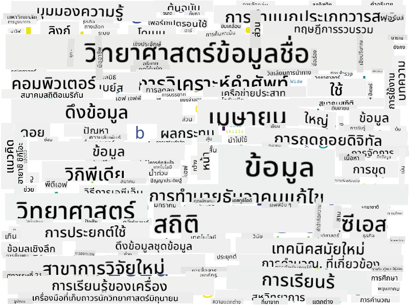

<!--
CO_OP_TRANSLATOR_METADATA:
{
  "original_hash": "2583a9894af7123b2fcae3376b14c035",
  "translation_date": "2025-08-26T21:30:01+00:00",
  "source_file": "1-Introduction/01-defining-data-science/README.md",
  "language_code": "th"
}
-->
## ประเภทของข้อมูล

อย่างที่เราได้กล่าวไปแล้ว ข้อมูลมีอยู่ทุกที่ เราเพียงแค่ต้องเก็บข้อมูลในวิธีที่เหมาะสม! การแยกแยะระหว่างข้อมูล **ที่มีโครงสร้าง** และ **ไม่มีโครงสร้าง** เป็นสิ่งที่มีประโยชน์ ข้อมูลที่มีโครงสร้างมักจะถูกนำเสนอในรูปแบบที่มีโครงสร้างชัดเจน เช่น ตารางหรือหลายตาราง ในขณะที่ข้อมูลที่ไม่มีโครงสร้างเป็นเพียงชุดของไฟล์ บางครั้งเรายังสามารถพูดถึงข้อมูล **กึ่งโครงสร้าง** ซึ่งมีโครงสร้างบางส่วนที่อาจแตกต่างกันไปอย่างมาก

| มีโครงสร้าง                                                                | กึ่งโครงสร้าง                                                                                 | ไม่มีโครงสร้าง                        |
| ---------------------------------------------------------------------------- | ---------------------------------------------------------------------------------------------- | --------------------------------------- |
| รายชื่อคนพร้อมหมายเลขโทรศัพท์ของพวกเขา                                     | หน้าของ Wikipedia พร้อมลิงก์                                                                   | ข้อความของสารานุกรม Britannica       |
| อุณหภูมิในทุกห้องของอาคารในทุกนาทีตลอด 20 ปีที่ผ่านมา                      | ชุดของบทความวิชาการในรูปแบบ JSON พร้อมผู้เขียน วันที่ตีพิมพ์ และบทคัดย่อ                     | ไฟล์เอกสารขององค์กร                   |
| ข้อมูลอายุและเพศของทุกคนที่เข้าอาคาร                                       | หน้าอินเทอร์เน็ต                                                                              | วิดีโอสดจากกล้องวงจรปิด               |

## แหล่งที่มาของข้อมูล

มีแหล่งข้อมูลที่เป็นไปได้มากมาย และคงเป็นไปไม่ได้ที่จะระบุทั้งหมด! อย่างไรก็ตาม มาลองพูดถึงแหล่งข้อมูลทั่วไปบางส่วนที่คุณสามารถหาได้:

* **ข้อมูลที่มีโครงสร้าง**
  - **Internet of Things** (IoT) รวมถึงข้อมูลจากเซ็นเซอร์ต่าง ๆ เช่น เซ็นเซอร์อุณหภูมิหรือความดัน ซึ่งให้ข้อมูลที่มีประโยชน์มากมาย ตัวอย่างเช่น หากอาคารสำนักงานติดตั้งเซ็นเซอร์ IoT เราสามารถควบคุมการทำความร้อนและแสงสว่างโดยอัตโนมัติเพื่อลดค่าใช้จ่าย
  - **แบบสำรวจ** ที่เราขอให้ผู้ใช้กรอกหลังการซื้อสินค้าหรือหลังจากเยี่ยมชมเว็บไซต์
  - **การวิเคราะห์พฤติกรรม** เช่น การช่วยให้เราเข้าใจว่าผู้ใช้เข้าไปในเว็บไซต์ลึกแค่ไหน และเหตุผลทั่วไปที่ทำให้พวกเขาออกจากเว็บไซต์
* **ข้อมูลที่ไม่มีโครงสร้าง**
  - **ข้อความ** สามารถเป็นแหล่งข้อมูลที่อุดมไปด้วย เช่น การวิเคราะห์ **คะแนนความรู้สึก** โดยรวม หรือการดึงคำสำคัญและความหมายเชิงความหมาย
  - **ภาพ** หรือ **วิดีโอ** วิดีโอจากกล้องวงจรปิดสามารถใช้ประเมินการจราจรบนถนน และแจ้งเตือนผู้คนเกี่ยวกับการจราจรติดขัด
  - **บันทึกเซิร์ฟเวอร์เว็บ** สามารถใช้เพื่อเข้าใจว่าหน้าใดของเว็บไซต์ของเราถูกเยี่ยมชมบ่อยที่สุด และใช้เวลานานแค่ไหน
* **กึ่งโครงสร้าง**
  - **กราฟเครือข่ายสังคม** สามารถเป็นแหล่งข้อมูลที่ยอดเยี่ยมเกี่ยวกับบุคลิกภาพของผู้ใช้และประสิทธิภาพที่อาจเกิดขึ้นในการกระจายข้อมูล
  - เมื่อเรามีภาพถ่ายจำนวนมากจากงานปาร์ตี้ เราสามารถพยายามดึงข้อมูล **พลวัตของกลุ่ม** โดยการสร้างกราฟของคนที่ถ่ายภาพร่วมกัน

เมื่อรู้แหล่งข้อมูลที่เป็นไปได้ต่าง ๆ คุณสามารถลองคิดถึงสถานการณ์ต่าง ๆ ที่เทคนิควิทยาศาสตร์ข้อมูลสามารถนำไปใช้เพื่อเข้าใจสถานการณ์ได้ดีขึ้น และปรับปรุงกระบวนการทางธุรกิจ

## สิ่งที่คุณสามารถทำได้กับข้อมูล

ในวิทยาศาสตร์ข้อมูล เรามุ่งเน้นไปที่ขั้นตอนต่อไปนี้ในเส้นทางของข้อมูล:

แน่นอนว่า ขึ้นอยู่กับข้อมูลจริง บางขั้นตอนอาจขาดหายไป (เช่น เมื่อเรามีข้อมูลอยู่ในฐานข้อมูลแล้ว หรือเมื่อเราไม่จำเป็นต้องฝึกโมเดล) หรือบางขั้นตอนอาจถูกทำซ้ำหลายครั้ง (เช่น การประมวลผลข้อมูล)

## การแปลงเป็นดิจิทัลและการเปลี่ยนแปลงทางดิจิทัล

ในทศวรรษที่ผ่านมา ธุรกิจจำนวนมากเริ่มเข้าใจถึงความสำคัญของข้อมูลในการตัดสินใจทางธุรกิจ เพื่อใช้หลักการวิทยาศาสตร์ข้อมูลในการดำเนินธุรกิจ สิ่งแรกที่ต้องทำคือการเก็บรวบรวมข้อมูล กล่าวคือ แปลงกระบวนการทางธุรกิจให้อยู่ในรูปแบบดิจิทัล ซึ่งเรียกว่า **การแปลงเป็นดิจิทัล** การใช้เทคนิควิทยาศาสตร์ข้อมูลกับข้อมูลนี้เพื่อชี้นำการตัดสินใจสามารถนำไปสู่การเพิ่มประสิทธิภาพอย่างมาก (หรือแม้กระทั่งการเปลี่ยนแปลงธุรกิจ) ซึ่งเรียกว่า **การเปลี่ยนแปลงทางดิจิทัล**

ลองพิจารณาตัวอย่าง สมมติว่าเรามีหลักสูตรวิทยาศาสตร์ข้อมูล (เช่นหลักสูตรนี้) ที่เราสอนออนไลน์ให้กับนักเรียน และเราต้องการใช้วิทยาศาสตร์ข้อมูลเพื่อปรับปรุงหลักสูตร เราจะทำได้อย่างไร?

เราสามารถเริ่มต้นด้วยการถามว่า "อะไรที่สามารถแปลงเป็นดิจิทัลได้?" วิธีที่ง่ายที่สุดคือการวัดเวลาที่นักเรียนแต่ละคนใช้ในการเรียนแต่ละโมดูล และวัดความรู้ที่ได้รับโดยการให้ทำแบบทดสอบแบบปรนัยเมื่อจบแต่ละโมดูล โดยการเฉลี่ยเวลาที่ใช้เรียนในแต่ละโมดูลของนักเรียนทั้งหมด เราสามารถค้นหาได้ว่าโมดูลใดที่ทำให้นักเรียนมีปัญหามากที่สุด และทำงานเพื่อปรับปรุงให้เข้าใจง่ายขึ้น
คุณอาจแย้งได้ว่าวิธีนี้ไม่ใช่วิธีที่เหมาะสมที่สุด เพราะโมดูลอาจมีความยาวต่างกัน อาจจะยุติธรรมกว่าถ้าแบ่งเวลาโดยพิจารณาจากความยาวของโมดูล (ในจำนวนตัวอักษร) แล้วเปรียบเทียบค่าที่ได้แทน
เมื่อเราเริ่มวิเคราะห์ผลลัพธ์ของการทดสอบแบบปรนัย เราสามารถพยายามระบุแนวคิดที่นักเรียนมีปัญหาในการทำความเข้าใจ และใช้ข้อมูลนั้นเพื่อปรับปรุงเนื้อหาได้ เพื่อทำเช่นนั้น เราจำเป็นต้องออกแบบการทดสอบในลักษณะที่แต่ละคำถามเชื่อมโยงกับแนวคิดหรือส่วนความรู้ที่เฉพาะเจาะจง

หากเราต้องการทำให้ซับซ้อนยิ่งขึ้น เราสามารถวางแผนเปรียบเทียบเวลาที่ใช้ในแต่ละโมดูลกับกลุ่มอายุของนักเรียน เราอาจพบว่าในบางกลุ่มอายุใช้เวลานานเกินไปในการทำโมดูลให้เสร็จ หรือว่านักเรียนเลิกเรียนก่อนที่จะทำเสร็จ สิ่งนี้สามารถช่วยให้เราแนะนำอายุที่เหมาะสมสำหรับโมดูล และลดความไม่พอใจของผู้คนจากความคาดหวังที่ผิดพลาด

## 🚀 ความท้าทาย

ในความท้าทายนี้ เราจะพยายามค้นหาแนวคิดที่เกี่ยวข้องกับสาขาวิทยาศาสตร์ข้อมูล (Data Science) โดยการดูจากข้อความ เราจะนำบทความจาก Wikipedia เกี่ยวกับวิทยาศาสตร์ข้อมูลมาดาวน์โหลดและประมวลผลข้อความ จากนั้นสร้าง Word Cloud ที่มีลักษณะดังนี้:

เยี่ยมชม [`notebook.ipynb`](../../../../../../../../../1-Introduction/01-defining-data-science/notebook.ipynb ':ignore') เพื่ออ่านโค้ด คุณยังสามารถรันโค้ดและดูว่ามันทำการแปลงข้อมูลทั้งหมดแบบเรียลไทม์ได้อย่างไร

> หากคุณไม่ทราบวิธีการรันโค้ดใน Jupyter Notebook ลองดู [บทความนี้](https://soshnikov.com/education/how-to-execute-notebooks-from-github/)

## [แบบทดสอบหลังการบรรยาย](https://purple-hill-04aebfb03.1.azurestaticapps.net/quiz/1)

## งานที่ได้รับมอบหมาย

* **งานที่ 1**: แก้ไขโค้ดด้านบนเพื่อค้นหาแนวคิดที่เกี่ยวข้องกับสาขา **Big Data** และ **Machine Learning**
* **งานที่ 2**: [คิดเกี่ยวกับสถานการณ์ในวิทยาศาสตร์ข้อมูล](assignment.md)

## เครดิต

บทเรียนนี้เขียนขึ้นด้วย ♥️ โดย [Dmitry Soshnikov](http://soshnikov.com)

---

**ข้อจำกัดความรับผิดชอบ**:  
เอกสารนี้ได้รับการแปลโดยใช้บริการแปลภาษา AI [Co-op Translator](https://github.com/Azure/co-op-translator) แม้ว่าเราจะพยายามให้การแปลมีความถูกต้องมากที่สุด แต่โปรดทราบว่าการแปลอัตโนมัติอาจมีข้อผิดพลาดหรือความไม่ถูกต้อง เอกสารต้นฉบับในภาษาดั้งเดิมควรถือเป็นแหล่งข้อมูลที่เชื่อถือได้ สำหรับข้อมูลที่สำคัญ ขอแนะนำให้ใช้บริการแปลภาษามืออาชีพ เราไม่รับผิดชอบต่อความเข้าใจผิดหรือการตีความผิดที่เกิดจากการใช้การแปลนี้