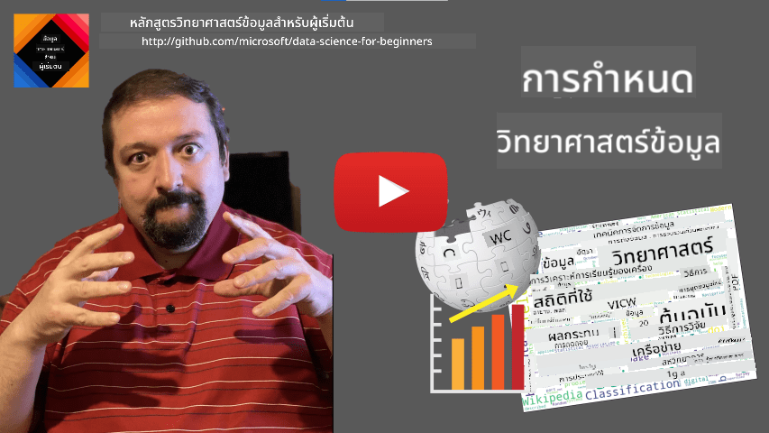

<!--
CO_OP_TRANSLATOR_METADATA:
{
  "original_hash": "43212cc1ac137b7bb1dcfb37ca06b0f4",
  "translation_date": "2025-10-25T18:53:55+00:00",
  "source_file": "1-Introduction/01-defining-data-science/README.md",
  "language_code": "th"
}
-->
# การนิยามวิทยาศาสตร์ข้อมูล

|  ](../../sketchnotes/01-Definitions.png) |
| :----------------------------------------------------------------------------------------------------: |
|              การนิยามวิทยาศาสตร์ข้อมูล - _สเก็ตโน้ตโดย [@nitya](https://twitter.com/nitya)_               |

---

## [แบบทดสอบก่อนการบรรยาย](https://ff-quizzes.netlify.app/en/ds/quiz/0)

## ข้อมูลคืออะไร?
ในชีวิตประจำวันของเรา เราถูกล้อมรอบด้วยข้อมูลอยู่ตลอดเวลา ข้อความที่คุณกำลังอ่านอยู่นี้ก็เป็นข้อมูล รายชื่อเบอร์โทรศัพท์ของเพื่อนในสมาร์ทโฟนของคุณก็เป็นข้อมูล เช่นเดียวกับเวลาปัจจุบันที่แสดงบนหน้าปัดนาฬิกา ในฐานะมนุษย์ เรามักจะจัดการกับข้อมูลโดยธรรมชาติ เช่น การนับเงินที่เรามี หรือการเขียนจดหมายถึงเพื่อน

อย่างไรก็ตาม ข้อมูลกลับมีความสำคัญมากขึ้นเมื่อมีการสร้างคอมพิวเตอร์ขึ้นมา หน้าที่หลักของคอมพิวเตอร์คือการคำนวณ แต่พวกมันต้องการข้อมูลเพื่อทำงาน ดังนั้นเราจึงต้องเข้าใจว่าคอมพิวเตอร์จัดเก็บและประมวลผลข้อมูลอย่างไร

เมื่ออินเทอร์เน็ตเกิดขึ้น บทบาทของคอมพิวเตอร์ในฐานะอุปกรณ์จัดการข้อมูลก็เพิ่มขึ้น หากคุณลองคิดดู เราใช้คอมพิวเตอร์มากขึ้นเรื่อย ๆ ในการประมวลผลและสื่อสารข้อมูล มากกว่าการคำนวณจริง ๆ เมื่อเราส่งอีเมลถึงเพื่อน หรือค้นหาข้อมูลในอินเทอร์เน็ต เรากำลังสร้าง จัดเก็บ ส่ง และจัดการข้อมูล

> คุณจำครั้งสุดท้ายที่คุณใช้คอมพิวเตอร์เพื่อคำนวณอะไรบางอย่างได้ไหม?

## วิทยาศาสตร์ข้อมูลคืออะไร?

ใน [Wikipedia](https://en.wikipedia.org/wiki/Data_science) **วิทยาศาสตร์ข้อมูล** ถูกนิยามว่าเป็น *สาขาวิทยาศาสตร์ที่ใช้วิธีการทางวิทยาศาสตร์เพื่อดึงความรู้และข้อมูลเชิงลึกจากข้อมูลที่มีโครงสร้างและไม่มีโครงสร้าง และนำความรู้และข้อมูลเชิงลึกที่สามารถนำไปปฏิบัติได้จากข้อมูลไปใช้ในหลากหลายโดเมนการใช้งาน*

คำจำกัดความนี้เน้นถึงแง่มุมสำคัญของวิทยาศาสตร์ข้อมูลดังนี้:

* เป้าหมายหลักของวิทยาศาสตร์ข้อมูลคือการ **ดึงความรู้** จากข้อมูล หรือพูดอีกอย่างคือการ **เข้าใจ** ข้อมูล ค้นหาความสัมพันธ์ที่ซ่อนอยู่ และสร้าง **โมเดล**
* วิทยาศาสตร์ข้อมูลใช้ **วิธีการทางวิทยาศาสตร์** เช่น ความน่าจะเป็นและสถิติ ในความเป็นจริง เมื่อคำว่า *วิทยาศาสตร์ข้อมูล* ถูกนำมาใช้ครั้งแรก บางคนแย้งว่าวิทยาศาสตร์ข้อมูลเป็นเพียงชื่อใหม่ที่ดูหรูหราสำหรับสถิติ แต่ปัจจุบันเห็นได้ชัดว่าสาขานี้มีความกว้างขวางกว่านั้นมาก
* ความรู้ที่ได้รับควรถูกนำไปใช้เพื่อสร้าง **ข้อมูลเชิงลึกที่สามารถนำไปปฏิบัติได้** หรือข้อมูลเชิงปฏิบัติที่สามารถนำไปใช้ในสถานการณ์ทางธุรกิจจริง
* เราควรสามารถจัดการกับข้อมูลที่มี **โครงสร้าง** และ **ไม่มีโครงสร้าง** ได้ เราจะกลับมาพูดถึงประเภทของข้อมูลต่าง ๆ ในภายหลังในหลักสูตรนี้
* **โดเมนการใช้งาน** เป็นแนวคิดที่สำคัญ และนักวิทยาศาสตร์ข้อมูลมักต้องมีความเชี่ยวชาญในระดับหนึ่งในโดเมนปัญหา เช่น การเงิน การแพทย์ การตลาด เป็นต้น

> อีกแง่มุมที่สำคัญของวิทยาศาสตร์ข้อมูลคือการศึกษาว่าข้อมูลสามารถถูกรวบรวม จัดเก็บ และดำเนินการโดยใช้คอมพิวเตอร์ได้อย่างไร ในขณะที่สถิติให้พื้นฐานทางคณิตศาสตร์ วิทยาศาสตร์ข้อมูลนำแนวคิดทางคณิตศาสตร์ไปใช้เพื่อดึงข้อมูลเชิงลึกจากข้อมูลจริง

หนึ่งในวิธีการ (ที่อ้างถึง [Jim Gray](https://en.wikipedia.org/wiki/Jim_Gray_(computer_scientist))) ในการมองวิทยาศาสตร์ข้อมูลคือการพิจารณาว่าเป็นกระบวนทัศน์แยกต่างหากของวิทยาศาสตร์:
* **เชิงประจักษ์** ซึ่งเราพึ่งพาการสังเกตและผลลัพธ์จากการทดลองเป็นหลัก
* **เชิงทฤษฎี** ที่แนวคิดใหม่ ๆ เกิดขึ้นจากความรู้ทางวิทยาศาสตร์ที่มีอยู่
* **เชิงคำนวณ** ที่เราค้นพบหลักการใหม่ ๆ จากการทดลองคำนวณบางอย่าง
* **ขับเคลื่อนด้วยข้อมูล** โดยอาศัยการค้นหาความสัมพันธ์และรูปแบบในข้อมูล

## สาขาอื่นที่เกี่ยวข้อง

เนื่องจากข้อมูลมีอยู่ทั่วไป วิทยาศาสตร์ข้อมูลจึงเป็นสาขาที่กว้างขวางและเกี่ยวข้องกับหลายสาขาวิชา

<dl>
<dt>ฐานข้อมูล</dt>
<dd>
สิ่งสำคัญคือ <b>วิธีการจัดเก็บ</b> ข้อมูล หรือวิธีการจัดโครงสร้างข้อมูลเพื่อให้สามารถประมวลผลได้เร็วขึ้น มีฐานข้อมูลหลายประเภทที่จัดเก็บข้อมูลที่มีโครงสร้างและไม่มีโครงสร้าง ซึ่ง <a href="../../2-Working-With-Data/README.md">เราจะพิจารณาในหลักสูตรของเรา</a>
</dd>
<dt>ข้อมูลขนาดใหญ่</dt>
<dd>
บ่อยครั้งที่เราต้องจัดเก็บและประมวลผลข้อมูลจำนวนมากที่มีโครงสร้างค่อนข้างง่าย มีวิธีการและเครื่องมือพิเศษในการจัดเก็บข้อมูลนั้นในลักษณะกระจายบนคลัสเตอร์คอมพิวเตอร์ และประมวลผลอย่างมีประสิทธิภาพ
</dd>
<dt>การเรียนรู้ของเครื่อง</dt>
<dd>
วิธีหนึ่งในการเข้าใจข้อมูลคือการ <b>สร้างโมเดล</b> ที่สามารถทำนายผลลัพธ์ที่ต้องการได้ การพัฒนาโมเดลจากข้อมูลเรียกว่า <b>การเรียนรู้ของเครื่อง</b> คุณอาจต้องการดู <a href="https://aka.ms/ml-beginners">หลักสูตรการเรียนรู้ของเครื่องสำหรับผู้เริ่มต้น</a> เพื่อเรียนรู้เพิ่มเติมเกี่ยวกับเรื่องนี้
</dd>
<dt>ปัญญาประดิษฐ์</dt>
<dd>
สาขาหนึ่งของการเรียนรู้ของเครื่องที่เรียกว่าปัญญาประดิษฐ์ (AI) ก็อาศัยข้อมูลเช่นกัน และเกี่ยวข้องกับการสร้างโมเดลที่มีความซับซ้อนสูงที่เลียนแบบกระบวนการคิดของมนุษย์ วิธีการ AI มักช่วยให้เราสามารถเปลี่ยนข้อมูลที่ไม่มีโครงสร้าง (เช่น ภาษาธรรมชาติ) ให้เป็นข้อมูลเชิงลึกที่มีโครงสร้าง
</dd>
<dt>การสร้างภาพ</dt>
<dd>
ข้อมูลจำนวนมหาศาลนั้นยากที่จะเข้าใจสำหรับมนุษย์ แต่เมื่อเราสร้างภาพที่มีประโยชน์จากข้อมูลนั้น เราสามารถเข้าใจข้อมูลได้มากขึ้น และสรุปผลบางอย่างได้ ดังนั้นจึงเป็นสิ่งสำคัญที่จะต้องรู้วิธีการสร้างภาพข้อมูลหลายรูปแบบ - สิ่งที่เราจะครอบคลุมใน <a href="../../3-Data-Visualization/README.md">ส่วนที่ 3</a> ของหลักสูตรของเรา สาขาที่เกี่ยวข้องยังรวมถึง <b>อินโฟกราฟิก</b> และ <b>ปฏิสัมพันธ์ระหว่างมนุษย์กับคอมพิวเตอร์</b> โดยทั่วไป
</dd>
</dl>

## ประเภทของข้อมูล

ดังที่เราได้กล่าวไปแล้ว ข้อมูลมีอยู่ทุกที่ เราเพียงแค่ต้องจับมันให้ถูกวิธี! การแยกแยะระหว่างข้อมูลที่มี **โครงสร้าง** และ **ไม่มีโครงสร้าง** เป็นสิ่งที่มีประโยชน์ ข้อมูลที่มีโครงสร้างมักจะถูกนำเสนอในรูปแบบที่มีโครงสร้างดี เช่น ตารางหรือจำนวนตาราง ในขณะที่ข้อมูลที่ไม่มีโครงสร้างเป็นเพียงการรวบรวมไฟล์ บางครั้งเรายังสามารถพูดถึงข้อมูลที่มี **กึ่งโครงสร้าง** ซึ่งมีโครงสร้างบางอย่างที่อาจแตกต่างกันอย่างมาก

| มีโครงสร้าง                                                                   | กึ่งโครงสร้าง                                                                                | ไม่มีโครงสร้าง                            |
| ---------------------------------------------------------------------------- | ---------------------------------------------------------------------------------------------- | --------------------------------------- |
| รายชื่อคนพร้อมเบอร์โทรศัพท์ของพวกเขา                                      | หน้า Wikipedia พร้อมลิงก์                                                                     | ข้อความของสารานุกรม Britannica        |
| อุณหภูมิในทุกห้องของอาคารทุกนาทีในช่วง 20 ปีที่ผ่านมา | การรวบรวมเอกสารวิชาการในรูปแบบ JSON พร้อมผู้เขียน วันที่เผยแพร่ และบทคัดย่อ | การแชร์ไฟล์ที่มีเอกสารขององค์กร     |
| ข้อมูลอายุและเพศของทุกคนที่เข้ามาในอาคาร                  | หน้าอินเทอร์เน็ต                                                                                 | วิดีโอดิบจากกล้องวงจรปิด |

## แหล่งข้อมูล

มีแหล่งข้อมูลที่เป็นไปได้มากมาย และมันจะเป็นไปไม่ได้ที่จะระบุทั้งหมด! อย่างไรก็ตาม ลองพูดถึงสถานที่ทั่วไปบางแห่งที่คุณสามารถรับข้อมูลได้:

* **มีโครงสร้าง**
  - **Internet of Things** (IoT) รวมถึงข้อมูลจากเซ็นเซอร์ต่าง ๆ เช่น เซ็นเซอร์อุณหภูมิหรือแรงดัน ให้ข้อมูลที่มีประโยชน์มากมาย ตัวอย่างเช่น หากอาคารสำนักงานติดตั้งเซ็นเซอร์ IoT เราสามารถควบคุมการทำความร้อนและแสงสว่างโดยอัตโนมัติเพื่อลดค่าใช้จ่าย
  - **แบบสำรวจ** ที่เราขอให้ผู้ใช้กรอกหลังการซื้อ หรือหลังจากเยี่ยมชมเว็บไซต์
  - **การวิเคราะห์พฤติกรรม** สามารถช่วยให้เราเข้าใจว่าผู้ใช้เข้าไปในเว็บไซต์ลึกแค่ไหน และเหตุผลทั่วไปที่ทำให้ผู้ใช้ละทิ้งเว็บไซต์
* **ไม่มีโครงสร้าง**
  - **ข้อความ** สามารถเป็นแหล่งข้อมูลเชิงลึกที่ดี เช่น **คะแนนความรู้สึกโดยรวม** หรือการดึงคำสำคัญและความหมายเชิงความหมาย
  - **ภาพ** หรือ **วิดีโอ** วิดีโอจากกล้องวงจรปิดสามารถใช้เพื่อประเมินการจราจรบนถนน และแจ้งเตือนผู้คนเกี่ยวกับการจราจรติดขัดที่อาจเกิดขึ้น
  - **บันทึกเซิร์ฟเวอร์เว็บ** สามารถใช้เพื่อทำความเข้าใจว่าหน้าใดของเว็บไซต์ของเราถูกเยี่ยมชมบ่อยที่สุด และใช้เวลานานแค่ไหน
* กึ่งโครงสร้าง
  - **กราฟเครือข่ายสังคม** สามารถเป็นแหล่งข้อมูลที่ดีเกี่ยวกับบุคลิกภาพของผู้ใช้และประสิทธิภาพที่เป็นไปได้ในการเผยแพร่ข้อมูล
  - เมื่อเรามีภาพถ่ายจำนวนมากจากงานปาร์ตี้ เราสามารถลองดึงข้อมูล **พลวัตของกลุ่ม** โดยการสร้างกราฟของคนที่ถ่ายภาพร่วมกัน

โดยการรู้แหล่งข้อมูลที่เป็นไปได้ต่าง ๆ คุณสามารถลองคิดเกี่ยวกับสถานการณ์ต่าง ๆ ที่เทคนิควิทยาศาสตร์ข้อมูลสามารถนำไปใช้เพื่อเข้าใจสถานการณ์ได้ดีขึ้น และปรับปรุงกระบวนการทางธุรกิจ

## สิ่งที่คุณสามารถทำได้ด้วยข้อมูล

ในวิทยาศาสตร์ข้อมูล เรามุ่งเน้นไปที่ขั้นตอนต่อไปนี้ในเส้นทางของข้อมูล:

<dl>
<dt>1) การเก็บข้อมูล</dt>
<dd>
ขั้นตอนแรกคือการรวบรวมข้อมูล ในหลายกรณีอาจเป็นกระบวนการที่ตรงไปตรงมา เช่น ข้อมูลที่เข้าสู่ฐานข้อมูลจากแอปพลิเคชันเว็บ บางครั้งเราจำเป็นต้องใช้เทคนิคพิเศษ ตัวอย่างเช่น ข้อมูลจากเซ็นเซอร์ IoT อาจมีปริมาณมากเกินไป และเป็นการปฏิบัติที่ดีที่จะใช้จุดสิ้นสุดการบัฟเฟอร์ เช่น IoT Hub เพื่อรวบรวมข้อมูลทั้งหมดก่อนการประมวลผลเพิ่มเติม
</dd>
<dt>2) การจัดเก็บข้อมูล</dt>
<dd>
การจัดเก็บข้อมูลอาจเป็นเรื่องท้าทาย โดยเฉพาะอย่างยิ่งหากเรากำลังพูดถึงข้อมูลขนาดใหญ่ เมื่อพิจารณาว่าจะจัดเก็บข้อมูลอย่างไร ควรคาดการณ์วิธีที่คุณต้องการสอบถามข้อมูลในอนาคต มีหลายวิธีที่ข้อมูลสามารถจัดเก็บได้:
<ul>
<li>ฐานข้อมูลเชิงสัมพันธ์จัดเก็บคอลเลกชันของตาราง และใช้ภาษาพิเศษที่เรียกว่า SQL ในการสอบถามข้อมูล โดยทั่วไป ตารางจะถูกจัดเป็นกลุ่มต่าง ๆ ที่เรียกว่าสคีมา ในหลายกรณีเราจำเป็นต้องแปลงข้อมูลจากรูปแบบเดิมให้เหมาะสมกับสคีมา</li>
<li><a href="https://en.wikipedia.org/wiki/NoSQL">ฐานข้อมูล NoSQL</a> เช่น <a href="https://azure.microsoft.com/services/cosmos-db/?WT.mc_id=academic-77958-bethanycheum">CosmosDB</a> ไม่บังคับใช้สคีมากับข้อมูล และอนุญาตให้จัดเก็บข้อมูลที่ซับซ้อนมากขึ้น เช่น เอกสาร JSON แบบลำดับชั้นหรือกราฟ อย่างไรก็ตาม ฐานข้อมูล NoSQL ไม่มีความสามารถในการสอบถามข้อมูลที่หลากหลายเหมือน SQL และไม่สามารถบังคับใช้ความสมบูรณ์ของการอ้างอิงได้ เช่น กฎเกี่ยวกับโครงสร้างข้อมูลในตารางและการกำกับดูแลความสัมพันธ์ระหว่างตาราง</li>
<li><a href="https://en.wikipedia.org/wiki/Data_lake">การจัดเก็บข้อมูลใน Data Lake</a> ใช้สำหรับการรวบรวมข้อมูลขนาดใหญ่ในรูปแบบดิบที่ไม่มีโครงสร้าง Data Lake มักใช้กับข้อมูลขนาดใหญ่ ซึ่งข้อมูลทั้งหมดไม่สามารถใส่ในเครื่องเดียวได้ และต้องจัดเก็บและประมวลผลโดยคลัสเตอร์เซิร์ฟเวอร์ <a href="https://en.wikipedia.org/wiki/Apache_Parquet">Parquet</a> เป็นรูปแบบข้อมูลที่มักใช้ร่วมกับข้อมูลขนาดใหญ่</li> 
</ul>
</dd>
<dt>3) การประมวลผลข้อมูล</dt>
<dd>
นี่คือส่วนที่น่าตื่นเต้นที่สุดของเส้นทางข้อมูล ซึ่งเกี่ยวข้องกับการแปลงข้อมูลจากรูปแบบเดิมไปเป็นรูปแบบที่สามารถใช้สำหรับการสร้างภาพ/การฝึกอบรมโมเดลได้ เมื่อจัดการกับข้อมูลที่ไม่มีโครงสร้าง เช่น ข้อความหรือภาพ เราอาจต้องใช้เทคนิค AI เพื่อดึง <b>คุณลักษณะ</b> จากข้อมูล เพื่อแปลงข้อมูลให้เป็นรูปแบบที่มีโครงสร้าง
</dd>
<dt>4) การสร้างภาพ / ข้อมูลเชิงลึกของมนุษย์</dt>
<dd>
บ่อยครั้ง เพื่อที่จะเข้าใจข้อมูล เราจำเป็นต้องสร้างภาพข้อมูล การมีเทคนิคการสร้างภาพที่หลากหลายในกล่องเครื่องมือของเรา เราสามารถค้นหามุมมองที่เหมาะสมเพื่อสร้างข้อมูลเชิงลึกได้ บ่อยครั้ง นักวิทยาศาสตร์ข้อมูลจำเป็นต้อง "เล่นกับข้อมูล" สร้างภาพข้อมูลหลายครั้งและมองหาความสัมพันธ์บางอย่าง นอกจากนี้ เราอาจใช้เทคนิคทางสถิติเพื่อทดสอบสมมติฐานหรือพิสูจน์ความสัมพันธ์ระหว่างข้อมูลต่าง ๆ
</dd>
<dt>5) การฝึกอบรมโมเดลการทำนาย</dt>
<dd>
เนื่องจากเป้าหมายสูงสุดของวิทยาศาสตร์ข้อมูลคือการสามารถตัดสินใจโดยอิงจากข้อมูล เราอาจต้องการใช้เทคนิคของ <a href="http://github.com/microsoft/ml-for-beginners">การเรียนรู้ของเครื่อง</a> เพื่อสร้างโมเดลการทำนาย เราสามารถใช้โมเดลนี้เพื่อทำการทำนายโดยใช้ชุดข้อมูลใหม่ที่มีโครงสร้างคล้ายกัน
</dd>
</dl>

แน่นอนว่า ขึ้นอยู่กับข้อมูลจริง บางขั้นตอนอาจหายไป (เช่น เมื่อเรามีข้อมูลอยู่ในฐานข้อมูลแล้ว หรือเมื่อเราไม่จำเป็นต้องฝึกอบรมโมเดล) หรือบางขั้นตอนอาจถูกทำซ้ำหลายครั้ง (เช่น การประมวลผลข้อมูล)

## การดิจิทัลและการเปลี่ยนแปลงดิจิทัล

ในทศวรรษที่ผ่านมา ธุรกิจหลายแห่งเริ่มเข้าใจถึงความสำคัญของข้อมูลเมื่อทำการตัดสินใจทางธุรกิจ เพื่อใช้หลักการวิทยาศาสตร์ข้อมูลในการดำเนินธุรกิจ ก่อนอื่นต้องรวบรวมข้อมูลบางอย่าง กล่าวคือ แปลงกระบวนการทางธุรกิจให้เป็นรูปแบบดิจิทัล สิ่งนี้เรียกว่า **การดิจิทัล** การใช้เทคนิควิทยาศาสตร์ข้อมูลกับข้อมูลนี้เพื่อแนะนำการตัดสินใจสามารถนำไปสู่การเพิ่มประสิทธิภาพอย่างมาก (หรือแม้กระทั่งการเปลี่ยนแปลงธุรกิจ) ซึ่งเรียกว่า **การเปลี่ยนแปลงดิจิทัล**

ลองพิจารณาตัวอย่าง สมมติว่าเรามีหลักสูตรวิทยาศาสตร์ข้อมูล (เช่น หลักสูตรนี้) ที่เราสอนออนไลน์ให้กับนักเรียน และเราต้องการใช้วิทยาศาสตร์ข้อมูลเพื่อปรับปรุงหลักสูตร เราจะทำได้อย่างไร?

เรา
> คุณอาจแย้งว่าวิธีนี้ไม่เหมาะสมเท่าไหร่ เพราะโมดูลอาจมีความยาวที่แตกต่างกัน อาจจะยุติธรรมกว่าถ้าแบ่งเวลาโดยพิจารณาจากความยาวของโมดูล (ในจำนวนตัวอักษร) และเปรียบเทียบค่าที่ได้แทน

เมื่อเราเริ่มวิเคราะห์ผลการทดสอบแบบปรนัย เราสามารถพยายามระบุแนวคิดที่นักเรียนมีความยากลำบากในการทำความเข้าใจ และใช้ข้อมูลนั้นเพื่อปรับปรุงเนื้อหา เพื่อทำสิ่งนี้ เราจำเป็นต้องออกแบบการทดสอบในลักษณะที่แต่ละคำถามเชื่อมโยงกับแนวคิดหรือส่วนความรู้เฉพาะ

หากเราต้องการทำให้ซับซ้อนยิ่งขึ้น เราสามารถวางกราฟเวลาที่ใช้ในแต่ละโมดูลเทียบกับกลุ่มอายุของนักเรียน เราอาจพบว่าในบางกลุ่มอายุใช้เวลานานเกินไปในการทำโมดูลให้เสร็จ หรือว่านักเรียนออกจากการเรียนก่อนที่จะทำโมดูลเสร็จ สิ่งนี้สามารถช่วยให้เราแนะนำอายุที่เหมาะสมสำหรับโมดูล และลดความไม่พอใจของผู้คนจากความคาดหวังที่ผิดพลาด

## 🚀 ความท้าทาย

ในความท้าทายนี้ เราจะพยายามค้นหาแนวคิดที่เกี่ยวข้องกับสาขาวิทยาศาสตร์ข้อมูลโดยการดูจากข้อความ เราจะนำบทความ Wikipedia เกี่ยวกับวิทยาศาสตร์ข้อมูลมาดาวน์โหลดและประมวลผลข้อความ จากนั้นสร้าง Word Cloud แบบนี้:

เยี่ยมชม [`notebook.ipynb`](../../../../1-Introduction/01-defining-data-science/notebook.ipynb ':ignore') เพื่ออ่านโค้ด คุณยังสามารถรันโค้ดและดูว่ามันทำการแปลงข้อมูลแบบเรียลไทม์อย่างไร 

> หากคุณไม่ทราบวิธีการรันโค้ดใน Jupyter Notebook ลองดู [บทความนี้](https://soshnikov.com/education/how-to-execute-notebooks-from-github/)

## [แบบทดสอบหลังการบรรยาย](https://ff-quizzes.netlify.app/en/ds/quiz/1)

## งานที่ได้รับมอบหมาย

* **งานที่ 1**: แก้ไขโค้ดด้านบนเพื่อค้นหาแนวคิดที่เกี่ยวข้องกับสาขา **Big Data** และ **Machine Learning**
* **งานที่ 2**: [คิดเกี่ยวกับสถานการณ์ในวิทยาศาสตร์ข้อมูล](assignment.md)

## เครดิต

บทเรียนนี้ถูกเขียนขึ้นด้วย ♥️ โดย [Dmitry Soshnikov](http://soshnikov.com)

---

**ข้อจำกัดความรับผิดชอบ**:  
เอกสารนี้ได้รับการแปลโดยใช้บริการแปลภาษา AI [Co-op Translator](https://github.com/Azure/co-op-translator) แม้ว่าเราจะพยายามให้การแปลมีความถูกต้อง แต่โปรดทราบว่าการแปลโดยอัตโนมัติอาจมีข้อผิดพลาดหรือความไม่ถูกต้อง เอกสารต้นฉบับในภาษาดั้งเดิมควรถือเป็นแหล่งข้อมูลที่เชื่อถือได้ สำหรับข้อมูลที่สำคัญ ขอแนะนำให้ใช้บริการแปลภาษามืออาชีพ เราไม่รับผิดชอบต่อความเข้าใจผิดหรือการตีความผิดที่เกิดจากการใช้การแปลนี้