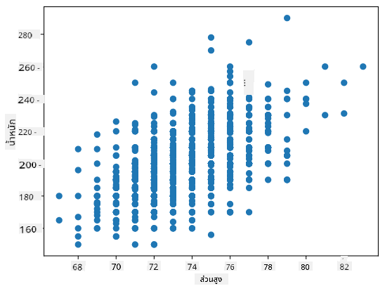

<!--
CO_OP_TRANSLATOR_METADATA:
{
  "original_hash": "ce95884566a74db72572cd51f0cb25ad",
  "translation_date": "2025-09-06T13:34:44+00:00",
  "source_file": "1-Introduction/04-stats-and-probability/README.md",
  "language_code": "th"
}
-->
# บทนำสั้น ๆ เกี่ยวกับสถิติและความน่าจะเป็น

| ](../../sketchnotes/04-Statistics-Probability.png)|
|:---:|
| สถิติและความน่าจะเป็น - _Sketchnote โดย [@nitya](https://twitter.com/nitya)_ |

ทฤษฎีสถิติและความน่าจะเป็นเป็นสองสาขาที่เกี่ยวข้องกันอย่างมากในคณิตศาสตร์ และมีความสำคัญอย่างยิ่งต่อวิทยาศาสตร์ข้อมูล แม้ว่าเราจะสามารถทำงานกับข้อมูลได้โดยไม่ต้องมีความรู้ทางคณิตศาสตร์ลึกซึ้ง แต่การมีความเข้าใจพื้นฐานบางอย่างก็ยังดีกว่า ที่นี่เราจะนำเสนอการแนะนำสั้น ๆ ที่จะช่วยให้คุณเริ่มต้นได้

[](https://youtu.be/Z5Zy85g4Yjw)

## [แบบทดสอบก่อนเรียน](https://ff-quizzes.netlify.app/en/ds/quiz/6)

## ความน่าจะเป็นและตัวแปรสุ่ม

**ความน่าจะเป็น** คือค่าตัวเลขระหว่าง 0 ถึง 1 ที่แสดงถึงความเป็นไปได้ของ **เหตุการณ์** โดยนิยามเป็นจำนวนผลลัพธ์ที่เป็นบวก (ที่นำไปสู่เหตุการณ์นั้น) หารด้วยจำนวนผลลัพธ์ทั้งหมด โดยที่ผลลัพธ์ทั้งหมดมีความน่าจะเป็นเท่ากัน ตัวอย่างเช่น เมื่อเราทอยลูกเต๋า ความน่าจะเป็นที่เราจะได้เลขคู่คือ 3/6 = 0.5

เมื่อเราพูดถึงเหตุการณ์ เราใช้ **ตัวแปรสุ่ม** ตัวอย่างเช่น ตัวแปรสุ่มที่แสดงถึงตัวเลขที่ได้จากการทอยลูกเต๋าจะมีค่าตั้งแต่ 1 ถึง 6 ชุดตัวเลขตั้งแต่ 1 ถึง 6 เรียกว่า **พื้นที่ตัวอย่าง** เราสามารถพูดถึงความน่าจะเป็นของตัวแปรสุ่มที่มีค่าเฉพาะ เช่น P(X=3)=1/6

ตัวแปรสุ่มในตัวอย่างก่อนหน้านี้เรียกว่า **ตัวแปรแบบไม่ต่อเนื่อง** เพราะมันมีพื้นที่ตัวอย่างที่นับได้ กล่าวคือ มีค่าที่แยกกันและสามารถระบุได้ มีกรณีที่พื้นที่ตัวอย่างเป็นช่วงของตัวเลขจริง หรือชุดตัวเลขจริงทั้งหมด ตัวแปรเหล่านี้เรียกว่า **ตัวแปรแบบต่อเนื่อง** ตัวอย่างที่ดีคือเวลาที่รถบัสมาถึง

## การแจกแจงความน่าจะเป็น

ในกรณีของตัวแปรสุ่มแบบไม่ต่อเนื่อง การอธิบายความน่าจะเป็นของแต่ละเหตุการณ์ทำได้ง่ายโดยใช้ฟังก์ชัน P(X) สำหรับแต่ละค่าที่เป็น *s* จากพื้นที่ตัวอย่าง *S* ฟังก์ชันจะให้ค่าตัวเลขระหว่าง 0 ถึง 1 โดยที่ผลรวมของค่าทั้งหมดของ P(X=s) สำหรับทุกเหตุการณ์จะเท่ากับ 1

การแจกแจงแบบไม่ต่อเนื่องที่รู้จักกันดีที่สุดคือ **การแจกแจงแบบสม่ำเสมอ** ซึ่งมีพื้นที่ตัวอย่างที่มี N องค์ประกอบ โดยมีความน่าจะเป็นเท่ากันที่ 1/N สำหรับแต่ละองค์ประกอบ

การอธิบายการแจกแจงความน่าจะเป็นของตัวแปรแบบต่อเนื่องนั้นยากกว่า โดยมีค่าที่ดึงมาจากช่วง [a,b] หรือชุดตัวเลขจริงทั้งหมด ℝ ลองพิจารณากรณีเวลาที่รถบัสมาถึง ในความเป็นจริง สำหรับเวลาที่มาถึง *t* ที่แน่นอน ความน่าจะเป็นที่รถบัสจะมาถึงเวลานั้นคือ 0!

> ตอนนี้คุณรู้แล้วว่าเหตุการณ์ที่มีความน่าจะเป็น 0 สามารถเกิดขึ้นได้ และเกิดขึ้นบ่อยมาก! อย่างน้อยก็ทุกครั้งที่รถบัสมาถึง!

เราสามารถพูดถึงความน่าจะเป็นของตัวแปรที่อยู่ในช่วงค่าที่กำหนด เช่น P(t<sub>1</sub>≤X<t<sub>2</sub>) ในกรณีนี้ การแจกแจงความน่าจะเป็นจะถูกอธิบายโดย **ฟังก์ชันความหนาแน่นของความน่าจะเป็น** p(x) โดยที่


การแจกแจงแบบต่อเนื่องที่เป็นแบบสม่ำเสมอเรียกว่า **การแจกแจงแบบสม่ำเสมอต่อเนื่อง** ซึ่งถูกนิยามในช่วงจำกัด ความน่าจะเป็นที่ค่าของ X อยู่ในช่วงที่มีความยาว l จะเป็นสัดส่วนกับ l และเพิ่มขึ้นจนถึง 1

การแจกแจงที่สำคัญอีกแบบหนึ่งคือ **การแจกแจงแบบปกติ** ซึ่งเราจะพูดถึงรายละเอียดเพิ่มเติมด้านล่าง

## ค่าเฉลี่ย ความแปรปรวน และส่วนเบี่ยงเบนมาตรฐาน

สมมติว่าเราดึงลำดับของตัวอย่าง n ตัวอย่างของตัวแปรสุ่ม X: x<sub>1</sub>, x<sub>2</sub>, ..., x<sub>n</sub> เราสามารถนิยาม **ค่าเฉลี่ย** (หรือ **ค่าเฉลี่ยเลขคณิต**) ของลำดับในแบบดั้งเดิมเป็น (x<sub>1</sub>+x<sub>2</sub>+x<sub>n</sub>)/n เมื่อเราขยายขนาดของตัวอย่าง (เช่น ใช้ขีดจำกัด n→∞) เราจะได้ค่าเฉลี่ย (หรือเรียกว่า **ค่าคาดหวัง**) ของการแจกแจง เราจะใช้สัญลักษณ์ **E**(x) แทนค่าคาดหวัง

> สามารถแสดงให้เห็นได้ว่า สำหรับการแจกแจงแบบไม่ต่อเนื่องใด ๆ ที่มีค่า {x<sub>1</sub>, x<sub>2</sub>, ..., x<sub>N</sub>} และความน่าจะเป็นที่สอดคล้องกัน p<sub>1</sub>, p<sub>2</sub>, ..., p<sub>N</sub> ค่าคาดหวังจะเท่ากับ E(X)=x<sub>1</sub>p<sub>1</sub>+x<sub>2</sub>p<sub>2</sub>+...+x<sub>N</sub>p<sub>N</sub>

เพื่อระบุว่าค่าต่าง ๆ กระจายตัวออกไปมากน้อยเพียงใด เราสามารถคำนวณความแปรปรวน σ<sup>2</sup> = ∑(x<sub>i</sub> - μ)<sup>2</sup>/n โดยที่ μ คือค่าเฉลี่ยของลำดับ ค่าของ σ เรียกว่า **ส่วนเบี่ยงเบนมาตรฐาน** และ σ<sup>2</sup> เรียกว่า **ความแปรปรวน**

## ค่าโหมด ค่าเมดียน และควอร์ไทล์

บางครั้ง ค่าเฉลี่ยไม่สามารถแสดงถึงค่าที่ "ปกติ" ของข้อมูลได้อย่างเหมาะสม ตัวอย่างเช่น เมื่อมีค่าที่สุดโต่งบางค่าอยู่ไกลจากช่วงปกติ มันสามารถส่งผลกระทบต่อค่าเฉลี่ย ตัวบ่งชี้ที่ดีอีกตัวคือ **ค่าเมดียน** ซึ่งเป็นค่าที่ครึ่งหนึ่งของจุดข้อมูลต่ำกว่ามัน และอีกครึ่งหนึ่งสูงกว่ามัน

เพื่อช่วยให้เราเข้าใจการแจกแจงของข้อมูล การพูดถึง **ควอร์ไทล์** มีประโยชน์:

* ควอร์ไทล์แรก หรือ Q1 คือค่าที่ 25% ของข้อมูลต่ำกว่ามัน
* ควอร์ไทล์ที่สาม หรือ Q3 คือค่าที่ 75% ของข้อมูลต่ำกว่ามัน

เราสามารถแสดงความสัมพันธ์ระหว่างค่าเมดียนและควอร์ไทล์ในแผนภาพที่เรียกว่า **กล่องแผนภาพ**:


ที่นี่เรายังคำนวณ **ช่วงระหว่างควอร์ไทล์** IQR=Q3-Q1 และค่าที่เรียกว่า **ค่าผิดปกติ** - ค่าที่อยู่นอกขอบเขต [Q1-1.5*IQR,Q3+1.5*IQR]

สำหรับการแจกแจงที่มีจำนวนค่าที่เป็นไปได้เล็กน้อย ค่า "ปกติ" ที่ดีคือค่าที่ปรากฏบ่อยที่สุด ซึ่งเรียกว่า **ค่าโหมด** มันมักถูกใช้กับข้อมูลเชิงหมวดหมู่ เช่น สี ลองพิจารณาสถานการณ์ที่เรามีกลุ่มคนสองกลุ่ม - กลุ่มหนึ่งที่ชอบสีแดงอย่างมาก และอีกกลุ่มที่ชอบสีน้ำเงิน หากเรารหัสสีด้วยตัวเลข ค่าเฉลี่ยสำหรับสีที่ชอบจะอยู่ในช่วงสีส้ม-เขียว ซึ่งไม่ได้แสดงถึงความชอบที่แท้จริงของทั้งสองกลุ่ม อย่างไรก็ตาม ค่าโหมดจะเป็นสีใดสีหนึ่ง หรือทั้งสองสี หากจำนวนคนที่เลือกสีเท่ากัน (ในกรณีนี้เราเรียกตัวอย่างว่า **มัลติโหมด**)

## ข้อมูลในโลกจริง

เมื่อเราวิเคราะห์ข้อมูลจากชีวิตจริง ข้อมูลเหล่านั้นมักไม่ใช่ตัวแปรสุ่มในแง่ที่ว่าเราไม่ได้ทำการทดลองที่มีผลลัพธ์ที่ไม่ทราบล่วงหน้า ตัวอย่างเช่น ลองพิจารณาทีมเบสบอลและข้อมูลร่างกายของพวกเขา เช่น ส่วนสูง น้ำหนัก และอายุ ตัวเลขเหล่านี้ไม่ใช่ตัวแปรสุ่มอย่างแท้จริง แต่เรายังสามารถใช้แนวคิดทางคณิตศาสตร์เดียวกันได้ ตัวอย่างเช่น ลำดับน้ำหนักของผู้คนสามารถถือว่าเป็นลำดับค่าที่ดึงมาจากตัวแปรสุ่มบางตัว ด้านล่างคือลำดับน้ำหนักของผู้เล่นเบสบอลจริงจาก [Major League Baseball](http://mlb.mlb.com/index.jsp) ซึ่งนำมาจาก [ชุดข้อมูลนี้](http://wiki.stat.ucla.edu/socr/index.php/SOCR_Data_MLB_HeightsWeights) (เพื่อความสะดวก มีการแสดงเพียง 20 ค่าตัวอย่างแรก):

```
[180.0, 215.0, 210.0, 210.0, 188.0, 176.0, 209.0, 200.0, 231.0, 180.0, 188.0, 180.0, 185.0, 160.0, 180.0, 185.0, 197.0, 189.0, 185.0, 219.0]
```

> **หมายเหตุ**: หากต้องการดูตัวอย่างการทำงานกับชุดข้อมูลนี้ ลองดูที่ [สมุดบันทึกที่เกี่ยวข้อง](notebook.ipynb) นอกจากนี้ยังมีความท้าทายหลายอย่างตลอดบทเรียนนี้ และคุณสามารถทำให้เสร็จโดยเพิ่มโค้ดบางส่วนลงในสมุดบันทึกนั้น หากคุณไม่แน่ใจว่าจะทำงานกับข้อมูลอย่างไร ไม่ต้องกังวล - เราจะกลับมาทำงานกับข้อมูลโดยใช้ Python ในภายหลัง หากคุณไม่ทราบวิธีการรันโค้ดใน Jupyter Notebook ลองดู [บทความนี้](https://soshnikov.com/education/how-to-execute-notebooks-from-github/)

นี่คือกล่องแผนภาพที่แสดงค่าเฉลี่ย ค่าเมดียน และควอร์ไทล์สำหรับข้อมูลของเรา:


เนื่องจากข้อมูลของเรามีข้อมูลเกี่ยวกับ **บทบาท** ของผู้เล่นที่แตกต่างกัน เราสามารถสร้างกล่องแผนภาพตามบทบาทได้ - ซึ่งจะช่วยให้เราเข้าใจว่าค่าพารามิเตอร์แตกต่างกันอย่างไรในแต่ละบทบาท ครั้งนี้เราจะพิจารณาส่วนสูง:


แผนภาพนี้แสดงให้เห็นว่า โดยเฉลี่ยแล้ว ส่วนสูงของผู้เล่นตำแหน่งเบสแรกสูงกว่าส่วนสูงของผู้เล่นตำแหน่งเบสที่สอง ในบทเรียนนี้เราจะเรียนรู้วิธีการทดสอบสมมติฐานนี้อย่างเป็นทางการมากขึ้น และวิธีการแสดงให้เห็นว่าข้อมูลของเรามีความสำคัญทางสถิติในการแสดงผลลัพธ์นี้

> เมื่อทำงานกับข้อมูลในโลกจริง เราถือว่าจุดข้อมูลทั้งหมดเป็นตัวอย่างที่ดึงมาจากการแจกแจงความน่าจะเป็นบางอย่าง สมมติฐานนี้ช่วยให้เราสามารถใช้เทคนิคการเรียนรู้ของเครื่องและสร้างแบบจำลองการทำนายที่ใช้งานได้

เพื่อดูว่าการแจกแจงของข้อมูลของเราเป็นอย่างไร เราสามารถสร้างกราฟที่เรียกว่า **ฮิสโตแกรม** แกน X จะมีจำนวนช่วงน้ำหนักที่แตกต่างกัน (เรียกว่า **bins**) และแกนตั้งจะแสดงจำนวนครั้งที่ตัวอย่างตัวแปรสุ่มอยู่ในช่วงที่กำหนด


จากฮิสโตแกรมนี้คุณจะเห็นว่าค่าทั้งหมดกระจุกตัวอยู่รอบ ๆ น้ำหนักเฉลี่ยบางค่า และยิ่งเราออกห่างจากน้ำหนักนั้น - น้ำหนักที่มีค่านั้นจะยิ่งพบได้น้อยลง กล่าวคือ เป็นไปได้น้อยมากที่น้ำหนักของผู้เล่นเบสบอลจะต่างจากน้ำหนักเฉลี่ย ความแปรปรวนของน้ำหนักแสดงถึงขอบเขตที่น้ำหนักมีแนวโน้มที่จะต่างจากค่าเฉลี่ย

> หากเรานำน้ำหนักของคนอื่นที่ไม่ใช่จากลีกเบสบอล การแจกแจงมีแนวโน้มที่จะต่างออกไป อย่างไรก็ตาม รูปร่างของการแจกแจงจะเหมือนเดิม แต่ค่าเฉลี่ยและความแปรปรวนจะเปลี่ยนไป ดังนั้น หากเราเทรนแบบจำลองของเราด้วยผู้เล่นเบสบอล มันมีแนวโน้มที่จะให้ผลลัพธ์ที่ผิดเมื่อใช้กับนักศึกษามหาวิทยาลัย เพราะการแจกแจงพื้นฐานแตกต่างกัน

## การแจกแจงแบบปกติ

การแจกแจงน้ำหนักที่เราเห็นด้านบนเป็นเรื่องปกติมาก และการวัดหลายอย่างจากโลกจริงมีการแจกแจงแบบเดียวกัน แต่มีค่าเฉลี่ยและความแปรปรวนที่แตกต่างกัน การแจกแจงนี้เรียกว่า **การแจกแจงแบบปกติ** และมันมีบทบาทสำคัญในสถิติ

การใช้การแจกแจงแบบปกติเป็นวิธีที่ถูกต้องในการสร้างน้ำหนักสุ่มของผู้เล่นเบสบอลที่มีศักยภาพ เมื่อเรารู้ค่าเฉลี่ยน้ำหนัก `mean` และส่วนเบี่ยงเบนมาตรฐาน `std` เราสามารถสร้างตัวอย่างน้ำหนัก 1000 ตัวอย่างในวิธีต่อไปนี้:
```python
samples = np.random.normal(mean,std,1000)
```

หากเราสร้างฮิสโตแกรมของตัวอย่างที่สร้างขึ้น เราจะเห็นภาพที่คล้ายกับภาพที่แสดงด้านบน และหากเราเพิ่มจำนวนตัวอย่างและจำนวน bins เราสามารถสร้างภาพการแจกแจงแบบปกติที่ใกล้เคียงกับอุดมคติมากขึ้น:


*การแจกแจงแบบปกติที่มีค่าเฉลี่ย=0 และส่วนเบี่ยงเบนมาตรฐาน=1*

## ช่วงความเชื่อมั่น

เมื่อเราพูดถึงน้ำหนักของผู้เล่นเบสบอล เราถือว่ามี **ตัวแปรสุ่ม W** ที่สอดคล้องกับการแจกแจงความน่าจะเป็นที่เหมาะสมของน้ำหนักของผู้เล่นเบสบอลทั้งหมด (เรียกว่า **ประชากร**) ลำดับน้ำหนักของเราสอดคล้องกับชุดย่อยของผู้เล่นเบสบอลทั้งหมดที่เราเรียกว่า **ตัวอย่าง** คำถามที่น่าสนใจคือ เราสามารถทราบพารามิเตอร์ของการแจกแจงของ W ได้หรือไม่ เช่น ค่าเฉลี่ยและความแปรปรวนของประชากร?

คำตอบที่ง่ายที่สุดคือการคำนวณค่าเฉลี่ยและความแปรปรวนของตัวอย่างของเรา อย่างไรก็ตาม อาจเกิดขึ้นได้ว่าตัวอย่างสุ่มของเราไม่ได้แสดงถึงประชากรทั้งหมดอย่างถูกต้อง ดังนั้นจึงสมเหตุสมผลที่จะพูดถึง **ช่วงความเชื่อมั่น**

> **ช่วงความเชื่อมั่น** คือการประมาณค่าค่าเฉลี่ยที่แท้จริงของประชากรโดยอิงจากตัวอย่างของเรา ซึ่งมีความแม่นยำในระดับความน่าจะเป็นที่กำหนด (หรือ **ระดับความเชื่อมั่น**)

1</sub>, ..., X<sub>n</sub> จากการแจกแจงของเรา ทุกครั้งที่เราสุ่มตัวอย่างจากการแจกแจง เราจะได้ค่ามัชฌิม μ ที่แตกต่างกัน ดังนั้น μ สามารถถือว่าเป็นตัวแปรสุ่มได้ **ช่วงความเชื่อมั่น** ที่มีความเชื่อมั่น p คือคู่ของค่า (L<sub>p</sub>,R<sub>p</sub>) ซึ่ง **P**(L<sub>p</sub>≤μ≤R<sub>p</sub>) = p กล่าวคือ ความน่าจะเป็นที่ค่ามัชฌิมที่วัดได้อยู่ในช่วงนี้เท่ากับ p

การคำนวณช่วงความเชื่อมั่นอย่างละเอียดเกินกว่าที่เราจะอธิบายได้ในบทนำสั้นๆ นี้ รายละเอียดเพิ่มเติมสามารถดูได้ที่ [Wikipedia](https://en.wikipedia.org/wiki/Confidence_interval) โดยสรุป เรากำหนดการแจกแจงของค่ามัชฌิมที่คำนวณได้เมื่อเทียบกับค่ามัชฌิมจริงของประชากร ซึ่งเรียกว่า **การแจกแจงแบบนักเรียน (Student distribution)**

> **ข้อเท็จจริงที่น่าสนใจ**: การแจกแจงแบบนักเรียนถูกตั้งชื่อตามนักคณิตศาสตร์ William Sealy Gosset ซึ่งตีพิมพ์งานวิจัยของเขาภายใต้นามแฝง "Student" เขาทำงานในโรงเบียร์ Guinness และตามหนึ่งในเรื่องเล่า นายจ้างของเขาไม่ต้องการให้สาธารณชนทราบว่าพวกเขาใช้การทดสอบทางสถิติเพื่อกำหนดคุณภาพของวัตถุดิบ

หากเราต้องการประมาณค่ามัชฌิม μ ของประชากรด้วยความเชื่อมั่น p เราจำเป็นต้องใช้ *(1-p)/2-th percentile* ของการแจกแจงแบบนักเรียน A ซึ่งสามารถหาได้จากตาราง หรือคำนวณด้วยฟังก์ชันในซอฟต์แวร์สถิติ (เช่น Python, R เป็นต้น) จากนั้นช่วงสำหรับ μ จะถูกกำหนดโดย X±A*D/√n โดยที่ X คือค่ามัชฌิมที่ได้จากตัวอย่าง และ D คือค่าเบี่ยงเบนมาตรฐาน

> **หมายเหตุ**: เราไม่ได้พูดถึงแนวคิดสำคัญของ [degrees of freedom](https://en.wikipedia.org/wiki/Degrees_of_freedom_(statistics)) ซึ่งมีความสำคัญในความสัมพันธ์กับการแจกแจงแบบนักเรียน คุณสามารถศึกษาเพิ่มเติมจากหนังสือสถิติที่สมบูรณ์ยิ่งขึ้นเพื่อทำความเข้าใจแนวคิดนี้

ตัวอย่างการคำนวณช่วงความเชื่อมั่นสำหรับน้ำหนักและส่วนสูงสามารถดูได้ใน [notebook ที่แนบมา](notebook.ipynb)

| p | ค่ามัชฌิมน้ำหนัก |
|-----|-----------|
| 0.85 | 201.73±0.94 |
| 0.90 | 201.73±1.08 |
| 0.95 | 201.73±1.28 |

สังเกตว่าเมื่อความน่าจะเป็นของความเชื่อมั่นสูงขึ้น ช่วงความเชื่อมั่นก็จะกว้างขึ้น

## การทดสอบสมมติฐาน

ในชุดข้อมูลนักเบสบอลของเรา มีบทบาทของผู้เล่นที่แตกต่างกัน ซึ่งสามารถสรุปได้ดังนี้ (ดู [notebook ที่แนบมา](notebook.ipynb) เพื่อดูวิธีการคำนวณตารางนี้):

| บทบาท | ส่วนสูง | น้ำหนัก | จำนวน |
|------|--------|--------|-------|
| Catcher | 72.723684 | 204.328947 | 76 |
| Designated_Hitter | 74.222222 | 220.888889 | 18 |
| First_Baseman | 74.000000 | 213.109091 | 55 |
| Outfielder | 73.010309 | 199.113402 | 194 |
| Relief_Pitcher | 74.374603 | 203.517460 | 315 |
| Second_Baseman | 71.362069 | 184.344828 | 58 |
| Shortstop | 71.903846 | 182.923077 | 52 |
| Starting_Pitcher | 74.719457 | 205.163636 | 221 |
| Third_Baseman | 73.044444 | 200.955556 | 45 |

เราสามารถสังเกตได้ว่าค่ามัชฌิมส่วนสูงของ First Basemen สูงกว่าของ Second Basemen ดังนั้นเราอาจสรุปได้ว่า **First Basemen สูงกว่า Second Basemen**

> ข้อความนี้เรียกว่า **สมมติฐาน** เพราะเราไม่ทราบว่าข้อเท็จจริงนี้เป็นจริงหรือไม่

อย่างไรก็ตาม ไม่ใช่เรื่องง่ายเสมอไปที่จะสรุปเช่นนี้ จากการอภิปรายข้างต้น เราทราบว่าค่ามัชฌิมแต่ละค่ามีช่วงความเชื่อมั่นที่เกี่ยวข้อง และความแตกต่างนี้อาจเป็นเพียงข้อผิดพลาดทางสถิติ เราจำเป็นต้องมีวิธีการที่เป็นทางการมากขึ้นในการทดสอบสมมติฐานของเรา

ลองคำนวณช่วงความเชื่อมั่นแยกกันสำหรับส่วนสูงของ First และ Second Basemen:

| ความเชื่อมั่น | First Basemen | Second Basemen |
|------------|---------------|----------------|
| 0.85 | 73.62..74.38 | 71.04..71.69 |
| 0.90 | 73.56..74.44 | 70.99..71.73 |
| 0.95 | 73.47..74.53 | 70.92..71.81 |

เราสามารถเห็นได้ว่าไม่มีช่วงความเชื่อมั่นใดที่ทับซ้อนกัน นั่นพิสูจน์สมมติฐานของเราว่า First Basemen สูงกว่า Second Basemen

ในเชิงรูปธรรม ปัญหาที่เรากำลังแก้คือการดูว่า **การแจกแจงความน่าจะเป็นสองชุดเหมือนกันหรือไม่** หรืออย่างน้อยมีพารามิเตอร์เดียวกันหรือไม่ ขึ้นอยู่กับการแจกแจง เราจำเป็นต้องใช้การทดสอบที่แตกต่างกัน หากเราทราบว่าการแจกแจงของเรามีลักษณะปกติ เราสามารถใช้ **[Student t-test](https://en.wikipedia.org/wiki/Student%27s_t-test)**

ใน Student t-test เราคำนวณค่าที่เรียกว่า **t-value** ซึ่งบ่งบอกถึงความแตกต่างระหว่างค่ามัชฌิม โดยคำนึงถึงความแปรปรวน มีการพิสูจน์ว่าค่า t-value มีการแจกแจงแบบนักเรียน ซึ่งช่วยให้เราสามารถหาค่าขีดจำกัดสำหรับระดับความเชื่อมั่น **p** (สามารถคำนวณหรือดูจากตารางตัวเลข) จากนั้นเราจะเปรียบเทียบ t-value กับค่าขีดจำกัดนี้เพื่อยืนยันหรือปฏิเสธสมมติฐาน

ใน Python เราสามารถใช้แพ็กเกจ **SciPy** ซึ่งมีฟังก์ชัน `ttest_ind` (นอกเหนือจากฟังก์ชันทางสถิติที่มีประโยชน์อื่นๆ!) ฟังก์ชันนี้คำนวณค่า t-value ให้เรา และยังทำการค้นหาค่าความเชื่อมั่น p-value ย้อนกลับ ดังนั้นเราสามารถดูค่าความเชื่อมั่นเพื่อสรุปผลได้

ตัวอย่างเช่น การเปรียบเทียบระหว่างส่วนสูงของ First และ Second Basemen ให้ผลลัพธ์ดังนี้:
```python
from scipy.stats import ttest_ind

tval, pval = ttest_ind(df.loc[df['Role']=='First_Baseman',['Height']], df.loc[df['Role']=='Designated_Hitter',['Height']],equal_var=False)
print(f"T-value = {tval[0]:.2f}\nP-value: {pval[0]}")
```
```
T-value = 7.65
P-value: 9.137321189738925e-12
```
ในกรณีของเรา ค่า p-value ต่ำมาก หมายความว่ามีหลักฐานที่แข็งแกร่งสนับสนุนว่า First Basemen สูงกว่า

นอกจากนี้ยังมีสมมติฐานประเภทอื่นๆ ที่เราอาจต้องการทดสอบ เช่น:
* พิสูจน์ว่าตัวอย่างที่กำหนดมีการแจกแจงตามรูปแบบใดรูปแบบหนึ่ง ในกรณีของเรา เราได้สมมติว่าส่วนสูงมีการแจกแจงแบบปกติ แต่ต้องมีการตรวจสอบทางสถิติอย่างเป็นทางการ
* พิสูจน์ว่าค่ามัชฌิมของตัวอย่างตรงกับค่าที่กำหนดไว้ล่วงหน้า
* เปรียบเทียบค่ามัชฌิมของตัวอย่างหลายชุด (เช่น ความแตกต่างในระดับความสุขระหว่างกลุ่มอายุที่แตกต่างกัน)

## กฎจำนวนมากและทฤษฎีขีดจำกัดกลาง

หนึ่งในเหตุผลที่การแจกแจงแบบปกติสำคัญคือ **ทฤษฎีขีดจำกัดกลาง** สมมติว่าเรามีตัวอย่างขนาดใหญ่ของค่าที่เป็นอิสระ N ค่า X<sub>1</sub>, ..., X<sub>N</sub> ที่สุ่มจากการแจกแจงใดๆ ที่มีค่ามัชฌิม μ และความแปรปรวน σ<sup>2</sup> จากนั้น สำหรับ N ที่ใหญ่พอ (หรือเมื่อ N→∞) ค่ามัชฌิม Σ<sub>i</sub>X<sub>i</sub> จะมีการแจกแจงแบบปกติ โดยมีค่ามัชฌิม μ และความแปรปรวน σ<sup>2</sup>/N

> อีกวิธีหนึ่งในการตีความทฤษฎีขีดจำกัดกลางคือ ไม่ว่าการแจกแจงจะเป็นอย่างไร เมื่อคุณคำนวณค่ามัชฌิมของผลรวมของค่าตัวแปรสุ่มใดๆ คุณจะได้การแจกแจงแบบปกติ

จากทฤษฎีขีดจำกัดกลางยังตามมาว่า เมื่อ N→∞ ความน่าจะเป็นที่ค่ามัชฌิมของตัวอย่างจะเท่ากับ μ จะกลายเป็น 1 สิ่งนี้เรียกว่า **กฎจำนวนมาก**

## ความสัมพันธ์และการหาความแปรปรวนร่วม

หนึ่งในสิ่งที่ Data Science ทำคือการค้นหาความสัมพันธ์ระหว่างข้อมูล เรากล่าวว่าลำดับสองชุด **มีความสัมพันธ์กัน** เมื่อพวกมันแสดงพฤติกรรมที่คล้ายกันในเวลาเดียวกัน เช่น ทั้งสองเพิ่มขึ้น/ลดลงพร้อมกัน หรือชุดหนึ่งเพิ่มขึ้นเมื่ออีกชุดลดลงและในทางกลับกัน กล่าวอีกนัยหนึ่ง ดูเหมือนว่ามีความสัมพันธ์ระหว่างสองลำดับ

> ความสัมพันธ์ไม่ได้บ่งบอกถึงความสัมพันธ์เชิงสาเหตุระหว่างสองลำดับเสมอไป บางครั้งตัวแปรทั้งสองอาจขึ้นอยู่กับสาเหตุภายนอก หรืออาจเป็นเพียงความบังเอิญที่สองลำดับมีความสัมพันธ์กัน อย่างไรก็ตาม ความสัมพันธ์ทางคณิตศาสตร์ที่แข็งแกร่งเป็นตัวบ่งชี้ที่ดีว่าตัวแปรสองตัวมีความเกี่ยวข้องกันในบางวิธี

ในเชิงคณิตศาสตร์ แนวคิดหลักที่แสดงความสัมพันธ์ระหว่างตัวแปรสุ่มสองตัวคือ **ความแปรปรวนร่วม (covariance)** ซึ่งคำนวณดังนี้: Cov(X,Y) = **E**\[(X-**E**(X))(Y-**E**(Y))\] เราคำนวณการเบี่ยงเบนของตัวแปรทั้งสองจากค่ามัชฌิมของพวกมัน และจากนั้นคูณผลลัพธ์ของการเบี่ยงเบนเหล่านั้น หากตัวแปรทั้งสองเบี่ยงเบนไปพร้อมกัน ผลลัพธ์จะเป็นค่าบวกเสมอ ซึ่งจะรวมกันเป็นความแปรปรวนร่วมที่เป็นบวก หากตัวแปรทั้งสองเบี่ยงเบนไม่พร้อมกัน (เช่น หนึ่งลดลงต่ำกว่าค่าเฉลี่ยเมื่ออีกตัวเพิ่มขึ้นเหนือค่าเฉลี่ย) เราจะได้ค่าลบเสมอ ซึ่งจะรวมกันเป็นความแปรปรวนร่วมที่เป็นลบ หากการเบี่ยงเบนไม่ขึ้นอยู่กัน พวกมันจะรวมกันเป็นค่าประมาณศูนย์

ค่าความแปรปรวนร่วมในเชิงสัมบูรณ์ไม่ได้บอกเรามากนักเกี่ยวกับขนาดของความสัมพันธ์ เพราะมันขึ้นอยู่กับขนาดของค่าจริง เพื่อทำให้เป็นมาตรฐาน เราสามารถหารความแปรปรวนร่วมด้วยค่าเบี่ยงเบนมาตรฐานของตัวแปรทั้งสอง เพื่อให้ได้ **ความสัมพันธ์ (correlation)** สิ่งที่ดีคือความสัมพันธ์จะอยู่ในช่วง [-1,1] เสมอ โดยที่ 1 บ่งบอกถึงความสัมพันธ์เชิงบวกที่แข็งแกร่งระหว่างค่า -1 บ่งบอกถึงความสัมพันธ์เชิงลบที่แข็งแกร่ง และ 0 บ่งบอกว่าไม่มีความสัมพันธ์เลย (ตัวแปรเป็นอิสระ)

**ตัวอย่าง**: เราสามารถคำนวณความสัมพันธ์ระหว่างน้ำหนักและส่วนสูงของนักเบสบอลจากชุดข้อมูลที่กล่าวถึงข้างต้น:
```python
print(np.corrcoef(weights,heights))
```
ผลลัพธ์ที่ได้คือ **เมทริกซ์ความสัมพันธ์ (correlation matrix)** เช่นนี้:
```
array([[1.        , 0.52959196],
       [0.52959196, 1.        ]])
```

> เมทริกซ์ความสัมพันธ์ C สามารถคำนวณได้สำหรับลำดับข้อมูลใดๆ S<sub>1</sub>, ..., S<sub>n</sub> ค่า C<sub>ij</sub> คือความสัมพันธ์ระหว่าง S<sub>i</sub> และ S<sub>j</sub> และองค์ประกอบในแนวทแยงมุมจะเป็น 1 เสมอ (ซึ่งเป็นความสัมพันธ์ของตัวเองของ S<sub>i</sub>)

ในกรณีของเรา ค่า 0.53 บ่งบอกว่ามีความสัมพันธ์บางอย่างระหว่างน้ำหนักและส่วนสูงของบุคคล เราสามารถสร้าง scatter plot ของค่าหนึ่งกับอีกค่าหนึ่งเพื่อดูความสัมพันธ์ในเชิงภาพ:



> ตัวอย่างเพิ่มเติมเกี่ยวกับความสัมพันธ์และความแปรปรวนร่วมสามารถดูได้ใน [notebook ที่แนบมา](notebook.ipynb)

## สรุป

ในส่วนนี้ เราได้เรียนรู้:

* คุณสมบัติทางสถิติพื้นฐานของข้อมูล เช่น ค่ามัชฌิม ความแปรปรวน โหมด และควอร์ไทล์
* การแจกแจงของตัวแปรสุ่มที่แตกต่างกัน รวมถึงการแจกแจงแบบปกติ
* วิธีค้นหาความสัมพันธ์ระหว่างคุณสมบัติที่แตกต่างกัน
* วิธีใช้เครื่องมือทางคณิตศาสตร์และสถิติอย่างถูกต้องเพื่อพิสูจน์สมมติฐานบางอย่าง
* วิธีคำนวณช่วงความเชื่อมั่นสำหรับตัวแปรสุ่มจากตัวอย่างข้อมูล

แม้ว่านี่จะไม่ใช่รายการหัวข้อที่ครบถ้วนในความน่าจะเป็นและสถิติ แต่ควรเพียงพอที่จะให้คุณเริ่มต้นได้ดีในหลักสูตรนี้

## 🚀 ความท้าทาย

ใช้โค้ดตัวอย่างใน notebook เพื่อทดสอบสมมติฐานอื่นๆ ดังนี้:
1. First Basemen มีอายุมากกว่า Second Basemen
2. First Basemen สูงกว่า Third Basemen
3. Shortstops สูงกว่า Second Basemen

## [แบบทดสอบหลังการบรรยาย](https://ff-quizzes.netlify.app/en/ds/quiz/7)

## การทบทวนและการศึกษาด้วยตนเอง

ความน่าจะเป็นและสถิติเป็นหัวข้อที่กว้างมากจนสมควรมีหลักสูตรของตัวเอง หากคุณสนใจที่จะศึกษาทฤษฎีเพิ่มเติม คุณอาจต้องการอ่านหนังสือดังต่อไปนี้:

1. [Carlos Fernandez-Granda](https://cims.nyu.edu/~cfgranda/) จากมหาวิทยาลัยนิวยอร์กมีบันทึกการบรรยายที่ยอดเยี่ยม [Probability and Statistics for Data Science](https://cims.nyu.edu/~cfgranda/pages/stuff/probability_stats_for_DS.pdf) (มีให้บริการออนไลน์)
1. [Peter and Andrew Bruce. Practical Statistics for Data Scientists.](https://www.oreilly.com/library/view/practical-statistics-for/9781491952955/) [[โค้ดตัวอย่างใน R](https://github.com/andrewgbruce/statistics-for-data-scientists)] 
1. [James D. Miller. Statistics for Data Science](https://www.packtpub.com/product/statistics-for-data-science/9781788290678) [[โค้ดตัวอย่างใน R](https://github.com/PacktPublishing/Statistics-for-Data-Science)]

## งานที่ได้รับมอบหมาย

[Small Diabetes Study](assignment.md)

## เครดิต

บทเรียนนี้เขียนขึ้นด้วย ♥️ โดย [Dmitry Soshnikov](http://soshnikov.com)

---

**ข้อจำกัดความรับผิดชอบ**:  
เอกสารนี้ได้รับการแปลโดยใช้บริการแปลภาษา AI [Co-op Translator](https://github.com/Azure/co-op-translator) แม้ว่าเราจะพยายามให้การแปลมีความถูกต้อง แต่โปรดทราบว่าการแปลอัตโนมัติอาจมีข้อผิดพลาดหรือความไม่แม่นยำ เอกสารต้นฉบับในภาษาต้นทางควรถือเป็นแหล่งข้อมูลที่เชื่อถือได้ สำหรับข้อมูลที่สำคัญ ขอแนะนำให้ใช้บริการแปลภาษาจากผู้เชี่ยวชาญ เราไม่รับผิดชอบต่อความเข้าใจผิดหรือการตีความที่ผิดพลาดซึ่งเกิดจากการใช้การแปลนี้